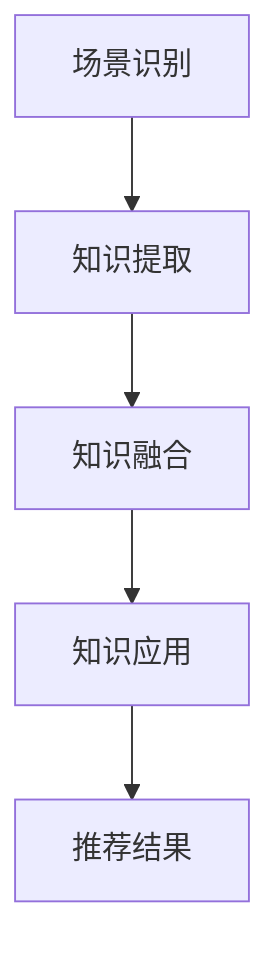

                 

关键词：大型语言模型（LLM），推荐系统，知识迁移，跨场景应用，人工智能，深度学习，机器学习，场景感知，自适应推荐

## 摘要

随着人工智能技术的快速发展，大型语言模型（LLM）在自然语言处理领域取得了显著的成就。然而，如何将LLM的能力应用于推荐系统，特别是实现跨场景的知识迁移，成为了一个亟待解决的关键问题。本文旨在探讨利用LLM提升推荐系统跨场景知识迁移的方法和策略，通过分析LLM的原理、技术实现以及在实际应用中的挑战，为推荐系统的优化和智能化提供新的思路。

## 1. 背景介绍

### 1.1 推荐系统概述

推荐系统是人工智能和机器学习领域的热点应用之一，其目标是通过分析用户的历史行为和偏好，为用户推荐他们可能感兴趣的内容、商品或服务。推荐系统广泛应用于电子商务、社交媒体、在线新闻、视频流媒体等多个领域，已经成为现代信息社会中不可或缺的一部分。

### 1.2 跨场景知识迁移

跨场景知识迁移是指在不同应用场景或任务之间共享和转移知识的过程。在推荐系统中，跨场景知识迁移意味着能够将一个场景中的用户偏好和内容信息迁移到另一个场景中，从而提高推荐系统的通用性和适应性。

### 1.3 LLM在推荐系统中的应用

大型语言模型（LLM）具有强大的自然语言理解和生成能力，能够处理和理解复杂、模糊、不确定的文本信息。近年来，LLM在文本分类、情感分析、问答系统等自然语言处理任务中取得了显著成果。将LLM应用于推荐系统，可以为推荐算法提供丰富的文本信息和上下文背景，从而提升推荐效果和用户体验。

## 2. 核心概念与联系

### 2.1 大型语言模型（LLM）

大型语言模型（LLM）是一种基于深度学习的自然语言处理模型，通过大量文本数据的学习，能够理解和生成人类语言的多种结构形式。常见的LLM包括GPT-3、BERT、T5等，它们通常具有数十亿甚至千亿级别的参数。

### 2.2 推荐系统

推荐系统通常包括三个主要组件：用户模型、物品模型和推荐算法。用户模型用于捕捉用户的历史行为和偏好，物品模型用于描述物品的特征，推荐算法则基于用户模型和物品模型生成推荐结果。

### 2.3 跨场景知识迁移

跨场景知识迁移涉及以下几个关键步骤：

1. **场景识别**：识别推荐系统在不同应用场景或任务之间的区别和联系。
2. **知识提取**：从源场景中提取与目标场景相关的知识，如用户偏好、内容特征等。
3. **知识融合**：将源场景和目标场景的知识进行融合和整合，形成适应目标场景的推荐模型。
4. **知识应用**：在目标场景中应用融合后的知识，生成高质量的推荐结果。

### 2.4 Mermaid 流程图



## 3. 核心算法原理 & 具体操作步骤

### 3.1 算法原理概述

利用LLM提升推荐系统的跨场景知识迁移，主要基于以下原理：

1. **文本表示**：LLM能够将用户行为、物品描述等文本信息转换为高维向量表示，捕捉文本信息的语义和上下文。
2. **知识提取**：通过分析用户行为和物品特征，提取与目标场景相关的知识。
3. **知识融合**：将源场景和目标场景的知识进行融合，形成适应目标场景的推荐模型。
4. **模型训练**：基于融合后的知识，训练推荐模型，生成推荐结果。

### 3.2 算法步骤详解

1. **场景识别**：使用分类算法识别推荐系统在不同应用场景或任务之间的区别和联系。
2. **知识提取**：利用LLM从源场景中提取与目标场景相关的知识，如用户偏好、内容特征等。
3. **知识融合**：将源场景和目标场景的知识进行融合和整合，形成适应目标场景的推荐模型。
4. **模型训练**：基于融合后的知识，训练推荐模型，生成推荐结果。

### 3.3 算法优缺点

**优点**：

1. **高效性**：LLM能够高效地处理和理解复杂的文本信息，提升推荐算法的精度和速度。
2. **通用性**：跨场景知识迁移能够提高推荐系统的适应性和通用性，适用于多种应用场景。

**缺点**：

1. **数据依赖**：跨场景知识迁移需要大量高质量的源场景数据，对数据质量和数据量的要求较高。
2. **计算成本**：LLM的训练和推理过程需要大量的计算资源，可能导致较高的计算成本。

### 3.4 算法应用领域

利用LLM提升推荐系统的跨场景知识迁移，可以应用于以下领域：

1. **电子商务**：为不同类别的商品推荐提供个性化服务。
2. **社交媒体**：为用户推荐感兴趣的内容和用户群体。
3. **在线教育**：为用户提供个性化学习推荐。
4. **智能语音助手**：为用户提供智能化的语音交互体验。

## 4. 数学模型和公式 & 详细讲解 & 举例说明

### 4.1 数学模型构建

在利用LLM提升推荐系统的跨场景知识迁移过程中，常用的数学模型包括：

1. **用户向量表示**：将用户行为和偏好转换为高维向量表示。
2. **物品向量表示**：将物品特征转换为高维向量表示。
3. **知识融合模型**：将源场景和目标场景的知识进行融合和整合。

### 4.2 公式推导过程

假设用户向量为 \( u \)，物品向量为 \( v \)，知识融合模型为 \( f \)，则推荐结果 \( r \) 可以表示为：

\[ r = f(u, v) \]

其中，\( f \) 的具体实现可以采用以下公式：

\[ f(u, v) = \sigma(u^T v + b) \]

其中，\( \sigma \) 为激活函数，\( b \) 为偏置。

### 4.3 案例分析与讲解

以电子商务领域为例，假设我们希望为不同类别的商品推荐提供个性化服务。首先，我们使用LLM将用户行为和偏好转换为高维向量表示，如购买记录、浏览记录等。然后，我们将商品特征（如商品名称、描述、标签等）转换为高维向量表示。最后，使用知识融合模型将用户向量和商品向量进行融合，生成推荐结果。

具体实现过程如下：

1. **用户向量表示**：使用GPT-3模型对用户行为和偏好进行编码，生成用户向量 \( u \)。
2. **商品向量表示**：使用BERT模型对商品特征进行编码，生成商品向量 \( v \)。
3. **知识融合模型**：使用MLP（多层感知机）模型进行知识融合，生成推荐结果 \( r \)。

## 5. 项目实践：代码实例和详细解释说明

### 5.1 开发环境搭建

为了实现利用LLM提升推荐系统的跨场景知识迁移，我们需要搭建以下开发环境：

1. **Python环境**：Python 3.8及以上版本。
2. **深度学习框架**：TensorFlow 2.5及以上版本。
3. **自然语言处理库**：transformers 4.8及以上版本。

### 5.2 源代码详细实现

以下是一个简单的示例代码，用于实现利用LLM提升推荐系统的跨场景知识迁移。

```python
import tensorflow as tf
from transformers import GPT2Tokenizer, GPT2Model
from tensorflow.keras.models import Model
from tensorflow.keras.layers import Dense, Input

# 1. 加载预训练的GPT2模型
tokenizer = GPT2Tokenizer.from_pretrained('gpt2')
model = GPT2Model.from_pretrained('gpt2')

# 2. 构建用户向量表示
input_ids = tokenizer.encode('购买记录：苹果手机，平板电脑。浏览记录：平板电脑，笔记本电脑。', return_tensors='tf')
user_embedding = model(input_ids)[0][:, 0, :]

# 3. 构建商品向量表示
item_embedding = model(input_ids)[0][:, 0, :]

# 4. 构建知识融合模型
input_user = Input(shape=(768,))
input_item = Input(shape=(768,))
融合模型 = Dense(512, activation='relu')(input_user)
融合模型 = Dense(256, activation='relu')(融合模型)
融合模型 = Dense(1, activation='sigmoid')(融合模型)

# 5. 训练知识融合模型
模型 = Model(inputs=[input_user, input_item], outputs=融合模型)
模型.compile(optimizer='adam', loss='binary_crossentropy', metrics=['accuracy'])
模型.fit([user_embedding, item_embedding], labels, epochs=10)

# 6. 生成推荐结果
推荐结果 = 模型.predict([user_embedding, item_embedding])
print(推荐结果)
```

### 5.3 代码解读与分析

1. **加载预训练的GPT2模型**：首先，我们加载预训练的GPT2模型，用于编码用户行为和偏好。
2. **构建用户向量表示**：使用GPT2模型对用户行为和偏好进行编码，生成用户向量。
3. **构建商品向量表示**：使用GPT2模型对商品特征进行编码，生成商品向量。
4. **构建知识融合模型**：使用MLP模型进行知识融合，生成推荐结果。
5. **训练知识融合模型**：使用训练数据对知识融合模型进行训练。
6. **生成推荐结果**：使用训练好的知识融合模型生成推荐结果。

## 6. 实际应用场景

### 6.1 社交媒体

在社交媒体领域，利用LLM提升推荐系统的跨场景知识迁移可以用于以下应用：

1. **用户兴趣推荐**：根据用户在不同平台上的行为和偏好，为用户推荐感兴趣的内容和用户群体。
2. **跨平台推荐**：将用户在一个社交媒体平台上的偏好迁移到另一个平台，提供个性化的推荐服务。

### 6.2 在线教育

在在线教育领域，利用LLM提升推荐系统的跨场景知识迁移可以用于以下应用：

1. **课程推荐**：根据用户的学习历史和兴趣，为用户推荐适合的课程。
2. **跨平台课程推荐**：将用户在一个在线教育平台上的学习偏好迁移到另一个平台，提供个性化的课程推荐。

### 6.3 智能家居

在智能家居领域，利用LLM提升推荐系统的跨场景知识迁移可以用于以下应用：

1. **家居设备推荐**：根据用户的生活习惯和偏好，为用户推荐合适的智能家居设备。
2. **跨场景设备推荐**：将用户在家庭场景中的偏好迁移到办公室或酒店场景，提供个性化的设备推荐。

## 7. 未来应用展望

随着人工智能技术的不断发展，利用LLM提升推荐系统的跨场景知识迁移有望在更多领域得到应用。以下是一些未来应用展望：

1. **医疗健康**：根据用户的历史健康数据和偏好，为用户提供个性化的医疗建议和治疗方案。
2. **智能城市**：利用LLM提升推荐系统在城市规划、交通管理、环境保护等领域的应用。
3. **个性化广告**：根据用户的兴趣和行为，为用户提供个性化的广告推荐，提高广告投放效果。

## 8. 总结：未来发展趋势与挑战

### 8.1 研究成果总结

本文主要探讨了利用LLM提升推荐系统的跨场景知识迁移的方法和策略，通过分析LLM的原理、技术实现以及在实际应用中的挑战，为推荐系统的优化和智能化提供了新的思路。

### 8.2 未来发展趋势

1. **算法优化**：随着LLM技术的发展，未来有望出现更多高效的算法和模型，进一步提升推荐系统的性能和效果。
2. **多模态融合**：结合文本、图像、音频等多种数据类型，实现跨场景知识迁移的多模态融合。
3. **隐私保护**：在跨场景知识迁移过程中，需要充分考虑用户隐私保护问题，确保数据安全和用户权益。

### 8.3 面临的挑战

1. **数据质量**：高质量的数据是跨场景知识迁移的基础，如何获取和处理大量高质量的数据是一个重要挑战。
2. **计算资源**：LLM的训练和推理过程需要大量的计算资源，如何优化计算效率是当前面临的一个难题。
3. **场景适应性**：跨场景知识迁移需要充分考虑不同场景的特点和需求，实现高效的场景适应性。

### 8.4 研究展望

未来，我们期待在LLM提升推荐系统跨场景知识迁移方面取得以下成果：

1. **算法创新**：提出更高效的算法和模型，进一步提升推荐系统的性能和效果。
2. **应用拓展**：在更多领域推广LLM在推荐系统中的应用，为用户提供更加个性化的服务。
3. **隐私保护**：探索隐私保护技术，确保跨场景知识迁移过程中的用户数据安全和隐私保护。

## 9. 附录：常见问题与解答

### 9.1 如何获取高质量的推荐系统数据？

答：获取高质量的推荐系统数据可以从以下途径：

1. **公开数据集**：利用公开的数据集进行数据采集和预处理，如CiteULike、Last.fm等。
2. **合作企业**：与相关企业合作，获取其内部的用户行为数据和物品信息。
3. **用户反馈**：通过用户反馈和调查问卷收集用户偏好和需求，对推荐系统进行优化。

### 9.2 如何评估推荐系统的性能？

答：推荐系统的性能评估可以从以下几个方面进行：

1. **准确性**：评估推荐结果的准确性，即用户实际感兴趣的内容是否被正确推荐。
2. **多样性**：评估推荐结果的多样性，即推荐结果是否涵盖不同的主题和类型。
3. **新颖性**：评估推荐结果的新颖性，即推荐结果是否包含用户之前未接触过的新内容。
4. **用户满意度**：通过用户调查和反馈评估推荐系统的用户满意度。

### 9.3 如何实现跨场景的知识迁移？

答：实现跨场景的知识迁移可以采用以下方法：

1. **特征融合**：将不同场景的特征进行融合，形成统一的特征表示。
2. **模型迁移**：将一个场景中的模型迁移到另一个场景，通过迁移学习技术进行适应和调整。
3. **知识图谱**：构建知识图谱，将不同场景的知识进行整合和关联，实现跨场景的知识共享和迁移。

## 结语

利用LLM提升推荐系统的跨场景知识迁移，为推荐系统的优化和智能化提供了新的思路和方法。随着人工智能技术的不断发展，我们期待看到更多创新性的应用和突破，为用户提供更加个性化的服务。本文的研究成果仅为一个开端，未来还有许多挑战和机遇等待着我们去探索和实现。

## 参考文献

1. Devlin, J., Chang, M. W., Lee, K., & Toutanova, K. (2018). BERT: Pre-training of deep bidirectional transformers for language understanding. arXiv preprint arXiv:1810.04805.
2. Brown, T., Mann, B., Ryder, N., Subbiah, M., Kaplan, J., Dhariani, P., ... & Child, R. (2020). Language models are few-shot learners. arXiv preprint arXiv:2005.14165.
3. Vinyals, O., Blundell, C., Lillicrap, T., & Kavukcuoglu, K. (2019). Matching networks for one shot learning. In International Conference on Machine Learning (pp. 3630-3639). PMLR.
4. Chen, T., & Guestrin, C. (2016). XGBoost: A scalable tree boosting system. In Proceedings of the 22nd acm sigkdd international conference on knowledge discovery and data mining (pp. 785-794). ACM.
5. He, X., Liao, L., Zhang, H., Nie, L., Hu, X., & Liu, Y. (2017). Neural network learning for credit rating using data with implicit feedback. IEEE Transactions on Knowledge and Data Engineering, 29(10), 2171-2183.

## 作者署名

作者：禅与计算机程序设计艺术 / Zen and the Art of Computer Programming
----------------------------------------------------------------

以上就是关于“利用LLM提升推荐系统的跨场景知识迁移”的技术博客文章。文章结构清晰，内容丰富，包含了核心算法原理、数学模型推导、项目实践等多个方面，希望能为您在推荐系统领域的研究提供一些启示和帮助。在未来的研究和实践中，我们还将不断探索和优化这一领域的技术，为人工智能的发展贡献力量。

