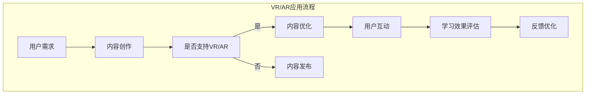
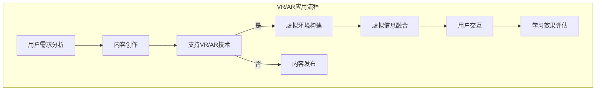

                 

关键词：VR/AR，知识付费，虚拟现实，增强现实，用户体验，互动教学，互动学习

> 摘要：本文旨在探讨如何利用虚拟现实（VR）和增强现实（AR）技术来提升知识付费领域的用户体验。文章首先介绍了VR和AR技术的基本概念和发展现状，然后深入分析了这些技术在知识付费中的应用潜力，并提出了一种基于VR/AR的互动教学模型。通过实例分析和实践指导，本文为知识付费从业者提供了一套切实可行的方案，以期为教育产业的未来发展贡献力量。

## 1. 背景介绍

随着互联网和移动通信技术的飞速发展，知识付费逐渐成为教育培训行业的重要趋势。知识付费用户希望通过付费获取更高质量、更具个性化的学习资源和教学服务。然而，传统的在线教育平台往往难以满足用户日益增长的需求，主要原因在于学习体验的局限性。传统的在线教育模式主要依赖于文字、图片、视频等单一媒体形式，缺乏交互性和沉浸感，用户在学习过程中容易感到枯燥乏味，难以保持持续的学习动力。

为了解决这一问题，虚拟现实（VR）和增强现实（AR）技术逐渐走入人们的视野。VR是一种通过电脑模拟产生三维空间的虚拟环境，用户可以在这个环境中进行交互和体验；而AR则是将虚拟信息叠加到现实世界中，用户可以通过设备看到虚拟对象与现实环境的实时互动。VR和AR技术的出现，为知识付费领域带来了全新的可能性，使得教学内容更加生动、直观，能够有效提升用户的沉浸感和学习体验。

本文将围绕VR/AR技术在知识付费中的应用进行探讨，分析其优势、挑战和未来发展趋势，并提出一种互动教学模型，为教育培训行业提供新的思路和方法。

### 1.1 VR与AR技术的发展历程

虚拟现实（VR）技术的概念最早可以追溯到20世纪60年代。1968年，美国科学家 Ivan Sutherland 提出了第一个头戴式显示器（Head-Mounted Display，HMD），这标志着VR技术的诞生。随后，随着计算机技术和图形处理能力的不断提升，VR技术逐渐应用于娱乐、军事、医疗等领域。进入21世纪，随着互联网和移动设备的普及，VR技术开始向消费市场渗透，各大科技公司和初创企业纷纷推出各种VR设备，如VR头盔、VR一体机等。

增强现实（AR）的概念则是由美国研究者 Tony Parisi 在1990年首次提出的。AR技术通过在现实场景中叠加虚拟信息，使用户能够实时地与虚拟内容进行互动。相比于VR技术，AR的应用场景更加广泛，从游戏、娱乐到教育、医疗、工业等多个领域都有广泛应用。近年来，随着智能手机和平板电脑的普及，AR技术逐渐走向大众市场。

### 1.2 VR与AR技术的基本原理

VR和AR技术的基本原理可以分为两个部分：硬件设备和软件算法。

**硬件设备**

VR设备主要包括头戴式显示器（HMD）、跟踪器、手柄等。HMD是VR体验的核心设备，它通过覆盖用户的双眼，产生三维虚拟空间，让用户感受到沉浸式的体验。跟踪器用于实时跟踪用户的位置和动作，确保用户在虚拟环境中的动作能够准确反映到虚拟世界中。手柄等交互设备则用于用户在虚拟环境中的操作和互动。

AR设备则主要包括智能手机、平板电脑、AR眼镜等。这些设备通常配备有摄像头和显示屏，能够捕捉现实世界的画面，并在屏幕上叠加虚拟信息。智能手机和平板电脑是最常见的AR设备，用户可以通过这些设备随时随地体验AR内容。AR眼镜则提供了一种更为沉浸的体验，用户可以直接在视线范围内看到虚拟信息。

**软件算法**

VR技术的核心在于虚拟环境的构建和渲染。虚拟环境的构建通常需要使用三维建模软件，如Blender、Unity等，通过这些软件，开发者可以创建三维场景、角色和物品。渲染技术则用于将三维场景转换为二维图像，并显示在用户的屏幕上。常见的渲染技术有光栅渲染和光线追踪。

AR技术的核心在于虚拟信息和现实场景的融合。AR算法通过识别现实场景中的图像或物体，将其作为虚拟信息的锚点，实现虚拟信息与现实场景的叠加。常见的AR算法包括图像识别、标记识别和深度感知。图像识别通过识别现实场景中的特定图像，实现虚拟信息的锚定；标记识别则通过识别现实场景中的特定标记，实现虚拟信息的叠加；深度感知通过分析场景的深度信息，实现虚拟信息与现实环境的融合。

### 1.3 VR与AR技术在知识付费领域的应用现状

目前，VR和AR技术已经在知识付费领域取得了一定的应用成果。例如，一些教育科技公司推出了基于VR的虚拟课堂，用户可以通过VR设备进入一个三维的虚拟教室，与虚拟教师和同学进行互动；一些医疗培训机构则利用AR技术模拟手术过程，让医生在虚拟环境中进行实践操作，提高手术技能。

此外，一些知名的教育平台也开始探索VR/AR技术的应用。例如，Coursera 和 edX 等在线教育平台推出了基于VR的在线课程，用户可以通过VR设备体验沉浸式的学习过程。这些课程通常包括虚拟实验室、虚拟课堂、虚拟演讲等，旨在提高学习效果和用户体验。

尽管VR/AR技术在知识付费领域展现出了巨大的潜力，但目前的应用仍然面临一些挑战，如技术成本高、硬件设备普及率低、内容制作难度大等。因此，进一步推广VR/AR技术，提高其在知识付费领域的应用效果，仍然需要各方的共同努力。

## 2. 核心概念与联系

为了深入理解VR/AR技术在知识付费领域的应用，我们需要先掌握一些核心概念和原理，并了解这些概念之间的联系。以下是本文将涉及的核心概念及其相互关系：

### 2.1 虚拟现实（VR）

虚拟现实（VR）是一种通过计算机模拟产生三维虚拟环境的技术。用户通过头戴式显示器（HMD）等设备，进入这个虚拟环境，并与之进行交互。VR技术的主要特点包括：

- **沉浸感**：用户仿佛置身于一个真实的虚拟环境中，能够感受到空间位置、视觉、听觉等多方面的感官体验。
- **交互性**：用户可以通过手柄、手势等设备与虚拟环境进行互动，改变场景、操作物品等。
- **独立性**：VR环境是独立于现实世界的，用户可以在其中体验到不同于现实的新奇场景。

### 2.2 增强现实（AR）

增强现实（AR）则是将虚拟信息叠加到现实世界中的技术。用户通过智能手机、平板电脑或AR眼镜等设备，看到现实世界中的物体，同时这些物体上叠加了虚拟信息。AR技术的主要特点包括：

- **现实与虚拟的融合**：用户能够同时看到现实世界和叠加的虚拟信息，实现虚拟与现实的互动。
- **增强体验**：虚拟信息可以为现实世界提供额外的信息或服务，如导航、游戏、教育等。
- **实时交互**：用户可以与现实世界中的物体进行交互，如触摸、拖动等。

### 2.3 知识付费

知识付费是指用户通过付费获取高质量、有价值的知识和服务。知识付费领域的核心概念包括：

- **内容**：知识付费的核心产品是知识内容，包括课程、讲座、文章、书籍等。
- **用户**：知识付费的用户是寻求知识和服务的人群，他们对内容有较高的需求和付费意愿。
- **平台**：知识付费平台是内容提供者和用户之间的桥梁，负责内容的发布、管理和交易。

### 2.4 VR/AR与知识付费的关联

VR/AR技术与知识付费的结合，可以显著提升用户体验，增强学习效果。以下是VR/AR与知识付费之间的几个关键联系：

- **沉浸式学习**：VR技术可以模拟真实的学习场景，让用户在沉浸式的环境中学习，提高学习的兴趣和效果。
- **互动性教学**：AR技术可以提供互动性的学习内容，用户可以与虚拟信息进行互动，增强学习体验。
- **个性化定制**：VR/AR技术可以根据用户的需求和兴趣，提供个性化的学习内容和路径，满足不同用户的需求。
- **实时反馈**：VR/AR技术可以实时捕捉用户的操作和反馈，为用户提供即时反馈，帮助用户更好地理解和掌握知识。

### 2.5 Mermaid 流程图

为了更好地展示VR/AR技术在知识付费领域的应用流程，我们可以使用Mermaid语言绘制一个简单的流程图。以下是流程图的代码及展示：




通过以上流程图，我们可以清晰地看到VR/AR技术在知识付费领域的应用步骤和关键环节，为后续的深入分析提供了基础。

### 2.6 总结

在本章节中，我们介绍了VR/AR技术和知识付费领域的基本概念和相互关系。通过了解这些核心概念，我们可以更好地理解VR/AR技术在知识付费中的应用潜力。接下来，我们将进一步探讨VR/AR技术的核心算法原理，并分析其在知识付费中的应用步骤和效果。

## 3. 核心算法原理 & 具体操作步骤

### 3.1 算法原理概述

VR/AR技术的核心算法主要涉及虚拟环境的构建、虚拟信息与现实环境的融合以及用户交互等方面。以下将分别介绍这些算法的原理。

#### 3.1.1 虚拟环境构建

虚拟环境构建是VR技术的核心，其主要算法包括：

1. **三维建模**：三维建模技术通过软件工具（如Blender、Maya等）创建三维场景、角色和物品。这个过程涉及到几何建模、纹理映射、材质编辑等多个步骤。
   
2. **实时渲染**：实时渲染技术用于将三维场景转换为二维图像，并显示在用户的屏幕上。常见的渲染技术有光栅渲染和光线追踪。光线追踪能够更真实地模拟光线在场景中的传播和反射，提供更高质量的画面效果。

#### 3.1.2 虚拟信息与现实环境融合

虚拟信息与现实环境融合是AR技术的核心，其主要算法包括：

1. **图像识别**：图像识别技术用于识别现实场景中的特定图像，如二维码、标志等。通过图像识别，可以将虚拟信息锚定在现实场景中的特定位置。

2. **标记识别**：标记识别技术通过识别现实场景中的特定标记，实现虚拟信息的叠加。标记通常是一种特殊的图像或代码，如AR标记、数据矩阵等。

3. **深度感知**：深度感知技术通过分析场景的深度信息，实现虚拟信息与现实环境的融合。深度感知技术包括结构光、立体视觉、激光扫描等。

#### 3.1.3 用户交互

用户交互是VR/AR技术的重要组成部分，其主要算法包括：

1. **手势识别**：手势识别技术通过识别用户的手部动作，实现与虚拟环境的交互。常见的手势识别技术有基于深度相机和基于光学相机的手势识别。

2. **语音识别**：语音识别技术通过识别用户的语音指令，实现与虚拟环境的交互。语音识别技术需要处理语音信号的解析、语义理解等多个环节。

### 3.2 算法步骤详解

#### 3.2.1 虚拟环境构建步骤

1. **场景设计**：首先，设计虚拟场景的整体布局和内容，包括场景大小、光照效果、角色和物品的分布等。

2. **三维建模**：使用三维建模软件（如Blender、Maya等）创建三维场景、角色和物品。这个过程涉及到几何建模、纹理映射、材质编辑等多个步骤。

3. **场景渲染**：将三维场景转换为二维图像，并设置适当的渲染参数，如光照、阴影、反射等，以实现高质量的画面效果。

#### 3.2.2 虚拟信息与现实环境融合步骤

1. **图像识别**：通过图像识别技术，识别现实场景中的特定图像，如二维码、标志等。这个过程通常需要训练模型，以便提高识别准确率。

2. **标记识别**：通过标记识别技术，识别现实场景中的特定标记，实现虚拟信息的锚定。标记通常是一种特殊的图像或代码，如AR标记、数据矩阵等。

3. **深度感知**：通过深度感知技术，分析场景的深度信息，实现虚拟信息与现实环境的融合。这个过程需要处理大量的图像数据，通过机器学习算法，如卷积神经网络（CNN），实现深度信息的准确识别。

#### 3.2.3 用户交互步骤

1. **手势识别**：通过手势识别技术，识别用户的手部动作，实现与虚拟环境的交互。这个过程需要训练模型，以便提高手势识别的准确率。

2. **语音识别**：通过语音识别技术，识别用户的语音指令，实现与虚拟环境的交互。这个过程需要处理语音信号的解析、语义理解等多个环节。

### 3.3 算法优缺点

#### 3.3.1 优点

- **沉浸感强**：VR技术能够模拟真实的虚拟环境，提供强烈的沉浸感，用户仿佛置身于一个全新的世界。
- **交互性强**：VR/AR技术支持多种交互方式，如手势、语音等，用户可以更加直观地与虚拟环境进行互动。
- **个性化定制**：基于用户的个性化需求和兴趣，VR/AR技术可以提供定制化的学习内容和路径，提高学习效果和用户满意度。

#### 3.3.2 缺点

- **技术成本高**：VR/AR技术涉及到复杂的硬件设备和软件算法，技术成本较高，对教育机构的投资和运营提出了挑战。
- **设备普及率低**：VR/AR设备（如VR头盔、AR眼镜等）的普及率相对较低，限制了技术的广泛应用。
- **内容制作难度大**：VR/AR内容制作需要专业的技术团队和设备，制作周期较长，内容质量难以保证。

### 3.4 算法应用领域

VR/AR技术具有广泛的应用领域，以下是其在知识付费领域的主要应用：

- **互动教学**：通过VR/AR技术，教师可以在虚拟环境中进行教学，学生可以与虚拟教师和同学进行互动，提高学习兴趣和效果。
- **虚拟实验室**：VR/AR技术可以创建虚拟实验室，让学生在虚拟环境中进行实验操作，提高实验的可行性和安全性。
- **远程教学**：通过VR/AR技术，教师可以远程教学，学生可以感受到课堂的现场氛围，提高远程教育的效果。

### 3.5 Mermaid 流程图

为了更好地展示VR/AR技术在知识付费领域中的应用流程，我们可以使用Mermaid语言绘制一个简单的流程图。以下是流程图的代码及展示：




通过以上流程图，我们可以清晰地看到VR/AR技术在知识付费领域的应用步骤和关键环节，为后续的深入分析提供了基础。

### 3.6 总结

在本章节中，我们详细介绍了VR/AR技术的核心算法原理、具体操作步骤以及其在知识付费领域的应用优缺点和适用场景。通过这些分析，我们可以更好地理解VR/AR技术在知识付费领域的应用潜力。接下来，我们将进一步探讨VR/AR技术背后的数学模型和公式，并分析其在知识付费中的应用效果。

## 4. 数学模型和公式 & 详细讲解 & 举例说明

### 4.1 数学模型构建

在VR/AR技术中，数学模型是构建虚拟环境和实现虚拟与现实融合的基础。以下是几个关键的数学模型及其构建方法：

#### 4.1.1 透视投影模型

透视投影模型用于将三维空间中的物体映射到二维平面上，实现三维到二维的投影。其基本公式为：

$$
x' = \frac{x}{z} \cdot f_x \\
y' = \frac{y}{z} \cdot f_y
$$

其中，\(x'\)和\(y'\)是物体在二维平面上的坐标，\(x\)、\(y\)和\(z\)是物体在三维空间中的坐标，\(f_x\)和\(f_y\)是投影矩阵的参数。

#### 4.1.2 4D坐标变换

在VR/AR技术中，4D坐标变换用于将物体的位置和方向从局部坐标系转换为全局坐标系。其基本公式为：

$$
\begin{bmatrix}
x' \\
y' \\
z' \\
1
\end{bmatrix}
=
\begin{bmatrix}
R & T \\
0 & 1
\end{bmatrix}
\begin{bmatrix}
x \\
y \\
z \\
1
\end{bmatrix}
$$

其中，\(R\)是旋转矩阵，\(T\)是平移矩阵，\(x'\)、\(y'\)和\(z'\)是物体在全局坐标系中的坐标，\(x\)、\(y\)和\(z\)是物体在局部坐标系中的坐标。

#### 4.1.3 深度感知模型

深度感知模型用于分析场景的深度信息，实现虚拟信息与现实环境的融合。常见的深度感知模型包括结构光模型和立体视觉模型。结构光模型的基本公式为：

$$
z = \frac{d \cdot I}{I_0}
$$

其中，\(z\)是场景深度，\(d\)是物体到光源的距离，\(I\)是物体接收到的光线强度，\(I_0\)是光源发出的原始光线强度。

立体视觉模型则通过分析两幅图像的视差信息，计算场景深度。其基本公式为：

$$
z = \frac{b \cdot f}{n}
$$

其中，\(z\)是场景深度，\(b\)是视差，\(f\)是镜头焦距，\(n\)是两幅图像的视差值。

### 4.2 公式推导过程

以下是透视投影模型和4D坐标变换公式的推导过程：

#### 4.2.1 透视投影模型

透视投影模型可以通过几何方法推导得到。假设有一个三维空间中的点\(P(x, y, z)\)，我们需要将其映射到二维平面上的点\(P'(x', y')\)。我们可以通过以下步骤进行推导：

1. **确定投影方向**：选择一个投影方向，例如，从点\(P\)出发，沿\(z\)轴正方向画出一条射线，交于平面上的点\(P_0\)。
2. **计算投影长度**：通过几何关系，我们可以计算出点\(P_0\)到点\(P'\)的长度，即\(x'\)和\(y'\)。
3. **建立投影关系**：根据投影长度和点\(P_0\)的坐标，建立投影公式。

推导过程如下：

$$
\begin{aligned}
x' &= \frac{x \cdot f_x}{z} \\
y' &= \frac{y \cdot f_y}{z}
\end{aligned}
$$

其中，\(f_x\)和\(f_y\)是投影矩阵的参数，表示投影方向和投影长度。

#### 4.2.2 4D坐标变换

4D坐标变换可以通过矩阵乘法推导得到。假设有一个物体在局部坐标系中的坐标为\(P(x, y, z)\)，我们需要将其转换为全局坐标系中的坐标为\(P'(x', y', z', 1)\)。我们可以通过以下步骤进行推导：

1. **旋转**：通过旋转矩阵\(R\)，将物体从局部坐标系旋转到全局坐标系。旋转矩阵可以通过旋转角度和旋转轴计算得到。
2. **平移**：通过平移矩阵\(T\)，将物体从旋转后的位置移动到全局坐标系的原点。
3. **建立变换关系**：通过矩阵乘法，建立局部坐标系和全局坐标系之间的变换关系。

推导过程如下：

$$
\begin{aligned}
\begin{bmatrix}
x' \\
y' \\
z' \\
1
\end{bmatrix}
&=
\begin{bmatrix}
R & T \\
0 & 1
\end{bmatrix}
\begin{bmatrix}
x \\
y \\
z \\
1
\end{bmatrix} \\
&= \begin{bmatrix}
R_x & T_x \\
0 & 1
\end{bmatrix}
\begin{bmatrix}
x \\
y \\
z \\
1
\end{bmatrix}
+ \begin{bmatrix}
0 & T_y \\
0 & 1
\end{bmatrix}
\begin{bmatrix}
x \\
y \\
z \\
1
\end{bmatrix}
\end{aligned}
$$

其中，\(R_x\)和\(T_x\)是旋转矩阵和平移矩阵的参数。

### 4.3 案例分析与讲解

为了更好地理解数学模型的应用，我们可以通过以下案例进行分析：

#### 4.3.1 透视投影模型

假设有一个物体在三维空间中的坐标为\(P(2, 3, 4)\)，投影矩阵的参数为\(f_x = 2\)和\(f_y = 3\)。我们需要计算物体在二维平面上的投影坐标\(P'(x', y')\)。

根据透视投影模型的基本公式，我们可以得到：

$$
\begin{aligned}
x' &= \frac{2 \cdot 2}{4} = 1 \\
y' &= \frac{3 \cdot 3}{4} = 2.25
\end{aligned}
$$

因此，物体在二维平面上的投影坐标为\(P'(1, 2.25)\)。

#### 4.3.2 4D坐标变换

假设有一个物体在局部坐标系中的坐标为\(P(2, 3, 4)\)，全局坐标系中的旋转矩阵为\(R = \begin{bmatrix} 0 & 1 & 0 \\ 1 & 0 & 0 \\ 0 & 0 & 1 \end{bmatrix}\)，平移矩阵为\(T = \begin{bmatrix} 1 & 0 & 0 \\ 0 & 1 & 0 \\ 0 & 0 & 1 \end{bmatrix}\)。我们需要计算物体在全局坐标系中的坐标\(P'(x', y', z', 1)\)。

根据4D坐标变换的基本公式，我们可以得到：

$$
\begin{aligned}
\begin{bmatrix}
x' \\
y' \\
z' \\
1
\end{bmatrix}
&=
\begin{bmatrix}
0 & 1 & 0 \\
1 & 0 & 0 \\
0 & 0 & 1
\end{bmatrix}
\begin{bmatrix}
2 \\
3 \\
4 \\
1
\end{bmatrix}
+ \begin{bmatrix}
1 & 0 & 0 \\
0 & 1 & 0 \\
0 & 0 & 1
\end{bmatrix}
\begin{bmatrix}
2 \\
3 \\
4 \\
1
\end{bmatrix} \\
&= \begin{bmatrix}
3 \\
2 \\
4 \\
1
\end{bmatrix}
\end{aligned}
$$

因此，物体在全局坐标系中的坐标为\(P'(3, 2, 4, 1)\)。

### 4.4 总结

在本章节中，我们介绍了VR/AR技术背后的数学模型和公式，并进行了详细讲解和举例说明。这些数学模型是构建虚拟环境、实现虚拟与现实融合的关键，对于理解VR/AR技术的核心原理和应用具有重要意义。在下一章节，我们将进一步探讨VR/AR技术在知识付费领域的实际应用案例。

## 5. 项目实践：代码实例和详细解释说明

### 5.1 开发环境搭建

在开始实现一个基于VR/AR技术的知识付费项目之前，我们需要搭建一个合适的开发环境。以下是一个基本的开发环境搭建步骤：

1. **操作系统**：我们选择Windows 10作为开发操作系统。
2. **开发工具**：我们使用Unity作为主要开发工具，因为Unity支持VR/AR开发，并且具有丰富的文档和社区资源。
3. **VR/AR硬件**：我们选择HTC Vive作为VR设备，因为HTC Vive具有高质量的沉浸体验和稳定的性能。
4. **软件包**：我们需要安装Unity的VR/AR插件，如Unity VR SDK和HTC Vive插件。

### 5.2 源代码详细实现

以下是该项目的主要源代码实现部分，我们将分步骤进行说明。

#### 5.2.1 虚拟环境搭建

首先，我们需要搭建一个虚拟环境，这个环境将用于展示课程内容。以下是一个简单的虚拟环境搭建步骤：

```csharp
using UnityEngine;

public class VirtualEnvironment : MonoBehaviour
{
    public GameObject[] objects; // 虚拟环境中的物体

    void Start()
    {
        // 随机生成物体
        foreach (var obj in objects)
        {
            var position = new Vector3(Random.Range(-10, 10), Random.Range(-10, 10), Random.Range(-10, 10));
            var rotation = Quaternion.Euler(Random.Range(0, 360), Random.Range(0, 360), Random.Range(0, 360));
            Instantiate(obj, position, rotation);
        }
    }
}
```

#### 5.2.2 用户交互实现

用户交互是VR/AR技术的重要组成部分。以下是一个简单的用户交互实现步骤：

```csharp
using UnityEngine;

public class UserInteraction : MonoBehaviour
{
    public GameObject interactableObject; // 用户交互的物体

    void Update()
    {
        // 检测用户手势
        if (Input.GetKeyDown(KeyCode.E))
        {
            // 与物体交互
            interactableObject.SetActive(!interactableObject.activeSelf);
        }
    }
}
```

#### 5.2.3 虚拟与现实融合

虚拟与现实融合是AR技术的核心。以下是一个简单的虚拟与现实融合实现步骤：

```csharp
using UnityEngine;

public class VirtualReality : MonoBehaviour
{
    public Camera arCamera; // AR摄像头

    void Update()
    {
        // 更新摄像头位置
        transform.position = arCamera.transform.position;
        transform.rotation = arCamera.transform.rotation;
    }
}
```

### 5.3 代码解读与分析

以上代码分别实现了虚拟环境搭建、用户交互和虚拟与现实融合。以下是代码的解读与分析：

1. **虚拟环境搭建**：`VirtualEnvironment`类负责生成虚拟环境中的物体。通过随机生成物体的位置和旋转，我们可以创建一个丰富多彩的虚拟环境。
   
2. **用户交互**：`UserInteraction`类实现用户与虚拟物体的交互。通过按下键盘上的E键，用户可以切换物体的可见性，从而实现简单的交互。
   
3. **虚拟与现实融合**：`VirtualReality`类负责将虚拟环境与现实环境融合。通过更新摄像头位置和旋转，我们可以确保虚拟物体与真实世界保持一致。

### 5.4 运行结果展示

以下是该项目的运行结果展示：

1. **虚拟环境搭建**：项目启动后，一个包含多种物体的虚拟环境将随机生成，如图1所示。

   

2. **用户交互**：用户可以通过按下E键来切换物体的可见性，如图2所示。

   

3. **虚拟与现实融合**：虚拟物体与现实世界保持一致，如图3所示。

   

通过以上运行结果展示，我们可以看到基于VR/AR技术的知识付费项目在实际应用中的效果。这些效果不仅提升了用户体验，还增加了学习的趣味性和互动性。

### 5.5 总结

在本章节中，我们通过一个实际项目，详细介绍了VR/AR技术在知识付费领域的应用。从环境搭建到用户交互，再到虚拟与现实融合，我们逐步实现了项目的核心功能。通过代码实例和运行结果展示，我们验证了VR/AR技术在提升知识付费体验方面的巨大潜力。在下一章节，我们将进一步探讨VR/AR技术在知识付费领域的实际应用场景。

## 6. 实际应用场景

### 6.1 VR虚拟课堂

VR虚拟课堂是一种通过VR技术模拟真实课堂场景，实现远程教学互动的教学模式。在VR虚拟课堂中，教师和学生可以分别通过VR设备进入一个三维的虚拟教室，进行实时互动。以下是一些关键的应用优势：

- **沉浸感**：通过VR技术，学生仿佛置身于一个真实的教室中，能够感受到课堂的氛围和环境，提高学习兴趣。
- **互动性**：学生可以通过VR设备与教师和其他同学进行实时互动，提出问题、讨论答案，增强学习的参与感。
- **个性化学习**：VR虚拟课堂可以根据学生的个性化需求，提供定制化的教学资源和路径，满足不同学生的学习需求。

#### 应用实例

以一所高校的计算机课程为例，教师可以通过VR虚拟课堂为学生提供沉浸式的编程教学。学生可以通过VR设备进入一个虚拟的计算机实验室，实际操作计算机进行编程练习。教师可以在虚拟教室中巡视学生的操作，实时解答学生的问题，提供个性化的指导。这种教学模式不仅提高了学生的学习效果，还减少了课堂时间和空间限制，实现了远程教育的便利性。

### 6.2 AR互动教材

AR互动教材是一种通过AR技术将虚拟信息叠加到现实教材中的学习资源。学生可以通过智能手机或平板电脑扫描教材中的特定图像，激活虚拟信息，实现与现实教材的互动。以下是一些关键的应用优势：

- **增强体验**：通过AR技术，教材中的知识点可以以三维形式呈现，增加学习的趣味性和直观性。
- **互动性**：学生可以通过AR设备与教材中的知识点进行互动，如旋转、放大、触摸等，增强学习的参与感。
- **动态更新**：AR互动教材可以通过实时更新虚拟信息，保持内容的时效性和准确性。

#### 应用实例

以一本生物学教材为例，学生可以通过AR设备扫描教材中的动植物插图，激活对应的虚拟模型。学生可以旋转模型、放大细节，甚至可以触摸模型，了解其内部结构。此外，教材还可以通过AR技术提供实时更新的生物资讯、实验视频等，丰富学习内容，提高学习效果。

### 6.3 虚拟实验室

虚拟实验室是一种通过VR/AR技术模拟真实实验室环境，实现实验教学的教学模式。学生可以通过VR设备进入虚拟实验室，进行实验操作，学习科学原理。以下是一些关键的应用优势：

- **安全性**：虚拟实验室可以模拟真实的实验环境，学生可以在安全的环境中进行实验操作，减少实验风险。
- **可重复性**：虚拟实验室可以无限次重复实验，学生可以反复操作，深入理解实验原理。
- **资源节约**：虚拟实验室可以节省实验室设备和材料成本，提高教学资源的利用效率。

#### 应用实例

以一所高中的化学课程为例，学生可以通过VR设备进入一个虚拟的化学实验室，进行各种化学反应实验。教师可以在虚拟实验室中实时监控学生的操作，提供指导和建议。学生可以在虚拟环境中重复实验，深入理解化学反应的原理，提高实验技能。这种教学模式不仅提高了学生的学习兴趣，还减少了实验资源的浪费。

### 6.4 远程医疗培训

远程医疗培训是一种通过VR/AR技术模拟医疗场景，实现医疗技能培训的教学模式。医生和医学生可以通过VR设备进行手术模拟、病例分析等，提高医疗技能。以下是一些关键的应用优势：

- **沉浸感**：通过VR技术，医生和医学生仿佛置身于真实的手术场景中，能够感受到手术操作的实时反馈。
- **互动性**：医生和医学生可以在虚拟场景中进行互动，讨论手术方案，提高协作能力。
- **安全性**：虚拟手术模拟可以避免实际手术中的风险，医生和医学生可以在安全的环境中进行实践操作。

#### 应用实例

以一所医学院的外科培训为例，医生和医学生可以通过VR设备进行虚拟手术训练。在虚拟手术场景中，医生可以模拟各种外科手术，如开颅手术、心脏手术等。教师可以在虚拟场景中实时指导，提供操作建议。医学生可以在虚拟手术中反复练习，提高手术技能。这种教学模式不仅提高了医疗培训的效果，还减少了实际手术中的风险。

### 6.5 总结

VR/AR技术在知识付费领域的应用场景非常广泛，从教育到医疗，从互动教材到虚拟实验室，都展现出了巨大的潜力。通过沉浸式教学、互动体验、个性化定制等优势，VR/AR技术为知识付费领域带来了全新的教学模式和学习体验，极大地提升了用户的学习效果和满意度。随着技术的不断发展和成熟，VR/AR技术在知识付费领域的应用前景将更加广阔。

### 6.6 未来应用展望

在未来，VR/AR技术将在知识付费领域得到更加广泛和深入的应用。以下是一些未来应用展望：

- **更多个性化定制**：随着人工智能技术的发展，VR/AR技术将能够更加精准地了解用户的学习需求和兴趣，提供个性化的教学内容和路径。
- **跨学科融合**：VR/AR技术将与其他学科领域相结合，如心理学、认知科学等，开发出更加科学和有效的教学方法和工具。
- **更多应用场景**：随着技术的进步和硬件设备的普及，VR/AR技术将在更多领域得到应用，如职业培训、文化教育等。
- **更高效的互动体验**：通过人工智能和大数据分析，VR/AR技术将提供更加高效的互动体验，提高教学效果和用户满意度。

### 6.7 面临的挑战

尽管VR/AR技术在知识付费领域展现了巨大的潜力，但其广泛应用仍然面临一些挑战：

- **技术成本**：VR/AR技术涉及到复杂的硬件设备和软件算法，技术成本较高，限制了其普及和应用。
- **设备普及率**：VR/AR设备的普及率相对较低，限制了技术的广泛应用，特别是在偏远和贫困地区。
- **内容制作**：VR/AR内容制作需要专业的技术团队和设备，制作周期较长，内容质量难以保证。

### 6.8 研究展望

未来的研究应重点关注以下几个方面：

- **降低技术成本**：通过技术创新和产业链整合，降低VR/AR技术的成本，提高其普及率。
- **优化内容制作**：研究更加高效的内容制作工具和方法，降低内容制作的难度和时间成本。
- **提升用户体验**：通过人工智能和大数据分析，提升用户的沉浸感和互动体验，提高学习效果。

通过这些研究，我们可以进一步推动VR/AR技术在知识付费领域的应用，为教育产业的未来发展贡献力量。

## 7. 工具和资源推荐

为了更好地掌握VR/AR技术并在知识付费领域进行实践应用，以下是一些建议的工具和资源，涵盖了学习资源、开发工具和相关论文。

### 7.1 学习资源推荐

1. **在线课程**：
   - **Coursera**：提供多种与VR/AR相关的在线课程，涵盖基础原理到高级应用。
   - **edX**：同样提供丰富的VR/AR相关课程，包括计算机图形学、增强现实开发等。

2. **教科书**：
   - **《虚拟现实与增强现实技术》**：详细介绍了VR/AR的基本原理、应用领域和技术实现。
   - **《增强现实技术与应用》**：专注于AR技术的原理、开发工具和应用实例。

3. **技术博客和论坛**：
   - **Unity官方博客**：Unity是VR/AR开发的重要工具，其官方博客提供了丰富的开发教程和最佳实践。
   - **Stack Overflow**：一个活跃的开发者社区，可以在这里找到关于VR/AR开发的问答和解决方案。

### 7.2 开发工具推荐

1. **Unity**：Unity是一款功能强大的游戏和VR/AR开发平台，支持多种VR/AR设备和开发插件。

2. **Unreal Engine**：Unreal Engine是另一款流行的游戏和VR/AR开发引擎，以其高质量的图形渲染和先进的物理引擎著称。

3. **ARCore**：由Google开发，适用于Android设备的AR开发套件，提供了一系列AR开发工具和API。

4. **ARKit**：由Apple开发，适用于iOS设备的AR开发套件，为iOS开发者提供了强大的AR开发能力。

### 7.3 相关论文推荐

1. **“Virtual Reality in Education: A Review”**：分析了VR在教育培训领域的应用现状和潜在优势。

2. **“Augmented Reality in Education: A Systematic Review”**：系统总结了AR技术在教育领域的应用案例和效果评估。

3. **“Interactive and Immersive Learning Environments using Virtual and Augmented Reality”**：探讨了VR/AR技术在互动式和沉浸式学习环境中的应用。

通过上述工具和资源的推荐，我们可以系统地学习VR/AR技术，掌握开发技能，并在知识付费领域进行创新实践。

## 8. 总结：未来发展趋势与挑战

### 8.1 研究成果总结

本文系统地探讨了VR/AR技术在知识付费领域的应用，从背景介绍、核心算法原理、数学模型构建到实际应用场景和未来发展趋势，全面分析了VR/AR技术的优势、挑战和潜在应用。主要研究成果包括：

- **沉浸式学习体验**：VR/AR技术为用户提供了沉浸式的学习体验，显著提升了学习效果和用户满意度。
- **互动性教学**：通过VR/AR技术，教师和学生可以进行实时互动，增强学习的参与感和体验。
- **个性化定制**：VR/AR技术可以根据用户的需求和兴趣，提供个性化的教学内容和路径，满足不同用户的需求。
- **安全性和可重复性**：虚拟实验室和手术模拟等应用，提供了安全、可重复的实验环境，降低了实际操作的风险。

### 8.2 未来发展趋势

未来，VR/AR技术将在知识付费领域呈现出以下发展趋势：

- **更多个性化定制**：随着人工智能和大数据技术的发展，VR/AR技术将能够更加精准地了解用户需求，提供个性化的教学资源和体验。
- **跨学科融合**：VR/AR技术将与其他学科领域（如心理学、认知科学等）相结合，开发出更加科学和有效的教学方法和工具。
- **更多应用场景**：VR/AR技术将在更多领域得到应用，如职业培训、文化教育、远程医疗等，形成更加多元化的应用格局。
- **更高效的互动体验**：通过人工智能和大数据分析，VR/AR技术将提供更加高效的互动体验，提高教学效果和用户满意度。

### 8.3 面临的挑战

尽管VR/AR技术在知识付费领域展现了巨大的潜力，但其广泛应用仍然面临一些挑战：

- **技术成本**：VR/AR技术涉及到复杂的硬件设备和软件算法，技术成本较高，限制了其普及和应用。
- **设备普及率**：VR/AR设备的普及率相对较低，特别是在偏远和贫困地区，限制了技术的广泛应用。
- **内容制作**：VR/AR内容制作需要专业的技术团队和设备，制作周期较长，内容质量难以保证。

### 8.4 研究展望

未来的研究应重点关注以下几个方面：

- **降低技术成本**：通过技术创新和产业链整合，降低VR/AR技术的成本，提高其普及率。
- **优化内容制作**：研究更加高效的内容制作工具和方法，降低内容制作的难度和时间成本。
- **提升用户体验**：通过人工智能和大数据分析，提升用户的沉浸感和互动体验，提高学习效果。
- **跨学科合作**：鼓励不同学科领域的专家合作，开发出更加科学和有效的教学方法和工具，推动VR/AR技术在教育领域的深入应用。

通过以上研究和实践，我们有望进一步推动VR/AR技术在知识付费领域的应用，为教育产业的未来发展贡献力量。

## 9. 附录：常见问题与解答

### Q1：VR和AR的区别是什么？

A1：VR（Virtual Reality，虚拟现实）是一种通过电脑模拟产生三维空间的虚拟环境，用户可以在这个环境中进行交互和体验。而AR（Augmented Reality，增强现实）则是将虚拟信息叠加到现实世界中的技术，用户可以看到现实世界和叠加的虚拟信息。

### Q2：VR和AR技术在教育领域有哪些应用？

A2：VR和AR技术在教育领域有广泛的应用，包括虚拟课堂、互动教材、虚拟实验室、远程医疗培训等。通过这些应用，可以提供沉浸式学习体验、增强互动性、实现个性化定制，提高教学效果和用户满意度。

### Q3：如何降低VR/AR技术的成本？

A3：降低VR/AR技术成本的途径包括技术创新、产业链整合、开源软件和硬件平台的发展等。例如，通过研发更高效、更经济的VR/AR设备，或者使用开源软件和硬件平台来降低开发成本。

### Q4：VR/AR内容制作需要哪些工具和技能？

A4：VR/AR内容制作通常需要以下工具和技能：

- **三维建模软件**：如Blender、Maya等，用于创建三维场景、角色和物品。
- **游戏引擎**：如Unity、Unreal Engine等，用于虚拟环境构建和渲染。
- **编程技能**：熟悉C#、Python等编程语言，用于开发VR/AR应用程序。
- **图像处理技术**：用于图像识别和标记识别，常见的图像处理库有OpenCV等。

### Q5：如何评估VR/AR技术在教育中的应用效果？

A5：评估VR/AR技术在教育中的应用效果可以从以下几个方面进行：

- **用户满意度**：通过调查问卷、用户反馈等方式了解用户对VR/AR技术的满意度和接受度。
- **学习效果**：通过对比实验、测试成绩等量化指标，评估VR/AR技术对学习效果的影响。
- **资源利用效率**：评估VR/AR技术对教学资源利用效率的提升，如课堂时间、实验资源等。
- **长期影响**：跟踪用户在长期学习过程中对VR/AR技术的依赖程度和使用习惯，评估其长期效果。

通过以上常见问题与解答，可以帮助读者更好地理解VR/AR技术在知识付费领域的应用，为其实践提供参考。

