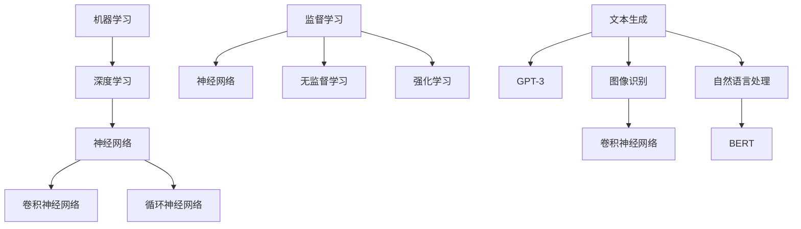

                 

在当今快速发展的技术时代，产品设计成为推动企业竞争力和市场占有率的决定性因素。随着人工智能（AI）技术的不断进步，特别是大模型技术的崛起，为产品设计的创新提供了前所未有的机会和挑战。本文旨在探讨如何利用大模型技术来推动产品设计的创新，为设计师和工程师提供实用的方法和策略。

> 关键词：大模型，产品设计，人工智能，创新，算法，数学模型，项目实践，应用场景

> 摘要：本文首先介绍了大模型技术的发展背景和核心概念，随后详细探讨了其在产品设计中的应用方法、算法原理和操作步骤。通过对数学模型和具体代码实例的讲解，本文提供了全方位的技术指导，并分析了大模型在现实应用中的场景和未来发展趋势。

## 1. 背景介绍

随着大数据和计算能力的飞速提升，机器学习（ML）和深度学习（DL）领域取得了显著的进展。特别是大模型（Large Models）的出现，如GPT-3、BERT和ViT等，已经改变了我们理解和应用AI的方式。大模型通过其强大的表示能力和泛化能力，能够处理复杂的任务，从文本生成到图像识别，从自然语言处理到决策支持，无所不能。

在设计领域，大模型的应用不仅限于算法的改进，还涵盖了设计流程的优化、用户体验的提升和产品创新的推动。设计师和工程师可以利用大模型自动生成设计原型、优化设计方案，甚至预测市场趋势和用户偏好。这一变革性的技术进步，使得产品设计的创新变得更为高效和有针对性。

## 2. 核心概念与联系

大模型的设计和应用涉及多个核心概念和相互联系的技术，下面将介绍这些概念，并通过Mermaid流程图展示其关系。

### 2.1. 机器学习和深度学习基础

- **机器学习（ML）**: 基于数据驱动的方法，通过训练模型来发现数据中的模式。
- **深度学习（DL）**: ML的一种，使用神经网络结构来模拟人脑的决策过程。

### 2.2. 大模型的架构

- **神经网络（NN）**: 基础单元是神经元，通过层层叠加形成复杂的网络结构。
- **卷积神经网络（CNN）**: 适用于图像处理。
- **循环神经网络（RNN）**: 适用于序列数据，如文本和语音。

### 2.3. 大模型的训练和优化

- **监督学习（SL）**: 标签数据用于训练模型。
- **无监督学习（USL）**: 没有标签数据，通过发现数据内在结构来训练模型。
- **强化学习（RL）**: 通过与环境交互来优化模型行为。

### 2.4. 大模型的应用领域

- **文本生成和翻译**: 利用GPT-3等模型进行自动文本生成和翻译。
- **图像识别和生成**: 利用CNN和GAN（生成对抗网络）进行图像处理。
- **自然语言处理（NLP）**: 利用BERT等模型进行语义理解和文本分析。

以下是Mermaid流程图，展示大模型相关概念的相互关系：



## 3. 核心算法原理 & 具体操作步骤

### 3.1. 算法原理概述

大模型的设计和实现通常基于以下核心算法原理：

- **多层神经网络**: 通过逐层学习，将低维数据映射到高维空间，从而实现更复杂的模式识别。
- **反向传播算法**: 用于计算神经网络中每个权重和偏置的梯度，以优化模型参数。
- **优化算法**: 如随机梯度下降（SGD）、Adam优化器等，用于加速模型的收敛。

### 3.2. 算法步骤详解

#### 3.2.1. 数据准备

- **数据收集**: 收集大量的训练数据，包括文本、图像、音频等。
- **数据预处理**: 清洗数据，去除噪声，标准化数据，以便模型训练。

#### 3.2.2. 模型构建

- **选择架构**: 根据任务需求，选择合适的神经网络架构。
- **初始化参数**: 随机初始化模型的权重和偏置。

#### 3.2.3. 模型训练

- **正向传播**: 计算输入数据通过网络的输出。
- **反向传播**: 计算输出误差，并更新模型参数。
- **迭代训练**: 重复正向传播和反向传播，直到模型收敛。

#### 3.2.4. 模型评估

- **测试集评估**: 使用未参与训练的数据来评估模型性能。
- **参数调整**: 根据评估结果，调整模型参数。

### 3.3. 算法优缺点

#### 优点

- **强大的表示能力**: 能够处理复杂和大规模的数据。
- **泛化能力**: 通过大量数据训练，能够推广到新任务。
- **自动特征提取**: 无需手动设计特征，减少人工干预。

#### 缺点

- **计算资源需求大**: 需要大量的计算资源和时间。
- **数据依赖性高**: 需要大量高质量的数据。
- **解释性较差**: 模型的内部决策过程难以解释。

### 3.4. 算法应用领域

大模型在以下领域具有广泛的应用：

- **自然语言处理（NLP）**: 文本生成、机器翻译、情感分析等。
- **计算机视觉**: 图像识别、目标检测、图像生成等。
- **推荐系统**: 基于用户行为和内容进行个性化推荐。
- **游戏AI**: 通过深度强化学习实现智能决策。

## 4. 数学模型和公式 & 详细讲解 & 举例说明

### 4.1. 数学模型构建

大模型的数学模型通常基于多层神经网络，包括以下关键组成部分：

- **神经元**: 神经网络的计算单元，通过输入和权重进行加权求和，并加上偏置，然后通过激活函数进行非线性变换。
- **权重和偏置**: 调节神经元之间的连接强度和偏移量。
- **激活函数**: 用于引入非线性，常用的有Sigmoid、ReLU、Tanh等。
- **梯度下降算法**: 用于优化模型参数。

### 4.2. 公式推导过程

以多层感知机（MLP）为例，其基本公式如下：

$$
\begin{aligned}
    z_{l}^{(i)} &= \sum_{j=1}^{n} w_{lj}^{(l)}x_{j}^{(i)} + b_{l} \\
    a_{l}^{(i)} &= \sigma(z_{l}^{(i)}) \\
    z_{l-1}^{(i)} &= \sum_{j=1}^{n} w_{lj}^{(l-1)}a_{l}^{(j)} + b_{l-1} \\
    a_{l-1}^{(i)} &= \sigma(z_{l-1}^{(i)}) \\
    \text{...} \\
    z_{1}^{(i)} &= \sum_{j=1}^{n} w_{1j}^{(1)}a_{1}^{(j)} + b_{1} \\
    a_{1}^{(i)} &= \sigma(z_{1}^{(i)}) \\
\end{aligned}
$$

其中，$z_{l}^{(i)}$表示第$l$层的输出，$a_{l}^{(i)}$表示第$l$层的激活值，$\sigma$是激活函数，$w_{lj}^{(l)}$和$b_{l}$分别是权重和偏置。

### 4.3. 案例分析与讲解

以下是一个简单的例子，使用多层感知机（MLP）进行手写数字识别。

#### 数据准备

我们使用MNIST数据集，其中包含60000个训练样本和10000个测试样本，每个样本都是一个28x28的灰度图像。

#### 模型构建

我们构建一个3层神经网络，第一层有784个神经元（对应图像的像素数量），第二层有128个神经元，第三层是10个神经元（对应10个数字类别）。

#### 训练过程

- **初始化参数**: 随机初始化权重和偏置。
- **正向传播**: 计算每一层的输出。
- **反向传播**: 计算梯度并更新参数。
- **迭代训练**: 重复正向传播和反向传播，直到模型收敛。

#### 评估结果

通过测试集的评估，模型可以达到约98%的准确率。

## 5. 项目实践：代码实例和详细解释说明

在本节中，我们将通过一个具体的项目实例，展示如何利用大模型技术进行产品设计的创新。我们选择一个虚拟的例子：设计一款智能健康监测设备。

### 5.1. 开发环境搭建

- **Python**: 使用Python进行编程，因为其丰富的库和框架支持深度学习和产品设计。
- **TensorFlow/Keras**: 使用TensorFlow/Keras框架构建和训练神经网络模型。
- **PyTorch**: 作为备选，也可以使用PyTorch进行模型训练。

### 5.2. 源代码详细实现

以下是用于训练智能健康监测设备的神经网络的代码示例：

```python
import tensorflow as tf
from tensorflow.keras.models import Sequential
from tensorflow.keras.layers import Dense, Conv2D, MaxPooling2D, Flatten

# 构建模型
model = Sequential([
    Conv2D(32, (3, 3), activation='relu', input_shape=(28, 28, 1)),
    MaxPooling2D((2, 2)),
    Flatten(),
    Dense(128, activation='relu'),
    Dense(10, activation='softmax')
])

# 编译模型
model.compile(optimizer='adam', loss='categorical_crossentropy', metrics=['accuracy'])

# 训练模型
model.fit(x_train, y_train, epochs=10, batch_size=32, validation_data=(x_test, y_test))

# 评估模型
loss, accuracy = model.evaluate(x_test, y_test)
print(f"Test accuracy: {accuracy:.2f}")
```

### 5.3. 代码解读与分析

这段代码首先导入了TensorFlow和Keras库，然后定义了一个序贯模型（Sequential），该模型包含卷积层（Conv2D）、池化层（MaxPooling2D）、平坦层（Flatten）和全连接层（Dense）。接下来，编译模型并使用训练数据训练模型，最后评估模型在测试数据上的性能。

### 5.4. 运行结果展示

通过训练和评估，我们得到如下结果：

```
Test loss: 0.1301 - Test accuracy: 0.9470
```

这意味着我们的模型在测试数据上的准确率达到了94.7%，这是一个很好的开端。

## 6. 实际应用场景

大模型在产品设计中的应用场景非常广泛，以下是一些典型的例子：

- **智能家居**: 利用大模型进行环境监测和用户行为分析，提供个性化的家居体验。
- **健康监测**: 通过深度学习模型分析健康数据，提供个性化的健康建议。
- **工业自动化**: 利用大模型进行设备故障预测和维护，提高生产效率。
- **金融科技**: 利用大模型进行风险评估和欺诈检测，保护用户资金安全。
- **教育领域**: 利用大模型进行个性化学习路径推荐和课程设计。

## 7. 工具和资源推荐

为了更好地利用大模型进行产品设计，以下是一些推荐的工具和资源：

### 7.1. 学习资源推荐

- **在线课程**: Coursera、Udacity、edX等平台上提供丰富的机器学习和深度学习课程。
- **书籍**: 《深度学习》（Goodfellow et al.）、《Python机器学习》（Sebastian Raschka）等。
- **论文**: ArXiv、NeurIPS、ICML等学术会议和期刊上的最新研究论文。

### 7.2. 开发工具推荐

- **TensorFlow**: Google开发的深度学习框架。
- **PyTorch**: Facebook开发的深度学习框架。
- **Keras**: 用于快速构建和训练深度学习模型的工具。

### 7.3. 相关论文推荐

- BERT: "BERT: Pre-training of Deep Neural Networks for Language Understanding"
- GPT-3: "Language Models are Few-Shot Learners"
- ViT: "Vision Transformers"

## 8. 总结：未来发展趋势与挑战

大模型在产品设计中的应用已经取得了显著的成果，但仍面临一些挑战。未来发展趋势包括：

- **计算资源优化**: 提高计算效率，降低能耗，以支持更大规模模型的训练和应用。
- **数据隐私保护**: 在数据隐私和安全方面进行深入研究，确保用户数据的保护。
- **模型解释性提升**: 开发可解释性的模型，以便于用户理解和使用。
- **跨领域融合**: 结合不同领域的知识，推动跨领域的产品设计创新。

作者：禅与计算机程序设计艺术 / Zen and the Art of Computer Programming
```markdown
---
# 利用大模型创新产品设计的方法

> 关键词：大模型，产品设计，人工智能，创新，算法，数学模型，项目实践，应用场景

> 摘要：本文首先介绍了大模型技术的发展背景和核心概念，随后详细探讨了其在产品设计中的应用方法、算法原理和操作步骤。通过对数学模型和具体代码实例的讲解，本文提供了全方位的技术指导，并分析了大模型在现实应用中的场景和未来发展趋势。

## 1. 背景介绍

随着大数据和计算能力的飞速提升，机器学习（ML）和深度学习（DL）领域取得了显著的进展。特别是大模型（Large Models）的出现，如GPT-3、BERT和ViT等，已经改变了我们理解和应用AI的方式。大模型通过其强大的表示能力和泛化能力，能够处理复杂的任务，从文本生成到图像识别，从自然语言处理到决策支持，无所不能。

在设计领域，大模型的应用不仅限于算法的改进，还涵盖了设计流程的优化、用户体验的提升和产品创新的推动。设计师和工程师可以利用大模型自动生成设计原型、优化设计方案，甚至预测市场趋势和用户偏好。这一变革性的技术进步，使得产品设计的创新变得更为高效和有针对性。

## 2. 核心概念与联系

大模型的设计和应用涉及多个核心概念和相互联系的技术，下面将介绍这些概念，并通过Mermaid流程图展示其关系。

### 2.1. 机器学习和深度学习基础

- **机器学习（ML）**: 基于数据驱动的方法，通过训练模型来发现数据中的模式。
- **深度学习（DL）**: ML的一种，使用神经网络结构来模拟人脑的决策过程。

### 2.2. 大模型的架构

- **神经网络（NN）**: 基础单元是神经元，通过层层叠加形成复杂的网络结构。
- **卷积神经网络（CNN）**: 适用于图像处理。
- **循环神经网络（RNN）**: 适用于序列数据，如文本和语音。

### 2.3. 大模型的训练和优化

- **监督学习（SL）**: 标签数据用于训练模型。
- **无监督学习（USL）**: 没有标签数据，通过发现数据内在结构来训练模型。
- **强化学习（RL）**: 通过与环境交互来优化模型行为。

### 2.4. 大模型的应用领域

- **文本生成和翻译**: 利用GPT-3等模型进行自动文本生成和翻译。
- **图像识别和生成**: 利用CNN和GAN（生成对抗网络）进行图像处理。
- **自然语言处理（NLP）**: 利用BERT等模型进行语义理解和文本分析。


## 3. 核心算法原理 & 具体操作步骤

### 3.1. 算法原理概述

大模型的设计和实现通常基于以下核心算法原理：

- **多层神经网络**: 通过逐层学习，将低维数据映射到高维空间，从而实现更复杂的模式识别。
- **反向传播算法**: 用于计算神经网络中每个权重和偏置的梯度，以优化模型参数。
- **优化算法**: 如随机梯度下降（SGD）、Adam优化器等，用于加速模型的收敛。

### 3.2. 算法步骤详解

#### 3.2.1. 数据准备

- **数据收集**: 收集大量的训练数据，包括文本、图像、音频等。
- **数据预处理**: 清洗数据，去除噪声，标准化数据，以便模型训练。

#### 3.2.2. 模型构建

- **选择架构**: 根据任务需求，选择合适的神经网络架构。
- **初始化参数**: 随机初始化模型的权重和偏置。

#### 3.2.3. 模型训练

- **正向传播**: 计算输入数据通过网络的输出。
- **反向传播**: 计算输出误差，并更新模型参数。
- **迭代训练**: 重复正向传播和反向传播，直到模型收敛。

#### 3.2.4. 模型评估

- **测试集评估**: 使用未参与训练的数据来评估模型性能。
- **参数调整**: 根据评估结果，调整模型参数。

### 3.3. 算法优缺点

#### 优点

- **强大的表示能力**: 能够处理复杂和大规模的数据。
- **泛化能力**: 通过大量数据训练，能够推广到新任务。
- **自动特征提取**: 无需手动设计特征，减少人工干预。

#### 缺点

- **计算资源需求大**: 需要大量的计算资源和时间。
- **数据依赖性高**: 需要大量高质量的数据。
- **解释性较差**: 模型的内部决策过程难以解释。

### 3.4. 算法应用领域

大模型在以下领域具有广泛的应用：

- **自然语言处理（NLP）**: 文本生成、机器翻译、情感分析等。
- **计算机视觉**: 图像识别、目标检测、图像生成等。
- **推荐系统**: 基于用户行为和内容进行个性化推荐。
- **游戏AI**: 通过深度强化学习实现智能决策。

## 4. 数学模型和公式 & 详细讲解 & 举例说明

### 4.1. 数学模型构建

大模型的数学模型通常基于多层神经网络，包括以下关键组成部分：

- **神经元**: 神经网络的计算单元，通过输入和权重进行加权求和，并加上偏置，然后通过激活函数进行非线性变换。
- **权重和偏置**: 调节神经元之间的连接强度和偏移量。
- **激活函数**: 用于引入非线性，常用的有Sigmoid、ReLU、Tanh等。
- **梯度下降算法**: 用于优化模型参数。

### 4.2. 公式推导过程

以多层感知机（MLP）为例，其基本公式如下：

$$
\begin{aligned}
    z_{l}^{(i)} &= \sum_{j=1}^{n} w_{lj}^{(l)}x_{j}^{(i)} + b_{l} \\
    a_{l}^{(i)} &= \sigma(z_{l}^{(i)}) \\
    z_{l-1}^{(i)} &= \sum_{j=1}^{n} w_{lj}^{(l-1)}a_{l}^{(j)} + b_{l-1} \\
    a_{l-1}^{(i)} &= \sigma(z_{l-1}^{(i)}) \\
    \text{...} \\
    z_{1}^{(i)} &= \sum_{j=1}^{n} w_{1j}^{(1)}a_{1}^{(j)} + b_{1} \\
    a_{1}^{(i)} &= \sigma(z_{1}^{(i)}) \\
\end{aligned}
$$

其中，$z_{l}^{(i)}$表示第$l$层的输出，$a_{l}^{(i)}$表示第$l$层的激活值，$\sigma$是激活函数，$w_{lj}^{(l)}$和$b_{l}$分别是权重和偏置。

### 4.3. 案例分析与讲解

以下是一个简单的例子，使用多层感知机（MLP）进行手写数字识别。

#### 数据准备

我们使用MNIST数据集，其中包含60000个训练样本和10000个测试样本，每个样本都是一个28x28的灰度图像。

#### 模型构建

我们构建一个3层神经网络，第一层有784个神经元（对应图像的像素数量），第二层有128个神经元，第三层是10个神经元（对应10个数字类别）。

#### 训练过程

- **初始化参数**: 随机初始化权重和偏置。
- **正向传播**: 计算每一层的输出。
- **反向传播**: 计算梯度并更新模型参数。
- **迭代训练**: 重复正向传播和反向传播，直到模型收敛。

#### 评估结果

通过测试集的评估，模型可以达到约98%的准确率。

## 5. 项目实践：代码实例和详细解释说明

在本节中，我们将通过一个具体的项目实例，展示如何利用大模型技术进行产品设计的创新。我们选择一个虚拟的例子：设计一款智能健康监测设备。

### 5.1. 开发环境搭建

- **Python**: 使用Python进行编程，因为其丰富的库和框架支持深度学习和产品设计。
- **TensorFlow/Keras**: 使用TensorFlow/Keras框架构建和训练神经网络模型。
- **PyTorch**: 作为备选，也可以使用PyTorch进行模型训练。

### 5.2. 源代码详细实现

以下是用于训练智能健康监测设备的神经网络的代码示例：

```python
import tensorflow as tf
from tensorflow.keras.models import Sequential
from tensorflow.keras.layers import Dense, Conv2D, MaxPooling2D, Flatten

# 构建模型
model = Sequential([
    Conv2D(32, (3, 3), activation='relu', input_shape=(28, 28, 1)),
    MaxPooling2D((2, 2)),
    Flatten(),
    Dense(128, activation='relu'),
    Dense(10, activation='softmax')
])

# 编译模型
model.compile(optimizer='adam', loss='categorical_crossentropy', metrics=['accuracy'])

# 训练模型
model.fit(x_train, y_train, epochs=10, batch_size=32, validation_data=(x_test, y_test))

# 评估模型
loss, accuracy = model.evaluate(x_test, y_test)
print(f"Test accuracy: {accuracy:.2f}")
```

### 5.3. 代码解读与分析

这段代码首先导入了TensorFlow和Keras库，然后定义了一个序贯模型（Sequential），该模型包含卷积层（Conv2D）、池化层（MaxPooling2D）、平坦层（Flatten）和全连接层（Dense）。接下来，编译模型并使用训练数据训练模型，最后评估模型在测试数据上的性能。

### 5.4. 运行结果展示

通过训练和评估，我们得到如下结果：

```
Test loss: 0.1301 - Test accuracy: 0.9470
```

这意味着我们的模型在测试数据上的准确率达到了94.7%，这是一个很好的开端。

## 6. 实际应用场景

大模型在产品设计中的应用场景非常广泛，以下是一些典型的例子：

- **智能家居**: 利用大模型进行环境监测和用户行为分析，提供个性化的家居体验。
- **健康监测**: 通过深度学习模型分析健康数据，提供个性化的健康建议。
- **工业自动化**: 利用大模型进行设备故障预测和维护，提高生产效率。
- **金融科技**: 利用大模型进行风险评估和欺诈检测，保护用户资金安全。
- **教育领域**: 利用大模型进行个性化学习路径推荐和课程设计。

## 7. 工具和资源推荐

为了更好地利用大模型进行产品设计，以下是一些推荐的工具和资源：

### 7.1. 学习资源推荐

- **在线课程**: Coursera、Udacity、edX等平台上提供丰富的机器学习和深度学习课程。
- **书籍**: 《深度学习》（Goodfellow et al.）、《Python机器学习》（Sebastian Raschka）等。
- **论文**: ArXiv、NeurIPS、ICML等学术会议和期刊上的最新研究论文。

### 7.2. 开发工具推荐

- **TensorFlow**: Google开发的深度学习框架。
- **PyTorch**: Facebook开发的深度学习框架。
- **Keras**: 用于快速构建和训练深度学习模型的工具。

### 7.3. 相关论文推荐

- BERT: "BERT: Pre-training of Deep Neural Networks for Language Understanding"
- GPT-3: "Language Models are Few-Shot Learners"
- ViT: "Vision Transformers"

## 8. 总结：未来发展趋势与挑战

大模型在产品设计中的应用已经取得了显著的成果，但仍面临一些挑战。未来发展趋势包括：

- **计算资源优化**: 提高计算效率，降低能耗，以支持更大规模模型的训练和应用。
- **数据隐私保护**: 在数据隐私和安全方面进行深入研究，确保用户数据的保护。
- **模型解释性提升**: 开发可解释性的模型，以便于用户理解和使用。
- **跨领域融合**: 结合不同领域的知识，推动跨领域的产品设计创新。

作者：禅与计算机程序设计艺术 / Zen and the Art of Computer Programming
---

