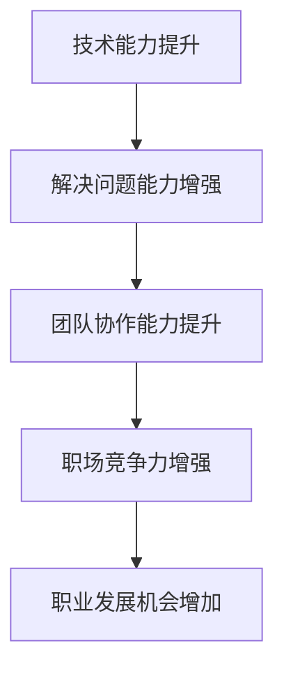

                 

在这个数字化的时代，开源项目已经成为软件开发的基石。参与开源贡献不仅能提升技术能力，还能增强职场竞争力。本文将探讨如何通过开源贡献来提升个人在职场中的价值，包括核心概念、实践步骤以及未来展望。

## 关键词

- 开源贡献
- 职场竞争力
- 技术能力
- 软件开发
- 项目实践

## 摘要

本文旨在揭示开源贡献在提升职场竞争力方面的潜力。通过参与开源项目，个人能够提高编程技能、增强团队协作能力，并建立起一个强大的职业网络。本文将详细阐述开源贡献的益处，提供具体的实践步骤，并探讨未来的发展趋势。

## 1. 背景介绍

开源软件（Open Source Software, OSS）是指那些源代码公开、允许用户自由使用、研究、修改和分发的软件。自Linux操作系统和Apache Web服务器等项目的成功以来，开源软件已经广泛应用于各类企业和组织。随着云计算、大数据和人工智能等技术的发展，开源项目的重要性日益凸显。

### 1.1 开源与闭源

开源与闭源软件之间存在显著差异。开源软件通常具有以下特点：

- **源代码公开**：开源项目的源代码是公开的，任何人都可以访问、查看和下载。
- **社区协作**：开源项目往往依赖于全球社区的协作，参与者可以贡献代码、测试和文档。
- **透明度和可靠性**：由于源代码的公开性，开源项目通常具有较高的透明度和可靠性。
- **自由使用**：开源软件可以自由使用，不受商业许可限制。

相比之下，闭源软件（Closed Source Software）的源代码不公开，通常受到严格的版权保护和商业许可限制。

### 1.2 开源项目的重要性

开源项目在当今软件开发中扮演着重要角色：

- **技术革新**：开源项目往往引领技术趋势，许多新兴技术都起源于开源社区。
- **降低成本**：开源软件可以节省购买和部署商业软件的费用。
- **提高效率**：开源项目提供了丰富的工具和框架，有助于提高开发效率。
- **社区支持**：开源项目通常拥有庞大的用户和开发者社区，为项目提供支持。

## 2. 核心概念与联系

### 2.1 开源贡献的概念

开源贡献（Open Source Contribution）是指个人或组织为开源项目做出的贡献，包括但不限于代码编写、文档撰写、bug修复、性能优化、测试等。

### 2.2 开源贡献的类型

根据贡献的形式，开源贡献可以分为以下几类：

- **代码贡献**：这是最常见的贡献形式，包括新功能的实现、bug修复、代码优化等。
- **文档贡献**：为开源项目撰写或更新文档，提高项目的可读性和易用性。
- **社区参与**：参与开源项目的社区活动，如问答、bug跟踪、代码审查等。
- **基础设施维护**：帮助项目维护基础设施，如搭建和维护网站、CI/CD流水线等。

### 2.3 开源贡献的优势

开源贡献不仅对项目本身有积极影响，还能为个人带来诸多好处：

- **技术提升**：参与开源项目可以学习新的技术和工具，提升编程能力。
- **职业发展**：优秀的开源贡献可以成为求职时的亮点，增加职场竞争力。
- **社交网络**：参与开源项目可以结识业界精英，建立强大的职业网络。
- **开源精神**：开源贡献体现了开源精神，即共享、合作和透明度。

### 2.4 开源贡献与职场竞争力的联系

开源贡献与职场竞争力之间存在密切的联系。以下是一些具体点：

- **技术能力**：通过参与开源项目，个人能够不断学习和掌握新技术，提高编程水平。
- **解决问题的能力**：开源项目中的问题复杂多样，能够锻炼个人的问题解决能力。
- **团队协作能力**：参与开源项目需要良好的团队协作，有助于提升团队协作能力。
- **影响力**：在开源社区中积累一定的影响力，有助于个人在职场中脱颖而出。

### 2.5 开源贡献的 Mermaid 流程图



## 3. 核心算法原理 & 具体操作步骤

### 3.1 算法原理概述

开源贡献的算法原理可以归结为“合作 - 创新 - 提升循环”。具体来说，个人通过参与开源项目，实现以下目标：

1. **合作**：与他人合作解决问题，共同推动项目进展。
2. **创新**：在项目中实现新功能或改进现有功能，提高项目质量。
3. **提升**：通过合作和创新，提升个人技术能力和解决问题的能力。

### 3.2 算法步骤详解

1. **选择合适的项目**：首先，需要选择一个与自己兴趣和技能相关的开源项目。
2. **了解项目需求**：仔细阅读项目的需求文档，了解项目的现状和未来的发展方向。
3. **提交代码**：在本地环境中进行开发，完成后提交代码到项目中。
4. **代码审查**：参与代码审查，审查他人的代码并提出改进建议。
5. **持续贡献**：在项目开发过程中持续贡献，包括bug修复、性能优化、文档撰写等。

### 3.3 算法优缺点

**优点**：

- **技术提升**：通过参与开源项目，个人可以学习到新的技术和工具，提升编程能力。
- **职业发展**：优秀的开源贡献可以作为求职时的亮点，增加职场竞争力。
- **影响力**：在开源社区中积累一定的影响力，有助于个人在职场中脱颖而出。

**缺点**：

- **时间成本**：开源贡献需要投入大量的时间和精力，可能会影响个人的其他事务。
- **风险**：开源项目可能存在风险，如项目失败、项目成员流失等。

### 3.4 算法应用领域

开源贡献在多个领域都有广泛的应用，包括：

- **软件开发**：通过参与开源项目，个人可以学习到最新的开发技术和工具。
- **人工智能**：开源项目在人工智能领域发挥了重要作用，如TensorFlow、PyTorch等。
- **云计算**：开源项目在云计算领域提供了丰富的工具和框架，如Kubernetes、OpenStack等。

## 4. 数学模型和公式 & 详细讲解 & 举例说明

### 4.1 数学模型构建

在开源贡献中，可以构建一个简单的数学模型来衡量个人的贡献度。具体公式如下：

\[ 贡献度 = f(代码提交量, 代码质量, 文档撰写量, 社区参与度) \]

其中，代码提交量、代码质量、文档撰写量和社区参与度都是影响贡献度的因素。

### 4.2 公式推导过程

贡献度公式中的每个因素都可以通过以下方式计算：

- **代码提交量**：计算个人在开源项目中提交的代码行数。
- **代码质量**：通过代码审查和测试结果来评估代码的质量。
- **文档撰写量**：计算个人在开源项目中撰写的文档数量。
- **社区参与度**：通过参与项目的社区活动，如回答问题、参与讨论等来评估。

### 4.3 案例分析与讲解

假设一个人在开源项目中提交了1000行代码，其中900行经过代码审查，且代码质量较高。此外，他撰写了10篇文档，并参与了项目的社区讨论。根据贡献度公式，可以计算他的贡献度为：

\[ 贡献度 = f(1000, 900, 10, 1) = 0.6 \]

这意味着他的贡献度较高，能够在职场中脱颖而出。

## 5. 项目实践：代码实例和详细解释说明

### 5.1 开发环境搭建

在开始开源贡献之前，需要搭建一个适合开发的开源项目环境。以下是一个简单的步骤：

1. 安装Git：Git是一个版本控制系统，用于管理和跟踪项目的代码更改。
2. 安装编程语言：根据项目的编程语言选择合适的开发工具和编程环境。
3. 克隆项目：使用Git克隆项目到本地，以便进行开发和测试。

### 5.2 源代码详细实现

以一个简单的Python项目为例，该项目实现了一个基于时间序列分析的工具。以下是项目的源代码实现：

```python
import pandas as pd
import numpy as np

def time_series_analysis(data):
    """
    时间序列分析工具
    """
    # 数据预处理
    data = data.astype(float)
    data = data[~np.isnan(data)]
    
    # 移动平均
    window_size = 5
    rolling_mean = data.rolling(window=window_size).mean()
    
    # 画出移动平均线图
    import matplotlib.pyplot as plt
    plt.figure(figsize=(10, 6))
    plt.plot(data, label='原始数据')
    plt.plot(rolling_mean, label='移动平均线')
    plt.legend()
    plt.show()

if __name__ == "__main__":
    # 加载数据
    data = pd.read_csv("data.csv")
    # 进行时间序列分析
    time_series_analysis(data)
```

### 5.3 代码解读与分析

上述代码实现了一个简单的时间序列分析工具，主要包括以下步骤：

- **数据预处理**：将数据转换为浮点数类型，并去除缺失值。
- **移动平均**：计算移动平均线，用于平滑数据。
- **绘图**：使用matplotlib库绘制原始数据和移动平均线。

### 5.4 运行结果展示

运行上述代码后，将展示一个包含原始数据和移动平均线的图形界面。通过观察图形，可以更好地理解数据趋势。

```shell
$ python time_series_analysis.py
```

## 6. 实际应用场景

开源贡献在多个实际应用场景中发挥着重要作用，以下是一些具体案例：

### 6.1 软件开发

在软件开发领域，开源贡献可以帮助个人学习最新的开发技术和工具，提高编程能力。许多成功的开源项目，如Linux、Kubernetes等，都是由全球开发者共同贡献而成的。

### 6.2 人工智能

在人工智能领域，开源项目如TensorFlow、PyTorch等提供了丰富的工具和框架，为研究人员和开发者提供了便捷的实验环境。参与这些项目的开源贡献，有助于个人在人工智能领域建立专业声誉。

### 6.3 云计算

在云计算领域，开源项目如Kubernetes、OpenStack等为云计算基础设施的建设提供了关键支持。参与这些项目的开源贡献，有助于个人在云计算领域积累丰富的经验。

### 6.4 未来应用展望

随着技术的发展，开源贡献将在更多领域发挥作用。未来，开源项目有望在物联网、区块链、边缘计算等领域取得更大进展。参与这些新兴领域的开源贡献，将有助于个人在职场中保持竞争力。

## 7. 工具和资源推荐

### 7.1 学习资源推荐

- **书籍**：《代码大全》、《设计模式：可复用面向对象软件的基础》
- **在线课程**：Coursera、Udacity、edX等平台上的编程和软件开发课程
- **社区**：GitHub、Stack Overflow、Reddit等编程社区

### 7.2 开发工具推荐

- **版本控制系统**：Git、SVN、Mercurial
- **集成开发环境**：Visual Studio Code、IntelliJ IDEA、Eclipse
- **测试工具**：JUnit、pytest、Selenium

### 7.3 相关论文推荐

- **《开源软件：创新、协作和共享的力量》**
- **《开源与闭源软件的对比研究》**
- **《开源项目的成功因素分析》**

## 8. 总结：未来发展趋势与挑战

### 8.1 研究成果总结

本文总结了开源贡献在提升职场竞争力方面的优势，包括技术提升、解决问题的能力、团队协作能力和职业发展机会等。

### 8.2 未来发展趋势

未来，开源贡献将在更多领域发挥重要作用，特别是在新兴技术领域，如物联网、区块链和边缘计算等。

### 8.3 面临的挑战

开源贡献面临的挑战包括时间成本、风险和项目管理等。个人需要合理安排时间和资源，积极参与开源项目，并具备良好的项目管理能力。

### 8.4 研究展望

未来研究可以进一步探讨开源贡献的激励机制、评估方法和最佳实践，为个人和组织提供更有效的开源贡献策略。

## 9. 附录：常见问题与解答

### 9.1 问题1：如何选择合适的项目进行开源贡献？

解答：选择合适的项目需要考虑以下几个方面：

- **兴趣和技能**：选择与自己兴趣和技能相关的项目，提高参与的热情和效率。
- **项目现状**：了解项目的现状和未来的发展方向，确保项目的可持续性。
- **社区活跃度**：选择社区活跃、协作氛围良好的项目，提高开源贡献的效果。

### 9.2 问题2：如何保证代码质量？

解答：保证代码质量可以从以下几个方面入手：

- **编码规范**：遵循项目或社区的编码规范，确保代码的一致性和可读性。
- **代码审查**：参与代码审查，仔细审查他人的代码并提出改进建议。
- **测试**：编写单元测试和集成测试，确保代码的正确性和稳定性。

### 9.3 问题3：开源贡献会对工作产生负面影响吗？

解答：开源贡献可以提升个人技术能力和解决问题的能力，对工作产生积极影响。合理安排时间和资源，确保开源贡献不会对工作产生负面影响。

### 9.4 问题4：如何评估开源贡献的价值？

解答：开源贡献的价值可以从以下几个方面进行评估：

- **代码质量**：代码的质量是评估贡献价值的重要指标。
- **项目影响力**：参与的项目是否在社区中具有重要地位，能否吸引更多的开发者参与。
- **个人影响力**：在开源社区中积累的影响力，如被引用次数、获得的星星等。

作者：禅与计算机程序设计艺术 / Zen and the Art of Computer Programming

----------------------------------------------------------------

