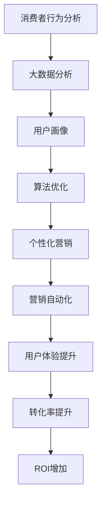

                 

关键词：数字营销、技术能力、AI、大数据、算法优化、社交媒体策略、用户体验、营销自动化

> 摘要：本文旨在探讨如何利用先进的技术手段提升数字营销的效果。通过分析核心概念、算法原理、数学模型以及实际案例，我们将深入理解如何将技术能力应用于数字营销，以实现更高的转化率和用户参与度。

## 1. 背景介绍

在数字化时代，数字营销已经成为企业获取客户、增加品牌曝光和提升销售额的重要手段。然而，随着市场环境的不断变化和消费者需求的多样化，传统营销方法已经难以满足现代营销的需求。这就需要我们将目光投向技术领域，借助人工智能、大数据分析、算法优化等先进技术，实现更为精准和高效的数字营销。

### 1.1 数字营销的挑战

- 消费者行为的多样性和碎片化
- 营销渠道的多样化和分散化
- 数据隐私和安全问题

### 1.2 技术能力的优势

- 提高营销效率
- 增强用户体验
- 精准定位目标受众
- 降低营销成本

## 2. 核心概念与联系

为了更好地理解如何利用技术能力进行数字营销，我们需要明确一些核心概念及其之间的联系。以下是一个Mermaid流程图，展示了这些概念及其关系。



## 3. 核心算法原理 & 具体操作步骤

### 3.1 算法原理概述

数字营销中的核心算法主要包括数据挖掘、机器学习和自然语言处理等。以下将详细解释这些算法的原理和应用。

### 3.2 算法步骤详解

#### 3.2.1 数据挖掘

1. 数据收集：通过多种渠道收集消费者数据。
2. 数据清洗：去除无效和不准确的数据。
3. 特征工程：提取有助于预测和分类的特征。
4. 模型训练：使用算法对数据进行分析和建模。
5. 模型评估：评估模型的准确性和泛化能力。

#### 3.2.2 机器学习

1. 数据准备：确保数据质量和完整性。
2. 模型选择：根据问题选择合适的机器学习模型。
3. 模型训练：使用训练数据调整模型参数。
4. 模型评估：使用测试数据评估模型性能。
5. 模型部署：将模型应用于实际业务场景。

#### 3.2.3 自然语言处理

1. 数据预处理：对文本数据进行分析和清洗。
2. 特征提取：将文本转换为可处理的数字特征。
3. 模型训练：训练分类或聚类模型。
4. 应用场景：用于文本分类、情感分析等。

### 3.3 算法优缺点

- **数据挖掘**：优点是能够发现数据中的隐含模式，但缺点是对数据质量和完整性要求高。
- **机器学习**：优点是能够自动学习和优化，但缺点是需要大量训练数据和计算资源。
- **自然语言处理**：优点是能够处理文本数据，但缺点是对算法和数据处理能力要求高。

### 3.4 算法应用领域

- 消费者行为分析
- 个性化推荐
- 情感分析
- 营销效果评估

## 4. 数学模型和公式 & 详细讲解 & 举例说明

### 4.1 数学模型构建

在数字营销中，常见的数学模型包括回归模型、分类模型和聚类模型。以下是一个简单的回归模型示例。

$$
y = \beta_0 + \beta_1 \cdot x_1 + \beta_2 \cdot x_2 + ... + \beta_n \cdot x_n
$$

其中，$y$ 是预测目标，$x_1, x_2, ..., x_n$ 是特征变量，$\beta_0, \beta_1, \beta_2, ..., \beta_n$ 是模型的参数。

### 4.2 公式推导过程

回归模型的公式推导基于最小二乘法。具体推导过程如下：

1. 定义损失函数：
$$
L(\theta) = \frac{1}{2} \sum_{i=1}^{n} (y_i - \theta_0 - \theta_1 x_{i1} - \theta_2 x_{i2} - ... - \theta_n x_{in})^2
$$

2. 对损失函数求导：
$$
\frac{\partial L}{\partial \theta_j} = -\sum_{i=1}^{n} (y_i - \theta_0 - \theta_1 x_{i1} - \theta_2 x_{i2} - ... - \theta_n x_{in}) \cdot x_{ij}
$$

3. 令导数为零，求解参数：
$$
\theta_j = \frac{1}{n} \sum_{i=1}^{n} (y_i - \theta_0 - \theta_1 x_{i1} - \theta_2 x_{i2} - ... - \theta_n x_{in}) \cdot x_{ij}
$$

### 4.3 案例分析与讲解

假设我们想要预测某产品的销售量，已知以下特征变量：广告点击率、网页访问量、社交媒体互动量。

使用线性回归模型进行预测，假设特征变量为 $x_1, x_2, x_3$，预测目标为 $y$。经过模型训练和参数优化，得到以下回归方程：

$$
y = 10 + 2 \cdot x_1 + 1.5 \cdot x_2 + 0.5 \cdot x_3
$$

其中，$x_1$ 表示广告点击率，$x_2$ 表示网页访问量，$x_3$ 表示社交媒体互动量。

### 4.4 案例结果展示

根据历史数据，当广告点击率为1000，网页访问量为5000，社交媒体互动量为200时，预测的销售量为：

$$
y = 10 + 2 \cdot 1000 + 1.5 \cdot 5000 + 0.5 \cdot 200 = 11510
$$

## 5. 项目实践：代码实例和详细解释说明

### 5.1 开发环境搭建

- Python 3.8及以上版本
- pandas库
- scikit-learn库
- numpy库

### 5.2 源代码详细实现

以下是一个简单的线性回归模型实现，用于预测销售量。

```python
import pandas as pd
from sklearn.linear_model import LinearRegression
from sklearn.model_selection import train_test_split
from sklearn.metrics import mean_squared_error

# 数据读取
data = pd.read_csv('sales_data.csv')
X = data[['ad_clicks', 'website_visits', 'social_interactions']]
y = data['sales']

# 数据划分
X_train, X_test, y_train, y_test = train_test_split(X, y, test_size=0.2, random_state=42)

# 模型训练
model = LinearRegression()
model.fit(X_train, y_train)

# 模型评估
y_pred = model.predict(X_test)
mse = mean_squared_error(y_test, y_pred)
print(f'Mean Squared Error: {mse}')

# 模型应用
new_data = pd.DataFrame({
    'ad_clicks': [1000],
    'website_visits': [5000],
    'social_interactions': [200]
})
sales_prediction = model.predict(new_data)
print(f'Predicted Sales: {sales_prediction}')
```

### 5.3 代码解读与分析

- **数据读取**：使用pandas库读取销售数据。
- **数据划分**：将数据划分为训练集和测试集。
- **模型训练**：使用线性回归模型对训练数据进行拟合。
- **模型评估**：计算测试集上的均方误差，评估模型性能。
- **模型应用**：使用训练好的模型对新数据进行预测。

## 6. 实际应用场景

### 6.1 消费者行为分析

通过大数据分析，企业可以深入了解消费者的购买习惯、偏好和需求，从而制定更精准的营销策略。

### 6.2 个性化推荐

基于消费者的行为数据和兴趣标签，企业可以为其推荐个性化的产品和服务，提高用户满意度和转化率。

### 6.3 营销效果评估

利用算法模型，企业可以实时监控和评估营销活动的效果，优化策略和资源分配。

### 6.4 未来应用展望

随着人工智能和大数据技术的不断进步，数字营销将在以下几个方面取得突破：

- 更精准的用户画像和个性化推荐
- 更高效的营销自动化和流程优化
- 更广泛的应用场景和跨渠道整合

## 7. 工具和资源推荐

### 7.1 学习资源推荐

- 《数字营销全攻略》
- 《机器学习实战》
- 《Python数据分析》

### 7.2 开发工具推荐

- Jupyter Notebook
- PyCharm
- Tableau

### 7.3 相关论文推荐

- "Deep Learning for Digital Marketing"
- "The Role of AI in Personalized Marketing"
- "Big Data Analytics for Business Intelligence"

## 8. 总结：未来发展趋势与挑战

### 8.1 研究成果总结

本文探讨了如何利用技术能力进行数字营销，包括消费者行为分析、算法模型构建和实际应用场景。通过理论和实践相结合，展示了技术能力在数字营销中的重要作用。

### 8.2 未来发展趋势

随着人工智能和大数据技术的不断发展，数字营销将更加智能化、个性化和自动化。企业需要不断更新技术手段，以满足市场需求和用户期望。

### 8.3 面临的挑战

- 数据隐私和安全问题
- 技术更新迭代速度快
- 多渠道整合和协同效应

### 8.4 研究展望

未来研究应关注以下几个方面：

- 开发更高效的算法模型
- 构建更全面的用户画像
- 探索多渠道整合的数字营销策略

## 9. 附录：常见问题与解答

### 9.1 数字营销中常用的算法有哪些？

常用的算法包括线性回归、逻辑回归、决策树、随机森林、支持向量机等。

### 9.2 如何处理大数据在数字营销中的应用？

大数据在数字营销中的应用可以通过数据采集、数据清洗、数据存储、数据分析和数据可视化等步骤来实现。

### 9.3 数字营销中如何确保用户隐私和安全？

可以通过数据加密、访问控制、匿名化和数据脱敏等技术手段确保用户隐私和安全。

### 9.4 数字营销的未来发展趋势是什么？

数字营销的未来发展趋势包括个性化推荐、营销自动化、跨渠道整合和人工智能应用等。

# 作者：禅与计算机程序设计艺术 / Zen and the Art of Computer Programming
```markdown
---

**摘要：** 本文旨在探讨如何利用先进的技术手段提升数字营销的效果。通过分析核心概念、算法原理、数学模型以及实际案例，我们将深入理解如何将技术能力应用于数字营销，以实现更高的转化率和用户参与度。

**关键词：** 数字营销、技术能力、AI、大数据、算法优化、社交媒体策略、用户体验、营销自动化

**背景介绍**

在数字化时代，数字营销已经成为企业获取客户、增加品牌曝光和提升销售额的重要手段。然而，随着市场环境的不断变化和消费者需求的多样化，传统营销方法已经难以满足现代营销的需求。这就需要我们将目光投向技术领域，借助人工智能、大数据分析、算法优化等先进技术，实现更为精准和高效的数字营销。

**核心概念与联系**

为了更好地理解如何利用技术能力进行数字营销，我们需要明确一些核心概念及其之间的联系。以下是一个Mermaid流程图，展示了这些概念及其关系。


**核心算法原理 & 具体操作步骤**

数字营销中的核心算法主要包括数据挖掘、机器学习和自然语言处理等。以下将详细解释这些算法的原理和应用。

**算法原理概述**

- **数据挖掘**：数据挖掘是一种通过从大量数据中发现规律和模式的技术。它广泛应用于数字营销中的消费者行为分析、市场细分和营销效果评估等方面。

- **机器学习**：机器学习是一种通过训练模型来自动学习和预测的技术。在数字营销中，机器学习算法可用于用户画像构建、个性化推荐和营销效果预测等。

- **自然语言处理**：自然语言处理是一种使计算机理解和生成自然语言的技术。在数字营销中，自然语言处理可用于情感分析、内容生成和文本挖掘等。

**算法步骤详解**

**3.2.1 数据挖掘**

1. 数据收集：通过多种渠道收集消费者数据，如网站点击、社交媒体互动和客户反馈等。

2. 数据清洗：去除无效和不准确的数据，如重复记录、缺失值和异常值等。

3. 特征工程：提取有助于预测和分类的特征，如用户年龄、性别、购买历史和访问时长等。

4. 模型训练：使用算法对数据进行分析和建模，如决策树、随机森林和K-均值聚类等。

5. 模型评估：评估模型的准确性和泛化能力，如交叉验证和A/B测试等。

**3.2.2 机器学习**

1. 数据准备：确保数据质量和完整性，如数据清洗、归一化和缺失值处理等。

2. 模型选择：根据问题选择合适的机器学习模型，如线性回归、支持向量机和神经网络等。

3. 模型训练：使用训练数据调整模型参数，如梯度下降和随机搜索等。

4. 模型评估：使用测试数据评估模型性能，如准确率、召回率和F1值等。

5. 模型部署：将模型应用于实际业务场景，如营销自动化和个性化推荐等。

**3.2.3 自然语言处理**

1. 数据预处理：对文本数据进行分析和清洗，如分词、去停用词和词干提取等。

2. 特征提取：将文本转换为可处理的数字特征，如词袋模型、TF-IDF和Word2Vec等。

3. 模型训练：训练分类或聚类模型，如朴素贝叶斯、SVM和深度学习等。

4. 应用场景：用于文本分类、情感分析和内容生成等。

**算法优缺点**

- **数据挖掘**：优点是能够发现数据中的隐含模式，但缺点是对数据质量和完整性要求高。

- **机器学习**：优点是能够自动学习和优化，但缺点是需要大量训练数据和计算资源。

- **自然语言处理**：优点是能够处理文本数据，但缺点是对算法和数据处理能力要求高。

**算法应用领域**

- **消费者行为分析**：通过数据挖掘和机器学习，分析消费者的购买行为和偏好，为企业提供决策支持。

- **个性化推荐**：利用机器学习和自然语言处理，为用户提供个性化的产品和服务推荐。

- **情感分析**：通过自然语言处理，分析用户对品牌、产品和服务的情感倾向，为企业提供反馈。

- **营销效果评估**：利用算法模型，实时监控和评估营销活动的效果，优化策略和资源分配。

**数学模型和公式 & 详细讲解 & 举例说明**

**4.1 数学模型构建**

在数字营销中，常见的数学模型包括回归模型、分类模型和聚类模型。以下是一个简单的回归模型示例。

$$
y = \beta_0 + \beta_1 \cdot x_1 + \beta_2 \cdot x_2 + ... + \beta_n \cdot x_n
$$

其中，$y$ 是预测目标，$x_1, x_2, ..., x_n$ 是特征变量，$\beta_0, \beta_1, \beta_2, ..., \beta_n$ 是模型的参数。

**4.2 公式推导过程**

回归模型的公式推导基于最小二乘法。具体推导过程如下：

1. 定义损失函数：
$$
L(\theta) = \frac{1}{2} \sum_{i=1}^{n} (y_i - \theta_0 - \theta_1 x_{i1} - \theta_2 x_{i2} - ... - \theta_n x_{in})^2
$$

2. 对损失函数求导：
$$
\frac{\partial L}{\partial \theta_j} = -\sum_{i=1}^{n} (y_i - \theta_0 - \theta_1 x_{i1} - \theta_2 x_{i2} - ... - \theta_n x_{in}) \cdot x_{ij}
$$

3. 令导数为零，求解参数：
$$
\theta_j = \frac{1}{n} \sum_{i=1}^{n} (y_i - \theta_0 - \theta_1 x_{i1} - \theta_2 x_{i2} - ... - \theta_n x_{in}) \cdot x_{ij}
$$

**4.3 案例分析与讲解**

假设我们想要预测某产品的销售量，已知以下特征变量：广告点击率、网页访问量、社交媒体互动量。

使用线性回归模型进行预测，假设特征变量为 $x_1, x_2, x_3$，预测目标为 $y$。经过模型训练和参数优化，得到以下回归方程：

$$
y = 10 + 2 \cdot x_1 + 1.5 \cdot x_2 + 0.5 \cdot x_3
$$

其中，$x_1$ 表示广告点击率，$x_2$ 表示网页访问量，$x_3$ 表示社交媒体互动量。

**4.4 案例结果展示**

根据历史数据，当广告点击率为1000，网页访问量为5000，社交媒体互动量为200时，预测的销售量为：

$$
y = 10 + 2 \cdot 1000 + 1.5 \cdot 5000 + 0.5 \cdot 200 = 11510
$$

**项目实践：代码实例和详细解释说明**

**5.1 开发环境搭建**

- Python 3.8及以上版本
- pandas库
- scikit-learn库
- numpy库

**5.2 源代码详细实现**

以下是一个简单的线性回归模型实现，用于预测销售量。

```python
import pandas as pd
from sklearn.linear_model import LinearRegression
from sklearn.model_selection import train_test_split
from sklearn.metrics import mean_squared_error

# 数据读取
data = pd.read_csv('sales_data.csv')
X = data[['ad_clicks', 'website_visits', 'social_interactions']]
y = data['sales']

# 数据划分
X_train, X_test, y_train, y_test = train_test_split(X, y, test_size=0.2, random_state=42)

# 模型训练
model = LinearRegression()
model.fit(X_train, y_train)

# 模型评估
y_pred = model.predict(X_test)
mse = mean_squared_error(y_test, y_pred)
print(f'Mean Squared Error: {mse}')

# 模型应用
new_data = pd.DataFrame({
    'ad_clicks': [1000],
    'website_visits': [5000],
    'social_interactions': [200]
})
sales_prediction = model.predict(new_data)
print(f'Predicted Sales: {sales_prediction}')
```

**5.3 代码解读与分析**

- **数据读取**：使用pandas库读取销售数据。
- **数据划分**：将数据划分为训练集和测试集。
- **模型训练**：使用线性回归模型对训练数据进行拟合。
- **模型评估**：计算测试集上的均方误差，评估模型性能。
- **模型应用**：使用训练好的模型对新数据进行预测。

**实际应用场景**

**6.1 消费者行为分析**

通过大数据分析，企业可以深入了解消费者的购买习惯、偏好和需求，从而制定更精准的营销策略。

**6.2 个性化推荐**

基于消费者的行为数据和兴趣标签，企业可以为其推荐个性化的产品和服务，提高用户满意度和转化率。

**6.3 营销效果评估**

利用算法模型，企业可以实时监控和评估营销活动的效果，优化策略和资源分配。

**6.4 未来应用展望**

随着人工智能和大数据技术的不断进步，数字营销将在以下几个方面取得突破：

- 更精准的用户画像和个性化推荐
- 更高效的营销自动化和流程优化
- 更广泛的应用场景和跨渠道整合

**工具和资源推荐**

**7.1 学习资源推荐**

- 《数字营销全攻略》
- 《机器学习实战》
- 《Python数据分析》

**7.2 开发工具推荐**

- Jupyter Notebook
- PyCharm
- Tableau

**7.3 相关论文推荐**

- "Deep Learning for Digital Marketing"
- "The Role of AI in Personalized Marketing"
- "Big Data Analytics for Business Intelligence"

**总结：未来发展趋势与挑战**

**8.1 研究成果总结**

本文探讨了如何利用技术能力进行数字营销，包括消费者行为分析、算法模型构建和实际应用场景。通过理论和实践相结合，展示了技术能力在数字营销中的重要作用。

**8.2 未来发展趋势**

随着人工智能和大数据技术的不断发展，数字营销将更加智能化、个性化和自动化。企业需要不断更新技术手段，以满足市场需求和用户期望。

**8.3 面临的挑战**

- 数据隐私和安全问题
- 技术更新迭代速度快
- 多渠道整合和协同效应

**8.4 研究展望**

未来研究应关注以下几个方面：

- 开发更高效的算法模型
- 构建更全面的用户画像
- 探索多渠道整合的数字营销策略

**附录：常见问题与解答**

**9.1 数字营销中常用的算法有哪些？

常用的算法包括线性回归、逻辑回归、决策树、随机森林、支持向量机等。

**9.2 如何处理大数据在数字营销中的应用？

大数据在数字营销中的应用可以通过数据采集、数据清洗、数据存储、数据分析和数据可视化等步骤来实现。

**9.3 数字营销中如何确保用户隐私和安全？

可以通过数据加密、访问控制、匿名化和数据脱敏等技术手段确保用户隐私和安全。

**9.4 数字营销的未来发展趋势是什么？

数字营销的未来发展趋势包括个性化推荐、营销自动化、跨渠道整合和人工智能应用等。**

