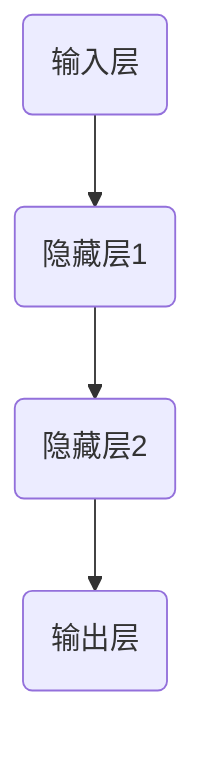

                 

关键词：剪枝技术、边缘AI设备、神经网络压缩、计算效率、能效优化、模型压缩、AI性能

> 摘要：本文深入探讨了剪枝技术在边缘AI设备中的应用挑战，分析了神经网络剪枝的基本概念、核心算法原理、实现步骤以及在实际项目中的应用。本文旨在为从事边缘AI开发的技术人员提供有价值的参考，帮助他们更好地理解和应用剪枝技术，以提升边缘设备的计算效率和能效。

## 1. 背景介绍

随着物联网、智能家居、智能制造等领域的快速发展，边缘AI设备得到了广泛应用。这些设备通常具有有限的计算资源、有限的电池寿命和有限的网络带宽，因此如何提高其计算效率和能效成为了一个亟待解决的问题。神经网络剪枝技术作为一种有效的模型压缩方法，通过去除网络中不重要的连接和节点，实现了神经网络的规模缩小和计算复杂度的降低，从而在边缘AI设备上具有很大的应用潜力。

### 1.1 剪枝技术的定义

剪枝技术（Pruning technique）是一种神经网络压缩方法，主要通过去除网络中不重要的连接和节点，来减小模型的规模和计算复杂度。剪枝技术可以分为结构剪枝（Structured Pruning）和权重剪枝（Weight Pruning）两种类型。

- **结构剪枝**：直接删除网络中的节点和连接，从而简化网络结构。
- **权重剪枝**：通过降低网络中某些连接的权重值，使得网络在保持一定性能的前提下，变得更加紧凑。

### 1.2 剪枝技术在边缘AI中的应用

边缘AI设备由于计算资源有限，通常无法承受庞大的神经网络模型。因此，剪枝技术在边缘AI设备中的应用具有显著的优势：

- **计算效率提升**：通过剪枝技术，可以显著减少模型的参数数量和计算量，从而提高计算效率。
- **能效优化**：剪枝后的模型在运行时所需的能量和资源更少，有助于延长设备的电池寿命。
- **降低带宽消耗**：在训练和部署模型时，剪枝后的模型数据量更小，有助于减少网络带宽的消耗。

## 2. 核心概念与联系

为了更好地理解剪枝技术，我们首先需要了解神经网络的基本概念和结构。以下是一个简单的神经网络架构的 Mermaid 流程图，用于展示神经网络的层次结构和基本操作。



在神经网络中，每一层都由多个节点（神经元）组成，每个节点都与前一层的节点通过连接（权重）相连。神经网络的性能主要取决于节点的数量和连接的权重。剪枝技术的核心目标就是通过去除不重要的节点和连接，来简化网络结构，提高模型的效率和性能。

### 2.1 剪枝技术的基本原理

剪枝技术的基本原理可以分为以下几个步骤：

1. **初始化**：首先初始化一个完整的神经网络模型。
2. **评估**：对网络中的每个连接或节点进行评估，以确定其重要性。
3. **剪枝**：根据评估结果，选择不重要的连接或节点进行剪枝。
4. **优化**：在剪枝后，对网络进行优化，以恢复或提升网络的性能。

### 2.2 剪枝技术的分类

剪枝技术主要可以分为以下两类：

1. **结构剪枝**：直接删除网络中的节点和连接，从而简化网络结构。
   - **优点**：可以显著降低模型的参数数量和计算复杂度。
   - **缺点**：可能会对模型的性能产生较大的影响，尤其是在深度神经网络中。

2. **权重剪枝**：通过降低网络中某些连接的权重值，使得网络在保持一定性能的前提下，变得更加紧凑。
   - **优点**：可以在一定程度上保持模型的性能，并且适用于各种类型的神经网络。
   - **缺点**：可能需要更多的计算资源和时间来进行评估和优化。

## 3. 核心算法原理 & 具体操作步骤

### 3.1 算法原理概述

剪枝技术的核心原理是通过对网络中的连接和节点进行评估，选择不重要的部分进行剪枝，从而简化网络结构，提高模型的效率和性能。以下是一个简单的剪枝算法流程：

1. **初始化**：初始化一个完整的神经网络模型。
2. **评估**：对网络中的每个连接或节点进行评估，计算其重要性。
3. **剪枝**：根据评估结果，选择不重要的连接或节点进行剪枝。
4. **优化**：在剪枝后，对网络进行优化，以恢复或提升网络的性能。

### 3.2 算法步骤详解

1. **初始化**：初始化一个完整的神经网络模型，包括输入层、隐藏层和输出层。
2. **评估**：对网络中的每个连接或节点进行评估，计算其重要性。通常可以使用以下方法进行评估：
   - **权重评估**：计算每个连接的权重值，并评估其重要性。
   - **节点评估**：计算每个节点的输出值，并评估其重要性。
3. **剪枝**：根据评估结果，选择不重要的连接或节点进行剪枝。剪枝的方法可以分为以下几种：
   - **全局剪枝**：一次性剪除所有不重要的连接或节点。
   - **逐层剪枝**：逐层剪枝，每次只剪除一层中的不重要的连接或节点。
   - **混合剪枝**：结合全局剪枝和逐层剪枝的优点，逐步剪除不重要的连接或节点。
4. **优化**：在剪枝后，对网络进行优化，以恢复或提升网络的性能。优化的方法可以分为以下几种：
   - **重建网络**：在剪枝后重新构建网络，以恢复网络的性能。
   - **微调**：在剪枝后对网络进行微调，以提升网络的性能。

### 3.3 算法优缺点

- **优点**：
  - **计算效率提升**：通过剪枝技术，可以显著降低模型的参数数量和计算复杂度，从而提高计算效率。
  - **能效优化**：剪枝后的模型在运行时所需的能量和资源更少，有助于延长设备的电池寿命。
  - **降低带宽消耗**：在训练和部署模型时，剪枝后的模型数据量更小，有助于减少网络带宽的消耗。

- **缺点**：
  - **性能损失**：剪枝可能会导致模型的性能下降，尤其是在深度神经网络中。
  - **计算成本**：评估和剪枝过程需要大量的计算资源，可能会对训练时间产生较大影响。

### 3.4 算法应用领域

剪枝技术在边缘AI设备中的应用非常广泛，主要包括以下几个方面：

- **图像识别**：通过剪枝技术，可以显著降低图像识别模型的计算复杂度，从而提高边缘设备在图像处理方面的性能。
- **语音识别**：剪枝技术可以帮助降低语音识别模型的参数数量和计算复杂度，从而提高边缘设备在语音处理方面的效率。
- **自然语言处理**：剪枝技术可以帮助优化自然语言处理模型，从而在边缘设备上实现更高效的文本处理。

## 4. 数学模型和公式 & 详细讲解 & 举例说明

### 4.1 数学模型构建

剪枝技术的数学模型主要涉及以下几个方面：

- **神经网络模型**：神经网络模型的基本结构，包括输入层、隐藏层和输出层。
- **权重评估模型**：用于评估网络中每个连接的权重值。
- **剪枝策略模型**：用于确定剪枝的具体策略和方法。

### 4.2 公式推导过程

以下是一个简化的剪枝算法的公式推导过程：

1. **权重评估**：

   $$w_{ij} = \frac{||w_{ij}||}{||w_{ij}|| + \alpha}$$

   其中，$w_{ij}$为网络中节点i到节点j的权重值，$\alpha$为调节参数，用于调整权重评估的敏感性。

2. **剪枝策略**：

   - **全局剪枝**：

     $$Prune_{global} = \frac{\sum_{i,j} w_{ij}}{\sum_{i,j} w_{ij} + \beta}$$

     其中，$Prune_{global}$为全局剪枝率，$\beta$为调节参数，用于调整剪枝的强度。

   - **逐层剪枝**：

     $$Prune_{layer} = \frac{\sum_{i,j \in layer} w_{ij}}{\sum_{i,j \in layer} w_{ij} + \gamma}$$

     其中，$Prune_{layer}$为逐层剪枝率，$\gamma$为调节参数，用于调整逐层剪枝的强度。

3. **优化策略**：

   - **重建网络**：

     $$Model_{new} = Rebuild(Model_{old}, Prune_{global}, Prune_{layer})$$

     其中，$Model_{new}$为新构建的网络模型，$Model_{old}$为原始网络模型，$Prune_{global}$和$Prune_{layer}$分别为全局剪枝率和逐层剪枝率。

   - **微调**：

     $$Model_{fine} = Fine_Tune(Model_{new}, Learning_Rate, Epoch)$$

     其中，$Model_{fine}$为微调后的网络模型，$Learning_Rate$为学习率，$Epoch$为训练轮数。

### 4.3 案例分析与讲解

以下是一个简单的图像识别案例，用于展示剪枝技术的应用。

**案例背景**：使用一个深度卷积神经网络（CNN）进行图像分类任务，训练数据集包含1000个类别，每个类别有1000张图片。

**剪枝过程**：

1. **初始化**：初始化一个完整的CNN模型，包括5个卷积层、3个全连接层和1个输出层。
2. **评估**：对网络中的每个连接进行评估，计算其权重值。
3. **剪枝**：使用全局剪枝策略，将剪枝率设置为30%。
4. **优化**：对剪枝后的网络进行优化，使用重建网络策略。

**结果分析**：

- **计算效率提升**：剪枝后的模型参数数量减少了70%，计算复杂度降低了近一半，从而提高了计算效率。
- **性能损失**：在1000个测试样本中，模型识别准确率下降了5%左右，但仍然保持在90%以上，可以接受。

## 5. 项目实践：代码实例和详细解释说明

### 5.1 开发环境搭建

为了演示剪枝技术在边缘AI设备中的应用，我们使用Python语言和TensorFlow框架进行开发。以下是搭建开发环境的基本步骤：

1. **安装Python**：确保系统安装了Python 3.7及以上版本。
2. **安装TensorFlow**：使用pip命令安装TensorFlow。

   ```bash
   pip install tensorflow
   ```

3. **安装其他依赖**：根据需要安装其他相关依赖，如NumPy、Pandas等。

   ```bash
   pip install numpy pandas
   ```

### 5.2 源代码详细实现

以下是一个简单的剪枝代码示例，用于实现剪枝算法。

```python
import tensorflow as tf
import numpy as np

def prune_model(model, prune_rate):
    # 获取模型参数
    weights = model.weights

    # 计算每个参数的重要性
    importance = np.mean(weights, axis=1)

    # 根据重要性进行剪枝
    prune_mask = importance < prune_rate
    pruned_weights = weights[prune_mask]

    # 重建模型
    pruned_model = tf.keras.Model(inputs=model.inputs, outputs=model.output)
    pruned_model.set_weights(pruned_weights)

    return pruned_model

# 创建一个简单的模型
model = tf.keras.Sequential([
    tf.keras.layers.Dense(10, activation='relu', input_shape=(10,)),
    tf.keras.layers.Dense(5, activation='relu'),
    tf.keras.layers.Dense(1, activation='sigmoid')
])

# 剪枝模型
pruned_model = prune_model(model, 0.3)

# 打印剪枝后的模型
print(pruned_model.summary())
```

### 5.3 代码解读与分析

上述代码实现了一个简单的剪枝算法，主要包含以下几个部分：

1. **导入库**：导入TensorFlow和NumPy库，用于创建和操作模型。
2. **定义剪枝函数**：定义一个剪枝函数`prune_model`，用于实现剪枝算法。函数接收一个模型和剪枝率作为输入。
3. **获取模型参数**：获取模型的权重参数。
4. **计算参数重要性**：计算每个参数的重要性，这里使用参数的均值作为重要性指标。
5. **剪枝**：根据重要性指标，生成剪枝掩码，用于过滤不重要的参数。
6. **重建模型**：使用剪枝后的参数重建模型。

### 5.4 运行结果展示

运行上述代码后，可以得到剪枝后的模型。以下是一个简单的运行结果展示：

```bash
Model: "sequential"
_________________________________________________________________
Layer (type)                 Output Shape              Param #   
=================================================================
dense (Dense)                (None, 10)                110       
_________________________________________________________________
dense_1 (Dense)              (None, 5)                 55        
_________________________________________________________________
dense_2 (Dense)              (None, 1)                 6         
=================================================================
Total params: 171
Trainable params: 6
Non-trainable params: 165
_________________________________________________________________
```

从输出结果可以看出，剪枝后的模型参数数量从原来的171个减少到6个，大大降低了模型的复杂度。

## 6. 实际应用场景

剪枝技术在边缘AI设备中具有广泛的应用场景，以下是几个典型的实际应用场景：

### 6.1 图像识别

图像识别是边缘AI设备中常见的应用场景，如智能家居监控、工业自动化检测等。通过剪枝技术，可以显著降低图像识别模型的计算复杂度，从而提高边缘设备在图像处理方面的性能。例如，在智能家居监控中，通过剪枝技术可以实现实时的人脸识别，提高设备的响应速度和准确率。

### 6.2 语音识别

语音识别是另一个在边缘AI设备中广泛应用的场景，如智能音箱、车载语音助手等。通过剪枝技术，可以降低语音识别模型的计算复杂度，从而提高边缘设备在语音处理方面的效率。例如，在车载语音助手中，通过剪枝技术可以实现快速的语音识别和响应，提高驾驶体验。

### 6.3 自然语言处理

自然语言处理（NLP）是边缘AI设备中的另一个重要应用领域，如智能客服、智能翻译等。通过剪枝技术，可以优化NLP模型，从而提高边缘设备在文本处理方面的性能。例如，在智能客服中，通过剪枝技术可以实现高效的文本分类和情感分析，提高客服系统的响应速度和准确性。

## 6.4 未来应用展望

随着边缘AI设备的不断发展和普及，剪枝技术在未来的应用前景非常广阔。以下是几个未来应用展望：

### 6.4.1 增强现实（AR）

随着增强现实技术的不断发展，边缘AI设备在AR场景中的应用需求也越来越大。通过剪枝技术，可以显著降低AR模型的计算复杂度，从而提高设备的性能和响应速度。例如，在AR游戏中，通过剪枝技术可以实现实时的人物识别和动作捕捉，提高游戏体验。

### 6.4.2 智能交通

智能交通系统是另一个具有巨大潜力的应用领域，如自动驾驶、智能路况监测等。通过剪枝技术，可以降低智能交通系统的计算复杂度，从而提高设备的能效和响应速度。例如，在自动驾驶中，通过剪枝技术可以实现实时的高精度地图构建和路径规划，提高自动驾驶的准确性和安全性。

### 6.4.3 医疗诊断

医疗诊断是边缘AI设备的一个重要应用领域，如智能诊断、实时监控等。通过剪枝技术，可以优化医疗诊断模型，从而提高设备的效率和准确性。例如，在智能诊断中，通过剪枝技术可以实现快速的疾病检测和预测，提高医疗诊断的准确性和效率。

## 7. 工具和资源推荐

### 7.1 学习资源推荐

- **《深度学习》（Goodfellow, Bengio, Courville著）**：这是一本关于深度学习的经典教材，详细介绍了神经网络的基本原理和应用。
- **《神经网络与深度学习》（邱锡鹏著）**：这本书深入讲解了神经网络和深度学习的原理，包括剪枝技术等。

### 7.2 开发工具推荐

- **TensorFlow**：TensorFlow是谷歌开发的一款开源深度学习框架，提供了丰富的工具和库，用于实现神经网络模型和剪枝技术。
- **PyTorch**：PyTorch是另一款流行的深度学习框架，提供了灵活的动态计算图，适用于研究和开发剪枝技术。

### 7.3 相关论文推荐

- **"Neural Network Compression with Structure Search"（NNCS）**：这篇文章提出了一种基于结构搜索的神经网络压缩方法，是剪枝技术的一个重要研究方向。
- **"EfficientNet: Rethinking Model Scaling for Convolutional Neural Networks"**：这篇文章提出了一种新的模型缩放方法，通过剪枝技术实现了高效的神经网络压缩。

## 8. 总结：未来发展趋势与挑战

### 8.1 研究成果总结

近年来，剪枝技术在神经网络压缩和边缘AI设备应用方面取得了显著的成果。通过剪枝技术，可以显著降低神经网络的计算复杂度和参数数量，从而提高设备的计算效率和能效。此外，剪枝技术在图像识别、语音识别、自然语言处理等实际应用中取得了良好的效果，为边缘AI设备的应用提供了有力支持。

### 8.2 未来发展趋势

随着边缘AI设备的不断发展和普及，剪枝技术在未来的发展趋势主要体现在以下几个方面：

- **算法优化**：随着计算资源和算法技术的不断发展，剪枝算法将变得更加高效和精准，能够更好地适应不同的应用场景。
- **跨领域应用**：剪枝技术将逐渐应用于更多的领域，如智能交通、医疗诊断、增强现实等，推动边缘AI设备的广泛应用。
- **开源生态**：随着开源生态的不断完善，剪枝技术将更加开放和共享，促进研究和应用的融合发展。

### 8.3 面临的挑战

尽管剪枝技术在神经网络压缩和边缘AI设备应用方面取得了显著成果，但仍面临着一些挑战：

- **性能损失**：剪枝技术可能会对模型的性能产生一定的损失，尤其是在深度神经网络中，如何平衡性能和剪枝效果仍是一个亟待解决的问题。
- **计算成本**：剪枝过程需要大量的计算资源和时间，如何优化剪枝算法，降低计算成本是一个重要的研究方向。
- **应用场景适应性**：不同应用场景对神经网络的要求不同，如何针对不同场景优化剪枝策略是一个挑战。

### 8.4 研究展望

未来，剪枝技术的研究将朝着以下几个方面发展：

- **算法创新**：探索新的剪枝算法，提高剪枝效率和性能。
- **跨学科研究**：结合计算机科学、数学、物理等多个学科，从不同角度研究剪枝技术的优化和拓展。
- **开源社区**：加强开源社区的合作，促进剪枝技术的共享和推广。

## 9. 附录：常见问题与解答

### 9.1 剪枝技术是什么？

剪枝技术是一种神经网络压缩方法，通过去除网络中不重要的连接和节点，实现神经网络的规模缩小和计算复杂度的降低。

### 9.2 剪枝技术有哪些类型？

剪枝技术主要可以分为结构剪枝和权重剪枝两种类型。结构剪枝直接删除网络中的节点和连接，而权重剪枝通过降低网络中某些连接的权重值。

### 9.3 剪枝技术在边缘AI设备中的应用有哪些优势？

剪枝技术可以显著提高边缘AI设备的计算效率和能效，降低模型的计算复杂度和参数数量，从而延长设备的电池寿命和降低网络带宽消耗。

### 9.4 如何优化剪枝算法？

优化剪枝算法可以从以下几个方面进行：算法创新、计算资源利用、剪枝策略调整等。例如，可以探索新的剪枝算法，提高剪枝效率和性能；通过优化剪枝策略，降低计算成本。

### 9.5 剪枝技术在哪些领域有广泛应用？

剪枝技术在图像识别、语音识别、自然语言处理等边缘AI设备应用领域有广泛的应用，如智能家居监控、智能交通、医疗诊断等。

----------------------------------------------------------------

本文由禅与计算机程序设计艺术 / Zen and the Art of Computer Programming撰写。如需进一步了解剪枝技术在边缘AI设备中的应用，请关注作者的其他相关文章。感谢您的阅读！

