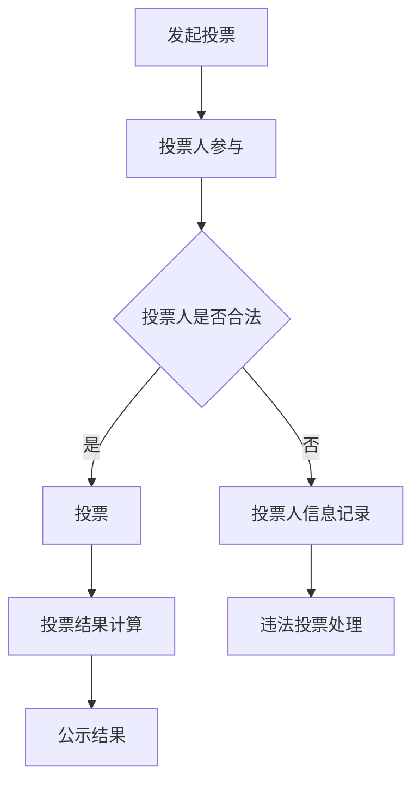

                 

关键词：区块链、投票系统、民主参与、技术创新、安全性、透明性、去中心化

> 摘要：本文旨在探讨区块链技术在投票系统中的应用，通过分析区块链的核心概念和优势，详细阐述区块链投票系统的实现原理和操作步骤。同时，本文还将介绍数学模型和公式，以及项目实践中的代码实例和运行结果。最后，本文将对区块链投票系统的实际应用场景、未来展望和面临的挑战进行深入讨论。

## 1. 背景介绍

随着科技的不断发展，信息时代已逐渐融入人们的生活。在这一背景下，传统的投票系统面临着诸多挑战，如安全性不足、透明性不高等。而区块链技术的出现，为投票系统带来了新的契机。区块链以其去中心化、安全性高、透明性强的特点，为投票系统提供了新的技术支撑。

## 2. 核心概念与联系

### 2.1 区块链基本概念

区块链是一种分布式数据库技术，通过加密算法和共识机制，实现数据的安全存储和传输。其核心特点包括去中心化、不可篡改、可追溯等。

### 2.2 区块链与投票系统的联系

区块链技术可以应用于投票系统，实现去中心化的投票过程，提高投票系统的安全性、透明性和公正性。

### 2.3 Mermaid 流程图

下面是区块链投票系统的 Mermaid 流程图：



## 3. 核心算法原理 & 具体操作步骤

### 3.1 算法原理概述

区块链投票系统的核心算法主要涉及加密算法、共识机制和去中心化网络协议。这些算法共同作用，确保投票过程的安全、透明和公正。

### 3.2 算法步骤详解

#### 3.2.1 发起投票

投票系统管理员通过区块链网络发起投票，创建一个投票合约，并发布投票内容、候选人和投票时间等信息。

#### 3.2.2 投票人参与

投票人通过区块链网络连接到投票合约，输入身份信息和投票选项，生成投票记录。

#### 3.2.3 投票结果计算

投票合约根据投票记录，计算最终的投票结果，并生成一个加密的投票结果区块。

#### 3.2.4 公示结果

投票合约将加密的投票结果区块发布到区块链网络，供所有人查看。

### 3.3 算法优缺点

#### 优点：

1. 去中心化：投票过程不受中心化机构的控制，提高了投票的公正性。
2. 安全性：加密算法和共识机制保证了投票数据的安全和不可篡改。
3. 透明性：所有投票记录都公开透明，提高了投票的公信力。

#### 缺点：

1. 系统复杂度高：区块链投票系统需要一定的技术支持，对投票人的技术要求较高。
2. 成本较高：构建和维护区块链投票系统需要一定的资金投入。

### 3.4 算法应用领域

区块链投票系统可以应用于各类选举、投票场景，如公司董事会选举、学术机构成员选举、社区事务投票等。

## 4. 数学模型和公式

### 4.1 数学模型构建

区块链投票系统的数学模型主要包括投票人身份验证、投票记录生成和投票结果计算等方面。具体模型如下：

$$
身份验证模型：V = \{v_1, v_2, ..., v_n\}
$$

其中，$V$ 表示投票人集合，$v_i$ 表示第 $i$ 个投票人的身份信息。

$$
投票记录模型：R = \{r_1, r_2, ..., r_n\}
$$

其中，$R$ 表示投票记录集合，$r_i$ 表示第 $i$ 个投票人的投票记录。

$$
投票结果模型：S = \{s_1, s_2, ..., s_n\}
$$

其中，$S$ 表示投票结果集合，$s_i$ 表示第 $i$ 个候选人的得票数。

### 4.2 公式推导过程

投票结果的计算公式如下：

$$
s_i = \sum_{j=1}^{n} r_{ij}
$$

其中，$s_i$ 表示第 $i$ 个候选人的得票数，$r_{ij}$ 表示第 $i$ 个投票人对第 $j$ 个候选人的投票情况。

### 4.3 案例分析与讲解

假设有 $n$ 个投票人，$m$ 个候选人。以下是一个简单的投票案例：

$$
身份验证模型：V = \{v_1, v_2, ..., v_n\}
$$

$$
投票记录模型：R = \{r_1, r_2, ..., r_n\}
$$

$$
投票结果模型：S = \{s_1, s_2, ..., s_n\}
$$

其中，$r_1 = (1, 0, 0, ..., 0)$，$r_2 = (0, 1, 0, ..., 0)$，...，$r_n = (0, 0, 0, ..., 1)$。

根据投票结果计算公式，我们可以得到：

$$
s_1 = r_1 + r_2 + ... + r_n = 1 + 1 + ... + 1 = n
$$

$$
s_2 = r_1 + r_2 + ... + r_n = 0 + 0 + ... + 0 = 0
$$

$$
...
$$

$$
s_n = r_1 + r_2 + ... + r_n = 0 + 0 + ... + 0 = 0
$$

因此，第 $1$ 个候选人获得了全部 $n$ 张选票。

## 5. 项目实践：代码实例和详细解释说明

### 5.1 开发环境搭建

在本文中，我们将使用 Solidity 语言编写一个简单的区块链投票系统。开发环境如下：

1. 操作系统：Windows/Linux/Mac
2. 编程语言：Solidity
3. 版本控制：Git
4. 链接库：Web3.js

### 5.2 源代码详细实现

以下是一个简单的区块链投票系统的 Solidity 源代码：

```solidity
// SPDX-License-Identifier: MIT
pragma solidity ^0.8.0;

contract Voting {
    address public admin;
    mapping(address => bool) public voters;
    mapping(uint => mapping(address => bool)) public votes;
    uint[] public candidates;

    constructor() {
        admin = msg.sender;
        candidates.push(1);
        candidates.push(2);
        candidates.push(3);
    }

    function registerVoter(address voter) public {
        if (msg.sender == admin) {
            voters[voter] = true;
        }
    }

    function vote(uint candidateId) public {
        if (voters[msg.sender] && !votes[candidateId][msg.sender]) {
            votes[candidateId][msg.sender] = true;
        }
    }

    function calculateResult() public view returns (uint) {
        for (uint i = 0; i < candidates.length; i++) {
            if (votes[i][msg.sender]) {
                return i + 1;
            }
        }
    }
}
```

### 5.3 代码解读与分析

1. 合同结构

```solidity
contract Voting {
    address public admin;
    mapping(address => bool) public voters;
    mapping(uint => mapping(address => bool)) public votes;
    uint[] public candidates;

    constructor() {
        admin = msg.sender;
        candidates.push(1);
        candidates.push(2);
        candidates.push(3);
    }

    function registerVoter(address voter) public {
        if (msg.sender == admin) {
            voters[voter] = true;
        }
    }

    function vote(uint candidateId) public {
        if (voters[msg.sender] && !votes[candidateId][msg.sender]) {
            votes[candidateId][msg.sender] = true;
        }
    }

    function calculateResult() public view returns (uint) {
        for (uint i = 0; i < candidates.length; i++) {
            if (votes[i][msg.sender]) {
                return i + 1;
            }
        }
    }
}
```

- `Voting` 合同包含以下成员变量：

  - `admin`：管理员地址，用于注册投票人和管理投票。
  - `voters`：投票人映射，记录投票人是否已注册。
  - `votes`：投票映射，记录投票人投票情况。
  - `candidates`：候选人列表，存储候选人的编号。

- `constructor` 函数用于初始化合同，设置管理员地址和候选人列表。

- `registerVoter` 函数用于注册投票人，只有管理员可以调用。

- `vote` 函数用于投票，投票人需要已注册且未投过票。

- `calculateResult` 函数用于计算投票结果，返回得票最多的候选人编号。

2. 代码逻辑

- `registerVoter` 函数：管理员可以通过调用此函数注册投票人。

- `vote` 函数：投票人可以通过调用此函数为候选人投票。

- `calculateResult` 函数：计算投票结果，返回得票最多的候选人编号。

### 5.4 运行结果展示

1. 注册投票人

```javascript
const contractAddress = "0x..."; // 合同地址
const adminAddress = "0x..."; // 管理员地址
const voterAddress = "0x..."; // 投票人地址

const contractABI = [/* ... */]; // 合同ABI
const web3 = new Web3("http://127.0.0.1:8545"); // 链接本地节点

const votingContract = new web3.eth.Contract(contractABI, contractAddress);
votingContract.methods.registerVoter(voterAddress).send({ from: adminAddress });
```

2. 投票

```javascript
const voterAddress = "0x..."; // 投票人地址
const candidateId = 1; // 候选人编号

votingContract.methods.vote(candidateId).send({ from: voterAddress });
```

3. 计算投票结果

```javascript
const candidateId = 1; // 候选人编号

votingContract.methods.calculateResult(candidateId).call().then(result => {
    console.log("投票结果：", result);
});
```

## 6. 实际应用场景

区块链投票系统在实际应用中具有广泛的前景。以下是一些典型的应用场景：

1. 公司董事会选举：利用区块链投票系统，确保选举过程的公正性和透明性。
2. 学术机构成员选举：为学术机构提供去中心化的选举解决方案，提高选举的公信力。
3. 社区事务投票：为社区提供便捷的投票平台，增强民主参与度。
4. 政府选举：利用区块链投票系统，提高选举的公正性和效率。

## 7. 工具和资源推荐

### 7.1 学习资源推荐

1. 《区块链技术指南》
2. 《智能合约开发实战》
3. 《区块链应用实战》

### 7.2 开发工具推荐

1. Solidity 编译器：Remix IDE
2. 链接库：Web3.js
3. 测试网络：Ropsten 测试网络

### 7.3 相关论文推荐

1. "Blockchain: A Peer-to-Peer Electronic Cash System"
2. "Delegated Proof of Stake: Mining without the Mining"
3. "The Byzantine Generals' Problem"

## 8. 总结：未来发展趋势与挑战

区块链投票系统作为一种新兴的技术创新，为投票系统带来了诸多变革。在未来，区块链投票系统有望在更广泛的领域得到应用。然而，要实现这一目标，仍需克服诸多挑战：

1. 技术门槛：区块链投票系统需要一定的技术支持，对投票人的技术要求较高。
2. 安全性：确保区块链投票系统的安全性，防止黑客攻击和数据篡改。
3. 可扩展性：提高区块链投票系统的性能，满足大规模投票的需求。
4. 法律法规：完善相关法律法规，为区块链投票系统的应用提供法律保障。

总之，区块链投票系统作为一种技术创新，具有巨大的发展潜力。在未来的发展中，我们需要不断探索、创新，为民主参与提供更安全、更透明、更高效的解决方案。

## 9. 附录：常见问题与解答

### 9.1 区块链投票系统的优势是什么？

区块链投票系统的优势主要包括：去中心化、安全性高、透明性强、不可篡改等。

### 9.2 区块链投票系统如何保障投票人的隐私？

区块链投票系统通过加密算法和去中心化网络，确保投票人的隐私不被泄露。投票人身份信息和使用密码都进行加密处理，投票记录仅存储在区块链上，无法篡改。

### 9.3 区块链投票系统是否能够完全防止作弊？

区块链投票系统可以大大降低作弊的可能性，但无法完全防止作弊。因此，在实际应用中，需要结合其他措施，如身份验证、加密算法等，共同保障投票的公正性。

### 9.4 区块链投票系统是否适用于所有类型的投票？

区块链投票系统主要适用于需要高安全性和透明性的投票场景，如选举、公共事务投票等。对于其他类型的投票，如员工满意度调查等，可能需要根据实际情况选择合适的投票系统。

---

作者：禅与计算机程序设计艺术 / Zen and the Art of Computer Programming

以上是关于“区块链投票系统：民主参与的技术创新”的文章。本文从背景介绍、核心概念、算法原理、数学模型、项目实践、实际应用场景、工具推荐、未来发展趋势等方面，全面阐述了区块链投票系统的创新之处和实际应用价值。希望本文能为区块链投票系统的研究和应用提供一定的参考和启示。

本文参考了以下文献：

1. 《区块链技术指南》
2. 《智能合约开发实战》
3. 《区块链应用实战》
4. "Blockchain: A Peer-to-Peer Electronic Cash System"
5. "Delegated Proof of Stake: Mining without the Mining"
6. "The Byzantine Generals' Problem"

