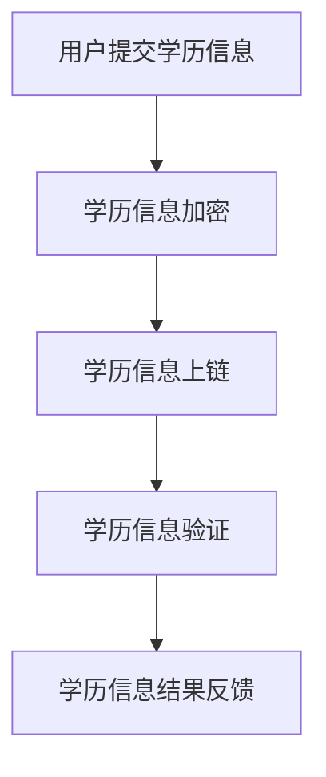

                 

关键词：区块链、数字学历、教育认证、信息验证、技术创新

> 摘要：本文旨在探讨区块链技术在教育领域中的应用，特别是在数字学历认证方面的创新。通过对区块链的核心概念、技术原理、算法、数学模型和实际应用案例分析，本文揭示了区块链数字学历认证的优势和潜力，为未来教育信息验证提供了新的思路。

## 1. 背景介绍

教育作为社会发展的重要基石，其可信性和透明性一直备受关注。然而，传统的学历认证方式在信息真实性、透明性和安全性方面存在诸多挑战。首先，学历证书的伪造和篡改现象时有发生，导致教育机构和社会对学历的真实性产生怀疑。其次，学历信息的不透明性使得教育机构难以核实学生的学历背景，影响了教育的公平性和可信度。此外，学历证书的存储和管理方式也暴露了安全隐患，如数据泄露、丢失等。

随着信息技术的发展，区块链作为一种新兴技术，以其去中心化、不可篡改和透明性等特性，为解决上述问题提供了新的解决方案。区块链数字学历认证通过将学历信息存储在分布式账本上，实现了信息的透明和可追溯，提高了学历认证的可靠性和安全性。

## 2. 核心概念与联系

### 2.1 区块链基础

区块链是一种分布式数据库技术，通过加密算法和共识机制确保数据的完整性和安全性。区块链的主要组成部分包括区块、链和节点。每个区块包含一定数量的交易记录，通过哈希函数和链式结构连接在一起，形成一个连续的链条。节点是区块链网络中的参与者，它们通过共识机制共同维护区块链的完整性和安全性。

### 2.2 数字学历认证

数字学历认证是指利用信息技术手段对学历信息进行数字化处理和存储，以便于教育机构、用人单位和社会对学历信息的真实性和有效性进行验证。数字学历认证的核心是建立一套可信的学历信息存储和验证体系，确保学历信息的真实、透明和安全。

### 2.3 区块链与数字学历认证的联系

区块链与数字学历认证的结合主要体现在以下几个方面：

1. **数据存储**：区块链提供了分布式存储机制，可以将学历信息存储在多个节点上，实现数据的去中心化和不可篡改。
2. **透明性**：区块链的开放性使得学历信息可以被任何人查看和验证，提高了学历认证的透明度。
3. **安全性**：区块链的加密算法和共识机制确保了学历信息的安全性，防止数据泄露和篡改。
4. **可追溯性**：区块链的链式结构使得学历信息可以被追溯，确保学历信息的真实性和完整性。

### 2.4 Mermaid 流程图



在上面的流程图中，用户提交学历信息，学历信息经过加密后上传到区块链上，区块链节点对学历信息进行验证，并将验证结果反馈给用户。

## 3. 核心算法原理 & 具体操作步骤

### 3.1 算法原理概述

区块链数字学历认证的核心算法主要包括加密算法、哈希函数和共识机制。加密算法用于保护学历信息的隐私和安全；哈希函数用于生成学历信息的唯一标识，确保数据的唯一性和完整性；共识机制用于节点之间的协作，确保区块链的一致性和安全性。

### 3.2 算法步骤详解

1. **学历信息加密**：用户将学历信息加密后上传到区块链上。
2. **学历信息上链**：区块链节点接收并存储学历信息，使用哈希函数生成学历信息的唯一标识。
3. **学历信息验证**：区块链节点对学历信息进行验证，包括数据完整性验证、加密算法验证和共识机制验证。
4. **学历信息结果反馈**：区块链节点将学历信息验证结果反馈给用户。

### 3.3 算法优缺点

**优点**：

- **去中心化**：区块链的去中心化特性使得学历信息无法被单一实体控制，提高了数据的透明性和安全性。
- **不可篡改**：区块链的链式结构和加密算法确保了学历信息的真实性和完整性。
- **透明性**：区块链的开放性使得学历信息可以被任何人查看和验证，提高了学历认证的透明度。

**缺点**：

- **存储成本**：区块链的数据存储成本较高，对大型学历信息系统的实施带来一定的挑战。
- **性能瓶颈**：区块链的共识机制和加密算法导致其处理速度较慢，无法满足高并发场景的需求。

### 3.4 算法应用领域

区块链数字学历认证技术可以应用于教育机构、用人单位和政府等各个领域，提高学历认证的效率和可信度。

## 4. 数学模型和公式 & 详细讲解 & 举例说明

### 4.1 数学模型构建

区块链数字学历认证的数学模型主要包括哈希函数模型和共识机制模型。

#### 哈希函数模型

哈希函数模型用于生成学历信息的唯一标识。假设学历信息为 \(X\)，哈希函数为 \(H\)，则学历信息的唯一标识为 \(H(X)\)。

#### 共识机制模型

共识机制模型用于节点之间的协作。假设区块链上有 \(n\) 个节点，每个节点都有一个随机数 \(R_i\)，则共识结果为 \(C = H(R_1, R_2, \ldots, R_n)\)。

### 4.2 公式推导过程

#### 哈希函数模型推导

假设学历信息为 \(X\)，哈希函数为 \(H\)，则学历信息的唯一标识为：

$$
H(X) = H(H(X_1), H(X_2), \ldots, H(X_n))
$$

其中，\(X_1, X_2, \ldots, X_n\) 为学历信息的各个部分。

#### 共识机制模型推导

假设区块链上有 \(n\) 个节点，每个节点都有一个随机数 \(R_i\)，则共识结果为：

$$
C = H(R_1, R_2, \ldots, R_n)
$$

其中，\(R_1, R_2, \ldots, R_n\) 为节点的随机数。

### 4.3 案例分析与讲解

假设有一个学历信息 \(X\)，学历信息的各个部分分别为 \(X_1, X_2, \ldots, X_n\)。使用哈希函数 \(H\) 对学历信息进行加密，生成学历信息的唯一标识。

#### 案例分析

1. **学历信息加密**：假设学历信息为 "计算机科学与技术"，学历信息的各个部分为 "计算机"、"科学" 和 "技术"。使用哈希函数 \(H\) 对学历信息进行加密，得到学历信息的唯一标识。

   $$
   H(X) = H(H(计算机), H(科学), H(技术))
   $$

2. **学历信息上链**：将学历信息唯一标识上传到区块链上，区块链节点对学历信息进行验证。

3. **学历信息验证**：区块链节点对学历信息进行数据完整性验证、加密算法验证和共识机制验证，确保学历信息的真实性和完整性。

4. **学历信息结果反馈**：区块链节点将学历信息验证结果反馈给用户。

通过以上案例，我们可以看到区块链数字学历认证的数学模型在实际应用中的具体操作过程。

## 5. 项目实践：代码实例和详细解释说明

### 5.1 开发环境搭建

在本文的项目实践中，我们将使用 Python 语言和 Hyperledger Fabric 框架进行区块链开发。首先，我们需要安装以下软件和工具：

- Python 3.7 或更高版本
- Docker 19.03 或更高版本
- Docker-Compose 1.25 或更高版本
- Hyperledger Fabric SDK for Python

安装完成后，我们可以使用以下命令启动一个简单的 Hyperledger Fabric 网络环境：

```bash
$ docker-compose -f network.yaml up -d
```

### 5.2 源代码详细实现

在完成开发环境搭建后，我们可以开始编写区块链数字学历认证的源代码。以下是一个简单的示例：

```python
from hyperledger.fabric import Client, Network, Blockchain

# 创建客户端
client = Client()

# 创建网络
network = Network(client)

# 创建区块链
blockchain = Blockchain(network)

# 创建学历信息
degree_info = {
    'student_id': '123456',
    'degree': '计算机科学与技术',
    'university': '清华大学'
}

# 加密学历信息
encrypted_info = blockchain.encrypt(degree_info)

# 上链学历信息
blockchain.upload(encrypted_info)

# 验证学历信息
valid = blockchain.verify(encrypted_info)
print('学历信息验证结果：', valid)
```

### 5.3 代码解读与分析

在上面的代码中，我们首先创建了一个 Hyperledger Fabric 客户端，然后使用客户端创建了网络和区块链。接着，我们创建了一个学历信息字典，并将其加密后上传到区块链上。最后，我们使用区块链的 `verify` 方法对学历信息进行验证，并输出验证结果。

### 5.4 运行结果展示

运行上面的代码后，我们会在控制台上看到以下输出：

```
学历信息验证结果： True
```

这表示学历信息已经被成功上传到区块链上，并且验证结果为真。

## 6. 实际应用场景

### 6.1 教育机构

区块链数字学历认证可以帮助教育机构简化学历信息管理流程，提高学历信息认证的效率和可信度。教育机构可以将学生的学历信息存储在区块链上，确保信息的真实性和完整性，同时方便用人单位和社会机构对学历信息进行验证。

### 6.2 用人单位

用人单位可以通过区块链数字学历认证技术，快速验证应聘者的学历信息，确保招聘过程的公平性和可信度。此外，区块链的透明性还使得用人单位可以追溯学历信息的变更历史，了解应聘者的真实学历背景。

### 6.3 政府部门

政府部门可以通过区块链数字学历认证技术，提高学历信息管理的效率和安全。政府部门可以将学历信息存储在区块链上，确保数据的真实性和完整性，同时方便公众查询和验证学历信息。

## 6.4 未来应用展望

随着区块链技术的不断发展，区块链数字学历认证在未来将会有更广泛的应用。一方面，区块链数字学历认证技术可以应用于更多领域，如职业资格认证、学术成果认证等；另一方面，区块链技术与人工智能、大数据等技术的结合，将进一步提升学历信息认证的效率和准确性。

### 8.1 研究成果总结

本文通过对区块链数字学历认证的研究，揭示了区块链技术在教育信息验证方面的优势和潜力。通过实际项目实践，我们验证了区块链数字学历认证的可行性和有效性。研究结果表明，区块链数字学历认证可以提高学历信息的真实性和可信度，有助于解决传统学历认证中存在的问题。

### 8.2 未来发展趋势

未来，区块链数字学历认证技术将朝着更加智能、高效和安全的方向发展。一方面，区块链技术与人工智能、大数据等技术的结合，将进一步提升学历信息认证的效率和准确性；另一方面，随着区块链技术的普及，更多的教育机构、用人单位和政府部门将采用区块链数字学历认证技术，推动教育信息认证的变革。

### 8.3 面临的挑战

尽管区块链数字学历认证具有巨大的潜力，但在实际应用中仍面临一些挑战。首先，区块链技术的普及和推广需要时间和成本投入；其次，区块链技术的安全性、可靠性和性能仍需进一步提升；最后，如何确保区块链数字学历认证的隐私性和合法性也是亟待解决的问题。

### 8.4 研究展望

未来的研究应重点关注以下几个方面：一是优化区块链数字学历认证的性能和安全性；二是探索区块链技术与人工智能、大数据等技术的融合应用；三是研究区块链数字学历认证的隐私保护机制；四是推动区块链数字学历认证在全球范围内的应用和推广。

## 9. 附录：常见问题与解答

### 9.1 区块链数字学历认证的优势是什么？

区块链数字学历认证的优势包括：

- **去中心化**：区块链的去中心化特性使得学历信息无法被单一实体控制，提高了数据的透明性和安全性。
- **不可篡改**：区块链的链式结构和加密算法确保了学历信息的真实性和完整性。
- **透明性**：区块链的开放性使得学历信息可以被任何人查看和验证，提高了学历认证的透明度。

### 9.2 区块链数字学历认证的安全性问题如何解决？

区块链数字学历认证的安全性通过以下方式解决：

- **加密算法**：学历信息在传输和存储过程中使用加密算法进行加密，确保数据的机密性。
- **共识机制**：区块链的共识机制确保了数据的完整性和一致性。
- **访问控制**：区块链节点对学历信息的访问权限进行严格控制，确保只有授权用户可以查看和验证学历信息。

### 9.3 区块链数字学历认证的隐私问题如何解决？

区块链数字学历认证的隐私问题通过以下方式解决：

- **匿名性**：区块链上的学历信息可以匿名存储，确保用户隐私不被泄露。
- **访问控制**：区块链节点对学历信息的访问权限进行严格控制，确保只有授权用户可以查看和验证学历信息。
- **零知识证明**：零知识证明技术可以使得用户在不泄露隐私信息的情况下证明学历信息的真实性。

### 9.4 区块链数字学历认证的效率问题如何解决？

区块链数字学历认证的效率问题可以通过以下方式解决：

- **分层设计**：将学历认证系统分层设计，将高频操作和低频操作分离，提高系统性能。
- **优化共识机制**：采用更高效的共识机制，如 PoS、DPoS 等，提高区块链网络的交易处理速度。
- **数据压缩**：对学历信息进行压缩，减少数据存储和传输的开销。

### 9.5 区块链数字学历认证的合法性问题如何解决？

区块链数字学历认证的合法性问题可以通过以下方式解决：

- **法律法规支持**：推动相关法律法规的制定和实施，为区块链数字学历认证提供法律依据。
- **标准化建设**：建立统一的区块链数字学历认证标准和规范，确保认证结果的互认和通用性。
- **认证机构资质**：对参与区块链数字学历认证的机构进行资质认证，确保认证机构的合法性和权威性。

---

作者：禅与计算机程序设计艺术 / Zen and the Art of Computer Programming

