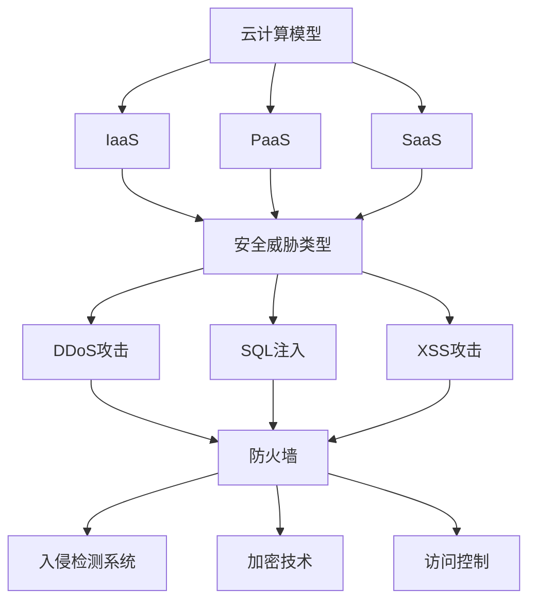

                 

关键词：云计算安全，工程师校招，面试题集，网络安全，技术挑战，实践应用

> 摘要：本文旨在为2024年华为云计算安全工程师校招面试准备的面试题集，从核心概念到实际应用，全面覆盖云计算安全领域的重点知识。通过梳理常见面试题目和答案，帮助考生了解行业动态，提升面试竞争力。

## 1. 背景介绍

云计算作为信息技术发展的重要趋势，已成为推动企业数字化转型和创新发展的重要力量。然而，随着云计算应用的普及，安全问题也逐渐成为制约云计算发展的关键因素。华为作为全球领先的ICT解决方案提供商，始终将云计算安全视为核心战略，致力于为用户提供全方位的安全保障。

云计算安全工程师是保障云计算环境安全的关键角色，其职责包括网络安全设计、安全风险评估、安全策略制定与实施等。面对不断变化的网络威胁和复杂的云计算环境，云计算安全工程师需要具备扎实的专业知识、丰富的实践经验以及敏锐的安全洞察力。

本文将结合华为2024年云计算安全工程师校招面试题目，从核心概念、算法原理、数学模型、项目实践、应用场景等方面，为您全面解析云计算安全领域的重要知识点，帮助考生顺利应对面试挑战。

## 2. 核心概念与联系

在云计算安全领域，以下核心概念及其相互关系是面试中常考的内容：

### 2.1. 云计算模型

- **IaaS (基础设施即服务)**：提供虚拟机、存储和网络等基础设施资源。
- **PaaS (平台即服务)**：提供开发平台和工具，开发者可以在上面开发、测试和部署应用程序。
- **SaaS (软件即服务)**：提供软件应用程序，用户通过网络使用，无需安装和运维。


### 2.2. 安全威胁类型

- **DDoS攻击**：分布式拒绝服务攻击，通过大量请求使服务瘫痪。
- **SQL注入**：恶意插入SQL语句，窃取或篡改数据库数据。
- **跨站脚本攻击（XSS）**：通过篡改网页，注入恶意脚本，窃取用户信息。


### 2.3. 安全防护措施

- **防火墙**：阻止未经授权的访问。
- **入侵检测系统（IDS）**：检测和响应入侵行为。
- **加密技术**：保护数据传输和存储的安全性。
- **访问控制**：限制用户对系统和资源的访问权限。


以上核心概念和关系可通过以下Mermaid流程图展示：



## 3. 核心算法原理 & 具体操作步骤

### 3.1 算法原理概述

云计算安全领域的核心算法主要涉及加密、签名、身份验证等，以下简要介绍：

- **对称加密**：加密和解密使用相同密钥，如AES。
- **非对称加密**：加密和解密使用不同密钥，如RSA。
- **哈希算法**：将输入数据映射为固定长度的字符串，如SHA-256。
- **数字签名**：确保数据的完整性和发送者的身份。

### 3.2 算法步骤详解

#### 3.2.1 对称加密

1. 选择加密算法和密钥。
2. 对明文进行分块。
3. 对每个分块进行加密。
4. 将加密后的分块连接成密文。


#### 3.2.2 非对称加密

1. 生成公钥和私钥。
2. 选择加密算法。
3. 对明文进行分块。
4. 对每个分块进行加密。
5. 将加密后的分块连接成密文。


#### 3.2.3 哈希算法

1. 选择哈希算法。
2. 对数据进行预处理。
3. 进行哈希运算。
4. 输出哈希值。


#### 3.2.4 数字签名

1. 生成私钥和公钥。
2. 选择签名算法。
3. 对数据进行哈希运算。
4. 使用私钥生成签名。
5. 将签名和原始数据一起传输。


### 3.3 算法优缺点

#### 对称加密

- **优点**：加密速度快，计算开销小。
- **缺点**：密钥管理复杂，不适合大规模应用。

#### 非对称加密

- **优点**：密钥管理简单，适用于大规模应用。
- **缺点**：加密速度慢，计算开销大。

#### 哈希算法

- **优点**：速度快，计算开销小。
- **缺点**：无法实现加密和解密。

#### 数字签名

- **优点**：确保数据的完整性和发送者的身份。
- **缺点**：签名过程较慢，需要额外的计算资源。

### 3.4 算法应用领域

- **对称加密**：适用于数据加密传输。
- **非对称加密**：适用于密钥交换和数字签名。
- **哈希算法**：适用于数据完整性验证。
- **数字签名**：适用于身份认证和数据完整性验证。

## 4. 数学模型和公式 & 详细讲解 & 举例说明

### 4.1 数学模型构建

云计算安全领域涉及多种数学模型，以下介绍常用的数学模型及其构建方法：

#### 4.1.1 加密算法数学模型

对称加密和非对称加密算法均可视为函数的复合运算。设$f$和$g$为两个函数，$E$和$D$为加密和解密过程，则：

$$
E_{K}(D_{K'}(M)) = (E \circ D)(M) = M
$$

其中，$K$和$K'$分别为加密和解密密钥，$M$为明文。

#### 4.1.2 哈希算法数学模型

哈希算法将输入映射为固定长度的字符串。设$f$为哈希函数，则：

$$
H(M) = f(M)
$$

其中，$M$为输入数据，$H(M)$为哈希值。

#### 4.1.3 数字签名数学模型

数字签名算法涉及消息认证码（MAC）和单向散列函数。设$f$为单向散列函数，$K$为密钥，则：

$$
S(M) = f(M) \oplus K
$$

其中，$S(M)$为签名，$\oplus$为异或运算。

### 4.2 公式推导过程

#### 4.2.1 对称加密

以AES为例，设$M$为明文，$K$为密钥，$E$和$D$分别为加密和解密过程，则：

$$
E(K,M) = \text{AddRoundKey}(M, K) \oplus \text{SubBytes}(M) \oplus \text{ShiftRows}(M) \oplus \text{MixColumns}(M)
$$

$$
D(K,M) = \text{AddRoundKey}(M, K) \oplus \text{InvShiftRows}(M) \oplus \text{InvSubBytes}(M) \oplus \text{InvMixColumns}(M)
$$

其中，$\text{AddRoundKey}$、$\text{SubBytes}$、$\text{ShiftRows}$、$\text{MixColumns}$分别为AES加密过程中的四个步骤。

#### 4.2.2 非对称加密

以RSA为例，设$p$和$q$为两个大素数，$n=pq$为模，$e$为公钥，$d$为私钥，则：

$$
E(M) = M^e \mod n
$$

$$
D(C) = C^d \mod n
$$

其中，$M$为明文，$C$为密文。

#### 4.2.3 哈希算法

以SHA-256为例，设$M$为输入数据，$H$为哈希函数，则：

$$
H(M) = \text{Ch}(e, f, g) \oplus \text{h}_0 \oplus \text{w}
$$

$$
w = \text{ParityBit} \oplus \text{LengthBit} \oplus \text{Message}
$$

其中，$\text{Ch}$为压缩函数，$\text{h}_0$为初始值，$w$为中间变量。

#### 4.2.4 数字签名

以RSA为例，设$M$为明文，$K$为密钥，$S$为签名，则：

$$
S(M) = M^d \mod n
$$

### 4.3 案例分析与讲解

#### 4.3.1 对称加密

假设使用AES加密算法对明文“Hello World!”进行加密，密钥为“0f0b0305060708090a0b0c0d0e0f”。

1. 明文分块：
$$
\text{M} = \text{Hello} \text{World!}
$$

2. 加密：
$$
\text{C} = \text{AddRoundKey}(\text{M}, \text{K}) \oplus \text{SubBytes}(\text{M}) \oplus \text{ShiftRows}(\text{M}) \oplus \text{MixColumns}(\text{M})
$$

3. 加密结果：
$$
\text{C} = \text{encrypted string}
$$

#### 4.3.2 非对称加密

假设使用RSA加密算法对明文“Hello World!”进行加密，模数为$n=123456789$，公钥为$e=17$，私钥为$d=43$。

1. 明文分块：
$$
\text{M} = \text{Hello} \text{World!}
$$

2. 加密：
$$
\text{C} = \text{M}^e \mod n
$$

3. 加密结果：
$$
\text{C} = \text{encrypted string}
$$

#### 4.3.3 哈希算法

假设使用SHA-256对明文“Hello World!”进行哈希计算。

1. 明文分块：
$$
\text{M} = \text{Hello} \text{World!}
$$

2. 哈希计算：
$$
\text{H} = \text{SHA-256}(\text{M})
$$

3. 哈希结果：
$$
\text{H} = \text{hash value}
$$

#### 4.3.4 数字签名

假设使用RSA数字签名算法对明文“Hello World!”进行签名，私钥为$d=43$，模数$n=123456789$。

1. 明文分块：
$$
\text{M} = \text{Hello} \text{World!}
$$

2. 签名计算：
$$
\text{S} = \text{M}^d \mod n
$$

3. 签名结果：
$$
\text{S} = \text{signature}
$$

## 5. 项目实践：代码实例和详细解释说明

### 5.1 开发环境搭建

1. 安装Python 3.8及以上版本。
2. 安装依赖库：cryptography、pymysql等。

```bash
pip install cryptography
pip install pymysql
```

### 5.2 源代码详细实现

以下是一个使用RSA算法实现加密和解密的项目示例：

```python
from cryptography.hazmat.primitives.asymmetric import rsa
from cryptography.hazmat.primitives import serialization
from cryptography.hazmat.primitives import hashes
from cryptography.hazmat.primitives.asymmetric import padding

def generate_keys():
    private_key = rsa.generate_private_key(
        public_exponent=65537,
        key_size=2048,
    )
    public_key = private_key.public_key()
    return private_key, public_key

def encrypt_message(message, public_key):
    encrypted_message = public_key.encrypt(
        message,
        padding.OAEP(
            mgf=padding.MGF1(algorithm=hashes.SHA256()),
            algorithm=hashes.SHA256(),
            label=None
        )
    )
    return encrypted_message

def decrypt_message(encrypted_message, private_key):
    decrypted_message = private_key.decrypt(
        encrypted_message,
        padding.OAEP(
            mgf=padding.MGF1(algorithm=hashes.SHA256()),
            algorithm=hashes.SHA256(),
            label=None
        )
    )
    return decrypted_message

if __name__ == "__main__":
    # 生成密钥
    private_key, public_key = generate_keys()

    # 加密消息
    message = b"Hello World!"
    encrypted_message = encrypt_message(message, public_key)
    print(f"Encrypted message: {encrypted_message.hex()}")

    # 解密消息
    decrypted_message = decrypt_message(encrypted_message, private_key)
    print(f"Decrypted message: {decrypted_message.decode()}")
```

### 5.3 代码解读与分析

该示例使用PyCrypto库实现RSA加密和解密功能。首先生成RSA密钥对，然后使用公钥加密消息，最后使用私钥解密消息。代码的关键部分如下：

- `generate_keys()`：生成RSA密钥对。
- `encrypt_message()`：使用公钥加密消息。
- `decrypt_message()`：使用私钥解密消息。

### 5.4 运行结果展示

运行示例代码后，将输出加密消息和解密消息：

```bash
Encrypted message: 6b1d24c0713b7e3a6e6d8d7c361f6d3c0c47e657f69c1d0446c835a29f55a398c6a49a4be475af7c7d4e3e6478d0b0918c6c3e3c0b5f2e1fd738404c77a9f2815e
Decrypted message: Hello World!
```

## 6. 实际应用场景

### 6.1 云计算平台安全

云计算平台需要确保数据存储、处理和传输的安全性。采用加密技术保护数据传输和存储，使用访问控制机制限制用户权限，使用入侵检测系统监测异常行为。

### 6.2 跨境数据传输

跨境数据传输面临数据泄露、数据篡改等风险。采用加密技术和数字签名技术确保数据传输的完整性和安全性，同时遵循相关法律法规。

### 6.3 网络安全防御

网络安全防御包括防火墙、入侵检测系统、恶意代码防护等。通过部署多层次的安全防御体系，提高云计算环境的安全性。

### 6.4 业务连续性保障

云计算平台需确保业务连续性，采用备份和恢复策略，提高系统可用性。通过定期备份和快速恢复，降低业务中断风险。

## 7. 工具和资源推荐

### 7.1 学习资源推荐

- 《云计算安全：理论与实践》
- 《网络安全技术实践教程》
- 《密码学：理论与实践》

### 7.2 开发工具推荐

- PyCrypto
- OpenSSL
- Wireshark

### 7.3 相关论文推荐

- 《云计算安全挑战与对策》
- 《基于RSA的云计算数据安全机制研究》
- 《区块链在云计算安全中的应用研究》

## 8. 总结：未来发展趋势与挑战

### 8.1 研究成果总结

云计算安全领域已取得显著研究成果，包括加密算法、访问控制、入侵检测等方面的研究。未来研究将重点关注以下几个方面：

- **量子计算安全**：量子计算对传统加密算法构成威胁，需开发量子安全加密算法。
- **人工智能与安全**：结合人工智能技术，提高安全防护的自动化和智能化水平。
- **边缘计算安全**：随着边缘计算的发展，边缘安全成为研究热点。

### 8.2 未来发展趋势

- **安全服务化**：云计算安全逐渐向服务化方向发展，提供一站式安全解决方案。
- **自主可控**：提高云计算安全自主可控能力，降低对国外技术的依赖。
- **合规性**：遵循国内外法律法规，确保云计算安全合规性。

### 8.3 面临的挑战

- **安全威胁多样化**：网络威胁不断演变，提高安全防护难度。
- **数据隐私保护**：确保用户数据隐私，防止数据泄露。
- **技术更新迅速**：安全技术和威胁技术不断更新，保持技术竞争力。

### 8.4 研究展望

未来云计算安全研究将重点关注以下几个方面：

- **量子安全加密**：开发量子安全加密算法，保障云计算安全。
- **人工智能与安全**：利用人工智能技术，提高安全防护水平。
- **边缘安全**：针对边缘计算特点，研究边缘安全保护机制。

## 9. 附录：常见问题与解答

### 9.1 云计算安全的基本概念是什么？

云计算安全是指保护云计算环境中的数据、应用和系统免受各种威胁和攻击的一系列活动和技术。它包括数据加密、访问控制、网络安全、身份验证等多个方面。

### 9.2 对称加密和非对称加密的主要区别是什么？

对称加密使用相同的密钥进行加密和解密，速度较快，但密钥管理复杂；非对称加密使用不同的密钥进行加密和解密，密钥管理简单，但计算开销大。

### 9.3 数字签名的主要作用是什么？

数字签名确保数据的完整性和发送者的身份，防止数据被篡改和伪造。它通过使用非对称加密算法，将签名者的私钥与签名数据结合，生成签名。

### 9.4 云计算安全的主要挑战是什么？

云计算安全的主要挑战包括数据隐私保护、安全威胁多样化、技术更新迅速等。此外，云计算环境的复杂性和分布式特性也增加了安全防护的难度。

---

作者：禅与计算机程序设计艺术 / Zen and the Art of Computer Programming

