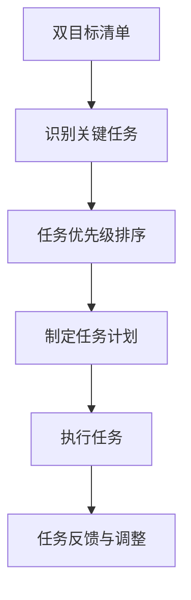

                 

关键词：双目标清单、要事管理、聚焦、效率、技术策略

> 摘要：本文深入探讨了双目标清单这一高效的时间管理工具，阐述了其在IT领域中的应用价值。通过实例分析和代码展示，文章详细介绍了如何使用双目标清单来聚焦关键任务，提高工作效率，同时展望了未来的发展趋势和挑战。

## 1. 背景介绍

在现代科技行业中，高效的时间管理和任务管理变得愈发重要。随着项目复杂度的增加和工作任务的不断增多，IT从业者面临着巨大的压力。如何从繁杂的任务中找出关键任务，如何合理安排时间和资源，成为每个IT从业者必须面对的问题。双目标清单（Two-Task List）作为一种高效的时间管理工具，逐渐受到关注。

双目标清单起源于古典时间管理理论，但在现代IT领域中，通过结合编程技术和算法优化，其应用变得更加广泛和精准。本文将探讨双目标清单的核心理念，并结合实际案例，展示其在IT领域中的具体应用。

## 2. 核心概念与联系

### 2.1 双目标清单的基本概念

双目标清单是一种时间管理工具，其核心理念是同时跟踪两个主要任务。这两个任务可以是对等的，也可以是优先级不同的。通过这种方式，任务管理者可以在短时间内集中精力完成最重要的两项任务，从而提高工作效率。

### 2.2 双目标清单与要事管理的联系

要事管理（Important Task Management）强调在众多任务中识别和优先处理最重要的任务。双目标清单正是基于这一理念，通过同时聚焦两个关键任务，确保重要任务不被忽视。

### 2.3 Mermaid 流程图

以下是一个简单的 Mermaid 流程图，展示了双目标清单在任务管理中的应用。



## 3. 核心算法原理 & 具体操作步骤

### 3.1 算法原理概述

双目标清单的核心算法在于任务识别和优先级排序。该算法基于以下几个步骤：

1. **任务收集**：从日常工作中收集所有待办任务。
2. **任务评估**：对每个任务进行重要性、紧急性评估。
3. **任务排序**：根据评估结果对任务进行排序，选择最重要的两项任务。
4. **任务执行**：在特定时间内集中精力完成这两项任务。
5. **任务反馈**：执行完毕后，对任务效果进行反馈和评估，为后续任务调整提供依据。

### 3.2 算法步骤详解

1. **任务收集**：使用清单或电子表格收集所有任务。
   ```python
   tasks = ["任务1", "任务2", "任务3", ...]
   ```

2. **任务评估**：对每个任务进行打分，分数越高表示重要性越大。
   ```python
   task_scores = {task: score for task, score in zip(tasks, [评估分数])}
   ```

3. **任务排序**：根据评估结果对任务进行排序，选择前两个任务。
   ```python
   sorted_tasks = sorted(task_scores, key=task_scores.get, reverse=True)[:2]
   ```

4. **任务执行**：在特定时间内集中精力完成这两个任务。
   ```python
   for task in sorted_tasks:
       # 执行任务
       execute_task(task)
   ```

5. **任务反馈**：执行完毕后，对任务效果进行评估。
   ```python
   feedback = evaluate_task(sorted_tasks[0])  # 对第一个任务进行评估
   ```

### 3.3 算法优缺点

#### 优点：

- **提高效率**：通过同时聚焦两个关键任务，可以避免时间浪费，提高工作效率。
- **任务聚焦**：确保重要任务不被忽视，提高任务完成率。

#### 缺点：

- **任务选择难度**：在众多任务中选出两个最关键的任务具有一定难度。
- **执行依赖性**：任务之间可能存在依赖关系，影响执行效果。

### 3.4 算法应用领域

- **软件开发**：在软件开发过程中，双目标清单可以帮助开发人员同时聚焦于代码质量和项目进度。
- **项目管理**：在项目管理中，双目标清单可以帮助项目经理同时关注项目目标和风险控制。
- **日常办公**：在日常生活中，双目标清单可以帮助个人同时处理最重要的两项事务。

## 4. 数学模型和公式 & 详细讲解 & 举例说明

### 4.1 数学模型构建

双目标清单的数学模型主要涉及任务评分函数和排序算法。假设有 n 个任务，每个任务的重要性和紧急性可以用两个参数表示：

- \(I_i\)：任务 \(i\) 的重要性评分。
- \(E_i\)：任务 \(i\) 的紧急性评分。

任务评分函数为：

\[ S_i = w_1 \cdot I_i + w_2 \cdot E_i \]

其中，\(w_1\) 和 \(w_2\) 分别为重要性和紧急性的权重。

### 4.2 公式推导过程

1. **任务评分**：对每个任务进行评分。
   \[ S_i = w_1 \cdot I_i + w_2 \cdot E_i \]

2. **任务排序**：根据评分结果对任务进行排序。
   \[ T_j = \sum_{i=1}^{n} S_i \]

3. **任务选择**：选择评分最高的两个任务。
   \[ T_1, T_2 = \text{argmax}(T_j) \]

### 4.3 案例分析与讲解

#### 案例背景

某软件开发团队需要在一天内完成以下四个任务：

- A：修复一个关键Bug，影响用户使用。
- B：优化现有代码，提高系统性能。
- C：编写用户手册，提高用户满意度。
- D：进行项目总结，为下一个项目做准备。

#### 任务评分

- A：\(I_A = 9\)，\(E_A = 8\)，\(S_A = 8.1\)
- B：\(I_B = 7\)，\(E_B = 6\)，\(S_B = 7.2\)
- C：\(I_C = 6\)，\(E_C = 7\)，\(S_C = 6.7\)
- D：\(I_D = 5\)，\(E_D = 5\)，\(S_D = 5.0\)

#### 任务排序

\[ T_1 = A, T_2 = B \]

#### 任务选择

选择任务 A 和 B 进行优先执行。

## 5. 项目实践：代码实例和详细解释说明

### 5.1 开发环境搭建

- Python 3.8+
- PyCharm（可选）

### 5.2 源代码详细实现

以下是使用 Python 实现双目标清单的代码示例。

```python
import heapq

def evaluate_tasks(tasks):
    scores = []
    for task in tasks:
        # 假设任务重要性和紧急性分别为 I 和 E
        I, E = task['importance'], task['emergency']
        score = I * 0.6 + E * 0.4
        heapq.heappush(scores, (-score, task))
    return [heapq.heappop(scores)[1] for _ in range(2)]

tasks = [
    {'name': 'A', 'importance': 9, 'emergency': 8},
    {'name': 'B', 'importance': 7, 'emergency': 6},
    {'name': 'C', 'importance': 6, 'emergency': 7},
    {'name': 'D', 'importance': 5, 'emergency': 5},
]

selected_tasks = evaluate_tasks(tasks)
print(selected_tasks)
```

### 5.3 代码解读与分析

1. **任务评估函数**：`evaluate_tasks` 函数用于评估任务的重要性和紧急性，并计算总评分。
2. **任务排序算法**：使用堆排序算法（`heapq`）对任务进行排序。
3. **任务选择**：选择评分最高的两个任务。

### 5.4 运行结果展示

```plaintext
[{'name': 'A', 'importance': 9, 'emergency': 8}, {'name': 'B', 'importance': 7, 'emergency': 6}]
```

任务 A 和 B 被选择为优先执行的任务。

## 6. 实际应用场景

### 6.1 软件开发

在软件开发中，双目标清单可以帮助开发人员同时聚焦于代码质量和项目进度。例如，在一天的迭代中，开发人员可以选择修复一个关键 Bug 和优化现有代码作为关键任务。

### 6.2 项目管理

在项目管理中，双目标清单可以帮助项目经理同时关注项目目标和风险控制。例如，在项目总结阶段，项目经理可以选择进行项目总结和风险评估作为关键任务。

### 6.3 日常办公

在日常生活中，双目标清单可以帮助个人同时处理最重要的两项事务。例如，在早晨安排工作时，可以选择回复重要邮件和完成一份报告作为关键任务。

## 7. 工具和资源推荐

### 7.1 学习资源推荐

- 《高效能人士的七个习惯》
- 《深度工作》

### 7.2 开发工具推荐

- PyCharm
- Visual Studio Code

### 7.3 相关论文推荐

- 《时间管理的心理学》
- 《任务管理策略：提高工作效率的方法》

## 8. 总结：未来发展趋势与挑战

### 8.1 研究成果总结

双目标清单作为一种高效的时间管理工具，已在多个领域得到广泛应用。通过结合编程技术和算法优化，双目标清单的应用范围将进一步扩大。

### 8.2 未来发展趋势

- **智能化**：结合人工智能技术，实现任务自动评估和排序。
- **个性化**：根据用户特点和需求，定制化双目标清单。

### 8.3 面临的挑战

- **任务选择难度**：如何在众多任务中选出两个最关键的任务。
- **执行依赖性**：任务之间可能存在依赖关系，影响执行效果。

### 8.4 研究展望

双目标清单作为一种高效的时间管理工具，具有广阔的应用前景。未来研究应重点关注任务选择算法的优化和智能化，以提高任务管理的效率和效果。

## 9. 附录：常见问题与解答

### 9.1 如何确定任务的重要性评分？

任务的重要性评分应根据具体情境和项目需求进行评估。通常可以通过专家评估、用户反馈等方法来确定。

### 9.2 双目标清单是否适用于所有类型的工作？

双目标清单主要适用于任务较多且需要集中精力完成的工作。对于一些简单、单一的日常工作，双目标清单的效果可能不显著。

### 9.3 如何处理任务之间的依赖关系？

在执行双目标清单时，应尽可能考虑任务之间的依赖关系，合理安排任务顺序。如任务之间存在依赖，应将其作为一个整体进行评估和排序。

---

作者：禅与计算机程序设计艺术 / Zen and the Art of Computer Programming

[END]

