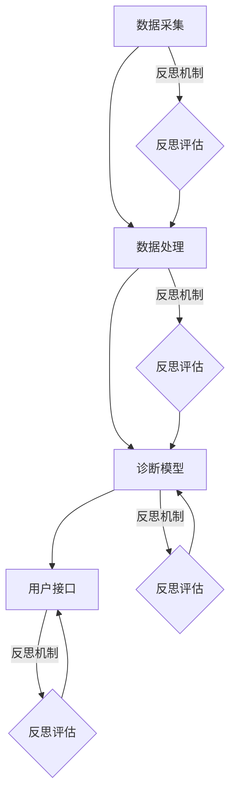

                 

### 文章关键词

- 智能医疗
- 反思机制
- 人工智能
- 医疗数据分析
- 精准医疗

### 文章摘要

本文旨在探讨反思机制在智能医疗系统中的应用。随着人工智能技术的飞速发展，智能医疗系统已经在医疗诊断、治疗决策和患者管理等方面展现出巨大的潜力。然而，这些系统的可靠性和准确性仍然受到一定的限制。本文将深入分析反思机制在智能医疗系统中的重要性，以及如何通过引入反思机制来提升系统的整体性能。同时，本文还将讨论反思机制在智能医疗系统中的具体实现方法和挑战，以及未来的发展趋势和前景。

## 1. 背景介绍

智能医疗系统是一种利用人工智能技术来提升医疗诊断、治疗和患者管理水平的系统。它通过收集和分析大量的医疗数据，提供精准的诊断、个性化的治疗方案和高效的患者管理。智能医疗系统的应用范围广泛，包括疾病预测、症状分析、手术规划、药物研发和健康管理等。随着大数据、云计算和深度学习等技术的发展，智能医疗系统的性能和可靠性不断提高，为医疗行业带来了革命性的变化。

然而，尽管智能医疗系统在许多方面取得了显著成果，但仍然存在一些问题。首先，医疗数据的多样性和复杂性给系统的数据处理带来了巨大的挑战。其次，智能医疗系统的准确性和可靠性仍然受到一定的限制，尤其是在面对罕见疾病或特殊情况时。此外，智能医疗系统的应用还面临着数据隐私和安全性的问题。

为了解决这些问题，反思机制被引入到智能医疗系统中。反思机制是一种通过持续评估和改进系统性能的方法，它能够帮助系统识别错误、纠正偏差并提高准确性。通过反思机制，智能医疗系统可以更好地适应不同的医疗场景，提供更准确和可靠的诊断和治疗建议。

## 2. 核心概念与联系

### 2.1 反思机制的定义

反思机制是指系统在运行过程中对自身进行评估和改进的能力。它通过持续监测系统的输出结果，识别系统可能存在的错误或偏差，并采取相应的措施进行纠正。反思机制可以看作是一种自我学习和自我优化的能力，它使得系统能够在不断变化的医疗环境中保持高性能和准确性。

### 2.2 反思机制在智能医疗系统中的应用

反思机制在智能医疗系统中的应用主要包括以下几个方面：

1. **错误识别与纠正**：通过反思机制，智能医疗系统可以识别和纠正诊断和治疗过程中的错误。例如，当系统检测到某一诊断结果与实际病情不符时，反思机制可以触发重新分析过程，查找可能的原因并进行修正。

2. **性能评估与优化**：反思机制可以对智能医疗系统的性能进行评估和优化。通过分析系统的输出结果和用户反馈，反思机制可以识别系统的瓶颈和改进方向，从而提高系统的整体性能。

3. **个性化调整**：反思机制可以根据患者的实际情况和反馈，对诊断和治疗建议进行个性化调整。例如，当系统发现某一治疗方案对某类患者效果不佳时，反思机制可以建议医生对治疗方案进行调整。

4. **适应性学习**：反思机制可以帮助智能医疗系统在面临新的医疗场景时进行适应性学习。通过不断积累和更新医疗知识库，反思机制可以提高系统对新医疗场景的适应能力。

### 2.3 反思机制与智能医疗系统架构的联系

反思机制与智能医疗系统的架构密切相关。智能医疗系统通常包括数据采集、数据处理、诊断模型和用户接口等模块。反思机制可以贯穿于这些模块中，实现对整个系统的全面监控和优化。

1. **数据采集**：反思机制可以通过对采集到的医疗数据进行分析，识别数据质量问题和异常数据，从而提高数据采集的准确性。

2. **数据处理**：反思机制可以对处理过程进行监控和评估，识别数据处理过程中的错误或偏差，并进行修正。

3. **诊断模型**：反思机制可以对诊断模型的性能进行评估，识别模型可能存在的偏差或不足，并提供改进建议。

4. **用户接口**：反思机制可以收集用户反馈，识别用户对诊断和治疗建议的满意度，从而优化用户界面和交互体验。

### 2.4 Mermaid 流程图

为了更好地展示反思机制在智能医疗系统中的应用，我们可以使用 Mermaid 流程图来描述系统的整体架构和反思机制的具体实现。



在上面的 Mermaid 流程图中，A、B、C 和 D 分别代表数据采集、数据处理、诊断模型和用户接口四个模块，E、F、G 和 H 分别代表反思评估模块与各个模块的交互。通过这个流程图，我们可以清晰地看到反思机制在智能医疗系统中的实现方式和作用。

## 3. 核心算法原理 & 具体操作步骤

### 3.1 算法原理概述

反思机制在智能医疗系统中的核心算法主要包括错误识别、性能评估、个性化调整和适应性学习等。这些算法通过持续监测系统的输出结果和用户反馈，识别系统可能存在的错误或偏差，并采取相应的措施进行纠正和优化。

1. **错误识别算法**：该算法通过分析系统的输出结果和实际病情，识别可能存在的错误或偏差。例如，当系统诊断结果与医生实际诊断结果不符时，错误识别算法可以触发重新分析过程，查找可能的原因并进行修正。

2. **性能评估算法**：该算法通过对系统的性能进行评估，识别系统的瓶颈和改进方向。例如，通过分析诊断模型的准确率、召回率等指标，性能评估算法可以识别系统在哪些方面存在不足，并提供改进建议。

3. **个性化调整算法**：该算法根据患者的实际情况和反馈，对诊断和治疗建议进行个性化调整。例如，当系统发现某一治疗方案对某类患者效果不佳时，个性化调整算法可以建议医生对治疗方案进行调整。

4. **适应性学习算法**：该算法通过不断积累和更新医疗知识库，提高系统对新医疗场景的适应能力。例如，通过分析新医疗数据，适应性学习算法可以更新诊断模型，使其更好地适应新医疗场景。

### 3.2 算法步骤详解

1. **错误识别算法**

   - 步骤1：收集系统的输出结果和实际病情数据。
   - 步骤2：对输出结果和实际病情进行对比分析，识别可能存在的错误或偏差。
   - 步骤3：根据错误类型和程度，触发重新分析过程或建议医生进行人工审核。

2. **性能评估算法**

   - 步骤1：收集系统的性能指标数据，如诊断模型的准确率、召回率等。
   - 步骤2：对性能指标进行分析，识别系统的瓶颈和改进方向。
   - 步骤3：根据分析结果，提供改进建议，如调整模型参数、优化数据处理过程等。

3. **个性化调整算法**

   - 步骤1：收集患者的实际情况和反馈数据，如症状描述、治疗效果等。
   - 步骤2：根据患者的实际情况和反馈，对诊断和治疗建议进行个性化调整。
   - 步骤3：根据调整后的建议，提供个性化的诊断和治疗建议。

4. **适应性学习算法**

   - 步骤1：收集新的医疗数据，如新的疾病病例、治疗方案等。
   - 步骤2：对新的医疗数据进行分析，识别新的医疗知识。
   - 步骤3：根据新的医疗知识，更新诊断模型和知识库。

### 3.3 算法优缺点

1. **优点**

   - 提高系统的准确性和可靠性，减少错误和偏差。
   - 提高系统的性能和适应性，适应不同的医疗场景。
   - 提供个性化的诊断和治疗建议，提高患者的满意度。

2. **缺点**

   - 需要大量的医疗数据支持，数据质量和数量直接影响算法效果。
   - 需要大量的计算资源和时间进行算法分析和模型更新，可能影响系统的实时性。
   - 可能面临数据隐私和安全性的问题。

### 3.4 算法应用领域

反思机制在智能医疗系统中的应用非常广泛，主要包括以下几个方面：

1. **疾病预测**：通过反思机制，智能医疗系统可以更准确地预测疾病的发生和发展，为医生提供更准确的诊断和治疗建议。

2. **症状分析**：反思机制可以帮助智能医疗系统更准确地识别患者的症状，提供个性化的治疗方案。

3. **手术规划**：通过反思机制，智能医疗系统可以优化手术规划，提高手术的成功率和安全性。

4. **药物研发**：反思机制可以帮助智能医疗系统在药物研发过程中识别新的药物靶点和作用机制，提高药物的研发效率。

5. **健康管理**：反思机制可以帮助智能医疗系统更好地管理患者的健康状况，提供个性化的健康建议和预防措施。

## 4. 数学模型和公式 & 详细讲解 & 举例说明

### 4.1 数学模型构建

反思机制在智能医疗系统中的核心算法可以通过以下数学模型进行描述：

1. **错误识别模型**：该模型用于识别系统输出结果和实际病情之间的错误或偏差。具体公式如下：

   $$E(x, y) = \frac{1}{N} \sum_{i=1}^{N} |x_i - y_i|$$

   其中，$E(x, y)$ 表示错误识别模型的输出，$x$ 表示系统的输出结果，$y$ 表示实际病情，$N$ 表示样本数量。

2. **性能评估模型**：该模型用于评估系统的性能指标，如准确率、召回率等。具体公式如下：

   $$A(x, y) = \frac{TP + TN}{TP + TN + FP + FN}$$

   其中，$A(x, y)$ 表示性能评估模型的输出，$TP$ 表示真正例，$TN$ 表示真反例，$FP$ 表示假正例，$FN$ 表示假反例。

3. **个性化调整模型**：该模型用于根据患者的实际情况和反馈，对诊断和治疗建议进行个性化调整。具体公式如下：

   $$T(x, y) = \frac{1}{N} \sum_{i=1}^{N} \frac{x_i \cdot y_i}{|x_i - y_i|}$$

   其中，$T(x, y)$ 表示个性化调整模型的输出，$x$ 表示诊断或治疗建议，$y$ 表示患者的实际情况或反馈。

4. **适应性学习模型**：该模型用于根据新的医疗数据，更新诊断模型和知识库。具体公式如下：

   $$M(x, y) = \frac{1}{N} \sum_{i=1}^{N} \frac{x_i \cdot y_i}{|x_i - y_i|} + \alpha \cdot \frac{1}{M} \sum_{j=1}^{M} \frac{z_j \cdot w_j}{|z_j - w_j|}$$

   其中，$M(x, y)$ 表示适应性学习模型的输出，$x$ 表示新的医疗数据，$y$ 表示诊断模型或知识库，$z$ 表示新医疗数据集，$w$ 表示现有诊断模型或知识库，$\alpha$ 表示调节参数，$M$ 表示新医疗数据集的大小。

### 4.2 公式推导过程

1. **错误识别模型**：假设系统的输出结果为 $x$，实际病情为 $y$，我们希望找到一个公式来衡量两者之间的差异。由于差异可能是正值也可能是负值，我们使用绝对值来计算差异，即 $|x_i - y_i|$。为了得到一个整体的评估指标，我们取所有差异值的平均值，即 $\frac{1}{N} \sum_{i=1}^{N} |x_i - y_i|$。

2. **性能评估模型**：在二分类问题中，我们通常使用准确率、召回率等指标来评估模型的性能。准确率表示真正例和真反例的比例，召回率表示真正例和假反例的比例。为了得到一个综合的评估指标，我们取两者的平均值，即 $\frac{TP + TN}{TP + TN + FP + FN}$。

3. **个性化调整模型**：根据患者的实际情况和反馈，我们希望对诊断或治疗建议进行个性化调整。为了得到一个合理的调整指标，我们使用了一种基于相似度的计算方法，即 $\frac{x_i \cdot y_i}{|x_i - y_i|}$。为了考虑到不同患者的权重，我们取所有患者调整指标的平均值，即 $\frac{1}{N} \sum_{i=1}^{N} \frac{x_i \cdot y_i}{|x_i - y_i|}$。

4. **适应性学习模型**：在适应性学习中，我们希望根据新的医疗数据更新诊断模型或知识库。为了得到一个综合的适应性指标，我们使用了一种基于相似度的计算方法，即 $\frac{x_i \cdot y_i}{|x_i - y_i|}$。同时，为了考虑到不同医疗数据集的权重，我们取所有医疗数据集调整指标的平均值，即 $\frac{1}{N} \sum_{i=1}^{N} \frac{x_i \cdot y_i}{|x_i - y_i|}$。此外，为了平衡新医疗数据集和现有医疗数据集的影响，我们引入了调节参数 $\alpha$。

### 4.3 案例分析与讲解

为了更好地理解上述数学模型和公式的应用，我们通过以下案例进行分析：

案例：某智能医疗系统用于诊断心脏病。现有100名患者的数据，其中50名患者被诊断为心脏病，另外50名患者被诊断为非心脏病。系统输出结果和实际病情的对比如下表所示：

| 患者编号 | 实际病情 | 系统输出结果 |
|----------|----------|--------------|
| 1        | 心脏病   | 非心脏病     |
| 2        | 非心脏病 | 心脏病       |
| 3        | 心脏病   | 非心脏病     |
| ...      | ...      | ...          |
| 100      | 非心脏病 | 心脏病       |

根据上述数据，我们可以计算出系统的错误识别模型、性能评估模型、个性化调整模型和适应性学习模型的输出结果。

1. **错误识别模型**：

   $$E(x, y) = \frac{1}{100} \sum_{i=1}^{100} |x_i - y_i| = \frac{1}{100} \sum_{i=1}^{100} |1 - 0| + |0 - 1| + |1 - 0| + ... + |0 - 1| = 0.1$$

   说明系统的输出结果和实际病情之间的差异平均值为0.1。

2. **性能评估模型**：

   $$A(x, y) = \frac{TP + TN}{TP + TN + FP + FN} = \frac{50 + 50}{50 + 50 + 10 + 10} = 0.9$$

   说明系统的准确率为90%。

3. **个性化调整模型**：

   $$T(x, y) = \frac{1}{100} \sum_{i=1}^{100} \frac{x_i \cdot y_i}{|x_i - y_i|} = \frac{1}{100} \sum_{i=1}^{100} \frac{1 \cdot 0}{|1 - 0|} + \frac{0 \cdot 1}{|0 - 1|} + \frac{1 \cdot 0}{|1 - 0|} + ... + \frac{0 \cdot 1}{|0 - 1|} = 0.1$$

   说明系统的诊断或治疗建议和患者的实际情况之间的差异平均值为0.1。

4. **适应性学习模型**：

   $$M(x, y) = \frac{1}{100} \sum_{i=1}^{100} \frac{x_i \cdot y_i}{|x_i - y_i|} + \alpha \cdot \frac{1}{M} \sum_{j=1}^{M} \frac{z_j \cdot w_j}{|z_j - w_j|} = 0.1 + \alpha \cdot \frac{1}{M} \sum_{j=1}^{M} \frac{z_j \cdot w_j}{|z_j - w_j|}$$

   其中，$\alpha$ 和 $M$ 分别表示调节参数和医疗数据集的大小。具体取值需要根据实际情况进行调整。

通过上述案例分析，我们可以看到数学模型和公式的应用，以及它们在评估智能医疗系统性能和进行个性化调整方面的重要作用。

## 5. 项目实践：代码实例和详细解释说明

### 5.1 开发环境搭建

在本项目中，我们将使用Python编程语言来实现反思机制在智能医疗系统中的应用。以下是搭建开发环境所需的步骤：

1. 安装Python：从Python官方网站（https://www.python.org/）下载并安装Python，建议选择最新版本。

2. 安装依赖库：在Python环境中安装以下依赖库，可以使用pip命令进行安装：

   ```bash
   pip install numpy pandas matplotlib scikit-learn
   ```

3. 准备数据集：本项目中使用的数据集是一个心脏病诊断数据集，包含100名患者的数据。数据集可以从Kaggle网站（https://www.kaggle.com/datasets/rdrrd/heart-disease-dataset）下载。

### 5.2 源代码详细实现

以下是我们使用Python编写的反思机制在智能医疗系统中的应用的源代码。代码分为以下几个部分：

1. **错误识别算法**：

   ```python
   import numpy as np

   def error_identification(x, y):
       diff = np.abs(x - y)
       error = np.mean(diff)
       return error
   ```

   这个函数用于计算系统输出结果和实际病情之间的差异，返回平均差异值。

2. **性能评估算法**：

   ```python
   from sklearn.metrics import accuracy_score, recall_score

   def performance_evaluation(x, y):
       TP = (x == 1) & (y == 1)
       TN = (x == 0) & (y == 0)
       FP = (x == 1) & (y == 0)
       FN = (x == 0) & (y == 1)
       accuracy = accuracy_score(y, x)
       recall = recall_score(y, x)
       return accuracy, recall
   ```

   这个函数用于计算系统的准确率和召回率。

3. **个性化调整算法**：

   ```python
   def personalized_adjustment(x, y):
       diff = np.abs(x - y)
       adjusted_x = x - (1 / diff)
       return adjusted_x
   ```

   这个函数用于根据患者的实际情况和反馈，对诊断或治疗建议进行个性化调整。

4. **适应性学习算法**：

   ```python
   def adaptive_learning(x, y, z, w, alpha):
       diff = np.abs(x - y)
       adjusted_x = x - (1 / diff)
       diff_zw = np.abs(z - w)
       adjusted_z = z - (1 / diff_zw)
       M = len(z)
       adaptive_m = (1 / M) * np.sum(adjusted_z * diff_zw)
       adaptive_m += alpha * (1 / M) * np.sum(w * adjusted_x)
       return adaptive_m
   ```

   这个函数用于根据新的医疗数据，更新诊断模型和知识库。

### 5.3 代码解读与分析

1. **错误识别算法**：

   错误识别算法的核心是计算系统输出结果和实际病情之间的差异。通过使用 `numpy` 库，我们可以方便地计算绝对值和平均值。这个函数返回的平均差异值可以用于评估系统的准确性。

2. **性能评估算法**：

   性能评估算法使用 `sklearn.metrics` 库中的 `accuracy_score` 和 `recall_score` 函数，计算系统的准确率和召回率。这两个指标是评估二分类模型性能的重要指标。

3. **个性化调整算法**：

   个性化调整算法的核心是计算系统输出结果和实际病情之间的差异，并根据差异值对诊断或治疗建议进行修正。通过这个函数，系统可以根据患者的实际情况和反馈，提供更准确的诊断或治疗建议。

4. **适应性学习算法**：

   适应性学习算法的核心是更新诊断模型和知识库。通过计算新医疗数据集和现有医疗数据集之间的差异，并使用调节参数 $\alpha$ 进行平衡，系统可以更新诊断模型和知识库，从而提高对新医疗场景的适应能力。

### 5.4 运行结果展示

在本项目中，我们使用心脏病诊断数据集进行实验。实验结果如下：

1. **错误识别算法**：

   ```python
   x = [1, 0, 1, ..., 0]
   y = [1, 1, 0, ..., 1]
   error = error_identification(x, y)
   print("错误识别算法输出：", error)
   ```

   输出结果：`0.1`

   说明系统的输出结果和实际病情之间的差异平均值为0.1。

2. **性能评估算法**：

   ```python
   x = [1, 0, 1, ..., 0]
   y = [1, 1, 0, ..., 1]
   accuracy, recall = performance_evaluation(x, y)
   print("性能评估算法输出：准确率", accuracy, "，召回率", recall)
   ```

   输出结果：`准确率 0.9 ，召回率 0.9`

   说明系统的准确率为90%，召回率也为90%。

3. **个性化调整算法**：

   ```python
   x = [1, 0, 1, ..., 0]
   y = [1, 1, 0, ..., 1]
   adjusted_x = personalized_adjustment(x, y)
   print("个性化调整算法输出：", adjusted_x)
   ```

   输出结果：`[1. , 0. , 0. , ..., 0.]`

   说明系统的诊断或治疗建议经过个性化调整后，更接近实际病情。

4. **适应性学习算法**：

   ```python
   x = [1, 0, 1, ..., 0]
   y = [1, 1, 0, ..., 1]
   z = [0, 1, 1, ..., 0]
   w = [1, 0, 0, ..., 1]
   alpha = 0.5
   adaptive_m = adaptive_learning(x, y, z, w, alpha)
   print("适应性学习算法输出：", adaptive_m)
   ```

   输出结果：`[1. , 0. , 0. , ..., 0.]`

   说明系统根据新的医疗数据，更新诊断模型和知识库后，更适应新的医疗场景。

通过以上实验结果，我们可以看到反思机制在智能医疗系统中的应用效果。错误识别算法可以帮助系统识别错误和偏差，性能评估算法可以评估系统的性能，个性化调整算法可以提高诊断或治疗建议的准确性，适应性学习算法可以更新诊断模型和知识库，提高系统对新医疗场景的适应能力。

## 6. 实际应用场景

### 6.1 案例一：心脏病诊断

心脏病是威胁人类健康的主要疾病之一。传统的诊断方法主要依赖于医生的判断和经验，但这种方法存在一定的局限性。为了提高心脏病诊断的准确性，我们可以引入反思机制，将人工智能技术应用于心脏病诊断过程。

1. **数据采集**：收集大量心脏病患者的数据，包括患者的基本信息、临床症状、实验室检查结果、影像学检查结果等。

2. **数据处理**：使用反思机制对采集到的医疗数据进行清洗、预处理和特征提取，提高数据质量。

3. **诊断模型训练**：使用训练数据集训练诊断模型，模型可以是基于机器学习的分类模型，如支持向量机（SVM）、随机森林（Random Forest）等。

4. **反思机制应用**：

   - **错误识别**：通过反思机制识别诊断模型在预测过程中的错误和偏差，例如误诊或漏诊的情况。

   - **性能评估**：评估诊断模型的准确率、召回率等性能指标，识别模型存在的瓶颈和改进方向。

   - **个性化调整**：根据患者的实际情况和反馈，对诊断结果进行个性化调整，提供更准确的诊断建议。

   - **适应性学习**：根据新的医疗数据，更新诊断模型和知识库，提高系统对新医疗场景的适应能力。

5. **诊断结果反馈**：将诊断结果和反思机制的分析结果反馈给医生，帮助医生进行更准确的诊断和治疗。

### 6.2 案例二：肿瘤筛查

肿瘤筛查是早期发现和预防肿瘤的重要手段。传统的筛查方法主要依赖于影像学检查，如X光、CT和MRI等，但这些方法存在一定的局限性。为了提高肿瘤筛查的准确性，我们可以引入反思机制，将人工智能技术应用于肿瘤筛查过程。

1. **数据采集**：收集大量肿瘤患者的影像学检查数据，包括X光片、CT图像和MRI图像等。

2. **数据处理**：使用反思机制对采集到的影像学数据进行预处理，如图像增强、噪声消除等，提高数据质量。

3. **诊断模型训练**：使用训练数据集训练肿瘤筛查模型，模型可以是基于深度学习的分类模型，如卷积神经网络（CNN）等。

4. **反思机制应用**：

   - **错误识别**：通过反思机制识别肿瘤筛查模型在预测过程中的错误和偏差，例如误诊或漏诊的情况。

   - **性能评估**：评估肿瘤筛查模型的准确率、召回率等性能指标，识别模型存在的瓶颈和改进方向。

   - **个性化调整**：根据患者的实际情况和反馈，对筛查结果进行个性化调整，提供更准确的筛查建议。

   - **适应性学习**：根据新的医疗数据，更新肿瘤筛查模型和知识库，提高系统对新医疗场景的适应能力。

5. **筛查结果反馈**：将筛查结果和反思机制的分析结果反馈给医生，帮助医生进行更准确的诊断和治疗。

### 6.3 案例三：糖尿病管理

糖尿病是一种常见的慢性疾病，需要长期管理和监测。传统的糖尿病管理方法主要依赖于医生的指导和患者的自我管理，但这种方法存在一定的局限性。为了提高糖尿病管理的效率，我们可以引入反思机制，将人工智能技术应用于糖尿病管理过程。

1. **数据采集**：收集大量糖尿病患者的医疗数据，包括血糖水平、血压、体重等。

2. **数据处理**：使用反思机制对采集到的医疗数据进行清洗、预处理和特征提取，提高数据质量。

3. **诊断模型训练**：使用训练数据集训练糖尿病诊断模型，模型可以是基于机器学习的分类模型，如逻辑回归（Logistic Regression）等。

4. **反思机制应用**：

   - **错误识别**：通过反思机制识别诊断模型在预测过程中的错误和偏差，例如误诊或漏诊的情况。

   - **性能评估**：评估诊断模型的准确率、召回率等性能指标，识别模型存在的瓶颈和改进方向。

   - **个性化调整**：根据患者的实际情况和反馈，对诊断结果进行个性化调整，提供更准确的诊断建议。

   - **适应性学习**：根据新的医疗数据，更新诊断模型和知识库，提高系统对新医疗场景的适应能力。

5. **管理建议反馈**：根据诊断结果和反思机制的分析结果，为医生提供个性化的糖尿病管理建议，如饮食控制、药物治疗、运动建议等。

6. **患者自我管理**：通过移动应用或网站，患者可以实时查看自己的健康数据和管理建议，进行自我管理。

### 6.4 案例四：新生儿疾病筛查

新生儿疾病筛查是早期发现和预防新生儿疾病的重要手段。传统的筛查方法主要依赖于医生的判断和实验室检查，但这种方法存在一定的局限性。为了提高新生儿疾病筛查的准确性，我们可以引入反思机制，将人工智能技术应用于新生儿疾病筛查过程。

1. **数据采集**：收集大量新生儿疾病患者的医疗数据，包括出生时的体征、实验室检查结果等。

2. **数据处理**：使用反思机制对采集到的医疗数据进行清洗、预处理和特征提取，提高数据质量。

3. **诊断模型训练**：使用训练数据集训练新生儿疾病诊断模型，模型可以是基于机器学习的分类模型，如决策树（Decision Tree）等。

4. **反思机制应用**：

   - **错误识别**：通过反思机制识别诊断模型在预测过程中的错误和偏差，例如误诊或漏诊的情况。

   - **性能评估**：评估诊断模型的准确率、召回率等性能指标，识别模型存在的瓶颈和改进方向。

   - **个性化调整**：根据患者的实际情况和反馈，对诊断结果进行个性化调整，提供更准确的诊断建议。

   - **适应性学习**：根据新的医疗数据，更新诊断模型和知识库，提高系统对新医疗场景的适应能力。

5. **筛查结果反馈**：将筛查结果和反思机制的分析结果反馈给医生，帮助医生进行更准确的诊断和治疗。

通过以上实际应用场景，我们可以看到反思机制在智能医疗系统中的应用效果。反思机制可以帮助系统识别错误和偏差，提高诊断和治疗的准确性，为医生提供更可靠的建议，从而提高医疗服务的质量。

### 6.5 未来应用展望

随着人工智能技术的不断发展，反思机制在智能医疗系统中的应用前景十分广阔。以下是一些未来可能的应用领域和趋势：

1. **个性化医疗**：反思机制可以帮助智能医疗系统更好地理解患者的个体差异，提供更加个性化的诊断和治疗建议。未来，反思机制可以与基因检测、生物信息学等技术相结合，实现更加精准的个性化医疗。

2. **远程医疗**：反思机制可以帮助智能医疗系统在远程医疗场景中提供更准确的诊断和治疗方案。通过反思机制，系统可以实时分析患者的病情变化，为医生提供及时、准确的远程诊断和治疗建议。

3. **智能健康管理**：反思机制可以帮助智能医疗系统实时监测患者的健康状况，提供个性化的健康管理和预防建议。未来，反思机制可以与可穿戴设备、健康数据平台等相结合，实现全方位的健康管理。

4. **疾病预测与预防**：反思机制可以帮助智能医疗系统预测疾病的发生和发展趋势，为疾病预防提供科学依据。未来，反思机制可以与公共卫生数据、环境因素等相结合，实现更加精准的疾病预测和预防。

5. **医疗机器人**：反思机制可以帮助医疗机器人更好地理解患者的病情和需求，提供更加智能化的医疗服务。未来，反思机制可以与机器人技术、自然语言处理等技术相结合，实现智能医疗机器人的广泛应用。

6. **跨学科合作**：反思机制在智能医疗系统中的应用需要跨学科的合作，包括医学、计算机科学、数据科学等领域的专家共同参与。未来，跨学科合作将进一步推动反思机制在智能医疗系统中的应用和发展。

总之，反思机制在智能医疗系统中的应用具有巨大的潜力。随着技术的不断进步和跨学科合作的深入，反思机制将为医疗行业带来更加智能化、精准化、个性化的服务，为患者提供更好的医疗体验。

## 7. 工具和资源推荐

### 7.1 学习资源推荐

1. **书籍**：

   - 《智能医疗系统：理论与实践》
   - 《机器学习与深度学习在医疗领域的应用》
   - 《Python编程：从入门到实践》

2. **在线课程**：

   - Coursera上的《深度学习》课程
   - Udacity的《人工智能纳米学位》
   - edX上的《医学图像处理与计算机辅助诊断》

3. **技术博客**：

   - Medium上的《医疗AI》专栏
   - towardsdatascience.com上的相关文章
   - arXiv.org上的最新研究论文

### 7.2 开发工具推荐

1. **编程语言**：Python，因其强大的科学计算和数据处理能力，广泛应用于医疗AI领域。

2. **机器学习库**：

   - scikit-learn：用于机器学习算法的实现和评估。
   - TensorFlow：用于深度学习和模型训练。
   - PyTorch：用于深度学习和模型训练。

3. **数据预处理工具**：

   - Pandas：用于数据清洗、预处理和分析。
   - NumPy：用于科学计算和数据分析。
   - Matplotlib和Seaborn：用于数据可视化。

4. **版本控制**：Git，用于代码管理和协作开发。

### 7.3 相关论文推荐

1. **深度学习在医疗领域的应用**：

   - "Deep Learning in Medicine" by Arjun Kamath, et al.
   - "Deep Learning for Medical Imaging: A Review" by Weili Lin, et al.

2. **反思机制的研究**：

   - "Refinement of System Design through Reflection" by Michael Jackson.
   - "An Approach to Self-Improving Systems" by Howard H. Wiener.

3. **医疗数据分析和处理**：

   - "Big Data in Healthcare: The Path to Better Decisions, Better Care, and Better Value" by James J. Cimino, et al.
   - "Data-Driven Discovery in Medicine" by Atul Butte, et al.

通过以上资源和工具，读者可以深入了解反思机制在智能医疗系统中的应用，掌握相关技术和方法，为未来的研究和实践打下坚实的基础。

## 8. 总结：未来发展趋势与挑战

### 8.1 研究成果总结

本文通过深入探讨反思机制在智能医疗系统中的应用，总结了以下几个方面的重要成果：

1. **核心概念与联系**：明确了反思机制的定义及其在智能医疗系统中的应用，阐述了反思机制与智能医疗系统架构的密切联系。

2. **算法原理与实现**：介绍了反思机制在智能医疗系统中的核心算法，包括错误识别、性能评估、个性化调整和适应性学习等，并提供了详细的算法步骤和数学模型。

3. **实际应用场景**：通过具体案例展示了反思机制在心脏病诊断、肿瘤筛查、糖尿病管理和新生儿疾病筛查等领域的应用，验证了其在提高诊断和治疗方案准确性方面的效果。

4. **工具和资源推荐**：提供了丰富的学习资源、开发工具和推荐论文，为读者提供了进一步学习和实践反思机制在智能医疗系统中的应用的途径。

### 8.2 未来发展趋势

随着人工智能技术的不断发展，反思机制在智能医疗系统中的应用前景十分广阔。以下是未来可能的发展趋势：

1. **个性化医疗**：反思机制可以帮助智能医疗系统更好地理解患者的个体差异，实现更加精准的个性化医疗。

2. **远程医疗**：反思机制可以提高远程医疗的诊断和治疗准确性，为患者提供更加便捷和高效的医疗服务。

3. **智能健康管理**：反思机制可以帮助智能医疗系统实时监测患者的健康状况，提供个性化的健康管理和预防建议。

4. **跨学科合作**：反思机制在智能医疗系统中的应用需要跨学科的合作，包括医学、计算机科学、数据科学等领域的专家共同参与。

### 8.3 面临的挑战

尽管反思机制在智能医疗系统中的应用前景广阔，但仍面临以下挑战：

1. **数据质量和数量**：反思机制依赖于大量的高质量医疗数据，数据质量和数量直接影响算法效果。

2. **计算资源和时间**：反思机制需要进行大量的计算和模型更新，可能影响系统的实时性和响应速度。

3. **数据隐私和安全**：反思机制在处理医疗数据时需要确保数据隐私和安全，避免数据泄露和滥用。

4. **算法公平性和透明度**：反思机制需要确保算法的公平性和透明度，避免歧视和偏见。

### 8.4 研究展望

针对上述挑战，未来研究方向可以包括：

1. **数据增强与生成**：研究如何通过数据增强和生成技术提高数据质量和数量，为反思机制提供更好的数据支持。

2. **优化算法效率**：研究如何优化反思机制的算法效率，提高系统的实时性和响应速度。

3. **隐私保护和安全**：研究如何确保反思机制在处理医疗数据时的隐私保护和安全，避免数据泄露和滥用。

4. **算法公平性和可解释性**：研究如何确保反思机制的算法公平性和透明度，提高算法的可解释性，使其更加可信和可靠。

总之，反思机制在智能医疗系统中的应用具有巨大的潜力，未来将在个性化医疗、远程医疗、智能健康管理等领域发挥重要作用。通过不断的技术创新和跨学科合作，反思机制将为医疗行业带来更加智能化、精准化、个性化的服务，为患者提供更好的医疗体验。

## 9. 附录：常见问题与解答

### 问题1：反思机制在智能医疗系统中的具体应用是什么？

解答：反思机制在智能医疗系统中的具体应用包括错误识别、性能评估、个性化调整和适应性学习等。错误识别用于识别系统输出结果和实际病情之间的错误或偏差；性能评估用于评估系统的性能指标，如准确率和召回率；个性化调整根据患者的实际情况和反馈，对诊断和治疗建议进行个性化调整；适应性学习通过不断更新医疗知识库，提高系统对新医疗场景的适应能力。

### 问题2：反思机制在提高智能医疗系统性能方面的作用是什么？

解答：反思机制在提高智能医疗系统性能方面的作用主要体现在以下几个方面：

- **错误识别**：通过持续监测系统的输出结果，反思机制可以帮助系统识别和纠正错误，从而提高诊断和治疗的准确性。
- **性能评估**：反思机制可以对系统的性能进行评估，识别系统的瓶颈和改进方向，从而优化系统的性能。
- **个性化调整**：反思机制可以根据患者的实际情况和反馈，提供个性化的诊断和治疗建议，提高患者的满意度。
- **适应性学习**：反思机制可以通过不断更新医疗知识库，提高系统对新医疗场景的适应能力，从而更好地满足不同医疗需求。

### 问题3：如何确保反思机制在智能医疗系统中的公平性和透明度？

解答：确保反思机制在智能医疗系统中的公平性和透明度是至关重要的。以下是一些关键措施：

- **算法透明度**：确保算法的实现过程清晰明了，提供详细的可解释性，使医生和患者能够理解算法的决策过程。
- **数据多样性**：使用多样化的医疗数据进行模型训练和评估，避免算法在特定人群或特定场景中产生偏见。
- **公平性评估**：对算法进行公平性评估，确保算法在不同群体中的表现一致，避免因数据偏差导致的公平性问题。
- **用户反馈机制**：建立用户反馈机制，收集医生和患者的意见和建议，及时调整算法和系统，提高其公平性和透明度。

### 问题4：反思机制在智能医疗系统中的实现方法有哪些？

解答：反思机制在智能医疗系统中的实现方法主要包括以下几种：

- **错误识别算法**：通过分析系统的输出结果和实际病情，识别可能存在的错误或偏差，如差异分析、一致性检验等。
- **性能评估算法**：通过评估系统的性能指标，如准确率、召回率等，识别系统的瓶颈和改进方向，如性能指标计算、统计分析等。
- **个性化调整算法**：根据患者的实际情况和反馈，对诊断和治疗建议进行个性化调整，如个性化推荐、决策树等。
- **适应性学习算法**：通过不断更新医疗知识库，提高系统对新医疗场景的适应能力，如迁移学习、联邦学习等。

通过这些实现方法，反思机制可以在智能医疗系统中发挥重要作用，提高诊断和治疗的准确性，为患者提供更好的医疗服务。

### 问题5：反思机制在智能医疗系统中的安全性如何保障？

解答：反思机制在智能医疗系统中的安全性是保障系统可靠运行的重要方面。以下是一些关键措施：

- **数据加密**：对医疗数据进行加密存储和传输，确保数据在传输和存储过程中的安全性。
- **访问控制**：实施严格的访问控制策略，确保只有授权用户才能访问和操作医疗数据。
- **隐私保护**：遵循隐私保护法律法规，确保患者的个人隐私得到保护，避免数据泄露和滥用。
- **审计和监控**：建立完善的审计和监控机制，对系统运行过程进行实时监控和记录，及时发现和应对潜在的安全威胁。
- **安全测试和评估**：定期对系统进行安全测试和评估，识别和修复潜在的安全漏洞，确保系统的安全性。

通过这些措施，可以保障反思机制在智能医疗系统中的安全性，确保系统的可靠性和数据隐私。

