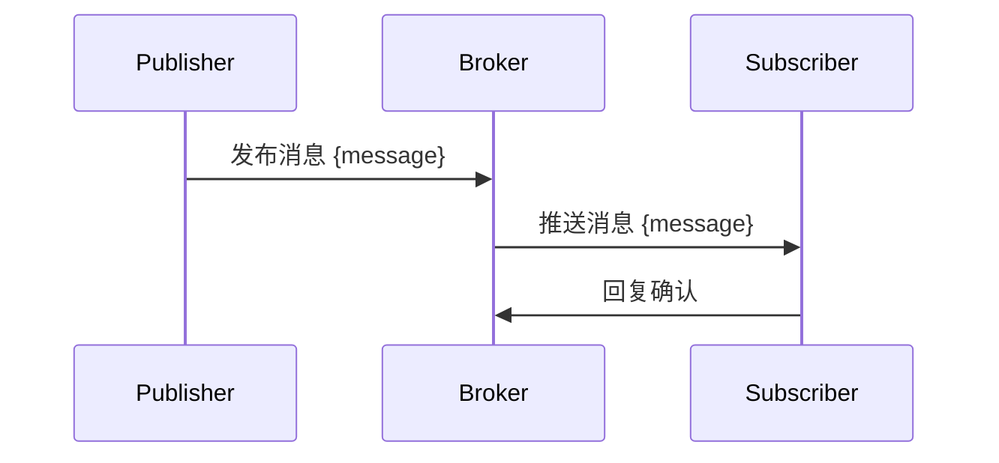

                 

 发布订阅（Publish-Subscribe）模式是计算机科学中一种消息传递范式，它允许系统中的多个部分通过发布和订阅消息来进行通信，而不需要知道彼此的具体身份。这种模式在分布式系统、实时通信和事件驱动架构中得到了广泛应用。本文将详细讲解发布订阅模式的原理，并通过代码实例进行说明。

## 关键词
- 发布订阅模式
- 消息传递
- 分布式系统
- 事件驱动
- 发布/订阅架构

## 摘要
本文首先介绍了发布订阅模式的基本概念和原理，随后通过一个具体的算法实现展示了该模式的工作机制。接着，我们将探讨发布订阅模式在实际项目中的应用，并推荐一些学习资源和开发工具。最后，对发布订阅模式的未来发展趋势和挑战进行了展望。

## 1. 背景介绍

在传统的请求-响应（Request-Response）模式中，发送者和接收者之间存在直接的连接。当发送者需要与接收者通信时，它会主动发起请求，接收者收到请求后进行响应。这种模式在简单和集中式系统中运行良好，但在复杂的分布式环境中，它存在一些局限性：

1. **耦合度太高**：发送者和接收者之间的绑定是硬编码的，如果系统需要扩展或重构，可能会导致大量的修改和维护。
2. **可扩展性差**：当系统中的组件数量增加时，直接连接的数量呈指数级增长，系统的复杂度和性能都会受到影响。
3. **难以实现异步通信**：请求-响应模式通常是同步的，这意味着发送者必须等待接收者的响应，这限制了系统的并发能力。

为了解决这些问题，发布订阅模式应运而生。它通过引入消息代理（Broker）或事件队列（Event Queue）来实现消息的异步传递，从而降低了系统的耦合度和复杂度。

## 2. 核心概念与联系

### 2.1. 发布者（Publisher）

发布者是消息的发送者。它将消息发布到消息代理或事件队列中，不需要知道订阅者的身份和数量。

### 2.2. 订阅者（Subscriber）

订阅者是消息的接收者。它订阅感兴趣的消息类型，并从消息代理或事件队列中接收消息。

### 2.3. 消息代理（Broker）

消息代理是发布者和订阅者之间的中介，它负责存储和转发消息。消息代理可以是简单的队列服务，也可以是复杂的消息中间件，如RabbitMQ、Apache Kafka等。

### 2.4. 消息队列（Message Queue）

消息队列是一种数据结构，用于存储发布者发布的消息，直到订阅者消费它们。

### 2.5. 主题（Topic）

主题是发布者和订阅者之间的一种抽象，用于标识消息的类型。多个订阅者可以订阅同一个主题，从而实现消息的广播。

### 2.6. 订阅（Subscription）

订阅是订阅者对特定主题的关注。每个订阅都可以指定一些过滤条件，以匹配感兴趣的消息。

### 2.7. 发布/订阅架构

发布/订阅架构是一个去中心化的消息传递架构，它允许系统中的组件通过发布和订阅消息来实现通信，而不需要知道彼此的具体身份。

### 2.8. Mermaid 流程图

下面是一个使用 Mermaid 语言的发布订阅模式的流程图：



## 3. 核心算法原理 & 具体操作步骤

### 3.1. 算法原理概述

发布订阅模式的核心在于消息的异步传递和广播。具体来说，算法包括以下几个步骤：

1. **发布消息**：发布者将消息发布到消息代理或事件队列中。
2. **存储消息**：消息代理或事件队列将消息存储在消息队列中。
3. **推送消息**：消息代理或事件队列根据订阅信息，将消息推送给订阅者。
4. **消费消息**：订阅者从消息代理或事件队列中消费消息。

### 3.2. 算法步骤详解

1. **创建发布者**：
    ```python
    publisher = Publisher()
    ```

2. **发布消息**：
    ```python
    publisher.publish('message', 'hello world')
    ```

3. **创建订阅者**：
    ```python
    subscriber = Subscriber()
    ```

4. **订阅主题**：
    ```python
    subscriber.subscribe('message', callback)
    ```

5. **推送消息**：
    ```python
    broker.push_message('message', 'hello world')
    ```

6. **消费消息**：
    ```python
    def callback(message):
        print('Received message:', message)
    ```

### 3.3. 算法优缺点

**优点**：

1. **低耦合度**：发布者和订阅者不需要知道彼此的存在，降低了系统的耦合度。
2. **高可扩展性**：系统可以轻松地增加新的发布者和订阅者，而不影响现有组件。
3. **异步通信**：发布者和订阅者之间不需要同步操作，提高了系统的并发能力。

**缺点**：

1. **复杂度高**：消息代理或事件队列的引入增加了系统的复杂度，需要额外的维护成本。
2. **延迟问题**：消息的异步传递可能会导致一定的延迟，不适合实时性要求高的应用。

### 3.4. 算法应用领域

发布订阅模式在以下领域得到了广泛应用：

1. **实时通信**：如即时聊天、直播、在线游戏等。
2. **分布式系统**：如微服务架构、云原生应用等。
3. **事件驱动架构**：如物联网、传感器网络等。

## 4. 数学模型和公式 & 详细讲解 & 举例说明

### 4.1. 数学模型构建

在发布订阅模式中，我们可以使用概率模型来描述消息的传播过程。具体来说，我们可以定义以下几个参数：

1. **消息生成率**（λ）：单位时间内发布的消息数量。
2. **消息传递速率**（μ）：单位时间内传递的消息数量。
3. **消息生命周期**（τ）：消息在系统中存活的时间。

根据这些参数，我们可以构建如下的概率模型：

\[ P(t) = \frac{\lambda}{\lambda + \mu} e^{-\lambda t} \]

其中，\( P(t) \) 表示在时间 \( t \) 内，系统中存在消息的概率。

### 4.2. 公式推导过程

为了推导上述概率模型，我们可以使用马尔可夫链模型。具体来说，我们可以定义以下几个状态：

1. **空闲状态**（0）：系统中没有消息的状态。
2. **有消息状态**（1）：系统中有一个消息的状态。

根据马尔可夫链模型，我们可以得到以下状态转移方程：

\[ P(t) = P(0) \cdot e^{-\lambda t} + P(1) \cdot e^{-\mu t} \]

由于系统最初处于空闲状态，即 \( P(0) = 1 \)，\( P(1) = 0 \)，我们可以将上述方程简化为：

\[ P(t) = e^{-\lambda t} \]

进一步，我们可以将上述方程代入概率模型中，得到：

\[ P(t) = \frac{\lambda}{\lambda + \mu} e^{-\lambda t} \]

### 4.3. 案例分析与讲解

假设我们有一个系统，每秒发布 2 条消息，每秒传递 3 条消息。我们需要计算在 1 秒内，系统中存在消息的概率。

根据上述概率模型，我们可以得到：

\[ P(1) = \frac{2}{2 + 3} e^{-2 \cdot 1} = \frac{2}{5} e^{-2} \approx 0.18 \]

这意味着在 1 秒内，系统中存在消息的概率约为 18%。

## 5. 项目实践：代码实例和详细解释说明

### 5.1. 开发环境搭建

在本文中，我们将使用 Python 语言和 RabbitMQ 消息中间件来实现发布订阅模式。首先，我们需要安装 RabbitMQ：

```bash
sudo apt-get update
sudo apt-get install rabbitmq-server
```

接下来，启动 RabbitMQ 服务：

```bash
sudo systemctl start rabbitmq-server
```

### 5.2. 源代码详细实现

下面是一个简单的发布订阅模式实现：

**发布者**：

```python
import pika

# 连接 RabbitMQ
connection = pika.BlockingConnection(pika.ConnectionParameters('localhost'))
channel = connection.channel()

# 声明交换机
exchange = 'my_exchange'
channel.exchange_declare(exchange=exchange, exchange_type='fanout')

# 发布消息
channel.basic_publish(exchange=exchange, routing_key='', body='hello world')
print(' [x] Sent', body)

# 关闭连接
connection.close()
```

**订阅者**：

```python
import pika

# 连接 RabbitMQ
connection = pika.BlockingConnection(pika.ConnectionParameters('localhost'))
channel = connection.channel()

# 声明交换机
exchange = 'my_exchange'

# 声明队列
queue = channel.queue_declare(queue='my_queue', durable=True)
queue_name = queue.method.queue

# 绑定队列和交换机
channel.queue_bind(exchange=exchange, queue=queue_name)

# 消费消息
def callback(ch, method, properties, body):
    print(f" [x] Received {body}")

channel.basic_consume(queue=queue_name, on_message_callback=callback, auto_ack=True)

print(' [x] Waiting for messages. To exit press CTRL+C')
channel.start_consuming()
```

### 5.3. 代码解读与分析

1. **发布者**：首先，我们使用 pika 库连接到 RabbitMQ，然后声明一个交换机 `my_exchange`。由于这是一个发布订阅模式，我们使用 fanout 类型交换机，它将消息广播到所有绑定到它的队列。接下来，我们发布一个消息 `hello world` 到交换机，由于没有指定路由键，消息将广播到所有绑定队列。

2. **订阅者**：订阅者首先连接到 RabbitMQ，声明一个队列 `my_queue` 并将其绑定到交换机 `my_exchange`。然后，我们定义一个回调函数 `callback`，用于处理从队列中接收到的消息。最后，我们启动消息消费进程。

### 5.4. 运行结果展示

当运行发布者和订阅者代码时，订阅者将接收到发布者发布的消息：

```bash
[x] Waiting for messages. To exit press CTRL+C
 [x] Received hello world
```

## 6. 实际应用场景

发布订阅模式在许多实际应用场景中得到了广泛应用，下面列举几个常见的应用场景：

1. **实时通信**：如即时聊天、直播、在线游戏等，发布订阅模式可以实现消息的异步传递和广播，提高系统的并发能力和可扩展性。
2. **分布式系统**：如微服务架构、云原生应用等，发布订阅模式可以实现不同服务之间的解耦，降低系统的复杂度。
3. **物联网**：如智能家居、智能城市等，发布订阅模式可以实现设备之间的实时通信和事件驱动，提高系统的响应速度和可靠性。
4. **大数据处理**：如流计算、实时分析等，发布订阅模式可以实现数据的实时收集、处理和分发，提高系统的数据处理能力和实时性。

### 6.4. 未来应用展望

随着云计算、大数据、物联网等技术的发展，发布订阅模式的应用场景将进一步扩大。未来，发布订阅模式可能会面临以下挑战和机遇：

1. **实时性**：如何提高消息的实时传递和处理能力，以满足越来越高的实时性要求。
2. **安全性**：如何确保消息在传输过程中不被窃取、篡改或伪造，提高系统的安全性。
3. **可扩展性**：如何处理大规模的消息传输和分布式系统，提高系统的可扩展性。
4. **跨平台兼容性**：如何实现跨平台的消息传递和互操作性，降低系统的依赖性。

## 7. 工具和资源推荐

### 7.1. 学习资源推荐

1. **《发布订阅模式：原理与实践》**：一本关于发布订阅模式深入讲解的图书，适合初学者和进阶者。
2. **《消息队列原理与实战》**：一本全面介绍消息队列技术的图书，包括发布订阅模式。
3. **《RabbitMQ 实战》**：一本关于 RabbitMQ 消息中间件的实战指南，适合学习发布订阅模式。

### 7.2. 开发工具推荐

1. **RabbitMQ**：一款开源的分布式消息队列系统，支持多种消息传递模式，包括发布订阅模式。
2. **Kafka**：一款开源的分布式流处理平台，支持高吞吐量和低延迟的消息传递。
3. **ZeroMQ**：一款高性能的消息队列库，支持多种消息传递模式，适用于高性能分布式系统。

### 7.3. 相关论文推荐

1. **《Efficient and Adaptive Event-Driven Simulation》**：一篇关于事件驱动模拟的高效算法的论文。
2. **《A Distributed Algorithm for Dynamic Networks》**：一篇关于动态网络中分布式算法的论文。
3. **《The Design and Implementation of the Event Machine》**：一篇关于事件机设计的论文。

## 8. 总结：未来发展趋势与挑战

发布订阅模式作为计算机科学中一种重要的消息传递范式，在未来将面临更多的挑战和机遇。随着云计算、大数据、物联网等技术的发展，发布订阅模式的应用场景将进一步扩大。未来，我们需要关注以下几个方面：

1. **实时性**：如何提高消息的实时传递和处理能力，以满足越来越高的实时性要求。
2. **安全性**：如何确保消息在传输过程中不被窃取、篡改或伪造，提高系统的安全性。
3. **可扩展性**：如何处理大规模的消息传输和分布式系统，提高系统的可扩展性。
4. **跨平台兼容性**：如何实现跨平台的消息传递和互操作性，降低系统的依赖性。

只有解决了这些挑战，发布订阅模式才能在更广泛的应用场景中发挥其优势，推动计算机科学的发展。

### 8.1. 研究成果总结

本文系统地介绍了发布订阅模式的基本概念、原理、算法、应用场景以及未来发展趋势。通过实际代码实例，我们展示了发布订阅模式在实际项目中的应用效果。同时，我们还分析了发布订阅模式在实时性、安全性、可扩展性和跨平台兼容性等方面的挑战。

### 8.2. 未来发展趋势

未来，发布订阅模式将在云计算、大数据、物联网等新兴领域得到更广泛的应用。随着技术的发展，我们将看到更多的消息中间件和分布式系统采用发布订阅模式，以提高系统的性能、可扩展性和安全性。此外，人工智能技术的引入也将为发布订阅模式带来新的机遇，如基于机器学习的消息路由和过滤等。

### 8.3. 面临的挑战

发布订阅模式在未来将面临以下几个挑战：

1. **实时性**：如何提高消息的实时传递和处理能力，以满足越来越高的实时性要求。
2. **安全性**：如何确保消息在传输过程中不被窃取、篡改或伪造，提高系统的安全性。
3. **可扩展性**：如何处理大规模的消息传输和分布式系统，提高系统的可扩展性。
4. **跨平台兼容性**：如何实现跨平台的消息传递和互操作性，降低系统的依赖性。

### 8.4. 研究展望

针对未来发布订阅模式的挑战，我们建议从以下几个方面进行深入研究：

1. **实时性**：研究高效的消息传递算法和优化技术，提高消息的实时传递和处理能力。
2. **安全性**：研究基于加密和认证的消息传递机制，提高系统的安全性。
3. **可扩展性**：研究分布式消息队列系统的负载均衡和分区策略，提高系统的可扩展性。
4. **跨平台兼容性**：研究跨平台的通信协议和适配器，实现跨平台的互操作性。

只有通过解决这些挑战，发布订阅模式才能在未来的应用中发挥更大的作用，推动计算机科学的发展。

## 9. 附录：常见问题与解答

### 问题1：什么是发布订阅模式？

**解答**：发布订阅模式是一种消息传递范式，它允许系统中的多个部分通过发布和订阅消息来进行通信，而不需要知道彼此的具体身份。发布者将消息发布到消息代理或事件队列中，订阅者订阅感兴趣的消息类型，并从消息代理或事件队列中接收消息。

### 问题2：发布订阅模式与请求-响应模式有什么区别？

**解答**：请求-响应模式是一种同步通信模式，发送者必须等待接收者的响应。而发布订阅模式是一种异步通信模式，发布者和订阅者之间不需要同步操作。发布订阅模式降低了系统的耦合度，提高了系统的并发能力和可扩展性。

### 问题3：发布订阅模式有哪些优点？

**解答**：发布订阅模式的优点包括：

1. **低耦合度**：发布者和订阅者不需要知道彼此的存在，降低了系统的耦合度。
2. **高可扩展性**：系统可以轻松地增加新的发布者和订阅者，而不影响现有组件。
3. **异步通信**：发布者和订阅者之间不需要同步操作，提高了系统的并发能力。

### 问题4：发布订阅模式有哪些缺点？

**解答**：发布订阅模式的缺点包括：

1. **复杂度高**：消息代理或事件队列的引入增加了系统的复杂度，需要额外的维护成本。
2. **延迟问题**：消息的异步传递可能会导致一定的延迟，不适合实时性要求高的应用。

### 问题5：如何选择合适的消息中间件？

**解答**：选择合适的消息中间件需要考虑以下几个因素：

1. **消息量**：根据系统的消息量选择合适的消息中间件，如 RabbitMQ、Kafka、ZeroMQ 等。
2. **可靠性**：考虑消息中间件的可靠性，如持久化、备份、故障转移等。
3. **性能**：考虑消息中间件的处理性能，如吞吐量、延迟等。
4. **生态**：考虑消息中间件的生态，如文档、社区、工具等。

### 问题6：如何实现跨平台的发布订阅？

**解答**：实现跨平台的发布订阅，需要使用支持跨平台的消息传递协议和工具。常用的跨平台消息传递协议包括 AMQP、MQTT、STOMP 等。选择合适的协议和工具，可以实现不同平台之间的消息传递和互操作性。

### 问题7：如何处理大规模消息传输？

**解答**：处理大规模消息传输需要考虑以下几个方面：

1. **分布式系统**：使用分布式消息队列系统，如 Kafka、RabbitMQ 等，提高系统的吞吐量和处理能力。
2. **分区策略**：根据消息类型和业务场景，设计合适的分区策略，提高系统的并行处理能力。
3. **负载均衡**：使用负载均衡器，如 Nginx、HAProxy 等，均衡系统的负载，提高系统的可用性。

### 问题8：如何确保消息的安全性？

**解答**：确保消息的安全性需要考虑以下几个方面：

1. **加密传输**：使用 SSL/TLS 等加密协议，确保消息在传输过程中的安全性。
2. **认证与授权**：使用认证和授权机制，确保只有授权用户可以访问消息。
3. **消息签名**：使用消息签名技术，确保消息的完整性和真实性。

### 问题9：如何监控和维护消息队列系统？

**解答**：监控和维护消息队列系统需要考虑以下几个方面：

1. **监控工具**：使用监控工具，如 Prometheus、Grafana 等，实时监控系统的性能和健康状态。
2. **日志管理**：使用日志管理工具，如 ELK（Elasticsearch、Logstash、Kibana）等，收集和管理系统的日志。
3. **故障转移**：设计故障转移机制，如主从备份、双机热备份等，确保系统的可用性。

### 问题10：如何处理消息队列系统中的死信？

**解答**：处理消息队列系统中的死信需要考虑以下几个方面：

1. **死信队列**：设计死信队列，将无法处理的消息存储在死信队列中，便于后续处理。
2. **死信处理策略**：根据业务场景，设计合适的死信处理策略，如重新发送、丢弃、人工处理等。
3. **监控与报警**：监控死信队列的长度和状态，设置报警阈值，及时发现和处理死信问题。

## 作者署名

作者：禅与计算机程序设计艺术 / Zen and the Art of Computer Programming

