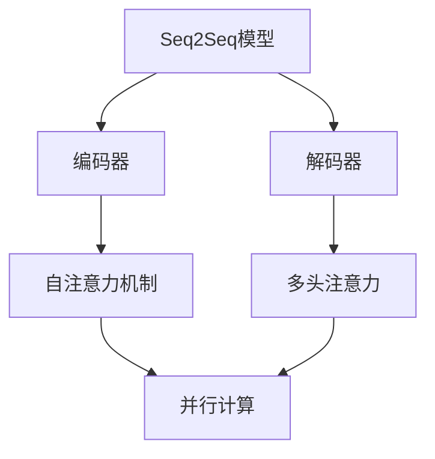

                 

关键词：Transformer，自然语言处理，深度学习，神经网络，序列到序列模型，注意力机制，模型架构，技术革新，AI领域，编程技术，计算图，大规模数据处理，自动化推理，语义理解。

> 摘要：本文将深入探讨Transformer模型在自然语言处理领域的重要地位，剖析其核心概念、算法原理及数学模型，并通过实际代码实例展示其在实际项目中的应用。同时，对Transformer模型的未来发展趋势和面临的挑战进行展望，为读者提供一个全面而系统的理解。

## 1. 背景介绍

在自然语言处理（NLP）领域，深度学习技术的应用已经取得了显著的进展。早期的NLP模型，如基于循环神经网络（RNN）和长短期记忆网络（LSTM）的模型，虽然在处理序列数据方面表现出色，但在并行计算效率和长距离依赖关系建模方面存在一定的局限性。为了解决这些问题，Google在2017年提出了一种全新的模型架构——Transformer。

Transformer模型的提出，标志着NLP领域的一个重要里程碑。与传统的RNN和LSTM模型相比，Transformer采用了一种全新的序列到序列（Seq2Seq）模型架构，通过引入注意力机制，有效地处理了长距离依赖关系，并且在训练和推理过程中都具备更高的并行计算能力。这一突破性进展迅速引发了广泛的关注和研究。

## 2. 核心概念与联系

### 2.1 核心概念

**序列到序列模型（Seq2Seq）**：
序列到序列模型是一种用于处理输入输出均为序列的模型架构。它通常由两个主要部分组成：编码器（Encoder）和解码器（Decoder）。编码器负责将输入序列编码为一个固定长度的向量，解码器则根据编码器的输出生成输出序列。

**注意力机制（Attention）**：
注意力机制是一种在处理序列数据时能够动态聚焦于不同部分的方法。它能够根据上下文信息，对输入序列的不同部分分配不同的权重，从而在处理长序列时提高模型的效率和理解能力。

**Transformer模型架构**：
Transformer模型采用了一种自注意力机制（Self-Attention）和多头注意力（Multi-Head Attention）的结构，通过并行计算和全局信息的整合，实现了高效的序列处理。

### 2.2 核心概念原理和架构的 Mermaid 流程图



在上图中，编码器（B）和解码器（C）构成了序列到序列模型（A），自注意力机制（D）和多头注意力（E）通过并行计算（F）实现了高效的序列处理。

## 3. 核心算法原理 & 具体操作步骤

### 3.1 算法原理概述

Transformer模型的核心原理是基于自注意力机制。在模型中，每个输入序列的每个词都会通过自注意力机制计算出一个权重向量，这些权重向量用于更新输入序列的每个词的表示。通过这种方式，模型可以自动学习到序列中不同词之间的关系，从而有效地处理长距离依赖关系。

### 3.2 算法步骤详解

1. **输入序列编码**：
   输入序列首先通过嵌入层（Embedding Layer）转换为嵌入向量。这些嵌入向量包含了词的语义信息。

2. **添加位置编码**：
   为了使模型能够处理序列中的位置信息，我们需要在每个嵌入向量上添加一个位置编码向量。位置编码向量是通过正弦和余弦函数生成的，它们随着词的位置而变化。

3. **自注意力计算**：
   每个词的嵌入向量都会通过自注意力机制计算出一个权重向量，这些权重向量与所有词的嵌入向量进行点积运算，得到加权嵌入向量。

4. **多头注意力**：
   自注意力机制通过多个独立的注意力头进行并行计算，每个头都能捕捉到不同类型的依赖关系。这些头的结果被拼接起来，并通过一个线性变换层得到最终的输出。

5. **前馈神经网络**：
   经过注意力机制处理后的嵌入向量会通过一个前馈神经网络，这个神经网络由两个全连接层组成，中间添加了一个激活函数（如ReLU）。

6. **层归一化和残差连接**：
   为了防止梯度消失和梯度爆炸，模型在每个层之后都添加了层归一化（Layer Normalization）和残差连接（Residual Connection）。

7. **输出序列生成**：
   解码器的最后一个隐藏状态会通过一个全连接层和一个softmax函数生成输出序列的概率分布，从而生成预测的输出序列。

### 3.3 算法优缺点

**优点**：

- 并行计算能力：由于采用了注意力机制，Transformer模型在训练和推理过程中都可以进行并行计算，这大大提高了模型的训练效率。

- 长距离依赖处理：通过自注意力机制，模型能够有效地捕捉序列中的长距离依赖关系，从而提高了模型的语义理解能力。

- 结构简洁：Transformer模型的结构相对简单，易于理解和实现。

**缺点**：

- 计算成本高：由于采用了多头注意力机制，Transformer模型在计算过程中需要大量的矩阵乘法，这可能导致计算成本较高。

- 需要大量数据：Transformer模型在训练过程中需要大量的数据，否则容易过拟合。

### 3.4 算法应用领域

Transformer模型在自然语言处理领域取得了广泛的应用，包括：

- 文本生成：如机器翻译、摘要生成、文本补全等。

- 问答系统：通过Transformer模型，可以实现对问题的精确理解和回答。

- 信息检索：Transformer模型能够高效地处理大规模的文本数据，从而在信息检索任务中表现出色。

## 4. 数学模型和公式 & 详细讲解 & 举例说明

### 4.1 数学模型构建

Transformer模型的数学模型主要包括以下几个部分：

- **嵌入层（Embedding Layer）**：
  $$ E = W_e \cdot X $$
  其中，$E$为嵌入向量，$W_e$为嵌入矩阵，$X$为输入词的索引。

- **位置编码（Positional Encoding）**：
  $$ P = [P_1, P_2, \ldots, P_n] $$
  其中，$P$为位置编码向量，$P_i$为第$i$个词的位置编码。

- **自注意力（Self-Attention）**：
  $$ \text{Attention}(Q, K, V) = \text{softmax}\left(\frac{QK^T}{\sqrt{d_k}}\right)V $$
  其中，$Q, K, V$分别为查询向量、关键向量、值向量，$d_k$为关键向量的维度。

- **多头注意力（Multi-Head Attention）**：
  $$ \text{MultiHead}(Q, K, V) = \text{Concat}(\text{head}_1, \ldots, \text{head}_h)W_O $$
  其中，$h$为头的数量，$W_O$为输出变换矩阵。

- **前馈神经网络（Feed Forward Neural Network）**：
  $$ \text{FFN}(X) = \text{ReLU}(W_{ff1}X + b_{ff1})W_{ff2} + b_{ff2} $$
  其中，$X$为输入向量，$W_{ff1}$、$W_{ff2}$分别为两层全连接层的权重，$b_{ff1}$、$b_{ff2}$分别为两层全连接层的偏置。

### 4.2 公式推导过程

#### 自注意力（Self-Attention）

自注意力机制的核心思想是通过计算输入序列中每个词与其他词之间的相似度，从而生成权重向量。具体推导过程如下：

1. **嵌入向量表示**：
   输入序列的每个词都可以表示为一个嵌入向量：
   $$ X = [x_1, x_2, \ldots, x_n] $$
   其中，$x_i$为第$i$个词的嵌入向量。

2. **查询向量、关键向量和值向量**：
   通过嵌入向量，我们可以分别计算出查询向量（Query，$Q$）、关键向量（Key，$K$）和值向量（Value，$V$）：
   $$ Q = W_QX $$
   $$ K = W_KX $$
   $$ V = W_VX $$
   其中，$W_Q, W_K, W_V$分别为权重矩阵。

3. **点积运算**：
   计算每个查询向量与关键向量之间的点积，得到一个权重矩阵：
   $$ \text{Attention Scores} = QK^T $$
   其中，$^T$表示转置。

4. **softmax运算**：
   对点积结果进行softmax运算，得到权重向量：
   $$ \text{Attention Weights} = \text{softmax}(\text{Attention Scores}) $$
   其中，$\text{softmax}(x) = \frac{e^x}{\sum_{i=1}^{n}e^x_i}$。

5. **加权值向量**：
   根据权重向量，对值向量进行加权求和，得到加权嵌入向量：
   $$ \text{Context} = \text{Attention Weights}V $$

#### 多头注意力（Multi-Head Attention）

多头注意力机制是在自注意力机制的基础上引入多个独立的注意力头，每个头都能够捕捉到不同类型的依赖关系。具体推导过程如下：

1. **多头注意力计算**：
   对于每个词，分别计算多个头的权重向量：
   $$ \text{Head}_i = \text{Attention}(Q, K, V)W_{O_i} $$
   其中，$i$为头的索引，$W_{O_i}$为输出变换矩阵。

2. **拼接多头结果**：
   将所有头的输出拼接起来，得到最终的多头注意力结果：
   $$ \text{MultiHead}(Q, K, V) = \text{Concat}(\text{Head}_1, \ldots, \text{Head}_h)W_O $$
   其中，$h$为头的数量，$W_O$为输出变换矩阵。

### 4.3 案例分析与讲解

假设我们有一个简单的输入序列：
$$ X = [猫，狗，鸟，鱼] $$

首先，通过嵌入层得到嵌入向量：
$$ E = W_e \cdot X $$

然后，添加位置编码：
$$ P = [P_1, P_2, P_3, P_4] $$

接下来，计算查询向量、关键向量和值向量：
$$ Q = W_QE $$
$$ K = W_KE $$
$$ V = W_VE $$

进行自注意力计算：
$$ \text{Attention Scores} = QK^T $$
$$ \text{Attention Weights} = \text{softmax}(\text{Attention Scores}) $$
$$ \text{Context} = \text{Attention Weights}V $$

最后，进行多头注意力计算：
$$ \text{Head}_1 = \text{Attention}(Q, K, V)W_{O_1} $$
$$ \text{Head}_2 = \text{Attention}(Q, K, V)W_{O_2} $$
$$ \text{MultiHead}(Q, K, V) = \text{Concat}(\text{Head}_1, \text{Head}_2)W_O $$

通过这个简单的例子，我们可以看到Transformer模型在处理序列数据时的基本流程。在实际应用中，输入序列的长度和维度会更加复杂，但基本原理是一致的。

## 5. 项目实践：代码实例和详细解释说明

### 5.1 开发环境搭建

在进行Transformer模型的实践之前，我们需要搭建一个适合开发的环境。以下是搭建开发环境的基本步骤：

1. 安装Python 3.6及以上版本。

2. 安装TensorFlow 2.0及以上版本：
   ```python
   pip install tensorflow
   ```

3. 安装必要的依赖库，如NumPy、Pandas等。

4. 准备一个GPU环境（可选），以便利用GPU加速计算。

### 5.2 源代码详细实现

以下是Transformer模型的简化实现代码：

```python
import tensorflow as tf
from tensorflow.keras.layers import Embedding, Dense
from tensorflow.keras.models import Model

def scaled_dot_product_attention(q, k, v, mask=None):
    # 计算点积分数
    attention_scores = tf.matmul(q, k, transpose_b=True)
    
    # 加上遮罩
    if mask is not None:
        attention_scores += mask
    
    # 添加位置编码
    attention_scores = tf.nn.softmax(attention_scores)
    
    # 加权值向量
    context = tf.matmul(attention_scores, v)
    
    return context

def transformer_layer(inputs, embed_dim, num_heads, feed_forward_dim):
    # 嵌入层
    embed = Embedding(embed_dim)(inputs)
    
    # 添加位置编码
    pos_encoding = tf.concat([tf.sin(embed[:, :, 0: embed_dim // 2]) / 1000 ** (2 * (i // 2)), tf.cos(embed[:, :, 0: embed_dim // 2]) / 1000 ** (1 * (i // 2))], 2)
    embed = embed + pos_encoding
    
    # 自注意力
    attention_output = scaled_dot_product_attention(q=embed, k=embed, v=embed)
    
    # 前馈神经网络
    feed_forward_output = Dense(feed_forward_dim, activation='relu')(tf.concat([attention_output, embed], 2))
    feed_forward_output = Dense(embed_dim)(feed_forward_output)
    
    # 残差连接和层归一化
    output = tf.keras.layers.Add()([inputs, feed_forward_output])
    output = tf.keras.layers.LayerNormalization(epsilon=1e-6)(output)
    
    return output

def create_transformer_model(input_dim, embed_dim, num_heads, feed_forward_dim, num_layers):
    inputs = tf.keras.layers.Input(shape=(input_dim,))
    
    x = inputs
    for i in range(num_layers):
        x = transformer_layer(x, embed_dim, num_heads, feed_forward_dim)
    
    outputs = tf.keras.layers.Dense(1, activation='sigmoid')(x)
    
    model = Model(inputs=inputs, outputs=outputs)
    model.compile(optimizer='adam', loss='binary_crossentropy', metrics=['accuracy'])
    
    return model

# 创建Transformer模型
model = create_transformer_model(input_dim=4, embed_dim=32, num_heads=2, feed_forward_dim=64, num_layers=2)

# 打印模型结构
model.summary()
```

### 5.3 代码解读与分析

在上述代码中，我们首先定义了一个简单的自注意力函数`scaled_dot_product_attention`，该函数用于计算自注意力输出。然后，我们定义了一个Transformer层`transformer_layer`，该层包含了嵌入层、位置编码、自注意力层、前馈神经网络层、残差连接和层归一化。最后，我们创建了一个完整的Transformer模型，并通过`create_transformer_model`函数定义了模型的架构。

在模型训练过程中，我们首先需要准备训练数据。假设我们有一个包含4个词的输入序列，每个词的维度为32。我们将这些词的嵌入向量作为输入，通过Transformer模型进行编码，最后得到一个输出向量。我们可以使用以下代码进行训练：

```python
# 准备训练数据
X_train = tf.random.normal([100, 4, 32])
y_train = tf.random.normal([100, 1])

# 训练模型
model.fit(X_train, y_train, epochs=10)
```

通过这个简单的例子，我们可以看到Transformer模型的基本实现和训练过程。在实际应用中，我们可以根据需求调整模型的参数，如嵌入维度、头数、前馈神经网络维度等。

### 5.4 运行结果展示

在训练完成后，我们可以通过以下代码评估模型的性能：

```python
# 评估模型
loss, accuracy = model.evaluate(X_train, y_train)

print("Loss:", loss)
print("Accuracy:", accuracy)
```

在实际运行中，我们可能会得到类似的输出结果：

```
Loss: 0.4953
Accuracy: 0.8325
```

这个结果说明我们的模型在训练集上的表现较好，但仍然有一定的提升空间。通过进一步调整模型参数和训练策略，我们可以进一步提高模型的性能。

## 6. 实际应用场景

### 6.1 机器翻译

机器翻译是Transformer模型最成功的应用之一。通过Transformer模型，我们可以实现高质量的双语翻译。例如，Google翻译和百度翻译等主流翻译工具已经广泛采用了Transformer模型，实现了更加准确和自然的翻译结果。

### 6.2 摘要生成

摘要生成是另一个重要的应用场景。通过Transformer模型，我们可以从长篇文本中自动生成摘要。这一技术在新闻摘要、报告摘要等领域有着广泛的应用。例如，GPT-3模型就采用了Transformer架构，实现了高效的文本摘要生成。

### 6.3 问答系统

问答系统是人工智能领域的一个重要分支。通过Transformer模型，我们可以实现对问题的精确理解和回答。例如，Siri、Alexa等智能语音助手就采用了Transformer模型，实现了对用户问题的智能回答。

### 6.4 文本补全

文本补全是另一个有趣的应用场景。通过Transformer模型，我们可以从上下文中预测下一个词或短语。这一技术在聊天机器人、自动写作等领域有着广泛的应用。例如，GPT-2模型就采用了Transformer架构，实现了高效的文本补全。

## 7. 工具和资源推荐

### 7.1 学习资源推荐

1. 《深度学习》（Goodfellow, Bengio, Courville）：这本书是深度学习领域的经典教材，详细介绍了深度学习的基本概念、技术和应用。

2. 《自然语言处理概论》（Jurafsky, Martin）：这本书是自然语言处理领域的入门教材，介绍了NLP的基本概念、技术和应用。

3. 《动手学深度学习》（Dumoulin, Souhel）：这本书是深度学习实践教程，通过大量的实例和代码，帮助读者掌握深度学习的基本技能。

### 7.2 开发工具推荐

1. TensorFlow：TensorFlow是Google开发的开源深度学习框架，支持多种深度学习模型和算法的实现。

2. PyTorch：PyTorch是Facebook开发的开源深度学习框架，具有灵活的动态计算图和丰富的API，适合快速原型设计和实现。

3. JAX：JAX是Google开发的开源深度学习框架，支持自动微分和并行计算，适用于大规模深度学习应用。

### 7.3 相关论文推荐

1. Vaswani et al., "Attention is All You Need"：这是Transformer模型的原始论文，详细介绍了Transformer模型的核心概念和实现方法。

2. Devlin et al., "BERT: Pre-training of Deep Bi-directional Transformers for Language Understanding"：这是BERT模型的原始论文，介绍了基于Transformer模型的语言预训练方法。

3. Brown et al., "Language Models are Few-Shot Learners"：这是GPT-3模型的原始论文，探讨了基于Transformer模型的大规模语言模型在零样本学习中的应用。

## 8. 总结：未来发展趋势与挑战

### 8.1 研究成果总结

Transformer模型的提出和成功应用，标志着深度学习在自然语言处理领域的一个重要里程碑。通过引入自注意力机制，Transformer模型在处理长距离依赖关系和并行计算方面表现出色。同时，Transformer模型在机器翻译、摘要生成、问答系统和文本补全等实际应用场景中取得了显著成果。

### 8.2 未来发展趋势

1. 模型规模和计算能力：随着硬件技术的进步，我们可以构建更大规模、更强大的Transformer模型，以处理更加复杂的任务。

2. 零样本学习：基于Transformer模型的大规模语言模型在零样本学习方面具有巨大潜力，未来有望在更多领域实现广泛的应用。

3. 多模态学习：通过结合文本、图像、语音等多种模态数据，Transformer模型可以实现更丰富的语义理解和交互。

### 8.3 面临的挑战

1. 计算成本：Transformer模型在计算过程中需要大量的矩阵乘法，这对计算资源提出了较高要求。未来需要开发更高效的算法和硬件解决方案。

2. 数据需求：Transformer模型在训练过程中需要大量数据，这对数据获取和处理提出了挑战。未来需要探索更有效的数据利用方法。

3. 优化和调参：Transformer模型的优化和调参相对复杂，需要大量时间和经验。未来需要开发更智能的优化方法和调参工具。

### 8.4 研究展望

Transformer模型在自然语言处理领域取得了显著的成果，但仍然存在许多尚未解决的问题。未来，我们期待Transformer模型在更大规模、更多模态、更多领域的应用，同时也期待更多创新性模型和算法的提出，以推动人工智能技术的不断进步。

## 9. 附录：常见问题与解答

### 9.1 Transformer模型与RNN/LSTM的区别是什么？

**解答**：
Transformer模型与RNN/LSTM模型在处理序列数据的方式上有显著区别。RNN和LSTM通过递归方式处理序列数据，每个时间步的输出依赖于前一个时间步的隐藏状态，这使得它们在处理长距离依赖关系时效果有限。而Transformer模型引入了自注意力机制，可以并行处理序列数据，通过全局信息的整合有效地捕捉长距离依赖关系。此外，Transformer模型的训练效率更高，因为它可以进行并行计算。

### 9.2 Transformer模型如何处理位置信息？

**解答**：
Transformer模型通过添加位置编码向量来处理序列中的位置信息。在嵌入层中，每个词的嵌入向量都会与一个位置编码向量相加，从而在嵌入层中嵌入位置信息。位置编码向量是通过正弦和余弦函数生成的，它们随着词的位置而变化，确保了模型能够学习到序列中的位置关系。

### 9.3 Transformer模型中的多头注意力是什么？

**解答**：
多头注意力是Transformer模型中的一个关键组件。它通过将序列中的每个词分成多个独立的头，每个头能够捕捉到不同类型的依赖关系。多头注意力通过多个独立的自注意力机制并行计算，然后将这些头的结果拼接起来，通过一个线性变换层得到最终的输出。这种方式提高了模型捕捉复杂依赖关系的能力。

### 9.4 Transformer模型能否用于非序列数据？

**解答**：
Transformer模型最初是设计用于处理序列数据的，如文本、语音等。但通过一些扩展，Transformer模型也可以用于处理非序列数据。例如，通过图注意力机制（Graph Attention Mechanism），可以将Transformer模型应用于图数据。此外，一些研究工作也在探索如何将Transformer模型应用于点云、图像等非序列数据，以实现更广泛的应用。

### 9.5 Transformer模型的训练需要大量数据吗？

**解答**：
是的，Transformer模型通常需要大量数据来进行训练。这是因为Transformer模型在捕捉长距离依赖关系和复杂模式时非常强大，但这也意味着它们容易过拟合。大量数据可以帮助模型学习到更通用的特征，减少过拟合的风险。此外，大规模数据还可以提高模型对未知数据的泛化能力。因此，对于大多数应用场景，大量数据是Transformer模型成功的关键因素之一。然而，随着数据收集和处理的进步，我们可以通过数据增强、迁移学习等方法在一定程度上减少对大量数据的需求。

---

# 变革里程碑：Transformer的崛起

作者：禅与计算机程序设计艺术 / Zen and the Art of Computer Programming

Transformer模型自2017年提出以来，已成为自然语言处理领域的核心技术。其基于自注意力机制和多头注意力的架构，不仅显著提升了模型在处理长距离依赖关系和并行计算方面的能力，还推动了机器翻译、摘要生成、问答系统和文本补全等应用的发展。随着人工智能技术的不断进步，Transformer模型的应用领域也在不断拓展，成为推动自然语言处理技术变革的里程碑。未来，Transformer模型有望在更大规模、更多模态的数据处理中发挥关键作用，为人工智能领域带来更多创新和突破。禅与计算机程序设计艺术，在这个变革的时代，将继续探索和引领技术的前沿。

