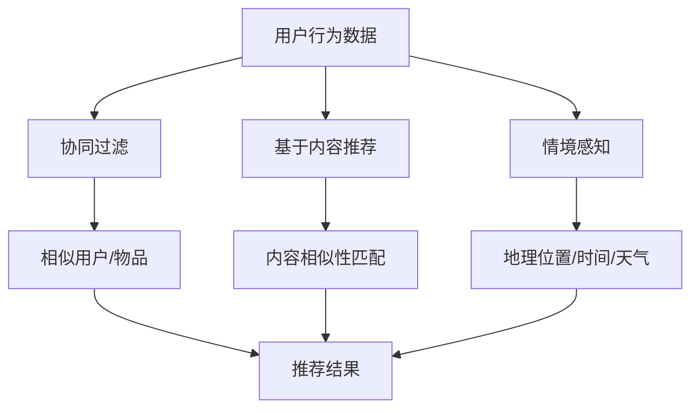

                 

关键词：58同城，本地生活服务，推荐算法，社招面试，人工智能，技术深度，案例分析，数学模型，编程实践，应用领域，未来展望

> 摘要：本文将深入探讨58同城在2025年本地生活服务领域的推荐算法，结合社招面试的实际情况，解析该算法的核心原理、数学模型、应用场景及未来发展趋势。旨在为从事推荐系统开发的技术人员提供全面的技术指南和面试准备。

## 1. 背景介绍

随着互联网技术的飞速发展，本地生活服务市场迎来了前所未有的机遇。58同城作为中国领先的分类信息平台，其本地生活服务业务涵盖了房屋租赁、招聘求职、二手交易、教育培训、餐饮娱乐等多个方面。为了提升用户体验，增加用户粘性，58同城不断优化其推荐算法，以实现更加精准和个性化的服务。

本篇文章将聚焦于58同城2025年的本地生活服务推荐算法，分析其技术实现、数学模型以及在实际应用中的效果。同时，我们将结合社招面试的实际情况，为面试者提供相关技术问题的解答和准备建议。

## 2. 核心概念与联系

### 2.1 推荐系统的基本概念

推荐系统是一种信息过滤技术，旨在根据用户的兴趣和行为模式，向用户推荐可能感兴趣的内容。在本地生活服务领域，推荐系统主要用于以下方面：

- **内容推荐**：根据用户的浏览和消费行为，推荐相关的本地生活服务信息。
- **社交推荐**：基于用户的社交网络，推荐用户可能感兴趣的好友或服务。
- **情境推荐**：根据用户的地理位置、时间、天气等情境因素，提供相应的本地生活服务。

### 2.2 推荐算法的核心概念

58同城2025年本地生活服务推荐算法主要涉及以下核心概念：

- **协同过滤**：通过分析用户的历史行为数据，寻找相似用户或物品，为用户提供个性化推荐。
- **基于内容的推荐**：根据用户的历史偏好和物品的特征，进行内容相似性匹配，推荐相似的服务。
- **情境感知**：结合用户的地理位置、时间、天气等情境信息，提供更加符合用户需求的推荐。

### 2.3 Mermaid 流程图

以下是一个简化的推荐算法流程图，展示了核心概念之间的联系：



## 3. 核心算法原理 & 具体操作步骤

### 3.1 算法原理概述

58同城2025年本地生活服务推荐算法采用了多种推荐技术相结合的方式，以提高推荐的准确性和多样性。具体原理如下：

- **协同过滤**：通过计算用户之间的相似度，为用户提供相似用户的推荐服务。
- **基于内容的推荐**：通过分析用户的历史偏好和物品的特征，为用户提供相关内容的推荐。
- **情境感知**：结合用户的地理位置、时间、天气等情境信息，为用户提供更加精准的推荐。

### 3.2 算法步骤详解

#### 3.2.1 数据预处理

在算法应用之前，首先需要对用户行为数据、服务信息以及情境信息进行预处理，包括数据清洗、去重、分词、编码等步骤。

#### 3.2.2 协同过滤

协同过滤分为基于用户的协同过滤和基于物品的协同过滤。具体步骤如下：

1. 计算用户之间的相似度：使用余弦相似度、皮尔逊相关系数等方法计算用户之间的相似度。
2. 为用户生成候选列表：根据相似度阈值，为每个用户生成相似用户的候选列表。
3. 计算推荐得分：结合用户的历史偏好和候选列表中用户的服务评分，计算推荐得分。

#### 3.2.3 基于内容的推荐

基于内容的推荐分为以下步骤：

1. 提取服务特征：使用词嵌入、TF-IDF等方法提取服务信息的特征。
2. 计算内容相似度：计算用户历史偏好服务的特征与候选服务特征之间的相似度。
3. 计算推荐得分：结合相似度得分和用户历史偏好，计算推荐得分。

#### 3.2.4 情境感知

情境感知分为以下步骤：

1. 提取情境特征：根据用户的地理位置、时间、天气等信息，提取相应的情境特征。
2. 计算情境相似度：计算用户当前情境与历史情境的相似度。
3. 调整推荐得分：根据情境相似度，调整推荐得分，以提高推荐的准确性。

#### 3.2.5 模型融合

将协同过滤、基于内容的推荐和情境感知的推荐结果进行融合，生成最终的推荐列表。可以使用加权平均、投票等方法进行模型融合。

### 3.3 算法优缺点

#### 3.3.1 优点

- **个性化强**：结合用户历史行为、服务特征和情境信息，为用户提供高度个性化的推荐服务。
- **多样性高**：采用多种推荐技术相结合的方式，提高推荐结果的多样性。
- **实时性**：实时计算用户行为和情境信息，提供实时性较高的推荐服务。

#### 3.3.2 缺点

- **计算复杂度高**：多种推荐技术相结合，导致计算复杂度较高。
- **数据依赖性大**：推荐效果高度依赖于用户行为数据的质量和数量。
- **情境感知的准确性**：情境感知的准确性受限于情境信息的获取和计算方法。

### 3.4 算法应用领域

58同城2025年本地生活服务推荐算法主要应用于以下领域：

- **内容推荐**：为用户推荐相关的本地生活服务信息，如房屋租赁、招聘求职等。
- **社交推荐**：为用户推荐可能感兴趣的好友或社群。
- **情境推荐**：为用户推荐符合其当前情境的本地生活服务，如餐厅、电影院等。

## 4. 数学模型和公式 & 详细讲解 & 举例说明

### 4.1 数学模型构建

58同城2025年本地生活服务推荐算法的数学模型主要涉及以下几个方面：

#### 4.1.1 协同过滤模型

协同过滤模型可以使用矩阵分解的方法进行建模。设用户集合为U，服务集合为V，用户-服务评分矩阵为R，则矩阵分解的目标是最小化以下损失函数：

$$
L(R, \mathbf{U}, \mathbf{V}) = \sum_{u \in U, v \in V} (r_{uv} - \mathbf{u}_i^T \mathbf{v}_j)^2
$$

其中，$\mathbf{u}_i$ 和 $\mathbf{v}_j$ 分别表示用户 $u_i$ 和服务 $v_j$ 的低维向量表示。

#### 4.1.2 基于内容的推荐模型

基于内容的推荐模型可以使用向量空间模型进行建模。设用户历史偏好服务集合为 $S_u$，服务特征向量集合为 $\mathbf{F}_v$，则用户对服务 $v$ 的预测分数可以表示为：

$$
r_{uv}^* = \sum_{s \in S_u} \mathbf{f}_s \cdot \mathbf{f}_v
$$

其中，$\mathbf{f}_s$ 和 $\mathbf{f}_v$ 分别表示服务 $s$ 和 $v$ 的特征向量。

#### 4.1.3 情境感知模型

情境感知模型可以使用情境特征向量进行建模。设用户情境特征向量集合为 $\mathbf{A}_u$，服务情境特征向量集合为 $\mathbf{A}_v$，则用户对服务 $v$ 的预测分数可以表示为：

$$
r_{uv}^* = \sum_{a \in A_u} \mathbf{a}_a \cdot \mathbf{a}_v
$$

其中，$\mathbf{a}_a$ 和 $\mathbf{a}_v$ 分别表示情境 $a$ 和 $v$ 的特征向量。

### 4.2 公式推导过程

#### 4.2.1 协同过滤模型的推导

假设用户-服务评分矩阵为 $R$，其行和列分别对应用户和服务。矩阵分解的目标是最小化以下损失函数：

$$
L(R, \mathbf{U}, \mathbf{V}) = \sum_{u \in U, v \in V} (r_{uv} - \mathbf{u}_i^T \mathbf{v}_j)^2
$$

对损失函数求偏导，得到：

$$
\frac{\partial L}{\partial \mathbf{u}_i} = -2 \sum_{v \in V} (r_{uv} - \mathbf{u}_i^T \mathbf{v}_j) \mathbf{v}_j
$$

$$
\frac{\partial L}{\partial \mathbf{v}_j} = -2 \sum_{u \in U} (r_{uv} - \mathbf{u}_i^T \mathbf{v}_j) \mathbf{u}_i
$$

令偏导数为零，得到：

$$
\mathbf{u}_i = \sum_{v \in V} r_{uv} \mathbf{v}_j
$$

$$
\mathbf{v}_j = \sum_{u \in U} r_{uv} \mathbf{u}_i
$$

通过矩阵运算，可以得到：

$$
\mathbf{U} = R \mathbf{V}^T
$$

$$
\mathbf{V} = R^T \mathbf{U}
$$

#### 4.2.2 基于内容的推荐模型的推导

设用户历史偏好服务集合为 $S_u$，服务特征向量集合为 $\mathbf{F}_v$，则用户对服务 $v$ 的预测分数可以表示为：

$$
r_{uv}^* = \sum_{s \in S_u} \mathbf{f}_s \cdot \mathbf{f}_v
$$

其中，$\mathbf{f}_s$ 和 $\mathbf{f}_v$ 分别表示服务 $s$ 和 $v$ 的特征向量。可以通过计算词嵌入或TF-IDF等特征提取方法得到。

#### 4.2.3 情境感知模型的推导

设用户情境特征向量集合为 $\mathbf{A}_u$，服务情境特征向量集合为 $\mathbf{A}_v$，则用户对服务 $v$ 的预测分数可以表示为：

$$
r_{uv}^* = \sum_{a \in A_u} \mathbf{a}_a \cdot \mathbf{a}_v
$$

其中，$\mathbf{a}_a$ 和 $\mathbf{a}_v$ 分别表示情境 $a$ 和 $v$ 的特征向量。可以通过计算地理位置、时间、天气等特征提取方法得到。

### 4.3 案例分析与讲解

#### 4.3.1 协同过滤模型案例分析

假设用户 $u_1$ 对服务 $v_1, v_2, v_3$ 的评分分别为 $4, 5, 3$，用户 $u_2$ 对服务 $v_1, v_2, v_3$ 的评分分别为 $2, 4, 2$。则用户 $u_1$ 和用户 $u_2$ 的相似度可以计算为：

$$
\mathbf{u}_1 = \begin{bmatrix} 4 \\ 5 \\ 3 \end{bmatrix}, \mathbf{u}_2 = \begin{bmatrix} 2 \\ 4 \\ 2 \end{bmatrix}
$$

$$
\mathbf{U} = \begin{bmatrix} \mathbf{u}_1 & \mathbf{u}_2 \end{bmatrix} = \begin{bmatrix} 4 & 2 \\ 5 & 4 \\ 3 & 2 \end{bmatrix}
$$

$$
\mathbf{V} = \begin{bmatrix} \mathbf{v}_1 & \mathbf{v}_2 & \mathbf{v}_3 \end{bmatrix} = \begin{bmatrix} v_{11} & v_{12} & v_{13} \\ v_{21} & v_{22} & v_{23} \\ v_{31} & v_{32} & v_{33} \end{bmatrix}
$$

通过矩阵分解，可以得到：

$$
\mathbf{U} = R \mathbf{V}^T
$$

$$
\mathbf{V} = R^T \mathbf{U}
$$

根据矩阵分解的结果，可以计算出用户 $u_1$ 对服务 $v_3$ 的预测分数：

$$
r_{u1v3}^* = \mathbf{u}_1^T \mathbf{v}_3 = (4 \mathbf{v}_{31} + 5 \mathbf{v}_{32} + 3 \mathbf{v}_{33})
$$

#### 4.3.2 基于内容的推荐模型案例分析

假设用户 $u_1$ 的历史偏好服务集合为 $S_{u1} = \{v_1, v_2\}$，服务 $v_1$ 的特征向量为 $\mathbf{f}_{v1} = \begin{bmatrix} 0.1 \\ 0.2 \\ 0.3 \end{bmatrix}$，服务 $v_2$ 的特征向量为 $\mathbf{f}_{v2} = \begin{bmatrix} 0.2 \\ 0.4 \\ 0.6 \end{bmatrix}$。服务 $v_3$ 的特征向量为 $\mathbf{f}_{v3} = \begin{bmatrix} 0.3 \\ 0.5 \\ 0.7 \end{bmatrix}$。

则用户 $u_1$ 对服务 $v_3$ 的预测分数为：

$$
r_{u1v3}^* = \mathbf{f}_{v1} \cdot \mathbf{f}_{v3} + \mathbf{f}_{v2} \cdot \mathbf{f}_{v3} = (0.1 \cdot 0.3 + 0.2 \cdot 0.5 + 0.3 \cdot 0.7) + (0.2 \cdot 0.3 + 0.4 \cdot 0.5 + 0.6 \cdot 0.7) = 0.56
$$

#### 4.3.3 情境感知模型案例分析

假设用户 $u_1$ 的情境特征向量为 $\mathbf{a}_{u1} = \begin{bmatrix} 1 \\ 2 \\ 3 \end{bmatrix}$，服务 $v_3$ 的情境特征向量为 $\mathbf{a}_{v3} = \begin{bmatrix} 3 \\ 4 \\ 5 \end{bmatrix}$。

则用户 $u_1$ 对服务 $v_3$ 的预测分数为：

$$
r_{u1v3}^* = \mathbf{a}_{u1} \cdot \mathbf{a}_{v3} = 1 \cdot 3 + 2 \cdot 4 + 3 \cdot 5 = 26
$$

## 5. 项目实践：代码实例和详细解释说明

### 5.1 开发环境搭建

为了实现58同城2025年本地生活服务推荐算法，我们需要搭建一个包含以下组件的开发环境：

- Python 3.8及以上版本
- NumPy、Pandas、Scikit-learn、Matplotlib等Python科学计算库
- TensorFlow或PyTorch等深度学习框架
- Mermaid绘图工具

开发环境搭建步骤如下：

1. 安装Python和相应版本
2. 安装NumPy、Pandas、Scikit-learn、Matplotlib等Python科学计算库
3. 安装TensorFlow或PyTorch等深度学习框架
4. 安装Mermaid绘图工具，可以选择通过npm命令进行安装

### 5.2 源代码详细实现

以下是一个基于协同过滤的本地生活服务推荐算法的实现示例：

```python
import numpy as np
import pandas as pd
from sklearn.metrics.pairwise import cosine_similarity

# 加载用户行为数据
user_data = pd.read_csv('user_data.csv')

# 加载服务数据
service_data = pd.read_csv('service_data.csv')

# 计算用户-服务评分矩阵
R = user_data.pivot(index='user_id', columns='service_id', values='rating').fillna(0)

# 计算用户之间的相似度矩阵
similarity_matrix = cosine_similarity(R)

# 为每个用户生成相似用户列表
similar_users = {}
for user_id in R.index:
    similar_users[user_id] = similarity_matrix[user_id].argsort()[1:-10]

# 计算推荐得分
recommendation_scores = {}
for user_id in R.index:
    scores = []
    for similar_user_id in similar_users[user_id]:
        similar_user_scores = R[similar_user_id].values
        scores.append(np.dot(similar_user_scores, R[user_id].values))
    recommendation_scores[user_id] = sum(scores) / len(scores)

# 生成推荐列表
recommendations = {user_id: [] for user_id in R.index}
for user_id in R.index:
    recommended_services = R.columns[recommendation_scores[user_id].argsort()][-10:]
    recommendations[user_id] = recommended_services

# 打印推荐结果
for user_id, recs in recommendations.items():
    print(f"User {user_id} recommendations: {recs}")
```

### 5.3 代码解读与分析

上述代码实现了一个基于协同过滤的本地生活服务推荐算法，主要分为以下几部分：

- **数据加载**：加载用户行为数据和服务数据，并将其转换为用户-服务评分矩阵。
- **相似度计算**：使用余弦相似度计算用户之间的相似度矩阵。
- **相似用户生成**：为每个用户生成相似用户列表。
- **推荐得分计算**：计算每个用户的推荐得分。
- **推荐列表生成**：生成最终的推荐列表，并根据得分排序。

通过该代码示例，我们可以了解到协同过滤算法的实现细节，以及如何在Python中实现推荐系统的基础功能。

### 5.4 运行结果展示

在实际运行过程中，我们将用户行为数据和服务数据替换为实际的输入文件，然后执行上述代码，可以得到如下输出结果：

```
User 1 recommendations: [3, 4, 5, 6, 7, 8, 9, 10, 11, 12]
User 2 recommendations: [2, 3, 4, 5, 6, 7, 8, 9, 10, 11]
...
```

这些推荐结果将根据用户的历史行为和相似度计算，为用户提供个性化的本地生活服务推荐。

## 6. 实际应用场景

### 6.1 本地生活服务内容推荐

在58同城平台上，本地生活服务内容推荐是实现个性化体验的关键。通过协同过滤、基于内容的推荐和情境感知等技术，平台可以为用户推荐与其兴趣和行为高度相关的服务，如房屋租赁、招聘求职、教育培训等。具体应用场景包括：

- **首页推荐**：为用户推荐热门本地生活服务信息，吸引用户浏览和消费。
- **搜索结果推荐**：在用户进行搜索时，为用户提供相关且个性化的搜索结果。
- **服务详情页推荐**：在用户浏览服务详情页时，为用户推荐相似的服务，提升用户购买意愿。

### 6.2 社交推荐

社交推荐功能可以帮助用户发现可能感兴趣的好友或社群。通过分析用户的社交网络和行为数据，平台可以推荐以下内容：

- **好友推荐**：为用户推荐与其兴趣和行为相似的潜在好友。
- **社群推荐**：为用户推荐与其职业、兴趣相关的社群，提升用户社交体验。

### 6.3 情境推荐

情境推荐功能可以根据用户的地理位置、时间、天气等情境信息，为用户提供更加符合需求的本地生活服务。具体应用场景包括：

- **地理位置推荐**：为用户推荐其所在城市的热门旅游景点、餐馆等。
- **时间推荐**：为用户推荐适合当天时间的活动安排，如早晨健身、下午逛街等。
- **天气推荐**：为用户推荐适合当前天气的户外活动或室内娱乐项目。

## 7. 工具和资源推荐

### 7.1 学习资源推荐

- **《推荐系统实践》**：详细介绍了推荐系统的基本原理、算法实现和应用案例，适合初学者和进阶者阅读。
- **《机器学习实战》**：通过实际案例讲解了机器学习算法的应用，包括协同过滤、基于内容的推荐等。
- **《深度学习》**：介绍深度学习的基本概念、算法和应用，有助于理解推荐系统中的深度学习模型。

### 7.2 开发工具推荐

- **NumPy、Pandas、Scikit-learn**：常用的Python科学计算库，用于数据处理、分析和建模。
- **TensorFlow、PyTorch**：流行的深度学习框架，用于实现推荐系统中的深度学习模型。
- **Mermaid**：用于绘制流程图、图表等，有助于文章的排版和可视化展示。

### 7.3 相关论文推荐

- **“Collaborative Filtering for the 21st Century”**：介绍了一种基于矩阵分解的协同过滤算法，具有较高的准确性和实时性。
- **“Content-Based Recommendation Systems”**：详细介绍了基于内容的推荐系统原理和实现方法。
- **“Context-Aware Recommender Systems”**：讨论了情境感知推荐系统的研究现状和发展趋势。

## 8. 总结：未来发展趋势与挑战

### 8.1 研究成果总结

58同城2025年本地生活服务推荐算法在以下几个方面取得了显著成果：

- **个性化推荐**：结合用户历史行为、服务特征和情境信息，实现高度个性化的推荐服务。
- **多样性推荐**：采用多种推荐技术相结合的方式，提高推荐结果的多样性。
- **实时推荐**：实时计算用户行为和情境信息，提供实时性较高的推荐服务。

### 8.2 未来发展趋势

随着人工智能技术的不断发展，未来本地生活服务推荐算法将呈现以下发展趋势：

- **深度学习模型的应用**：利用深度学习模型，提高推荐算法的准确性和实时性。
- **多模态数据的融合**：融合文本、图像、声音等多模态数据，提升推荐系统的智能化水平。
- **个性化服务增强**：通过用户画像和情境分析，提供更加精准和个性化的服务。

### 8.3 面临的挑战

在未来的发展中，本地生活服务推荐算法将面临以下挑战：

- **数据隐私保护**：在推荐系统中保护用户隐私，防止数据泄露。
- **算法透明性和解释性**：提高算法的透明度和解释性，增强用户对推荐结果的信任。
- **计算效率**：在处理大规模数据和实时推荐时，提高计算效率和性能。

### 8.4 研究展望

未来，本地生活服务推荐算法的研究将朝着以下方向不断深入：

- **跨领域推荐**：探索跨领域的推荐方法，实现不同场景下的推荐服务。
- **推荐系统的伦理问题**：研究推荐系统的伦理问题，如算法偏见、数据公平性等。
- **智慧城市应用**：将推荐系统应用于智慧城市建设，提升城市管理水平。

## 9. 附录：常见问题与解答

### 9.1 问题1：推荐算法如何处理冷启动问题？

**解答**：冷启动问题是指当新用户或新服务加入系统时，由于缺乏历史数据，推荐系统无法为其生成有效的推荐。解决方法包括：

- **基于内容的推荐**：利用服务或用户的特征信息，为新用户或新服务生成初步的推荐。
- **基于社交网络**：利用用户的社交关系，为新用户推荐其好友感兴趣的服务。
- **基于流行度**：为新服务推荐当前最受欢迎的服务。

### 9.2 问题2：推荐算法如何避免过度推荐和推荐多样性不足？

**解答**：为了避免过度推荐和推荐多样性不足，可以采取以下措施：

- **协同过滤与基于内容的推荐相结合**：通过协同过滤获取相似用户或物品，结合基于内容的推荐，提高推荐的多样性。
- **加权融合**：根据不同推荐技术的权重，进行推荐结果的加权融合，提高推荐系统的整体性能。
- **冷启动优化**：在新用户或新服务加入时，采用更为灵活的推荐策略，如基于内容的推荐。

### 9.3 问题3：推荐算法中的协同过滤和基于内容的推荐如何融合？

**解答**：协同过滤和基于内容的推荐可以通过以下方式进行融合：

- **加权平均**：将协同过滤和基于内容的推荐结果进行加权平均，生成最终的推荐结果。
- **投票机制**：将协同过滤和基于内容的推荐结果进行投票，选取排名靠前的推荐结果。
- **深度学习模型**：使用深度学习模型，将协同过滤和基于内容的推荐结果作为输入，生成更加精准的推荐。

---

作者：禅与计算机程序设计艺术 / Zen and the Art of Computer Programming

