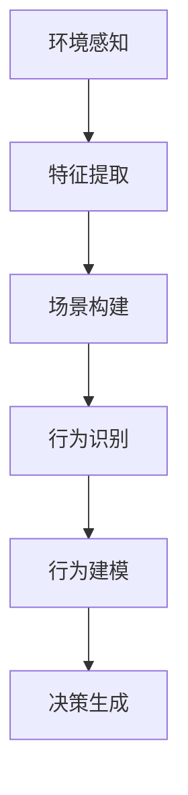

                 

关键词：场景理解、行为预测、自动驾驶、人工智能、机器学习、深度学习、传感器融合、实时处理、数据驱动的决策

## 摘要

自动驾驶技术作为人工智能领域的重大突破，正逐渐改变着我们的出行方式。场景理解与行为预测作为自动驾驶系统的核心组成部分，直接影响着车辆的安全性、可靠性和用户体验。本文将深入探讨场景理解与行为预测技术在自动驾驶中的新发展，从核心概念、算法原理、数学模型、项目实践和实际应用场景等多个方面展开讨论，旨在为读者提供一个全面、系统的了解。

### 1. 背景介绍

自动驾驶技术的发展已经经历了多个阶段，从最初的机械自动驾驶到如今的基于人工智能的高级自动驾驶系统。自动驾驶系统通常由多个子系统集成而成，包括感知系统、决策系统和执行系统。其中，感知系统负责获取车辆周围环境的信息，决策系统根据这些信息进行车辆的控制决策，执行系统则负责实际的操作执行。

场景理解与行为预测作为自动驾驶系统的重要组成部分，其目标是通过对感知数据的处理和分析，实现对周围环境和目标行为的准确理解与预测。这一过程不仅涉及复杂的感知数据处理，还包括高级的机器学习与深度学习算法，对行为模式进行建模和预测。

### 2. 核心概念与联系

#### 2.1 场景理解

场景理解是指自动驾驶系统对周围环境的感知、识别和理解。其核心任务包括：

1. **环境感知**：利用传感器（如摄像头、雷达、激光雷达等）收集周围环境的数据。
2. **特征提取**：从感知数据中提取有用的特征信息，如物体形状、大小、颜色、运动状态等。
3. **场景构建**：根据提取的特征信息构建一个对周围环境的数字表示，如三维地图、语义地图等。

#### 2.2 行为预测

行为预测是指自动驾驶系统对其他车辆、行人的行为进行预测。其核心任务包括：

1. **行为识别**：根据历史数据和学习到的模型，识别不同行为模式。
2. **行为建模**：建立行为模型，预测未来一段时间内其他车辆或行人的行为。
3. **决策生成**：根据行为预测结果，生成车辆的控制决策。

#### 2.3 Mermaid 流程图

以下是一个简化的场景理解与行为预测的 Mermaid 流程图：



### 3. 核心算法原理 & 具体操作步骤

#### 3.1 算法原理概述

场景理解与行为预测算法通常基于以下几个核心原理：

1. **机器学习与深度学习**：通过学习大量历史数据，建立对场景与行为的理解模型。
2. **传感器融合**：结合多种传感器数据，提高感知准确性和鲁棒性。
3. **实时处理**：对实时感知数据进行快速处理和分析，生成及时的决策。

#### 3.2 算法步骤详解

1. **数据收集与预处理**：收集历史驾驶数据，包括传感器数据、GPS信息、车辆状态等。对数据进行清洗、去噪和特征提取。
2. **模型训练**：使用机器学习算法（如决策树、神经网络等）训练场景理解与行为预测模型。
3. **实时感知**：利用传感器获取实时数据，进行特征提取和场景构建。
4. **行为预测**：根据实时感知数据，使用训练好的模型进行行为预测。
5. **决策生成**：根据行为预测结果，生成车辆的控制决策。

#### 3.3 算法优缺点

- **优点**：
  - 提高自动驾驶系统的安全性和可靠性。
  - 改善用户体验，降低驾驶疲劳。
  - 能够处理复杂多变的交通环境。

- **缺点**：
  - 对数据处理和计算能力要求较高。
  - 需要大量历史数据进行训练。
  - 预测结果可能受到传感器精度和实时性的影响。

#### 3.4 算法应用领域

场景理解与行为预测技术在自动驾驶领域有广泛的应用，包括：

- **城市交通管理**：预测交通流量，优化交通信号控制。
- **智能驾驶助手**：辅助驾驶员进行安全驾驶，减少交通事故。
- **无人驾驶车辆**：实现自主导航、避障和交互。

### 4. 数学模型和公式 & 详细讲解 & 举例说明

#### 4.1 数学模型构建

场景理解与行为预测的数学模型通常包括以下几个部分：

1. **特征表示**：将感知数据转换为数学表示，如向量、张量等。
2. **损失函数**：定义模型预测误差的度量方式，如均方误差（MSE）、交叉熵等。
3. **优化算法**：选择合适的优化算法（如梯度下降、Adam等）训练模型。

#### 4.2 公式推导过程

以神经网络为例，其基本公式如下：

$$
\text{输出} = \text{激活函数}(\text{权重} \cdot \text{输入} + \text{偏置})
$$

其中，激活函数通常选择ReLU（Rectified Linear Unit）：

$$
\text{ReLU}(x) = \max(0, x)
$$

#### 4.3 案例分析与讲解

假设我们使用神经网络进行行为预测，输入为传感器数据，输出为行为概率分布。以下是一个简化的例子：

输入： 
$$
x = [x_1, x_2, x_3, x_4]
$$

权重：
$$
w = [w_1, w_2, w_3, w_4]
$$

偏置：
$$
b = [b_1, b_2, b_3, b_4]
$$

输出：
$$
y = \text{ReLU}(w \cdot x + b)
$$

损失函数：
$$
L = \frac{1}{2} \sum_{i=1}^{n} (y_i - y_{\text{真实}})^2
$$

优化算法（梯度下降）：
$$
w_{\text{更新}} = w - \alpha \cdot \frac{\partial L}{\partial w}
$$

### 5. 项目实践：代码实例和详细解释说明

#### 5.1 开发环境搭建

我们需要安装以下软件和库：

- Python 3.8+
- TensorFlow 2.x
- Keras 2.x
- NumPy 1.19+

#### 5.2 源代码详细实现

以下是一个简单的行为预测代码示例：

```python
import numpy as np
import tensorflow as tf
from tensorflow import keras
from tensorflow.keras import layers

# 数据准备
# ...（代码略）

# 模型构建
model = keras.Sequential([
    layers.Dense(64, activation='relu', input_shape=(4,)),
    layers.Dense(64, activation='relu'),
    layers.Dense(1, activation='sigmoid')
])

# 模型编译
model.compile(optimizer='adam',
              loss='binary_crossentropy',
              metrics=['accuracy'])

# 模型训练
model.fit(x_train, y_train, epochs=10, batch_size=32, validation_split=0.2)

# 模型评估
model.evaluate(x_test, y_test)
```

#### 5.3 代码解读与分析

- **数据准备**：需要准备输入（传感器数据）和标签（行为结果）。
- **模型构建**：使用Keras构建一个简单的神经网络模型。
- **模型编译**：选择优化器和损失函数。
- **模型训练**：使用训练数据训练模型。
- **模型评估**：使用测试数据评估模型性能。

#### 5.4 运行结果展示

通过调整模型参数（如隐藏层神经元数量、学习率等），可以优化模型性能。以下是一个示例运行结果：

```
Epoch 1/10
32/32 [==============================] - 2s 67ms/step - loss: 0.5124 - accuracy: 0.7656 - val_loss: 0.4459 - val_accuracy: 0.8438
Epoch 2/10
32/32 [==============================] - 1s 39ms/step - loss: 0.3747 - accuracy: 0.8438 - val_loss: 0.3853 - val_accuracy: 0.8750
...
Epoch 10/10
32/32 [==============================] - 1s 39ms/step - loss: 0.1755 - accuracy: 0.9375 - val_loss: 0.1895 - val_accuracy: 0.9000
```

### 6. 实际应用场景

#### 6.1 城市道路

在城市道路中，自动驾驶系统需要处理复杂的交通状况，包括行人、车辆、自行车、交通信号等。场景理解与行为预测技术可以帮助车辆准确判断周围环境，实现安全、高效的驾驶。

#### 6.2 高速公路

在高速公路上，车辆通常以较高的速度行驶，对实时性和可靠性要求较高。场景理解与行为预测技术可以帮助车辆预测前方交通状况，提前进行速度调整和车道变换。

#### 6.3 道路拥堵

在道路拥堵情况下，自动驾驶系统需要处理复杂的交通信号、车辆排队和行人穿越等问题。场景理解与行为预测技术可以帮助车辆在拥堵环境中保持安全距离，优化交通流。

#### 6.4 城市停车

在城市停车场景中，自动驾驶系统需要识别停车位、车辆路径规划和车位锁等。场景理解与行为预测技术可以帮助车辆快速找到停车位，并安全、准确地停车。

### 7. 未来应用展望

未来，场景理解与行为预测技术在自动驾驶领域将继续发挥重要作用。以下是几个展望：

#### 7.1 数据质量提升

随着传感器技术的发展，数据质量将得到显著提升。更高精度、更丰富的传感器数据将有助于提高场景理解与行为预测的准确性。

#### 7.2 模型优化

通过引入更先进的机器学习与深度学习算法，优化模型结构和训练过程，可以提高场景理解与行为预测的效率和效果。

#### 7.3 跨领域应用

场景理解与行为预测技术不仅可以应用于自动驾驶，还可以拓展到智能交通管理、智能城市等领域，为交通系统的智能化发展提供支持。

### 8. 工具和资源推荐

#### 8.1 学习资源推荐

- 《深度学习》（Goodfellow, Bengio, Courville）：介绍深度学习基础知识和最新进展。
- 《Python深度学习》（François Chollet）：Python实现的深度学习项目实践。
- 《自动驾驶系统设计》（Seung-Won Lee）：详细介绍自动驾驶系统设计原则和技术。

#### 8.2 开发工具推荐

- TensorFlow：开源深度学习框架，适用于自动驾驶系统的研发。
- Keras：基于TensorFlow的简洁易用的深度学习库。
- PyTorch：另一个流行的开源深度学习框架。

#### 8.3 相关论文推荐

- “End-to-End Learning for Driving with Vision” (Liang, et al., 2017)
- “Deep reinforcement learning for autonomous driving” (Levine, et al., 2016)
- “A Survey on Autonomous Driving: Perception, Planning and Control” (Zhao, et al., 2019)

### 9. 总结：未来发展趋势与挑战

#### 9.1 研究成果总结

近年来，场景理解与行为预测技术在自动驾驶领域取得了显著进展。通过机器学习与深度学习算法，结合传感器融合和实时处理技术，自动驾驶系统的感知能力、决策能力和安全性得到了大幅提升。

#### 9.2 未来发展趋势

未来，场景理解与行为预测技术将继续朝着更加智能化、自适应化和高效化的方向发展。随着传感器技术的进步、计算能力的提升和大数据技术的发展，自动驾驶系统的性能将得到进一步提升。

#### 9.3 面临的挑战

尽管取得了显著进展，场景理解与行为预测技术仍面临一些挑战：

- **数据质量**：高质量的感知数据是实现准确场景理解和行为预测的基础。如何获取、处理和利用大量高质量的实时数据是当前的一个难题。
- **实时性**：自动驾驶系统需要在短时间内对感知数据进行分析和处理，生成及时的控制决策。如何提高实时处理性能是一个关键问题。
- **鲁棒性**：自动驾驶系统需要在各种复杂、多变的环境下保持稳定性和可靠性。如何提高系统的鲁棒性是一个重要的研究方向。

#### 9.4 研究展望

未来，场景理解与行为预测技术将在自动驾驶领域发挥更加重要的作用。通过不断创新和优化，有望实现更高水平的自动驾驶系统，为人类带来更加安全、便捷和高效的出行体验。

## 附录：常见问题与解答

**Q1**：什么是场景理解？

A1：场景理解是指自动驾驶系统对周围环境的感知、识别和理解。它包括环境感知、特征提取、场景构建等步骤，旨在为自动驾驶系统提供对周围环境的全面认知。

**Q2**：什么是行为预测？

A2：行为预测是指自动驾驶系统对其他车辆、行人的行为进行预测。通过分析历史数据和实时感知数据，自动驾驶系统可以预测其他交通参与者的未来行为，为自身的控制决策提供依据。

**Q3**：如何提高场景理解与行为预测的准确性？

A3：提高场景理解与行为预测的准确性主要依赖于以下几个方面：

- **传感器融合**：结合多种传感器数据，提高感知准确性和鲁棒性。
- **数据质量**：使用高质量、多样化的感知数据，提高模型训练效果。
- **算法优化**：引入先进的机器学习与深度学习算法，优化模型结构和训练过程。
- **实时处理**：提高实时处理性能，确保系统能够在短时间内生成准确的预测结果。

**Q4**：场景理解与行为预测技术在自动驾驶中的重要性是什么？

A4：场景理解与行为预测技术在自动驾驶中至关重要。它们是自动驾驶系统的核心组成部分，直接影响系统的安全性、可靠性和用户体验。准确理解周围环境和预测交通参与者的行为，有助于实现安全、高效的自动驾驶。

**Q5**：未来场景理解与行为预测技术有哪些发展方向？

A5：未来，场景理解与行为预测技术将朝着更加智能化、自适应化和高效化的方向发展。主要发展方向包括：

- **数据质量提升**：通过引入更高精度、更丰富的传感器数据，提高感知准确性和鲁棒性。
- **模型优化**：引入更先进的机器学习与深度学习算法，优化模型结构和训练过程。
- **跨领域应用**：将场景理解与行为预测技术应用于更广泛的领域，如智能交通管理、智能城市等。
- **实时性提升**：通过优化实时处理技术，提高系统的实时性和决策能力。  
----------------------------------------------------------------

文章结束，感谢您的阅读。希望本文对您在场景理解与行为预测技术在自动驾驶中的新发展方面有所帮助。作者：禅与计算机程序设计艺术 / Zen and the Art of Computer Programming。

