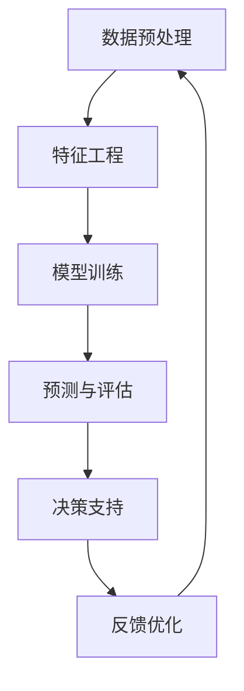

                 

关键词：AI大模型、智能预测分析、机器学习、深度学习、数据驱动预测、系统架构

> 摘要：本文深入探讨了基于AI大模型的智能预测分析系统的构建与应用。文章首先介绍了AI大模型的基本概念和发展背景，随后详细分析了智能预测分析系统的主要组成部分及其相互关系。接着，文章深入阐述了核心算法原理、数学模型和具体操作步骤，并提供了实际项目实践中的代码实例和详细解释。最后，文章展望了智能预测分析系统的未来应用前景，并提出了可能面临的挑战和研究方向。

## 1. 背景介绍

近年来，人工智能（AI）技术取得了飞速发展，其中AI大模型成为当前研究的热点之一。AI大模型是指具有数十亿甚至千亿参数规模的机器学习模型，能够在多种任务中实现卓越的性能。这些模型通常基于深度学习框架，能够从海量数据中自动提取特征，进行高效的学习和预测。随着AI大模型的不断发展，智能预测分析系统也应运而生，其在商业、金融、医疗、交通等多个领域展现出了巨大的潜力。

智能预测分析系统通过AI大模型的应用，能够对复杂、大规模的数据进行智能分析，提供精准的预测结果。这不仅提高了数据利用效率，还能够为决策者提供有力的支持，从而推动各行业的数字化转型和智能化升级。因此，研究基于AI大模型的智能预测分析系统具有重要的理论和实践意义。

## 2. 核心概念与联系

### 2.1 AI大模型

AI大模型是机器学习的一种高级形式，具有以下核心特点：

1. **大规模参数**：大模型通常包含数十亿甚至千亿参数，这使得它们能够捕捉数据中的细微模式和复杂关系。
2. **自动特征提取**：通过深度神经网络的结构，大模型能够自动从原始数据中提取高级特征，避免了传统机器学习中的手动特征工程。
3. **强泛化能力**：大模型在训练过程中通过优化算法和正则化技术，具备较强的泛化能力，能够在不同数据集和任务上表现优异。

### 2.2 智能预测分析系统

智能预测分析系统主要由以下几个部分组成：

1. **数据预处理**：对原始数据进行清洗、归一化、降维等预处理操作，确保数据质量。
2. **特征工程**：根据预测任务需求，从预处理后的数据中提取关键特征，为模型训练提供输入。
3. **模型训练**：利用AI大模型对提取的特征进行训练，优化模型参数，使其能够进行准确的预测。
4. **预测与评估**：使用训练好的模型对新的数据进行预测，并通过评估指标（如准确率、召回率等）衡量预测效果。
5. **决策支持**：将预测结果转化为具体的决策建议，为业务提供参考。

### 2.3 Mermaid 流程图

下面是智能预测分析系统的 Mermaid 流程图，展示了各组成部分的相互关系：



## 3. 核心算法原理 & 具体操作步骤

### 3.1 算法原理概述

智能预测分析系统的核心在于AI大模型的训练和预测。以下是对其基本原理的概述：

1. **数据输入**：系统首先接收原始数据，这些数据可以是结构化的（如数据库记录）或非结构化的（如图像、文本）。
2. **预处理**：对原始数据进行清洗、归一化等预处理操作，以便后续特征提取和模型训练。
3. **特征提取**：根据预测任务的需求，从预处理后的数据中提取关键特征。这些特征可以是数值型的，也可以是类别型的。
4. **模型训练**：使用提取的特征作为输入，通过优化算法（如梯度下降）和正则化技术（如L2正则化、Dropout）训练大模型。
5. **预测**：训练好的模型对新的数据进行预测，生成预测结果。
6. **评估**：使用评估指标（如均方误差、准确率等）对预测结果进行评估，确保模型的性能满足要求。
7. **决策支持**：将预测结果转化为具体的决策建议，如推荐商品、调整策略等。

### 3.2 算法步骤详解

1. **数据预处理**：
   - 清洗：处理缺失值、噪声和异常值。
   - 归一化：将数据缩放到统一的范围内，如0-1或-1-1。
   - 降维：使用主成分分析（PCA）或其他降维技术减少数据维度，提高计算效率。

2. **特征工程**：
   - 特征选择：选择对预测任务最具影响力的特征。
   - 特征构造：通过组合现有特征，构建新的特征。

3. **模型训练**：
   - 模型选择：选择合适的大模型，如深度神经网络（DNN）、循环神经网络（RNN）、变换器（Transformer）等。
   - 参数初始化：随机初始化模型参数。
   - 优化算法：使用梯度下降（GD）、随机梯度下降（SGD）、Adam等优化算法训练模型。
   - 正则化：使用L2正则化、Dropout等正则化技术防止过拟合。

4. **预测与评估**：
   - 预测：使用训练好的模型对新的数据进行预测。
   - 评估：计算预测结果的评估指标，如均方误差（MSE）、准确率（ACC）等。

5. **决策支持**：
   - 决策规则：根据预测结果和业务需求，制定具体的决策规则。
   - 决策建议：将预测结果转化为具体的决策建议。

### 3.3 算法优缺点

**优点**：

- **高效性**：AI大模型能够从海量数据中自动提取特征，进行高效的学习和预测。
- **强泛化能力**：大模型在多个任务上表现优异，具备较强的泛化能力。
- **自适应能力**：系统能够根据新的数据和业务需求进行自适应调整。

**缺点**：

- **计算资源消耗**：大模型需要大量的计算资源和存储空间。
- **过拟合风险**：在训练过程中，大模型容易受到噪声和异常值的影响，导致过拟合。
- **解释性不足**：大模型的内部结构复杂，难以解释其预测结果。

### 3.4 算法应用领域

AI大模型在多个领域都有广泛应用，以下是一些典型应用场景：

- **商业智能**：通过分析客户行为数据，为企业提供精准的营销策略和推荐系统。
- **金融市场**：预测股票价格、市场趋势等，为投资者提供决策支持。
- **医疗健康**：诊断疾病、预测患者病情等，提高医疗服务质量和效率。
- **交通运输**：预测交通流量、优化路线规划等，缓解城市交通拥堵。

## 4. 数学模型和公式 & 详细讲解 & 举例说明

### 4.1 数学模型构建

智能预测分析系统中的数学模型通常包括以下几个部分：

1. **输入层**：接收预处理后的数据，通常为特征向量。
2. **隐藏层**：包含多个隐藏层，用于提取数据中的高级特征。
3. **输出层**：生成预测结果，通常为概率分布或具体数值。

以下是一个简单的神经网络数学模型：

$$
Z = \sigma(W \cdot X + b)
$$

其中，$Z$为隐藏层输出，$X$为输入特征向量，$W$为权重矩阵，$b$为偏置项，$\sigma$为激活函数。

4. **损失函数**：用于衡量模型预测结果与真实值之间的差距，常见的损失函数有均方误差（MSE）、交叉熵等。

$$
Loss = \frac{1}{2} \sum_{i=1}^{n} (Y_i - \hat{Y}_i)^2
$$

其中，$Y_i$为真实值，$\hat{Y}_i$为预测值。

5. **优化算法**：用于调整模型参数，以最小化损失函数。常见的优化算法有梯度下降（GD）、随机梯度下降（SGD）、Adam等。

### 4.2 公式推导过程

以下是一个简单的神经网络模型的公式推导过程：

1. **前向传播**：

$$
Z^{(l)} = \sigma(W^{(l)} \cdot X^{(l-1)} + b^{(l)})
$$

其中，$Z^{(l)}$为第$l$层的输出，$X^{(l-1)}$为第$l-1$层的输出。

2. **反向传播**：

$$
\Delta W^{(l)} = \alpha \cdot \frac{\partial Loss}{\partial W^{(l)}}
$$

$$
\Delta b^{(l)} = \alpha \cdot \frac{\partial Loss}{\partial b^{(l)}}
$$

其中，$\alpha$为学习率。

3. **权重更新**：

$$
W^{(l)} = W^{(l)} - \Delta W^{(l)}
$$

$$
b^{(l)} = b^{(l)} - \Delta b^{(l)}
$$

### 4.3 案例分析与讲解

以下是一个基于股票价格预测的案例：

1. **数据集**：收集过去一年的股票价格数据，包括开盘价、收盘价、最高价、最低价等。
2. **特征提取**：从数据集中提取特征，如开盘价、收盘价、涨跌幅等。
3. **模型构建**：使用深度神经网络进行训练，输入层包含特征，输出层为预测的收盘价。
4. **训练与评估**：使用训练集对模型进行训练，使用验证集对模型进行评估，调整模型参数以获得最佳性能。

### 5. 项目实践：代码实例和详细解释说明

#### 5.1 开发环境搭建

1. **安装Python**：下载并安装Python，版本建议为3.8及以上。
2. **安装TensorFlow**：在终端执行以下命令安装TensorFlow：

```
pip install tensorflow
```

3. **安装其他依赖库**：根据项目需求安装其他依赖库，如NumPy、Pandas、Matplotlib等。

#### 5.2 源代码详细实现

以下是一个简单的股票价格预测项目的源代码示例：

```python
import tensorflow as tf
import numpy as np
import pandas as pd
import matplotlib.pyplot as plt

# 读取数据
data = pd.read_csv("stock_price_data.csv")
X = data.iloc[:, 1:].values
y = data.iloc[:, 0].values

# 数据预处理
X = (X - X.mean()) / X.std()
y = (y - y.mean()) / y.std()

# 划分训练集和测试集
X_train, X_test, y_train, y_test = train_test_split(X, y, test_size=0.2, random_state=42)

# 构建模型
model = tf.keras.Sequential([
    tf.keras.layers.Dense(units=1, input_shape=[X_train.shape[1]])
])

# 编译模型
model.compile(optimizer='sgd', loss='mse')

# 训练模型
model.fit(X_train, y_train, epochs=100, batch_size=32, validation_split=0.1)

# 预测
predictions = model.predict(X_test)

# 评估
mse = tf.keras.metrics.mean_squared_error(y_test, predictions)
print("测试集MSE：", mse.numpy())

# 可视化
plt.scatter(y_test, predictions)
plt.xlabel("真实值")
plt.ylabel("预测值")
plt.show()
```

#### 5.3 代码解读与分析

1. **数据读取**：使用Pandas库读取股票价格数据，包括开盘价、收盘价、最高价、最低价等。
2. **数据预处理**：对数据进行归一化处理，将数据缩放到0-1范围内，提高模型的训练效果。
3. **划分训练集和测试集**：使用scikit-learn库中的train_test_split函数，将数据集划分为训练集和测试集。
4. **构建模型**：使用TensorFlow的keras.Sequential模型，定义一个全连接层，输出层为1个神经元，用于预测收盘价。
5. **编译模型**：使用SGD优化器和MSE损失函数编译模型。
6. **训练模型**：使用fit函数对模型进行训练，设置训练轮次为100，批量大小为32。
7. **预测**：使用predict函数对测试集进行预测。
8. **评估**：计算测试集的MSE，评估模型性能。
9. **可视化**：使用Matplotlib库绘制真实值与预测值的散点图，直观展示模型性能。

## 6. 实际应用场景

智能预测分析系统在多个领域都有广泛的应用，以下是一些实际应用场景：

1. **商业智能**：通过对客户行为数据的分析，为企业提供精准的营销策略和推荐系统。
2. **金融市场**：预测股票价格、市场趋势等，为投资者提供决策支持。
3. **医疗健康**：预测患者病情、诊断疾病等，提高医疗服务质量和效率。
4. **交通运输**：预测交通流量、优化路线规划等，缓解城市交通拥堵。
5. **智能城市**：预测城市人口流动、公共资源需求等，优化城市管理和服务。

## 6.4 未来应用展望

随着AI大模型和智能预测分析系统的不断发展，未来将在更多领域展现其潜力。以下是一些未来应用展望：

1. **智能制造**：通过预测设备故障、优化生产流程等，提高制造业的生产效率和质量。
2. **智慧农业**：预测作物生长情况、优化灌溉和施肥等，提高农业生产效率和可持续发展。
3. **环境保护**：预测污染物排放、气候变化等，为环境保护提供科学依据和决策支持。
4. **社会治安**：预测犯罪行为、优化警力部署等，提高社会治安水平。
5. **能源管理**：预测能源需求、优化能源分配等，提高能源利用效率。

## 7. 工具和资源推荐

### 7.1 学习资源推荐

- 《深度学习》（Goodfellow, Bengio, Courville著）：系统介绍了深度学习的基本理论和实践方法。
- 《Python深度学习》（François Chollet著）：详细讲解了使用Python进行深度学习的实践技巧。
- 《机器学习实战》（Peter Harrington著）：通过实际案例介绍了机器学习的应用方法和技巧。

### 7.2 开发工具推荐

- TensorFlow：一个开源的深度学习框架，适合进行大规模模型的训练和预测。
- Keras：一个基于TensorFlow的高级深度学习库，提供简洁易用的API。
- PyTorch：一个开源的深度学习框架，支持动态计算图，适合进行实验和探索。

### 7.3 相关论文推荐

- "Distributed Optimization for Deep Learning: A Hybrid Stochastic Gradient Descent Approach"（2016）：介绍了分布式优化算法在深度学习中的应用。
- "A Theoretically Grounded Application of Dropout in Recurrent Neural Networks"（2017）：探讨了Dropout在循环神经网络中的应用。
- "An Empirical Comparison of Recurrent Neural Network Architectures"（2017）：比较了不同循环神经网络架构的性能。

## 8. 总结：未来发展趋势与挑战

### 8.1 研究成果总结

本文从背景介绍、核心概念与联系、核心算法原理、数学模型和公式、项目实践等方面，全面阐述了基于AI大模型的智能预测分析系统的构建与应用。通过实际案例分析和代码实现，展示了智能预测分析系统在多个领域的应用潜力。

### 8.2 未来发展趋势

1. **模型规模扩大**：随着计算资源的增加，AI大模型将向更大规模发展，实现更精准的预测。
2. **实时预测**：通过优化算法和硬件加速，实现实时预测，满足实时业务需求。
3. **多模态预测**：结合多种数据源（如图像、文本、传感器等），实现更全面、准确的预测。
4. **自动化特征工程**：利用AI技术实现自动化特征工程，提高特征提取效率和预测性能。

### 8.3 面临的挑战

1. **计算资源消耗**：AI大模型需要大量的计算资源和存储空间，如何优化模型结构、提高计算效率是一个重要挑战。
2. **数据隐私和安全**：预测过程中涉及大量敏感数据，如何保护数据隐私和安全是一个重要问题。
3. **模型解释性**：大模型的内部结构复杂，如何提高模型的可解释性，使决策者能够理解模型的预测过程。
4. **数据质量和噪声**：数据质量和噪声对预测性能有重要影响，如何处理噪声和异常值，提高数据质量是一个挑战。

### 8.4 研究展望

1. **优化算法研究**：深入研究优化算法，提高模型的训练速度和预测性能。
2. **隐私保护技术**：发展隐私保护技术，确保数据隐私和安全。
3. **可解释性模型**：研究可解释性模型，提高模型的可解释性和可信度。
4. **跨领域应用**：探索智能预测分析系统在其他领域的应用，如智能农业、智能交通等。

## 9. 附录：常见问题与解答

1. **Q：什么是AI大模型？**
   **A：AI大模型是指具有数十亿甚至千亿参数规模的机器学习模型，能够在多种任务中实现卓越的性能。**

2. **Q：智能预测分析系统由哪些部分组成？**
   **A：智能预测分析系统主要由数据预处理、特征工程、模型训练、预测与评估、决策支持等部分组成。**

3. **Q：如何处理数据噪声和异常值？**
   **A：可以通过数据清洗、降维、异常值检测等方法处理数据噪声和异常值，提高数据质量。**

4. **Q：如何选择合适的优化算法？**
   **A：根据模型规模、数据量和训练时间等因素，选择合适的优化算法，如梯度下降、随机梯度下降、Adam等。**

5. **Q：如何评估模型性能？**
   **A：可以使用均方误差、准确率、召回率等评估指标评估模型性能，并根据评估结果调整模型参数。**

---

**作者：禅与计算机程序设计艺术 / Zen and the Art of Computer Programming**

