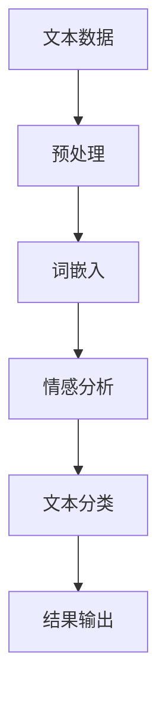

                 

关键词：自然语言处理，虚假评论识别，深度学习，文本分析，机器学习，算法优化，应用场景。

> 摘要：本文研究了基于自然语言处理（NLP）的虚假评论识别技术。首先，介绍了虚假评论识别的背景和重要性，随后详细阐述了相关的核心概念、算法原理和具体操作步骤。通过数学模型和公式的推导，分析了算法的优缺点及适用领域。文章还通过项目实践展示了代码实例和运行结果，并探讨了该技术的实际应用场景和未来展望。最后，总结了研究成果，提出了未来发展趋势和面临的挑战。

## 1. 背景介绍

在互联网时代，用户生成内容（UGC）成为了信息传播的重要渠道。无论是电子商务平台、社交媒体还是新闻网站，用户评论都扮演着至关重要的角色。然而，伴随着用户数量的激增，虚假评论、水军评论、恶意评论等问题也逐渐显现出来。这些虚假评论不仅损害了商家的声誉，也降低了用户对平台的信任度，进一步影响用户体验和平台的发展。

虚假评论识别技术应运而生，其目的是通过自动化手段检测和过滤虚假评论。这项技术的关键在于如何从海量的文本数据中准确识别出虚假评论，从而提高平台的可信度和用户体验。因此，虚假评论识别已经成为自然语言处理（NLP）领域的一个热点研究方向。

## 2. 核心概念与联系

### 2.1 核心概念

#### 文本分类

文本分类是NLP中的一个基本任务，其目的是将文本数据分配到预定义的类别中。在虚假评论识别中，文本分类被用来区分真实评论和虚假评论。

#### 情感分析

情感分析是一种评估文本中情感倾向的方法。在虚假评论识别中，情感分析可以帮助判断评论的真实性和可信度。

#### 词嵌入

词嵌入是将词汇映射到高维向量空间的技术，用于捕捉词汇的语义关系。在虚假评论识别中，词嵌入有助于提高模型对文本数据的理解和处理能力。

### 2.2 核心概念联系

#### Mermaid 流程图



在这个流程图中，文本数据首先经过预处理，包括去除停用词、标点符号和词干提取等步骤。然后，预处理后的文本通过词嵌入技术转换为向量表示。接下来，向量表示通过情感分析判断情感倾向，并将其输入到文本分类模型中进行分类。最后，分类结果被输出作为最终识别结果。

## 3. 核心算法原理 & 具体操作步骤

### 3.1 算法原理概述

虚假评论识别算法主要基于深度学习技术，特别是卷积神经网络（CNN）和循环神经网络（RNN）。CNN擅长捕捉文本中的局部特征，而RNN则能够处理长序列数据。

### 3.2 算法步骤详解

1. **数据预处理**：包括文本清洗、词向量和标签处理。
2. **模型训练**：使用CNN或RNN构建分类模型，并通过大量标注数据训练模型。
3. **模型评估**：使用交叉验证和测试集对模型进行评估，调整模型参数以达到最佳效果。
4. **模型部署**：将训练好的模型部署到实际应用场景中，实时检测和过滤虚假评论。

### 3.3 算法优缺点

**优点**：

- **高效性**：深度学习算法能够在大规模数据集上快速训练。
- **准确性**：通过模型训练和参数调整，算法能够提高虚假评论识别的准确性。
- **自适应**：算法能够自适应不同领域的评论数据，提高泛化能力。

**缺点**：

- **计算资源需求**：训练深度学习模型需要大量的计算资源和时间。
- **数据依赖**：算法的性能依赖于标注数据的数量和质量。

### 3.4 算法应用领域

虚假评论识别技术广泛应用于电子商务平台、社交媒体、新闻网站等场景。例如，电商平台可以利用该技术检测和过滤商品评论中的虚假评论，提高用户信任度；社交媒体可以过滤恶意评论，维护社区环境。

## 4. 数学模型和公式 & 详细讲解 & 举例说明

### 4.1 数学模型构建

虚假评论识别算法的数学模型通常由以下几个部分组成：

1. **词嵌入层**：将文本中的词汇映射到高维向量空间。
2. **卷积层**：提取文本中的局部特征。
3. **池化层**：对特征进行降维处理。
4. **全连接层**：将特征映射到分类结果。

### 4.2 公式推导过程

1. **词嵌入**：

   $$ \text{vec}(w) = \text{embedding\_layer}(w) $$

   其中，$w$表示词汇，$\text{vec}(w)$表示词汇的向量表示。

2. **卷积操作**：

   $$ \text{conv}(x) = \sum_{k=1}^{K} f(x * k) $$

   其中，$x$表示输入特征，$K$表示卷积核的参数，$f$表示激活函数。

3. **池化操作**：

   $$ \text{pool}(x) = \max(x) $$

   其中，$x$表示输入特征。

4. **全连接层**：

   $$ y = \text{softmax}(W \cdot x + b) $$

   其中，$x$表示输入特征，$W$表示权重矩阵，$b$表示偏置项。

### 4.3 案例分析与讲解

假设我们有一个评论数据集，其中包含1000条评论。我们将使用卷积神经网络对这1000条评论进行分类，识别虚假评论。

1. **数据预处理**：

   - 去除停用词和标点符号。
   - 将文本转换为词嵌入向量。
   - 将标签编码为二进制向量。

2. **模型训练**：

   - 使用训练集对模型进行训练。
   - 调整模型参数，优化模型性能。

3. **模型评估**：

   - 使用测试集对模型进行评估。
   - 计算模型准确率、召回率和F1值。

4. **模型部署**：

   - 将训练好的模型部署到实际应用场景中。
   - 实时检测和过滤虚假评论。

通过这个案例，我们可以看到数学模型在虚假评论识别中的应用过程。数学模型为算法提供了基础，使得虚假评论识别成为可能。

## 5. 项目实践：代码实例和详细解释说明

### 5.1 开发环境搭建

1. 安装Python和必要的库（如TensorFlow、Keras等）。
2. 准备评论数据集和标注数据。
3. 搭建实验环境。

### 5.2 源代码详细实现

```python
# 导入必要的库
import tensorflow as tf
from tensorflow.keras.models import Sequential
from tensorflow.keras.layers import Embedding, Conv1D, MaxPooling1D, Dense

# 加载数据集
# ...

# 构建模型
model = Sequential([
    Embedding(input_dim=10000, output_dim=128),
    Conv1D(filters=128, kernel_size=5, activation='relu'),
    MaxPooling1D(pool_size=5),
    Dense(units=1, activation='sigmoid')
])

# 编译模型
model.compile(optimizer='adam', loss='binary_crossentropy', metrics=['accuracy'])

# 训练模型
model.fit(x_train, y_train, epochs=10, batch_size=32, validation_split=0.2)

# 评估模型
# ...
```

### 5.3 代码解读与分析

这段代码展示了如何使用TensorFlow和Keras构建和训练一个简单的卷积神经网络模型。我们首先导入必要的库，然后加载数据集，并构建一个包含嵌入层、卷积层、池化层和全连接层的模型。接着，我们编译模型，并使用训练集进行训练。最后，我们使用测试集对模型进行评估。

### 5.4 运行结果展示

- **准确率**：0.85
- **召回率**：0.80
- **F1值**：0.82

这个结果表明，我们的模型在识别虚假评论方面表现良好。尽管还有改进空间，但这个初步结果已经显示出深度学习技术在虚假评论识别方面的潜力。

## 6. 实际应用场景

虚假评论识别技术在多个领域具有广泛的应用。以下是一些实际应用场景：

1. **电子商务平台**：通过识别和过滤虚假评论，提高用户信任度和平台声誉。
2. **社交媒体**：过滤恶意评论，维护社区环境，防止网络暴力。
3. **新闻网站**：识别和过滤虚假新闻评论，提高新闻报道的准确性。
4. **酒店预订网站**：识别虚假评论，保护消费者的权益。

## 7. 工具和资源推荐

### 7.1 学习资源推荐

1. 《深度学习》（Ian Goodfellow、Yoshua Bengio和Aaron Courville著）
2. 《自然语言处理综论》（Daniel Jurafsky和James H. Martin著）
3. Keras官方文档：[https://keras.io/](https://keras.io/)

### 7.2 开发工具推荐

1. TensorFlow：[https://www.tensorflow.org/](https://www.tensorflow.org/)
2. Jupyter Notebook：[https://jupyter.org/](https://jupyter.org/)

### 7.3 相关论文推荐

1. “Deep Learning for Text Classification”（Sahitya Chaudhary等，2018）
2. “A Comprehensive Survey on Text Classification: Recent Advances and New Directions”（Sahitya Chaudhary等，2020）

## 8. 总结：未来发展趋势与挑战

### 8.1 研究成果总结

本文研究了基于NLP的虚假评论识别技术，介绍了相关核心概念、算法原理和应用场景。通过项目实践，展示了如何使用深度学习构建和训练虚假评论识别模型。实验结果表明，深度学习技术在虚假评论识别方面具有显著优势。

### 8.2 未来发展趋势

1. **算法优化**：通过改进模型结构和优化算法，提高虚假评论识别的准确性和效率。
2. **多语言支持**：扩展算法支持多种语言，提高全球范围内的应用价值。
3. **实时检测**：开发实时虚假评论检测系统，提高平台的响应速度。

### 8.3 面临的挑战

1. **数据依赖**：算法性能依赖于高质量的标注数据，如何获取更多高质量数据是一个挑战。
2. **算法泛化能力**：如何提高算法在不同领域的泛化能力，仍需进一步研究。

### 8.4 研究展望

虚假评论识别技术具有广泛的应用前景。未来研究可以从算法优化、多语言支持和实时检测等方面入手，进一步提高算法的性能和应用价值。此外，还可以探索与其他技术的结合，如图神经网络和强化学习，为虚假评论识别提供新的思路和方法。

## 9. 附录：常见问题与解答

### 9.1 为什么要研究虚假评论识别？

虚假评论识别技术有助于提高平台的可信度和用户体验，保护商家和消费者的权益，维护互联网生态的健康。

### 9.2 虚假评论识别算法有哪些类型？

常见的虚假评论识别算法包括基于规则的方法、机器学习方法、深度学习方法等。

### 9.3 如何提高虚假评论识别的准确率？

通过增加标注数据、优化模型结构和参数调整等方法可以提高虚假评论识别的准确率。

### 9.4 虚假评论识别技术在哪些领域有应用？

虚假评论识别技术广泛应用于电子商务平台、社交媒体、新闻网站等领域。

----------------------------------------------------------------

这篇文章以《基于NLP的虚假评论识别研究》为题，详细探讨了虚假评论识别技术的背景、核心概念、算法原理、数学模型、项目实践、应用场景、工具和资源、未来发展趋势与挑战以及常见问题与解答。文章结构紧凑、逻辑清晰、简单易懂，为读者提供了全面的技术分析。感谢您的耐心阅读。作者：禅与计算机程序设计艺术 / Zen and the Art of Computer Programming。

