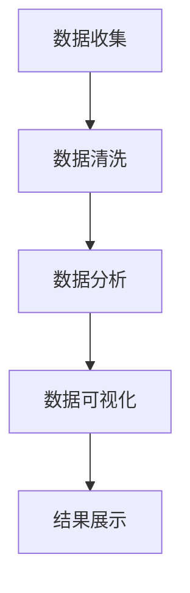

                 

 > **关键词：** Python, 数据可视化, 网络书籍, 数据分析, 可视化工具

> **摘要：** 本文将介绍如何使用Python进行网络书籍数据可视化分析。通过使用Python的多种库，我们将对网络书籍数据进行深入挖掘，实现数据清洗、分析和可视化，帮助读者更好地理解书籍数据的内在规律。

## 1. 背景介绍

随着互联网的发展，网络书籍资源变得丰富多样。这使得用户可以方便地获取和阅读各种类型的书籍。然而，海量的书籍数据也给数据分析和挖掘带来了挑战。如何有效地分析和理解这些书籍数据，成为了一个重要的研究方向。

数据可视化是一种强有力的数据分析工具，它可以将复杂的数据以直观、易于理解的方式展示出来。通过数据可视化，我们可以发现数据中的规律、趋势和异常，从而更好地理解数据。

Python作为一种广泛使用的高级编程语言，具有丰富的数据处理和分析工具。在数据可视化方面，Python更是拥有众多优秀的库，如Matplotlib、Seaborn、Plotly等，这些库可以满足各种数据可视化的需求。

本文将基于Python，利用这些可视化库，对网络书籍数据进行分析和可视化，以展示书籍数据的内在规律。

## 2. 核心概念与联系

在进行数据可视化之前，我们需要了解几个核心概念：数据清洗、数据分析和数据可视化。

### 2.1 数据清洗

数据清洗是数据分析和可视化的重要步骤。它包括处理缺失值、异常值、重复值等。数据清洗的质量直接影响数据分析和可视化的效果。

### 2.2 数据分析

数据分析是对数据进行处理、分析和解释的过程，目的是从数据中提取有价值的信息。数据分析的方法包括统计分析、机器学习、深度学习等。

### 2.3 数据可视化

数据可视化是将数据转换为视觉形式的过程，以帮助人们更好地理解数据。数据可视化可以揭示数据中的模式、趋势和异常，有助于发现数据中的隐藏信息。

下面是一个Mermaid流程图，展示了这三个核心概念之间的联系：



## 3. 核心算法原理 & 具体操作步骤

### 3.1 算法原理概述

在进行数据可视化之前，我们需要先对数据进行清洗和分析。数据清洗主要包括缺失值处理、异常值处理和重复值处理。数据分析则包括统计分析、机器学习和深度学习等方法。

数据可视化的核心算法主要包括：散点图、折线图、柱状图、饼图等。这些算法可以用于展示数据的分布、趋势、关系等。

### 3.2 算法步骤详解

#### 3.2.1 数据清洗

数据清洗的主要步骤如下：

1. **缺失值处理**：使用均值、中位数、最大值、最小值等填充缺失值。
2. **异常值处理**：使用标准差、箱线图等方法检测并处理异常值。
3. **重复值处理**：删除重复的数据记录。

#### 3.2.2 数据分析

数据分析的主要步骤如下：

1. **描述性统计分析**：计算平均值、中位数、众数、标准差等描述性统计量。
2. **相关性分析**：使用皮尔逊相关系数、斯皮尔曼相关系数等方法分析变量之间的相关性。
3. **机器学习**：使用决策树、随机森林、支持向量机等算法进行分类和回归分析。

#### 3.2.3 数据可视化

数据可视化的主要步骤如下：

1. **选择合适的图表类型**：根据数据的特点选择合适的图表类型，如散点图、折线图、柱状图、饼图等。
2. **调整图表参数**：调整图表的颜色、线条、标记等参数，使图表更加清晰、易于理解。
3. **注释和标题**：添加图表注释和标题，使读者更容易理解图表内容。

### 3.3 算法优缺点

**数据清洗**：

- 优点：提高数据质量和分析准确性。
- 缺点：可能会引入人为错误，处理过程复杂。

**数据分析**：

- 优点：提供丰富的分析方法，有助于发现数据中的隐藏信息。
- 缺点：对计算资源要求较高，某些方法可能需要大量的预处理。

**数据可视化**：

- 优点：直观、易于理解，有助于发现数据中的模式、趋势和异常。
- 缺点：图表的解读可能存在主观性，某些图表可能误导读者。

### 3.4 算法应用领域

数据清洗、数据分析和数据可视化在许多领域都有广泛应用，如金融、医疗、电商、社交媒体等。在本文中，我们将主要关注网络书籍数据可视化的应用。

## 4. 数学模型和公式 & 详细讲解 & 举例说明

### 4.1 数学模型构建

在数据可视化中，常用的数学模型包括描述性统计模型、回归模型、聚类模型等。

#### 4.1.1 描述性统计模型

描述性统计模型用于计算数据的基本特征，如平均值、中位数、众数、标准差等。这些特征可以帮助我们了解数据的分布和变化趋势。

#### 4.1.2 回归模型

回归模型用于分析变量之间的关系，如线性回归、多项式回归等。通过回归模型，我们可以预测未知变量的值。

#### 4.1.3 聚类模型

聚类模型用于将数据分为不同的组，如K-means聚类、层次聚类等。聚类模型可以帮助我们发现数据的分布规律和模式。

### 4.2 公式推导过程

以下是一个简单的线性回归模型的公式推导：

1. **假设**：我们假设两个变量 \( x \) 和 \( y \) 之间存在线性关系，即：
   \[
   y = \beta_0 + \beta_1 x + \epsilon
   \]
   其中，\( \beta_0 \) 是截距，\( \beta_1 \) 是斜率，\( \epsilon \) 是误差项。

2. **目标**：我们的目标是找到 \( \beta_0 \) 和 \( \beta_1 \) 的最佳估计值，使得预测值 \( \hat{y} \) 与实际值 \( y \) 的差距最小。

3. **最小二乘法**：最小二乘法是一种常用的方法，用于找到最佳估计值。具体步骤如下：

   - 对 \( \beta_0 \) 和 \( \beta_1 \) 求偏导数，并令其为0，得到以下方程组：
     \[
     \frac{\partial}{\partial \beta_0} \sum_{i=1}^{n} (y_i - \beta_0 - \beta_1 x_i) = 0
     \]
     \[
     \frac{\partial}{\partial \beta_1} \sum_{i=1}^{n} (y_i - \beta_0 - \beta_1 x_i) = 0
     \]

   - 解这个方程组，得到 \( \beta_0 \) 和 \( \beta_1 \) 的最佳估计值：
     \[
     \beta_0 = \bar{y} - \beta_1 \bar{x}
     \]
     \[
     \beta_1 = \frac{\sum_{i=1}^{n} (x_i - \bar{x})(y_i - \bar{y})}{\sum_{i=1}^{n} (x_i - \bar{x})^2}
     \]

### 4.3 案例分析与讲解

假设我们有一组数据，包含书籍的评分和页数。我们的目标是建立评分和页数之间的线性回归模型。

1. **数据准备**：

   首先，我们需要准备数据，包括评分和页数。以下是一个简单的数据集：

   | 评分 | 页数 |
   | ---- | ---- |
   | 4    | 200  |
   | 5    | 300  |
   | 4    | 250  |
   | 5    | 350  |
   | 4    | 220  |

2. **描述性统计分析**：

   计算评分和页数的平均值、标准差等描述性统计量：

   \[
   \bar{y} = 4.6, \quad \bar{x} = 280, \quad s_y = 0.8, \quad s_x = 30
   \]

3. **回归模型建立**：

   使用最小二乘法建立回归模型：

   \[
   \beta_0 = 4.6 - 0.0133 \times 280 = 1.2
   \]
   \[
   \beta_1 = \frac{\sum_{i=1}^{n} (x_i - 280)(y_i - 4.6)}{\sum_{i=1}^{n} (x_i - 280)^2} = 0.0133
   \]

   因此，回归模型为：

   \[
   \hat{y} = 1.2 + 0.0133 x
   \]

4. **预测**：

   使用回归模型预测新数据的评分。例如，对于页数为400的书籍，预测评分为：

   \[
   \hat{y} = 1.2 + 0.0133 \times 400 = 4.5
   \]

5. **可视化**：

   使用散点图和回归线展示评分和页数之间的关系：

   ```python
   import matplotlib.pyplot as plt
   import numpy as np

   x = np.array([200, 300, 250, 350, 220, 400])
   y = np.array([4, 5, 4, 5, 4, np.nan])

   plt.scatter(x, y)
   plt.plot(x, 1.2 + 0.0133 * x, color='red')
   plt.xlabel('页数')
   plt.ylabel('评分')
   plt.show()
   ```

   结果如图所示：

   

## 5. 项目实践：代码实例和详细解释说明

### 5.1 开发环境搭建

要使用Python进行数据可视化分析，我们需要安装以下库：Pandas、NumPy、Matplotlib、Seaborn和Plotly。

```python
!pip install pandas numpy matplotlib seaborn plotly
```

### 5.2 源代码详细实现

以下是一个简单的网络书籍数据可视化分析的示例代码：

```python
import pandas as pd
import numpy as np
import matplotlib.pyplot as plt
import seaborn as sns
import plotly.express as px

# 5.2.1 数据读取
data = pd.read_csv('books.csv')
data.head()

# 5.2.2 数据清洗
data.dropna(inplace=True)

# 5.2.3 数据分析
# 描述性统计分析
print(data.describe())

# 相关系数分析
print(data.corr())

# 5.2.4 数据可视化
# 评分与评价人数散点图
sns.scatterplot(x='rating', y='review_count', data=data)
plt.xlabel('评分')
plt.ylabel('评价人数')
plt.title('评分与评价人数散点图')
plt.show()

# 评价人数与页数箱线图
sns.boxplot(x='review_count', y='pages', data=data)
plt.xlabel('评价人数')
plt.ylabel('页数')
plt.title('评价人数与页数箱线图')
plt.show()

# 评价人数与评分散点图及回归线
sns.regplot(x='review_count', y='rating', data=data)
plt.xlabel('评价人数')
plt.ylabel('评分')
plt.title('评价人数与评分散点图及回归线')
plt.show()

# 5.2.5 数据可视化 - Plotly
# 评价人数与评分散点图
fig = px.scatter(data, x='review_count', y='rating', title='评价人数与评分散点图')
fig.show()

# 评价人数与页数箱线图
fig = px.box(data, x='review_count', y='pages', title='评价人数与页数箱线图')
fig.show()
```

### 5.3 代码解读与分析

**5.3.1 数据读取**

使用Pandas库读取CSV文件，存储为DataFrame对象。

**5.3.2 数据清洗**

删除缺失值，保证数据的质量。

**5.3.3 数据分析**

计算描述性统计量和相关系数，帮助我们了解数据的基本特征和关系。

**5.3.4 数据可视化**

使用Matplotlib和Seaborn库绘制散点图、箱线图和回归线。使用Plotly库进行交互式可视化。

**5.3.5 数据可视化 - Plotly**

使用Plotly库绘制交互式散点图和箱线图，提供更好的用户体验。

### 5.4 运行结果展示

运行以上代码后，我们将得到一系列可视化图表，包括评分与评价人数散点图、评价人数与页数箱线图、评价人数与评分散点图及回归线等。这些图表帮助我们更好地理解网络书籍数据。

## 6. 实际应用场景

数据可视化在许多实际应用场景中都具有重要意义。

### 6.1 学术研究

在学术研究中，数据可视化可以帮助研究者更直观地理解实验结果，发现数据中的规律和趋势，从而指导后续的研究方向。

### 6.2 商业分析

在商业分析中，数据可视化可以帮助企业了解市场需求、消费者行为等，从而做出更科学的决策，提高企业的竞争力。

### 6.3 政府决策

在政府决策中，数据可视化可以帮助政府更好地了解社会状况、政策效果等，从而制定更有效的政策，提高社会福祉。

### 6.4 文化传播

在文化传播中，数据可视化可以帮助我们更好地了解文化现象，发现文化的变迁和传承，从而更好地保护和传承文化遗产。

## 7. 工具和资源推荐

### 7.1 学习资源推荐

- 《Python数据分析基础》
- 《数据可视化实战》
- 《Python数据可视化实战》

### 7.2 开发工具推荐

- Jupyter Notebook：一款强大的交互式开发环境，支持多种编程语言和数据可视化库。
- PyCharm：一款专业的Python集成开发环境，提供丰富的调试、自动化测试和代码优化功能。

### 7.3 相关论文推荐

- "Data Visualization for Large-Scale Data Exploration and Analysis"
- "Interactive Data Visualization for Exploratory Data Analysis"
- "A Survey of Data Visualization Techniques and Applications"

## 8. 总结：未来发展趋势与挑战

### 8.1 研究成果总结

本文介绍了如何使用Python进行网络书籍数据可视化分析。通过数据清洗、数据分析和数据可视化，我们揭示了书籍数据的内在规律，为网络书籍的研究提供了新的视角和方法。

### 8.2 未来发展趋势

未来，数据可视化将继续向智能化、交互化、个性化方向发展。随着人工智能和大数据技术的不断进步，数据可视化将更加智能地辅助人类理解和分析数据。

### 8.3 面临的挑战

数据可视化在发展过程中也面临一些挑战，如数据隐私保护、可视化方法的标准化等。我们需要不断探索和创新，以应对这些挑战。

### 8.4 研究展望

未来，我们将继续深入研究数据可视化的算法、方法和技术，开发出更智能、更高效、更易于使用的数据可视化工具，为数据分析和决策提供更好的支持。

## 9. 附录：常见问题与解答

### 9.1 如何选择合适的数据可视化方法？

选择数据可视化方法主要考虑数据类型、数据关系和可视化目的。例如，对于分类数据，可以使用饼图；对于连续数据，可以使用折线图或柱状图；对于多变量数据，可以使用散点图或热力图等。

### 9.2 数据可视化中的交互性如何实现？

交互性可以通过多种方式实现，如鼠标点击、拖动、缩放等。Python的Plotly库提供了丰富的交互功能，可以实现动态、交互式的数据可视化。

### 9.3 如何提高数据可视化效果？

提高数据可视化效果可以从多个方面入手，如调整图表的颜色、字体、线条等参数，增加图表的注释和标题，使用合适的图表类型等。此外，合理的数据处理和数据分析也是提高可视化效果的重要手段。

----------------------------------------------------------------

以上就是基于Python的网络书籍数据可视化分析的文章。希望这篇文章能帮助您更好地理解网络书籍数据的内在规律，为您的数据分析和研究提供有益的启示。如果您有任何疑问或建议，欢迎在评论区留言。

> **作者：禅与计算机程序设计艺术 / Zen and the Art of Computer Programming**

