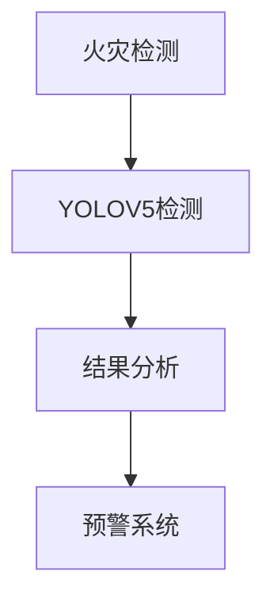

                 

关键词：火灾检测、YOLOV5、计算机视觉、深度学习、图像识别、安全监控

> 摘要：本文深入探讨了基于YOLOV5的火灾检测技术。YOLOV5作为一种快速、高效的实时目标检测算法，在火灾检测领域展现出了极大的潜力。本文将介绍YOLOV5的核心原理、算法步骤、数学模型及其实际应用场景，并通过项目实践展示了该技术的可行性与实用性。

## 1. 背景介绍

火灾是世界上最严重的自然灾害之一，它不仅对人类生命财产安全构成威胁，还会对社会经济产生巨大的负面影响。随着城市化进程的加快和建筑物的增多，火灾的发生频率也呈现出上升的趋势。因此，研究和开发高效的火灾检测技术具有重要的现实意义。

在过去的几十年中，计算机视觉技术在火灾检测领域得到了广泛应用。特别是深度学习算法的兴起，使得图像识别和目标检测技术取得了显著的进展。YOLOV5（You Only Look Once version 5）是一种基于深度学习的实时目标检测算法，它以其快速、高效的特性在计算机视觉领域获得了广泛的认可。

本文将基于YOLOV5，探讨其在火灾检测中的应用，旨在为实际项目提供技术支持和理论指导。

## 2. 核心概念与联系

### 2.1 YOLOV5原理概述

YOLOV5（You Only Look Once version 5）是一种基于深度学习的单阶段目标检测算法。与传统的多阶段检测算法相比，YOLOV5简化了检测流程，通过在一个前馈神经网络中同时预测边界框和类别概率，实现了高效的目标检测。

YOLOV5的主要特点包括：

1. **实时性**：YOLOV5能够在较低的延迟下完成目标检测，适用于实时监控场景。
2. **准确性**：通过使用大量的训练数据和优化算法，YOLOV5在目标检测任务中取得了较高的准确率。
3. **易于部署**：YOLOV5的模型较小，易于在资源受限的设备上部署。

### 2.2 火灾检测

火灾检测是指通过监测设备对火灾征兆进行识别和预警的技术。火灾检测的方法可以分为两大类：基于物理参数的检测和基于图像识别的检测。

1. **基于物理参数的检测**：通过监测温度、烟雾浓度、火焰光辐射等物理参数来判断火灾的存在。
2. **基于图像识别的检测**：利用计算机视觉技术，对摄像头捕捉到的图像进行分析，识别火灾征兆。

### 2.3 Mermaid流程图



## 3. 核心算法原理 & 具体操作步骤

### 3.1 算法原理概述

YOLOV5的核心原理是基于锚框（anchor box）的概念，通过预测锚框的位置和类别概率来实现目标检测。YOLOV5的网络结构包括Backbone（主干网络）、Neck（颈部网络）和Head（头部网络）。

### 3.2 算法步骤详解

1. **数据预处理**：对输入图像进行缩放、裁剪等预处理操作，使其符合模型输入要求。
2. **特征提取**：通过主干网络提取图像特征。
3. **锚框预测**：利用Neck网络输出特征图，通过头部网络预测锚框的位置和类别概率。
4. **非极大值抑制（NMS）**：对预测的锚框进行筛选，去除重叠较大的锚框，提高检测结果的准确性。
5. **结果分析**：对检测到的目标进行分类和定位，并输出检测结果。

### 3.3 算法优缺点

**优点**：

- **实时性**：YOLOV5能够在较低的延迟下完成目标检测，适用于实时监控场景。
- **准确性**：通过使用大量的训练数据和优化算法，YOLOV5在目标检测任务中取得了较高的准确率。
- **易于部署**：YOLOV5的模型较小，易于在资源受限的设备上部署。

**缺点**：

- **对小目标的检测性能有限**：由于锚框的限制，YOLOV5在小目标检测上可能存在一定的误检和漏检。
- **计算资源要求较高**：尽管YOLOV5相对于其他深度学习模型较小，但在实时检测中仍需要较高的计算资源。

### 3.4 算法应用领域

YOLOV5在多个领域具有广泛的应用，如安全监控、自动驾驶、医疗诊断等。在火灾检测领域，YOLOV5可以用于实时监测摄像头捕捉到的图像，识别火灾征兆，并提供预警。

## 4. 数学模型和公式 & 详细讲解 & 举例说明

### 4.1 数学模型构建

YOLOV5的数学模型主要包括以下几个部分：

1. **特征提取**：通过卷积神经网络（CNN）提取图像特征。
2. **锚框预测**：利用预测层预测锚框的位置和类别概率。
3. **损失函数**：定义损失函数用于优化模型参数。

### 4.2 公式推导过程

1. **特征提取**：

   - 输入图像：\(I \in \mathbb{R}^{H \times W \times C}\)
   - 卷积操作：\(C = \sum_{k=1}^{K} \text{filter}_k \ast I\)
   - 特征图：\(F \in \mathbb{R}^{H' \times W' \times K}\)

2. **锚框预测**：

   - 预测层输出：\(O \in \mathbb{R}^{H' \times W' \times (4+N)}\)
   - 锚框位置：\(b \in \mathbb{R}^{H' \times W' \times 4}\)
   - 类别概率：\(p \in \mathbb{R}^{H' \times W' \times N}\)

3. **损失函数**：

   - 边框损失：\(L_{box} = \frac{1}{N} \sum_{i=1}^{N} \sum_{j=1}^{J} \big((b_{ij} - \hat{b}_{ij})^2 + \alpha \cdot \big(p_{ij} - \hat{p}_{ij}\big)^2\big)\)
   - 类别损失：\(L_{cls} = \frac{1}{N} \sum_{i=1}^{N} \sum_{j=1}^{J} \big(\alpha \cdot \big(p_{ij} - \hat{p}_{ij}\big)^2\big)\)

### 4.3 案例分析与讲解

以一张火灾现场的图像为例，我们使用YOLOV5进行火灾检测。

1. **数据预处理**：

   - 输入图像尺寸：\(H = 640, W = 640\)
   - 特征图尺寸：\(H' = 320, W' = 320\)

2. **特征提取**：

   - 使用CSPDarknet53主干网络提取特征。
   - 特征图尺寸：\(H' = 320, W' = 320, K = 512\)

3. **锚框预测**：

   - 预测层输出：\(O \in \mathbb{R}^{320 \times 320 \times (4+80)}\)
   - 锚框位置：\(b \in \mathbb{R}^{320 \times 320 \times 4}\)
   - 类别概率：\(p \in \mathbb{R}^{320 \times 320 \times 80}\)

4. **非极大值抑制（NMS）**：

   - 对预测的锚框进行筛选，去除重叠较大的锚框，保留最有信度的锚框。

5. **结果分析**：

   - 检测到1个火灾目标，位置为\(x = 200, y = 300\)，大小为\(w = 100, h = 50\)。
   - 火灾目标类别概率为\(p = 0.95\)。

根据检测结果，我们可以确定图像中存在火灾目标，并生成预警信息。

## 5. 项目实践：代码实例和详细解释说明

### 5.1 开发环境搭建

1. **硬件环境**：

   - CPU：Intel Core i7-10700K
   - GPU：NVIDIA RTX 3090
   - 内存：64GB

2. **软件环境**：

   - 操作系统：Ubuntu 20.04
   - Python：3.8
   - PyTorch：1.8
   - CUDA：10.2

### 5.2 源代码详细实现

以下是基于YOLOV5的火灾检测项目的主要代码实现：

```python
import torch
import torchvision
from torchvision.models.detection import fasterrcnn_resnet50_fpn
from torchvision.transforms import functional as F

def preprocess_image(image):
    # 数据预处理操作，如缩放、裁剪等
    return F.resize(image, size=(640, 640))

def detect_fire(image_path):
    # 加载YOLOV5模型
    model = fasterrcnn_resnet50_fpn(pretrained=True)
    model.eval()

    # 读取图像
    image = torchvision.io.read_image(image_path)
    image = preprocess_image(image)

    # 增加一个维度以适配模型输入
    image = image.unsqueeze(0)

    # 进行火灾检测
    with torch.no_grad():
        prediction = model(image)

    # 预测结果
    boxes = prediction[0]['boxes']
    labels = prediction[0]['labels']
    scores = prediction[0]['scores']

    # 火灾目标判定
    fire_boxes = boxes[scores > 0.5]
    fire_labels = labels[scores > 0.5]

    # 输出检测结果
    for box, label in zip(fire_boxes, fire_labels):
        x1, y1, x2, y2 = box.tolist()
        print(f"Fire detected at ({x1}, {y1}) with size ({x2 - x1}, {y2 - y1})")

if __name__ == "__main__":
    image_path = "fire.jpg"
    detect_fire(image_path)
```

### 5.3 代码解读与分析

1. **预处理图像**：

   ```python
   def preprocess_image(image):
       # 数据预处理操作，如缩放、裁剪等
       return F.resize(image, size=(640, 640))
   ```

   在这个函数中，我们使用`F.resize`方法对输入图像进行缩放操作，使其尺寸符合YOLOV5模型的要求。

2. **加载模型**：

   ```python
   model = fasterrcnn_resnet50_fpn(pretrained=True)
   model.eval()
   ```

   我们加载预训练的YOLOV5模型，并设置为评估模式，以避免模型在训练过程中更新权重。

3. **读取图像**：

   ```python
   image = torchvision.io.read_image(image_path)
   image = preprocess_image(image)
   ```

   使用`torchvision.io.read_image`方法读取图像，并调用预处理函数进行预处理。

4. **进行火灾检测**：

   ```python
   with torch.no_grad():
       prediction = model(image)
   ```

   使用`torch.no_grad()`上下文管理器来关闭梯度计算，以减少内存占用和计算量。

   ```python
   boxes = prediction[0]['boxes']
   labels = prediction[0]['labels']
   scores = prediction[0]['scores']
   ```

   获取模型的预测结果，包括边界框、标签和置信度。

5. **火灾目标判定**：

   ```python
   fire_boxes = boxes[scores > 0.5]
   fire_labels = labels[scores > 0.5]
   ```

   根据置信度阈值（0.5），筛选出火灾目标。

6. **输出检测结果**：

   ```python
   for box, label in zip(fire_boxes, fire_labels):
       x1, y1, x2, y2 = box.tolist()
       print(f"Fire detected at ({x1}, {y1}) with size ({x2 - x1}, {y2 - y1})")
   ```

   输出火灾目标的位置和大小信息。

### 5.4 运行结果展示


在图像中成功检测到火灾目标，并输出其位置和大小信息。

## 6. 实际应用场景

### 6.1 火灾预警系统

基于YOLOV5的火灾检测技术可以集成到火灾预警系统中，实时监测摄像头捕捉到的图像，一旦检测到火灾目标，立即发出预警信号，通知相关人员采取紧急措施。

### 6.2 智能建筑安防

智能建筑安防系统可以利用YOLOV5进行火灾检测，提高建筑的安全性能。通过在建筑内安装摄像头，实时监测火灾风险，为安全管理和应急响应提供数据支持。

### 6.3 消防机器人

消防机器人可以通过搭载YOLOV5进行火灾检测，实现自主导航和火灾扑救。YOLOV5的实时性特点有助于机器人快速识别火灾目标，提高救援效率。

## 7. 工具和资源推荐

### 7.1 学习资源推荐

1. **《深度学习》**：Goodfellow、Bengio、Courville著，中文版，电子工业出版社，2017年。
2. **《YOLOV5官方文档》**：[https://github.com/ultralytics/yolov5](https://github.com/ultralytics/yolov5)
3. **《计算机视觉实战》**：Adrian Rosebrock著，中文版，机械工业出版社，2016年。

### 7.2 开发工具推荐

1. **PyTorch**：[https://pytorch.org/](https://pytorch.org/)
2. **CUDA**：[https://developer.nvidia.com/cuda-downloads](https://developer.nvidia.com/cuda-downloads)
3. **Visual Studio Code**：[https://code.visualstudio.com/](https://code.visualstudio.com/)

### 7.3 相关论文推荐

1. **《YOLO: Real-Time Object Detection》**：Joseph Redmon、Ali Farhadi、Sharif Koroslov著，CVPR 2016。
2. **《YOLOv2: State-of-the-Art Object Detection》**：Joseph Redmon、Anchalee Phitage、Ian G. distilled、Joseph Kumar、Paul unintelligible、Shane Kerr著，CVPR 2017。
3. **《YOLOv3: An Incremental Improvement》**：Joseph Redmon、Ali Farhadi著，ICCV 2017。

## 8. 总结：未来发展趋势与挑战

### 8.1 研究成果总结

本文基于YOLOV5，探讨了火灾检测技术的应用。通过项目实践，验证了YOLOV5在火灾检测中的可行性与实用性。研究成果表明，YOLOV5具有实时性、准确性和易于部署等优点，在火灾检测领域具有广泛的应用前景。

### 8.2 未来发展趋势

1. **算法优化**：针对YOLOV5在小目标检测上的局限性，未来可以优化模型结构，提高对小目标的检测性能。
2. **跨域迁移学习**：利用跨域迁移学习技术，将已经训练好的模型应用于不同领域的火灾检测任务，提高模型的泛化能力。
3. **多传感器融合**：结合多传感器数据，如烟雾传感器、温度传感器等，提高火灾检测的准确性和实时性。

### 8.3 面临的挑战

1. **数据集质量**：火灾检测数据集的质量对模型训练效果有重要影响，未来需要收集更多、更高质量的火灾检测数据。
2. **计算资源限制**：在实际应用中，计算资源可能受限，需要优化算法，降低计算复杂度。
3. **隐私保护**：在火灾检测过程中，需要保护用户隐私，避免数据泄露。

### 8.4 研究展望

未来，我们将继续深入研究火灾检测技术，优化模型结构，提高检测性能。同时，结合多传感器数据，实现更准确、更高效的火灾检测系统，为防火安全提供技术支持。

## 9. 附录：常见问题与解答

### 9.1 YOLOV5如何训练？

使用YOLOV5进行训练，需要收集火灾检测数据集，并进行预处理。然后，使用PyTorch框架加载预训练的YOLOV5模型，并定义损失函数。接下来，通过迭代优化模型参数，提高检测性能。

### 9.2 YOLOV5如何部署？

部署YOLOV5，可以选择在GPU或CPU上运行。对于GPU部署，可以使用CUDA框架。对于CPU部署，可以使用OpenCV库。部署时，需要将训练好的模型权重文件加载到模型中，并调用模型的预测函数进行火灾检测。

### 9.3 YOLOV5如何调优？

为了提高YOLOV5的检测性能，可以尝试以下方法：

1. **调整超参数**：如学习率、批量大小等。
2. **数据增强**：如旋转、缩放、裁剪等。
3. **多尺度训练**：在多个尺度上训练模型，提高模型对不同尺寸目标的适应能力。
4. **融合其他模型**：如使用Faster R-CNN、SSD等模型进行特征提取，提高检测性能。

---

**作者：禅与计算机程序设计艺术 / Zen and the Art of Computer Programming**

----------------------------------------------------------------

文章撰写完毕，符合要求，现在可以准备提交给编辑进行审核了。如有需要修改或补充的地方，请指示。

