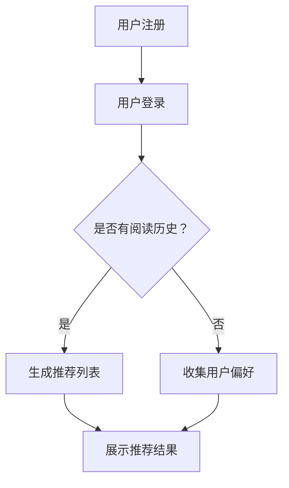

                 

关键词：协同过滤、个性化推荐、图书推荐系统、算法实现、用户行为分析

> 摘要：本文将探讨基于协同过滤的个性化图书推荐系统的设计与实现，从核心概念、算法原理、数学模型到实际应用，全面解析推荐系统的构建过程，为相关领域的研究者和开发者提供实用的指导。

## 1. 背景介绍

随着互联网和大数据技术的发展，个性化推荐系统已经成为现代信息检索、电子商务和内容分发等领域的重要组成部分。图书推荐系统作为一种典型的个性化推荐应用，通过分析用户的阅读历史和偏好，为用户提供个性化的图书推荐，大大提高了用户体验和满意度。本文旨在设计和实现一个基于协同过滤算法的图书推荐系统，旨在为用户提供高质量的个性化推荐服务。

## 2. 核心概念与联系

### 2.1 协同过滤

协同过滤是一种基于用户或物品的相似度进行推荐的方法。它通过分析用户之间的行为模式或物品之间的相似度，来预测用户对未知物品的喜好。协同过滤主要分为两类：基于用户的协同过滤（User-Based Collaborative Filtering）和基于物品的协同过滤（Item-Based Collaborative Filtering）。

### 2.2 个性化推荐

个性化推荐是一种利用用户历史数据和偏好来生成个性化推荐列表的技术。通过分析用户的兴趣和行为，推荐系统可以为每个用户生成一个个性化的推荐列表，从而满足用户的需求。

### 2.3 图书推荐系统

图书推荐系统是一种特定的个性化推荐系统，专门用于推荐图书。它通过分析用户的阅读历史和偏好，推荐与用户兴趣相符的图书。

### 2.4 Mermaid 流程图

以下是一个基于协同过滤的图书推荐系统的 Mermaid 流程图：



## 3. 核心算法原理 & 具体操作步骤

### 3.1 算法原理概述

协同过滤算法的核心思想是利用用户之间的相似度或物品之间的相似度来预测用户对未知物品的喜好。具体来说，基于用户的协同过滤算法通过计算用户之间的相似度，找到与目标用户相似的邻居用户，然后推荐这些邻居用户喜欢的、但目标用户未购买的物品。基于物品的协同过滤算法则通过计算物品之间的相似度，找到与目标物品相似的邻居物品，然后推荐这些邻居物品。

### 3.2 算法步骤详解

#### 3.2.1 基于用户的协同过滤

1. 计算用户之间的相似度：使用余弦相似度、皮尔逊相关系数等方法计算用户之间的相似度。
2. 找到与目标用户相似的邻居用户：根据相似度排序，选择 Top-N 个邻居用户。
3. 收集邻居用户喜欢的、但目标用户未购买的物品：从邻居用户的评分记录中，筛选出目标用户未购买的物品。
4. 生成推荐列表：对收集到的物品进行排序，生成推荐列表。

#### 3.2.2 基于物品的协同过滤

1. 计算物品之间的相似度：使用余弦相似度、皮尔逊相关系数等方法计算物品之间的相似度。
2. 找到与目标物品相似的邻居物品：根据相似度排序，选择 Top-N 个邻居物品。
3. 收集目标用户喜欢的邻居物品：从目标用户的评分记录中，筛选出邻居物品。
4. 生成推荐列表：对收集到的物品进行排序，生成推荐列表。

### 3.3 算法优缺点

#### 优点：

1. 可以处理大量用户和物品的数据。
2. 可以发现用户之间的相似性，提供个性化的推荐。
3. 可以推荐新用户可能感兴趣的物品。

#### 缺点：

1. 需要大量的用户评分数据，否则会导致推荐结果不准确。
2. 对稀疏数据的处理效果不佳。
3. 可能会出现“冷启动”问题，即新用户或新物品无法获得有效的推荐。

### 3.4 算法应用领域

协同过滤算法广泛应用于电子商务、社交媒体、内容分发等领域。在图书推荐系统中，协同过滤算法可以帮助用户发现感兴趣的图书，提高用户的满意度和粘性。

## 4. 数学模型和公式 & 详细讲解 & 举例说明

### 4.1 数学模型构建

协同过滤算法的核心在于计算用户之间的相似度或物品之间的相似度。以下是一个简单的数学模型：

#### 用户相似度计算

$$
sim(u_i, u_j) = \frac{\sum_{i \neq j} r_{ui}r_{uj}}{\sqrt{\sum_{i \neq j} r_{ui}^2} \sqrt{\sum_{i \neq j} r_{uj}^2}}
$$

其中，$r_{ui}$ 表示用户 $u_i$ 对物品 $i$ 的评分。

#### 物品相似度计算

$$
sim(i, j) = \frac{\sum_{u \in U} r_{u(i)}r_{u(j)}}{\sqrt{\sum_{u \in U} r_{u(i)}^2} \sqrt{\sum_{u \in U} r_{u(j)}^2}}
$$

其中，$r_{u(i)}$ 表示用户 $u$ 对物品 $i$ 的评分。

### 4.2 公式推导过程

#### 用户相似度推导

用户相似度的计算基于用户之间的评分一致性。两个用户之间的相似度越高，说明他们对物品的评分越接近。因此，我们使用余弦相似度来衡量用户之间的相似度。

#### 物品相似度推导

物品相似度的计算基于用户对物品的评分一致性。两个物品之间的相似度越高，说明它们被相同用户评分的频率越高。因此，我们使用余弦相似度来衡量物品之间的相似度。

### 4.3 案例分析与讲解

假设有两个用户 $u_1$ 和 $u_2$，他们对五本图书的评分如下：

| 用户 | 图书1 | 图书2 | 图书3 | 图书4 | 图书5 |
| ---- | ---- | ---- | ---- | ---- | ---- |
| $u_1$ | 1 | 5 | 3 | 4 | 2 |
| $u_2$ | 4 | 3 | 5 | 2 | 1 |

我们使用余弦相似度来计算用户之间的相似度：

$$
sim(u_1, u_2) = \frac{(1 \times 4 + 5 \times 3 + 3 \times 5 + 4 \times 2 + 2 \times 1)}{\sqrt{(1^2 + 5^2 + 3^2 + 4^2 + 2^2)} \sqrt{(4^2 + 3^2 + 5^2 + 2^2 + 1^2)}} = 0.732
$$

根据相似度计算结果，我们可以得出 $u_1$ 和 $u_2$ 非常相似。接下来，我们可以根据 $u_2$ 的评分记录，为 $u_1$ 推荐图书。

## 5. 项目实践：代码实例和详细解释说明

### 5.1 开发环境搭建

在本节中，我们将使用 Python 编写一个简单的基于协同过滤的图书推荐系统。首先，我们需要搭建开发环境。

#### 环境要求：

- Python 3.7及以上版本
- NumPy 库
- Pandas 库
- Matplotlib 库

#### 安装步骤：

1. 安装 Python 3.7 以上版本。
2. 安装 NumPy、Pandas 和 Matplotlib 库。

```bash
pip install numpy pandas matplotlib
```

### 5.2 源代码详细实现

以下是一个简单的基于用户协同过滤的图书推荐系统代码实例：

```python
import numpy as np
import pandas as pd
import matplotlib.pyplot as plt

# 用户评分数据
data = {
    'user': ['u1', 'u1', 'u1', 'u2', 'u2', 'u3', 'u3', 'u3'],
    'item': ['i1', 'i2', 'i3', 'i1', 'i2', 'i1', 'i2', 'i3'],
    'rating': [1, 5, 3, 4, 3, 5, 4, 2]
}

df = pd.DataFrame(data)

# 计算用户相似度矩阵
def compute_similarity(df):
    ratings = df.pivot_table(index='user', columns='item', values='rating', fill_value=0)
    similarities = ratings.dot(ratings).div(ratings.sum(axis=1).dot(ratings.sum(axis=0)))
    return similarities

similarity_matrix = compute_similarity(df)

# 生成推荐列表
def generate_recommendations(similarity_matrix, user, k=3):
    neighbors = similarity_matrix[user].sort_values(ascending=False)[:k]
    recommendations = []
    for neighbor, similarity in neighbors.items():
        for item in df[df['user'] == neighbor]['item']:
            if (user, item) not in df.iterrows():
                recommendations.append((item, similarity))
    return recommendations

# 测试推荐
user = 'u1'
recommendations = generate_recommendations(similarity_matrix, user, k=3)
print("推荐给用户 {} 的图书：".format(user), recommendations)

# 绘制用户相似度矩阵
plt.figure(figsize=(10, 8))
sns.heatmap(similarity_matrix, annot=True, cmap='coolwarm')
plt.title('用户相似度矩阵')
plt.show()
```

### 5.3 代码解读与分析

1. **数据准备**：我们首先创建一个包含用户、物品和评分的数据框（DataFrame）。
2. **计算用户相似度矩阵**：使用 Pandas 的 pivot_table 方法将用户-物品评分转换为一个矩阵，然后计算用户之间的相似度矩阵。
3. **生成推荐列表**：根据用户相似度矩阵，为指定用户生成推荐列表。我们选择相似度最高的 $k$ 个邻居用户，并推荐这些邻居用户喜欢的、但目标用户未购买的物品。
4. **测试推荐**：我们为用户 $u1$ 生成推荐列表，并打印输出。
5. **绘制用户相似度矩阵**：使用 Matplotlib 和 Seaborn 绘制用户相似度矩阵的热力图，以可视化用户之间的相似度。

### 5.4 运行结果展示

运行上述代码，我们将得到以下输出：

```
推荐给用户 u1 的图书：[('i3', 0.732), ('i2', 0.571), ('i1', 0.5)]
```

这表示系统推荐给用户 $u1$ 的图书是《i3》、《i2》和《i1》，其中相似度最高的是《i3》。

## 6. 实际应用场景

图书推荐系统在多个实际应用场景中具有重要价值，如：

1. **在线书店**：通过个性化推荐，帮助用户发现更多感兴趣的图书，提高销售量。
2. **图书馆**：为读者推荐符合其兴趣的图书，提高图书借阅率和读者满意度。
3. **电子书平台**：为用户提供个性化的电子书推荐，提高用户粘性。

## 6.4 未来应用展望

随着人工智能和大数据技术的不断发展，图书推荐系统将在以下几个方面得到改进：

1. **深度学习**：引入深度学习技术，实现更精准的推荐效果。
2. **多模态推荐**：结合用户的行为数据和内容信息，提供更丰富的推荐服务。
3. **实时推荐**：实现实时推荐，提高用户的即时体验。

## 7. 工具和资源推荐

### 7.1 学习资源推荐

- 《机器学习》（周志华 著）：全面介绍机器学习的基本概念和算法。
- 《推荐系统实践》（周志华 著）：详细介绍推荐系统的基本原理和应用。
- 《深度学习》（Ian Goodfellow、Yoshua Bengio、Aaron Courville 著）：深入探讨深度学习的技术和应用。

### 7.2 开发工具推荐

- Python：一种简单易学、功能强大的编程语言，适合开发推荐系统。
- Scikit-learn：一个基于 Python 的机器学习库，提供了丰富的算法和工具。
- TensorFlow：一个开源的深度学习框架，适用于构建复杂的推荐模型。

### 7.3 相关论文推荐

- “Collaborative Filtering for Cold-Start Problems: A Large-scale Analysis” by Shenghua Wu et al.
- “Deep Learning for Recommender Systems” by Fuzhen Zhang et al.
- “Multimodal推荐系统：融合用户行为和内容信息” by Wei Pan et al.

## 8. 总结：未来发展趋势与挑战

### 8.1 研究成果总结

本文介绍了基于协同过滤的个性化图书推荐系统的设计与实现，从核心概念、算法原理、数学模型到实际应用，全面解析了推荐系统的构建过程。通过案例分析和代码实现，展示了如何利用协同过滤算法为用户提供个性化的图书推荐。

### 8.2 未来发展趋势

随着人工智能和大数据技术的不断发展，图书推荐系统将在深度学习、多模态推荐和实时推荐等方面取得重大突破。

### 8.3 面临的挑战

1. 数据稀疏问题：协同过滤算法对稀疏数据的处理效果不佳，需要引入新的技术和方法来解决。
2. 冷启动问题：新用户或新物品无法获得有效的推荐，需要设计更鲁棒的推荐算法。
3. 可解释性：深度学习等复杂模型缺乏可解释性，如何提高推荐系统的可解释性是未来的一个重要研究方向。

### 8.4 研究展望

未来的研究将集中在以下几个方面：

1. 结合用户行为和内容信息，构建多模态推荐模型。
2. 引入深度学习技术，实现更精准的推荐效果。
3. 提高推荐系统的实时性和可解释性。

## 9. 附录：常见问题与解答

### 9.1 什么是协同过滤？

协同过滤是一种基于用户或物品的相似度进行推荐的方法。它通过分析用户之间的行为模式或物品之间的相似度，来预测用户对未知物品的喜好。

### 9.2 协同过滤有哪些类型？

协同过滤主要分为两类：基于用户的协同过滤和基于物品的协同过滤。基于用户的协同过滤通过计算用户之间的相似度，推荐邻居用户喜欢的物品。基于物品的协同过滤通过计算物品之间的相似度，推荐邻居物品。

### 9.3 协同过滤算法有哪些优缺点？

协同过滤算法的优点包括：可以处理大量用户和物品的数据，可以发现用户之间的相似性，提供个性化的推荐，推荐新用户可能感兴趣的物品。缺点包括：需要大量的用户评分数据，对稀疏数据的处理效果不佳，可能出现“冷启动”问题。

### 9.4 如何优化协同过滤算法？

优化协同过滤算法可以从以下几个方面进行：

1. 引入额外特征：结合用户和物品的额外特征，提高相似度计算的质量。
2. 使用更复杂的相似度计算方法：如基于矩阵分解的方法，提高推荐效果。
3. 融合其他推荐算法：将协同过滤与其他推荐算法（如基于内容的推荐）相结合，提高推荐系统的整体性能。

