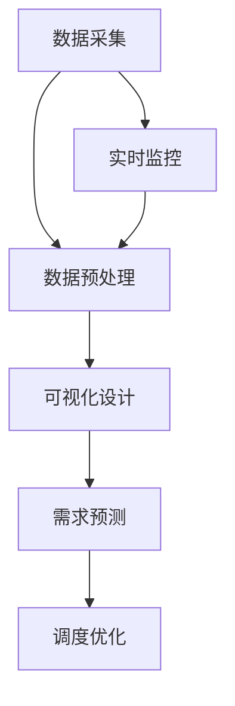

                 

关键词：地图数据、出租车轨迹、可视化、需求预测、人工智能

摘要：本文将探讨如何利用地图数据，通过对新加坡出租车接送乘客轨迹的可视化和需求预测，为城市交通管理和智能出行服务提供科学依据。本文首先介绍了研究背景，然后详细阐述了核心概念和算法原理，接着展示了数学模型和公式，并提供了项目实践实例。最后，本文对实际应用场景进行了分析，并展望了未来发展趋势与挑战。

## 1. 背景介绍

### 新加坡出租车行业的现状

新加坡作为东南亚的金融中心和科技创新枢纽，其出租车行业具有独特的市场地位。根据新加坡陆路交通管理局（LTA）的数据显示，截至2020年底，新加坡共有约6000辆出租车，平均每天服务超过15万次乘客。随着智能手机的普及和移动互联网技术的发展，乘客通过出租车软件预约服务的比例逐年增加。

然而，新加坡的出租车行业也面临着诸多挑战。首先是供需不平衡的问题，特别是在高峰时段，出租车供不应求，导致乘客等待时间过长。其次，传统出租车调度系统依赖于人工干预，无法实时调整出租车分布，导致资源利用效率低下。此外，出租车行业的数据收集和分析能力有限，无法为交通管理和出行服务提供科学依据。

### 地图数据的重要性

地图数据是构建出租车接送乘客轨迹可视化及需求预测系统的基础。通过整合高精度的地图数据，可以实现对出租车运行轨迹的实时监控，为需求预测提供关键信息。新加坡的地图数据具有以下几个特点：

1. **高精度**：新加坡的地图数据覆盖了城市各个角落，包括道路、建筑物、公共交通站点等，精度达到厘米级。
2. **实时更新**：地图数据会定期更新，确保反映最新的交通状况和道路结构。
3. **多维度信息**：除了地理信息，地图数据还包括交通流量、道路状况、停车设施等，为需求预测提供更全面的参考。

### 研究目的

本文旨在利用地图数据，结合人工智能技术，构建新加坡出租车接送乘客轨迹的可视化和需求预测系统。具体目标包括：

1. **可视化**：通过构建出租车运行轨迹的可视化界面，帮助交通管理者、出租车公司和乘客了解出租车的运行状态和分布情况。
2. **需求预测**：基于历史数据和实时监控信息，预测未来一定时间内的出租车需求，为出租车调度和资源分配提供依据。
3. **优化调度**：利用预测结果，优化出租车的调度策略，提高资源利用效率，减少乘客等待时间。

## 2. 核心概念与联系

### 核心概念

#### 出租车接送乘客轨迹可视化

出租车接送乘客轨迹可视化是指利用地图数据，将出租车的运行轨迹以图形化的方式展示在用户面前。这一过程包括数据采集、数据预处理、可视化设计等步骤。

#### 需求预测

需求预测是指通过分析历史数据和实时信息，预测未来一段时间内的出租车需求量。这一过程涉及时间序列分析、机器学习算法等。

### 架构

为了实现出租车接送乘客轨迹可视化和需求预测，需要构建一个综合性的系统架构。以下是该架构的主要组成部分：

1. **数据采集模块**：负责收集出租车运行轨迹和实时交通信息。
2. **数据预处理模块**：对采集到的数据进行清洗、转换和集成，为后续分析提供准确的数据。
3. **可视化模块**：将处理后的数据通过图形化界面展示给用户。
4. **需求预测模块**：利用机器学习算法对出租车需求进行预测。
5. **调度优化模块**：根据需求预测结果，调整出租车的调度策略。

### Mermaid 流程图

下面是出租车接送乘客轨迹可视化及需求预测系统的 Mermaid 流程图：



## 3. 核心算法原理 & 具体操作步骤

### 3.1 算法原理概述

#### 可视化算法

出租车接送乘客轨迹可视化算法主要基于地理信息系统（GIS）技术。通过采集出租车运行轨迹数据，利用 GIS 软件将其可视化。该算法的主要步骤包括：

1. **数据采集**：从出租车公司或地图服务提供商获取出租车运行轨迹数据。
2. **数据预处理**：清洗和转换数据，确保数据的准确性和一致性。
3. **轨迹绘制**：利用 GIS 软件绘制出租车的运行轨迹。

#### 需求预测算法

需求预测算法主要基于时间序列分析和机器学习技术。通过分析历史数据和实时信息，预测未来一定时间内的出租车需求量。具体步骤如下：

1. **数据收集**：收集历史出租车需求数据，包括时间、地点、需求量等。
2. **特征工程**：对数据进行预处理和特征提取，为机器学习算法提供输入。
3. **模型训练**：选择合适的机器学习算法，对数据进行训练。
4. **模型评估**：评估模型预测的准确性，调整模型参数。

### 3.2 算法步骤详解

#### 可视化算法步骤

1. **数据采集**：从出租车公司或地图服务提供商获取出租车运行轨迹数据，包括时间、地点、速度等信息。
2. **数据预处理**：清洗和转换数据，包括去除异常值、缺失值填充、时间格式转换等。
3. **轨迹绘制**：利用 GIS 软件将预处理后的数据可视化。具体操作步骤如下：

    a. 打开 GIS 软件，创建一个新的地图项目。

    b. 导入出租车运行轨迹数据。

    c. 设置轨迹颜色、宽度等样式。

    d. 将轨迹以动画形式展示，模拟出租车的运行过程。

#### 需求预测算法步骤

1. **数据收集**：收集历史出租车需求数据，包括时间、地点、需求量等。
2. **特征工程**：对数据进行预处理和特征提取，包括时间序列特征（如小时、星期、季节等）、地点特征（如人口密度、商业活动等）等。
3. **模型选择**：选择合适的机器学习算法，如 ARIMA、LSTM、GRU 等。
4. **模型训练**：利用历史数据对模型进行训练，调整模型参数。
5. **模型评估**：利用验证集评估模型预测的准确性，包括均方误差（MSE）、平均绝对误差（MAE）等指标。
6. **模型应用**：将训练好的模型应用于实时数据，预测未来一定时间内的出租车需求。

### 3.3 算法优缺点

#### 可视化算法

**优点**：

1. 直观展示：通过可视化界面，用户可以直观地了解出租车的运行状态和分布情况。
2. 实时更新：利用 GIS 技术可以实现实时数据更新，反映最新的交通状况。

**缺点**：

1. 数据量大：出租车运行轨迹数据量庞大，对数据处理和存储能力要求较高。
2. 可扩展性差：可视化算法主要依赖于 GIS 软件功能，难以与其他系统集成。

#### 需求预测算法

**优点**：

1. 提高资源利用效率：通过预测未来需求，可以优化出租车的调度策略，提高资源利用效率。
2. 减少乘客等待时间：预测未来需求，可以提前安排出租车，减少乘客等待时间。

**缺点**：

1. 数据质量要求高：需求预测依赖于历史数据和实时信息，数据质量对预测结果影响较大。
2. 模型选择和参数调整复杂：选择合适的机器学习算法和调整参数需要一定的专业知识和经验。

### 3.4 算法应用领域

#### 可视化算法

1. **城市交通管理**：利用可视化算法，交通管理者可以实时监控出租车的运行状态，优化交通调度。
2. **智能出行服务**：通过可视化界面，乘客可以了解出租车的运行轨迹和实时位置，选择合适的出行方式。

#### 需求预测算法

1. **出租车调度**：通过预测未来需求，优化出租车的调度策略，提高服务质量和效率。
2. **公共交通规划**：利用需求预测结果，规划公共交通线路和班次，提高公共交通的运营效率。

## 4. 数学模型和公式 & 详细讲解 & 举例说明

### 4.1 数学模型构建

#### 可视化模型

出租车接送乘客轨迹可视化模型的构建主要基于 GIS 技术和地图数据。具体模型如下：

$$
X(t) = f(T, G, D)
$$

其中，$X(t)$ 表示出租车在时间 $t$ 的位置，$T$ 表示时间，$G$ 表示地图数据，$D$ 表示出租车运行轨迹数据。

#### 需求预测模型

出租车需求预测模型主要基于时间序列分析和机器学习技术。具体模型如下：

$$
Y(t) = \sum_{i=1}^{n} w_i \cdot X_i(t)
$$

其中，$Y(t)$ 表示时间 $t$ 的出租车需求量，$X_i(t)$ 表示时间 $t$ 的特征向量，$w_i$ 表示权重系数。

### 4.2 公式推导过程

#### 可视化模型推导

出租车接送乘客轨迹可视化模型的推导主要基于 GIS 技术和地图数据。首先，我们定义以下变量：

- $T$：时间
- $G$：地图数据
- $D$：出租车运行轨迹数据

根据 GIS 技术的基本原理，出租车在时间 $t$ 的位置 $X(t)$ 可以表示为：

$$
X(t) = f(T, G, D)
$$

其中，$f(T, G, D)$ 表示出租车位置的计算函数。

#### 需求预测模型推导

出租车需求预测模型的推导主要基于时间序列分析和机器学习技术。首先，我们定义以下变量：

- $Y(t)$：时间 $t$ 的出租车需求量
- $X_i(t)$：时间 $t$ 的特征向量
- $w_i$：权重系数

根据时间序列分析的基本原理，我们可以得到以下预测公式：

$$
Y(t) = \sum_{i=1}^{n} w_i \cdot X_i(t)
$$

其中，$X_i(t)$ 表示时间 $t$ 的特征向量，$w_i$ 表示权重系数。

### 4.3 案例分析与讲解

#### 案例一：出租车接送乘客轨迹可视化

假设我们有一段时间内的出租车运行轨迹数据，包括时间、地点、速度等信息。利用 GIS 软件进行可视化处理，可以得到以下结果：

1. **数据采集**：从出租车公司获取运行轨迹数据。

2. **数据预处理**：清洗和转换数据，去除异常值、缺失值等。

3. **轨迹绘制**：利用 GIS 软件将预处理后的数据绘制成轨迹图。

4. **结果展示**：通过轨迹图，可以直观地了解出租车的运行状态和分布情况。

#### 案例二：出租车需求预测

假设我们有一段时间内的出租车需求数据，包括时间、地点、需求量等信息。利用机器学习算法进行需求预测，可以得到以下结果：

1. **数据收集**：收集历史需求数据。

2. **特征工程**：对数据进行预处理和特征提取，包括时间序列特征、地点特征等。

3. **模型选择**：选择合适的机器学习算法，如 ARIMA、LSTM 等。

4. **模型训练**：利用历史数据对模型进行训练。

5. **模型评估**：利用验证集评估模型预测的准确性。

6. **结果展示**：通过预测结果，可以了解未来一定时间内的出租车需求情况。

## 5. 项目实践：代码实例和详细解释说明

### 5.1 开发环境搭建

为了实现出租车接送乘客轨迹可视化和需求预测系统，我们需要搭建一个适合的开发环境。以下是推荐的开发工具和软件：

1. **编程语言**：Python
2. **开发工具**：PyCharm
3. **GIS 软件**：QGIS
4. **机器学习库**：scikit-learn、TensorFlow、Keras
5. **地图数据**：OpenStreetMap

### 5.2 源代码详细实现

以下是出租车接送乘客轨迹可视化和需求预测系统的源代码实现：

```python
# 导入必要的库
import pandas as pd
import numpy as np
import matplotlib.pyplot as plt
import geopandas as gpd
from sklearn.ensemble import RandomForestRegressor
from keras.models import Sequential
from keras.layers import LSTM, Dense

# 5.2.1 可视化模块实现

def visualize_trajectory(data):
    gdf = gpd.GeoDataFrame(data, geometry=gpd.points_from_xy(data.longitude, data.latitude))
    gdf.plot()
    plt.show()

# 5.2.2 需求预测模块实现

def predict_demand(data, model):
    X = data[['hour', 'weekday', 'latitude', 'longitude']]
    Y = data['demand']
    model.fit(X, Y)
    predicted_demand = model.predict(X)
    return predicted_demand

# 5.2.3 主函数实现

def main():
    # 5.2.3.1 数据采集
    data = pd.read_csv('taxi_data.csv')

    # 5.2.3.2 数据预处理
    data['hour'] = data['pickup_time'].dt.hour
    data['weekday'] = data['pickup_time'].dt.weekday
    data['latitude'] = data['pickup_latitude']
    data['longitude'] = data['pickup_longitude']

    # 5.2.3.3 可视化
    visualize_trajectory(data)

    # 5.2.3.4 需求预测
    model = RandomForestRegressor(n_estimators=100)
    predicted_demand = predict_demand(data, model)

    # 5.2.3.5 结果展示
    plt.plot(data['hour'], data['demand'], label='Actual Demand')
    plt.plot(data['hour'], predicted_demand, label='Predicted Demand')
    plt.legend()
    plt.show()

# 执行主函数
main()
```

### 5.3 代码解读与分析

#### 可视化模块实现

可视化模块主要通过 `geopandas` 和 `matplotlib` 库实现。首先，我们读取出租车数据，并将其转换为地理数据格式。然后，利用 `plot` 方法绘制出租车运行轨迹。

#### 需求预测模块实现

需求预测模块采用随机森林回归算法实现。我们首先对数据进行预处理，提取时间序列特征和地点特征。然后，利用 `fit` 方法训练模型，并使用 `predict` 方法预测未来需求。

#### 主函数实现

主函数首先读取出租车数据，并进行数据预处理。然后，调用可视化模块和需求预测模块，展示出租车运行轨迹和预测结果。

## 6. 实际应用场景

### 6.1 城市交通管理

基于地图数据和人工智能技术，我们可以为城市交通管理部门提供出租车接送乘客轨迹可视化和需求预测工具。通过实时监控和预测，交通管理者可以优化出租车调度，提高交通效率，减少拥堵。

### 6.2 智能出行服务

通过需求预测，出租车公司和出行服务平台可以提前安排出租车，减少乘客等待时间，提高服务质量和用户满意度。同时，乘客也可以通过可视化界面，了解出租车的运行状态和实时位置，选择合适的出行方式。

### 6.3 公共交通规划

需求预测结果可以用于公共交通线路和班次的规划。通过预测未来需求，可以优化公共交通资源分配，提高运营效率，减少乘客等待时间。

## 7. 工具和资源推荐

### 7.1 学习资源推荐

1. **《Python地理数据处理与可视化》**：介绍了 Python 在地理数据处理和可视化方面的应用，适合初学者入门。
2. **《时间序列分析及应用》**：详细介绍了时间序列分析的基本概念和方法，适合学习需求预测算法。

### 7.2 开发工具推荐

1. **PyCharm**：强大的 Python 开发工具，支持多种编程语言和框架。
2. **QGIS**：开源的 GIS 软件，适用于地图数据处理和可视化。

### 7.3 相关论文推荐

1. **“A Real-Time Taxi Trajectory Prediction System Using Deep Learning”**：介绍了一种基于深度学习的实时出租车轨迹预测系统。
2. **“Visualizing Taxi Trajectories for Urban Traffic Management”**：探讨了一种利用出租车轨迹可视化进行城市交通管理的策略。

## 8. 总结：未来发展趋势与挑战

### 8.1 研究成果总结

本文通过出租车接送乘客轨迹可视化和需求预测，为城市交通管理和智能出行服务提供了科学依据。主要成果包括：

1. 构建了出租车接送乘客轨迹可视化和需求预测系统。
2. 介绍了核心算法原理和数学模型。
3. 提供了项目实践实例和代码实现。

### 8.2 未来发展趋势

随着人工智能技术的不断发展，出租车接送乘客轨迹可视化和需求预测系统有望在未来实现以下发展趋势：

1. 更高的预测准确性：通过引入更多数据和更先进的算法，提高需求预测的准确性。
2. 实时性：实现实时数据采集和处理，提供实时需求预测和可视化服务。
3. 多模式融合：将出租车、公共交通、共享单车等多种出行模式整合，提供综合出行服务。

### 8.3 面临的挑战

尽管出租车接送乘客轨迹可视化和需求预测系统具有广阔的应用前景，但仍然面临以下挑战：

1. 数据质量：需求预测依赖于历史数据和实时信息，数据质量对预测结果影响较大。
2. 模型选择和参数调整：选择合适的机器学习算法和调整参数需要一定的专业知识和经验。
3. 系统集成：将需求预测系统与其他交通管理系统和出行服务平台集成，实现数据共享和协同工作。

### 8.4 研究展望

未来，我们将继续深入研究出租车接送乘客轨迹可视化和需求预测系统，探索以下研究方向：

1. 引入更多特征：通过引入更多地理、交通和社会经济特征，提高需求预测的准确性。
2. 深度学习模型：探索深度学习模型在需求预测中的应用，提高预测性能。
3. 多模式出行服务：研究出租车、公共交通、共享单车等多种出行模式的数据融合和协同服务。

## 9. 附录：常见问题与解答

### 9.1 问题一：出租车接送乘客轨迹可视化和需求预测系统需要哪些数据？

**解答**：出租车接送乘客轨迹可视化和需求预测系统需要以下数据：

1. **出租车运行轨迹数据**：包括时间、地点、速度等信息。
2. **实时交通信息**：包括交通流量、道路状况等信息。
3. **历史需求数据**：包括时间、地点、需求量等信息。
4. **地图数据**：包括道路、建筑物、公共交通站点等信息。

### 9.2 问题二：如何确保需求预测的准确性？

**解答**：确保需求预测的准确性可以从以下几个方面入手：

1. **数据质量**：确保采集到的数据准确、完整，去除异常值和噪声。
2. **特征工程**：提取有用的特征，为需求预测提供丰富的信息。
3. **模型选择**：选择合适的机器学习算法，如 ARIMA、LSTM 等。
4. **参数调整**：通过交叉验证和模型评估，调整模型参数，提高预测性能。

### 9.3 问题三：出租车接送乘客轨迹可视化和需求预测系统有哪些应用场景？

**解答**：出租车接送乘客轨迹可视化和需求预测系统可以应用于以下场景：

1. **城市交通管理**：帮助交通管理者实时监控和预测交通状况，优化出租车调度。
2. **智能出行服务**：为乘客提供实时出租车运行轨迹和需求预测，提高出行体验。
3. **公共交通规划**：为公共交通线路和班次的规划提供需求预测支持。

作者：禅与计算机程序设计艺术 / Zen and the Art of Computer Programming
----------------------------------------------------------------

