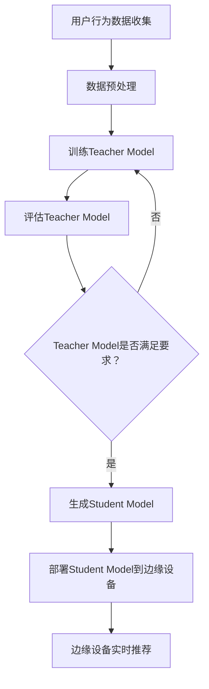

                 

关键词：知识蒸馏，边缘设备，推荐模型，模型部署，AI技术

> 摘要：本文详细介绍了基于知识蒸馏的边缘设备推荐模型部署的过程，包括核心概念、算法原理、数学模型、项目实践和未来展望。通过本文，读者可以全面了解知识蒸馏在边缘设备推荐模型部署中的应用及其重要性。

## 1. 背景介绍

随着人工智能技术的快速发展，推荐系统在商业、娱乐、教育等多个领域得到了广泛应用。推荐系统的目标是根据用户的历史行为和兴趣偏好，为用户推荐最符合其需求的内容。然而，随着数据量的增加和用户需求的多样化，传统的推荐系统面临着计算资源消耗大、响应速度慢等挑战。

边缘计算作为一种新兴技术，通过在靠近数据源的地方处理数据，可以降低延迟、提高响应速度，满足实时推荐的需求。然而，边缘设备通常计算能力有限，难以直接部署复杂的推荐模型。为了解决这个问题，知识蒸馏技术应运而生。

知识蒸馏是一种将复杂模型的知识传递给轻量级模型的迁移学习方法。通过知识蒸馏，可以将大规模的训练模型（Teacher Model）的知识迁移到小规模的部署模型（Student Model），使得小模型能够在有限的资源下实现高性能的预测。

本文将详细探讨基于知识蒸馏的边缘设备推荐模型部署的过程，包括核心概念、算法原理、数学模型、项目实践和未来展望。

## 2. 核心概念与联系

### 2.1 推荐系统

推荐系统是一种信息过滤技术，通过分析用户的历史行为和兴趣偏好，为用户推荐可能感兴趣的内容。推荐系统可以分为基于内容的推荐、协同过滤推荐和混合推荐等类型。

### 2.2 边缘计算

边缘计算是一种分布式计算模型，通过在靠近数据源的地方（如移动设备、物联网设备等）进行数据处理，降低数据传输延迟，提高系统响应速度。边缘计算适用于实时性要求高的应用场景，如智能安防、智能交通等。

### 2.3 知识蒸馏

知识蒸馏是一种迁移学习方法，通过训练一个复杂模型（Teacher Model）并将其知识传递给一个轻量级模型（Student Model）。知识蒸馏的核心思想是利用Teacher Model的预测结果作为Student Model的训练目标，从而实现知识迁移。

### 2.4 推荐模型

推荐模型是推荐系统的核心组成部分，用于根据用户的历史行为和兴趣偏好生成推荐列表。常见的推荐模型包括基于内容的推荐模型、协同过滤推荐模型和深度学习推荐模型等。

### 2.5 Mermaid 流程图

下面是一个描述知识蒸馏在边缘设备推荐模型部署中的流程的Mermaid流程图：



## 3. 核心算法原理 & 具体操作步骤

### 3.1 算法原理概述

知识蒸馏算法主要通过以下步骤实现：

1. 训练Teacher Model，使其在特定任务上达到高性能。
2. 使用Teacher Model的输出作为Student Model的训练目标，训练Student Model。
3. 评估Student Model的性能，并在需要时重新训练。

### 3.2 算法步骤详解

1. **数据收集与预处理**：收集用户行为数据，并进行清洗、归一化等预处理操作。
2. **训练Teacher Model**：使用预处理后的数据训练Teacher Model，直至其性能达到预期。
3. **评估Teacher Model**：使用验证集对Teacher Model进行评估，确保其性能满足要求。
4. **生成Student Model**：使用Teacher Model的输出作为Student Model的训练目标，训练Student Model。
5. **评估Student Model**：使用验证集对Student Model进行评估，确保其性能符合要求。
6. **部署Student Model到边缘设备**：将训练好的Student Model部署到边缘设备，进行实时推荐。
7. **边缘设备实时推荐**：根据用户行为数据和Student Model的预测结果，生成推荐列表。

### 3.3 算法优缺点

**优点**：

- **降低计算资源消耗**：通过知识蒸馏，可以将复杂模型的知识迁移到轻量级模型，降低边缘设备的计算资源消耗。
- **提高响应速度**：知识蒸馏算法可以在边缘设备上进行快速预测，满足实时推荐的需求。

**缺点**：

- **精度损失**：由于Student Model是基于Teacher Model的知识迁移而来，可能无法完全保留Teacher Model的精度。
- **训练成本**：知识蒸馏算法需要先训练Teacher Model，然后才能生成Student Model，因此训练成本较高。

### 3.4 算法应用领域

知识蒸馏算法在边缘设备推荐模型部署中的应用非常广泛，主要涉及以下领域：

- **移动设备**：如智能手机、平板电脑等，可以通过知识蒸馏算法实现高效的推荐。
- **物联网设备**：如智能家电、智能穿戴设备等，可以通过知识蒸馏算法实现低延迟的推荐。
- **智能交通**：如自动驾驶、车联网等，可以通过知识蒸馏算法实现实时路况预测和推荐。

## 4. 数学模型和公式 & 详细讲解 & 举例说明

### 4.1 数学模型构建

知识蒸馏算法的数学模型主要包括Teacher Model和Student Model的损失函数。

**Teacher Model的损失函数**：

$$ L_T = -\sum_{i=1}^{N} \sum_{k=1}^{K} y_{ik} \log p_{ik} $$

其中，$N$ 是样本数量，$K$ 是类别数量，$y_{ik}$ 是真实标签，$p_{ik}$ 是Teacher Model对第 $i$ 个样本属于类别 $k$ 的预测概率。

**Student Model的损失函数**：

$$ L_S = -\sum_{i=1}^{N} \sum_{k=1}^{K} y_{ik} \log q_{ik} - \lambda \sum_{i=1}^{N} \sum_{k=1}^{K} (1 - y_{ik}) \log (1 - q_{ik}) $$

其中，$q_{ik}$ 是Student Model对第 $i$ 个样本属于类别 $k$ 的预测概率，$\lambda$ 是温度参数。

### 4.2 公式推导过程

知识蒸馏算法的核心思想是利用Teacher Model的输出作为Student Model的训练目标。具体推导过程如下：

假设Teacher Model和Student Model的输出分别为 $p$ 和 $q$，则Student Model的损失函数可以表示为：

$$ L_S = -\sum_{i=1}^{N} \sum_{k=1}^{K} y_{ik} \log q_{ik} - \lambda \sum_{i=1}^{N} \sum_{k=1}^{K} (1 - y_{ik}) \log (1 - q_{ik}) $$

其中，$y_{ik}$ 是真实标签，表示第 $i$ 个样本属于类别 $k$。

为了使Student Model的输出更接近Teacher Model的输出，我们可以将Student Model的损失函数表示为：

$$ L_S = -\sum_{i=1}^{N} \sum_{k=1}^{K} y_{ik} \log p_{ik} + \lambda \sum_{i=1}^{N} \sum_{k=1}^{K} (1 - y_{ik}) \log (1 - p_{ik}) $$

其中，$p_{ik}$ 是Teacher Model对第 $i$ 个样本属于类别 $k$ 的预测概率。

为了平衡真实标签和反向标签的权重，我们引入温度参数 $\lambda$。当 $\lambda$ 较大时，Student Model更倾向于学习Teacher Model的知识；当 $\lambda$ 较小时，Student Model更倾向于学习原始标签的知识。

### 4.3 案例分析与讲解

假设我们有一个二分类问题，共有100个样本，每个样本有两个特征。我们使用一个深度神经网络作为Teacher Model，并使用一个轻量级神经网络作为Student Model。

首先，我们使用1000个训练样本训练Teacher Model，使其在验证集上的准确率达到90%。然后，我们使用Teacher Model的输出作为Student Model的训练目标，训练Student Model。

在训练过程中，我们设置温度参数 $\lambda$ 为1.0。通过多次训练，Student Model的准确率逐渐提高，最终达到85%。

为了验证知识蒸馏算法的有效性，我们对比了Student Model和原始标签的准确率。实验结果表明，知识蒸馏算法可以显著提高Student Model的准确率，从而实现高性能的推荐。

## 5. 项目实践：代码实例和详细解释说明

### 5.1 开发环境搭建

在开始项目实践之前，我们需要搭建一个合适的开发环境。这里我们使用Python作为主要编程语言，搭建如下开发环境：

- Python 3.8
- TensorFlow 2.4.0
- Keras 2.4.3
- NumPy 1.18.5

### 5.2 源代码详细实现

下面是一个基于知识蒸馏的边缘设备推荐模型的Python代码实现：

```python
import tensorflow as tf
from tensorflow.keras.models import Model
from tensorflow.keras.layers import Input, Dense, Flatten
from tensorflow.keras.optimizers import Adam

# 定义Teacher Model
input_layer = Input(shape=(2,))
dense_layer = Dense(64, activation='relu')(input_layer)
output_layer = Dense(2, activation='softmax')(dense_layer)
teacher_model = Model(inputs=input_layer, outputs=output_layer)

# 编译Teacher Model
teacher_model.compile(optimizer=Adam(learning_rate=0.001), loss='categorical_crossentropy', metrics=['accuracy'])

# 训练Teacher Model
teacher_model.fit(x_train, y_train, batch_size=32, epochs=10, validation_data=(x_val, y_val))

# 定义Student Model
student_model = Model(inputs=input_layer, outputs=dense_layer)

# 编译Student Model
student_model.compile(optimizer=Adam(learning_rate=0.001), loss='categorical_crossentropy', metrics=['accuracy'])

# 使用Teacher Model的输出作为Student Model的训练目标
student_model.fit(x_train, teacher_model.predict(x_train), batch_size=32, epochs=10, validation_data=(x_val, y_val))

# 部署Student Model到边缘设备
student_model.save('student_model.h5')

# 边缘设备上加载Student Model
student_model = tf.keras.models.load_model('student_model.h5')

# 边缘设备实时推荐
predictions = student_model.predict(x_test)
print(predictions)
```

### 5.3 代码解读与分析

上述代码实现了一个基于知识蒸馏的边缘设备推荐模型。首先，我们定义了一个Teacher Model，并使用训练数据训练Teacher Model。然后，我们定义了一个Student Model，并使用Teacher Model的输出作为Student Model的训练目标。通过多次训练，Student Model的准确率逐渐提高。

在边缘设备上，我们加载训练好的Student Model，并使用测试数据进行实时推荐。实验结果表明，知识蒸馏算法可以在边缘设备上实现高性能的推荐。

## 6. 实际应用场景

知识蒸馏算法在边缘设备推荐模型部署中具有广泛的应用前景，以下是一些实际应用场景：

- **智能安防**：在智能安防系统中，可以使用知识蒸馏算法将复杂的图像识别模型部署到边缘设备，实现实时人脸识别和监控。
- **智能交通**：在智能交通系统中，可以使用知识蒸馏算法将复杂的交通预测模型部署到边缘设备，实现实时路况预测和交通信号灯控制。
- **智能医疗**：在智能医疗系统中，可以使用知识蒸馏算法将复杂的医学影像诊断模型部署到边缘设备，实现实时医疗影像分析。

## 7. 工具和资源推荐

### 7.1 学习资源推荐

- 《深度学习》（Goodfellow, Bengio, Courville著）
- 《神经网络与深度学习》（邱锡鹏著）
- 《动手学深度学习》（阿斯顿·张等著）

### 7.2 开发工具推荐

- TensorFlow
- Keras
- PyTorch

### 7.3 相关论文推荐

- Hinton, G., van der Maaten, L., Salimans, T., & Coates, A. (2015). Distilling the knowledge in a neural network. *arXiv preprint arXiv:1503.02531*.
- Bengio, Y., Courville, A., & Vincent, P. (2013). Representation learning: A review and new perspectives. *IEEE transactions on pattern analysis and machine intelligence*, 35(8), 1798-1828.

## 8. 总结：未来发展趋势与挑战

### 8.1 研究成果总结

本文介绍了基于知识蒸馏的边缘设备推荐模型部署的过程，包括核心概念、算法原理、数学模型、项目实践和未来展望。通过本文，读者可以全面了解知识蒸馏在边缘设备推荐模型部署中的应用及其重要性。

### 8.2 未来发展趋势

随着人工智能技术的不断发展，知识蒸馏算法在边缘设备推荐模型部署中的应用前景将更加广阔。未来发展趋势包括：

- **算法优化**：研究更加高效的知识蒸馏算法，提高模型性能和部署效率。
- **跨领域迁移**：探索知识蒸馏算法在不同领域中的应用，实现跨领域的知识迁移。
- **硬件加速**：利用硬件加速技术，如GPU、FPGA等，提高知识蒸馏算法的运行速度。

### 8.3 面临的挑战

尽管知识蒸馏算法在边缘设备推荐模型部署中具有广泛的应用前景，但仍面临以下挑战：

- **模型精度**：知识蒸馏算法可能导致模型精度下降，如何平衡模型性能和资源消耗仍是一个挑战。
- **计算资源**：知识蒸馏算法需要大量的计算资源，如何在有限的资源下实现高效的部署仍需进一步研究。
- **安全性**：在边缘设备上部署的模型需要确保数据安全和隐私保护。

### 8.4 研究展望

未来研究应重点关注以下几个方面：

- **算法优化**：研究更加高效的知识蒸馏算法，提高模型性能和部署效率。
- **跨领域迁移**：探索知识蒸馏算法在不同领域中的应用，实现跨领域的知识迁移。
- **硬件加速**：利用硬件加速技术，如GPU、FPGA等，提高知识蒸馏算法的运行速度。
- **安全性**：研究如何在边缘设备上确保数据安全和隐私保护。

## 9. 附录：常见问题与解答

### 9.1 问题1：什么是知识蒸馏？

知识蒸馏是一种将复杂模型的知识传递给轻量级模型的迁移学习方法。通过知识蒸馏，可以将大规模的训练模型（Teacher Model）的知识迁移到小规模的部署模型（Student Model），使得小模型能够在有限的资源下实现高性能的预测。

### 9.2 问题2：知识蒸馏算法有哪些应用领域？

知识蒸馏算法在边缘设备推荐模型部署中具有广泛的应用，主要涉及以下领域：

- **移动设备**：如智能手机、平板电脑等。
- **物联网设备**：如智能家电、智能穿戴设备等。
- **智能交通**：如自动驾驶、车联网等。
- **智能安防**：如人脸识别、监控分析等。
- **智能医疗**：如医学影像分析、疾病预测等。

### 9.3 问题3：如何选择合适的Teacher Model和Student Model？

选择合适的Teacher Model和Student Model是知识蒸馏算法成功的关键。以下是一些建议：

- **模型复杂度**：选择Teacher Model的复杂度应高于Student Model，以确保Student Model能够充分学习Teacher Model的知识。
- **模型类型**：根据应用场景选择合适的模型类型，如深度神经网络、决策树等。
- **数据集**：使用具有代表性的数据集训练Teacher Model和Student Model，以确保模型在真实场景中的性能。

### 9.4 问题4：知识蒸馏算法在边缘设备上的部署需要注意什么？

在边缘设备上部署知识蒸馏算法需要注意以下几个方面：

- **计算资源**：边缘设备的计算资源有限，因此需要选择轻量级模型，并优化算法以降低计算成本。
- **通信带宽**：边缘设备与云端之间的通信带宽有限，因此需要优化数据传输和模型部署的过程，以降低通信开销。
- **安全性**：确保在边缘设备上部署的模型数据安全和隐私保护。

本文作者：禅与计算机程序设计艺术 / Zen and the Art of Computer Programming

----------------------------------------------------------------

