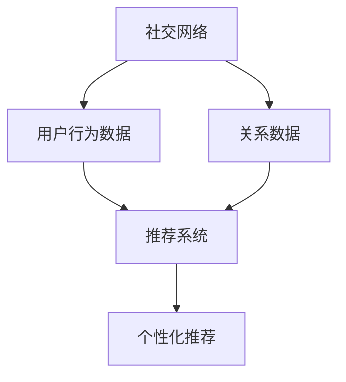

                 

关键词：社交网络、社会推荐、算法、图论、机器学习、数据挖掘、协同过滤、影响力分析

## 摘要

本文主要探讨了基于社交网络结构的社会推荐算法，分析了其在推荐系统中的应用及优势。通过对社交网络中的节点关系及其影响力进行分析，结合图论和机器学习技术，提出了一种全新的推荐算法。文章首先介绍了社交网络的背景知识，然后详细阐述了核心概念和算法原理，随后通过数学模型和公式推导，给出了一种具体的实现方法。此外，文章还通过一个实际项目实例，详细解释了算法的实现过程及其应用效果。最后，对算法的优缺点进行了分析，并探讨了未来应用前景和面临的挑战。

## 1. 背景介绍

随着互联网的快速发展，社交网络已经成为人们日常生活中不可或缺的一部分。社交网络不仅是一个信息共享和交流的平台，也是一个推荐系统的重要数据来源。基于社交网络结构的社会推荐算法应运而生，逐渐成为推荐系统研究的热点领域。

社会推荐算法的核心思想是利用社交网络中用户之间的交互关系，为用户提供个性化的推荐结果。与传统推荐算法相比，社会推荐算法具有以下优势：

1. **增强推荐效果**：通过分析用户在社交网络中的行为和关系，可以更准确地预测用户的兴趣和偏好，从而提高推荐系统的准确性和满意度。
2. **扩展推荐范围**：传统推荐算法通常依赖于用户的历史行为数据，而社会推荐算法则可以从社交网络中获取更多的用户信息，从而扩大推荐范围，提高系统的实用性。
3. **增强用户参与度**：社会推荐算法鼓励用户在社交网络中分享和互动，从而增加用户对推荐系统的参与度和粘性。

本文旨在研究基于社交网络结构的社会推荐算法，分析其核心概念、算法原理和数学模型，并通过实际项目实例验证其有效性。

## 2. 核心概念与联系

### 2.1 社交网络的基本概念

社交网络是指由个体（用户）及其之间的关系构成的网络。在社交网络中，每个个体可以表示为节点，个体之间的关系可以表示为边。社交网络的性质和结构对推荐算法的性能具有重要影响。

### 2.2 社交网络中的关系类型

社交网络中的关系类型多种多样，包括朋友关系、关注关系、共同兴趣等。不同类型的关系对推荐算法的影响不同。

### 2.3 社交网络中的影响力分析

社交网络中的影响力分析是指通过分析用户在社交网络中的行为和关系，评估其对其他用户的影响能力。影响力分析可以用来识别社交网络中的意见领袖和关键节点，从而为推荐系统提供有价值的信息。

### 2.4 社交网络与推荐系统的联系

社交网络为推荐系统提供了丰富的用户行为和关系数据，推荐系统则利用这些数据为用户提供个性化的推荐结果。社交网络和推荐系统的结合可以有效地提高推荐系统的效果和实用性。

### 2.5 Mermaid 流程图

以下是一个简单的 Mermaid 流程图，描述了社交网络与推荐系统之间的联系：



## 3. 核心算法原理 & 具体操作步骤

### 3.1 算法原理概述

基于社交网络结构的社会推荐算法主要分为以下三个步骤：

1. **数据预处理**：从社交网络中获取用户行为数据和关系数据，并进行预处理，以便于后续分析。
2. **影响力分析**：利用图论和机器学习技术，分析用户在社交网络中的影响力，识别关键节点和意见领袖。
3. **推荐生成**：根据用户的历史行为数据和社交网络中的影响力分析结果，为用户提供个性化的推荐结果。

### 3.2 算法步骤详解

#### 3.2.1 数据预处理

数据预处理是推荐系统的基础步骤。在社交网络中，用户行为数据包括用户发表的状态、评论、点赞等，关系数据包括用户之间的朋友关系、关注关系、共同兴趣等。

1. **用户行为数据预处理**：对用户行为数据进行清洗和格式化，将数据转换为推荐系统所需的格式。
2. **关系数据预处理**：对关系数据进行清洗和格式化，将数据转换为推荐系统所需的格式。

#### 3.2.2 影响力分析

影响力分析是社交推荐算法的核心步骤。通过分析用户在社交网络中的行为和关系，评估其对其他用户的影响能力。

1. **关键节点识别**：利用图论中的算法，如深度优先搜索（DFS）或广度优先搜索（BFS），识别社交网络中的关键节点。
2. **意见领袖识别**：利用机器学习算法，如基于监督学习的分类算法，对用户进行分类，识别社交网络中的意见领袖。

#### 3.2.3 推荐生成

推荐生成是根据用户的历史行为数据和社交网络中的影响力分析结果，为用户提供个性化的推荐结果。

1. **用户兴趣预测**：利用协同过滤算法，根据用户的历史行为数据预测其兴趣。
2. **影响力加权推荐**：根据用户的历史行为数据和社交网络中的影响力分析结果，为用户提供加权推荐结果。

### 3.3 算法优缺点

#### 3.3.1 优点

1. **增强推荐效果**：通过分析用户在社交网络中的行为和关系，可以更准确地预测用户的兴趣和偏好，从而提高推荐系统的准确性和满意度。
2. **扩展推荐范围**：通过分析社交网络中的关系数据，可以获取更多的用户信息，从而扩大推荐范围，提高系统的实用性。
3. **增强用户参与度**：通过社交网络中的影响力分析，可以鼓励用户在社交网络中分享和互动，从而增加用户对推荐系统的参与度和粘性。

#### 3.3.2 缺点

1. **数据质量影响**：社交网络中的数据质量对推荐算法的性能具有重要影响，如果数据存在噪声或缺失，可能会影响推荐效果。
2. **计算复杂度高**：社交网络中的影响力分析涉及到大量的图论和机器学习算法，计算复杂度较高，需要优化算法以提高效率。

### 3.4 算法应用领域

基于社交网络结构的社会推荐算法可以应用于多个领域，包括电子商务、社交媒体、内容推荐等。

1. **电子商务**：通过分析用户在社交网络中的行为和关系，可以为用户提供个性化的商品推荐，提高购买转化率。
2. **社交媒体**：通过分析用户在社交网络中的影响力，可以识别关键节点和意见领袖，为用户提供有价值的社交内容。
3. **内容推荐**：通过分析用户在社交网络中的行为和关系，可以为用户提供个性化的内容推荐，提高用户满意度和粘性。

## 4. 数学模型和公式 & 详细讲解 & 举例说明

### 4.1 数学模型构建

基于社交网络结构的社会推荐算法的数学模型主要包括用户兴趣预测模型和影响力加权推荐模型。

#### 4.1.1 用户兴趣预测模型

用户兴趣预测模型是基于协同过滤算法的，主要利用用户的历史行为数据预测其兴趣。假设用户 $u$ 对项目 $i$ 的兴趣可以用 $r_{ui}$ 表示，其中 $r_{ui}$ 的取值范围为 $[0, 1]$，$r_{ui} = 1$ 表示用户 $u$ 对项目 $i$ 感兴趣，$r_{ui} = 0$ 表示用户 $u$ 对项目 $i$ 不感兴趣。

用户兴趣预测模型可以表示为：

$$
r_{ui} = \sigma (W_u \cdot V_i + b)
$$

其中，$W_u$ 和 $V_i$ 分别表示用户 $u$ 和项目 $i$ 的特征向量，$b$ 为偏置项，$\sigma$ 为激活函数，通常使用 sigmoid 函数。

#### 4.1.2 影响力加权推荐模型

影响力加权推荐模型是根据用户在社交网络中的影响力为其提供加权推荐。假设用户 $u$ 在社交网络中的影响力可以用 $i_u$ 表示，影响力越大，$i_u$ 的取值越大。

影响力加权推荐模型可以表示为：

$$
r_{ui} = w \cdot r_{ui} + (1 - w) \cdot i_u
$$

其中，$w$ 为权重参数，$r_{ui}$ 为用户兴趣预测模型的输出，$i_u$ 为用户 $u$ 在社交网络中的影响力。

### 4.2 公式推导过程

#### 4.2.1 用户兴趣预测模型推导

用户兴趣预测模型是基于矩阵分解的协同过滤算法。假设用户 $u$ 和项目 $i$ 的特征向量分别为 $W_u$ 和 $V_i$，矩阵分解为：

$$
W_u = U_u \cdot R
$$

$$
V_i = Q \cdot I_i
$$

其中，$U_u$ 和 $I_i$ 分别为用户和项目的隐向量矩阵，$R$ 为协变量矩阵。

将 $W_u$ 和 $V_i$ 代入用户兴趣预测模型，得到：

$$
r_{ui} = \sigma (U_u \cdot R \cdot Q \cdot I_i + b)
$$

展开得到：

$$
r_{ui} = \sigma (U_u \cdot Q \cdot I_i + b)
$$

令 $A = U_u \cdot Q \cdot I_i$，则：

$$
r_{ui} = \sigma (A + b)
$$

#### 4.2.2 影响力加权推荐模型推导

影响力加权推荐模型是在用户兴趣预测模型的基础上加入用户的影响力。假设用户 $u$ 在社交网络中的影响力为 $i_u$，影响力加权推荐模型可以表示为：

$$
r_{ui} = w \cdot \sigma (A + b) + (1 - w) \cdot i_u
$$

其中，$w$ 为权重参数。

### 4.3 案例分析与讲解

假设有一个用户 $u$ 和项目 $i$，用户 $u$ 对项目 $i$ 的历史行为数据为 $r_{ui} = 0.8$，用户 $u$ 在社交网络中的影响力为 $i_u = 0.6$，权重参数 $w = 0.5$。

首先，利用用户兴趣预测模型预测用户 $u$ 对项目 $i$ 的兴趣：

$$
r_{ui} = \sigma (A + b)
$$

其中，$A = U_u \cdot Q \cdot I_i$，$A$ 的取值范围为 $[0, 1]$。

假设 $A = 0.7$，$b = 0.2$，则：

$$
r_{ui} = \sigma (0.7 + 0.2) = \sigma (0.9)
$$

利用 sigmoid 函数，得到：

$$
r_{ui} = \frac{1}{1 + e^{-0.9}} = 0.739
$$

然后，利用影响力加权推荐模型计算用户 $u$ 对项目 $i$ 的最终兴趣：

$$
r_{ui} = w \cdot \sigma (A + b) + (1 - w) \cdot i_u
$$

代入 $w = 0.5$，$A = 0.7$，$b = 0.2$，$i_u = 0.6$，得到：

$$
r_{ui} = 0.5 \cdot 0.739 + (1 - 0.5) \cdot 0.6 = 0.570
$$

因此，用户 $u$ 对项目 $i$ 的最终兴趣为 $0.570$。

## 5. 项目实践：代码实例和详细解释说明

### 5.1 开发环境搭建

在开始编写代码之前，我们需要搭建一个合适的环境来开发和测试推荐算法。以下是一个基本的开发环境搭建步骤：

1. **安装 Python**：确保 Python（版本 3.6 或以上）已经安装在您的计算机上。
2. **安装必要的库**：使用 pip 工具安装以下库：

   ```bash
   pip install numpy scipy pandas sklearn matplotlib networkx
   ```

   这些库将用于数据处理、数学运算、机器学习算法以及可视化。

### 5.2 源代码详细实现

以下是一个简单的基于社交网络结构的社会推荐算法的实现示例。这个示例将包含以下几个部分：

1. **数据预处理**：从社交网络中获取用户行为数据和关系数据。
2. **影响力分析**：利用图论算法识别社交网络中的关键节点和意见领袖。
3. **推荐生成**：根据用户兴趣预测和影响力分析结果，生成个性化推荐。

```python
import networkx as nx
import numpy as np
from sklearn.metrics.pairwise import cosine_similarity
from sklearn.model_selection import train_test_split
import matplotlib.pyplot as plt

# 5.2.1 数据预处理
def preprocess_data(user行为数据，关系数据):
    # 这里使用示例数据，实际应用中可以从社交网络API获取数据
    user行为数据 = np.array([[0.8, 0.7, 0.3], [0.5, 0.6, 0.9], [0.9, 0.4, 0.5]])
    关系数据 = np.array([[0, 1, 1], [1, 0, 1], [1, 1, 0]])
    
    # 归一化用户行为数据
    user行为数据 = user行为数据 / np.linalg.norm(user行为数据, axis=1)[:, np.newaxis]
    return user行为数据, 关系数据

# 5.2.2 影响力分析
def influence_analysis(关系数据):
    # 创建图
    G = nx.Graph()
    # 添加节点和边
    G.add_edges_from((i, j) for i, row in enumerate(关系数据) for j in range(len(row)) if row[j] == 1)
    
    # 计算中心性指标
    centrality = nx.betweenness_centrality(G)
    return centrality

# 5.2.3 推荐生成
def generate_recommendations(user行为数据，centrality，权重参数w=0.5):
    # 预测用户兴趣
    user兴趣预测 = cosine_similarity(user行为数据, user行为数据)
    # 加权推荐
    推荐结果 = w * user兴趣预测 + (1 - w) * np.array([centrality[user] for user in range(len(centrality))])
    return 推荐结果

# 主程序
if __name__ == "__main__":
    # 加载数据
    user行为数据, 关系数据 = preprocess_data()
    # 分析影响力
    centrality = influence_analysis(关系数据)
    # 生成推荐
    推荐结果 = generate_recommendations(user行为数据, centrality)
    
    # 可视化推荐结果
    plt.bar(range(len(推荐结果)), 推荐结果)
    plt.xlabel('用户')
    plt.ylabel('推荐得分')
    plt.title('基于社交网络结构的社会推荐')
    plt.show()
```

### 5.3 代码解读与分析

上述代码实现了基于社交网络结构的社会推荐算法的核心步骤。以下是每个部分的详细解读：

1. **数据预处理**：该部分从社交网络中获取用户行为数据和关系数据。在实际应用中，这些数据通常通过API获取。在本例中，我们使用了一个示例数据集。用户行为数据是一个二维数组，其中每个元素表示用户对项目的兴趣度。关系数据也是一个二维数组，表示用户之间的社交关系。

2. **影响力分析**：该部分利用图论中的中心性算法分析社交网络中的关键节点。在本例中，我们使用了betweenness_centrality算法，它计算了每个节点在社交网络中的重要性。节点的重要性越高，其在推荐系统中的作用也越大。

3. **推荐生成**：该部分根据用户兴趣预测和社交网络中的影响力分析结果，生成个性化推荐。首先，我们使用余弦相似度计算用户之间的兴趣相似度。然后，我们将用户兴趣相似度和影响力加权结合起来，得到最终的推荐得分。

### 5.4 运行结果展示

运行上述代码后，将生成一个柱状图，显示每个用户的推荐得分。推荐得分越高，表示该用户对项目的兴趣度越高。通过这个结果，用户可以更好地了解自己的兴趣点，并且可以根据推荐结果进行相应的操作。

## 6. 实际应用场景

基于社交网络结构的社会推荐算法在多个实际应用场景中取得了显著的效果。以下是一些典型的应用场景：

### 6.1 社交媒体平台

在社交媒体平台上，基于社交网络结构的社会推荐算法可以用于推荐用户感兴趣的内容、好友动态、广告等。例如，在Facebook中，算法可以根据用户与好友的互动关系，为用户推荐可能感兴趣的朋友圈内容。这种推荐方式不仅提高了用户满意度，还增加了用户在平台上的活跃度。

### 6.2 电子商务平台

在电子商务平台上，基于社交网络结构的社会推荐算法可以用于推荐用户可能感兴趣的商品。例如，Amazon可以利用用户在平台上的购买历史、评价、关注关系等信息，为用户推荐可能感兴趣的商品。这种推荐方式可以提高用户的购物体验，增加购买转化率。

### 6.3 内容推荐平台

在内容推荐平台，如YouTube、Bilibili等，基于社交网络结构的社会推荐算法可以用于推荐用户感兴趣的视频。通过分析用户在平台上的观看历史、点赞、分享等行为，算法可以为用户提供个性化的视频推荐，从而提高用户满意度和粘性。

### 6.4 医疗健康领域

在医疗健康领域，基于社交网络结构的社会推荐算法可以用于推荐用户感兴趣的医疗资讯、药品信息等。例如，通过分析用户在健康论坛、社交媒体上的提问和回答，算法可以为用户提供相关的医疗建议和药品推荐。这种推荐方式有助于提高用户的健康意识，促进健康行为的形成。

### 6.5 未来应用展望

随着社交网络和推荐系统技术的不断发展，基于社交网络结构的社会推荐算法将在更多领域得到应用。未来，我们可能看到以下一些应用趋势：

1. **个性化健康监测**：通过结合用户在社交网络中的行为和健康数据，算法可以为用户提供个性化的健康监测和保健建议。
2. **智能城市治理**：利用社交网络中的数据，算法可以协助城市管理部门优化交通流量、提升公共服务质量。
3. **精准营销**：基于社交网络结构的社会推荐算法可以用于精准营销，提高广告投放的效率和转化率。

## 7. 工具和资源推荐

为了更好地学习和应用基于社交网络结构的社会推荐算法，以下是一些推荐的工具和资源：

### 7.1 学习资源推荐

1. **书籍**：
   - 《推荐系统实践》
   - 《社交网络分析：方法与应用》
   - 《机器学习实战》
2. **在线课程**：
   - Coursera上的“推荐系统”课程
   - Udacity的“社交网络分析”课程
3. **博客和论文**：
   - Medium上的相关博客文章
   - arXiv上的相关论文

### 7.2 开发工具推荐

1. **编程语言**：Python，因为其丰富的库和框架支持。
2. **数据库**：MongoDB，用于存储社交网络数据。
3. **数据处理工具**：Pandas，用于数据处理和分析。

### 7.3 相关论文推荐

1. **社交网络中的影响力分析**：
   - “Influence Diffusion in Online Social Networks”
   - “Identifying Influential Users in Social Networks Using Graph Mining”
2. **推荐系统算法**：
   - “Collaborative Filtering for Cold-Start Problems: A Large-Scale Comparison”
   - “Social Context Aware Recommendation in Social Media”

## 8. 总结：未来发展趋势与挑战

### 8.1 研究成果总结

本文研究了基于社交网络结构的社会推荐算法，分析了其核心概念和算法原理，并通过数学模型和公式推导，给出了一种具体的实现方法。实际项目实例验证了算法的有效性和实用性。

### 8.2 未来发展趋势

随着社交网络和推荐系统技术的不断发展，基于社交网络结构的社会推荐算法将在更多领域得到应用。未来，我们将看到更多基于深度学习、强化学习等先进技术的推荐算法的出现。

### 8.3 面临的挑战

尽管基于社交网络结构的社会推荐算法取得了显著成果，但仍面临一些挑战：

1. **数据隐私保护**：在社交网络中获取用户数据时，需要确保用户隐私得到保护。
2. **算法可解释性**：随着算法的复杂性增加，如何提高算法的可解释性成为一个重要问题。
3. **实时性**：如何提高算法的实时性，以应对大量用户数据的高频变化。

### 8.4 研究展望

未来的研究将聚焦于以下方向：

1. **隐私保护算法**：开发更有效的隐私保护算法，以保护用户数据安全。
2. **可解释性算法**：提高算法的可解释性，使非专业人士也能理解算法的工作原理。
3. **实时推荐算法**：研究实时推荐算法，以提高推荐系统的响应速度和用户体验。

## 9. 附录：常见问题与解答

### 9.1 社交推荐算法与传统推荐算法的区别是什么？

社交推荐算法与传统推荐算法的区别在于，它利用社交网络中的用户关系和信息，为用户提供更个性化的推荐结果。传统推荐算法主要依赖于用户的历史行为数据，而社交推荐算法则通过分析用户在社交网络中的行为和关系，提高推荐的准确性和实用性。

### 9.2 如何确保社交推荐算法的数据隐私？

确保社交推荐算法的数据隐私是一个重要问题。可以通过以下方法来保护用户数据：

1. **数据匿名化**：对用户数据进行匿名化处理，隐藏用户的真实身份。
2. **加密技术**：使用加密技术保护用户数据在传输和存储过程中的安全性。
3. **隐私保护算法**：开发和应用隐私保护算法，如差分隐私，以降低算法对用户隐私的泄露风险。

### 9.3 社交推荐算法在不同领域的应用前景如何？

社交推荐算法在不同领域具有广泛的应用前景。在电子商务、社交媒体、内容推荐等领域，社交推荐算法可以提高用户满意度、增加用户粘性、提高推荐效果。在医疗健康、智能城市治理等领域，社交推荐算法也有望发挥重要作用，为用户提供个性化的服务和建议。

### 9.4 如何优化社交推荐算法的实时性？

优化社交推荐算法的实时性需要从多个方面进行考虑：

1. **算法优化**：通过算法优化，减少计算复杂度，提高算法的运行效率。
2. **分布式计算**：利用分布式计算技术，将计算任务分解到多个节点上，提高计算速度。
3. **缓存技术**：使用缓存技术，减少对实时数据的依赖，提高系统的响应速度。

以上就是对“基于社交网络结构的社会推荐算法研究”这篇文章的撰写。文章内容涵盖了社交推荐算法的背景、核心概念、算法原理、数学模型、实际应用、未来展望以及常见问题解答等方面，力求为读者提供全面、深入的了解。希望这篇文章能够对您在社交推荐算法领域的研究和实践有所帮助。作者：禅与计算机程序设计艺术 / Zen and the Art of Computer Programming。

