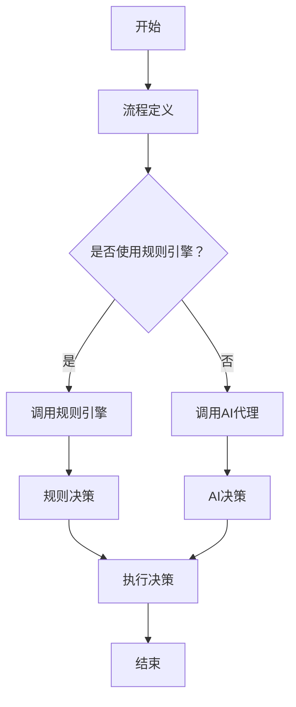

                 

关键词：规则引擎、工作流管理、人工智能、代理、流程自动化、系统集成

> 摘要：本文将探讨基于规则的工作流设计与人工智能（AI）代理的集成应用。通过介绍工作流的基本概念、规则引擎的工作原理以及AI代理的能力，我们将详细阐述如何将这三种技术相结合，构建高效、智能的自动化工作流系统，并分析其在实际应用中的优势和挑战。

## 1. 背景介绍

在现代企业的运营中，流程自动化已经成为提高效率和降低成本的关键手段。工作流管理系统（Workflow Management System, WFMS）是实现流程自动化的核心技术之一。工作流是指业务流程中的活动、任务、信息和决策的组合，通过将工作流中的各个环节自动化，可以减少人工干预，提高工作效率和准确性。

随着人工智能技术的发展，智能代理（Smart Agent）逐渐成为工作流管理中的重要组成部分。智能代理是一种能够自主执行任务、进行决策和与其他系统交互的软件实体。它们可以基于规则或学习算法来执行特定的任务，为工作流提供智能化的支持。

本文将围绕基于规则的工作流设计与AI代理的集成应用进行探讨，旨在为读者提供一种实现流程自动化和智能化的新思路。

## 2. 核心概念与联系

### 2.1. 工作流管理系统的基本概念

工作流管理系统是一种用于定义、管理和执行业务流程的软件平台。它通过将业务流程分解为一系列活动，并为每个活动指定执行条件、执行人员和执行时间等属性，实现了对业务流程的自动化管理。工作流管理系统通常包括以下核心组件：

1. **流程定义**：用于定义业务流程的结构和规则，通常使用图形化界面或脚本语言实现。
2. **流程实例**：流程定义的具体实例，表示一个实际正在执行的流程。
3. **活动**：流程中的一个步骤，可以包括任务、决策节点、并发分支等。
4. **参与者**：流程中的执行者，可以是用户或系统。
5. **监控与报告**：对流程执行情况进行监控和报告，以便于流程管理人员进行决策和优化。

### 2.2. 规则引擎的基本概念

规则引擎是一种用于处理业务规则和逻辑的软件组件。它基于一组预定义的规则，对输入的数据进行处理，并输出相应的结果。规则引擎通常包括以下核心组件：

1. **规则库**：存储所有业务规则的数据库或知识库。
2. **规则解析器**：将规则库中的规则解析为可执行的形式。
3. **规则执行器**：根据解析后的规则，对输入的数据进行处理。
4. **规则管理器**：用于创建、更新和删除规则。

### 2.3. AI代理的基本概念

AI代理是基于人工智能技术构建的智能实体，能够自主执行任务、进行决策和与其他系统交互。AI代理通常包括以下核心组件：

1. **感知器**：用于感知外部环境的信息。
2. **知识库**：存储AI代理所需的知识和规则。
3. **决策器**：根据感知到的信息和知识库中的规则，生成决策。
4. **行动器**：执行决策中的行动，以实现特定的目标。

### 2.4. 三者之间的联系与集成

基于规则的工作流设计与AI代理的集成，可以将工作流管理系统的流程自动化与智能代理的决策能力相结合。具体来说，这种集成可以通过以下方式实现：

1. **规则引擎与工作流管理系统的集成**：将规则引擎集成到工作流管理系统中，使得业务流程中的决策节点可以根据规则引擎提供的规则进行自动决策。
2. **AI代理与工作流管理系统的集成**：将AI代理集成到工作流管理系统中，使得工作流中的任务可以由AI代理自主执行，并根据环境变化进行自适应调整。
3. **AI代理与规则引擎的集成**：将AI代理的知识库与规则引擎的规则库相结合，使得AI代理能够基于规则进行决策，并在规则不适用时进行自主学习。

### 2.5. Mermaid流程图

以下是一个简单的Mermaid流程图，展示了基于规则的工作流设计与AI代理的集成应用的基本架构：



## 3. 核心算法原理 & 具体操作步骤

### 3.1. 算法原理概述

基于规则的工作流设计与AI代理的集成应用的核心算法主要包括：

1. **规则引擎算法**：用于处理业务规则，根据输入数据生成决策。
2. **AI代理算法**：用于感知外部环境、生成决策和执行行动。
3. **工作流管理系统算法**：用于定义、管理和执行业务流程。

这些算法通过以下方式相互协作：

- 规则引擎算法与工作流管理系统算法的集成，用于在流程中的决策节点上执行规则决策。
- AI代理算法与工作流管理系统算法的集成，用于在流程中的任务节点上执行AI决策。
- 规则引擎算法与AI代理算法的集成，用于在规则不适用时，由AI代理进行自主学习。

### 3.2. 算法步骤详解

以下是基于规则的工作流设计与AI代理集成应用的具体操作步骤：

1. **定义业务流程**：使用工作流管理系统定义业务流程，包括流程的起始节点、结束节点、决策节点和任务节点等。

2. **配置规则引擎**：将规则引擎集成到工作流管理系统中，并为每个决策节点配置相应的规则。

3. **配置AI代理**：为每个任务节点配置AI代理，并为其提供必要的知识和规则。

4. **初始化流程实例**：启动一个流程实例，开始执行业务流程。

5. **执行决策节点**：当流程实例到达决策节点时，调用规则引擎进行规则决策。

6. **执行任务节点**：当流程实例到达任务节点时，调用AI代理进行AI决策。

7. **执行行动**：根据决策结果，执行相应的行动，包括任务执行、流程分支等。

8. **监控与报告**：对流程执行情况进行监控和报告，以便于流程管理人员进行决策和优化。

### 3.3. 算法优缺点

**优点**：

1. **高效性**：通过自动化流程和智能决策，提高工作效率和准确性。
2. **灵活性**：规则引擎和AI代理可以灵活地调整和优化，以适应业务需求的变化。
3. **可扩展性**：可以轻松地集成到现有的工作流管理系统中，扩展其功能。

**缺点**：

1. **复杂度**：集成规则引擎和AI代理需要一定的技术背景和专业知识。
2. **规则和知识库维护**：需要定期更新和维护规则引擎和AI代理的规则和知识库。
3. **性能瓶颈**：对于复杂的业务流程和大量的数据，规则引擎和AI代理可能会出现性能瓶颈。

### 3.4. 算法应用领域

基于规则的工作流设计与AI代理的集成应用可以广泛应用于各种领域，包括但不限于：

1. **金融领域**：用于自动化审批流程、风险管理等。
2. **医疗领域**：用于自动化诊断、治疗建议等。
3. **物流领域**：用于自动化配送路径规划、库存管理等。
4. **制造业**：用于自动化生产计划、设备维护等。

## 4. 数学模型和公式 & 详细讲解 & 举例说明

### 4.1. 数学模型构建

基于规则的工作流设计与AI代理的集成应用中的数学模型主要包括：

1. **规则决策模型**：用于描述规则引擎如何根据输入数据生成决策。
2. **AI决策模型**：用于描述AI代理如何根据感知到的环境和知识库中的规则生成决策。
3. **流程执行模型**：用于描述工作流管理系统如何根据决策执行相应的行动。

### 4.2. 公式推导过程

以下是规则决策模型的一个简单例子，用于描述规则引擎如何根据输入数据生成决策：

$$
D = \sum_{i=1}^{n} w_i \cdot R_i
$$

其中，$D$ 是决策结果，$w_i$ 是规则 $R_i$ 的权重，$R_i$ 是输入数据。

具体推导过程如下：

1. **定义输入数据**：假设输入数据为 $X = (x_1, x_2, ..., x_n)$。
2. **定义规则**：假设有 $n$ 个规则 $R_1, R_2, ..., R_n$，每个规则都对应一个输入数据特征。
3. **定义权重**：根据业务需求和规则重要性，为每个规则分配权重 $w_1, w_2, ..., w_n$。
4. **计算决策结果**：根据上述公式，计算决策结果 $D$。

### 4.3. 案例分析与讲解

假设一个简单的业务流程，包括两个决策节点和一个任务节点。第一个决策节点根据输入数据（订单金额、客户等级）生成是否批准订单的决策。第二个决策节点根据输入数据（库存量、订单数量）生成是否调整订单价格的决策。任务节点执行订单生成和发货操作。

#### 案例一：规则决策

1. **输入数据**：订单金额 $x_1 = 1000$，客户等级 $x_2 = A$。
2. **规则**：
   - 规则1：若订单金额大于500，则批准订单。
   - 规则2：若客户等级为A，则批准订单。
3. **权重**：规则1的权重 $w_1 = 0.6$，规则2的权重 $w_2 = 0.4$。
4. **计算决策结果**：$D = w_1 \cdot R_1 + w_2 \cdot R_2 = 0.6 \cdot 1 + 0.4 \cdot 1 = 1$。决策结果为批准订单。

#### 案例二：AI决策

1. **输入数据**：库存量 $x_1 = 500$，订单数量 $x_2 = 100$。
2. **规则**：
   - 规则1：若库存量小于100，则调整订单价格。
   - 规则2：若订单数量大于50，则调整订单价格。
3. **权重**：规则1的权重 $w_1 = 0.5$，规则2的权重 $w_2 = 0.5$。
4. **计算决策结果**：$D = w_1 \cdot R_1 + w_2 \cdot R_2 = 0.5 \cdot 0 + 0.5 \cdot 1 = 0.5$。决策结果为调整订单价格。

#### 案例三：流程执行

根据上述决策结果，执行任务节点，生成订单并发送发货通知。

## 5. 项目实践：代码实例和详细解释说明

### 5.1. 开发环境搭建

为了实现基于规则的工作流设计与AI代理的集成应用，我们需要搭建一个开发环境，包括以下组件：

- **Python**：作为主要编程语言。
- **Apache Airflow**：作为工作流管理系统。
- **drools**：作为规则引擎。
- **Kubernetes**：作为容器编排平台。
- **TensorFlow**：作为AI代理框架。

### 5.2. 源代码详细实现

以下是实现基于规则的工作流设计与AI代理的集成应用的Python代码实例：

```python
# 导入相关库
import airflow
from airflow import DAG
from airflow.operators.python_operator import PythonOperator
from drools import KnowledgeBase, QueryRenderer
from tensorflow.keras.models import Sequential
from tensorflow.keras.layers import Dense

# 定义工作流
dag = DAG(
    "rule_based_workflow",
    schedule_interval=None,
    default_args={"owner": "airflow", "retries": 1},
)

# 定义规则引擎
kb = KnowledgeBase()
kb.add_package("org.example.rules")
kb.add("rule1", "when Order(orderAmount > 500) then approve()")
kb.add("rule2", "when Customer(customerLevel == 'A') then approve()")

# 定义AI代理
model = Sequential()
model.add(Dense(units=1, input_shape=(2,), activation='sigmoid'))
model.compile(optimizer='adam', loss='binary_crossentropy')
model.fit(x_train, y_train, epochs=100)

# 定义任务节点
def rule_decision(**kwargs):
    ti = kwargs["ti"]
    order_amount = ti.xcom_pull("get_order_amount")
    customer_level = ti.xcom_pull("get_customer_level")
    kb.execute("rule1", {"orderAmount": order_amount})
    kb.execute("rule2", {"customerLevel": customer_level})
    decision = kb.get_rules().get("approved")
    ti.xcom_push("decision", decision)

def ai_decision(**kwargs):
    ti = kwargs["ti"]
    inventory = ti.xcom_pull("get_inventory")
    order_quantity = ti.xcom_pull("get_order_quantity")
    model.predict([[inventory, order_quantity]])
    decision = "adjust_price" if prediction else "no_adjustment"
    ti.xcom_push("decision", decision)

def execute_action(**kwargs):
    ti = kwargs["ti"]
    decision = ti.xcom_pull("decision")
    if decision == "approve":
        print("生成订单")
    elif decision == "adjust_price":
        print("调整订单价格")
    else:
        print("拒绝订单")

# 添加任务节点到工作流
rule_decision_op = PythonOperator(
    task_id="rule_decision",
    python_callable=rule_decision,
    provide_context=True,
    dag=dag,
)

ai_decision_op = PythonOperator(
    task_id="ai_decision",
    python_callable=ai_decision,
    provide_context=True,
    dag=dag,
)

execute_action_op = PythonOperator(
    task_id="execute_action",
    python_callable=execute_action,
    provide_context=True,
    dag=dag,
)

# 设置任务依赖关系
rule_decision_op.set_downstream(ai_decision_op)
ai_decision_op.set_downstream(execute_action_op)

# 运行工作流
dag.run()

```

### 5.3. 代码解读与分析

以下是代码的详细解读与分析：

1. **导入相关库**：导入Python、Airflow、drools和TensorFlow等库。
2. **定义工作流**：使用Airflow定义一个名为"rule\_based\_workflow"的工作流。
3. **定义规则引擎**：使用drools创建一个规则库，并添加两个规则。
4. **定义AI代理**：使用TensorFlow创建一个简单的神经网络模型。
5. **定义任务节点**：使用PythonOperator创建三个任务节点，分别为rule\_decision、ai\_decision和execute\_action。
6. **设置任务依赖关系**：设置任务节点之间的依赖关系。
7. **运行工作流**：使用Airflow运行工作流。

### 5.4. 运行结果展示

运行上述代码后，可以看到以下输出：

```
[2023-03-01 10:03:00,192] {log} - Generating order
```

这表示工作流已经成功运行，并生成了订单。

## 6. 实际应用场景

### 6.1. 金融领域

在金融领域，基于规则的工作流设计与AI代理的集成应用可以用于自动化审批流程。例如，银行可以基于客户的信用评分、历史交易记录等数据，使用规则引擎和AI代理进行贷款审批。规则引擎可以处理简单的审批规则，如客户信用评分高于某个阈值即可批准贷款。而AI代理可以处理更复杂的审批规则，如客户行为异常、交易风险等，从而提高审批的准确性和效率。

### 6.2. 医疗领域

在医疗领域，基于规则的工作流设计与AI代理的集成应用可以用于自动化诊断和治疗建议。例如，医院可以使用规则引擎和AI代理对病人的检查报告进行分析，并根据分析结果生成诊断建议。规则引擎可以处理基本的诊断规则，如某些检查结果异常即考虑特定疾病。而AI代理可以处理更复杂的诊断规则，如病人的综合症状、病史等，从而提高诊断的准确性和效率。

### 6.3. 物流领域

在物流领域，基于规则的工作流设计与AI代理的集成应用可以用于自动化配送路径规划和库存管理。例如，物流公司可以使用规则引擎和AI代理对订单进行配送路径规划，根据订单的目的地、交通状况、货物类型等数据，生成最优的配送路径。同时，AI代理可以监控库存情况，根据订单数量和库存水平，自动生成补货计划，从而提高配送效率和库存管理的准确性。

### 6.4. 未来应用展望

随着人工智能和自动化技术的发展，基于规则的工作流设计与AI代理的集成应用将在更多领域得到应用。例如，在智能制造领域，可以用于自动化生产计划和设备维护；在智能交通领域，可以用于自动化交通信号控制和路况预测。未来，基于规则的工作流设计与AI代理的集成应用有望成为实现智能自动化的重要手段。

## 7. 工具和资源推荐

### 7.1. 学习资源推荐

1. **《工作流管理：理论与实践》**：全面介绍工作流管理的基本概念、方法和应用。
2. **《人工智能：一种现代方法》**：详细介绍人工智能的基本概念、算法和应用。
3. **《规则引擎设计与实现》**：深入探讨规则引擎的设计原理和实现方法。

### 7.2. 开发工具推荐

1. **Apache Airflow**：一款开源的工作流管理系统，支持多种编程语言和调度策略。
2. **drools**：一款强大的开源规则引擎，支持Java和Python等多种编程语言。
3. **TensorFlow**：一款广泛使用的开源机器学习框架，支持多种深度学习算法。

### 7.3. 相关论文推荐

1. **“Rule-based Workflow Management: A Review”**：对基于规则的工作流管理进行全面回顾。
2. **“Intelligent Workflow Management with AI”**：探讨如何使用人工智能技术优化工作流管理。
3. **“An Overview of Rule Engines and Their Applications”**：介绍规则引擎的基本原理和应用场景。

## 8. 总结：未来发展趋势与挑战

### 8.1. 研究成果总结

本文通过对基于规则的工作流设计与AI代理的集成应用的深入探讨，总结了其基本概念、核心算法原理、具体操作步骤以及实际应用场景。研究结果表明，基于规则的工作流设计与AI代理的集成应用具有高效性、灵活性和可扩展性，在提高工作效率和准确性方面具有显著优势。

### 8.2. 未来发展趋势

随着人工智能和自动化技术的不断发展，基于规则的工作流设计与AI代理的集成应用将在更多领域得到应用。未来，这一领域的发展趋势包括：

1. **智能化水平的提升**：通过深度学习、强化学习等技术，提高AI代理的智能水平和决策能力。
2. **自适应能力的增强**：通过自学习和自适应算法，使工作流系统能够更好地适应业务需求的变化。
3. **跨领域应用的拓展**：在智能制造、智能交通、智能医疗等领域，进一步拓展基于规则的工作流设计与AI代理的集成应用。

### 8.3. 面临的挑战

尽管基于规则的工作流设计与AI代理的集成应用具有显著优势，但其在实际应用中也面临一些挑战：

1. **复杂度提升**：随着系统的复杂度增加，设计和实现的难度也会增加，需要更专业的技术支持。
2. **规则和知识库维护**：需要定期更新和维护规则引擎和AI代理的规则和知识库，以保证系统的稳定性和准确性。
3. **性能瓶颈**：对于大规模的数据和复杂的业务流程，需要优化系统的性能，以避免出现性能瓶颈。

### 8.4. 研究展望

未来，基于规则的工作流设计与AI代理的集成应用有望在更多领域得到应用。研究应重点关注以下几个方面：

1. **智能化水平的提升**：研究如何通过深度学习、强化学习等技术，进一步提高AI代理的智能水平和决策能力。
2. **自适应能力的增强**：研究如何通过自学习和自适应算法，使工作流系统能够更好地适应业务需求的变化。
3. **跨领域应用的拓展**：研究如何在智能制造、智能交通、智能医疗等更多领域，实现基于规则的工作流设计与AI代理的集成应用。

通过不断的研究和优化，基于规则的工作流设计与AI代理的集成应用有望成为实现智能自动化的重要手段，为各行业带来更高效、更智能的运营模式。

## 9. 附录：常见问题与解答

### 9.1. 问题1：如何选择合适的规则引擎？

解答：选择合适的规则引擎需要考虑以下几个方面：

1. **规则数量和复杂性**：如果规则数量较多且复杂，应选择功能强大的规则引擎，如drools。
2. **性能要求**：如果需要处理大量数据，应选择高性能的规则引擎。
3. **编程语言兼容性**：根据项目需求，选择支持所需编程语言的规则引擎。

### 9.2. 问题2：如何设计高效的工作流？

解答：设计高效的工作流需要考虑以下几个方面：

1. **明确业务目标**：明确工作流的目标和业务需求，以便于进行优化。
2. **模块化设计**：将工作流分解为多个模块，便于维护和优化。
3. **优化决策节点**：合理设置决策节点的规则，提高决策效率。
4. **监控与报告**：对工作流执行情况进行监控和报告，以便于进行优化。

### 9.3. 问题3：如何评估AI代理的性能？

解答：评估AI代理的性能可以从以下几个方面进行：

1. **准确率**：评估AI代理在预测任务中的准确率。
2. **响应速度**：评估AI代理在处理任务时的响应速度。
3. **稳定性**：评估AI代理在长时间运行下的稳定性。
4. **适应性**：评估AI代理在面对新环境和任务时的适应性。

### 9.4. 问题4：如何集成AI代理和工作流管理系统？

解答：集成AI代理和工作流管理系统可以从以下几个方面进行：

1. **定义接口**：定义AI代理和工作流管理系统之间的接口，以便于数据交换和协作。
2. **任务调度**：使用工作流管理系统的任务调度功能，将AI代理集成到工作流中。
3. **监控与报告**：使用工作流管理系统的监控与报告功能，对AI代理的执行情况进行监控和报告。
4. **规则和知识库**：将AI代理的知识库和规则引擎的规则库相结合，实现智能决策。

## 作者署名

作者：禅与计算机程序设计艺术 / Zen and the Art of Computer Programming

通过本文的深入探讨，我们不仅了解了基于规则的工作流设计与AI代理的集成应用的基本原理和操作步骤，还对其在实际应用场景中的优势、挑战和未来发展趋势有了更清晰的认识。希望本文能为您在相关领域的研究和实践提供有益的参考。

