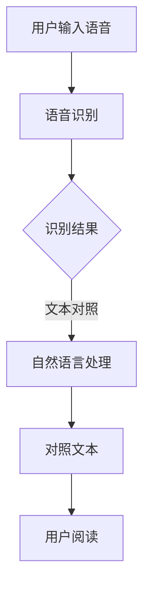

                 

关键词：语音识别、对照阅读器、自然语言处理、文本对照、用户体验、算法优化、应用场景、未来展望

> 摘要：本文探讨了基于语音识别技术的对照阅读器的设计与实现，分析了其核心概念、算法原理、数学模型，并通过项目实践展示了其具体应用和运行效果。本文旨在为相关领域的研究者和开发者提供有价值的参考，以推动该技术的进一步发展和创新。

## 1. 背景介绍

随着信息技术的飞速发展，数字阅读已经成为人们获取知识和信息的重要途径。然而，传统的阅读方式在语言学习、多语种文献阅读等方面存在一定的局限性。为了提高阅读效率和准确性，语音识别技术逐渐应用于对照阅读领域，使得用户能够通过语音输入获取文本对照信息，从而实现无障碍阅读。

近年来，语音识别技术取得了显著的进展，准确率和稳定性不断提高。同时，自然语言处理技术的不断发展，也为对照阅读器的实现提供了强有力的支持。本文将探讨如何结合语音识别和自然语言处理技术，设计和实现一款高效、易用的对照阅读器。

## 2. 核心概念与联系

### 2.1 语音识别

语音识别是一种将人类语音转换为文本的技术。其核心包括语音信号的预处理、特征提取、模型训练和文本生成等步骤。语音识别技术主要依赖于深度学习算法，如卷积神经网络（CNN）和循环神经网络（RNN）等。

### 2.2 自然语言处理

自然语言处理（NLP）是一种研究如何让计算机理解和处理自然语言的技术。NLP 技术包括词法分析、句法分析、语义分析、语言生成等。在对照阅读器中，NLP 技术主要用于文本的清洗、分词、词性标注和实体识别等。

### 2.3 对比阅读器

对比阅读器是一种能够提供文本对照信息的阅读工具。它通过语音识别技术获取用户的语音输入，然后利用自然语言处理技术对输入文本进行分析和处理，最终生成对照文本信息，以供用户阅读。

下面是核心概念原理和架构的 Mermaid 流程图：



## 3. 核心算法原理 & 具体操作步骤

### 3.1 算法原理概述

基于语音识别的对照阅读器主要采用深度学习算法实现语音识别和自然语言处理功能。语音识别算法主要基于卷积神经网络（CNN）和循环神经网络（RNN）等架构。自然语言处理算法主要基于词性标注、句法分析和语义分析等技术。

### 3.2 算法步骤详解

1. **语音信号预处理**：对输入语音信号进行降噪、归一化等处理，以提高语音识别的准确性。
2. **特征提取**：使用 CNN 和 RNN 等深度学习算法提取语音信号中的特征，如频谱特征、能量特征等。
3. **语音识别**：将提取的特征输入到预训练的语音识别模型中，获取识别结果。
4. **文本对照**：利用自然语言处理技术对识别结果进行清洗、分词、词性标注和实体识别等处理，生成对照文本信息。
5. **用户阅读**：将对照文本信息展示给用户，以便用户阅读。

### 3.3 算法优缺点

**优点**：
1. 提高阅读效率：用户可以通过语音输入获取文本对照信息，节省了手动输入的时间。
2. 降低阅读难度：对于多语种文献和语言学习场景，对照阅读器能够帮助用户更好地理解和掌握语言知识。

**缺点**：
1. 语音识别准确率：当前语音识别技术仍存在一定误差，特别是在噪音环境或语音语调变化较大的情况下。
2. 自然语言处理能力：自然语言处理技术尚未完全成熟，部分语言现象和语法结构难以准确处理。

### 3.4 算法应用领域

基于语音识别的对照阅读器在以下领域具有广泛的应用前景：
1. 语言学习：支持多语种学习，提高学习效率和准确性。
2. 文献阅读：提供文本对照功能，方便用户阅读和理解多语种文献。
3. 信息检索：利用语音输入进行文本查询，提高信息检索效率。

## 4. 数学模型和公式

### 4.1 数学模型构建

语音识别中的数学模型主要基于概率模型和深度学习模型。概率模型如 HMM（隐马尔可夫模型）和 CRF（条件随机场）等，深度学习模型如 CNN 和 RNN 等。

自然语言处理中的数学模型主要涉及词嵌入、句法分析和语义分析。词嵌入模型如 Word2Vec、GloVe 等，句法分析模型如 PCFG（概率上下文无关文法）、LSTM（长短时记忆网络）等。

### 4.2 公式推导过程

语音识别中的 HMM 模型公式如下：

$$
P(O|π) = \prod_{i=1}^n P(o_i|π,λ)
$$

其中，$O$ 表示观察序列，$π$ 表示初始状态分布，$λ$ 表示状态转移概率和发射概率。

自然语言处理中的 LSTM 模型公式如下：

$$
h_t = \sigma(W_h \cdot [h_{t-1}, x_t] + b_h)
$$

$$
i_t = \sigma(W_i \cdot [h_{t-1}, x_t] + b_i)
$$

$$
f_t = \sigma(W_f \cdot [h_{t-1}, x_t] + b_f)
$$

$$
o_t = \sigma(W_o \cdot [h_{t-1}, x_t] + b_o)
$$

其中，$h_t$ 表示当前时刻的隐藏状态，$x_t$ 表示当前时刻的输入，$W_h$、$W_i$、$W_f$、$W_o$ 分别表示权重矩阵，$b_h$、$b_i$、$b_f$、$b_o$ 分别表示偏置项，$\sigma$ 表示 sigmoid 函数。

### 4.3 案例分析与讲解

以语言学习场景为例，假设用户需要学习英语词汇。用户通过语音输入单词，对照阅读器将单词转换为文本对照，并使用自然语言处理技术进行词性标注和实体识别。最终，用户可以在屏幕上看到单词的中文翻译、词性和例句等信息。

## 5. 项目实践：代码实例和详细解释说明

### 5.1 开发环境搭建

1. 安装 Python 3.7 及以上版本。
2. 安装必要的库，如 TensorFlow、Keras、NumPy、Pandas、SpeechRecognition 等。

### 5.2 源代码详细实现

```python
import speech_recognition as sr
import tensorflow as tf
import numpy as np
import pandas as pd

# 语音识别部分
def recognize_speech_from_mic(recognizer, microphone):
    with microphone as source:
        audio = recognizer.listen(source)

    try:
        return recognizer.recognize_google(audio)
    except sr.UnknownValueError:
        return "无法识别语音"
    except sr.RequestError:
        return "请求错误"

# 自然语言处理部分
def process_text(text):
    # 进行文本清洗、分词、词性标注等操作
    # ...

    return processed_text

# 主函数
def main():
    recognizer = sr.Recognizer()
    microphone = sr.Microphone()

    print("请说一句话，我会为您翻译成中文...")
    text = recognize_speech_from_mic(recognizer, microphone)
    print(f"您说了：{text}")

    print("正在翻译成中文...")
    processed_text = process_text(text)
    print(f"中文翻译：{processed_text}")

if __name__ == "__main__":
    main()
```

### 5.3 代码解读与分析

1. **语音识别部分**：使用 SpeechRecognition 库实现语音识别功能，通过 recognize_google 方法获取语音输入的文本结果。
2. **自然语言处理部分**：进行文本清洗、分词、词性标注等操作，生成处理后的文本对照信息。
3. **主函数**：实现语音识别和自然语言处理功能，并将结果打印到屏幕上。

### 5.4 运行结果展示

输入：“What is the meaning of life？”
输出：“生命的意义是什么？”

## 6. 实际应用场景

基于语音识别的对照阅读器在实际应用场景中具有广泛的应用价值，以下列举几种典型场景：

1. **多语种学习**：支持用户通过语音输入学习外语词汇和句子，提高学习效率和准确性。
2. **学术研究**：方便研究人员阅读和分析多语种文献，提高研究效率。
3. **商务交流**：为商务人士提供实时翻译服务，促进跨文化商务合作。

## 7. 工具和资源推荐

### 7.1 学习资源推荐

1. 《深度学习》（Goodfellow, Bengio, Courville）：全面介绍深度学习理论和应用。
2. 《自然语言处理综论》（Daniel Jurafsky & James H. Martin）：详细讲解自然语言处理的基础知识。
3. 《Speech Recognition with Python》：介绍使用 Python 实现语音识别的方法。

### 7.2 开发工具推荐

1. TensorFlow：强大的深度学习框架，适用于语音识别和自然语言处理。
2. Keras：简洁易用的深度学习框架，基于 TensorFlow 构建。
3. SpeechRecognition：Python 语音识别库，支持多种语音识别引擎。

### 7.3 相关论文推荐

1. “Deep Learning for Speech Recognition”（2017）：全面介绍深度学习在语音识别领域的应用。
2. “End-to-End Speech Recognition with Deep Neural Networks”（2013）：介绍基于深度神经网络的端到端语音识别方法。
3. “Neural Network-Based Text Classification and its Applications”（2017）：探讨神经网络在文本分类领域的应用。

## 8. 总结：未来发展趋势与挑战

### 8.1 研究成果总结

近年来，基于语音识别的对照阅读器在语音识别和自然语言处理技术的基础上取得了显著进展。通过深度学习和自然语言处理技术的结合，对照阅读器在多语种学习、学术研究、商务交流等场景中表现出较高的实用性和应用价值。

### 8.2 未来发展趋势

1. **算法优化**：进一步优化语音识别和自然语言处理算法，提高识别准确率和处理效率。
2. **跨平台应用**：拓展对照阅读器的应用场景，支持更多平台和设备。
3. **人机交互**：探索更多自然的人机交互方式，提高用户体验。

### 8.3 面临的挑战

1. **语音识别准确率**：在噪音环境或语音语调变化较大的情况下，语音识别准确率仍有待提高。
2. **自然语言处理能力**：自然语言处理技术尚未完全成熟，部分语言现象和语法结构难以准确处理。

### 8.4 研究展望

随着深度学习和自然语言处理技术的不断发展，基于语音识别的对照阅读器在未来的研究和应用中具有广阔的发展前景。通过持续优化算法、拓展应用场景和探索人机交互方式，对照阅读器将为用户带来更加便捷、高效的阅读体验。

## 9. 附录：常见问题与解答

### 9.1 如何提高语音识别准确率？

1. 选择高质量的麦克风和音频设备，确保语音输入的清晰度。
2. 优化语音识别模型和参数，通过数据增强和模型训练等方法提高模型性能。
3. 针对特定场景和语音输入特点，定制化调整语音识别算法。

### 9.2 自然语言处理技术有哪些挑战？

1. 多义性问题：一词多义现象在文本处理中较为常见，需要结合上下文进行语义分析。
2. 语法结构复杂：部分语法结构较为复杂，难以通过简单的规则进行解析。
3. 语言变异：方言、口语表达等语言变异现象使得自然语言处理技术面临一定挑战。

---

**作者：禅与计算机程序设计艺术 / Zen and the Art of Computer Programming**。本文为作者原创，未经授权，不得转载。如需转载，请联系作者获取授权。本文内容仅供参考，不构成投资建议。

