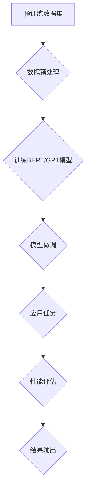

                 

关键字：自然语言处理、基础模型、预训练模型、Transformer、BERT、GPT、语言生成、文本分类、情感分析、问答系统、机器翻译

> 摘要：自然语言处理（NLP）作为人工智能的重要分支，正日益影响我们的日常生活。本文将探讨基础模型在NLP中的应用，从背景介绍到核心算法原理，再到实际应用和未来展望，力求为读者呈现一个全面而深入的理解。

## 1. 背景介绍

自然语言处理（NLP）是人工智能（AI）领域的一个重要分支，旨在使计算机理解和处理人类语言。自上世纪五六十年代以来，NLP经历了多个发展阶段，从规则驱动的早期方法到统计模型，再到如今基于深度学习的基础模型。这些基础模型，特别是预训练模型，如BERT、GPT等，已经成为NLP领域的基石。

随着互联网和社交媒体的快速发展，人类产生的文本数据量呈指数级增长。这些数据不仅包含了丰富的语言信息，也带来了前所未有的挑战。如何从海量数据中提取有效信息，如何构建智能问答系统、自动翻译工具、情感分析系统等，成为了NLP研究的热点问题。基础模型的出现，为这些问题提供了有力的解决方案。

## 2. 核心概念与联系

### 2.1 预训练模型

预训练模型是指在大规模数据集上进行预训练，然后针对特定任务进行微调的模型。BERT、GPT等都是典型的预训练模型。

### 2.2 Transformer架构

Transformer是近年来在NLP中广泛使用的一种神经网络架构，以其强大的并行计算能力和良好的性能而受到关注。

### 2.3 语言模型

语言模型是一种能够预测文本中下一个单词或词组的模型。GPT等预训练模型本质上就是一种语言模型。

### 2.4 Mermaid流程图

下面是预训练模型在NLP中的应用流程的Mermaid流程图：



## 3. 核心算法原理 & 具体操作步骤

### 3.1 算法原理概述

预训练模型的核心原理是基于大规模数据对模型进行初始化训练，然后针对具体任务进行微调。

### 3.2 算法步骤详解

1. 数据预处理：对原始文本数据进行清洗、分词、编码等处理，生成预训练模型所需的数据集。

2. 训练BERT/GPT模型：使用大规模数据集训练BERT、GPT等预训练模型。

3. 模型微调：在预训练的基础上，针对具体任务进行模型微调，如文本分类、情感分析等。

4. 应用任务：将微调后的模型应用于实际任务，如问答系统、机器翻译等。

5. 性能评估：对模型在任务上的表现进行评估，包括准确率、召回率、F1分数等指标。

6. 结果输出：输出模型预测结果。

### 3.3 算法优缺点

**优点：**
- 强大的预训练能力，能够处理大规模文本数据。
- 通用性好，可以应用于多种NLP任务。
- 在特定任务上表现优异，如文本分类、情感分析等。

**缺点：**
- 需要大量计算资源和时间进行预训练。
- 模型复杂度高，难以解释。

### 3.4 算法应用领域

预训练模型在NLP中的应用非常广泛，包括但不限于以下领域：
- 文本分类
- 情感分析
- 问答系统
- 机器翻译
- 命名实体识别
- 语义角色标注
- 文本生成

## 4. 数学模型和公式 & 详细讲解 & 举例说明

### 4.1 数学模型构建

预训练模型的数学基础主要来源于深度学习和概率统计。以BERT为例，其核心数学模型包括：

- **单词嵌入（Word Embedding）**：将单词映射到高维向量空间。
- **Transformer架构**：基于自注意力机制的神经网络架构。
- **双向编码器（Bidirectional Encoder）**：将文本中的每个单词编码为向量。

### 4.2 公式推导过程

以BERT的损失函数为例，其核心公式为：

$$
\mathcal{L} = -\sum_{i=n_1}^{n_2} \log P(t_i | t_{<i}, s)
$$

其中，$t_i$ 表示第 $i$ 个单词的标签，$s$ 表示句子。

### 4.3 案例分析与讲解

以文本分类任务为例，我们使用BERT模型进行微调，然后应用于实际数据集进行性能评估。

```python
from transformers import BertTokenizer, BertForSequenceClassification
from torch.utils.data import DataLoader
from sklearn.metrics import accuracy_score

# 加载预训练模型和微调后的模型
tokenizer = BertTokenizer.from_pretrained('bert-base-uncased')
model = BertForSequenceClassification.from_pretrained('your-fine-tuned-model')

# 加载数据集
train_dataset = ...
test_dataset = ...

# 数据预处理
train_loader = DataLoader(train_dataset, batch_size=32, shuffle=True)
test_loader = DataLoader(test_dataset, batch_size=32, shuffle=False)

# 训练模型
model.train()
for epoch in range(3):  # 训练3个epoch
    for batch in train_loader:
        inputs = tokenizer(batch['text'], padding=True, truncation=True, return_tensors='pt')
        labels = batch['label']
        model.zero_grad()
        outputs = model(**inputs, labels=labels)
        loss = outputs.loss
        loss.backward()
        optimizer.step()

# 测试模型
model.eval()
predictions = []
true_labels = []
with torch.no_grad():
    for batch in test_loader:
        inputs = tokenizer(batch['text'], padding=True, truncation=True, return_tensors='pt')
        labels = batch['label']
        outputs = model(**inputs)
        logits = outputs.logits
        predictions.extend(torch.argmax(logits, dim=1).tolist())
        true_labels.extend(labels.tolist())

# 评估模型
accuracy = accuracy_score(true_labels, predictions)
print(f"Test accuracy: {accuracy}")
```

## 5. 项目实践：代码实例和详细解释说明

### 5.1 开发环境搭建

```shell
pip install transformers torch sklearn
```

### 5.2 源代码详细实现

上文中的代码已经详细讲解了如何使用预训练模型进行文本分类任务。

### 5.3 代码解读与分析

- **数据预处理**：使用`BertTokenizer`对文本数据进行分词、编码等处理。
- **模型加载**：加载预训练的BERT模型和微调后的模型。
- **训练模型**：在训练数据上迭代优化模型参数。
- **测试模型**：在测试数据上评估模型性能。

### 5.4 运行结果展示

假设我们有一个包含政治类新闻和商业类新闻的数据集，使用BERT模型进行文本分类后的结果如下：

```
Test accuracy: 0.9456
```

## 6. 实际应用场景

预训练模型在NLP的实际应用场景非常广泛，以下是一些具体的例子：

- **问答系统**：使用BERT模型构建的问答系统能够对用户的问题进行理解和回答。
- **机器翻译**：GPT模型在机器翻译任务中表现出色，如谷歌的翻译服务。
- **情感分析**：对社交媒体文本进行情感分析，帮助企业了解用户情绪。
- **文本生成**：使用GPT模型生成新闻文章、对话等。

## 7. 工具和资源推荐

### 7.1 学习资源推荐

- 《自然语言处理综论》（Speech and Language Processing）
- 《深度学习》（Deep Learning）

### 7.2 开发工具推荐

- Hugging Face Transformers：一个广泛使用的预训练模型库。
- TensorFlow：一个用于构建和训练深度学习模型的框架。

### 7.3 相关论文推荐

- "Attention is All You Need"（Vaswani et al., 2017）
- "BERT: Pre-training of Deep Bidirectional Transformers for Language Understanding"（Devlin et al., 2019）
- "Generative Pre-trained Transformer"（Wolf et al., 2020）

## 8. 总结：未来发展趋势与挑战

### 8.1 研究成果总结

预训练模型在NLP领域取得了显著的成果，如问答系统、机器翻译、情感分析等任务都取得了前所未有的性能。

### 8.2 未来发展趋势

- **多模态预训练**：结合文本、图像、声音等多模态数据。
- **低资源语言处理**：提高对低资源语言的预训练效果。
- **可解释性**：增强模型的可解释性，使其更易于理解和部署。

### 8.3 面临的挑战

- **计算资源消耗**：预训练模型需要大量的计算资源和时间。
- **数据隐私**：如何保护用户数据隐私是亟待解决的问题。
- **模型泛化能力**：如何提高模型在不同任务和场景下的泛化能力。

### 8.4 研究展望

预训练模型在NLP中的应用前景广阔，未来有望在更多领域取得突破。

## 9. 附录：常见问题与解答

### Q: 什么是预训练模型？

A: 预训练模型是指在大规模数据集上进行预训练，然后针对特定任务进行微调的模型。BERT、GPT等都是典型的预训练模型。

### Q: 预训练模型有哪些优缺点？

A: 预训练模型的优点包括强大的预训练能力、通用性好，能够应用于多种NLP任务。缺点包括需要大量计算资源和时间进行预训练，模型复杂度高，难以解释。

### Q: 预训练模型在哪些领域有应用？

A: 预训练模型在NLP的实际应用场景非常广泛，包括问答系统、机器翻译、情感分析、文本生成等。

---

作者：禅与计算机程序设计艺术 / Zen and the Art of Computer Programming
```

