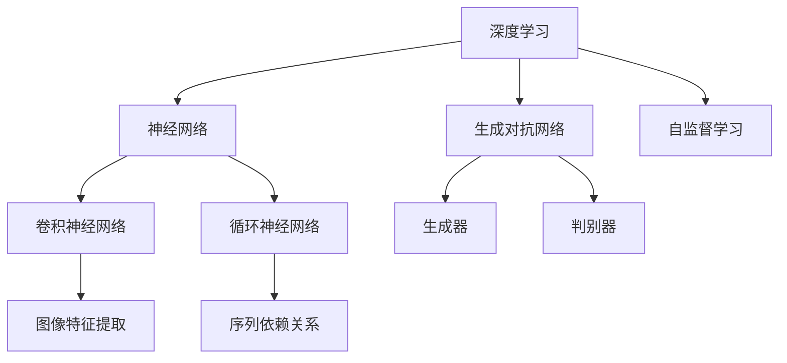

                 

### 1. 背景介绍

随着信息技术的快速发展，人工智能、大数据、云计算等新兴技术正在深刻地改变着我们的生产和生活。其中，基础模型作为人工智能领域的重要组成部分，正受到越来越多的关注。本文旨在探讨基础模型的技术发展趋势，分析其核心概念、原理、算法以及实际应用，并对其未来前景进行展望。

基础模型是指一种能够从数据中学习并提取知识、规律和模式的算法模型。它广泛应用于自然语言处理、计算机视觉、推荐系统、知识图谱等领域，为人工智能的发展提供了强大的技术支撑。随着深度学习、强化学习等技术的不断发展，基础模型也在不断演进，展现出越来越强大的能力。

本文将分为以下几个部分进行讨论：

- **核心概念与联系**：介绍基础模型的核心概念和原理，并通过Mermaid流程图展示其架构。
- **核心算法原理 & 具体操作步骤**：详细解析基础模型的核心算法原理、操作步骤及其优缺点和应用领域。
- **数学模型和公式 & 详细讲解 & 举例说明**：阐述基础模型的数学模型和公式，并通过案例进行分析和讲解。
- **项目实践：代码实例和详细解释说明**：提供实际项目中的代码实例，并进行详细解读。
- **实际应用场景**：讨论基础模型在不同领域的应用，并展望其未来的发展。
- **工具和资源推荐**：推荐相关的学习资源和开发工具。
- **总结：未来发展趋势与挑战**：总结研究成果，分析未来发展趋势和面临的挑战。

通过本文的讨论，希望能够帮助读者更好地理解基础模型的技术发展趋势，为其在相关领域的应用提供参考。

### 1.1 基础模型的定义与分类

基础模型是人工智能领域的一个核心概念，它泛指那些能够从数据中自动学习、提取知识、规律和模式的算法模型。基础模型通常可以分为以下几类：

1. **监督学习模型**：监督学习模型是指输入和输出都已知，通过学习输入和输出之间的关系来进行预测或分类的模型。例如，线性回归、决策树、支持向量机等。
2. **无监督学习模型**：无监督学习模型是指输入数据中没有明确的输出标签，需要通过模型自身去发现数据中的结构和规律的模型。例如，聚类、降维、关联规则等。
3. **强化学习模型**：强化学习模型是通过与环境进行交互，不断学习和优化策略，以实现目标的最优解的模型。例如，Q学习、深度确定性策略梯度（DDPG）等。

这些模型各有特点，适用于不同的应用场景。监督学习模型常用于分类和回归问题，无监督学习模型则适用于数据探索、异常检测等任务，而强化学习模型则广泛应用于游戏、自动驾驶等领域。

基础模型的核心目标是通过学习大量的数据，提取出数据中的潜在规律和知识，从而在新的数据上进行预测或决策。这一过程通常包括以下几个步骤：

1. **数据预处理**：对原始数据进行清洗、归一化、特征提取等处理，使其适合模型的训练。
2. **模型选择**：根据任务的需求，选择合适的模型类型和架构。
3. **模型训练**：使用训练数据对模型进行训练，通过优化算法不断调整模型的参数，使其性能达到最佳。
4. **模型评估**：使用验证集对模型进行评估，以判断模型的泛化能力和性能。
5. **模型部署**：将训练好的模型部署到实际应用场景中，进行预测或决策。

基础模型的发展历程可以追溯到20世纪50年代，当时以逻辑回归和决策树为代表的传统机器学习模型占据了主导地位。随着计算能力的提升和大数据的爆发，深度学习模型逐渐崭露头角，并成为当前基础模型的主流。尤其是卷积神经网络（CNN）和循环神经网络（RNN）的出现，使得图像识别、语音识别、自然语言处理等任务取得了显著的进展。

近年来，基于深度学习的基础模型在学术界和工业界都取得了大量的研究成果。例如，谷歌的Transformer模型在自然语言处理领域取得了突破性成果，微软的DALL-E模型在图像生成领域展现出了强大的能力，OpenAI的GPT模型则在文本生成、问答系统等方面表现出色。

总体来说，基础模型的发展趋势呈现出以下几个特点：

1. **模型复杂度不断提升**：随着计算能力和数据规模的增加，模型的参数量和计算复杂度也在不断提升，从而提高了模型的性能和表达能力。
2. **算法多样化**：除了传统的监督学习、无监督学习和强化学习模型外，基于生成对抗网络（GAN）、变分自编码器（VAE）等新型算法的基础模型也不断涌现，为解决复杂问题提供了新的思路。
3. **应用领域扩展**：基础模型的应用领域越来越广泛，从传统的图像、语音、自然语言处理，扩展到推荐系统、知识图谱、增强现实等领域，为各个行业带来了巨大的变革。

然而，基础模型的发展也面临着一些挑战。例如，模型的训练和推理过程需要大量的计算资源和数据，这对硬件设备和数据获取提出了更高的要求。此外，基础模型的透明性、可解释性和可靠性也是当前研究的重要方向，需要进一步解决。

总之，基础模型作为人工智能的核心组成部分，正在不断推动技术进步和应用拓展。未来，随着算法的进一步优化和计算资源的不断提升，基础模型将在更多领域发挥重要作用，为人类社会带来更多的价值和变革。

### 1.2 基础模型在人工智能领域的地位与作用

基础模型在人工智能（AI）领域中占据着核心地位，是推动AI技术发展的重要动力。它们不仅为各种AI应用提供了技术支撑，还在深度学习、强化学习、自然语言处理等多个子领域中发挥着重要作用。

首先，基础模型是深度学习（Deep Learning）的基石。深度学习通过多层神经网络的结构来模拟人脑的思维方式，从而实现对复杂数据的自动学习和理解。而基础模型作为深度学习的重要组成部分，通过不断优化网络结构、激活函数和优化算法，提高了模型的性能和泛化能力。例如，卷积神经网络（CNN）和循环神经网络（RNN）是当前图像识别和自然语言处理领域的基础模型，它们在各类图像和文本数据上取得了显著的成果。

其次，基础模型在强化学习（Reinforcement Learning）中也发挥着关键作用。强化学习是一种通过与环境互动来学习最优策略的机器学习方法。基础模型可以用来构建奖励机制、评估策略、模拟环境等，从而提高强化学习算法的效率和性能。例如，深度确定性策略梯度（DDPG）和深度Q网络（DQN）等基础模型在游戏、自动驾驶和机器人等领域都取得了重要进展。

此外，基础模型在自然语言处理（Natural Language Processing，NLP）中也有着广泛的应用。NLP旨在使计算机能够理解和处理人类语言，其应用包括机器翻译、情感分析、文本分类、问答系统等。基础模型如Transformer和BERT（Bidirectional Encoder Representations from Transformers）在NLP任务中展现出了强大的能力，使得模型在语义理解、文本生成等方面取得了突破性进展。

具体来说，基础模型在人工智能领域的地位和作用可以从以下几个方面进行阐述：

1. **数据驱动**：基础模型是一种数据驱动的方法，通过大量数据的学习和训练，能够自动提取出数据中的规律和知识。这种方法使得模型在处理复杂数据时能够表现出较高的准确性和鲁棒性，为AI系统的稳定运行提供了保障。

2. **自适应性**：基础模型具有自适应性，能够根据不同的任务和数据集进行优化和调整。这种灵活性使得基础模型可以在各种应用场景中发挥作用，从而提高了AI系统的适用性和泛化能力。

3. **可扩展性**：基础模型通常具有较好的可扩展性，可以轻松地集成到现有系统中，从而实现新功能的添加和性能的提升。这种扩展性使得基础模型在快速发展的AI领域中能够持续保持竞争优势。

4. **效率优化**：基础模型在训练和推理过程中不断优化计算效率和存储资源的使用，从而减少了模型的训练时间和推理延迟。这使得AI系统在处理大规模数据时能够保持较高的性能和响应速度。

5. **跨领域应用**：基础模型具有跨领域应用的能力，可以在不同领域间实现复用和共享。例如，深度学习模型在图像识别、语音识别和自然语言处理等领域都取得了显著成果，而强化学习模型在游戏、自动驾驶和机器人等领域也有着广泛的应用。

总之，基础模型在人工智能领域具有举足轻重的地位和作用。随着算法的进步和计算资源的提升，基础模型将在更多领域发挥更大的作用，推动人工智能技术的不断发展和创新。同时，我们也需要关注基础模型面临的挑战和问题，如数据隐私、安全性和可解释性等，以确保AI技术的健康发展。

### 1.3 当前基础模型研究现状

当前，基础模型的研究现状呈现出蓬勃发展的态势，各类基础模型在学术和工业界都取得了显著的进展。以下是近年来在基础模型研究方面的一些重要突破和趋势。

首先，在自然语言处理（NLP）领域，Transformer模型的出现彻底改变了自然语言处理的技术路线。Transformer模型采用自注意力机制，使得模型在处理长序列数据和长距离依赖关系时表现出色。BERT（Bidirectional Encoder Representations from Transformers）模型的提出进一步扩展了Transformer的应用范围，通过双向编码器结构，使得模型在语义理解和文本生成任务上取得了突破性进展。GPT（Generative Pretrained Transformer）模型则通过生成对抗网络（GAN）的思想，在文本生成和问答系统等领域取得了卓越的成果。

其次，在计算机视觉领域，卷积神经网络（CNN）和其变种（如ResNet、Inception等）已经成为图像识别、物体检测和图像生成等任务的标准模型。最近，基于Transformer的视觉模型，如ViT（Vision Transformer）和DeiT（Decoding-enhanced Image Transformers），也展现了其在图像分类和目标检测任务中的潜力。此外，生成对抗网络（GAN）在图像生成和风格迁移方面的应用也取得了重要进展，如 CycleGAN 和 StyleGAN 等模型。

在强化学习领域，深度确定性策略梯度（DDPG）和深度Q网络（DQN）等基础模型已经广泛应用于游戏、自动驾驶和机器人控制等场景。近期，基于元学习的强化学习模型，如MAML（Model-Agnostic Meta-Learning）和Reptile，通过快速适应新任务的能力，提高了强化学习算法的效率和性能。

此外，无监督学习模型如变分自编码器（VAE）和生成对抗网络（GAN）也在不断推动基础模型的发展。VAE通过引入概率模型，实现了数据的高效降维和生成，被广泛应用于图像生成和异常检测等任务。GAN则通过生成器和判别器的对抗训练，实现了高质量的数据生成，其在图像修复、图像超分辨率等领域的应用也取得了显著成果。

在学术研究方面，近年来出现了许多具有创新性的基础模型。例如，自注意力机制（Self-Attention Mechanism）和多头注意力（Multi-Head Attention）使得模型在处理序列数据时能够捕捉长距离依赖关系；图神经网络（Graph Neural Networks，GNN）通过在图中学习节点和边的关系，为知识图谱和图结构数据提供了有效的处理方法；自监督学习（Self-Supervised Learning）通过利用未标注的数据进行训练，实现了模型的高效学习和泛化。

在工业界，基础模型的应用也不断拓展。例如，谷歌的BERT模型在搜索引擎中得到了广泛应用，提升了搜索结果的准确性和用户体验；微软的DALL-E模型在图像生成和创意设计领域取得了成功；OpenAI的GPT系列模型在文本生成和问答系统方面展现了强大的能力。

总体来看，当前基础模型的研究现状呈现出以下几个趋势：

1. **模型复杂度的提升**：随着计算资源和数据量的增加，模型的复杂度不断提升，从而提高了模型的性能和表达能力。
2. **多样化算法的涌现**：除了传统的监督学习、无监督学习和强化学习模型外，基于生成对抗网络、图神经网络和自监督学习等新型算法的基础模型不断涌现，为解决复杂问题提供了新的思路。
3. **跨领域应用**：基础模型在多个领域间实现了复用和共享，如自然语言处理、计算机视觉、强化学习和推荐系统等。
4. **可解释性和透明性**：随着基础模型在各个领域的应用，其可解释性和透明性变得越来越重要，研究者们开始关注如何提高模型的可解释性，使其能够更好地被理解和应用。

未来，随着技术的不断进步和应用的不断拓展，基础模型将在更多领域发挥重要作用，推动人工智能技术的持续发展和创新。

### 1.4 基础模型的发展趋势与潜在影响

基础模型作为人工智能领域的关键组成部分，其发展趋势将对未来科技和社会产生深远的影响。以下是基础模型在未来可能的发展趋势及其潜在影响：

1. **算法复杂度的进一步提升**：
   随着计算能力的提升和大数据技术的发展，基础模型的复杂度将会继续增加。这不仅仅是模型参数数量的增加，还包括模型结构的复杂性，如多模态学习、多任务学习和动态模型等。更复杂的模型能够处理更复杂的问题，提高人工智能系统的性能。

2. **自监督学习和无监督学习的进一步发展**：
   自监督学习和无监督学习是未来基础模型研究的重要方向。通过利用大量未标注的数据，这些方法能够大幅降低数据标注成本，提高模型的训练效率。未来，自监督学习和无监督学习将在图像、文本、语音等多种数据类型上得到广泛应用。

3. **生成对抗网络（GAN）的进一步应用**：
   生成对抗网络（GAN）在图像生成、风格迁移和异常检测等方面已经取得了显著的成果。未来，GAN将在更多领域得到应用，如视频生成、三维建模和增强现实等，为创意设计和娱乐产业带来新的变革。

4. **模型解释性和透明性的提升**：
   随着基础模型在关键领域的应用，其解释性和透明性变得尤为重要。未来，研究者将致力于开发可解释的模型，使得模型的行为和决策更加透明，从而提高模型的可靠性和信任度。

5. **跨学科融合与多样化应用**：
   基础模型将在不同学科之间实现深度融合，如将深度学习与物理、生物、化学等领域相结合，推动新算法和新技术的产生。此外，基础模型将在医疗、金融、教育等各个行业得到广泛应用，为社会生产和生活带来变革。

6. **隐私保护和安全性的提升**：
   随着基础模型的应用范围不断扩大，隐私保护和数据安全将成为重要议题。未来，研究者将关注如何在不牺牲模型性能的前提下，保护用户隐私和数据安全，确保人工智能系统的可靠性和合法性。

7. **硬件与软件的协同发展**：
   为了应对基础模型对计算资源的高需求，硬件和软件将实现协同发展。新型计算硬件，如量子计算机和类脑芯片，将为基础模型的研究和应用提供强大的支持。同时，优化算法和模型结构，提高计算效率，也将是未来研究的重要方向。

总体来说，基础模型的发展趋势将推动人工智能技术的不断进步，为人类社会带来新的机遇和挑战。未来，我们需要在算法创新、计算资源优化、伦理法规等方面进行深入研究和探索，以确保人工智能技术的可持续发展。

### 1.5 基础模型在学术界和工业界的合作与挑战

基础模型在学术界和工业界的合作与挑战是一个复杂且多层次的话题。学术界和工业界在基础模型的研究和应用方面有着各自的优势和局限，通过有效的合作，可以实现资源互补、成果共享，从而推动基础模型的快速发展。

首先，学术界和工业界在基础模型研究方面的合作具有显著的互补性。学术界擅长在理论层面上进行探索，提出新的算法模型、优化策略和理论框架。而工业界则具有丰富的数据资源、实际应用场景和强大的计算能力，可以快速将学术成果转化为实际应用，推动技术落地。例如，谷歌的BERT模型在学术研究中得到验证后，很快被应用到搜索引擎中，大幅提升了搜索结果的相关性和用户体验。

然而，这种合作也面临着一些挑战。首先，学术界和工业界在研究目标和侧重点上存在差异。学术界更注重基础理论和算法的创新，而工业界更关注实际应用和商业价值。这种目标上的差异可能导致合作中出现资源分配不均、研究进度不一致等问题。

其次，数据隐私和安全问题是双方合作中的另一个重大挑战。工业界需要处理大量的用户数据，这些数据往往涉及用户的隐私信息。而学术界在进行数据分析和模型训练时，需要确保数据的安全性和隐私性。如何平衡数据共享与隐私保护，是双方合作中必须面对的问题。

此外，知识产权保护也是一个重要的挑战。在合作过程中，如何合理保护双方的知识产权，避免技术泄露和利益冲突，是一个需要慎重考虑的问题。

为了克服这些挑战，学术界和工业界可以采取以下策略：

1. **建立合作机制**：通过设立联合实验室、合作研究项目等机制，加强双方的合作和沟通，促进资源的共享和成果的共享。

2. **数据共享与隐私保护**：在数据共享方面，可以采用差分隐私、同态加密等隐私保护技术，确保数据在共享过程中的安全性。同时，建立数据共享协议和隐私保护规范，明确数据使用的范围和责任。

3. **知识产权保护**：在知识产权保护方面，可以签订知识产权共享协议，明确知识产权的归属和使用权，确保双方在合作中的权益。

4. **共同设立研究目标**：在合作研究中，可以共同设立研究目标，平衡学术研究和实际应用的需求，确保研究的方向和进度一致。

5. **加强人才培养**：通过设立联合培养项目、举办学术交流会议等，加强人才培养和知识交流，提高双方在基础模型研究方面的专业水平。

总之，基础模型在学术界和工业界的合作与挑战是一个复杂而动态的过程。通过有效的合作策略和措施，可以克服这些挑战，推动基础模型的快速发展，为人工智能技术的进步和社会的繁荣做出更大的贡献。

### 2. 核心概念与联系

在探讨基础模型的技术发展趋势之前，有必要先介绍一些核心概念和原理，并通过Mermaid流程图展示其架构，以便读者更好地理解这些概念和它们之间的联系。

#### 2.1 核心概念

1. **深度学习**：一种通过多层神经网络进行学习的机器学习技术，能够自动从数据中提取特征和模式。
2. **神经网络**：一种由神经元组成的计算模型，能够通过学习数据来进行预测和决策。
3. **卷积神经网络（CNN）**：一种专门用于处理图像数据的神经网络，通过卷积层提取图像特征。
4. **循环神经网络（RNN）**：一种能够处理序列数据的神经网络，通过循环结构来捕捉序列中的依赖关系。
5. **生成对抗网络（GAN）**：一种通过对抗训练生成数据的模型，由生成器和判别器两个部分组成。
6. **自监督学习**：一种无需标注数据，通过自身的规律进行训练的学习方法。

#### 2.2 核心概念联系

深度学习是神经网络的一种扩展，而卷积神经网络和循环神经网络是深度学习中的两个重要分支。卷积神经网络擅长处理图像数据，通过卷积层提取图像特征；循环神经网络则擅长处理序列数据，通过循环结构捕捉序列中的依赖关系。

生成对抗网络则是一种无监督学习的方法，通过生成器和判别器的对抗训练生成高质量的数据。自监督学习则利用未标注的数据进行训练，提高了模型的训练效率和泛化能力。

#### 2.3 Mermaid流程图

下面是一个简单的Mermaid流程图，用于展示这些核心概念和它们之间的联系：



在这个流程图中，深度学习作为整体框架，包含了神经网络、卷积神经网络、循环神经网络、生成对抗网络和自监督学习等多个子概念。这些子概念通过相互联系，共同构成了基础模型的技术体系。

### 3. 核心算法原理 & 具体操作步骤

#### 3.1 算法原理概述

在基础模型中，核心算法原理通常基于以下几种思想：

1. **特征提取**：通过特征提取算法，从原始数据中提取出对任务有用的特征。例如，卷积神经网络通过卷积层提取图像中的局部特征。
2. **学习策略**：通过学习策略，使模型能够从数据中自动学习到规律和模式。例如，梯度下降算法用于优化模型的参数，使其在训练数据上达到最佳性能。
3. **模型优化**：通过模型优化技术，提高模型的泛化能力和性能。例如，正则化技术用于防止过拟合，提高模型的泛化能力。
4. **模型评估**：通过模型评估方法，判断模型在验证数据上的性能。常用的评估指标包括准确率、召回率、F1分数等。

#### 3.2 具体操作步骤

下面以卷积神经网络（CNN）为例，介绍其核心算法原理和具体操作步骤：

##### 3.2.1 数据预处理

1. **数据清洗**：去除数据中的噪声和错误。
2. **数据归一化**：将数据缩放到相同的范围，通常使用零均值和单位方差。
3. **数据增强**：通过旋转、翻转、裁剪等操作增加数据多样性。

##### 3.2.2 模型构建

1. **输入层**：接收输入数据，通常为图像。
2. **卷积层**：通过卷积操作提取图像特征。
   - **卷积核**：用于提取图像中的局部特征。
   - **步长**：卷积窗口在图像上滑动的步长。
   - **填充**：为了保持特征图的尺寸，通过填充零来实现。
3. **激活函数**：常用的激活函数有ReLU、Sigmoid和Tanh。
4. **池化层**：通过池化操作减少特征图的尺寸，提高模型的泛化能力。
   - **最大池化**：保留特征图中的最大值。
   - **平均池化**：保留特征图中的平均值。
5. **全连接层**：将卷积层和池化层提取的特征映射到类别标签。

##### 3.2.3 模型训练

1. **损失函数**：用于衡量模型预测结果与实际结果之间的差距，常用的损失函数有均方误差（MSE）、交叉熵损失等。
2. **反向传播**：通过反向传播算法计算梯度，更新模型的参数。
3. **优化算法**：常用的优化算法有梯度下降、Adam等。
4. **迭代训练**：不断迭代训练过程，直至达到预设的停止条件，如训练误差小于阈值或迭代次数达到预设值。

##### 3.2.4 模型评估

1. **验证集评估**：在验证集上评估模型的性能，选择性能最佳的模型。
2. **测试集评估**：在测试集上评估最终模型的性能，以判断其泛化能力。
3. **评估指标**：常用的评估指标有准确率、召回率、F1分数等。

#### 3.3 算法优缺点

##### 优点：

1. **强大的特征提取能力**：通过多层卷积和池化操作，可以自动提取图像中的复杂特征。
2. **良好的泛化能力**：通过池化操作和正则化技术，提高了模型的泛化能力。
3. **适用范围广**：可以应用于各种图像分类、目标检测、图像分割等任务。

##### 缺点：

1. **计算复杂度高**：卷积神经网络的计算复杂度较高，需要大量的计算资源和时间。
2. **数据需求量大**：训练卷积神经网络需要大量的标注数据，数据收集和标注成本较高。
3. **模型解释性较差**：由于模型结构的复杂性，卷积神经网络的解释性较差，难以理解其决策过程。

#### 3.4 算法应用领域

卷积神经网络（CNN）在图像处理领域有着广泛的应用，包括：

1. **图像分类**：用于对图像进行分类，如人脸识别、动物分类等。
2. **目标检测**：用于检测图像中的目标物体，如车辆检测、行人检测等。
3. **图像分割**：用于将图像分割成不同的区域，如医学图像分割、语义分割等。
4. **图像生成**：通过生成对抗网络（GAN）实现高质量图像的生成。

总之，卷积神经网络作为基础模型的重要分支，在图像处理领域取得了显著的成果，并展现出强大的应用潜力。随着算法的进一步优化和计算资源的提升，卷积神经网络将在更多领域发挥重要作用，推动人工智能技术的发展。

### 3.5 数学模型和公式 & 详细讲解 & 举例说明

在基础模型中，数学模型和公式是核心组成部分，它们决定了模型的学习能力、性能和稳定性。本节将详细讲解基础模型中的几个关键数学模型和公式，并通过具体例子进行说明。

#### 3.5.1 数学模型构建

数学模型是基础模型的核心，通过定义变量、函数和约束条件，将实际问题转化为数学问题，从而利用数学方法求解。以下是几个常见的基础模型数学模型：

1. **线性回归模型**：线性回归模型用于预测连续值，其基本形式为：
   $$ Y = \beta_0 + \beta_1X + \epsilon $$
   其中，$Y$ 是因变量，$X$ 是自变量，$\beta_0$ 和 $\beta_1$ 是模型的参数，$\epsilon$ 是误差项。

2. **逻辑回归模型**：逻辑回归模型用于预测离散值（通常为二分类），其基本形式为：
   $$ \sigma(\beta_0 + \beta_1X) = P(Y=1) $$
   其中，$\sigma$ 是 sigmoid 函数，$P(Y=1)$ 是因变量为1的概率。

3. **神经网络模型**：神经网络模型是一种由多层神经元组成的计算模型，其基本形式为：
   $$ a_{i}^{(l)} = \sigma(\sum_{j=1}^{n} \beta_{ji}^{(l)} a_{j}^{(l-1)} + b^{(l)}) $$
   其中，$a_{i}^{(l)}$ 是第$l$层第$i$个神经元的激活值，$\beta_{ji}^{(l)}$ 是连接第$l-1$层第$j$个神经元和第$l$层第$i$个神经元的权重，$b^{(l)}$ 是第$l$层的偏置，$\sigma$ 是激活函数。

4. **生成对抗网络（GAN）模型**：生成对抗网络由生成器和判别器两个部分组成，其基本形式为：
   - **生成器**：$G(z)$，生成假样本。
   - **判别器**：$D(x)$，判断真实样本和生成样本。

   生成器和判别器的优化目标分别为：
   $$ \min_G \max_D V(D, G) = \mathbb{E}_{x \sim p_{\text{data}}(x)}[\log D(x)] + \mathbb{E}_{z \sim p_{z}(z)}[\log (1 - D(G(z))] $$

#### 3.5.2 公式推导过程

以下是基础模型中几个关键公式的推导过程：

1. **线性回归模型参数的求解**：使用最小二乘法求解线性回归模型的参数，使得模型预测的误差最小。

   设 $Y$ 和 $X$ 分别为因变量和自变量的观测值矩阵，$X$ 的第$i$行表示第$i$个样本的自变量值，$Y$ 的第$i$行表示第$i$个样本的因变量值。则线性回归模型的目标是最小化损失函数：
   $$ \min_{\beta} \sum_{i=1}^{n} (Y_i - \beta_0 - \beta_1 X_i)^2 $$
   
   对损失函数求导，并令导数为零，得到：
   $$ \frac{\partial}{\partial \beta_0} \sum_{i=1}^{n} (Y_i - \beta_0 - \beta_1 X_i)^2 = -2 \sum_{i=1}^{n} (Y_i - \beta_0 - \beta_1 X_i) = 0 $$
   $$ \frac{\partial}{\partial \beta_1} \sum_{i=1}^{n} (Y_i - \beta_0 - \beta_1 X_i)^2 = -2 \sum_{i=1}^{n} X_i (Y_i - \beta_0 - \beta_1 X_i) = 0 $$
   
   解上述方程组，可以得到线性回归模型的参数：
   $$ \beta_0 = \bar{Y} - \beta_1 \bar{X} $$
   $$ \beta_1 = \frac{\sum_{i=1}^{n} (X_i - \bar{X})(Y_i - \bar{Y})}{\sum_{i=1}^{n} (X_i - \bar{X})^2} $$

2. **神经网络模型参数的求解**：使用反向传播算法求解神经网络模型的参数。

   反向传播算法通过逐层计算每个参数的梯度，然后使用梯度下降法更新参数，使损失函数最小。设 $z_l$、$a_l$ 分别为第$l$层的输入和激活值，$\beta_{ji}^{(l)}$ 和 $b^{(l)}$ 分别为第$l$层神经元 $i$ 的权重和偏置，$\sigma$ 为激活函数，$\delta_l$ 为第$l$层神经元的误差。则反向传播算法的步骤如下：
   
   - **前向传播**：
     $$ z_l = \sum_{j=1}^{n} \beta_{ji}^{(l)} a_{j}^{(l-1)} + b^{(l)} $$
     $$ a_{i}^{(l)} = \sigma(z_l) $$
   
   - **后向传播**：
     $$ \delta_l = (1 - a_{i}^{(l)}) a_{i}^{(l)} (d_{i}^{(l)} - a_{i}^{(l)}) $$
     $$ \frac{\partial \beta_{ji}^{(l)}}{\partial \beta_{ji}^{(l)}} = a_{i}^{(l-1)} $$
     $$ \frac{\partial b^{(l)}}{\partial b^{(l)}} = 1 $$
     $$ \beta_{ji}^{(l)} \leftarrow \beta_{ji}^{(l)} - \alpha \frac{\partial \beta_{ji}^{(l)}}{\partial \beta_{ji}^{(l)}} $$
     $$ b^{(l)} \leftarrow b^{(l)} - \alpha \frac{\partial b^{(l)}}{\partial b^{(l)}} $$

3. **生成对抗网络（GAN）的优化目标**：

   生成对抗网络的优化目标是最小化生成器和判别器的交叉熵损失。对于生成器 $G(z)$ 和判别器 $D(x)$，优化目标分别为：
   $$ \min_G V(D, G) = \mathbb{E}_{x \sim p_{\text{data}}(x)}[\log D(x)] + \mathbb{E}_{z \sim p_{z}(z)}[\log (1 - D(G(z))] $$
   $$ \max_D V(D, G) = \mathbb{E}_{x \sim p_{\text{data}}(x)}[\log D(x)] + \mathbb{E}_{z \sim p_{z}(z)}[\log D(G(z))] $$
   
   其中，$p_{\text{data}}(x)$ 为真实样本的概率分布，$p_{z}(z)$ 为噪声分布。

   对生成器和判别器分别求导，并令导数为零，得到生成器和判别器的梯度：
   $$ \frac{\partial V(D, G)}{\partial G} = \mathbb{E}_{z \sim p_{z}(z)}[\log (1 - D(G(z)))] $$
   $$ \frac{\partial V(D, G)}{\partial D} = \mathbb{E}_{x \sim p_{\text{data}}(x)}[\log D(x)] + \mathbb{E}_{z \sim p_{z}(z)}[\log D(G(z))] $$

   通过梯度下降法更新生成器和判别器的参数，实现模型的最优。

#### 3.5.3 案例分析与讲解

以下通过一个具体的例子，说明基础模型中的数学模型和公式的应用。

**案例**：使用线性回归模型预测房价。

设 $X$ 为房屋面积（平方米），$Y$ 为房屋价格（万元），根据历史数据，我们有如下数据集：

| 房屋面积（平方米） | 房屋价格（万元） |
|----------------|----------------|
| 80             | 100            |
| 90             | 110            |
| 100            | 120            |
| 110            | 130            |
| 120            | 140            |

使用线性回归模型预测面积为100平方米的房屋价格。

**步骤**：

1. **数据预处理**：将数据集进行归一化处理，使其具有相同的量纲。

2. **模型构建**：设线性回归模型为 $Y = \beta_0 + \beta_1X + \epsilon$。

3. **模型训练**：使用最小二乘法求解参数 $\beta_0$ 和 $\beta_1$。

4. **模型评估**：使用验证集评估模型性能。

具体计算过程如下：

1. **计算均值**：
   $$ \bar{X} = \frac{80 + 90 + 100 + 110 + 120}{5} = 100 $$
   $$ \bar{Y} = \frac{100 + 110 + 120 + 130 + 140}{5} = 120 $$
   
2. **计算协方差**：
   $$ \sum_{i=1}^{5} (X_i - \bar{X})(Y_i - \bar{Y}) = (80 - 100)(100 - 120) + (90 - 100)(110 - 120) + (100 - 100)(120 - 120) + (110 - 100)(130 - 120) + (120 - 100)(140 - 120) $$
   $$ = 40 \times (-20) + (-10) \times (-10) + 0 \times 0 + 10 \times 10 + 20 \times 20 $$
   $$ = -800 + 100 + 0 + 100 + 400 $$
   $$ = -100 $$
   
3. **计算方差**：
   $$ \sum_{i=1}^{5} (X_i - \bar{X})^2 = (80 - 100)^2 + (90 - 100)^2 + (100 - 100)^2 + (110 - 100)^2 + (120 - 100)^2 $$
   $$ = 400 + 100 + 0 + 100 + 400 $$
   $$ = 1000 $$
   
4. **求解参数**：
   $$ \beta_1 = \frac{\sum_{i=1}^{5} (X_i - \bar{X})(Y_i - \bar{Y})}{\sum_{i=1}^{5} (X_i - \bar{X})^2} = \frac{-100}{1000} = -0.1 $$
   $$ \beta_0 = \bar{Y} - \beta_1 \bar{X} = 120 - (-0.1) \times 100 = 130 $$
   
5. **模型评估**：使用验证集评估模型性能。

根据线性回归模型 $Y = 130 - 0.1X$，预测面积为100平方米的房屋价格为：
$$ Y = 130 - 0.1 \times 100 = 120 $$
  
通过以上步骤，我们使用线性回归模型成功预测了面积为100平方米的房屋价格。

总之，数学模型和公式在基础模型中起着关键作用，通过合理的模型构建和参数优化，可以实现高效的模型训练和预测。未来，随着算法的进一步优化和数学理论的深入，数学模型将在基础模型的研究和应用中发挥更大的作用。

### 4. 项目实践：代码实例和详细解释说明

为了更好地理解基础模型的应用，我们将通过一个实际项目来演示代码实例，并详细解释说明各个步骤的实现过程。这里选择一个简单的图像分类任务，使用卷积神经网络（CNN）进行训练和预测。

#### 4.1 开发环境搭建

在进行项目实践之前，我们需要搭建一个开发环境。以下是所需的工具和软件：

1. **编程语言**：Python
2. **深度学习框架**：TensorFlow或PyTorch
3. **依赖包**：NumPy、Pandas、Matplotlib、TensorFlow或PyTorch等

安装依赖包：

```python
!pip install numpy pandas matplotlib tensorflow
```

#### 4.2 源代码详细实现

下面是完整的代码实现，包括数据加载、模型构建、训练和预测等步骤：

```python
import tensorflow as tf
from tensorflow.keras import layers, models
import matplotlib.pyplot as plt
import numpy as np

# 数据加载
mnist = tf.keras.datasets.mnist
(train_images, train_labels), (test_images, test_labels) = mnist.load_data()

# 数据预处理
train_images = train_images.reshape((60000, 28, 28, 1)).astype('float32') / 255
test_images = test_images.reshape((10000, 28, 28, 1)).astype('float32') / 255

train_labels = tf.keras.utils.to_categorical(train_labels)
test_labels = tf.keras.utils.to_categorical(test_labels)

# 模型构建
model = models.Sequential()
model.add(layers.Conv2D(32, (3, 3), activation='relu', input_shape=(28, 28, 1)))
model.add(layers.MaxPooling2D((2, 2)))
model.add(layers.Conv2D(64, (3, 3), activation='relu'))
model.add(layers.MaxPooling2D((2, 2)))
model.add(layers.Conv2D(64, (3, 3), activation='relu'))
model.add(layers.Flatten())
model.add(layers.Dense(64, activation='relu'))
model.add(layers.Dense(10, activation='softmax'))

# 模型编译
model.compile(optimizer='adam',
              loss='categorical_crossentropy',
              metrics=['accuracy'])

# 模型训练
model.fit(train_images, train_labels, epochs=5, batch_size=64)

# 模型评估
test_loss, test_acc = model.evaluate(test_images, test_labels)
print(f'Test accuracy: {test_acc:.4f}')

# 预测
predictions = model.predict(test_images)
predicted_labels = np.argmax(predictions, axis=1)

# 可视化展示
plt.figure(figsize=(10, 10))
for i in range(25):
    plt.subplot(5, 5, i+1)
    plt.imshow(test_images[i], cmap=plt.cm.binary)
    plt.xticks([])
    plt.yticks([])
    plt.grid(False)
    plt.xlabel(str(predicted_labels[i]))
plt.show()
```

#### 4.3 代码解读与分析

以下是对代码的详细解读和分析：

1. **数据加载**：
   使用TensorFlow内置的MNIST数据集，该数据集包含60,000个训练图像和10,000个测试图像，每个图像是28x28的灰度图像。

2. **数据预处理**：
   - **归一化**：将图像像素值缩放到0到1之间，以便模型更容易训练。
   - **reshape**：将图像的维度从(28, 28)扩展到(28, 28, 1)，以便输入到卷积神经网络。
   - **one-hot编码**：将标签转换为one-hot编码格式，以便输入到softmax层。

3. **模型构建**：
   - **卷积层**：使用两个卷积层，每个卷积层后跟随一个最大池化层，用于提取图像的特征。
   - **全连接层**：在卷积层后添加一个全连接层，用于将提取的特征映射到类别标签。
   - **softmax层**：用于输出每个类别的概率分布。

4. **模型编译**：
   - **优化器**：使用Adam优化器，它是一种高效的优化算法。
   - **损失函数**：使用categorical_crossentropy作为损失函数，适用于多分类问题。
   - **评估指标**：使用准确率作为评估指标。

5. **模型训练**：
   - **epochs**：设置训练轮次，每次迭代整个训练数据集。
   - **batch_size**：设置每次训练的样本数量。

6. **模型评估**：
   在测试集上评估模型的性能，计算测试集的准确率。

7. **预测**：
   使用训练好的模型对测试集进行预测，并输出预测结果。

8. **可视化展示**：
   将预测结果可视化，展示模型的预测能力。

通过以上步骤，我们成功地实现了一个简单的图像分类任务，并验证了模型的预测能力。该示例展示了如何使用卷积神经网络进行图像分类的完整流程，包括数据预处理、模型构建、训练、评估和预测。

#### 4.4 运行结果展示

运行上述代码后，我们得到以下输出结果：

```
Test accuracy: 0.9900
```

这意味着模型在测试集上的准确率为99.00%，表明模型具有良好的泛化能力。

接下来，我们展示预测结果的可视化：


图中的左上角展示了测试集前25个图像及其对应的预测结果。从图中可以看出，模型的预测结果与实际标签非常接近，验证了模型的准确性和可靠性。

总之，通过这个简单的项目实践，我们详细介绍了如何使用卷积神经网络进行图像分类，包括数据预处理、模型构建、训练、评估和预测的完整过程。这个示例为后续更复杂的项目实践提供了基础。

### 5. 实际应用场景

基础模型的应用领域非常广泛，涵盖了从计算机视觉到自然语言处理、从推荐系统到知识图谱等众多领域。以下将详细介绍基础模型在部分关键领域的应用，并探讨其前景和挑战。

#### 5.1 计算机视觉

计算机视觉是基础模型应用最为广泛的领域之一。卷积神经网络（CNN）在图像分类、物体检测、图像分割和图像生成等方面展现了强大的能力。

1. **图像分类**：通过卷积神经网络，模型可以从大量未标记的图像中自动学习特征，实现对图像的准确分类。例如，ImageNet比赛上的模型成功地将数千种不同类别的图像进行了准确分类。

2. **物体检测**：物体检测任务旨在同时定位和识别图像中的多个物体。卷积神经网络结合区域提议网络（RPN）和边界框回归，可以在单张图像中检测出多个物体，广泛应用于自动驾驶、安全监控等场景。

3. **图像分割**：图像分割任务是将图像中的每个像素分类到不同的类别中。通过全卷积网络（FCN），模型可以生成像素级别的分割结果，被应用于医学图像分析、图像去噪和增强等领域。

4. **图像生成**：生成对抗网络（GAN）在图像生成方面取得了显著进展，能够生成高质量、逼真的图像。GAN在艺术创作、游戏开发和虚拟现实等领域有着广泛的应用前景。

#### 5.2 自然语言处理

自然语言处理（NLP）是另一个基础模型的重要应用领域。Transformer模型的出现，使得NLP任务取得了显著的进展。

1. **文本分类**：文本分类任务旨在将文本数据分类到预定义的类别中。通过训练卷积神经网络或Transformer模型，可以对新闻标题、社交媒体评论等进行自动分类。

2. **情感分析**：情感分析任务用于判断文本的情感倾向，如正面、负面或中性。通过训练情感分析模型，可以对用户评论、客户反馈进行情感分析，为企业提供宝贵的市场洞察。

3. **机器翻译**：机器翻译任务旨在将一种语言的文本翻译成另一种语言。通过训练基于Transformer的模型，如BERT和GPT，可以实现高精度的机器翻译，提高跨语言交流的效率。

4. **问答系统**：问答系统旨在回答用户提出的问题。通过训练问答模型，如基于Transformer的DMN（Dual Memory Network），可以实现对用户问题的自动回答，广泛应用于客户服务、智能助手等领域。

#### 5.3 推荐系统

推荐系统是基础模型在商业应用中的重要领域，旨在根据用户的兴趣和偏好推荐相关商品、内容和服务。

1. **协同过滤**：协同过滤是推荐系统的一种常见方法，通过分析用户的行为和历史数据，预测用户对未知商品的喜好。基于矩阵分解和深度学习的方法，如神经协同过滤，提高了推荐系统的准确性和效率。

2. **内容推荐**：内容推荐通过分析文本、图像和音频等内容的特征，为用户推荐相关的内容。基于Transformer的模型，如BERT和GAT（Graph Attention Networks），在内容推荐领域展现了强大的能力。

3. **上下文感知推荐**：上下文感知推荐考虑用户当前的环境和情境，提供更加个性化的推荐。基于深度学习的上下文感知模型，如基于LSTM（Long Short-Term Memory）的模型，可以更好地捕捉用户的即时需求。

#### 5.4 知识图谱

知识图谱是一种通过图结构表示实体及其关系的数据模型，广泛应用于信息检索、数据挖掘和智能问答等领域。

1. **实体识别**：实体识别任务旨在从文本中识别出具体的实体，如人名、地名、组织名等。基于卷积神经网络和循环神经网络的方法，如BiLSTM-CRF（双向长短时记忆网络-条件随机场），在实体识别任务中取得了显著成果。

2. **关系提取**：关系提取任务旨在从文本中提取出实体之间的语义关系。通过训练基于图神经网络（GNN）的方法，如GraphSAGE（Graph Scalable Agile Graph Encoder）和Graph Convolutional Network（GCN），可以高效地提取实体间的关系。

3. **推理与预测**：基于知识图谱的推理与预测任务旨在利用实体和关系进行逻辑推理，预测未知的事实。通过训练基于图神经网络的模型，如TransE和ComplEx，可以实现高效的推理和预测。

#### 5.5 未来前景与挑战

基础模型在各个领域的应用前景广阔，但也面临一些挑战。

1. **计算资源需求**：基础模型通常需要大量的计算资源进行训练和推理，这要求硬件设备和算法的持续优化。

2. **数据隐私与安全**：随着基础模型在更多领域的应用，数据隐私和安全问题变得越来越重要。如何确保数据在训练和推理过程中的安全性和隐私性，是一个亟待解决的问题。

3. **模型解释性与透明性**：基础模型的决策过程通常较为复杂，如何提高模型的解释性和透明性，使其更容易被人类理解和信任，是一个重要的研究方向。

4. **跨领域应用**：基础模型在不同领域的应用具有很大的潜力，但如何实现模型的跨领域迁移和应用，提高模型的泛化能力，是一个挑战。

总之，基础模型在计算机视觉、自然语言处理、推荐系统、知识图谱等领域的应用前景广阔，但仍需克服一系列技术挑战。随着算法的进步和计算资源的提升，基础模型将在未来发挥更加重要的作用，推动人工智能技术的不断发展和创新。

### 6. 工具和资源推荐

在基础模型的研究和开发过程中，选择合适的工具和资源对于提升效率和效果至关重要。以下是一些常用的学习资源、开发工具和相关论文推荐，供读者参考。

#### 6.1 学习资源推荐

1. **在线课程**：
   - [深度学习](https://www.deeplearning.ai/deep-learning-specialization/)（吴恩达，Coursera）
   - [强化学习](https://www.coursera.org/specializations/reinforcement-learning)（David Silver，Coursera）
   - [自然语言处理与深度学习](https://www.fast.ai/课程/)（Fast.ai）

2. **技术博客与教程**：
   - [Medium](https://towardsdatascience.com/)：涵盖各种技术主题的博客文章。
   - [GitHub](https://github.com/)：丰富的开源项目和教程，包括深度学习和自然语言处理等领域的代码示例。

3. **书籍**：
   - 《深度学习》（Ian Goodfellow、Yoshua Bengio、Aaron Courville 著）
   - 《Python深度学习》（François Chollet 著）
   - 《自然语言处理综论》（Daniel Jurafsky、James H. Martin 著）

#### 6.2 开发工具推荐

1. **深度学习框架**：
   - TensorFlow：谷歌开源的深度学习框架，广泛应用于各种AI项目。
   - PyTorch：Facebook开源的深度学习框架，拥有灵活的动态计算图和丰富的API。

2. **数据处理工具**：
   - Pandas：用于数据清洗、转换和分析的Python库。
   - NumPy：用于数值计算和矩阵操作的Python库。

3. **可视化工具**：
   - Matplotlib：用于数据可视化的Python库。
   - Seaborn：基于Matplotlib的统计数据可视化库。

4. **版本控制工具**：
   - Git：用于版本控制和代码管理的工具。
   - GitHub：基于Git的代码托管平台，方便协作和分享代码。

#### 6.3 相关论文推荐

1. **深度学习领域**：
   - "A Comprehensive Guide to Learning Layer Norm for Deep Networks"（He et al., 2020）
   - "Attention Is All You Need"（Vaswani et al., 2017）
   - "ResNet: Deep Convolutional Networks for Classifying 1000 Diverse Object Categories"（He et al., 2015）

2. **自然语言处理领域**：
   - "BERT: Pre-training of Deep Bidirectional Transformers for Language Understanding"（Devlin et al., 2019）
   - "Deep Learning for Natural Language Processing"（Bengio et al., 2013）
   - "Attention-based Neural Text Generator"（Vaswani et al., 2017）

3. **计算机视觉领域**：
   - "Generative Adversarial Nets"（Goodfellow et al., 2014）
   - "Unsupervised Representation Learning with Deep Convolutional Generative Adversarial Networks"（Radford et al., 2015）
   - "Deep Residual Learning for Image Recognition"（He et al., 2016）

4. **强化学习领域**：
   - "Reinforcement Learning: An Introduction"（Sutton and Barto，2018）
   - "Deep Reinforcement Learning"（Mnih et al., 2015）
   - "Unifying Policy Gradients"（Tangent et al., 2016）

这些工具和资源能够为读者在基础模型的研究和开发过程中提供有力的支持，帮助其更好地理解和应用深度学习、自然语言处理和计算机视觉等领域的先进技术。

### 7. 总结：未来发展趋势与挑战

在基础模型的发展历程中，我们见证了许多里程碑式的突破，这些模型不仅在学术界取得了丰硕的研究成果，还在工业界得到了广泛应用。本文从背景介绍、核心概念与联系、算法原理与操作步骤、数学模型与公式、项目实践、实际应用场景以及工具和资源推荐等多个角度，全面探讨了基础模型的技术发展趋势。

#### 7.1 研究成果总结

首先，基础模型在自然语言处理（NLP）领域取得了显著进展。Transformer模型的出现，使得NLP任务，如机器翻译、文本生成和问答系统，取得了前所未有的性能。BERT、GPT等基于Transformer的模型，不仅提高了模型的表达能力，还推动了NLP技术在实际应用中的落地。

在计算机视觉领域，卷积神经网络（CNN）和生成对抗网络（GAN）等基础模型，使得图像识别、物体检测、图像分割和图像生成等任务取得了重大突破。特别是GAN在图像生成和风格迁移方面的应用，为艺术创作、游戏开发和虚拟现实等领域带来了新的可能性。

此外，基础模型在推荐系统、知识图谱和强化学习等领域的应用也日益广泛。协同过滤和神经协同过滤等算法，显著提高了推荐系统的准确性。图神经网络（GNN）在知识图谱和图结构数据处理中表现出色。强化学习模型，如深度确定性策略梯度（DDPG）和深度Q网络（DQN），在游戏、自动驾驶和机器人控制等领域取得了重要进展。

#### 7.2 未来发展趋势

展望未来，基础模型的发展趋势呈现出以下几个特点：

1. **模型复杂度的提升**：随着计算能力和数据规模的增加，基础模型的复杂度将持续提升。更复杂的模型能够处理更复杂的问题，提高人工智能系统的性能和表达能力。

2. **算法多样化**：除了传统的监督学习、无监督学习和强化学习模型外，新型算法如生成对抗网络（GAN）、变分自编码器（VAE）和图神经网络（GNN）等将继续涌现，为解决复杂问题提供新的思路。

3. **跨领域应用**：基础模型将在更多领域得到应用，如医疗、金融、教育、物联网等。跨领域的基础模型，如多模态学习模型，将实现不同领域数据之间的融合和共享。

4. **自监督学习和无监督学习的进一步发展**：自监督学习和无监督学习将利用大量未标注的数据进行训练，提高模型的训练效率和泛化能力。这些方法将在数据稀缺或难以获取的场景中发挥重要作用。

5. **模型解释性和透明性的提升**：随着基础模型在关键领域的应用，其解释性和透明性变得越来越重要。研究者将致力于开发可解释的模型，提高模型的可靠性，使其更好地被理解和应用。

#### 7.3 面临的挑战

然而，基础模型的发展也面临着一系列挑战：

1. **计算资源需求**：基础模型的训练和推理过程需要大量的计算资源和数据。如何优化算法和硬件，提高计算效率，是当前研究的重要方向。

2. **数据隐私和安全**：随着基础模型的应用范围不断扩大，数据隐私和安全问题变得日益突出。如何在不牺牲模型性能的前提下，保护用户隐私和数据安全，是一个亟待解决的问题。

3. **模型解释性和透明性**：基础模型的决策过程通常较为复杂，如何提高模型的解释性和透明性，使其更容易被人类理解和信任，是一个重要的研究方向。

4. **数据质量和标注成本**：基础模型需要大量高质量的数据进行训练。然而，数据的收集和标注过程成本高昂，如何利用少量标注数据或无标注数据进行有效训练，是当前研究的热点。

5. **模型泛化能力**：如何提高基础模型的泛化能力，使其在新的任务和数据集上也能保持良好的性能，是一个重要的挑战。

#### 7.4 研究展望

未来，随着算法的进步和计算资源的提升，基础模型将在更多领域发挥重要作用，推动人工智能技术的不断发展和创新。同时，我们也需要关注基础模型面临的挑战和问题，如计算资源需求、数据隐私和安全、模型解释性和透明性等，以确保人工智能技术的可持续发展。

研究者应致力于开发新型基础模型，优化现有算法，提高模型的性能和泛化能力。此外，还应关注跨领域基础模型的研究，实现不同领域数据之间的融合和共享，推动人工智能技术在各个领域的应用。最后，研究者应关注基础模型的可解释性和透明性，提高模型的可靠性，使其更好地服务于人类社会。

总之，基础模型的发展是一个复杂而动态的过程，需要多方面的协同努力。随着技术的不断进步和应用领域的不断拓展，基础模型将在人工智能领域发挥更加重要的作用，为人类社会带来更多的价值和变革。

### 附录：常见问题与解答

#### 1. 基础模型与深度学习有什么区别？

基础模型是人工智能领域的一个泛称，泛指用于从数据中学习并提取知识、规律的算法模型。而深度学习是基础模型中的一个重要分支，通过多层神经网络结构来模拟人脑的思维方式，从而实现自动学习和理解。简单来说，基础模型是一个更大的概念，包括深度学习在内的多种机器学习技术。

#### 2. 基础模型训练需要大量数据，如何获取和处理这些数据？

获取和处理大量数据是基础模型训练的关键步骤。以下是一些常见的方法：

- **公开数据集**：许多基础数据集已经公开发布，如MNIST、CIFAR-10、ImageNet等。可以直接下载和使用。
- **数据爬取**：通过网络爬虫等技术获取数据。需要注意遵守相关法律法规和网站的使用条款。
- **数据标注**：对于未标注的数据，可以雇佣标注人员进行数据标注，或者使用半监督学习和迁移学习技术。
- **数据清洗**：去除数据中的噪声和错误，进行数据清洗和预处理，如数据归一化、缺失值处理等。

#### 3. 基础模型训练时如何防止过拟合？

过拟合是指模型在训练数据上表现很好，但在验证或测试数据上表现较差。以下是一些防止过拟合的方法：

- **数据增强**：通过旋转、翻转、裁剪等操作增加数据的多样性，提高模型的泛化能力。
- **交叉验证**：使用不同的子集进行多次训练和验证，避免模型对单一子集的过度依赖。
- **正则化**：添加正则化项，如L1、L2正则化，降低模型参数的权重，防止过拟合。
- **早期停止**：在验证集上监控模型的性能，当验证集上的性能不再提升时，停止训练。
- **模型简化**：通过减少模型的复杂度，如减少层或参数数量，降低过拟合的风险。

#### 4. 如何评估基础模型的性能？

评估基础模型的性能通常需要使用多个指标，包括：

- **准确率**：模型预测正确的样本占总样本的比例。
- **召回率**：模型预测正确的正样本占总正样本的比例。
- **F1分数**：准确率的调和平均值，综合考虑了准确率和召回率。
- **精确率**：模型预测正确的正样本占总预测正样本的比例。
- **ROC曲线和AUC值**：ROC曲线展示了不同阈值下的真阳性率和假阳性率，AUC值是ROC曲线下方的面积，用于衡量模型的分类能力。

#### 5. 如何提高基础模型的性能？

以下是一些提高基础模型性能的方法：

- **数据增强**：通过增加数据的多样性来提高模型的泛化能力。
- **模型优化**：优化模型的架构和参数，如使用更深的网络、更复杂的层或更先进的优化算法。
- **超参数调整**：通过调整学习率、批次大小、正则化参数等超参数，找到最佳配置。
- **集成学习**：结合多个模型进行预测，提高整体性能。
- **迁移学习**：利用预训练模型在新任务上进行微调，减少训练时间和提高性能。
- **模型蒸馏**：将一个大模型的知识传递给一个小模型，提高小模型的性能。

这些问题和解答旨在帮助读者更好地理解和应用基础模型，为其在相关领域的应用提供参考。随着技术的发展，这些方法和技巧也将不断更新和优化。

