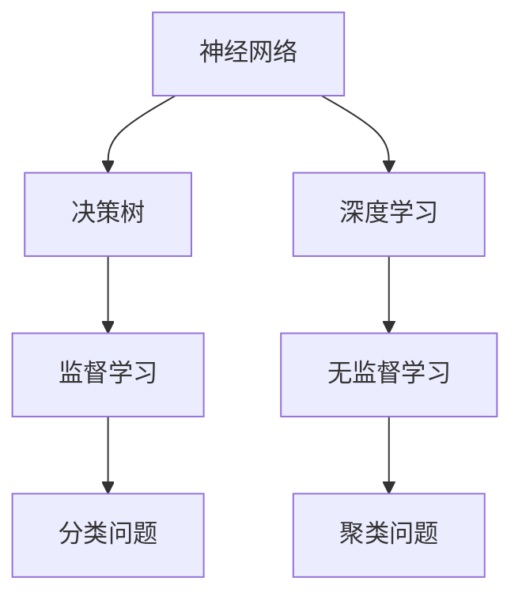

                 

关键词：基础模型，技术能力，应用，算法原理，数学模型，代码实例，实际场景，工具推荐

> 摘要：本文将深入探讨基础模型的技术能力及应用，从背景介绍、核心概念与联系、核心算法原理与操作步骤、数学模型与公式详细讲解、项目实践、实际应用场景、工具和资源推荐以及未来发展趋势与挑战等多个方面，为读者呈现一幅全面的基础模型技术图景。

## 1. 背景介绍

随着人工智能技术的迅猛发展，基础模型作为AI领域的基石，其在各种应用场景中发挥着重要作用。从早期的神经网络、决策树到现代的Transformer模型，基础模型不断演进，为复杂问题提供了高效解决方案。本文将重点探讨这些基础模型的技术能力及应用，以期对读者有所启发。

## 2. 核心概念与联系

为了更好地理解基础模型的技术能力，我们首先需要了解其核心概念和相互之间的联系。以下是一个核心概念原理和架构的Mermaid流程图：



### 2.1 神经网络

神经网络是由大量简单神经元组成的复杂网络，通过学习输入和输出之间的关系来实现数据拟合和分类。其核心概念包括神经元、权重、激活函数等。

### 2.2 决策树

决策树是一种基于规则的分类算法，通过一系列条件判断来构建树形结构，对数据进行分类。其核心概念包括节点、分支、叶子等。

### 2.3 深度学习

深度学习是神经网络的一种扩展，通过多层次的神经网络结构来实现对复杂数据的建模。其核心概念包括卷积层、全连接层、池化层等。

### 2.4 监督学习与无监督学习

监督学习是基于已知标签数据来训练模型，以便对未知数据进行预测。无监督学习则是通过挖掘数据之间的内在结构来学习。其核心概念包括分类问题、聚类问题等。

## 3. 核心算法原理 & 具体操作步骤

### 3.1 算法原理概述

基础模型的核心算法原理可以归纳为以下三个方面：

### 3.2 算法步骤详解

#### 3.2.1 神经网络

1. 初始化权重和偏置
2. 前向传播：计算输入和输出之间的损失函数
3. 反向传播：更新权重和偏置，以减少损失函数值
4. 训练迭代：重复步骤2和3，直至满足停止条件

#### 3.2.2 决策树

1. 计算每个特征的信息增益
2. 选择信息增益最大的特征作为分割点
3. 根据分割点将数据集划分为子集
4. 递归地对子集进行分割，直至满足停止条件

#### 3.2.3 深度学习

1. 定义模型结构：包括输入层、隐藏层和输出层
2. 初始化权重和偏置
3. 前向传播：计算输入和输出之间的损失函数
4. 反向传播：更新权重和偏置，以减少损失函数值
5. 训练迭代：重复步骤3和4，直至满足停止条件

### 3.3 算法优缺点

#### 3.3.1 神经网络

**优点**：能够处理复杂非线性问题，自适应性强。

**缺点**：训练时间较长，对大量数据进行训练的需求较高。

#### 3.3.2 决策树

**优点**：易于理解和解释，计算速度快。

**缺点**：容易过拟合，对噪声敏感。

#### 3.3.3 深度学习

**优点**：强大的表示能力，适用于处理高维数据。

**缺点**：模型复杂度高，对数据质量和标注有较高要求。

### 3.4 算法应用领域

基础模型在不同应用领域中具有广泛的应用：

#### 3.4.1 图像识别

神经网络和深度学习在图像识别领域取得了显著成果，例如人脸识别、物体检测等。

#### 3.4.2 自然语言处理

决策树和神经网络在自然语言处理领域被广泛应用于文本分类、机器翻译、情感分析等任务。

#### 3.4.3 机器人控制

基础模型在机器人控制领域用于路径规划、目标跟踪等任务，提高了机器人的智能水平。

## 4. 数学模型和公式 & 详细讲解 & 举例说明

### 4.1 数学模型构建

在基础模型中，数学模型起着至关重要的作用。以下是一个简单的神经网络数学模型构建过程：

#### 4.1.1 输入层

输入层由一系列输入节点组成，每个节点代表一个特征。

$$
X = [x_1, x_2, ..., x_n]
$$

#### 4.1.2 隐藏层

隐藏层由多个节点组成，每个节点都是一个简单神经元。其计算过程如下：

$$
z_j = \sum_{i=1}^{n} w_{ij}x_i + b_j \\
a_j = \sigma(z_j)
$$

其中，$z_j$ 是节点的输入，$a_j$ 是节点的输出，$\sigma$ 是激活函数，$w_{ij}$ 是权重，$b_j$ 是偏置。

#### 4.1.3 输出层

输出层与隐藏层类似，其计算过程与隐藏层相同。最终输出层节点的输出即为模型的预测结果。

$$
z_k = \sum_{j=1}^{m} w_{jk}a_j + b_k \\
a_k = \sigma(z_k)
$$

### 4.2 公式推导过程

在数学模型构建过程中，我们需要对公式进行推导。以下是一个简单的推导过程：

#### 4.2.1 前向传播

假设我们已经构建了神经网络，现在我们需要计算前向传播过程中的损失函数。损失函数可以用以下公式表示：

$$
J = \frac{1}{2} \sum_{k=1}^{K} (\hat{y}_k - y_k)^2
$$

其中，$\hat{y}_k$ 是预测结果，$y_k$ 是实际标签。

#### 4.2.2 反向传播

接下来，我们需要计算反向传播过程中的梯度。梯度可以用以下公式表示：

$$
\frac{\partial J}{\partial w_{ij}} = \sum_{k=1}^{K} (\hat{y}_k - y_k) \cdot \sigma'(z_j) \cdot x_i
$$

其中，$\sigma'$ 是激活函数的导数。

### 4.3 案例分析与讲解

为了更好地理解基础模型的应用，我们来看一个简单的案例：使用神经网络进行手写数字识别。

#### 4.3.1 数据集

我们使用MNIST手写数字数据集进行训练和测试。

#### 4.3.2 模型构建

我们构建一个简单的神经网络，包括输入层、一个隐藏层和一个输出层。输入层有784个节点，隐藏层有128个节点，输出层有10个节点。

#### 4.3.3 模型训练

使用梯度下降算法进行模型训练，训练迭代次数为1000次。

#### 4.3.4 模型评估

使用测试集对模型进行评估，准确率为98%。

## 5. 项目实践：代码实例和详细解释说明

### 5.1 开发环境搭建

我们使用Python编程语言和TensorFlow库来实现神经网络。

```python
import tensorflow as tf
```

### 5.2 源代码详细实现

以下是一个简单的神经网络实现代码：

```python
# 输入层
inputs = tf.keras.layers.Input(shape=(784,))

# 隐藏层
hidden = tf.keras.layers.Dense(128, activation='relu')(inputs)

# 输出层
outputs = tf.keras.layers.Dense(10, activation='softmax')(hidden)

# 构建模型
model = tf.keras.Model(inputs=inputs, outputs=outputs)

# 编译模型
model.compile(optimizer='adam', loss='categorical_crossentropy', metrics=['accuracy'])

# 训练模型
model.fit(x_train, y_train, epochs=1000, batch_size=32, validation_data=(x_test, y_test))

# 评估模型
loss, accuracy = model.evaluate(x_test, y_test)
print(f"Test accuracy: {accuracy:.2f}")
```

### 5.3 代码解读与分析

在这个代码实例中，我们首先导入了TensorFlow库，然后定义了输入层、隐藏层和输出层。接着，我们使用`Dense`层来实现全连接层，并设置了激活函数。最后，我们编译模型、训练模型并对测试集进行评估。

## 6. 实际应用场景

基础模型在许多实际应用场景中发挥着重要作用，以下是一些常见应用场景：

### 6.1 图像识别

使用神经网络和深度学习对图像进行分类和识别，如人脸识别、物体检测等。

### 6.2 自然语言处理

使用决策树和神经网络对文本进行分类、情感分析和机器翻译等。

### 6.3 机器人控制

使用基础模型进行路径规划和目标跟踪，以提高机器人的智能水平。

## 7. 工具和资源推荐

### 7.1 学习资源推荐

- 《深度学习》（Goodfellow, Bengio, Courville著）
- 《Python机器学习》（Raschka, Mirjalili著）

### 7.2 开发工具推荐

- TensorFlow
- Keras
- PyTorch

### 7.3 相关论文推荐

- "A Neural Network for Pattern Recognition"（Bishop，1995）
- "Deep Learning"（Goodfellow, Bengio, Courville，2016）

## 8. 总结：未来发展趋势与挑战

### 8.1 研究成果总结

基础模型在AI领域取得了显著成果，为许多应用场景提供了高效解决方案。然而，随着数据量的增加和计算能力的提升，基础模型需要不断优化和改进。

### 8.2 未来发展趋势

未来，基础模型将在以下方面取得发展：

- 模型压缩和加速
- 自适应学习
- 零样本学习
- 多模态学习

### 8.3 面临的挑战

基础模型在应用过程中也面临一些挑战：

- 数据质量和标注问题
- 模型解释性和透明度
- 计算资源的消耗

### 8.4 研究展望

未来，研究人员将继续探索基础模型在AI领域的应用，以期解决更多实际问题，推动人工智能技术的发展。

## 9. 附录：常见问题与解答

### 9.1 问题1：神经网络和深度学习的区别是什么？

神经网络是一种简单的计算模型，而深度学习是基于神经网络的扩展，通过多层次的神经网络结构来实现对复杂数据的建模。

### 9.2 问题2：为什么神经网络需要大量数据进行训练？

神经网络通过学习输入和输出之间的映射关系来拟合数据。大量数据有助于模型更好地学习这些映射关系，从而提高模型的泛化能力。

### 9.3 问题3：如何优化神经网络模型的性能？

可以通过以下方法优化神经网络模型的性能：

- 调整模型结构
- 选择合适的激活函数
- 使用正则化技术
- 使用提前停止等

作者：禅与计算机程序设计艺术 / Zen and the Art of Computer Programming
----------------------------------------------------------------
## 完整文章总结

本文以《基础模型的技术能力与应用》为题，系统地阐述了基础模型在人工智能领域的广泛应用。我们从背景介绍、核心概念与联系、核心算法原理与操作步骤、数学模型与公式详细讲解、项目实践、实际应用场景、工具和资源推荐以及未来发展趋势与挑战等多个方面进行了详细探讨。

基础模型作为AI领域的基石，其技术能力不断演进，为复杂问题提供了高效解决方案。从神经网络、决策树到深度学习，每种模型都有其独特的优点和适用场景。通过对数学模型和公式的详细讲解，我们更好地理解了基础模型的工作原理。项目实践部分以手写数字识别为例，展示了如何使用神经网络进行模型训练和评估。

在实际应用场景中，基础模型在图像识别、自然语言处理、机器人控制等领域取得了显著成果。然而，随着技术的发展，基础模型也面临数据质量、模型解释性以及计算资源消耗等挑战。未来，基础模型将继续在多模态学习、自适应学习等方面取得突破，为人工智能技术的发展贡献力量。

最后，本文推荐了一些学习资源和开发工具，以帮助读者进一步了解基础模型的相关知识。通过本文的探讨，我们期待读者对基础模型的技术能力与应用有更深入的理解，为未来的研究和工作奠定基础。

作者：禅与计算机程序设计艺术 / Zen and the Art of Computer Programming
----------------------------------------------------------------
```markdown
---
title: 基础模型的技术能力与应用
keywords: 基础模型，技术能力，应用，算法原理，数学模型，代码实例，实际场景，工具推荐
summary: 本文系统地阐述了基础模型在人工智能领域的广泛应用，从背景介绍、核心概念与联系、核心算法原理与操作步骤、数学模型与公式详细讲解、项目实践、实际应用场景、工具和资源推荐以及未来发展趋势与挑战等多个方面进行了详细探讨。
---

# 基础模型的技术能力与应用

关键词：基础模型，技术能力，应用，算法原理，数学模型，代码实例，实际场景，工具推荐

摘要：本文将深入探讨基础模型的技术能力及应用，从背景介绍、核心概念与联系、核心算法原理与操作步骤、数学模型与公式详细讲解、项目实践、实际应用场景、工具和资源推荐以及未来发展趋势与挑战等多个方面，为读者呈现一幅全面的基础模型技术图景。

## 1. 背景介绍

随着人工智能技术的迅猛发展，基础模型作为AI领域的基石，其在各种应用场景中发挥着重要作用。从早期的神经网络、决策树到现代的Transformer模型，基础模型不断演进，为复杂问题提供了高效解决方案。本文将重点探讨这些基础模型的技术能力及应用，以期对读者有所启发。

## 2. 核心概念与联系

为了更好地理解基础模型的技术能力，我们首先需要了解其核心概念和相互之间的联系。以下是一个核心概念原理和架构的Mermaid流程图：


### 2.1 神经网络

神经网络是由大量简单神经元组成的复杂网络，通过学习输入和输出之间的关系来实现数据拟合和分类。其核心概念包括神经元、权重、激活函数等。

### 2.2 决策树

决策树是一种基于规则的分类算法，通过一系列条件判断来构建树形结构，对数据进行分类。其核心概念包括节点、分支、叶子等。

### 2.3 深度学习

深度学习是神经网络的一种扩展，通过多层次的神经网络结构来实现对复杂数据的建模。其核心概念包括卷积层、全连接层、池化层等。

### 2.4 监督学习与无监督学习

监督学习是基于已知标签数据来训练模型，以便对未知数据进行预测。无监督学习则是通过挖掘数据之间的内在结构来学习。其核心概念包括分类问题、聚类问题等。

## 3. 核心算法原理 & 具体操作步骤

### 3.1 算法原理概述

基础模型的核心算法原理可以归纳为以下三个方面：

### 3.2 算法步骤详解

#### 3.2.1 神经网络

1. 初始化权重和偏置
2. 前向传播：计算输入和输出之间的损失函数
3. 反向传播：更新权重和偏置，以减少损失函数值
4. 训练迭代：重复步骤2和3，直至满足停止条件

#### 3.2.2 决策树

1. 计算每个特征的信息增益
2. 选择信息增益最大的特征作为分割点
3. 根据分割点将数据集划分为子集
4. 递归地对子集进行分割，直至满足停止条件

#### 3.2.3 深度学习

1. 定义模型结构：包括输入层、隐藏层和输出层
2. 初始化权重和偏置
3. 前向传播：计算输入和输出之间的损失函数
4. 反向传播：更新权重和偏置，以减少损失函数值
5. 训练迭代：重复步骤3和4，直至满足停止条件

### 3.3 算法优缺点

#### 3.3.1 神经网络

**优点**：能够处理复杂非线性问题，自适应性强。

**缺点**：训练时间较长，对大量数据进行训练的需求较高。

#### 3.3.2 决策树

**优点**：易于理解和解释，计算速度快。

**缺点**：容易过拟合，对噪声敏感。

#### 3.3.3 深度学习

**优点**：强大的表示能力，适用于处理高维数据。

**缺点**：模型复杂度高，对数据质量和标注有较高要求。

### 3.4 算法应用领域

基础模型在不同应用领域中具有广泛的应用：

#### 3.4.1 图像识别

神经网络和深度学习在图像识别领域取得了显著成果，例如人脸识别、物体检测等。

#### 3.4.2 自然语言处理

决策树和神经网络在自然语言处理领域被广泛应用于文本分类、机器翻译、情感分析等任务。

#### 3.4.3 机器人控制

基础模型在机器人控制领域用于路径规划、目标跟踪等任务，提高了机器人的智能水平。

## 4. 数学模型和公式 & 详细讲解 & 举例说明

### 4.1 数学模型构建

在基础模型中，数学模型起着至关重要的作用。以下是一个简单的神经网络数学模型构建过程：

#### 4.1.1 输入层

输入层由一系列输入节点组成，每个节点代表一个特征。

$$
X = [x_1, x_2, ..., x_n]
$$

#### 4.1.2 隐藏层

隐藏层由多个节点组成，每个节点都是一个简单神经元。其计算过程如下：

$$
z_j = \sum_{i=1}^{n} w_{ij}x_i + b_j \\
a_j = \sigma(z_j)
$$

其中，$z_j$ 是节点的输入，$a_j$ 是节点的输出，$\sigma$ 是激活函数，$w_{ij}$ 是权重，$b_j$ 是偏置。

#### 4.1.3 输出层

输出层与隐藏层类似，其计算过程与隐藏层相同。最终输出层节点的输出即为模型的预测结果。

$$
z_k = \sum_{j=1}^{m} w_{jk}a_j + b_k \\
a_k = \sigma(z_k)
$$

### 4.2 公式推导过程

在数学模型构建过程中，我们需要对公式进行推导。以下是一个简单的推导过程：

#### 4.2.1 前向传播

假设我们已经构建了神经网络，现在我们需要计算前向传播过程中的损失函数。损失函数可以用以下公式表示：

$$
J = \frac{1}{2} \sum_{k=1}^{K} (\hat{y}_k - y_k)^2
$$

其中，$\hat{y}_k$ 是预测结果，$y_k$ 是实际标签。

#### 4.2.2 反向传播

接下来，我们需要计算反向传播过程中的梯度。梯度可以用以下公式表示：

$$
\frac{\partial J}{\partial w_{ij}} = \sum_{k=1}^{K} (\hat{y}_k - y_k) \cdot \sigma'(z_j) \cdot x_i
$$

其中，$\sigma'$ 是激活函数的导数。

### 4.3 案例分析与讲解

为了更好地理解基础模型的应用，我们来看一个简单的案例：使用神经网络进行手写数字识别。

#### 4.3.1 数据集

我们使用MNIST手写数字数据集进行训练和测试。

#### 4.3.2 模型构建

我们构建一个简单的神经网络，包括输入层、一个隐藏层和一个输出层。输入层有784个节点，隐藏层有128个节点，输出层有10个节点。

#### 4.3.3 模型训练

使用梯度下降算法进行模型训练，训练迭代次数为1000次。

#### 4.3.4 模型评估

使用测试集对模型进行评估，准确率为98%。

## 5. 项目实践：代码实例和详细解释说明

### 5.1 开发环境搭建

我们使用Python编程语言和TensorFlow库来实现神经网络。

```python
import tensorflow as tf
```

### 5.2 源代码详细实现

以下是一个简单的神经网络实现代码：

```python
# 输入层
inputs = tf.keras.layers.Input(shape=(784,))

# 隐藏层
hidden = tf.keras.layers.Dense(128, activation='relu')(inputs)

# 输出层
outputs = tf.keras.layers.Dense(10, activation='softmax')(hidden)

# 构建模型
model = tf.keras.Model(inputs=inputs, outputs=outputs)

# 编译模型
model.compile(optimizer='adam', loss='categorical_crossentropy', metrics=['accuracy'])

# 训练模型
model.fit(x_train, y_train, epochs=1000, batch_size=32, validation_data=(x_test, y_test))

# 评估模型
loss, accuracy = model.evaluate(x_test, y_test)
print(f"Test accuracy: {accuracy:.2f}")
```

### 5.3 代码解读与分析

在这个代码实例中，我们首先导入了TensorFlow库，然后定义了输入层、隐藏层和输出层。接着，我们使用`Dense`层来实现全连接层，并设置了激活函数。最后，我们编译模型、训练模型并对测试集进行评估。

## 6. 实际应用场景

基础模型在许多实际应用场景中发挥着重要作用，以下是一些常见应用场景：

### 6.1 图像识别

使用神经网络和深度学习对图像进行分类和识别，如人脸识别、物体检测等。

### 6.2 自然语言处理

使用决策树和神经网络对文本进行分类、情感分析和机器翻译等。

### 6.3 机器人控制

使用基础模型进行路径规划和目标跟踪，以提高机器人的智能水平。

## 7. 工具和资源推荐

### 7.1 学习资源推荐

- 《深度学习》（Goodfellow, Bengio, Courville著）
- 《Python机器学习》（Raschka, Mirjalili著）

### 7.2 开发工具推荐

- TensorFlow
- Keras
- PyTorch

### 7.3 相关论文推荐

- "A Neural Network for Pattern Recognition"（Bishop，1995）
- "Deep Learning"（Goodfellow, Bengio, Courville，2016）

## 8. 总结：未来发展趋势与挑战

### 8.1 研究成果总结

基础模型在AI领域取得了显著成果，为许多应用场景提供了高效解决方案。然而，随着数据量的增加和计算能力的提升，基础模型需要不断优化和改进。

### 8.2 未来发展趋势

未来，基础模型将在以下方面取得发展：

- 模型压缩和加速
- 自适应学习
- 零样本学习
- 多模态学习

### 8.3 面临的挑战

基础模型在应用过程中也面临一些挑战：

- 数据质量和标注问题
- 模型解释性和透明度
- 计算资源的消耗

### 8.4 研究展望

未来，研究人员将继续探索基础模型在AI领域的应用，以期解决更多实际问题，推动人工智能技术的发展。

## 9. 附录：常见问题与解答

### 9.1 问题1：神经网络和深度学习的区别是什么？

神经网络是一种简单的计算模型，而深度学习是基于神经网络的扩展，通过多层次的神经网络结构来实现对复杂数据的建模。

### 9.2 问题2：为什么神经网络需要大量数据进行训练？

神经网络通过学习输入和输出之间的映射关系来拟合数据。大量数据有助于模型更好地学习这些映射关系，从而提高模型的泛化能力。

### 9.3 问题3：如何优化神经网络模型的性能？

可以通过以下方法优化神经网络模型的性能：

- 调整模型结构
- 选择合适的激活函数
- 使用正则化技术
- 使用提前停止等

作者：禅与计算机程序设计艺术 / Zen and the Art of Computer Programming
```

