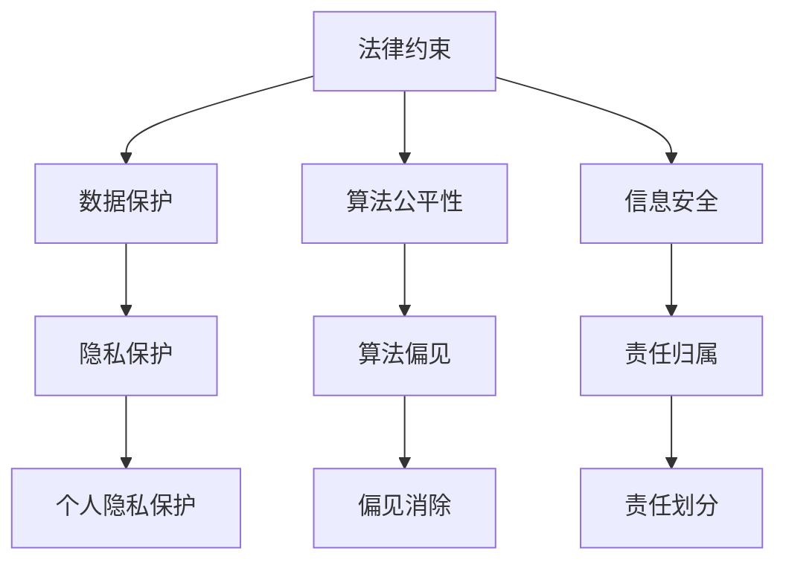

                 

关键词：基础模型、法律约束、伦理问题、技术监管、AI法规

摘要：随着人工智能（AI）技术的快速发展，基础模型在各个领域的应用越来越广泛。然而，随之而来的是一系列法律和伦理问题。本文将探讨基础模型在法律和伦理方面面临的挑战，分析现有法规和伦理准则，并提出相应的解决方案和未来研究方向。

## 1. 背景介绍

### 1.1 人工智能技术的发展

人工智能技术起源于20世纪50年代，随着计算机科学的发展，AI技术逐渐从理论研究走向实际应用。近年来，深度学习、神经网络等技术的突破，使得人工智能在图像识别、自然语言处理、自动驾驶等领域取得了显著成果。

### 1.2 基础模型的应用

基础模型是指通过大量数据训练得到的通用模型，如Transformer、BERT等。这些模型在图像识别、文本生成、机器翻译等方面具有广泛的应用。随着AI技术的进步，基础模型的能力和效率不断提高，为各行各业带来了巨大的变革。

### 1.3 法律与伦理问题的出现

随着基础模型的应用越来越广泛，相关法律和伦理问题也日益凸显。例如，隐私保护、算法歧视、信息安全等问题，引发了社会各界的广泛关注。

## 2. 核心概念与联系

### 2.1 法律约束

法律约束是指通过法律手段对基础模型进行监管和约束，以保障公众利益和社会稳定。法律约束主要包括以下几个方面：

1. **数据保护**：确保个人隐私和数据安全，防止数据泄露和滥用。
2. **算法公平性**：防止算法歧视，确保算法对所有人公平对待。
3. **信息安全**：保障网络和系统的安全，防止网络攻击和数据泄露。

### 2.2 伦理问题

伦理问题是指在基础模型应用过程中，可能引发的一系列道德和社会问题。伦理问题主要包括以下几个方面：

1. **隐私保护**：在数据收集和处理过程中，如何保护个人隐私。
2. **算法偏见**：算法在训练过程中可能产生的偏见，导致歧视和不公平。
3. **责任归属**：在发生安全事故或错误时，如何确定责任归属。

### 2.3 Mermaid 流程图



## 3. 核心算法原理 & 具体操作步骤

### 3.1 算法原理概述

基础模型的核心算法主要是深度学习和神经网络。深度学习通过多层神经网络对大量数据进行训练，从而实现对未知数据的预测和分类。神经网络则是一种由大量神经元组成的计算模型，通过学习输入和输出之间的关系，实现对数据的处理。

### 3.2 算法步骤详解

1. **数据收集**：收集与任务相关的数据，如图像、文本等。
2. **数据预处理**：对数据进行清洗、归一化等处理，以消除噪声和异常值。
3. **模型设计**：根据任务需求，设计合适的神经网络结构。
4. **模型训练**：使用训练数据对模型进行训练，调整模型参数。
5. **模型评估**：使用验证数据对模型进行评估，确定模型性能。
6. **模型部署**：将训练好的模型部署到实际应用场景中。

### 3.3 算法优缺点

优点：

1. **高效性**：深度学习模型在处理大规模数据时具有很高的效率。
2. **灵活性**：神经网络可以适应不同的任务和数据类型。
3. **泛化能力**：经过训练的模型可以应用于其他相似的任务和数据。

缺点：

1. **计算资源消耗**：深度学习模型需要大量的计算资源和存储空间。
2. **数据依赖性**：模型的性能很大程度上取决于训练数据的质量和数量。
3. **解释性差**：神经网络模型在处理复杂任务时，其内部机制往往难以解释。

### 3.4 算法应用领域

基础模型在图像识别、自然语言处理、语音识别、推荐系统、自动驾驶等领域有广泛的应用。例如，在图像识别领域，基础模型可以实现人脸识别、物体检测等功能；在自然语言处理领域，基础模型可以应用于文本分类、机器翻译、文本生成等任务。

## 4. 数学模型和公式 & 详细讲解 & 举例说明

### 4.1 数学模型构建

深度学习中的数学模型主要包括神经网络和损失函数。神经网络由大量神经元组成，每个神经元通过加权连接与其他神经元相连，通过激活函数产生输出。损失函数用于评估模型的预测结果与真实值之间的差距，以指导模型参数的调整。

### 4.2 公式推导过程

神经网络的输入可以表示为：
$$
\vec{x} = \begin{bmatrix} x_1 \\ x_2 \\ \vdots \\ x_n \end{bmatrix}
$$
神经元的输出可以表示为：
$$
a_i = \sigma(\sum_{j=1}^{n} w_{ij} x_j + b_i)
$$
其中，$w_{ij}$ 是连接权重，$b_i$ 是偏置，$\sigma$ 是激活函数。

损失函数可以表示为：
$$
J(\theta) = -\frac{1}{m} \sum_{i=1}^{m} y_i \log a_i^{(l)} + (1 - y_i) \log (1 - a_i^{(l)})
$$
其中，$m$ 是样本数量，$y_i$ 是真实标签，$a_i^{(l)}$ 是第$l$层的输出。

### 4.3 案例分析与讲解

以图像识别任务为例，我们可以构建一个简单的卷积神经网络（CNN）模型。首先，对输入图像进行预处理，如归一化和裁剪等。然后，通过卷积层提取图像的特征，再通过池化层降低数据维度。最后，通过全连接层进行分类。

以下是一个简化的CNN模型示例：

```python
import tensorflow as tf

# 定义输入层
inputs = tf.keras.layers.Input(shape=(28, 28, 1))

# 卷积层
conv1 = tf.keras.layers.Conv2D(filters=32, kernel_size=(3, 3), activation='relu')(inputs)
pool1 = tf.keras.layers.MaxPooling2D(pool_size=(2, 2))(conv1)

# 卷积层
conv2 = tf.keras.layers.Conv2D(filters=64, kernel_size=(3, 3), activation='relu')(pool1)
pool2 = tf.keras.layers.MaxPooling2D(pool_size=(2, 2))(conv2)

# 全连接层
flatten = tf.keras.layers.Flatten()(pool2)
dense = tf.keras.layers.Dense(units=128, activation='relu')(flatten)

# 输出层
outputs = tf.keras.layers.Dense(units=10, activation='softmax')(dense)

# 构建模型
model = tf.keras.Model(inputs=inputs, outputs=outputs)

# 编译模型
model.compile(optimizer='adam', loss='categorical_crossentropy', metrics=['accuracy'])

# 模型训练
model.fit(x_train, y_train, epochs=10, batch_size=32, validation_data=(x_val, y_val))

# 模型评估
model.evaluate(x_test, y_test)
```

## 5. 项目实践：代码实例和详细解释说明

### 5.1 开发环境搭建

1. 安装Python 3.6或更高版本。
2. 安装TensorFlow 2.0或更高版本。
3. 安装Numpy、Pandas等常用库。

### 5.2 源代码详细实现

以上面的CNN模型为例，实现图像识别任务。

```python
# 导入库
import tensorflow as tf
import numpy as np
import pandas as pd
from tensorflow.keras.utils import to_categorical

# 加载数据集
(x_train, y_train), (x_test, y_test) = tf.keras.datasets.mnist.load_data()

# 数据预处理
x_train = x_train.astype('float32') / 255.0
x_test = x_test.astype('float32') / 255.0
x_train = np.expand_dims(x_train, -1)
x_test = np.expand_dims(x_test, -1)

# 转换标签为one-hot编码
y_train = to_categorical(y_train, num_classes=10)
y_test = to_categorical(y_test, num_classes=10)

# 构建模型
inputs = tf.keras.layers.Input(shape=(28, 28, 1))
conv1 = tf.keras.layers.Conv2D(filters=32, kernel_size=(3, 3), activation='relu')(inputs)
pool1 = tf.keras.layers.MaxPooling2D(pool_size=(2, 2))(conv1)
conv2 = tf.keras.layers.Conv2D(filters=64, kernel_size=(3, 3), activation='relu')(pool1)
pool2 = tf.keras.layers.MaxPooling2D(pool_size=(2, 2))(conv2)
flatten = tf.keras.layers.Flatten()(pool2)
dense = tf.keras.layers.Dense(units=128, activation='relu')(flatten)
outputs = tf.keras.layers.Dense(units=10, activation='softmax')(dense)
model = tf.keras.Model(inputs=inputs, outputs=outputs)

# 编译模型
model.compile(optimizer='adam', loss='categorical_crossentropy', metrics=['accuracy'])

# 模型训练
model.fit(x_train, y_train, epochs=10, batch_size=32, validation_data=(x_test, y_test))

# 模型评估
model.evaluate(x_test, y_test)
```

### 5.3 代码解读与分析

1. **数据预处理**：将图像数据转换为浮点数，并进行归一化处理。同时，将标签转换为one-hot编码。
2. **模型构建**：使用卷积层、池化层、全连接层等构建CNN模型。
3. **模型编译**：设置优化器、损失函数和评价指标。
4. **模型训练**：使用训练数据进行模型训练。
5. **模型评估**：使用测试数据进行模型评估。

## 6. 实际应用场景

### 6.1 隐私保护

在基础模型的应用过程中，隐私保护是一个重要问题。为了保护用户隐私，我们可以采取以下措施：

1. **数据匿名化**：在数据收集和处理过程中，对用户信息进行匿名化处理，以消除个人隐私信息。
2. **加密技术**：使用加密技术对敏感数据进行加密存储和传输，确保数据安全。
3. **隐私预算**：为每个用户设定隐私预算，限制模型对用户数据的访问和使用。

### 6.2 算法公平性

算法公平性是基础模型应用中的另一个重要问题。为了确保算法的公平性，我们可以采取以下措施：

1. **数据平衡**：在数据收集和处理过程中，确保数据的平衡性，消除数据集中的偏见。
2. **算法审查**：对算法进行定期审查和评估，发现和纠正潜在的偏见。
3. **透明度**：提高算法的透明度，让用户了解算法的工作原理和决策过程。

## 7. 工具和资源推荐

### 7.1 学习资源推荐

1. **《深度学习》**：作者：Ian Goodfellow、Yoshua Bengio、Aaron Courville
2. **《Python机器学习》**：作者：Sebastian Raschka
3. **《动手学深度学习》**：作者：阿斯顿·张、李沐、扎卡里·C·李、亚龙·许

### 7.2 开发工具推荐

1. **TensorFlow**：一个开源的深度学习框架，适合构建和训练基础模型。
2. **PyTorch**：一个开源的深度学习框架，具有灵活的动态计算图和强大的生态系统。
3. **Keras**：一个高级的神经网络API，可以方便地构建和训练基础模型。

### 7.3 相关论文推荐

1. **“A Theoretically Grounded Application of Dropout in Recurrent Neural Networks”**：作者：Yarin Gal、Zoubin Ghahramani
2. **“Understanding Deep Learning Requires Rethinking Generalization”**：作者：Aviram Y. Carmeli、Zohar Karnin、Yaron Shapira、Noam Shazeer
3. **“Deep Learning with Limited Memory”**：作者：Guodong Zhou、Jianping Shi、Xiaogang Wang、Xiaokang Yang

## 8. 总结：未来发展趋势与挑战

### 8.1 研究成果总结

本文探讨了基础模型在法律和伦理方面面临的挑战，分析了现有法规和伦理准则，并提出了一些解决方案。通过案例分析和代码实例，展示了基础模型在实际应用中的具体实现。

### 8.2 未来发展趋势

1. **算法透明性**：提高算法的透明度，让用户了解算法的工作原理和决策过程。
2. **隐私保护**：加强隐私保护措施，确保用户数据的安全和隐私。
3. **算法公平性**：消除算法偏见，确保算法对所有人公平对待。

### 8.3 面临的挑战

1. **法律和伦理规范的完善**：需要制定更加完善的法律和伦理规范，以适应AI技术的发展。
2. **跨领域合作**：需要加强不同领域之间的合作，共同应对AI技术带来的挑战。
3. **技术瓶颈**：需要解决AI技术在计算资源、数据质量和算法优化等方面面临的瓶颈。

### 8.4 研究展望

未来，基础模型在法律和伦理方面的研究将继续深入，有望取得以下成果：

1. **完善的法律和伦理框架**：建立更加完善的法律和伦理框架，为AI技术的发展提供有力支持。
2. **智能化的隐私保护**：开发智能化的隐私保护技术，提高数据安全性和隐私保护水平。
3. **公平高效的算法**：研究更加公平高效的算法，消除算法偏见，确保算法的公平性。

## 9. 附录：常见问题与解答

### 9.1 什么是基础模型？

基础模型是指通过大量数据训练得到的通用模型，如Transformer、BERT等。这些模型在图像识别、自然语言处理、机器翻译等领域具有广泛的应用。

### 9.2 基础模型在法律和伦理方面面临哪些挑战？

基础模型在法律和伦理方面面临的主要挑战包括隐私保护、算法歧视、信息安全等方面。

### 9.3 如何确保基础模型的算法公平性？

确保基础模型的算法公平性可以从以下几个方面入手：

1. **数据平衡**：在数据收集和处理过程中，确保数据的平衡性，消除数据集中的偏见。
2. **算法审查**：对算法进行定期审查和评估，发现和纠正潜在的偏见。
3. **透明度**：提高算法的透明度，让用户了解算法的工作原理和决策过程。

## 作者署名

本文由禅与计算机程序设计艺术 / Zen and the Art of Computer Programming 编写。  
----------------------------------------------------------------

