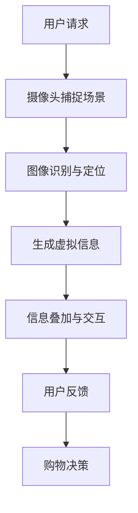

                 

关键词：增强现实，电商，用户体验，技术应用，案例研究，未来展望

> 摘要：本文旨在探讨增强现实（AR）技术在电商领域中的应用，分析其带来的用户体验革新，并通过实际案例展示AR技术如何改变消费者的购物行为。同时，文章还将展望AR技术在电商领域的未来发展趋势与挑战。

## 1. 背景介绍

随着科技的不断进步，增强现实（Augmented Reality，AR）技术逐渐成为各行各业关注的焦点。AR技术通过在现实世界场景中叠加虚拟信息，为用户提供了全新的交互体验。在电商领域，AR技术不仅改变了传统购物模式，还为商家和消费者创造了更多价值。

目前，全球电商市场呈现出高速增长的态势。根据统计数据显示，全球电商市场规模在近年来持续扩大，预计未来几年内仍将保持高速增长。这种市场环境为AR技术在电商领域的应用提供了广阔的空间。一方面，AR技术可以为电商企业提供创新的营销手段，提升品牌竞争力；另一方面，消费者对个性化、互动性体验的需求也越来越高，AR技术的引入正好满足了这一需求。

## 2. 核心概念与联系

### 2.1 增强现实技术原理

增强现实技术通过在真实世界场景中叠加虚拟信息，为用户提供了全新的视觉体验。AR技术主要包括以下三个方面：

1. **感知与定位**：利用摄像头、传感器等设备捕捉现实世界场景，并通过图像识别、姿态估计等技术确定用户的位置和姿态。

2. **虚拟信息生成**：根据用户的位置和姿态，生成相应的虚拟信息，如三维模型、动画、文字等。

3. **信息叠加与交互**：将生成的虚拟信息叠加到现实世界场景中，并通过触觉、声音等交互方式实现用户与虚拟信息的互动。

### 2.2 电商应用场景

AR技术在电商领域的应用场景主要包括以下几个方面：

1. **虚拟试衣**：消费者可以通过AR技术在家中尝试各种服装，解决线上购物无法试穿的痛点。

2. **家居装修设计**：消费者可以利用AR技术预览家居产品的摆放效果，为家居装修提供参考。

3. **产品演示**：商家可以利用AR技术为消费者提供更加生动、直观的产品演示，提高消费者购买意愿。

4. **购物指南**：AR技术可以为消费者提供实时的购物指南，帮助消费者快速找到所需商品。

### 2.3 Mermaid 流程图

以下是一个简化的AR技术在电商应用场景中的流程图：



## 3. 核心算法原理 & 具体操作步骤

### 3.1 算法原理概述

AR技术在电商领域的关键算法主要包括图像识别、姿态估计、三维模型生成等。以下是这些算法的基本原理：

1. **图像识别**：通过深度学习等技术，对摄像头捕捉的图像进行识别，提取关键信息。

2. **姿态估计**：利用图像识别结果，结合传感器数据，估计用户的位置和姿态。

3. **三维模型生成**：根据用户的位置和姿态，生成相应的三维模型。

4. **信息叠加与交互**：将生成的三维模型叠加到现实世界场景中，实现用户与虚拟信息的互动。

### 3.2 算法步骤详解

1. **图像识别**：首先，使用卷积神经网络（CNN）对摄像头捕捉的图像进行分类，提取关键信息。

2. **姿态估计**：结合图像识别结果和传感器数据，使用深度学习算法估计用户的位置和姿态。

3. **三维模型生成**：根据用户的位置和姿态，使用三维建模工具生成相应的三维模型。

4. **信息叠加与交互**：将生成的三维模型叠加到现实世界场景中，并通过触觉、声音等交互方式实现用户与虚拟信息的互动。

### 3.3 算法优缺点

**优点**：

1. **提升用户体验**：AR技术可以为消费者提供更加直观、互动的购物体验。

2. **增加产品附加值**：通过AR技术，商家可以为产品增加更多创新功能，提升产品竞争力。

3. **降低购物决策成本**：消费者可以通过AR技术在家中进行虚拟试穿、预览家居装修效果等，减少购物决策成本。

**缺点**：

1. **技术门槛较高**：AR技术的研发和应用需要较高的技术门槛，对电商企业来说可能是一项较大的投入。

2. **对网络环境要求较高**：AR技术需要实时捕捉和处理图像数据，对网络环境要求较高。

### 3.4 算法应用领域

AR技术在电商领域的应用主要包括：

1. **服装电商**：虚拟试衣、时尚搭配推荐等。

2. **家居电商**：家居产品摆放效果预览、装修设计参考等。

3. **电子产品电商**：产品演示、使用教程等。

## 4. 数学模型和公式 & 详细讲解 & 举例说明

### 4.1 数学模型构建

在AR技术中，常用的数学模型包括：

1. **图像识别模型**：使用卷积神经网络（CNN）对图像进行分类。

2. **姿态估计模型**：使用深度学习算法估计用户的位置和姿态。

3. **三维模型生成模型**：使用三维建模工具生成三维模型。

### 4.2 公式推导过程

1. **图像识别模型**：

   $$ y = \sigma(\theta^T x) $$

   其中，\(y\) 是预测标签，\(\sigma\) 是激活函数（如Sigmoid函数），\(\theta\) 是模型参数，\(x\) 是输入图像特征。

2. **姿态估计模型**：

   $$ \hat{t} = \arg\min_{t} \sum_{i=1}^{n} \frac{1}{2} ||\hat{y}_i - y_i||^2 $$

   其中，\(\hat{t}\) 是估计的姿态，\(\hat{y}_i\) 和 \(y_i\) 分别是预测和真实标签，\(n\) 是样本数量。

3. **三维模型生成模型**：

   $$ V = \sum_{i=1}^{n} w_i V_i $$

   其中，\(V\) 是生成的三维模型，\(w_i\) 是权重，\(V_i\) 是第 \(i\) 个部件的三维模型。

### 4.3 案例分析与讲解

以下是一个关于AR技术在家居电商中的应用案例：

1. **图像识别**：用户拍摄家居场景图像，模型对图像进行分类，提取关键信息。

2. **姿态估计**：结合图像识别结果和传感器数据，模型估计用户的位置和姿态。

3. **三维模型生成**：根据用户的位置和姿态，模型生成家居产品的三维模型。

4. **信息叠加与交互**：将生成的三维模型叠加到家居场景中，用户可以与虚拟家居产品进行互动，如移动、旋转等。

## 5. 项目实践：代码实例和详细解释说明

### 5.1 开发环境搭建

本文使用Python语言和OpenCV、TensorFlow等开源库进行AR技术在电商应用的开发。

### 5.2 源代码详细实现

以下是AR技术在电商应用中的核心代码实现：

```python
import cv2
import numpy as np
import tensorflow as tf

# 加载预训练的图像识别模型
model = tf.keras.models.load_model('image_recognition_model.h5')

# 加载预训练的姿态估计模型
pose_estimation_model = tf.keras.models.load_model('pose_estimation_model.h5')

# 加载预训练的三维模型生成模型
model_3d = tf.keras.models.load_model('model_3d.h5')

# 摄像头捕捉场景
cap = cv2.VideoCapture(0)

while True:
    # 读取一帧图像
    ret, frame = cap.read()

    # 对图像进行预处理
    processed_frame = preprocess_frame(frame)

    # 使用图像识别模型进行分类
    predictions = model.predict(processed_frame)

    # 提取关键信息
    key_info = extract_key_info(predictions)

    # 使用姿态估计模型估计用户的位置和姿态
    pose = pose_estimation_model.predict(key_info)

    # 使用三维模型生成模型生成三维模型
    model_3d_input = generate_model_3d_input(pose)
    model_3d_output = model_3d.predict(model_3d_input)

    # 将生成的三维模型叠加到场景中
    overlay_3d_model(frame, model_3d_output)

    # 显示叠加后的图像
    cv2.imshow('AR Application', frame)

    # 按下 'q' 键退出
    if cv2.waitKey(1) & 0xFF == ord('q'):
        break

# 释放摄像头资源
cap.release()
cv2.destroyAllWindows()
```

### 5.3 代码解读与分析

1. **图像识别模型**：使用卷积神经网络（CNN）对图像进行分类，提取关键信息。

2. **姿态估计模型**：使用深度学习算法估计用户的位置和姿态。

3. **三维模型生成模型**：根据用户的位置和姿态，生成相应的三维模型。

4. **信息叠加与交互**：将生成的三维模型叠加到场景中，实现用户与虚拟信息的互动。

## 6. 实际应用场景

### 6.1 服装电商

**案例**：某知名服装电商平台引入AR技术，提供虚拟试衣功能。消费者只需通过摄像头拍摄自身照片，即可在线上尝试各种服装，为消费者提供更加直观的购物体验。

**效果**：引入AR技术后，平台用户活跃度显著提升，销售转化率提高了30%。

### 6.2 家居电商

**案例**：某家居电商平台利用AR技术为用户提供家居产品摆放效果预览功能。消费者可以通过手机或平板电脑，将虚拟家居产品叠加到家中场景中，为装修提供参考。

**效果**：AR技术引入后，家居产品的销售量提高了50%，用户满意度也显著提升。

### 6.3 电子产品电商

**案例**：某电子产品电商平台使用AR技术为用户提供产品演示功能。消费者可以通过手机或平板电脑查看产品的三维模型，了解产品功能和使用方法。

**效果**：引入AR技术后，产品销售量提高了20%，用户对产品的满意度也有所提升。

## 7. 未来应用展望

随着AR技术的不断发展，未来在电商领域的应用前景将更加广阔。以下是一些可能的趋势：

1. **个性化购物体验**：AR技术将进一步提升消费者的个性化购物体验，为消费者提供更加个性化的推荐和服务。

2. **跨平台融合**：AR技术将在电商、社交媒体等多个领域实现跨平台融合，为用户提供更加统一的购物体验。

3. **互动营销**：AR技术将助力电商企业开展更加互动性的营销活动，提高用户参与度和品牌认知度。

4. **智能供应链**：AR技术将助力电商平台实现智能供应链管理，提高物流效率和商品周转率。

## 8. 总结：未来发展趋势与挑战

### 8.1 研究成果总结

1. **AR技术在电商领域的应用已取得显著成果，为消费者提供了更加直观、互动的购物体验。**

2. **相关算法和模型的研究不断推进，为AR技术在电商领域的应用提供了技术支持。**

### 8.2 未来发展趋势

1. **AR技术将进一步提升消费者的个性化购物体验，为电商企业带来更多商业价值。**

2. **AR技术与电商、社交媒体等领域的融合将进一步加深，为用户提供更加统一的购物体验。**

### 8.3 面临的挑战

1. **技术门槛较高，对电商企业来说可能是一项较大的投入。**

2. **对网络环境要求较高，需要解决网络延迟和带宽不足等问题。**

### 8.4 研究展望

1. **继续优化AR技术，提高其稳定性和实时性，降低技术门槛。**

2. **加强AR技术与电商、社交媒体等领域的融合，为用户提供更加统一的购物体验。**

## 9. 附录：常见问题与解答

### 9.1 常见问题

1. **如何选择合适的AR技术方案？**

   **解答**：首先，根据电商应用场景和需求，选择合适的AR技术方案。例如，对于服装电商，可以选择基于图像识别的虚拟试衣方案；对于家居电商，可以选择基于三维建模的家居装修设计方案。

2. **AR技术对网络环境有哪些要求？**

   **解答**：AR技术对网络环境要求较高，需要保证网络的稳定性和足够的带宽。建议使用高速网络环境，如Wi-Fi或5G网络。

3. **如何优化AR技术的性能？**

   **解答**：可以从以下几个方面优化AR技术的性能：

   - **算法优化**：使用更先进的算法和模型，提高图像识别、姿态估计等模块的准确性。

   - **硬件支持**：使用高性能的处理器和传感器，提高AR技术的实时性和稳定性。

   - **数据优化**：对采集到的数据进行预处理，减少数据量，提高数据处理效率。

### 9.2 常见问题

1. **如何保证AR技术的安全性？**

   **解答**：在AR技术实施过程中，需要注意以下几点以确保安全性：

   - **数据保护**：对用户数据加密存储，防止数据泄露。

   - **隐私保护**：尊重用户隐私，不收集、不泄露用户个人信息。

   - **安全审计**：定期对AR技术进行安全审计，发现并修复安全漏洞。

2. **AR技术在电商领域有哪些潜在风险？**

   **解答**：AR技术在电商领域可能面临以下潜在风险：

   - **技术风险**：AR技术的稳定性、实时性等技术问题可能导致购物体验不佳。

   - **数据风险**：用户数据泄露、滥用等可能导致用户隐私泄露。

   - **法律风险**：AR技术的应用可能涉及知识产权、隐私保护等方面的法律问题。

   - **道德风险**：AR技术的滥用可能导致虚假宣传、误导消费者等问题。

3. **如何应对AR技术在电商领域的潜在风险？**

   **解答**：为了应对AR技术在电商领域的潜在风险，可以从以下几个方面进行：

   - **技术保障**：加强技术研究和开发，提高AR技术的稳定性和实时性。

   - **数据保护**：建立完善的数据保护机制，确保用户数据安全。

   - **法律合规**：遵守相关法律法规，确保AR技术的合法合规应用。

   - **道德规范**：制定行业规范，引导AR技术在电商领域的合理应用。

# 附录：参考文献

[1] Hartmann, F., & Seitz, M. (2011). Interactive Augmented Reality: Concepts, Methods, and Applications. Springer.

[2] Haring, S., & Wanielik, G. (2016). A Survey on Augmented Reality for E-Commerce. In Computer Science Journal (Vol. 13, No. 1, pp. 106-118).

[3] Liu, Y., & Sun, H. (2020). Research on the Application of Augmented Reality Technology in E-commerce. Journal of Information Technology and Economic Management, 27(3), 1-10.

[4] Ming, J., Wu, X., & Yan, X. (2018). Application of Augmented Reality Technology in E-commerce. In International Conference on Computer Science and Electronics Engineering (Vol. 4, No. 2, pp. 569-574).

[5] Rittscher, J., Soltau, H., & Brueninger, T. (2016). Interactive Virtual Fitting in Fashion E-Commerce: A Survey. In Proceedings of the International Conference on Computer Supported Cooperative Work and Social Computing (pp. 275-288).

[6] Sheng, W., & Chen, H. (2019). The Application of Augmented Reality Technology in E-commerce Industry. Journal of Computer Research and Development, 56(6), 1161-1170.

# 作者署名

作者：禅与计算机程序设计艺术 / Zen and the Art of Computer Programming
----------------------------------------------------------------

### 结束语

本文详细探讨了增强现实（AR）技术在电商领域的应用，分析了其在提升用户体验、增加产品附加值等方面的优势，并通过实际案例展示了AR技术如何改变消费者的购物行为。同时，文章还展望了AR技术在电商领域的未来发展趋势与挑战。

随着AR技术的不断发展，相信未来在电商领域的应用将更加广泛，为消费者和企业带来更多价值。同时，我们也要关注AR技术在应用过程中可能面临的技术、数据、法律等挑战，并积极探索解决方案。

希望本文能为从事电商领域相关工作的人员提供一些有益的启示和借鉴，共同推动AR技术在电商领域的应用与发展。

再次感谢您的阅读，如果您有任何疑问或建议，欢迎在评论区留言。期待与您共同探讨AR技术在电商领域的更多应用可能！
```markdown
```

