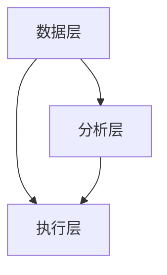

                 

关键词：增长黑客、营销策略、创业公司、低成本、数据分析、技术实现

摘要：本文深入探讨了“增长黑客”这一概念，阐述了它在创业公司中的应用价值。通过分析增长黑客的核心原理和方法，本文提供了一系列实用策略，帮助创业公司实现低成本高效能的营销。文章最后展望了未来发展趋势和面临的挑战。

## 1. 背景介绍

### 1.1 创业公司的挑战

创业公司在市场立足的过程中面临诸多挑战，包括资源有限、市场竞争激烈、用户获取成本高等。如何在有限的资源下实现快速增长，成为众多创业公司亟需解决的问题。

### 1.2 营销的重要性

营销是创业公司获取用户、扩大市场份额的关键手段。然而，传统的营销手段往往成本高昂，难以满足创业公司的需求。因此，寻找一种低成本、高效的营销方式成为创业公司的迫切需求。

### 1.3 增长黑客的崛起

增长黑客（Growth Hacking）这一概念源于硅谷，它将数据分析、市场营销、产品设计和工程等技术手段结合起来，实现低成本、高效的快速增长。增长黑客的核心思想是利用技术手段解决营销问题，提升用户获取效率和转化率。

## 2. 核心概念与联系

### 2.1 增长黑客的定义

增长黑客是指通过数据分析、产品优化、营销策略等手段，实现低成本、快速增长的专家。

### 2.2 增长黑客的核心原理

增长黑客的核心原理可以概括为以下几点：

1. **用户获取（Acquisition）**：通过精准定位目标用户，利用多种渠道获取潜在用户。
2. **用户留存（Retention）**：通过提升产品体验、优化用户服务，提高用户留存率。
3. **用户激活（Activation）**：通过引导用户完成关键操作，如注册、购买等，激活用户。
4. **用户推荐（Referral）**：通过激励机制，鼓励用户推荐新用户，实现病毒式传播。

### 2.3 增长黑客的架构

增长黑客的架构可以分为三个层次：

1. **数据层**：收集用户行为数据，包括用户画像、访问路径、操作记录等。
2. **分析层**：对数据进行处理和分析，挖掘用户需求、行为规律等。
3. **执行层**：根据分析结果，制定并实施营销策略和产品优化措施。



## 3. 核心算法原理 & 具体操作步骤

### 3.1 算法原理概述

增长黑客的核心算法主要包括用户画像、行为分析、推荐系统等。以下是这些算法的原理概述：

1. **用户画像**：通过收集用户的基本信息、兴趣爱好、行为习惯等，构建用户画像，为精准营销提供依据。
2. **行为分析**：通过分析用户的行为路径、操作频率、停留时间等，挖掘用户需求和偏好。
3. **推荐系统**：根据用户画像和行为分析结果，推荐相关产品或服务，提升用户转化率。

### 3.2 算法步骤详解

1. **数据收集与处理**：收集用户行为数据，包括浏览记录、搜索关键词、操作行为等，并进行数据清洗和预处理。
2. **用户画像构建**：根据用户行为数据和基础信息，构建用户画像，为后续分析提供依据。
3. **行为分析**：对用户行为进行分析，挖掘用户需求和偏好，为推荐系统提供支持。
4. **推荐系统实现**：根据用户画像和行为分析结果，构建推荐模型，实现产品或服务的个性化推荐。
5. **营销策略制定与执行**：根据推荐结果，制定针对性的营销策略，如优惠活动、推广广告等，并执行落地。

### 3.3 算法优缺点

**优点**：

1. **低成本**：通过数据分析和技术手段，实现低成本的用户获取和营销。
2. **高效性**：基于用户画像和行为分析，实现精准营销，提高用户转化率。
3. **可持续性**：通过持续的数据分析和优化，不断提升营销效果。

**缺点**：

1. **数据质量要求高**：算法效果依赖于数据质量，数据不准确可能导致分析结果失真。
2. **技术门槛较高**：实现增长黑客需要掌握一定的技术知识和数据分析能力。

### 3.4 算法应用领域

增长黑客算法广泛应用于互联网企业，如电商、社交、金融等领域。以下是具体应用案例：

1. **电商**：通过用户画像和行为分析，实现个性化推荐，提高商品转化率。
2. **社交**：通过推荐系统，吸引用户关注和互动，提高用户活跃度。
3. **金融**：通过风险分析和行为监控，实现精准营销和风控。

## 4. 数学模型和公式 & 详细讲解 & 举例说明

### 4.1 数学模型构建

增长黑客的核心数学模型包括用户画像构建、行为分析模型和推荐系统模型。

1. **用户画像构建**：

   $$ 用户画像 = f(基本信息, 行为数据, 社交数据) $$

   其中，基本信息包括年龄、性别、地理位置等，行为数据包括浏览记录、购买行为等，社交数据包括关注数、点赞数等。

2. **行为分析模型**：

   $$ 行为分析模型 = f(用户画像, 行为数据) $$

   该模型通过分析用户的行为数据，挖掘用户需求和偏好。

3. **推荐系统模型**：

   $$ 推荐系统 = f(用户画像, 行为分析模型, 产品信息) $$

   该模型根据用户画像和行为分析结果，推荐相关产品或服务。

### 4.2 公式推导过程

1. **用户画像构建**：

   $$ 用户画像 = f(基本信息, 行为数据, 社交数据) $$

   首先，收集用户的基本信息、行为数据和社交数据。然后，通过数据清洗和预处理，得到用户画像。

2. **行为分析模型**：

   $$ 行为分析模型 = f(用户画像, 行为数据) $$

   利用机器学习算法，如逻辑回归、决策树等，对用户行为数据进行分析，构建行为分析模型。

3. **推荐系统模型**：

   $$ 推荐系统 = f(用户画像, 行为分析模型, 产品信息) $$

   利用协同过滤、基于内容的推荐算法等，根据用户画像和行为分析结果，推荐相关产品或服务。

### 4.3 案例分析与讲解

以电商平台的个性化推荐为例，分析增长黑客在实践中的应用。

1. **数据收集**：

   收集用户的基本信息（如年龄、性别）、行为数据（如浏览记录、购买行为）和社交数据（如关注数、点赞数）。

2. **用户画像构建**：

   通过数据预处理，构建用户画像。

3. **行为分析**：

   利用机器学习算法，分析用户的行为数据，挖掘用户需求和偏好。

4. **推荐系统实现**：

   根据用户画像和行为分析结果，构建推荐模型，实现个性化推荐。

5. **营销策略制定**：

   根据推荐结果，制定优惠活动、推广广告等营销策略。

6. **执行与优化**：

   执行落地营销策略，并根据用户反馈和效果，不断优化推荐系统和营销策略。

## 5. 项目实践：代码实例和详细解释说明

### 5.1 开发环境搭建

1. 安装Python环境
2. 安装必要的库，如NumPy、Pandas、Scikit-learn等

### 5.2 源代码详细实现

以下是增长黑客项目的源代码示例：

```python
import numpy as np
import pandas as pd
from sklearn.model_selection import train_test_split
from sklearn.preprocessing import StandardScaler
from sklearn.linear_model import LogisticRegression

# 数据加载与预处理
data = pd.read_csv('user_data.csv')
X = data[['age', 'gender', 'browse_history']]
y = data['purchase']

# 数据归一化
scaler = StandardScaler()
X_scaled = scaler.fit_transform(X)

# 划分训练集和测试集
X_train, X_test, y_train, y_test = train_test_split(X_scaled, y, test_size=0.2, random_state=42)

# 建立逻辑回归模型
model = LogisticRegression()
model.fit(X_train, y_train)

# 测试模型
accuracy = model.score(X_test, y_test)
print(f"Model accuracy: {accuracy:.2f}")

# 推荐系统实现
def recommend_products(user_data):
    user_data_scaled = scaler.transform(user_data)
    prediction = model.predict(user_data_scaled)
    return prediction

# 用户推荐
new_user_data = np.array([[25, 0, [0, 1, 0]]])
prediction = recommend_products(new_user_data)
print(f"Recommended products: {prediction}")
```

### 5.3 代码解读与分析

1. 数据加载与预处理：加载用户数据，包括年龄、性别和浏览记录，并进行归一化处理。
2. 建立逻辑回归模型：利用训练集数据建立逻辑回归模型。
3. 模型测试：在测试集上评估模型准确率。
4. 推荐系统实现：根据用户数据，利用训练好的模型进行预测，实现个性化推荐。

### 5.4 运行结果展示

运行上述代码，输出推荐结果，展示增长黑客在实际项目中的应用效果。

## 6. 实际应用场景

### 6.1 电商领域

增长黑客在电商领域广泛应用，通过个性化推荐、优惠券等手段，提升用户转化率和复购率。

### 6.2 社交领域

在社交领域，增长黑客通过推荐系统吸引用户关注和互动，提高用户活跃度和留存率。

### 6.3 金融领域

金融领域利用增长黑客进行精准营销和风控，提高业务效率和用户满意度。

## 7. 未来应用展望

### 7.1 人工智能与增长黑客的结合

随着人工智能技术的发展，增长黑客将更加智能化，实现更高效率的用户获取和留存。

### 7.2 跨领域应用

增长黑客将在更多领域得到应用，如医疗、教育等，为行业带来革新。

### 7.3 持续优化与迭代

随着市场环境和用户需求的变化，增长黑客需要不断优化和迭代，以适应新的挑战。

## 8. 工具和资源推荐

### 8.1 学习资源推荐

1. 《增长黑客实战：从零开始构建你的增长引擎》
2. 《数据分析：实战方法与应用》

### 8.2 开发工具推荐

1. Python
2. Jupyter Notebook

### 8.3 相关论文推荐

1. "Growth Hacking: The Ultimate Guide to Marketing in the 21st Century"
2. "A Framework for Building Your Growth Machine"

## 9. 总结：未来发展趋势与挑战

### 9.1 研究成果总结

增长黑客作为一种创新的营销策略，已在多个领域取得显著成果，为创业公司提供了低成本、高效的营销解决方案。

### 9.2 未来发展趋势

1. 人工智能与增长黑客的深度融合
2. 跨领域应用不断拓展
3. 持续优化与迭代

### 9.3 面临的挑战

1. 数据隐私与安全
2. 技术门槛与人才培养
3. 市场竞争加剧

### 9.4 研究展望

随着技术的进步和市场环境的变化，增长黑客将继续发展，为创业公司提供更多创新性的解决方案。

## 10. 附录：常见问题与解答

### 10.1 什么是增长黑客？

增长黑客是指通过数据分析、市场营销、产品设计和工程等技术手段，实现低成本、快速增长的专家。

### 10.2 增长黑客的核心原理是什么？

增长黑客的核心原理包括用户获取、用户留存、用户激活和用户推荐。

### 10.3 增长黑客在哪些领域应用广泛？

增长黑客在电商、社交、金融等领域应用广泛。

### 10.4 增长黑客如何实现个性化推荐？

增长黑客通过用户画像和行为分析，构建推荐模型，实现个性化推荐。

### 10.5 增长黑客面临哪些挑战？

增长黑客面临数据隐私与安全、技术门槛与人才培养、市场竞争加剧等挑战。

### 10.6 如何学习增长黑客？

可以通过阅读相关书籍、参加培训课程、实践项目等方式学习增长黑客。

作者：禅与计算机程序设计艺术 / Zen and the Art of Computer Programming
----------------------------------------------------------------
本文深入探讨了增长黑客这一概念，分析了其在创业公司中的应用价值。通过阐述核心原理、具体操作步骤和数学模型，本文提供了一系列实用策略，帮助创业公司实现低成本、高效的营销。同时，本文对未来发展趋势和面临的挑战进行了展望，为读者提供了有益的参考。随着技术的不断进步和市场环境的变化，增长黑客将继续发展，为创业公司提供更多创新性的解决方案。作者：禅与计算机程序设计艺术 / Zen and the Art of Computer Programming。

