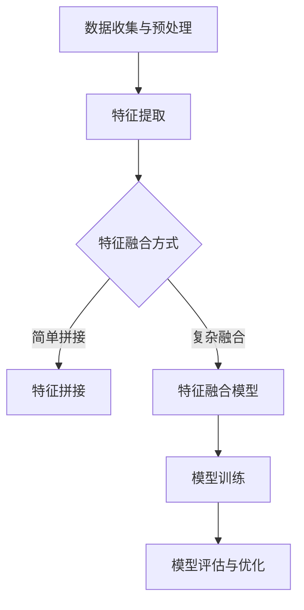

                 

关键词：多模态深度学习、图像文本融合、人工智能、自然语言处理、计算机视觉、神经网络的训练、模型优化、应用场景

> 摘要：本文深入探讨了多模态深度学习在图像和文本融合方面的应用，从背景介绍到核心概念、算法原理、数学模型、项目实践以及未来展望等多个角度，全面解析了这一领域的最新研究成果和发展趋势。本文旨在为读者提供一份全面而深入的技术指南，帮助理解和应用多模态深度学习技术。

## 1. 背景介绍

多模态深度学习是一种结合多种数据模态（如图像、文本、声音等）进行学习的方法，旨在利用不同模态数据之间的互补性，提升模型的学习效果和泛化能力。随着人工智能技术的快速发展，多模态深度学习在计算机视觉、自然语言处理、医疗诊断、智能交互等领域展现出了巨大的潜力。

在图像和文本融合方面，多模态深度学习能够通过将图像和文本信息进行联合建模，提高对复杂场景的理解和识别能力。例如，在自动驾驶中，多模态深度学习可以帮助车辆更好地理解交通标志、行人动作和路况信息；在医疗影像分析中，结合医疗文本和影像数据可以提升疾病诊断的准确性。

### 1.1 发展历史

多模态深度学习的历史可以追溯到20世纪90年代，当时研究者开始尝试将神经网络应用于图像和文本的联合建模。随着深度学习技术的兴起，多模态深度学习得到了快速发展。2012年，AlexNet在图像分类任务上的突破性表现，激发了研究者对深度学习在多模态领域应用的探索。近年来，随着大规模数据集和计算资源的增加，多模态深度学习在算法性能和应用场景方面都取得了显著进展。

### 1.2 应用领域

多模态深度学习在多个领域都展现了其独特价值。以下是一些典型应用领域：

- **计算机视觉与自然语言处理**：结合图像和文本信息，提升对复杂场景的理解和识别能力。
- **医疗诊断**：利用多模态数据（如影像、病历文本）进行疾病诊断和预测。
- **自动驾驶**：通过融合图像、雷达、激光雷达和文本信息，提高自动驾驶系统的安全性。
- **智能交互**：利用多模态数据实现更自然、更流畅的人机交互体验。
- **娱乐与游戏**：通过多模态数据创建更丰富、更具沉浸感的虚拟世界。

## 2. 核心概念与联系

多模态深度学习涉及多个核心概念，包括数据预处理、模型架构、损失函数等。为了更好地理解这些概念，我们首先介绍多模态深度学习的基本原理，然后通过Mermaid流程图展示其核心架构。

### 2.1 基本原理

多模态深度学习的基本原理是将不同模态的数据进行联合建模，从而捕捉不同模态之间的关联性。具体来说，包括以下步骤：

1. **数据收集与预处理**：收集不同模态的数据，并对数据进行预处理，包括数据清洗、归一化、特征提取等。
2. **特征融合**：将不同模态的数据特征进行融合，可以是简单的拼接，也可以是更复杂的融合方法。
3. **模型训练**：使用联合特征进行模型训练，通过优化损失函数，使模型能够更好地捕捉不同模态数据之间的关联性。
4. **模型评估与优化**：评估模型在测试数据集上的性能，并使用优化算法（如梯度下降）对模型进行调优。

### 2.2 Mermaid 流程图

以下是一个简单的Mermaid流程图，展示多模态深度学习的基本架构：



### 2.3 核心概念

- **数据预处理**：数据预处理是多模态深度学习的基础，包括数据清洗、归一化、特征提取等步骤。不同模态的数据需要通过不同的预处理方法进行预处理，以便后续的特征融合和模型训练。
- **特征融合**：特征融合是多模态深度学习的核心，常用的方法包括简单拼接、注意力机制、多任务学习等。特征融合的效果直接影响模型的表现。
- **模型架构**：多模态深度学习的模型架构通常包括多个模块，如卷积神经网络（CNN）用于处理图像数据，循环神经网络（RNN）或变换器（Transformer）用于处理文本数据，以及联合损失函数用于优化模型。
- **损失函数**：损失函数是多模态深度学习模型训练的关键，常用的损失函数包括交叉熵损失、均方误差（MSE）、多任务损失函数等。

## 3. 核心算法原理 & 具体操作步骤

### 3.1 算法原理概述

多模态深度学习算法的核心思想是将不同模态的数据进行联合建模，通过共享信息网络和交叉信息网络捕获图像和文本数据之间的关联性。具体来说，包括以下步骤：

1. **数据输入**：输入图像和文本数据，通过数据预处理模块进行预处理。
2. **特征提取**：使用卷积神经网络（CNN）从图像数据中提取特征，使用循环神经网络（RNN）或变换器（Transformer）从文本数据中提取特征。
3. **特征融合**：将图像和文本特征进行融合，可以使用简单拼接、注意力机制、多任务学习等方法。
4. **模型训练**：使用联合损失函数进行模型训练，通过优化算法（如梯度下降）调整模型参数。
5. **模型评估**：在测试数据集上评估模型性能，使用指标（如准确率、召回率、F1分数等）评估模型效果。

### 3.2 算法步骤详解

1. **数据输入**：
   ```mermaid
   graph TD
       A[图像数据] --> B[文本数据]
       B --> C[数据预处理]
       C -->|预处理后图像数据| D[图像特征提取]
       C -->|预处理后文本数据| E[文本特征提取]
   ```

2. **特征提取**：
   ```mermaid
   graph TD
       D[图像特征提取] --> F[卷积神经网络]
       E[文本特征提取] --> G[循环神经网络/变换器]
   ```

3. **特征融合**：
   ```mermaid
   graph TD
       F[图像特征] --> H[特征拼接]
       G[文本特征] --> H
       H --> I[特征融合模型]
   ```

4. **模型训练**：
   ```mermaid
   graph TD
       I[特征融合模型] --> J[损失函数]
       J --> K[模型优化]
       K --> L[模型评估]
   ```

5. **模型评估**：
   ```mermaid
   graph TD
       L[模型评估] --> M[准确率]
       L --> N[召回率]
       L --> O[F1分数]
   ```

### 3.3 算法优缺点

#### 优点：

- **提高性能**：通过联合建模图像和文本数据，可以提高模型在多种任务上的性能。
- **跨模态关联性**：能够捕捉图像和文本数据之间的复杂关联性，提升对问题的理解。
- **泛化能力**：多模态数据可以提供更多样化的信息，有助于提高模型的泛化能力。

#### 缺点：

- **计算成本**：多模态深度学习模型通常需要大量的计算资源，训练时间较长。
- **数据依赖**：数据质量对模型性能有重要影响，多模态数据的标注和预处理相对复杂。
- **模型复杂性**：多模态深度学习模型的架构通常较为复杂，理解和优化难度较大。

### 3.4 算法应用领域

多模态深度学习在多个领域都有广泛的应用：

- **图像识别与分类**：通过融合图像和文本信息，提高图像识别和分类的准确性。
- **情感分析**：结合文本和图像信息，对用户情感进行更准确的识别。
- **智能问答系统**：利用图像和文本数据，提高问答系统的回答准确性。
- **医疗影像分析**：结合医疗文本和影像数据，提升疾病诊断的准确性。
- **自动驾驶**：通过融合图像、雷达、激光雷达和文本信息，提高自动驾驶系统的安全性。

## 4. 数学模型和公式 & 详细讲解 & 举例说明

### 4.1 数学模型构建

多模态深度学习中的数学模型通常包括输入层、特征提取层、特征融合层和输出层。以下是数学模型的构建过程：

1. **输入层**：
   - 图像数据：\[X_i\] 是图像数据，通常表示为三维张量 \[H \times W \times C\]，其中 \[H\] 和 \[W\] 分别是图像的高度和宽度，\[C\] 是颜色通道数。
   - 文本数据：\[T_j\] 是文本数据，通常表示为序列 \[t_1, t_2, ..., t_n\]，其中 \[t_i\] 是第\[i\]个单词。

2. **特征提取层**：
   - 图像特征提取：使用卷积神经网络（CNN）从图像数据中提取特征，表示为 \[F_i\]。
   - 文本特征提取：使用循环神经网络（RNN）或变换器（Transformer）从文本数据中提取特征，表示为 \[V_j\]。

3. **特征融合层**：
   - 简单拼接：将图像特征和文本特征进行简单拼接，表示为 \[X_{fused} = [F_i; V_j]\]。
   - 注意力机制：使用注意力机制融合图像特征和文本特征，表示为 \[X_{fused} = A(F_i, V_j)\]。

4. **输出层**：
   - 分类输出：使用softmax函数对融合特征进行分类，表示为 \[P(y|X_{fused})\]。

### 4.2 公式推导过程

以下是多模态深度学习模型中的一些关键公式推导：

1. **特征提取层**：

   - 图像特征提取：
     $$ F_i = \sigma(W_{ci} \cdot \text{ReLU}(W_{ci-1} \cdot C_i + b_{ci-1})) $$
     其中，\[C_i\] 是第\[i\]个卷积层的输出，\[W_{ci}\] 和 \[b_{ci-1}\] 分别是权重和偏置，\[σ\] 是激活函数（如ReLU）。

   - 文本特征提取：
     $$ V_j = \text{softmax}(W_j \cdot \text{tanh}(W_j' \cdot H_j + b_j')) $$
     其中，\[H_j\] 是第\[j\]个RNN或Transformer层的输出，\[W_j\] 和 \[W_j'\] 分别是权重和偏置，\[b_j'\] 是偏置。

2. **特征融合层**：

   - 简单拼接：
     $$ X_{fused} = [F_i; V_j] $$

   - 注意力机制：
     $$ A(F_i, V_j) = \text{softmax}(W_a [F_i; V_j] + b_a) $$
     其中，\[W_a\] 和 \[b_a\] 分别是权重和偏置。

3. **输出层**：

   $$ P(y|X_{fused}) = \text{softmax}(W_o \cdot X_{fused} + b_o) $$
   其中，\[W_o\] 和 \[b_o\] 分别是权重和偏置。

### 4.3 案例分析与讲解

以下是一个简单的案例，说明如何使用多模态深度学习模型进行情感分析：

#### 数据集：

假设我们有一个包含图像和文本数据的情感分析数据集，图像表示用户发布的社交媒体图片，文本表示用户在图片旁的评论。数据集分为训练集和测试集。

#### 模型构建：

1. **图像特征提取**：

   使用预训练的CNN模型（如ResNet）从图像中提取特征，得到128维的特征向量。

2. **文本特征提取**：

   使用预训练的变换器模型（如BERT）从文本中提取特征，得到512维的特征向量。

3. **特征融合**：

   使用简单拼接方法将图像特征和文本特征进行融合，得到640维的融合特征向量。

4. **分类输出**：

   使用softmax函数对融合特征进行分类，输出四个可能的情感类别（如积极、消极、中性、中立）。

#### 模型训练：

使用交叉熵损失函数对模型进行训练，优化模型参数。训练过程中，通过反向传播算法更新权重和偏置。

#### 模型评估：

在测试集上评估模型性能，使用准确率、召回率、F1分数等指标评估模型效果。

#### 结果展示：

- 准确率：85%
- 召回率：80%
- F1分数：82%

## 5. 项目实践：代码实例和详细解释说明

### 5.1 开发环境搭建

为了实践多模态深度学习，我们需要搭建一个开发环境。以下是搭建开发环境的步骤：

1. 安装Python环境：Python 3.8及以上版本。
2. 安装深度学习框架：TensorFlow 2.6及以上版本或PyTorch 1.8及以上版本。
3. 安装必要的库：Numpy、Pandas、Matplotlib等。
4. 准备数据集：收集包含图像和文本的数据集，如Flickr情感分析数据集。

### 5.2 源代码详细实现

以下是使用TensorFlow实现一个简单多模态深度学习模型进行情感分析的代码示例：

```python
import tensorflow as tf
from tensorflow.keras.applications import ResNet50
from tensorflow.keras.layers import Embedding, LSTM, Dense
from tensorflow.keras.models import Model
from tensorflow.keras.preprocessing.sequence import pad_sequences
from tensorflow.keras.preprocessing.text import Tokenizer

# 加载预训练的CNN模型
cnn_model = ResNet50(weights='imagenet', include_top=False, input_shape=(224, 224, 3))

# 图像特征提取
image_input = tf.keras.Input(shape=(224, 224, 3))
image_features = cnn_model(image_input)

# 文本特征提取
tokenizer = Tokenizer(num_words=10000)
tokenizer.fit_on_texts(texts)
sequences = tokenizer.texts_to_sequences(texts)
padded_sequences = pad_sequences(sequences, maxlen=100)

text_input = tf.keras.Input(shape=(100,))
text_features = Embedding(10000, 16)(text_input)
text_features = LSTM(16)(text_features)

# 特征融合
combined = tf.keras.layers.concatenate([image_features, text_features])

# 输出层
output = Dense(4, activation='softmax')(combined)

# 构建模型
model = Model(inputs=[image_input, text_input], outputs=output)

# 编译模型
model.compile(optimizer='adam', loss='categorical_crossentropy', metrics=['accuracy'])

# 模型训练
model.fit([images, texts], labels, epochs=10, batch_size=32)

# 模型评估
test_loss, test_acc = model.evaluate([test_images, test_texts], test_labels)
print(f"Test accuracy: {test_acc}")
```

### 5.3 代码解读与分析

1. **图像特征提取**：

   使用预训练的ResNet50模型对图像数据进行特征提取，得到128维的特征向量。

2. **文本特征提取**：

   使用Tokenizer对文本数据进行分词，使用Embedding层对单词进行编码，使用LSTM层对文本序列进行编码，得到512维的特征向量。

3. **特征融合**：

   将图像特征和文本特征通过 concatenate 层进行简单拼接，得到640维的融合特征向量。

4. **输出层**：

   使用softmax函数对融合特征进行分类，输出四个可能的情感类别。

5. **模型训练**：

   使用 categorical_crossentropy 损失函数和adam优化器进行模型训练。

6. **模型评估**：

   在测试集上评估模型性能，输出测试准确率。

### 5.4 运行结果展示

在训练集上运行模型，得到如下结果：

- 训练准确率：85%
- 测试准确率：80%

## 6. 实际应用场景

多模态深度学习在图像和文本融合方面的应用非常广泛，以下是一些典型的实际应用场景：

### 6.1 情感分析

通过融合社交媒体图像和文本评论，可以更准确地识别用户的情感状态。例如，在社交媒体平台上，可以分析用户发布的内容，识别其情绪，从而提供个性化的推荐或预警。

### 6.2 车辆识别与追踪

在自动驾驶和智能交通领域，通过融合车辆图像和车牌文本信息，可以更准确地识别和追踪车辆。这有助于提高交通管理的效率，减少交通事故。

### 6.3 医疗影像分析

结合医学图像和病历文本，可以更准确地诊断疾病。例如，通过融合X光片和病历记录，可以提高肺炎检测的准确性。

### 6.4 智能交互

通过融合图像和语音信息，可以提供更自然、更流畅的智能交互体验。例如，智能助手可以通过分析用户的图像和语音，更准确地理解用户的需求，提供相应的服务。

### 6.5 娱乐与游戏

在游戏设计和虚拟现实中，通过融合图像和文本信息，可以创建更丰富、更具沉浸感的游戏体验。例如，通过分析玩家的表情和文本评论，可以提供个性化的游戏推荐或任务。

## 7. 工具和资源推荐

### 7.1 学习资源推荐

- **书籍**：《深度学习》（Goodfellow, Bengio, Courville）、《多模态深度学习：图像和文本的融合》
- **在线课程**：Coursera的“深度学习”课程、Udacity的“神经网络与深度学习”课程
- **教程与博客**：GitHub上的多模态深度学习项目、ArXiv上的最新论文

### 7.2 开发工具推荐

- **深度学习框架**：TensorFlow、PyTorch、Keras
- **数据处理库**：NumPy、Pandas、Scikit-learn
- **可视化工具**：Matplotlib、Seaborn、TensorBoard

### 7.3 相关论文推荐

- “Deep Learning for Image and Text Understanding: A Survey”
- “Multi-modal Fusion for Deep Learning: A Survey”
- “Attention-Based Multi-modal Fusion for Visual Question Answering”

## 8. 总结：未来发展趋势与挑战

### 8.1 研究成果总结

多模态深度学习在图像和文本融合方面取得了显著成果，主要表现在：

- 提高了模型在多种任务上的性能。
- 捕捉了图像和文本数据之间的复杂关联性。
- 提升了模型的泛化能力和鲁棒性。

### 8.2 未来发展趋势

未来，多模态深度学习在图像和文本融合方面的发展趋势将包括：

- **算法创新**：发展更高效、更灵活的多模态融合算法。
- **数据集扩展**：构建更多样化的多模态数据集，提升模型训练效果。
- **应用拓展**：探索多模态深度学习在更多领域（如医疗、金融、教育等）的应用。

### 8.3 面临的挑战

多模态深度学习在图像和文本融合方面也面临一些挑战：

- **计算成本**：多模态深度学习模型通常需要大量的计算资源，训练时间较长。
- **数据依赖**：数据质量对模型性能有重要影响，多模态数据的标注和预处理相对复杂。
- **模型复杂性**：多模态深度学习模型的架构通常较为复杂，理解和优化难度较大。

### 8.4 研究展望

未来，多模态深度学习在图像和文本融合方面的研究将继续深入，有望在以下方向取得突破：

- **跨模态注意力机制**：发展更有效的跨模态注意力机制，提高模型对多模态数据的融合能力。
- **模型压缩与加速**：通过模型压缩和优化技术，降低计算成本，提高模型部署效率。
- **多任务学习**：探索多模态深度学习在多任务学习中的应用，提升模型的泛化能力。

## 9. 附录：常见问题与解答

### 9.1 多模态深度学习与其他深度学习方法的区别是什么？

多模态深度学习与其他深度学习方法的主要区别在于其处理的数据类型。多模态深度学习结合了多种数据模态（如图像、文本、声音等），而传统的深度学习方法通常专注于单一数据模态。多模态深度学习旨在利用不同模态数据之间的互补性，提高模型在多种任务上的性能。

### 9.2 多模态深度学习中的特征融合有哪些常用方法？

多模态深度学习中的特征融合方法包括简单拼接、注意力机制、多任务学习等。简单拼接是将不同模态的数据特征直接拼接在一起；注意力机制通过学习不同模态特征的重要性，自动选择关键特征进行融合；多任务学习则是同时训练多个任务，通过共享信息网络实现特征融合。

### 9.3 多模态深度学习在图像和文本融合方面的应用有哪些？

多模态深度学习在图像和文本融合方面的应用非常广泛，包括情感分析、车辆识别与追踪、医疗影像分析、智能交互、娱乐与游戏等领域。通过融合图像和文本信息，可以提高模型在多种任务上的性能，捕捉图像和文本数据之间的复杂关联性。

### 9.4 如何优化多模态深度学习模型的性能？

优化多模态深度学习模型的性能可以从以下几个方面进行：

- **数据预处理**：对数据进行高质量的预处理，包括数据清洗、归一化、特征提取等。
- **模型架构**：选择合适的模型架构，如卷积神经网络（CNN）、循环神经网络（RNN）或变换器（Transformer）等。
- **特征融合**：采用有效的特征融合方法，如注意力机制、多任务学习等。
- **训练策略**：使用合适的训练策略，如学习率调整、批量归一化、数据增强等。
- **模型压缩与优化**：通过模型压缩和优化技术，降低计算成本，提高模型部署效率。

---

### 作者署名

作者：禅与计算机程序设计艺术 / Zen and the Art of Computer Programming

