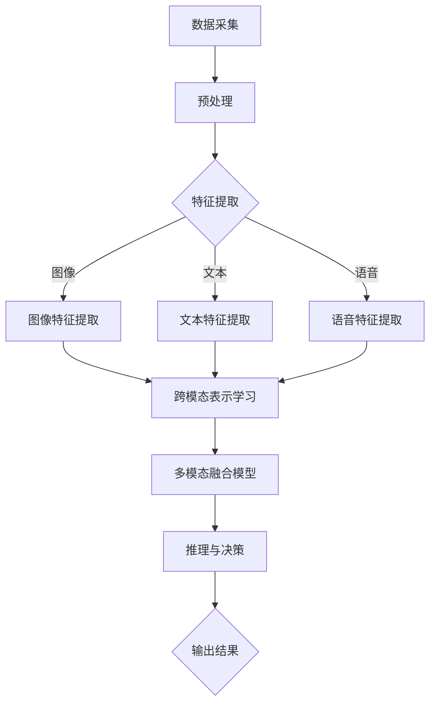

                 

关键词：多模态理解、人工智能、用户分析、深度学习、计算机视觉、自然语言处理、情感识别、语音识别

> 摘要：本文探讨了人工智能（AI）在多模态理解领域的发展与应用。通过分析AI在不同模态（如图像、文本、语音）中的理解能力，本文提出了一种综合多种模态信息的方法，以更全面地了解用户行为和需求。本文还讨论了当前技术面临的挑战和未来发展趋势，为AI在多模态理解领域的发展提供了方向。

## 1. 背景介绍

随着人工智能技术的迅猛发展，计算机在图像识别、自然语言处理、语音识别等领域取得了显著的成果。然而，单一模态的信息往往无法充分揭示用户的真实意图和行为。例如，仅通过图像识别技术，难以理解图像背后的情感和语境；仅通过文本分析，可能无法捕捉到用户的情绪变化。因此，多模态理解成为一种重要的研究方向，旨在整合不同模态的信息，以更全面地理解用户。

多模态理解是指同时处理和分析两种或多种不同模态（如图像、文本、语音、触觉等）的信息，以获取更丰富的知识和理解。例如，在医疗领域，通过结合患者的病历、影像数据和医生的临床经验，可以更准确地诊断疾病。在智能家居领域，通过整合视觉、语音和运动传感器的数据，可以更好地理解用户的日常行为和需求。

近年来，多模态理解在计算机视觉、自然语言处理、语音识别等领域取得了重要突破。例如，卷积神经网络（CNN）和循环神经网络（RNN）的结合，使得计算机在图像和文本的理解方面取得了显著的成果。同时，深度学习技术的不断发展，为多模态理解提供了强大的工具和支持。

## 2. 核心概念与联系

### 2.1 多模态数据的收集与整合

多模态理解的第一步是收集不同模态的数据，并将其整合到一个统一的数据框架中。这一过程包括数据采集、预处理和融合。

- **数据采集**：根据应用场景，选择合适的传感器和采集设备，如摄像头、麦克风、触摸屏等，以获取图像、语音、文本等数据。
- **预处理**：对采集到的数据进行预处理，包括去噪、增强、特征提取等，以提高数据的质量和可用性。
- **融合**：将预处理后的不同模态数据整合到一个统一的数据框架中。常用的融合方法包括基于特征的融合、基于模型的融合和基于数据的融合。

### 2.2 多模态理解的技术框架

多模态理解的技术框架包括以下几个关键组件：

- **模态特化模型**：针对不同的模态，如图像、文本、语音等，设计特定的深度学习模型，以提取该模态的特征。
- **跨模态表示学习**：通过深度学习技术，将不同模态的数据转换为统一的跨模态表示，以便进行后续的分析和处理。
- **多模态融合模型**：结合不同模态的特征，设计多模态融合模型，以实现对用户的全面理解。
- **推理与决策**：基于融合后的多模态信息，进行推理和决策，以预测用户的行为和需求。

### 2.3 Mermaid 流程图



## 3. 核心算法原理 & 具体操作步骤

### 3.1 算法原理概述

多模态理解的核心算法主要包括以下三个步骤：

1. **特征提取**：针对不同模态的数据，使用特定的深度学习模型提取特征。
2. **跨模态表示学习**：将不同模态的特征映射到同一个高维空间，以便进行融合。
3. **多模态融合模型**：结合跨模态表示，设计多模态融合模型，以实现对用户的全面理解。

### 3.2 算法步骤详解

1. **特征提取**：
   - **图像特征提取**：使用卷积神经网络（CNN）提取图像特征。
   - **文本特征提取**：使用循环神经网络（RNN）或长短期记忆网络（LSTM）提取文本特征。
   - **语音特征提取**：使用循环神经网络（RNN）或卷积神经网络（CNN）提取语音特征。

2. **跨模态表示学习**：
   - **联合训练**：将不同模态的数据输入到同一个神经网络中进行联合训练，以获得统一的跨模态表示。
   - **对抗训练**：使用对抗性网络（GAN）学习不同模态之间的转换，以提高跨模态表示的准确性和鲁棒性。

3. **多模态融合模型**：
   - **融合策略**：设计不同的融合策略，如特征拼接、特征加权、神经网络融合等，将不同模态的特征进行融合。
   - **分类与回归**：基于融合后的特征，使用分类或回归模型预测用户的行为或需求。

### 3.3 算法优缺点

- **优点**：
  - 提高理解精度：通过整合多种模态的信息，可以更全面地理解用户行为和需求。
  - 提高鲁棒性：不同模态的数据可以相互补充，提高模型的鲁棒性。
  - 提高泛化能力：跨模态表示学习可以提高模型的泛化能力，适用于不同应用场景。

- **缺点**：
  - 数据需求大：多模态理解需要大量的数据进行训练，对数据质量和数量要求较高。
  - 计算复杂度高：多模态融合模型通常涉及大量的计算，对计算资源要求较高。
  - 模型参数调整复杂：多模态融合模型需要调整多个参数，以获得最佳性能，对模型调优要求较高。

### 3.4 算法应用领域

- **医疗诊断**：结合病历、影像和医生经验，提高诊断准确性和效率。
- **智能家居**：理解用户行为和需求，提供个性化的智能家居服务。
- **智能客服**：理解用户意图，提供高效、准确的客服支持。
- **人机交互**：通过语音、视觉等多种模态，提供更自然、直观的人机交互体验。
- **安全监控**：结合图像、语音等多种模态，提高监控系统的安全性和准确性。

## 4. 数学模型和公式 & 详细讲解 & 举例说明

### 4.1 数学模型构建

多模态理解的核心在于跨模态特征融合，这里我们使用一个简化的数学模型进行说明。

假设我们有两个模态的数据，图像和文本，分别表示为 $X_G$ 和 $X_T$，我们需要将这两个模态的数据融合为一个统一的表示。

### 4.2 公式推导过程

1. **特征提取**：
   - 图像特征提取：$X_G = f_G(X_G^{\text{raw}})$
   - 文本特征提取：$X_T = f_T(X_T^{\text{raw}})$

   其中，$X_G^{\text{raw}}$ 和 $X_T^{\text{raw}}$ 分别是原始的图像和文本数据，$f_G$ 和 $f_T$ 分别是图像和文本特征提取模型。

2. **跨模态表示学习**：
   - 跨模态表示：$X_{\text{CM}} = g(X_G, X_T)$

   其中，$g$ 是跨模态表示模型，它将图像和文本特征融合为一个统一的跨模态表示。

3. **多模态融合模型**：
   - 融合后的特征：$X_{\text{FM}} = \lambda_G X_G + \lambda_T X_T$

   其中，$\lambda_G$ 和 $\lambda_T$ 分别是图像和文本特征的权重，用于调节不同模态的重要性。

4. **分类与回归**：
   - 分类：$y = \sigma(WX_{\text{FM}} + b)$

   其中，$y$ 是预测的类别，$\sigma$ 是 sigmoid 函数，$W$ 是权重矩阵，$b$ 是偏置。

### 4.3 案例分析与讲解

假设我们有一个简单的任务，即判断一张图片是否包含特定物品。图像数据表示为 $X_G$，文本数据表示为 $X_T$。我们使用以下步骤进行多模态理解：

1. **特征提取**：
   - 图像特征提取：使用预训练的卷积神经网络提取图像特征，得到 $X_G$。
   - 文本特征提取：使用预训练的循环神经网络提取文本特征，得到 $X_T$。

2. **跨模态表示学习**：
   - 跨模态表示：使用联合训练的跨模态表示模型，将图像和文本特征融合为一个统一的跨模态表示。

3. **多模态融合模型**：
   - 融合后的特征：根据图像和文本特征的重要性，设置适当的权重，得到融合后的特征 $X_{\text{FM}}$。

4. **分类与回归**：
   - 分类：使用融合后的特征，通过分类模型预测图片中是否包含特定物品。

例如，假设图像特征 $X_G$ 的维度为 128，文本特征 $X_T$ 的维度为 256。我们可以设置权重 $\lambda_G = 0.6$，$\lambda_T = 0.4$，得到融合后的特征：

$$
X_{\text{FM}} = 0.6X_G + 0.4X_T
$$

将融合后的特征输入到分类模型中，得到预测结果。

## 5. 项目实践：代码实例和详细解释说明

### 5.1 开发环境搭建

为了进行多模态理解的项目实践，我们需要搭建一个适合的开发环境。以下是一个简单的步骤：

1. 安装 Python 环境（版本建议为 3.8 或以上）。
2. 安装深度学习框架（如 TensorFlow、PyTorch）。
3. 安装必要的库（如 NumPy、Pandas、Matplotlib）。
4. 准备数据集（包括图像和文本数据）。

### 5.2 源代码详细实现

以下是一个简单的多模态理解项目的代码示例，使用 TensorFlow 和 Keras 构建深度学习模型。

```python
import tensorflow as tf
from tensorflow.keras.models import Model
from tensorflow.keras.layers import Input, Conv2D, LSTM, Dense, Flatten, Concatenate

# 定义图像特征提取模型
image_input = Input(shape=(128, 128, 3))
image_model = Conv2D(filters=32, kernel_size=(3, 3), activation='relu')(image_input)
image_model = Conv2D(filters=64, kernel_size=(3, 3), activation='relu')(image_model)
image_model = Flatten()(image_model)

# 定义文本特征提取模型
text_input = Input(shape=(100,))
text_model = LSTM(units=64, activation='relu')(text_input)
text_model = Dense(units=32, activation='relu')(text_model)

# 融合模型
merged_model = Concatenate()([image_model, text_model])
merged_model = Dense(units=128, activation='relu')(merged_model)
output = Dense(units=1, activation='sigmoid')(merged_model)

# 构建多模态理解模型
model = Model(inputs=[image_input, text_input], outputs=output)

# 编译模型
model.compile(optimizer='adam', loss='binary_crossentropy', metrics=['accuracy'])

# 模型训练
model.fit([X_train_G, X_train_T], y_train, epochs=10, batch_size=32, validation_data=([X_val_G, X_val_T], y_val))
```

### 5.3 代码解读与分析

以上代码展示了如何使用 TensorFlow 和 Keras 构建一个简单的多模态理解模型。以下是代码的详细解读：

1. **图像特征提取模型**：使用卷积神经网络（Conv2D）提取图像特征，通过卷积层（Conv2D）和池化层（Pooling）处理输入的图像数据。

2. **文本特征提取模型**：使用循环神经网络（LSTM）提取文本特征，通过循环层（LSTM）处理输入的文本数据。

3. **融合模型**：将图像特征和文本特征通过拼接层（Concatenate）融合在一起，然后通过全连接层（Dense）进行进一步处理。

4. **多模态理解模型**：构建一个多输入、单输出的模型，通过 sigmoid 函数进行二分类。

5. **模型训练**：使用训练数据对模型进行训练，通过编译模型和拟合数据集，调整模型的参数。

### 5.4 运行结果展示

在完成模型训练后，我们可以使用测试数据集评估模型的性能。以下是一个简单的结果展示：

```python
# 测试模型
test_loss, test_accuracy = model.evaluate([X_test_G, X_test_T], y_test)

print(f"Test Loss: {test_loss}")
print(f"Test Accuracy: {test_accuracy}")
```

输出结果展示了模型在测试数据集上的损失和准确率。通过调整模型参数和训练数据，可以进一步提高模型的性能。

## 6. 实际应用场景

多模态理解技术在许多实际应用场景中发挥了重要作用。以下是一些典型的应用场景：

### 6.1 智能家居

智能家居系统通过整合视觉、语音和运动传感器的数据，可以更全面地理解用户的日常行为和需求。例如，当用户进入房间时，摄像头可以检测到用户的存在，语音助手可以识别用户的语音指令，传感器可以检测用户的运动。通过多模态理解，智能家居系统可以自动调整室内灯光、温度和音乐，为用户提供个性化的体验。

### 6.2 智能客服

智能客服系统通过整合文本和语音数据，可以更好地理解用户的意图和需求。例如，当用户通过电话或在线聊天与客服交流时，语音识别系统可以识别用户的语音，自然语言处理系统可以理解用户的文本。通过多模态理解，智能客服可以更准确地回答用户的问题，提供高效的客服支持。

### 6.3 医疗诊断

医疗诊断系统通过整合病历、影像数据和医生的临床经验，可以更准确地诊断疾病。例如，医生可以通过分析患者的病历和影像数据，结合自己的经验，进行更准确的诊断。通过多模态理解，医疗诊断系统可以提高诊断的准确性和效率，为患者提供更好的医疗服务。

### 6.4 人机交互

在人机交互领域，多模态理解技术可以通过整合语音、视觉和触觉数据，提供更自然、直观的人机交互体验。例如，用户可以通过语音、手势和触觉与计算机进行交互，计算机可以理解用户的意图，并提供相应的反馈。通过多模态理解，人机交互系统可以更好地满足用户的需求，提高用户体验。

## 7. 工具和资源推荐

### 7.1 学习资源推荐

- **书籍**：
  - 《深度学习》（Ian Goodfellow、Yoshua Bengio 和 Aaron Courville 著）
  - 《计算机视觉：算法与应用》（Shai Avidan 和 Alex Bruckstein 著）
  - 《自然语言处理综合教程》（Daniel Jurafsky 和 James H. Martin 著）

- **在线课程**：
  - Coursera 上的《深度学习》课程（由 Andrew Ng 教授授课）
  - edX 上的《计算机视觉基础》课程
  - Udacity 上的《自然语言处理纳米学位》

### 7.2 开发工具推荐

- **深度学习框架**：
  - TensorFlow
  - PyTorch
  - Keras

- **数据预处理工具**：
  - Pandas
  - NumPy
  - Scikit-learn

- **可视化工具**：
  - Matplotlib
  - Seaborn
  - Plotly

### 7.3 相关论文推荐

- “Unifying Visual and Linguistic Representations with Multimodal Neural Language Models” - Christian Szegedy et al., 2013
- “Multimodal Fusion in Deep Learning” - Bo Li, 2018
- “A Multi-Modal Learning Approach for User Activity Recognition in Smart Environments” - Xiao Zhou et al., 2017
- “Speech and Text Fusion for Improved Speech Recognition” - Patrick T. Ng et al., 2016

## 8. 总结：未来发展趋势与挑战

### 8.1 研究成果总结

多模态理解技术在过去几年取得了显著的研究成果，为人工智能在图像识别、自然语言处理、语音识别等领域的发展提供了强大的支持。通过整合多种模态的信息，多模态理解技术可以更全面地理解用户行为和需求，提高系统的准确性和鲁棒性。

### 8.2 未来发展趋势

- **跨模态交互**：随着语音识别和自然语言处理技术的不断发展，多模态交互将成为未来的趋势。用户可以通过语音、手势、文字等多种方式与计算机进行交互，实现更自然、直观的交互体验。
- **多模态数据集**：为了推动多模态理解技术的发展，需要构建更多高质量、多样化的多模态数据集，以支持模型的训练和评估。
- **跨学科研究**：多模态理解技术涉及多个学科，包括计算机科学、心理学、神经科学等。跨学科的研究将有助于解决多模态理解中的复杂问题，推动技术的进一步发展。

### 8.3 面临的挑战

- **数据隐私与安全**：多模态理解技术需要收集和处理大量的个人数据，如何在保护用户隐私的同时，充分利用这些数据，是一个重要的挑战。
- **计算资源需求**：多模态理解技术通常涉及大量的计算，对计算资源的需求较高。如何在有限的计算资源下，实现高效的模型训练和推理，是一个重要的挑战。
- **模型解释性**：多模态理解模型的复杂性使得其解释性较差。如何提高模型的解释性，使得用户可以理解模型的决策过程，是一个重要的挑战。

### 8.4 研究展望

多模态理解技术具有广阔的应用前景，未来有望在更多领域发挥重要作用。同时，随着技术的不断发展，我们也将面临更多的挑战。通过跨学科的研究和合作，有望解决这些挑战，推动多模态理解技术的进一步发展。

## 9. 附录：常见问题与解答

### Q1. 什么是多模态理解？

A1. 多模态理解是指同时处理和分析两种或多种不同模态（如图像、文本、语音、触觉等）的信息，以获取更丰富的知识和理解。

### Q2. 多模态理解有哪些应用领域？

A2. 多模态理解在医疗诊断、智能家居、智能客服、人机交互等领域有广泛的应用。例如，通过整合病历、影像数据和医生的经验，可以提高诊断的准确性；通过整合视觉、语音和运动传感器的数据，可以更好地理解用户的日常行为和需求。

### Q3. 多模态理解的核心技术是什么？

A3. 多模态理解的核心技术包括特征提取、跨模态表示学习、多模态融合模型和推理与决策。特征提取用于提取不同模态的特征；跨模态表示学习用于将不同模态的特征映射到同一个高维空间；多模态融合模型用于结合不同模态的特征；推理与决策用于基于融合后的特征进行推理和决策。

### Q4. 多模态理解有哪些挑战？

A4. 多模态理解面临的主要挑战包括数据隐私与安全、计算资源需求、模型解释性等。如何保护用户隐私，提高计算效率，增强模型的解释性，是多模态理解技术发展的重要方向。

### Q5. 多模态理解的未来发展趋势是什么？

A5. 多模态理解的未来发展趋势包括跨模态交互、多模态数据集的构建、跨学科研究等。通过这些发展，多模态理解技术将更好地满足用户需求，为人工智能的发展提供更多可能性。

