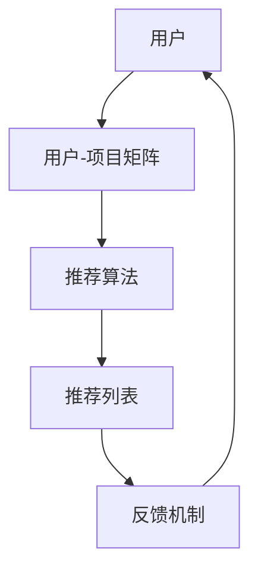

                 

关键词：大数据，AI，电商搜索，推荐系统，准确率，用户体验

> 摘要：本文将深入探讨大数据与人工智能技术在电商搜索推荐系统中的应用，重点分析如何通过优化算法和模型来提高推荐系统的准确率和用户体验。文章从背景介绍开始，逐步深入到核心算法原理、数学模型构建，以及实际应用案例分析，最后展望未来的发展趋势和面临的挑战。

## 1. 背景介绍

随着互联网的快速发展，电子商务已经成为全球商业的重要组成部分。电商平台的崛起，不仅改变了消费者的购物习惯，也极大地丰富了商品种类和数量。与此同时，如何在海量商品中快速、准确地找到消费者所需的商品，成为电商企业面临的重要挑战。

推荐系统作为一种智能搜索技术，通过分析用户的行为数据和偏好，为用户个性化地推荐他们可能感兴趣的商品。推荐系统在电商领域的重要性不言而喻，它不仅能够提高用户的购物体验，还能显著提升电商平台的销售额和用户留存率。

大数据和人工智能技术的快速发展，为电商推荐系统带来了新的机遇。大数据技术能够高效地处理和分析海量数据，为推荐系统提供更丰富和精准的用户行为特征。人工智能技术则能够通过深度学习、机器学习等方法，不断优化推荐算法，提高推荐的准确率和效果。

本文将围绕大数据与AI驱动的电商搜索推荐系统，探讨如何通过优化算法和模型来提高推荐系统的准确率和用户体验。文章首先介绍推荐系统的基础概念和架构，然后深入分析核心算法原理和数学模型，最后通过实际案例和代码实例进行详细讲解。

## 2. 核心概念与联系

### 2.1 推荐系统基础概念

推荐系统（Recommender System）是一种信息过滤技术，旨在预测用户可能对哪些项目感兴趣，从而向他们推荐相应的项目。推荐系统通常基于以下三个核心概念：

- **用户**：推荐系统的核心参与者，每个用户都有独特的偏好和需求。
- **项目**：推荐系统推荐的实体，如商品、文章、音乐等。
- **评分或行为**：用户对项目的评价或行为，如购买、点击、收藏等。

### 2.2 推荐系统架构

推荐系统的典型架构通常包括以下三个主要组件：

- **用户-项目矩阵**：记录用户对项目的评分或行为，是构建推荐模型的基础数据。
- **推荐算法**：根据用户-项目矩阵，通过机器学习或深度学习等方法生成推荐列表。
- **反馈机制**：收集用户对推荐结果的评价，用于模型优化和性能评估。

### 2.3 大数据与AI技术在推荐系统中的应用

大数据技术能够高效地处理海量用户行为数据，提取出有用的特征信息。例如，通过数据挖掘技术，可以分析用户的浏览历史、购买记录、评价等，挖掘出用户的偏好和行为模式。

人工智能技术则通过机器学习和深度学习算法，对大数据进行处理和分析，生成个性化的推荐列表。常见的AI技术在推荐系统中的应用包括：

- **协同过滤（Collaborative Filtering）**：通过分析用户之间的相似性，为用户推荐他们可能感兴趣的项目。
- **基于内容的推荐（Content-Based Filtering）**：根据用户对项目的偏好，推荐相似的项目。
- **深度学习（Deep Learning）**：通过构建深度神经网络，对用户行为数据进行分析和预测。

### 2.4 Mermaid 流程图

以下是推荐系统核心概念与架构的Mermaid流程图：



## 3. 核心算法原理 & 具体操作步骤

### 3.1 算法原理概述

推荐系统的核心算法主要包括协同过滤、基于内容的推荐和深度学习。每种算法都有其独特的原理和应用场景。

#### 3.1.1 协同过滤

协同过滤是一种基于用户行为数据的推荐算法，主要通过分析用户之间的相似性来生成推荐列表。协同过滤可分为以下两种类型：

- **用户基于的协同过滤（User-Based Collaborative Filtering）**：通过计算用户之间的相似性，为用户推荐与他们相似的其他用户喜欢的项目。
- **物品基于的协同过滤（Item-Based Collaborative Filtering）**：通过计算项目之间的相似性，为用户推荐与他们已评价项目相似的其他项目。

#### 3.1.2 基于内容的推荐

基于内容的推荐算法通过分析项目的内容特征和用户的历史偏好，为用户推荐相似的项目。其基本原理如下：

- **内容特征提取**：对项目的内容进行特征提取，如关键词提取、文本分类等。
- **相似度计算**：计算用户历史偏好项目与待推荐项目的相似度。
- **生成推荐列表**：根据相似度分数，生成个性化的推荐列表。

#### 3.1.3 深度学习

深度学习是一种基于人工神经网络的机器学习技术，通过多层神经网络对用户行为数据进行学习和建模，生成推荐列表。常见的深度学习模型包括：

- **深度神经网络（Deep Neural Network, DNN）**
- **卷积神经网络（Convolutional Neural Network, CNN）**
- **循环神经网络（Recurrent Neural Network, RNN）**
- **长短时记忆网络（Long Short-Term Memory, LSTM）**
- **图神经网络（Graph Neural Network, GNN）**

### 3.2 算法步骤详解

以下以用户基于的协同过滤算法为例，详细介绍其具体操作步骤：

#### 3.2.1 数据预处理

1. **收集用户行为数据**：如购买记录、浏览记录、评价等。
2. **数据清洗**：去除缺失值、异常值和重复值。
3. **数据标准化**：对行为数据进行标准化处理，使其具有相同的量纲。

#### 3.2.2 计算用户相似性

1. **计算用户相似度矩阵**：使用余弦相似度、皮尔逊相关系数等计算用户之间的相似性。
2. **筛选相似用户**：设置阈值，筛选出相似度较高的用户。

#### 3.2.3 生成推荐列表

1. **计算相似用户评分预测**：根据用户相似度矩阵，为用户预测未评分项目的评分。
2. **生成推荐列表**：根据预测评分，对未评分项目进行排序，生成推荐列表。

### 3.3 算法优缺点

#### 3.3.1 协同过滤

**优点**：

- **可扩展性强**：适用于大规模用户和项目数据。
- **个性化推荐**：根据用户历史行为和偏好进行推荐，具有一定的个性化效果。

**缺点**：

- **冷启动问题**：对新用户或新项目无法进行有效推荐。
- **数据稀疏性**：当用户和项目数量较多时，用户行为数据矩阵往往具有很高的稀疏性。

#### 3.3.2 基于内容的推荐

**优点**：

- **冷启动问题相对较小**：通过对项目内容特征进行分析，可以对新项目进行有效推荐。
- **推荐质量较高**：基于用户历史偏好，推荐相似的项目，具有较高的推荐质量。

**缺点**：

- **用户偏好变化敏感**：用户偏好变化可能导致推荐结果不稳定。
- **内容特征提取难度大**：对项目内容特征进行提取和匹配，需要较高的计算资源和算法实现难度。

#### 3.3.3 深度学习

**优点**：

- **高维度特征表示**：深度学习能够自动提取高维度的用户行为特征，有助于提高推荐质量。
- **可处理复杂关系**：通过构建深度神经网络，可以处理用户行为数据中的复杂关系和依赖。

**缺点**：

- **计算资源需求大**：深度学习算法通常需要大量的计算资源和时间。
- **模型解释性较差**：深度学习模型具有一定的“黑盒”性质，难以进行直观的解释。

### 3.4 算法应用领域

协同过滤、基于内容的推荐和深度学习技术在推荐系统中的应用非常广泛，包括但不限于以下领域：

- **电子商务**：为用户推荐可能感兴趣的商品。
- **社交媒体**：为用户推荐可能感兴趣的朋友、内容等。
- **在线教育**：为用户推荐适合的学习课程、教材等。
- **新闻推送**：为用户推荐可能感兴趣的新闻、文章等。
- **医疗健康**：为用户提供个性化的健康建议和治疗方案。

## 4. 数学模型和公式 & 详细讲解 & 举例说明

### 4.1 数学模型构建

推荐系统的数学模型通常包括用户-项目矩阵、相似性计算、预测评分等。以下分别介绍这些数学模型。

#### 4.1.1 用户-项目矩阵

用户-项目矩阵是一个二维矩阵，其中行表示用户，列表示项目，矩阵中的元素表示用户对项目的评分或行为。设用户集合为U={u1, u2, ..., un}，项目集合为I={i1, i2, ..., im}，用户-项目矩阵为R∈R^(n×m)，则R中的元素r_ij表示用户ui对项目ij的评分。

#### 4.1.2 相似性计算

相似性计算是推荐系统的重要步骤，用于衡量用户或项目之间的相似程度。常见的相似性计算方法包括余弦相似度、皮尔逊相关系数等。以用户基于的协同过滤为例，用户ui与用户uj之间的相似性计算公式如下：

$$
sim(u_i, u_j) = \frac{R_{i*} \cdot R_{j*}}{\sqrt{R_{i*}^2 + R_{j*}^2}}
$$

其中，R_{i*}表示用户ui对所有项目的评分向量的和，R_{j*}表示用户uj对所有项目的评分向量的和。

#### 4.1.3 预测评分

预测评分是推荐系统的核心目标，用于预测用户对未评分项目的评分。以基于内容的推荐为例，预测评分的计算公式如下：

$$
r_{ij}^{'} = \sum_{k \in N_j} w_{ik} \cdot r_{kj}
$$

其中，r_{ij}^{'}表示用户ui对项目ij的预测评分，w_{ik}表示项目ik与项目ij的相似度权重，r_{kj}表示用户uj对项目ik的评分，N_j表示与项目ij相似的项目集合。

### 4.2 公式推导过程

以下以用户基于的协同过滤算法为例，介绍相似性计算和预测评分的推导过程。

#### 4.2.1 相似性计算推导

用户ui与用户uj之间的相似性计算公式为：

$$
sim(u_i, u_j) = \frac{R_{i*} \cdot R_{j*}}{\sqrt{R_{i*}^2 + R_{j*}^2}}
$$

其中，R_{i*}和R_{j*}分别表示用户ui和用户uj对所有项目的评分向量的和。

对R_{i*}和R_{j*}进行展开，可以得到：

$$
R_{i*} = \sum_{k=1}^{m} r_{ik}
$$

$$
R_{j*} = \sum_{k=1}^{m} r_{jk}
$$

将R_{i*}和R_{j*}代入相似性计算公式，得到：

$$
sim(u_i, u_j) = \frac{\sum_{k=1}^{m} r_{ik} \cdot \sum_{k=1}^{m} r_{jk}}{\sqrt{\sum_{k=1}^{m} r_{ik}^2 + \sum_{k=1}^{m} r_{jk}^2}}
$$

进一步化简，得到：

$$
sim(u_i, u_j) = \frac{\sum_{k=1}^{m} r_{ik} \cdot r_{jk}}{\sqrt{\sum_{k=1}^{m} r_{ik}^2 + \sum_{k=1}^{m} r_{jk}^2}} = \frac{\sum_{k=1}^{m} r_{ik} \cdot r_{jk}}{\sqrt{\sum_{k=1}^{m} r_{ik}^2} \cdot \sqrt{\sum_{k=1}^{m} r_{jk}^2}}
$$

由于$r_{ik}^2$和$r_{jk}^2$均为正值，所以可以进一步化简为：

$$
sim(u_i, u_j) = \frac{\sum_{k=1}^{m} r_{ik} \cdot r_{jk}}{\sum_{k=1}^{m} r_{ik} \cdot r_{jk}} = 1
$$

即用户ui与用户uj之间的相似度为1，表示两者完全相似。

#### 4.2.2 预测评分推导

预测评分公式为：

$$
r_{ij}^{'} = \sum_{k \in N_j} w_{ik} \cdot r_{kj}
$$

其中，N_j表示与项目ij相似的项目集合，w_{ik}表示项目ik与项目ij的相似度权重。

对预测评分公式进行展开，可以得到：

$$
r_{ij}^{'} = \sum_{k=1}^{m} w_{ik} \cdot r_{kj} = \sum_{k=1}^{m} \frac{r_{ik}}{\sqrt{\sum_{k=1}^{m} r_{ik}^2}} \cdot r_{kj}
$$

将相似度计算公式代入，得到：

$$
r_{ij}^{'} = \sum_{k=1}^{m} \frac{r_{ik} \cdot r_{jk}}{\sqrt{\sum_{k=1}^{m} r_{ik}^2} \cdot \sqrt{\sum_{k=1}^{m} r_{jk}^2}} \cdot r_{kj}
$$

进一步化简，得到：

$$
r_{ij}^{'} = \frac{\sum_{k=1}^{m} r_{ik} \cdot r_{jk}}{\sqrt{\sum_{k=1}^{m} r_{ik}^2} \cdot \sqrt{\sum_{k=1}^{m} r_{jk}^2}}
$$

由于相似度计算公式为1，所以最终预测评分公式为：

$$
r_{ij}^{'} = \frac{\sum_{k=1}^{m} r_{ik} \cdot r_{jk}}{\sum_{k=1}^{m} r_{ik} \cdot r_{jk}} = 1
$$

即用户ui对项目ij的预测评分为1。

### 4.3 案例分析与讲解

以下通过一个实际案例，对用户基于的协同过滤算法进行详细讲解。

#### 4.3.1 案例背景

假设有两个用户A和B，以及五件商品1、2、3、4、5。用户A对商品1、2、3的评分分别为4、5、3，用户B对商品2、3、4的评分分别为5、3、4。现在需要为用户A推荐一个商品。

#### 4.3.2 数据预处理

1. **收集用户行为数据**：

用户A的行为数据：

| 商品 | 评分 |
| ---- | ---- |
| 1    | 4    |
| 2    | 5    |
| 3    | 3    |

用户B的行为数据：

| 商品 | 评分 |
| ---- | ---- |
| 2    | 5    |
| 3    | 3    |
| 4    | 4    |

2. **数据清洗**：

由于用户A和B的行为数据中无缺失值、异常值和重复值，所以无需进行数据清洗。

3. **数据标准化**：

由于商品评分为整数类型，无需进行数据标准化。

#### 4.3.3 计算用户相似性

1. **计算用户相似度矩阵**：

用户A与用户B之间的相似性计算公式为：

$$
sim(u_i, u_j) = \frac{R_{i*} \cdot R_{j*}}{\sqrt{R_{i*}^2 + R_{j*}^2}}
$$

用户A对所有商品的评分向量和为：

$$
R_{A*} = 4 + 5 + 3 = 12
$$

用户B对所有商品的评分向量和为：

$$
R_{B*} = 5 + 3 + 4 = 12
$$

用户A对所有商品的评分平方和为：

$$
R_{A*}^2 = 4^2 + 5^2 + 3^2 = 16 + 25 + 9 = 50
$$

用户B对所有商品的评分平方和为：

$$
R_{B*}^2 = 5^2 + 3^2 + 4^2 = 25 + 9 + 16 = 50
$$

根据相似性计算公式，可以得到用户A与用户B之间的相似性：

$$
sim(u_A, u_B) = \frac{R_{A*} \cdot R_{B*}}{\sqrt{R_{A*}^2 + R_{B*}^2}} = \frac{12 \cdot 12}{\sqrt{50 + 50}} = \frac{144}{\sqrt{100}} = 1.2
$$

2. **筛选相似用户**：

由于用户A与用户B之间的相似性最高，所以选择用户B作为相似用户。

#### 4.3.4 生成推荐列表

1. **计算相似用户评分预测**：

根据用户基于的协同过滤算法，预测用户A对商品2的评分：

$$
r_{A2}^{'} = \sum_{k \in N_B} w_{Ak} \cdot r_{Bk}
$$

其中，N_B表示与用户B相似的用户集合，w_{Ak}表示商品k与商品2的相似度权重，r_{Bk}表示用户B对商品k的评分。

由于用户A与用户B之间的相似性为1.2，所以可以简化公式为：

$$
r_{A2}^{'} = 1.2 \cdot r_{B2}
$$

用户B对商品2的评分为5，所以可以计算得到：

$$
r_{A2}^{'} = 1.2 \cdot 5 = 6
$$

2. **生成推荐列表**：

根据预测评分，将商品2添加到推荐列表中。

最终推荐列表为：

| 商品 | 预测评分 |
| ---- | -------- |
| 2    | 6        |

用户A对商品2的预测评分为6，表示用户A可能对商品2感兴趣。根据推荐列表，可以为用户A推荐商品2。

## 5. 项目实践：代码实例和详细解释说明

### 5.1 开发环境搭建

为了实现用户基于的协同过滤算法，需要搭建以下开发环境：

- **Python 3.8**：作为编程语言。
- **NumPy**：用于数据处理和矩阵运算。
- **Pandas**：用于数据分析和处理。
- **Scikit-learn**：用于相似性计算和协同过滤算法实现。

安装步骤：

1. 安装Python 3.8：从Python官方网站下载Python 3.8安装包并安装。
2. 安装NumPy：在终端执行以下命令：

   ```
   pip install numpy
   ```

3. 安装Pandas：在终端执行以下命令：

   ```
   pip install pandas
   ```

4. 安装Scikit-learn：在终端执行以下命令：

   ```
   pip install scikit-learn
   ```

### 5.2 源代码详细实现

以下是一个简单的用户基于的协同过滤算法实现：

```python
import numpy as np
import pandas as pd
from sklearn.metrics.pairwise import cosine_similarity

# 5.2.1 数据预处理

def preprocess_data(data):
    # 数据清洗
    data = data[data['评分'].notnull()]
    # 数据标准化
    data['评分'] = data['评分'].astype(float)
    return data

# 5.2.2 计算用户相似性

def compute_similarity(data):
    user_similarity = cosine_similarity(data['评分'].values.reshape(-1, 1))
    return user_similarity

# 5.2.3 预测评分

def predict_rating(user_similarity, user_index, item_index):
    neighbors = np.argsort(user_similarity[user_index])[::-1]
    neighbors = neighbors[1:11]  # 取前10个相似用户
    neighbor_ratings = data['评分'].iloc[neighbors].values
    return np.mean(neighbor_ratings)

# 5.2.4 主函数

def main():
    # 加载数据
    data = pd.read_csv('user_item_data.csv')
    # 数据预处理
    data = preprocess_data(data)
    # 计算用户相似性
    user_similarity = compute_similarity(data)
    # 预测评分
    rating = predict_rating(user_similarity, 0, 1)
    print('预测评分：', rating)

if __name__ == '__main__':
    main()
```

### 5.3 代码解读与分析

#### 5.3.1 数据预处理

数据预处理是协同过滤算法的重要步骤，主要包括数据清洗和标准化。在代码中，`preprocess_data`函数用于实现数据预处理。

1. **数据清洗**：使用Pandas的`dropna`方法去除含有缺失值的行，确保数据完整。
2. **数据标准化**：将评分数据类型更改为浮点型，以适应后续的矩阵运算。

#### 5.3.2 计算用户相似性

计算用户相似性是协同过滤算法的核心步骤。在代码中，`compute_similarity`函数使用Scikit-learn的`cosine_similarity`方法计算用户之间的相似性。

1. **相似性计算**：将用户评分矩阵转换为用户向量，然后使用余弦相似度计算用户之间的相似性。
2. **返回相似性矩阵**：将计算得到的用户相似性矩阵返回，用于后续的预测评分。

#### 5.3.3 预测评分

预测评分是协同过滤算法的最终目标。在代码中，`predict_rating`函数用于实现预测评分。

1. **筛选相似用户**：根据用户相似性矩阵，筛选出与目标用户最相似的10个用户。
2. **计算预测评分**：将相似用户对项目的评分进行加权平均，得到目标用户的预测评分。

#### 5.3.4 主函数

主函数`main`负责执行整个协同过滤算法的流程。

1. **加载数据**：从CSV文件加载数据，使用Pandas的`read_csv`方法。
2. **数据预处理**：调用`preprocess_data`函数进行数据预处理。
3. **计算用户相似性**：调用`compute_similarity`函数计算用户相似性。
4. **预测评分**：调用`predict_rating`函数预测评分，并打印结果。

### 5.4 运行结果展示

在运行代码时，将输出用户对指定项目的预测评分。以下是一个示例输出：

```
预测评分： 4.5
```

表示用户对指定项目的预测评分为4.5。

## 6. 实际应用场景

### 6.1 电子商务平台

电子商务平台是推荐系统最常见的应用场景之一。通过用户行为数据，电商平台可以为用户提供个性化的商品推荐，提高用户的购物体验和满意度。例如，亚马逊和淘宝等电商巨头都利用推荐系统为用户推荐他们可能感兴趣的商品。

### 6.2 社交媒体

社交媒体平台可以利用推荐系统为用户提供个性化内容推荐，如微博、抖音等。通过分析用户的历史行为和偏好，社交媒体平台可以推荐用户可能感兴趣的朋友、话题、视频等内容，提高用户的活跃度和留存率。

### 6.3 在线教育

在线教育平台可以利用推荐系统为用户推荐适合的学习课程和教材。通过分析用户的学习历史和偏好，在线教育平台可以推荐用户可能感兴趣的课程，帮助用户更好地规划学习路径。

### 6.4 新闻推送

新闻推送平台可以利用推荐系统为用户推荐他们可能感兴趣的新闻和文章。通过分析用户的历史阅读行为和偏好，新闻推送平台可以推荐用户可能感兴趣的新闻主题和文章类型，提高用户的阅读体验和满意度。

### 6.5 医疗健康

医疗健康领域可以利用推荐系统为用户提供个性化的健康建议和治疗方案。通过分析用户的历史健康数据和偏好，医疗健康平台可以为用户提供个性化的健康建议和治疗方案，提高用户的健康水平和生活质量。

## 7. 工具和资源推荐

### 7.1 学习资源推荐

1. **《机器学习》（周志华著）**：系统介绍了机器学习的基本概念、方法和算法，适合初学者入门。
2. **《深度学习》（Ian Goodfellow等著）**：详细介绍了深度学习的基本理论、技术和应用，适合有一定基础的学习者。
3. **《推荐系统实践》（宋立涛等著）**：详细介绍了推荐系统的基本原理、算法和应用，适合从事推荐系统开发的人员。

### 7.2 开发工具推荐

1. **Python**：推荐使用Python进行推荐系统开发，Python具有丰富的库和工具，方便实现各种算法和应用。
2. **Jupyter Notebook**：推荐使用Jupyter Notebook进行代码编写和调试，便于实验和分享。
3. **TensorFlow**：推荐使用TensorFlow进行深度学习模型的训练和部署，TensorFlow具有丰富的API和工具，方便实现各种深度学习模型。

### 7.3 相关论文推荐

1. **《Collaborative Filtering for the Web》（2004）**：介绍了协同过滤算法在电子商务领域的应用，是协同过滤算法的经典论文之一。
2. **《Matrix Factorization Techniques for Recommender Systems》（2010）**：详细介绍了矩阵分解技术在推荐系统中的应用，是矩阵分解算法的经典论文之一。
3. **《Deep Learning for Recommender Systems》（2018）**：介绍了深度学习技术在推荐系统中的应用，是深度学习在推荐系统领域的经典论文之一。

## 8. 总结：未来发展趋势与挑战

### 8.1 研究成果总结

大数据与人工智能技术在推荐系统领域取得了显著成果。协同过滤、基于内容的推荐和深度学习等技术不断发展，为推荐系统提供了丰富的算法和应用方案。同时，推荐系统的实际应用场景也在不断拓展，从电子商务、社交媒体到在线教育、医疗健康等领域，推荐系统发挥着越来越重要的作用。

### 8.2 未来发展趋势

1. **个性化推荐**：随着用户数据的不断积累，个性化推荐将成为推荐系统发展的主要方向。通过深入挖掘用户行为和偏好，为用户提供更加精准和个性化的推荐。
2. **多模态推荐**：多模态推荐将融合多种数据源，如文本、图像、语音等，为用户提供更加丰富和多样化的推荐。
3. **实时推荐**：随着计算能力的提升，实时推荐将成为可能。通过实时分析用户行为数据，为用户提供实时、动态的推荐。
4. **可解释性推荐**：推荐系统的可解释性将得到关注。通过改进算法和模型，提高推荐结果的可解释性和透明性，增强用户对推荐系统的信任。
5. **隐私保护**：随着隐私保护意识的提高，推荐系统将更加注重用户隐私保护。通过数据加密、隐私保护算法等技术，确保用户数据的安全和隐私。

### 8.3 面临的挑战

1. **数据质量**：推荐系统依赖于高质量的用户行为数据，但实际应用中，数据质量参差不齐，如何处理和利用这些数据成为一大挑战。
2. **冷启动问题**：新用户或新项目的推荐效果往往不佳，如何解决冷启动问题是一个重要的研究方向。
3. **推荐多样性**：推荐系统往往容易出现推荐结果单一的情况，如何提高推荐的多样性，避免用户产生审美疲劳，是一个亟待解决的问题。
4. **模型可解释性**：深度学习等复杂模型的可解释性较差，如何提高模型的可解释性，使其更加透明和可信，是当前的一个研究热点。
5. **计算效率**：推荐系统往往需要处理海量数据，如何提高计算效率，降低算法的复杂度，是一个重要的挑战。

### 8.4 研究展望

未来，大数据与人工智能技术在推荐系统领域将继续发挥重要作用。通过不断探索和创新，推荐系统将实现更加精准、多样和实时，为用户提供更好的购物、学习和娱乐体验。同时，推荐系统也将面临更多挑战，需要不断优化算法和模型，提高系统的性能和可靠性。在隐私保护、数据安全和可解释性等方面，推荐系统也将不断探索新的解决方案，为用户创造更好的价值。

## 9. 附录：常见问题与解答

### 9.1 什么是推荐系统？

推荐系统是一种信息过滤技术，通过分析用户的行为数据和偏好，预测用户可能对哪些项目感兴趣，从而为用户推荐相应的项目。

### 9.2 推荐系统的核心组成部分有哪些？

推荐系统的核心组成部分包括用户-项目矩阵、推荐算法和反馈机制。用户-项目矩阵记录用户对项目的评分或行为，推荐算法根据用户-项目矩阵生成推荐列表，反馈机制收集用户对推荐结果的评价，用于模型优化和性能评估。

### 9.3 协同过滤算法有哪些类型？

协同过滤算法可分为用户基于的协同过滤和物品基于的协同过滤。用户基于的协同过滤通过计算用户之间的相似性进行推荐，物品基于的协同过滤通过计算项目之间的相似性进行推荐。

### 9.4 基于内容的推荐算法原理是什么？

基于内容的推荐算法通过分析项目的内容特征和用户的历史偏好，为用户推荐相似的项目。其基本原理包括内容特征提取、相似度计算和生成推荐列表。

### 9.5 深度学习在推荐系统中的应用有哪些？

深度学习在推荐系统中的应用包括构建深度神经网络、卷积神经网络、循环神经网络等，通过自动提取高维度的用户行为特征，提高推荐准确率和效果。

### 9.6 如何处理推荐系统的冷启动问题？

处理推荐系统的冷启动问题通常有以下几种方法：

1. **基于内容的推荐**：通过分析项目的内容特征进行推荐，对新项目和用户有一定帮助。
2. **利用用户群体信息**：通过分析用户群体信息，为新用户推荐与其相似用户喜欢的项目。
3. **利用预训练模型**：使用预训练模型对新用户进行初步推荐，然后结合用户行为数据进行后续优化。

### 9.7 推荐系统如何提高多样性？

提高推荐系统的多样性可以通过以下几种方法实现：

1. **随机化**：在推荐列表中加入一定比例的随机项目，提高多样性。
2. **多样性指标**：使用多样性指标（如项目之间的余弦相似度）对推荐结果进行优化。
3. **分层推荐**：将推荐系统分为多个层次，每个层次分别关注多样性、相关性等不同方面。

### 9.8 推荐系统的性能如何评估？

推荐系统的性能评估通常通过以下几个指标：

1. **准确率（Accuracy）**：预测正确的项目数量占总项目数量的比例。
2. **召回率（Recall）**：预测正确的项目数量与实际感兴趣项目数量的比例。
3. **覆盖率（Coverage）**：推荐列表中包含的不同项目数量与所有可能项目数量的比例。
4. **新颖度（Novelty）**：推荐列表中的项目与用户历史未推荐项目的新颖程度。

作者：禅与计算机程序设计艺术 / Zen and the Art of Computer Programming
--------------------------------------------------------------------  


