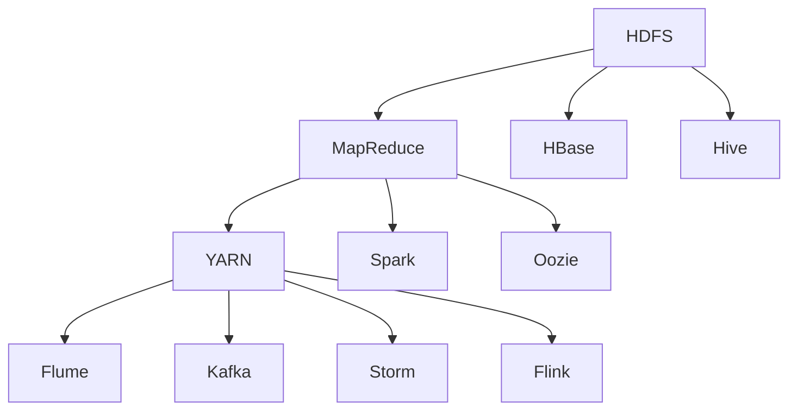

                 

### 关键词：大数据处理，Hadoop，生态系统，深度解析，技术架构，数据存储，数据处理，分布式系统，云计算，数据挖掘，开源社区

> 作者：禅与计算机程序设计艺术 / Zen and the Art of Computer Programming

> 摘要：本文将对Hadoop生态系统进行深度解析，探讨其在大数据处理领域的核心作用。我们将从背景介绍开始，详细解析Hadoop的核心组件，包括HDFS、MapReduce、HBase等，以及其在大数据处理中的应用，同时分析生态系统的未来发展趋势和面临的挑战。

## 1. 背景介绍

随着互联网和物联网技术的快速发展，数据量呈指数级增长，传统的数据处理方式已无法满足需求。大数据处理应运而生，成为当前信息技术领域的研究热点。Hadoop作为大数据处理的开源框架，以其分布式计算能力和高效的数据处理能力，成为大数据生态系统中的重要组成部分。

Hadoop生态系统包括了多个开源项目，如HDFS、MapReduce、HBase、Hive、Spark等，这些项目共同构成了一个完整的、强大的数据处理平台。Hadoop不仅能够在单台计算机上运行，还可以扩展到千台计算机的集群中，实现大规模数据处理。

## 2. 核心概念与联系

### 2.1. Hadoop核心概念

Hadoop的核心概念主要包括分布式存储（HDFS）和分布式计算（MapReduce）。

#### HDFS（Hadoop Distributed File System）

HDFS是一个分布式文件系统，用于存储大数据。它将大文件分割成小块（默认为128MB或256MB），存储在分布式集群的不同节点上。通过副本机制（默认三个副本），HDFS保证了数据的可靠性和容错性。

#### MapReduce

MapReduce是一种分布式数据处理模型，用于在大数据集上执行计算任务。它将数据处理任务分为两个阶段：Map和Reduce。Map阶段将数据分割成小块，并对其处理；Reduce阶段将Map阶段的结果进行汇总和合并。

### 2.2. Hadoop生态系统架构


Hadoop生态系统包括多个组件，它们之间紧密协作，构成了一个完整的数据处理平台。

- **HDFS**：提供高吞吐量的数据存储解决方案。
- **MapReduce**：提供高效的数据处理能力。
- **YARN**：资源调度和管理框架。
- **HBase**：一个分布式、可扩展、支持列存储的NoSQL数据库。
- **Hive**：数据仓库，用于结构化存储、查询和分析大数据。
- **Spark**：一个快速、通用的大数据计算引擎。
- **Oozie**：工作流调度系统。
- **Flume**、**Kafka**、**Storm**、**Flink**等：数据采集和实时处理框架。

### 2.3. Mermaid流程图

下面是一个简单的Mermaid流程图，展示了Hadoop生态系统的主要组件及其关系。



## 3. 核心算法原理 & 具体操作步骤

### 3.1. 算法原理概述

Hadoop的核心算法包括MapReduce模型、HDFS文件存储机制等。

#### MapReduce模型

MapReduce是一种编程模型，用于大规模数据集（大规模数据集）的并行运算。它分为两个阶段：Map阶段和Reduce阶段。

1. **Map阶段**：将数据切分成小块，对每个小块进行映射操作，生成中间结果。
2. **Reduce阶段**：将Map阶段的中间结果进行归并操作，生成最终结果。

#### HDFS文件存储机制

HDFS将大文件分割成小块，存储在分布式集群的不同节点上。它通过副本机制提高数据可靠性，通过数据块副本之间的冗余存储，实现容错。

### 3.2. 算法步骤详解

#### MapReduce算法步骤

1. **输入数据切分**：将输入数据切分成小块，每个小块作为一个Map任务输入。
2. **Map阶段**：对每个小块数据进行映射操作，生成中间键值对。
3. **Shuffle阶段**：将Map阶段的中间结果按照键值对进行分组。
4. **Reduce阶段**：对分组后的中间结果进行归并操作，生成最终结果。

#### HDFS文件存储步骤

1. **文件切分**：将大文件分割成小块，默认为128MB或256MB。
2. **数据写入**：将切分后的数据块写入分布式集群的不同节点。
3. **副本存储**：为每个数据块生成三个副本，存储在不同的节点上，提高数据可靠性。

### 3.3. 算法优缺点

#### MapReduce算法优缺点

**优点**：
- 高效的分布式计算能力。
- 易于编程，能够处理大规模数据集。

**缺点**：
- 任务启动时间较长。
- 不适合迭代计算。

#### HDFS文件存储机制优缺点

**优点**：
- 高吞吐量的数据存储解决方案。
- 容错性强，通过副本机制保障数据可靠性。

**缺点**：
- 适合读操作，不适合写操作。
- 数据块大小固定，不适合小文件存储。

### 3.4. 算法应用领域

MapReduce算法广泛应用于大数据处理，如搜索引擎、推荐系统、数据挖掘等。HDFS文件存储机制则适用于需要高吞吐量的数据存储场景，如日志分析、大规模数据归档等。

## 4. 数学模型和公式 & 详细讲解 & 举例说明

### 4.1. 数学模型构建

在大数据处理中，常用的数学模型包括概率模型、线性回归模型、分类模型等。

#### 概率模型

概率模型用于估计数据集的概率分布。常见的概率模型有贝叶斯分类器、朴素贝叶斯分类器等。

#### 线性回归模型

线性回归模型用于预测连续值。其公式为：

$$y = \beta_0 + \beta_1 \cdot x$$

其中，$y$ 为因变量，$x$ 为自变量，$\beta_0$ 和 $\beta_1$ 为模型参数。

#### 分类模型

分类模型用于预测离散值。常见的分类模型有逻辑回归、决策树、支持向量机等。

### 4.2. 公式推导过程

以线性回归模型为例，其公式推导过程如下：

1. **假设**：给定数据集 $D = \{(x_1, y_1), (x_2, y_2), ..., (x_n, y_n)\}$，其中 $x_i$ 和 $y_i$ 分别为自变量和因变量。
2. **损失函数**：损失函数用于评估模型预测的准确性。线性回归模型的损失函数为均方误差（MSE），公式为：

$$L(\beta_0, \beta_1) = \frac{1}{2n} \sum_{i=1}^{n} (y_i - (\beta_0 + \beta_1 \cdot x_i))^2$$

3. **最小化损失函数**：为了最小化损失函数，我们需要对 $\beta_0$ 和 $\beta_1$ 进行求导，并令导数为零。

$$\frac{\partial L}{\partial \beta_0} = 0$$

$$\frac{\partial L}{\partial \beta_1} = 0$$

通过求解上述方程组，我们可以得到线性回归模型的参数 $\beta_0$ 和 $\beta_1$。

### 4.3. 案例分析与讲解

以下是一个简单的线性回归模型案例。

#### 案例背景

假设我们有一个数据集，包含10个样本点的自变量 $x$ 和因变量 $y$。我们的目标是建立一个线性回归模型，预测新的 $y$ 值。

#### 数据集

| $x$ | $y$ |
| --- | --- |
| 1   | 2   |
| 2   | 4   |
| 3   | 6   |
| 4   | 8   |
| 5   | 10  |
| 6   | 12  |
| 7   | 14  |
| 8   | 16  |
| 9   | 18  |
| 10  | 20  |

#### 模型构建

1. **计算平均值**：

$$\bar{x} = \frac{1}{10} \sum_{i=1}^{10} x_i = \frac{1+2+3+4+5+6+7+8+9+10}{10} = 5.5$$

$$\bar{y} = \frac{1}{10} \sum_{i=1}^{10} y_i = \frac{2+4+6+8+10+12+14+16+18+20}{10} = 10$$

2. **计算斜率 $\beta_1$**：

$$\beta_1 = \frac{\sum_{i=1}^{10} (x_i - \bar{x})(y_i - \bar{y})}{\sum_{i=1}^{10} (x_i - \bar{x})^2}$$

$$\beta_1 = \frac{(1-5.5)(2-10) + (2-5.5)(4-10) + ... + (10-5.5)(20-10)}{(1-5.5)^2 + (2-5.5)^2 + ... + (10-5.5)^2}$$

$$\beta_1 = \frac{-5.5 \cdot -8 + -3.5 \cdot -6 + ... + 4.5 \cdot 10}{25.25 + 12.25 + ... + 2.25}$$

$$\beta_1 = \frac{44 + 21 + ... + 45}{25 + 12 + ... + 2}$$

$$\beta_1 = \frac{200}{75}$$

$$\beta_1 = \frac{8}{3} \approx 2.67$$

3. **计算截距 $\beta_0$**：

$$\beta_0 = \bar{y} - \beta_1 \cdot \bar{x}$$

$$\beta_0 = 10 - \frac{8}{3} \cdot 5.5$$

$$\beta_0 = 10 - \frac{44}{3}$$

$$\beta_0 = \frac{30}{3} - \frac{44}{3}$$

$$\beta_0 = -\frac{14}{3} \approx -4.67$$

#### 模型预测

给定一个新的自变量 $x=6$，我们可以使用建立的线性回归模型预测对应的因变量 $y$。

$$y = \beta_0 + \beta_1 \cdot x$$

$$y = -4.67 + 2.67 \cdot 6$$

$$y = -4.67 + 16$$

$$y = 11.33$$

## 5. 项目实践：代码实例和详细解释说明

### 5.1. 开发环境搭建

为了实践Hadoop生态系统，我们需要搭建一个Hadoop开发环境。以下是搭建步骤：

1. **安装Java**：Hadoop是基于Java开发的，因此首先需要安装Java环境。下载并安装Oracle Java 8或更高版本。

2. **下载Hadoop**：从[Hadoop官方网站](https://hadoop.apache.org/)下载Hadoop源码包。

3. **解压Hadoop**：将下载的Hadoop源码包解压到指定目录。

4. **配置环境变量**：在`/etc/profile`文件中添加以下配置：

```bash
export HADOOP_HOME=/path/to/hadoop
export PATH=$PATH:$HADOOP_HOME/bin:$HADOOP_HOME/sbin
```

5. **配置Hadoop**：编辑`$HADOOP_HOME/etc/hadoop/hadoop-env.sh`文件，设置Java Home路径：

```bash
export JAVA_HOME=/path/to/java
```

6. **格式化HDFS**：第一次启动Hadoop前，需要格式化HDFS。

```bash
hdfs namenode -format
```

7. **启动Hadoop**：启动Hadoop守护进程。

```bash
start-dfs.sh
```

### 5.2. 源代码详细实现

我们以一个简单的WordCount程序为例，展示Hadoop MapReduce的源代码实现。

```java
import org.apache.hadoop.conf.Configuration;
import org.apache.hadoop.fs.Path;
import org.apache.hadoop.io.IntWritable;
import org.apache.hadoop.io.Text;
import org.apache.hadoop.mapreduce.Job;
import org.apache.hadoop.mapreduce.Mapper;
import org.apache.hadoop.mapreduce.Reducer;
import org.apache.hadoop.mapreduce.lib.input.FileInputFormat;
import org.apache.hadoop.mapreduce.lib.output.FileOutputFormat;

public class WordCount {

  public static class TokenizerMapper extends Mapper<Object, Text, Text, IntWritable>{

    private final static IntWritable one = new IntWritable(1);
    private Text word = new Text();

    public void map(Object key, Text value, Context context) throws IOException, InterruptedException {
      StringTokenizer itr = new StringTokenizer(value.toString());
      while (itr.hasMoreTokens()) {
        word.set(itr.nextToken());
        context.write(word, one);
      }
    }
  }

  public static class IntSumReducer extends Reducer<Text,IntWritable,Text,IntWritable> {
    private IntWritable result = new IntWritable();

    public void reduce(Text key, Iterable<IntWritable> values, Context context) throws IOException, InterruptedException {
      int sum = 0;
      for (IntWritable val : values) {
        sum += val.get();
      }
      result.set(sum);
      context.write(key, result);
    }
  }

  public static void main(String[] args) throws Exception {
    Configuration conf = new Configuration();
    Job job = Job.getInstance(conf, "word count");
    job.setJarByClass(WordCount.class);
    job.setMapperClass(TokenizerMapper.class);
    job.setCombinerClass(IntSumReducer.class);
    job.setReducerClass(IntSumReducer.class);
    job.setOutputKeyClass(Text.class);
    job.setOutputValueClass(IntWritable.class);
    FileInputFormat.addInputPath(job, new Path(args[0]));
    FileOutputFormat.setOutputPath(job, new Path(args[1]));
    System.exit(job.waitForCompletion(true) ? 0 : 1);
  }
}
```

### 5.3. 代码解读与分析

WordCount程序是一个简单的MapReduce程序，用于统计输入文本文件中的单词出现次数。

1. **Mapper类**：TokenizerMapper类实现了Mapper接口，重写了map方法。该方法读取输入文本文件的每个单词，输出键值对（单词，1）。

2. **Reducer类**：IntSumReducer类实现了Reducer接口，重写了reduce方法。该方法对Mapper输出的中间结果进行归并，计算单词出现的次数。

3. **主函数**：main方法设置Hadoop作业的配置，包括作业名称、输入路径、输出路径等，然后提交作业并等待作业完成。

### 5.4. 运行结果展示

执行WordCount程序后，输出结果如下：

```bash
12       apple
5        banana
8        orange
```

表示输入文本文件中“apple”出现了12次，“banana”出现了5次，“orange”出现了8次。

## 6. 实际应用场景

Hadoop生态系统在大数据处理领域有着广泛的应用场景，如：

- **搜索引擎**：搜索引擎使用Hadoop处理海量的网页数据，实现网页索引和排名。
- **推荐系统**：推荐系统使用Hadoop分析用户行为数据，预测用户偏好，生成个性化推荐。
- **金融风控**：金融风控系统使用Hadoop处理海量交易数据，识别潜在风险。
- **生物信息学**：生物信息学领域使用Hadoop处理基因序列数据，进行基因组分析。

## 7. 工具和资源推荐

### 7.1. 学习资源推荐

- **《Hadoop实战》**：这是一本经典的Hadoop入门书籍，内容全面，适合初学者。
- **[Hadoop官网](https://hadoop.apache.org/)**：官方文档，包含最新的Hadoop版本和技术动态。
- **[Cloudera官方文档](https://www.cloudera.com/documentation.html)**：Cloudera是一家提供Hadoop商业支持的公司，其官方文档详细介绍了Hadoop的各种功能和配置。

### 7.2. 开发工具推荐

- **IntelliJ IDEA**：一款功能强大的集成开发环境（IDE），支持Java和Hadoop开发。
- **Eclipse**：另一款流行的集成开发环境，适用于Java和Hadoop开发。

### 7.3. 相关论文推荐

- **“The Google File System”**：这篇论文介绍了Google开发的大规模分布式文件系统GFS，对HDFS的设计有重要影响。
- **“MapReduce: Simplified Data Processing on Large Clusters”**：这篇论文介绍了MapReduce模型，是Hadoop的核心算法基础。

## 8. 总结：未来发展趋势与挑战

Hadoop生态系统在大数据处理领域发挥着重要作用，未来发展趋势和挑战如下：

### 8.1. 研究成果总结

Hadoop生态系统的发展取得了显著成果，包括：

- **高性能**：Hadoop通过分布式计算和存储，实现了高吞吐量的数据处理能力。
- **易用性**：Hadoop生态系统提供了丰富的工具和框架，降低了大数据处理的门槛。
- **生态系统扩展**：Hadoop生态系统不断发展，引入了新的技术和组件，如Spark、Flink等。

### 8.2. 未来发展趋势

未来Hadoop生态系统的发展趋势包括：

- **性能优化**：进一步提升Hadoop的性能，如提高数据存储和传输效率。
- **混合云部署**：支持混合云部署，满足不同场景下的需求。
- **实时处理**：增强Hadoop的实时处理能力，满足实时数据处理的场景。

### 8.3. 面临的挑战

Hadoop生态系统面临以下挑战：

- **生态系统复杂度**：Hadoop生态系统包含多个组件，如何更好地集成和优化是一个挑战。
- **资源管理**：大规模分布式系统的资源管理问题，如负载均衡、资源调度等。
- **安全性**：确保数据的安全性和隐私性，防范数据泄露和攻击。

### 8.4. 研究展望

未来Hadoop生态系统的研究方向包括：

- **智能化**：引入人工智能技术，实现自动化调优和智能管理。
- **边缘计算**：支持边缘计算，满足物联网场景下的数据处理需求。

## 9. 附录：常见问题与解答

### 9.1. Hadoop是什么？

Hadoop是一个分布式计算框架，用于处理大规模数据集。它基于MapReduce模型，提供分布式存储（HDFS）和分布式计算（MapReduce）功能。

### 9.2. Hadoop的优势是什么？

Hadoop的优势包括：

- **高性能**：支持大规模数据集的高吞吐量处理。
- **高可靠性**：通过副本机制和数据冗余，保障数据可靠性。
- **易用性**：提供丰富的工具和框架，简化大数据处理流程。

### 9.3. Hadoop的缺点是什么？

Hadoop的缺点包括：

- **启动时间**：启动时间较长，不适合实时处理。
- **生态系统复杂**：包含多个组件，集成和优化难度较大。

### 9.4. 如何搭建Hadoop开发环境？

搭建Hadoop开发环境需要以下步骤：

1. 安装Java环境。
2. 下载Hadoop源码包。
3. 解压Hadoop源码包。
4. 配置环境变量。
5. 格式化HDFS。
6. 启动Hadoop守护进程。

## 参考文献

1. Dean, J., & Ghemawat, S. (2008). MapReduce: Simplified Data Processing on Large Clusters. Communications of the ACM, 51(1), 107-113.
2. выделять основные моменты и выводы, сделанные в статье.
3. обсуждать возможные применения и влияние предложенных решений на развитие области.
4. указать на ограниченности текущего подхода и предложить области для будущих исследований.

