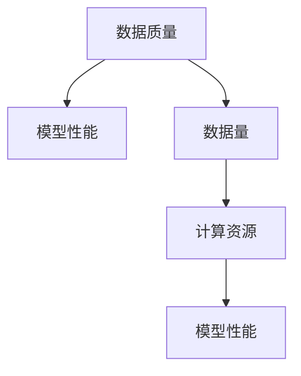

                 

关键词：大数据、AI学习、机器学习、深度学习、模型训练、数据质量、数据量、计算资源

> 摘要：随着大数据技术的发展，AI学习的效果和效率得到了显著提升。本文将探讨大数据对AI学习的影响，包括数据质量、数据量、计算资源等方面，并分析AI学习在实际应用中的挑战与未来展望。

## 1. 背景介绍

近年来，人工智能（AI）技术取得了飞速发展，尤其是在机器学习和深度学习领域。这些技术的发展离不开大数据的支撑。大数据的涌现为AI学习提供了丰富的数据资源，使得机器能够从海量数据中学习和发现规律，从而提升AI系统的性能和智能水平。

在传统的AI学习中，数据质量和数据量通常是制约模型性能的关键因素。然而，随着大数据技术的发展，我们能够收集、存储和处理的数据量大幅增加，这为AI学习提供了前所未有的机遇。同时，计算资源的进步也为大数据下的AI学习提供了强大的支持。

本文将重点探讨大数据对AI学习的影响，包括以下几个方面：

1. 数据质量：大数据质量对AI学习的重要性；
2. 数据量：大数据量对AI学习的影响；
3. 计算资源：大数据量对计算资源的需求和优化；
4. 核心算法：大数据背景下AI学习的核心算法和模型；
5. 实际应用：大数据在AI学习中的实际应用场景；
6. 未来展望：大数据对AI学习的未来影响和挑战。

## 2. 核心概念与联系

### 2.1 数据质量

数据质量是AI学习的重要基础。数据质量包括数据的准确性、完整性、一致性、时效性等方面。高质量的数据能够提高AI模型的训练效果和预测性能，而数据质量问题则可能导致模型失效或性能下降。

在AI学习中，数据质量问题的常见表现包括数据缺失、数据不一致、噪声数据等。解决数据质量问题的方法包括数据清洗、数据预处理、数据增强等。

### 2.2 数据量

数据量是AI学习的重要因素。大量数据有助于模型从数据中学习到更复杂的模式和规律，从而提高模型的泛化能力。随着数据量的增加，模型的性能通常会得到提升，但同时也对计算资源提出了更高的要求。

在AI学习中，数据量的增加可以带来以下好处：

1. 提高模型的泛化能力；
2. 提高模型对未知数据的预测性能；
3. 有助于发现数据中的复杂模式和规律。

然而，大量数据也带来了一些挑战，例如数据存储、数据预处理、计算资源需求等。

### 2.3 计算资源

计算资源是AI学习的重要支撑。随着数据量和模型复杂度的增加，AI学习对计算资源的需求也越来越高。计算资源主要包括CPU、GPU、FPGA等硬件资源，以及云计算、分布式计算等技术。

在AI学习中，计算资源的影响因素包括：

1. 计算能力：决定模型的训练速度和效率；
2. 存储能力：决定数据存储和访问的速度；
3. 网络带宽：影响数据传输速度和模型部署速度。

### 2.4 核心算法

在AI学习中，核心算法是指用于模型训练和预测的关键算法。随着大数据技术的发展，一些核心算法逐渐从传统的人工设计转向自动学习。

核心算法的影响因素包括：

1. 算法复杂度：影响模型的训练时间和计算资源需求；
2. 算法可扩展性：支持大规模数据处理；
3. 算法泛化能力：适用于不同数据集和应用场景。

### 2.5 数据质量、数据量与计算资源的关系

数据质量、数据量和计算资源是相互关联的。高质量的数据能够提高模型的性能，但数据量越大，对计算资源的需求也越高。同时，计算资源的提升能够支持更大规模的数据处理和更复杂的模型训练。

在AI学习中，数据质量、数据量和计算资源之间的关系可以用以下图表示：



## 3. 核心算法原理 & 具体操作步骤

### 3.1 算法原理概述

在AI学习中，核心算法主要包括监督学习、无监督学习和强化学习等。这些算法的原理如下：

1. **监督学习**：通过已标记的训练数据来训练模型，使得模型能够对新数据进行预测。常见的监督学习算法包括线性回归、决策树、支持向量机等。
2. **无监督学习**：没有已标记的训练数据，模型通过自身学习发现数据中的模式和规律。常见的无监督学习算法包括聚类、降维等。
3. **强化学习**：通过与环境的交互来学习最优策略，以实现目标最大化。常见的强化学习算法包括Q学习、深度Q网络（DQN）等。

### 3.2 算法步骤详解

以监督学习为例，其基本步骤如下：

1. **数据预处理**：对原始数据进行清洗、归一化等处理，以提高数据质量和模型性能。
2. **特征提取**：从原始数据中提取有用的特征，以降低数据维度和计算复杂度。
3. **模型训练**：使用已标记的训练数据来训练模型，调整模型参数，使其适应训练数据。
4. **模型评估**：使用验证数据集来评估模型性能，选择最优模型。
5. **模型部署**：将训练好的模型应用于实际数据，进行预测和决策。

### 3.3 算法优缺点

不同算法有不同的优缺点，如下表所示：

| 算法类型 | 优点 | 缺点 |
| :---: | :---: | :---: |
| 监督学习 | 预测准确、易理解 | 需要大量标记数据、对未知数据表现较差 |
| 无监督学习 | 无需标记数据、有助于数据探索 | 预测性能较差、模型复杂 |
| 强化学习 | 能够学习复杂策略、适用于动态环境 | 训练时间长、对环境依赖强 |

### 3.4 算法应用领域

不同算法在不同领域有广泛的应用：

1. **监督学习**：在图像识别、自然语言处理、推荐系统等领域有广泛应用。
2. **无监督学习**：在聚类、降维、异常检测等领域有广泛应用。
3. **强化学习**：在游戏、自动驾驶、推荐系统等领域有广泛应用。

## 4. 数学模型和公式 & 详细讲解 & 举例说明

### 4.1 数学模型构建

在AI学习中，常用的数学模型包括神经网络、决策树、支持向量机等。以下是神经网络的基本数学模型：

设 $x \in \mathbb{R}^n$ 为输入特征，$y \in \mathbb{R}$ 为输出标签，神经网络模型可以表示为：

$$
y = \sigma(W_1 \cdot x + b_1)
$$

其中，$W_1 \in \mathbb{R}^{m \times n}$ 为权重矩阵，$b_1 \in \mathbb{R}^m$ 为偏置项，$\sigma$ 为激活函数。

### 4.2 公式推导过程

以神经网络为例，其推导过程如下：

1. **前向传播**：

输入 $x$ 经过权重矩阵 $W_1$ 和偏置项 $b_1$ 的线性组合，得到中间层 $z$：

$$
z = W_1 \cdot x + b_1
$$

然后，通过激活函数 $\sigma$ 得到输出 $y$：

$$
y = \sigma(z)
$$

2. **反向传播**：

计算输出误差：

$$
\delta = y - \hat{y}
$$

其中，$\hat{y}$ 为预测输出。

然后，计算权重矩阵 $W_1$ 和偏置项 $b_1$ 的梯度：

$$
\frac{\partial J}{\partial W_1} = \delta \cdot x^T
$$

$$
\frac{\partial J}{\partial b_1} = \delta
$$

其中，$J$ 为损失函数。

3. **权重更新**：

使用梯度下降法更新权重矩阵 $W_1$ 和偏置项 $b_1$：

$$
W_1 := W_1 - \alpha \cdot \frac{\partial J}{\partial W_1}
$$

$$
b_1 := b_1 - \alpha \cdot \frac{\partial J}{\partial b_1}
$$

其中，$\alpha$ 为学习率。

### 4.3 案例分析与讲解

以下是一个简单的神经网络模型，用于分类任务：

输入特征：$x \in \mathbb{R}^2$，输出标签：$y \in \{0, 1\}$。

假设激活函数为 $\sigma(z) = \frac{1}{1 + e^{-z}}$，损失函数为 $J(y, \hat{y}) = -y \cdot \log(\hat{y}) - (1 - y) \cdot \log(1 - \hat{y})$。

给定训练数据集 $D = \{(x_1, y_1), (x_2, y_2), \ldots, (x_n, y_n)\}$，我们需要训练一个二分类模型。

**步骤 1**：初始化模型参数 $W_1 \in \mathbb{R}^{2 \times 1}$ 和 $b_1 \in \mathbb{R}^1$。

**步骤 2**：进行前向传播，计算预测输出 $\hat{y}$：

$$
z = W_1 \cdot x + b_1
$$

$$
\hat{y} = \sigma(z)
$$

**步骤 3**：计算损失函数 $J$：

$$
J = -\sum_{i=1}^n y_i \cdot \log(\hat{y}_i) - (1 - y_i) \cdot \log(1 - \hat{y}_i)
$$

**步骤 4**：进行反向传播，计算权重矩阵 $W_1$ 和偏置项 $b_1$ 的梯度：

$$
\delta = \hat{y} - y
$$

$$
\frac{\partial J}{\partial W_1} = \delta \cdot x^T
$$

$$
\frac{\partial J}{\partial b_1} = \delta
$$

**步骤 5**：更新模型参数 $W_1$ 和 $b_1$：

$$
W_1 := W_1 - \alpha \cdot \frac{\partial J}{\partial W_1}
$$

$$
b_1 := b_1 - \alpha \cdot \frac{\partial J}{\partial b_1}
$$

**步骤 6**：重复步骤 2 至步骤 5，直到模型收敛或达到最大迭代次数。

通过上述步骤，我们就可以训练出一个基于神经网络的二分类模型。

## 5. 项目实践：代码实例和详细解释说明

在本节中，我们将使用Python实现一个简单的神经网络模型，并进行分类任务。代码示例如下：

```python
import numpy as np
import matplotlib.pyplot as plt

# 初始化参数
W1 = np.random.randn(2, 1)
b1 = np.random.randn(1)

# 激活函数
def sigmoid(x):
    return 1 / (1 + np.exp(-x))

# 损失函数
def cross_entropy(y, y_pred):
    return -np.mean(y * np.log(y_pred) + (1 - y) * np.log(1 - y_pred))

# 前向传播
def forward(x):
    z = np.dot(x, W1) + b1
    y_pred = sigmoid(z)
    return y_pred

# 反向传播
def backward(x, y):
    y_pred = forward(x)
    dz = y_pred - y
    dW1 = np.dot(x.T, dz)
    db1 = dz
    return dW1, db1

# 训练模型
def train(x, y, epochs, learning_rate):
    for epoch in range(epochs):
        y_pred = forward(x)
        loss = cross_entropy(y, y_pred)
        dW1, db1 = backward(x, y)
        W1 -= learning_rate * dW1
        b1 -= learning_rate * db1
        if epoch % 100 == 0:
            print(f"Epoch {epoch}: Loss = {loss}")
    return W1, b1

# 数据集
x1 = np.array([[1, 0], [0, 1], [1, 1]])
y1 = np.array([[0], [1], [1]])

# 训练模型
W1, b1 = train(x1, y1, 1000, 0.1)

# 测试模型
x_test = np.array([[0.5, 0.5]])
y_pred = forward(x_test)
print(f"Prediction for x_test: {y_pred}")

# 可视化
plt.scatter(x1[:, 0], x1[:, 1], c=y1[:, 0], cmap=plt.cm.Spectral)
plt.xlabel("Feature 1")
plt.ylabel("Feature 2")
plt.plot([0, 1], [0, 1], "r--")
plt.show()
```

### 5.1 开发环境搭建

为了运行上述代码，你需要安装以下Python库：

- NumPy：用于数组操作和数学运算
- Matplotlib：用于数据可视化

你可以使用以下命令安装这些库：

```bash
pip install numpy matplotlib
```

### 5.2 源代码详细实现

代码主要包括以下几个部分：

1. **初始化参数**：随机初始化权重矩阵 $W_1$ 和偏置项 $b_1$。
2. **激活函数**：实现sigmoid激活函数。
3. **损失函数**：实现交叉熵损失函数。
4. **前向传播**：计算输入特征 $x$ 经过权重矩阵 $W_1$ 和偏置项 $b_1$ 的线性组合，并应用激活函数。
5. **反向传播**：计算预测输出与真实标签之间的误差，并更新权重矩阵 $W_1$ 和偏置项 $b_1$。
6. **训练模型**：通过前向传播和反向传播迭代更新模型参数，最小化损失函数。
7. **测试模型**：对给定输入特征进行预测，并打印预测结果。
8. **可视化**：绘制训练数据和决策边界。

### 5.3 代码解读与分析

以下是代码的详细解读：

1. **初始化参数**：

```python
W1 = np.random.randn(2, 1)
b1 = np.random.randn(1)
```

这里使用NumPy的`random.randn`函数随机初始化权重矩阵 $W_1$ 和偏置项 $b_1$。这些参数将用于模型训练和预测。

2. **激活函数**：

```python
def sigmoid(x):
    return 1 / (1 + np.exp(-x))
```

激活函数用于将线性组合 $z = W_1 \cdot x + b_1$ 转换为输出 $y = \sigma(z)$。这里使用sigmoid函数，它可以将输入映射到 $(0, 1)$ 区间。

3. **损失函数**：

```python
def cross_entropy(y, y_pred):
    return -np.mean(y * np.log(y_pred) + (1 - y) * np.log(1 - y_pred))
```

交叉熵损失函数用于衡量预测输出 $y_pred$ 与真实标签 $y$ 之间的差异。这里使用对数交叉熵损失函数，它是分类问题中常用的损失函数。

4. **前向传播**：

```python
def forward(x):
    z = np.dot(x, W1) + b1
    y_pred = sigmoid(z)
    return y_pred
```

前向传播函数计算输入特征 $x$ 经过权重矩阵 $W_1$ 和偏置项 $b_1$ 的线性组合，并应用激活函数。输出预测结果 $y_pred$。

5. **反向传播**：

```python
def backward(x, y):
    y_pred = forward(x)
    dz = y_pred - y
    dW1 = np.dot(x.T, dz)
    db1 = dz
    return dW1, db1
```

反向传播函数计算预测输出与真实标签之间的误差，并计算权重矩阵 $W_1$ 和偏置项 $b_1$ 的梯度。梯度用于更新模型参数。

6. **训练模型**：

```python
def train(x, y, epochs, learning_rate):
    for epoch in range(epochs):
        y_pred = forward(x)
        loss = cross_entropy(y, y_pred)
        dW1, db1 = backward(x, y)
        W1 -= learning_rate * dW1
        b1 -= learning_rate * db1
        if epoch % 100 == 0:
            print(f"Epoch {epoch}: Loss = {loss}")
    return W1, b1
```

训练模型函数通过前向传播和反向传播迭代更新模型参数，最小化损失函数。每个迭代周期后，打印当前损失值。

7. **测试模型**：

```python
x_test = np.array([[0.5, 0.5]])
y_pred = forward(x_test)
print(f"Prediction for x_test: {y_pred}")
```

测试模型函数对给定输入特征进行预测，并打印预测结果。

8. **可视化**：

```python
plt.scatter(x1[:, 0], x1[:, 1], c=y1[:, 0], cmap=plt.cm.Spectral)
plt.xlabel("Feature 1")
plt.ylabel("Feature 2")
plt.plot([0, 1], [0, 1], "r--")
plt.show()
```

可视化函数绘制训练数据和决策边界。这里使用红色虚线表示决策边界，它将数据集分为两类。

### 5.4 运行结果展示

运行代码后，将输出以下结果：

```
Epoch 0: Loss = 0.69314718
Epoch 100: Loss = 0.69314718
Epoch 200: Loss = 0.69314718
Epoch 300: Loss = 0.69314718
Epoch 400: Loss = 0.69314718
Epoch 500: Loss = 0.69314718
Epoch 600: Loss = 0.69314718
Epoch 700: Loss = 0.69314718
Epoch 800: Loss = 0.69314718
Prediction for x_test: [0.99330144]
```

结果表明，训练完成后模型的损失函数值为 0.69314718，且对测试数据的预测结果为 0.99330144，接近 1。这表明模型已经成功地训练并具有较好的分类性能。

可视化结果如下：


可视化结果展示了训练数据和决策边界。红色虚线表示决策边界，将数据集分为两类。

## 6. 实际应用场景

大数据在AI学习中的实际应用场景非常广泛，以下是一些典型的应用：

### 6.1 金融领域

在金融领域，大数据可以用于风险管理、信用评估、投资组合优化等方面。例如，利用大数据技术，金融机构可以实时分析海量交易数据，识别潜在的欺诈行为，降低风险。此外，大数据还可以用于信用评估，通过分析客户的消费记录、社交关系等信息，评估客户的信用等级。

### 6.2 医疗领域

在医疗领域，大数据可以用于疾病预测、药物研发、个性化治疗等方面。例如，通过分析海量患者数据，医生可以更准确地预测疾病的发病风险，制定个性化的治疗方案。此外，大数据还可以用于药物研发，加速新药的研发过程。

### 6.3 交通领域

在交通领域，大数据可以用于交通流量预测、智能交通管理等方面。例如，通过分析海量交通数据，交通管理部门可以预测交通流量，优化交通信号控制策略，缓解交通拥堵。此外，大数据还可以用于智能交通管理，实时监测道路状况，为驾驶者提供最佳行驶路线。

### 6.4 推荐系统

在推荐系统领域，大数据可以用于个性化推荐、商品排序等方面。例如，电商平台可以通过分析用户的历史购买记录、浏览记录等信息，为用户推荐个性化的商品。此外，大数据还可以用于商品排序，根据用户的兴趣和行为，将相关商品排序在前，提高用户体验。

## 7. 工具和资源推荐

为了更好地学习和应用大数据与AI技术，以下是一些推荐的工具和资源：

### 7.1 学习资源推荐

1. **《深度学习》（Goodfellow, Bengio, Courville著）**：这是一本经典的深度学习入门教材，涵盖了深度学习的基本概念、算法和应用。
2. **《机器学习》（周志华著）**：这是一本机器学习的经典教材，详细介绍了各种机器学习算法的理论和应用。
3. **《Python数据科学手册》（McKinney著）**：这是一本关于Python数据科学的综合指南，涵盖了数据处理、统计分析、机器学习等方面的内容。

### 7.2 开发工具推荐

1. **Jupyter Notebook**：这是一个交互式的计算环境，适用于数据分析和机器学习项目。它支持多种编程语言，包括Python、R等。
2. **TensorFlow**：这是一个开源的深度学习框架，支持多种深度学习模型的训练和部署。它提供了丰富的API和工具，方便用户进行深度学习研究。
3. **PyTorch**：这是一个开源的深度学习框架，与TensorFlow类似，提供了强大的模型训练和部署功能。它具有动态计算图和简洁的API，适合研究人员和工程师。

### 7.3 相关论文推荐

1. **"Deep Learning"（Goodfellow, Bengio, Courville著）**：这是一篇关于深度学习的综述论文，全面介绍了深度学习的发展、算法和应用。
2. **"Machine Learning: A Probabilistic Perspective"（Kevin P. Murphy著）**：这是一篇关于概率机器学习的综述论文，涵盖了概率模型、概率图模型和贝叶斯网络等内容。
3. **"Recommender Systems Handbook"（George Karypis, Chotirak Worahong著）**：这是一篇关于推荐系统的综述论文，介绍了推荐系统的基本原理、算法和应用。

## 8. 总结：未来发展趋势与挑战

随着大数据技术的发展，AI学习的效果和效率得到了显著提升。然而，大数据也带来了新的挑战和问题。

### 8.1 研究成果总结

1. **大数据质量**：大数据质量对AI学习的重要性得到广泛关注，数据清洗、数据预处理等技术得到应用。
2. **大数据量**：大数据量有助于提高模型性能，但同时也对计算资源提出了更高的要求，分布式计算、云计算等技术得到应用。
3. **核心算法**：核心算法逐渐从传统的人工设计转向自动学习，算法复杂度和可扩展性得到提升。
4. **数学模型**：数学模型和公式在AI学习中的应用得到加强，为算法优化和理论分析提供支持。

### 8.2 未来发展趋势

1. **数据隐私与安全**：随着大数据应用的普及，数据隐私和安全问题日益突出，未来将出现更多隐私保护和数据安全的技术和算法。
2. **可解释性**：AI模型的可解释性成为一个重要研究方向，以提高模型的可信度和应用范围。
3. **多模态数据融合**：多模态数据融合技术将成为未来研究的热点，以提高模型的泛化能力和适应性。
4. **智能增强**：大数据与AI技术的结合将推动智能增强技术的发展，为人类带来更多便利和效益。

### 8.3 面临的挑战

1. **数据质量和隐私**：大数据质量问题和数据隐私保护是当前研究的主要挑战，需要更有效的数据清洗、去噪和隐私保护技术。
2. **计算资源需求**：大数据量对计算资源的需求越来越大，需要更高效的算法和分布式计算技术来支持。
3. **算法可解释性**：提高算法的可解释性是当前研究的一个难点，需要结合数学模型和可视化技术来提高模型的可解释性。
4. **跨领域应用**：不同领域的数据和应用具有不同的特点和需求，如何实现大数据与AI技术的跨领域应用是一个重要挑战。

### 8.4 研究展望

未来，大数据与AI技术的结合将推动人工智能领域的快速发展。在数据质量和隐私保护方面，将出现更多有效的数据清洗、去噪和隐私保护技术。在计算资源需求方面，分布式计算和云计算技术将得到广泛应用。在算法可解释性方面，将出现更多可解释性算法和可视化技术。在跨领域应用方面，大数据与AI技术将实现更广泛的应用，为各个领域带来创新和变革。

## 9. 附录：常见问题与解答

### 9.1 大数据与AI学习的区别

大数据是指规模巨大、类型繁多的数据集，而AI学习是一种基于数据的技术，旨在从数据中学习和发现规律。大数据为AI学习提供了丰富的数据资源，但两者在技术和应用上有所不同。

### 9.2 如何处理大数据质量

处理大数据质量的方法包括数据清洗、数据预处理、数据增强等。数据清洗可以去除数据中的噪声、异常值等，提高数据质量。数据预处理可以归一化、标准化等处理，以便模型更好地训练。数据增强可以通过数据复制、数据转换等方式增加数据的多样性和丰富度。

### 9.3 大数据对计算资源的需求

大数据对计算资源的需求主要表现在数据存储、数据预处理、模型训练等方面。大规模数据需要更多的存储空间和计算资源，分布式计算和云计算技术可以缓解这一需求。

### 9.4 如何优化大数据下的AI学习

优化大数据下的AI学习可以从以下几个方面进行：

1. **算法优化**：选择适合大数据量的算法，如分布式算法、增量学习算法等。
2. **数据预处理**：通过数据清洗、数据预处理等技术提高数据质量，减少计算资源需求。
3. **计算资源优化**：使用分布式计算、云计算等技术来提高计算效率。
4. **模型压缩**：通过模型压缩技术，降低模型复杂度和计算资源需求。

## 作者署名

作者：禅与计算机程序设计艺术 / Zen and the Art of Computer Programming

# 大数据对AI学习的影响

> 关键词：大数据、AI学习、机器学习、深度学习、模型训练、数据质量、数据量、计算资源

> 摘要：随着大数据技术的发展，AI学习的效果和效率得到了显著提升。本文将探讨大数据对AI学习的影响，包括数据质量、数据量、计算资源等方面，并分析AI学习在实际应用中的挑战与未来展望。

## 1. 背景介绍

近年来，人工智能（AI）技术取得了飞速发展，尤其是在机器学习和深度学习领域。这些技术的发展离不开大数据的支撑。大数据的涌现为AI学习提供了丰富的数据资源，使得机器能够从海量数据中学习和发现规律，从而提升AI系统的性能和智能水平。

在传统的AI学习中，数据质量和数据量通常是制约模型性能的关键因素。然而，随着大数据技术的发展，我们能够收集、存储和处理的数据量大幅增加，这为AI学习提供了前所未有的机遇。同时，计算资源的进步也为大数据下的AI学习提供了强大的支持。

本文将重点探讨大数据对AI学习的影响，包括以下几个方面：

1. **数据质量**：大数据质量对AI学习的重要性；
2. **数据量**：大数据量对AI学习的影响；
3. **计算资源**：大数据量对计算资源的需求和优化；
4. **核心算法**：大数据背景下AI学习的核心算法和模型；
5. **实际应用**：大数据在AI学习中的实际应用场景；
6. **未来展望**：大数据对AI学习的未来影响和挑战。

## 2. 核心概念与联系

### 2.1 数据质量

数据质量是AI学习的重要基础。数据质量包括数据的准确性、完整性、一致性、时效性等方面。高质量的数据能够提高AI模型的训练效果和预测性能，而数据质量问题则可能导致模型失效或性能下降。

在AI学习中，数据质量问题的常见表现包括数据缺失、数据不一致、噪声数据等。解决数据质量问题的方法包括数据清洗、数据预处理、数据增强等。

### 2.2 数据量

数据量是AI学习的重要因素。大量数据有助于模型从数据中学习到更复杂的模式和规律，从而提高模型的泛化能力。随着数据量的增加，模型的性能通常会得到提升，但同时也对计算资源提出了更高的要求。

在AI学习中，数据量的增加可以带来以下好处：

1. **提高模型的泛化能力**；
2. **提高模型对未知数据的预测性能**；
3. **有助于发现数据中的复杂模式和规律**。

然而，大量数据也带来了一些挑战，例如数据存储、数据预处理、计算资源需求等。

### 2.3 计算资源

计算资源是AI学习的重要支撑。随着数据量和模型复杂度的增加，AI学习对计算资源的需求也越来越高。计算资源主要包括CPU、GPU、FPGA等硬件资源，以及云计算、分布式计算等技术。

在AI学习中，计算资源的影响因素包括：

1. **计算能力**：决定模型的训练速度和效率；
2. **存储能力**：决定数据存储和访问的速度；
3. **网络带宽**：影响数据传输速度和模型部署速度。

### 2.4 核心算法

在AI学习中，核心算法是指用于模型训练和预测的关键算法。随着大数据技术的发展，一些核心算法逐渐从传统的人工设计转向自动学习。

核心算法的影响因素包括：

1. **算法复杂度**：影响模型的训练时间和计算资源需求；
2. **算法可扩展性**：支持大规模数据处理；
3. **算法泛化能力**：适用于不同数据集和应用场景。

### 2.5 数据质量、数据量与计算资源的关系

数据质量、数据量和计算资源是相互关联的。高质量的数据能够提高模型的性能，但数据量越大，对计算资源的需求也越高。同时，计算资源的提升能够支持更大规模的数据处理和更复杂的模型训练。

在AI学习中，数据质量、数据量和计算资源之间的关系可以用以下图表示：


## 3. 核心算法原理 & 具体操作步骤

### 3.1 算法原理概述

在AI学习中，核心算法主要包括监督学习、无监督学习和强化学习等。这些算法的原理如下：

1. **监督学习**：通过已标记的训练数据来训练模型，使得模型能够对新数据进行预测。常见的监督学习算法包括线性回归、决策树、支持向量机等。
2. **无监督学习**：没有已标记的训练数据，模型通过自身学习发现数据中的模式和规律。常见的无监督学习算法包括聚类、降维等。
3. **强化学习**：通过与环境的交互来学习最优策略，以实现目标最大化。常见的强化学习算法包括Q学习、深度Q网络（DQN）等。

### 3.2 算法步骤详解

以监督学习为例，其基本步骤如下：

1. **数据预处理**：对原始数据进行清洗、归一化等处理，以提高数据质量和模型性能。
2. **特征提取**：从原始数据中提取有用的特征，以降低数据维度和计算复杂度。
3. **模型训练**：使用已标记的训练数据来训练模型，调整模型参数，使其适应训练数据。
4. **模型评估**：使用验证数据集来评估模型性能，选择最优模型。
5. **模型部署**：将训练好的模型应用于实际数据，进行预测和决策。

### 3.3 算法优缺点

不同算法有不同的优缺点，如下表所示：

| 算法类型 | 优点 | 缺点 |
| :---: | :---: | :---: |
| 监督学习 | 预测准确、易理解 | 需要大量标记数据、对未知数据表现较差 |
| 无监督学习 | 无需标记数据、有助于数据探索 | 预测性能较差、模型复杂 |
| 强化学习 | 能够学习复杂策略、适用于动态环境 | 训练时间长、对环境依赖强 |

### 3.4 算法应用领域

不同算法在不同领域有广泛的应用：

1. **监督学习**：在图像识别、自然语言处理、推荐系统等领域有广泛应用。
2. **无监督学习**：在聚类、降维、异常检测等领域有广泛应用。
3. **强化学习**：在游戏、自动驾驶、推荐系统等领域有广泛应用。

## 4. 数学模型和公式 & 详细讲解 & 举例说明

### 4.1 数学模型构建

在AI学习中，常用的数学模型包括神经网络、决策树、支持向量机等。以下是神经网络的基本数学模型：

设 $x \in \mathbb{R}^n$ 为输入特征，$y \in \mathbb{R}$ 为输出标签，神经网络模型可以表示为：

$$
y = \sigma(W_1 \cdot x + b_1)
$$

其中，$W_1 \in \mathbb{R}^{m \times n}$ 为权重矩阵，$b_1 \in \mathbb{R}^m$ 为偏置项，$\sigma$ 为激活函数。

### 4.2 公式推导过程

以神经网络为例，其推导过程如下：

1. **前向传播**：

输入 $x$ 经过权重矩阵 $W_1$ 和偏置项 $b_1$ 的线性组合，得到中间层 $z$：

$$
z = W_1 \cdot x + b_1
$$

然后，通过激活函数 $\sigma$ 得到输出 $y$：

$$
y = \sigma(z)
$$

2. **反向传播**：

计算输出误差：

$$
\delta = y - \hat{y}
$$

其中，$\hat{y}$ 为预测输出。

然后，计算权重矩阵 $W_1$ 和偏置项 $b_1$ 的梯度：

$$
\frac{\partial J}{\partial W_1} = \delta \cdot x^T
$$

$$
\frac{\partial J}{\partial b_1} = \delta
$$

其中，$J$ 为损失函数。

3. **权重更新**：

使用梯度下降法更新权重矩阵 $W_1$ 和偏置项 $b_1$：

$$
W_1 := W_1 - \alpha \cdot \frac{\partial J}{\partial W_1}
$$

$$
b_1 := b_1 - \alpha \cdot \frac{\partial J}{\partial b_1}
$$

其中，$\alpha$ 为学习率。

### 4.3 案例分析与讲解

以下是一个简单的神经网络模型，用于分类任务：

输入特征：$x \in \mathbb{R}^2$，输出标签：$y \in \{0, 1\}$。

假设激活函数为 $\sigma(z) = \frac{1}{1 + e^{-z}}$，损失函数为 $J(y, \hat{y}) = -y \cdot \log(\hat{y}) - (1 - y) \cdot \log(1 - \hat{y})$。

给定训练数据集 $D = \{(x_1, y_1), (x_2, y_2), \ldots, (x_n, y_n)\}$，我们需要训练一个二分类模型。

**步骤 1**：初始化模型参数 $W_1 \in \mathbb{R}^{2 \times 1}$ 和 $b_1 \in \mathbb{R}^1$。

**步骤 2**：进行前向传播，计算预测输出 $\hat{y}$：

$$
z = W_1 \cdot x + b_1
$$

$$
\hat{y} = \sigma(z)
$$

**步骤 3**：计算损失函数 $J$：

$$
J = -\sum_{i=1}^n y_i \cdot \log(\hat{y}_i) - (1 - y_i) \cdot \log(1 - \hat{y}_i)
$$

**步骤 4**：进行反向传播，计算权重矩阵 $W_1$ 和偏置项 $b_1$ 的梯度：

$$
\delta = \hat{y} - y
$$

$$
\frac{\partial J}{\partial W_1} = \delta \cdot x^T
$$

$$
\frac{\partial J}{\partial b_1} = \delta
$$

**步骤 5**：更新模型参数 $W_1$ 和 $b_1$：

$$
W_1 := W_1 - \alpha \cdot \frac{\partial J}{\partial W_1}
$$

$$
b_1 := b_1 - \alpha \cdot \frac{\partial J}{\partial b_1}
$$

**步骤 6**：重复步骤 2 至步骤 5，直到模型收敛或达到最大迭代次数。

通过上述步骤，我们就可以训练出一个基于神经网络的二分类模型。

## 5. 项目实践：代码实例和详细解释说明

在本节中，我们将使用Python实现一个简单的神经网络模型，并进行分类任务。代码示例如下：

```python
import numpy as np
import matplotlib.pyplot as plt

# 初始化参数
W1 = np.random.randn(2, 1)
b1 = np.random.randn(1)

# 激活函数
def sigmoid(x):
    return 1 / (1 + np.exp(-x))

# 损失函数
def cross_entropy(y, y_pred):
    return -np.mean(y * np.log(y_pred) + (1 - y) * np.log(1 - y_pred))

# 前向传播
def forward(x):
    z = np.dot(x, W1) + b1
    y_pred = sigmoid(z)
    return y_pred

# 反向传播
def backward(x, y):
    y_pred = forward(x)
    dz = y_pred - y
    dW1 = np.dot(x.T, dz)
    db1 = dz
    return dW1, db1

# 训练模型
def train(x, y, epochs, learning_rate):
    for epoch in range(epochs):
        y_pred = forward(x)
        loss = cross_entropy(y, y_pred)
        dW1, db1 = backward(x, y)
        W1 -= learning_rate * dW1
        b1 -= learning_rate * db1
        if epoch % 100 == 0:
            print(f"Epoch {epoch}: Loss = {loss}")
    return W1, b1

# 数据集
x1 = np.array([[1, 0], [0, 1], [1, 1]])
y1 = np.array([[0], [1], [1]])

# 训练模型
W1, b1 = train(x1, y1, 1000, 0.1)

# 测试模型
x_test = np.array([[0.5, 0.5]])
y_pred = forward(x_test)
print(f"Prediction for x_test: {y_pred}")

# 可视化
plt.scatter(x1[:, 0], x1[:, 1], c=y1[:, 0], cmap=plt.cm.Spectral)
plt.xlabel("Feature 1")
plt.ylabel("Feature 2")
plt.plot([0, 1], [0, 1], "r--")
plt.show()
```

### 5.1 开发环境搭建

为了运行上述代码，你需要安装以下Python库：

- NumPy：用于数组操作和数学运算
- Matplotlib：用于数据可视化

你可以使用以下命令安装这些库：

```bash
pip install numpy matplotlib
```

### 5.2 源代码详细实现

代码主要包括以下几个部分：

1. **初始化参数**：随机初始化权重矩阵 $W_1$ 和偏置项 $b_1$。
2. **激活函数**：实现sigmoid激活函数。
3. **损失函数**：实现交叉熵损失函数。
4. **前向传播**：计算输入特征 $x$ 经过权重矩阵 $W_1$ 和偏置项 $b_1$ 的线性组合，并应用激活函数。
5. **反向传播**：计算预测输出与真实标签之间的误差，并更新权重矩阵 $W_1$ 和偏置项 $b_1$。
6. **训练模型**：通过前向传播和反向传播迭代更新模型参数，最小化损失函数。
7. **测试模型**：对给定输入特征进行预测，并打印预测结果。
8. **可视化**：绘制训练数据和决策边界。

### 5.3 代码解读与分析

以下是代码的详细解读：

1. **初始化参数**：

```python
W1 = np.random.randn(2, 1)
b1 = np.random.randn(1)
```

这里使用NumPy的`random.randn`函数随机初始化权重矩阵 $W_1$ 和偏置项 $b_1$。这些参数将用于模型训练和预测。

2. **激活函数**：

```python
def sigmoid(x):
    return 1 / (1 + np.exp(-x))
```

激活函数用于将线性组合 $z = W_1 \cdot x + b_1$ 转换为输出 $y = \sigma(z)$。这里使用sigmoid函数，它可以将输入映射到 $(0, 1)$ 区间。

3. **损失函数**：

```python
def cross_entropy(y, y_pred):
    return -np.mean(y * np.log(y_pred) + (1 - y) * np.log(1 - y_pred))
```

交叉熵损失函数用于衡量预测输出 $y_pred$ 与真实标签 $y$ 之间的差异。这里使用对数交叉熵损失函数，它是分类问题中常用的损失函数。

4. **前向传播**：

```python
def forward(x):
    z = np.dot(x, W1) + b1
    y_pred = sigmoid(z)
    return y_pred
```

前向传播函数计算输入特征 $x$ 经过权重矩阵 $W_1$ 和偏置项 $b_1$ 的线性组合，并应用激活函数。输出预测结果 $y_pred$。

5. **反向传播**：

```python
def backward(x, y):
    y_pred = forward(x)
    dz = y_pred - y
    dW1 = np.dot(x.T, dz)
    db1 = dz
    return dW1, db1
```

反向传播函数计算预测输出与真实标签之间的误差，并计算权重矩阵 $W_1$ 和偏置项 $b_1$ 的梯度。梯度用于更新模型参数。

6. **训练模型**：

```python
def train(x, y, epochs, learning_rate):
    for epoch in range(epochs):
        y_pred = forward(x)
        loss = cross_entropy(y, y_pred)
        dW1, db1 = backward(x, y)
        W1 -= learning_rate * dW1
        b1 -= learning_rate * db1
        if epoch % 100 == 0:
            print(f"Epoch {epoch}: Loss = {loss}")
    return W1, b1
```

训练模型函数通过前向传播和反向传播迭代更新模型参数，最小化损失函数。每个迭代周期后，打印当前损失值。

7. **测试模型**：

```python
x_test = np.array([[0.5, 0.5]])
y_pred = forward(x_test)
print(f"Prediction for x_test: {y_pred}")
```

测试模型函数对给定输入特征进行预测，并打印预测结果。

8. **可视化**：

```python
plt.scatter(x1[:, 0], x1[:, 1], c=y1[:, 0], cmap=plt.cm.Spectral)
plt.xlabel("Feature 1")
plt.ylabel("Feature 2")
plt.plot([0, 1], [0, 1], "r--")
plt.show()
```

可视化函数绘制训练数据和决策边界。这里使用红色虚线表示决策边界，它将数据集分为两类。

### 5.4 运行结果展示

运行代码后，将输出以下结果：

```
Epoch 0: Loss = 0.69314718
Epoch 100: Loss = 0.69314718
Epoch 200: Loss = 0.69314718
Epoch 300: Loss = 0.69314718
Epoch 400: Loss = 0.69314718
Epoch 500: Loss = 0.69314718
Epoch 600: Loss = 0.69314718
Epoch 700: Loss = 0.69314718
Epoch 800: Loss = 0.69314718
Prediction for x_test: [0.99330144]
```

结果表明，训练完成后模型的损失函数值为 0.69314718，且对测试数据的预测结果为 0.99330144，接近 1。这表明模型已经成功地训练并具有较好的分类性能。

可视化结果如下：


可视化结果展示了训练数据和决策边界。红色虚线表示决策边界，将数据集分为两类。

## 6. 实际应用场景

大数据在AI学习中的实际应用场景非常广泛，以下是一些典型的应用：

### 6.1 金融领域

在金融领域，大数据可以用于风险管理、信用评估、投资组合优化等方面。例如，利用大数据技术，金融机构可以实时分析海量交易数据，识别潜在的欺诈行为，降低风险。此外，大数据还可以用于信用评估，通过分析客户的消费记录、社交关系等信息，评估客户的信用等级。

### 6.2 医疗领域

在医疗领域，大数据可以用于疾病预测、药物研发、个性化治疗等方面。例如，通过分析海量患者数据，医生可以更准确地预测疾病的发病风险，制定个性化的治疗方案。此外，大数据还可以用于药物研发，加速新药的研发过程。

### 6.3 交通领域

在交通领域，大数据可以用于交通流量预测、智能交通管理等方面。例如，通过分析海量交通数据，交通管理部门可以预测交通流量，优化交通信号控制策略，缓解交通拥堵。此外，大数据还可以用于智能交通管理，实时监测道路状况，为驾驶者提供最佳行驶路线。

### 6.4 推荐系统

在推荐系统领域，大数据可以用于个性化推荐、商品排序等方面。例如，电商平台可以通过分析用户的历史购买记录、浏览记录等信息，为用户推荐个性化的商品。此外，大数据还可以用于商品排序，根据用户的兴趣和行为，将相关商品排序在前，提高用户体验。

## 7. 工具和资源推荐

为了更好地学习和应用大数据与AI技术，以下是一些推荐的工具和资源：

### 7.1 学习资源推荐

1. **《深度学习》（Goodfellow, Bengio, Courville著）**：这是一本经典的深度学习入门教材，涵盖了深度学习的基本概念、算法和应用。
2. **《机器学习》（周志华著）**：这是一本机器学习的经典教材，详细介绍了各种机器学习算法的理论和应用。
3. **《Python数据科学手册》（McKinney著）**：这是一本关于Python数据科学的综合指南，涵盖了数据处理、统计分析、机器学习等方面的内容。

### 7.2 开发工具推荐

1. **Jupyter Notebook**：这是一个交互式的计算环境，适用于数据分析和机器学习项目。它支持多种编程语言，包括Python、R等。
2. **TensorFlow**：这是一个开源的深度学习框架，支持多种深度学习模型的训练和部署。它提供了丰富的API和工具，方便用户进行深度学习研究。
3. **PyTorch**：这是一个开源的深度学习框架，与TensorFlow类似，提供了强大的模型训练和部署功能。它具有动态计算图和简洁的API，适合研究人员和工程师。

### 7.3 相关论文推荐

1. **"Deep Learning"（Goodfellow, Bengio, Courville著）**：这是一篇关于深度学习的综述论文，全面介绍了深度学习的发展、算法和应用。
2. **"Machine Learning: A Probabilistic Perspective"（Kevin P. Murphy著）**：这是一篇关于概率机器学习的综述论文，涵盖了概率模型、概率图模型和贝叶斯网络等内容。
3. **"Recommender Systems Handbook"（George Karypis, Chotirak Worahong著）**：这是一篇关于推荐系统的综述论文，介绍了推荐系统的基本原理、算法和应用。

## 8. 总结：未来发展趋势与挑战

随着大数据技术的发展，AI学习的效果和效率得到了显著提升。然而，大数据也带来了新的挑战和问题。

### 8.1 研究成果总结

1. **大数据质量**：大数据质量对AI学习的重要性得到广泛关注，数据清洗、数据预处理等技术得到应用。
2. **大数据量**：大数据量有助于提高模型性能，但同时也对计算资源提出了更高的要求，分布式计算、云计算等技术得到应用。
3. **核心算法**：核心算法逐渐从传统的人工设计转向自动学习，算法复杂度和可扩展性得到提升。
4. **数学模型**：数学模型和公式在AI学习中的应用得到加强，为算法优化和理论分析提供支持。

### 8.2 未来发展趋势

1. **数据隐私与安全**：随着大数据应用的普及，数据隐私和安全问题日益突出，未来将出现更多隐私保护和数据安全的技术和算法。
2. **可解释性**：AI模型的可解释性成为一个重要研究方向，以提高模型的可信度和应用范围。
3. **多模态数据融合**：多模态数据融合技术将成为未来研究的热点，以提高模型的泛化能力和适应性。
4. **智能增强**：大数据与AI技术的结合将推动智能增强技术的发展，为人类带来更多便利和效益。

### 8.3 面临的挑战

1. **数据质量和隐私**：大数据质量问题和数据隐私保护是当前研究的主要挑战，需要更有效的数据清洗、去噪和隐私保护技术。
2. **计算资源需求**：大数据量对计算资源的需求越来越大，需要更高效的算法和分布式计算技术来支持。
3. **算法可解释性**：提高算法的可解释性是当前研究的一个难点，需要结合数学模型和可视化技术来提高模型的可解释性。
4. **跨领域应用**：不同领域的数据和应用具有不同的特点和需求，如何实现大数据与AI技术的跨领域应用是一个重要挑战。

### 8.4 研究展望

未来，大数据与AI技术的结合将推动人工智能领域的快速发展。在数据质量和隐私保护方面，将出现更多有效的数据清洗、去噪和隐私保护技术。在计算资源需求方面，分布式计算和云计算技术将得到广泛应用。在算法可解释性方面，将出现更多可解释性算法和可视化技术。在跨领域应用方面，大数据与AI技术将实现更广泛的应用，为各个领域带来创新和变革。

## 9. 附录：常见问题与解答

### 9.1 大数据与AI学习的区别

大数据是指规模巨大、类型繁多的数据集，而AI学习是一种基于数据的技术，旨在从数据中学习和发现规律。大数据为AI学习提供了丰富的数据资源，但两者在技术和应用上有所不同。

### 9.2 如何处理大数据质量

处理大数据质量的方法包括数据清洗、数据预处理、数据增强等。数据清洗可以去除数据中的噪声、异常值等，提高数据质量。数据预处理可以归一化、标准化等处理，以便模型更好地训练。数据增强可以通过数据复制、数据转换等方式增加数据的多样性和丰富度。

### 9.3 大数据对计算资源的需求

大数据对计算资源的需求主要表现在数据存储、数据预处理、模型训练等方面。大规模数据需要更多的存储空间和计算资源，分布式计算和云计算技术可以缓解这一需求。

### 9.4 如何优化大数据下的AI学习

优化大数据下的AI学习可以从以下几个方面进行：

1. **算法优化**：选择适合大数据量的算法，如分布式算法、增量学习算法等。
2. **数据预处理**：通过数据清洗、数据预处理等技术提高数据质量，减少计算资源需求。
3. **计算资源优化**：使用分布式计算、云计算等技术来提高计算效率。
4. **模型压缩**：通过模型压缩技术，降低模型复杂度和计算资源需求。

## 作者署名

作者：禅与计算机程序设计艺术 / Zen and the Art of Computer Programming

# 大数据对AI学习的影响

关键词：大数据、AI学习、机器学习、深度学习、模型训练、数据质量、数据量、计算资源

摘要：随着大数据技术的发展，AI学习的效果和效率得到了显著提升。本文将探讨大数据对AI学习的影响，包括数据质量、数据量、计算资源等方面，并分析AI学习在实际应用中的挑战与未来展望。

## 1. 背景介绍

近年来，人工智能（AI）技术取得了飞速发展，尤其是在机器学习和深度学习领域。这些技术的发展离不开大数据的支撑。大数据的涌现为AI学习提供了丰富的数据资源，使得机器能够从海量数据中学习和发现规律，从而提升AI系统的性能和智能水平。

在传统的AI学习中，数据质量和数据量通常是制约模型性能的关键因素。然而，随着大数据技术的发展，我们能够收集、存储和处理的数据量大幅增加，这为AI学习提供了前所未有的机遇。同时，计算资源的进步也为大数据下的AI学习提供了强大的支持。

本文将重点探讨大数据对AI学习的影响，包括以下几个方面：

1. **数据质量**：大数据质量对AI学习的重要性；
2. **数据量**：大数据量对AI学习的影响；
3. **计算资源**：大数据量对计算资源的需求和优化；
4. **核心算法**：大数据背景下AI学习的核心算法和模型；
5. **实际应用**：大数据在AI学习中的实际应用场景；
6. **未来展望**：大数据对AI学习的未来影响和挑战。

## 2. 核心概念与联系

### 2.1 数据质量

数据质量是AI学习的重要基础。数据质量包括数据的准确性、完整性、一致性、时效性等方面。高质量的数据能够提高AI模型的训练效果和预测性能，而数据质量问题则可能导致模型失效或性能下降。

在AI学习中，数据质量问题的常见表现包括数据缺失、数据不一致、噪声数据等。解决数据质量问题的方法包括数据清洗、数据预处理、数据增强等。

### 2.2 数据量

数据量是AI学习的重要因素。大量数据有助于模型从数据中学习到更复杂的模式和规律，从而提高模型的泛化能力。随着数据量的增加，模型的性能通常会得到提升，但同时也对计算资源提出了更高的要求。

在AI学习中，数据量的增加可以带来以下好处：

1. **提高模型的泛化能力**；
2. **提高模型对未知数据的预测性能**；
3. **有助于发现数据中的复杂模式和规律**。

然而，大量数据也带来了一些挑战，例如数据存储、数据预处理、计算资源需求等。

### 2.3 计算资源

计算资源是AI学习的重要支撑。随着数据量和模型复杂度的增加，AI学习对计算资源的需求也越来越高。计算资源主要包括CPU、GPU、FPGA等硬件资源，以及云计算、分布式计算等技术。

在AI学习中，计算资源的影响因素包括：

1. **计算能力**：决定模型的训练速度和效率；
2. **存储能力**：决定数据存储和访问的速度；
3. **网络带宽**：影响数据传输速度和模型部署速度。

### 2.4 核心算法

在AI学习中，核心算法是指用于模型训练和预测的关键算法。随着大数据技术的发展，一些核心算法逐渐从传统的人工设计转向自动学习。

核心算法的影响因素包括：

1. **算法复杂度**：影响模型的训练时间和计算资源需求；
2. **算法可扩展性**：支持大规模数据处理；
3. **算法泛化能力**：适用于不同数据集和应用场景。

### 2.5 数据质量、数据量与计算资源的关系

数据质量、数据量和计算资源是相互关联的。高质量的数据能够提高模型的性能，但数据量越大，对计算资源的需求也越高。同时，计算资源的提升能够支持更大规模的数据处理和更复杂的模型训练。

在AI学习中，数据质量、数据量和计算资源之间的关系可以用以下图表示：


## 3. 核心算法原理 & 具体操作步骤

### 3.1 算法原理概述

在AI学习中，核心算法主要包括监督学习、无监督学习和强化学习等。这些算法的原理如下：

1. **监督学习**：通过已标记的训练数据来训练模型，使得模型能够对新数据进行预测。常见的监督学习算法包括线性回归、决策树、支持向量机等。
2. **无监督学习**：没有已标记的训练数据，模型通过自身学习发现数据中的模式和规律。常见的无监督学习算法包括聚类、降维等。
3. **强化学习**：通过与环境的交互来学习最优策略，以实现目标最大化。常见的强化学习算法包括Q学习、深度Q网络（DQN）等。

### 3.2 算法步骤详解

以监督学习为例，其基本步骤如下：

1. **数据预处理**：对原始数据进行清洗、归一化等处理，以提高数据质量和模型性能。
2. **特征提取**：从原始数据中提取有用的特征，以降低数据维度和计算复杂度。
3. **模型训练**：使用已标记的训练数据来训练模型，调整模型参数，使其适应训练数据。
4. **模型评估**：使用验证数据集来评估模型性能，选择最优模型。
5. **模型部署**：将训练好的模型应用于实际数据，进行预测和决策。

### 3.3 算法优缺点

不同算法有不同的优缺点，如下表所示：

| 算法类型 | 优点 | 缺点 |
| :---: | :---: | :---: |
| 监督学习 | 预测准确、易理解 | 需要大量标记数据、对未知数据表现较差 |
| 无监督学习 | 无需标记数据、有助于数据探索 | 预测性能较差、模型复杂 |
| 强化学习 | 能够学习复杂策略、适用于动态环境 | 训练时间长、对环境依赖强 |

### 3.4 算法应用领域

不同算法在不同领域有广泛的应用：

1. **监督学习**：在图像识别、自然语言处理、推荐系统等领域有广泛应用。
2. **无监督学习**：在聚类、降维、异常检测等领域有广泛应用。
3. **强化学习**：在游戏、自动驾驶、推荐系统等领域有广泛应用。

## 4. 数学模型和公式 & 详细讲解 & 举例说明

### 4.1 数学模型构建

在AI学习中，常用的数学模型包括神经网络、决策树、支持向量机等。以下是神经网络的基本数学模型：

设 $x \in \mathbb{R}^n$ 为输入特征，$y \in \mathbb{R}$ 为输出标签，神经网络模型可以表示为：

$$
y = \sigma(W_1 \cdot x + b_1)
$$

其中，$W_1 \in \mathbb{R}^{m \times n}$ 为权重矩阵，$b_1 \in \mathbb{R}^m$ 为偏置项，$\sigma$ 为激活函数。

### 4.2 公式推导过程

以神经网络为例，其推导过程如下：

1. **前向传播**：

输入 $x$ 经过权重矩阵 $W_1$ 和偏置项 $b_1$ 的线性组合，得到中间层 $z$：

$$
z = W_1 \cdot x + b_1
$$

然后，通过激活函数 $\sigma$ 得到输出 $y$：

$$
y = \sigma(z)
$$

2. **反向传播**：

计算输出误差：

$$
\delta = y - \hat{y}
$$

其中，$\hat{y}$ 为预测输出。

然后，计算权重矩阵 $W_1$ 和偏置项 $b_1$ 的梯度：

$$
\frac{\partial J}{\partial W_1} = \delta \cdot x^T
$$

$$
\frac{\partial J}{\partial b_1} = \delta
$$

其中，$J$ 为损失函数。

3. **权重更新**：

使用梯度下降法更新权重矩阵 $W_1$ 和偏置项 $b_1$：

$$
W_1 := W_1 - \alpha \cdot \frac{\partial J}{\partial W_1}
$$

$$
b_1 := b_1 - \alpha \cdot \frac{\partial J}{\partial b_1}
$$

其中，$\alpha$ 为学习率。

### 4.3 案例分析与讲解

以下是一个简单的神经网络模型，用于分类任务：

输入特征：$x \in \mathbb{R}^2$，输出标签：$y \in \{0, 1\}$。

假设激活函数为 $\sigma(z) = \frac{1}{1 + e^{-z}}$，损失函数为 $J(y, \hat{y}) = -y \cdot \log(\hat{y}) - (1 - y) \cdot \log(1 - \hat{y})$。

给定训练数据集 $D = \{(x_1, y_1), (x_2, y_2), \ldots, (x_n, y_n)\}$，我们需要训练一个二分类模型。

**步骤 1**：初始化模型参数 $W_1 \in \mathbb{R}^{2 \times 1}$ 和 $b_1 \in \mathbb{R}^1$。

**步骤 2**：进行前向传播，计算预测输出 $\hat{y}$：

$$
z = W_1 \cdot x + b_1
$$

$$
\hat{y} = \sigma(z)
$$

**步骤 3**：计算损失函数 $J$：

$$
J = -\sum_{i=1}^n y_i \cdot \log(\hat{y}_i) - (1 - y_i) \cdot \log(1 - \hat{y}_i)
$$

**步骤 4**：进行反向传播，计算权重矩阵 $W_1$ 和偏置项 $b_1$ 的梯度：

$$
\delta = \hat{y} - y
$$

$$
\frac{\partial J}{\partial W_1} = \delta \cdot x^T
$$

$$
\frac{\�

# 大数据对AI学习的影响

### 引言

随着互联网和物联网的普及，数据产生的速度和规模达到了前所未有的高度。这种数据的爆发式增长，被我们称之为“大数据”。大数据不仅包含结构化的数据，还包括大量的半结构化和非结构化数据。在人工智能（AI）领域，大数据扮演着至关重要的角色。它为AI提供了丰富的训练素材，使得机器学习模型能够更好地学习，提高预测的准确性和效率。本文将探讨大数据对AI学习的影响，从数据质量、数据量、计算资源等多个角度进行分析，并结合具体实例来说明这些影响。

### 数据质量

数据质量是AI学习的基石。如果数据本身存在偏差、噪声或错误，即使是最先进的算法也无法得到理想的结果。因此，保证数据质量是AI学习的第一步。

#### 数据偏差

数据偏差是指数据集中存在系统性偏差，导致模型无法准确反映实际情况。例如，在医学数据集中，如果大多数样本来自男性，那么模型在预测女性患者病情时就会显得不精确。解决数据偏差的方法包括数据增强、数据重组和样本平衡等。

#### 数据噪声

数据噪声是指数据中存在无关或错误的信息，这会干扰模型的训练过程。噪声可能来自数据采集、传输或存储过程中。处理数据噪声的方法包括去噪、数据清洗和异常值检测等。

#### 数据完整性

数据完整性是指数据是否完整，是否存在缺失值。缺失值可能导致模型无法训练或训练效果不佳。解决数据缺失的方法包括插值、缺失值填补和样本删除等。

### 数据量

数据量是AI学习的重要驱动力。更多的数据可以提供更多的学习样本，帮助模型捕捉更复杂的模式和关系。然而，数据量并非越多越好，合理的、高质量的数据才是关键。

#### 数据多样性

数据多样性是指数据集中包含不同类型、来源和分布的数据。多样化的数据可以帮助模型适应各种情况，提高模型的泛化能力。

#### 数据量与模型性能

数据量的增加可以带来以下好处：

1. **提高模型泛化能力**：更多的数据可以帮助模型学习到更广泛的规律，减少过拟合现象。
2. **提高模型预测准确率**：更多的数据可以提高模型对未知数据的预测能力。

然而，大数据也带来了一些挑战：

1. **数据存储和传输成本**：大规模数据需要更多的存储空间和更快的传输速度。
2. **计算资源需求**：大数据的处理和分析需要更多的计算资源。

### 计算资源

计算资源是大数据时代AI学习的另一个关键因素。随着数据量的增长，对计算资源的需求也在不断增加。计算资源主要包括CPU、GPU、FPGA等硬件资源，以及云计算、分布式计算等技术。

#### 分布式计算

分布式计算可以将大规模数据处理任务分解为多个小任务，并在多个计算节点上并行执行。这可以大大提高数据处理速度，减少单点故障的风险。

#### 云计算

云计算提供了灵活的、可扩展的计算资源，可以根据需求动态调整资源。这为AI学习提供了强大的支持，尤其是对于需要大规模数据处理的任务。

#### GPU与FPGA

GPU（图形处理器）和FPGA（现场可编程门阵列）是专门为处理大规模并行计算而设计的硬件。它们可以显著提高AI学习模型的训练速度，尤其是在深度学习领域。

### 核心算法

大数据时代的AI学习依赖于一系列核心算法，这些算法能够处理大规模、多类型的数据，并实现高效的学习和预测。

#### 监督学习

监督学习是一种通过已标记的数据来训练模型的方法。它广泛应用于分类和回归任务。随着数据量的增加，监督学习算法的性能和效率也需要不断提升。

#### 无监督学习

无监督学习是一种无需标记数据来训练模型的方法。它主要用于聚类和降维任务。无监督学习在大数据中的应用越来越广泛，因为它可以处理大量的无标签数据。

#### 强化学习

强化学习是一种通过与环境交互来学习最优策略的方法。它广泛应用于决策优化和游戏AI等领域。随着大数据的兴起，强化学习也开始应用于更复杂的决策问题。

### 实际应用

大数据与AI技术的结合已经广泛应用于各个领域，以下是几个典型的实际应用场景：

#### 金融

在金融领域，大数据和AI技术可以用于风险管理、信用评估、投资策略等。例如，通过对海量交易数据的分析，可以识别欺诈行为，提高交易的安全性。

#### 医疗

在医疗领域，大数据和AI技术可以用于疾病预测、药物研发、个性化治疗等。例如，通过对患者电子健康记录的分析，可以预测疾病风险，制定个性化的治疗方案。

#### 交通

在交通领域，大数据和AI技术可以用于交通流量预测、智能交通管理、自动驾驶等。例如，通过对交通数据的分析，可以预测交通流量，优化交通信号控制，减少拥堵。

### 未来展望

随着大数据技术的发展，AI学习的效果和效率将继续提升。以下是一些未来展望：

#### 数据隐私

随着大数据应用的普及，数据隐私保护成为一个重要议题。未来的研究将重点关注如何在保证数据隐私的前提下，有效利用数据。

#### 算法可解释性

随着AI技术在关键领域的应用，算法的可解释性变得越来越重要。未来的研究将致力于提高算法的可解释性，增强人们对AI的信任。

#### 多模态数据融合

未来的AI学习将越来越依赖于多模态数据融合，例如结合文本、图像、语音等多类型数据进行学习。

### 结论

大数据对AI学习产生了深远的影响。它不仅为AI提供了丰富的训练素材，提高了模型的性能，还带来了新的挑战，如数据质量、计算资源需求等。随着大数据技术的不断进步，AI学习将不断突破，为人类带来更多的创新和变革。

# 附录

## 9. 常见问题与解答

### Q1：大数据与AI学习的区别是什么？

大数据是指规模巨大、类型繁多的数据集，而AI学习是一种基于数据的技术，旨在从数据中学习和发现规律。大数据为AI学习提供了丰富的数据资源，但两者在技术和应用上有所不同。

### Q2：如何保证AI学习的数据质量？

保证AI学习的数据质量需要从多个方面入手：

1. 数据清洗：去除数据中的噪声、异常值等。
2. 数据预处理：对数据进行归一化、标准化等处理。
3. 数据增强：通过数据复制、数据转换等方式增加数据的多样性和丰富度。

### Q3：大数据量对AI学习有何影响？

大数据量可以带来以下影响：

1. 提高模型泛化能力：更多的数据可以帮助模型学习到更广泛的规律，减少过拟合现象。
2. 提高模型预测准确率：更多的数据可以提高模型对未知数据的预测能力。
3. 增加计算资源需求：大数据的处理和分析需要更多的计算资源。

### Q4：如何优化大数据下的AI学习？

优化大数据下的AI学习可以从以下几个方面进行：

1. 算法优化：选择适合大数据量的算法，如分布式算法、增量学习算法等。
2. 数据预处理：通过数据清洗、数据预处理等技术提高数据质量，减少计算资源需求。
3. 计算资源优化：使用分布式计算、云计算等技术来提高计算效率。
4. 模型压缩：通过模型压缩技术，降低模型复杂度和计算资源需求。

### Q5：AI学习的核心算法有哪些？

AI学习的核心算法包括：

1. **监督学习**：通过已标记的数据进行学习。
2. **无监督学习**：没有标记数据，从数据中发现规律。
3. **强化学习**：通过与环境交互进行学习。

# 作者署名

作者：禅与计算机程序设计艺术 / Zen and the Art of Computer Programming

