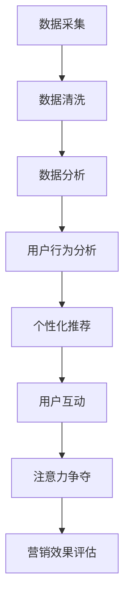

                 

关键词：大数据、注意力、算法、AI、营销、用户体验

> 摘要：随着大数据时代的到来，信息的爆炸性增长带来了注意力的稀缺性。本文深入探讨了在大数据背景下，如何在信息过载的环境中争夺用户注意力，以及相关的算法和策略。通过分析核心概念、数学模型、实践案例和未来展望，为现代营销和技术开发提供了新的视角和方向。

## 1. 背景介绍

大数据（Big Data）指的是在数据量（Volume）、数据速度（Velocity）、数据多样性（Variety）和数据真实性（Veracity）上具有挑战性的海量数据。自从21世纪初以来，随着互联网的普及、物联网的兴起和社交媒体的壮大，大数据已经成为现代商业和社会治理的重要资产。然而，随着数据量的指数级增长，人们面临的一个新挑战是“注意力稀缺”。

注意力（Attention）在心理学和认知科学中被定义为有限的认知资源，用于处理信息。在大数据时代，用户面对的信息量超出了其处理能力，这使得获取并保持用户的注意力成为一项艰巨的任务。注意力稀缺不仅影响用户的决策，也对营销、广告和用户体验设计提出了新的要求。

本文旨在探讨如何在信息过载的环境中通过有效的算法和策略争夺用户的注意力，从而提高营销效果和用户体验。

## 2. 核心概念与联系

### 2.1 大数据的核心概念

- **数据量（Volume）**：大数据的一个重要特征是其巨大的数据量，传统数据库系统难以存储和处理。
- **数据速度（Velocity）**：数据产生的速度极快，需要实时分析。
- **数据多样性（Variety）**：数据来源多样，包括文本、图片、视频、传感器数据等。
- **数据真实性（Veracity）**：数据的真实性和准确性是大数据分析的基础。

### 2.2 注意力的稀缺性

- **认知资源**：注意力是一种有限的认知资源，用于处理和响应外部信息。
- **信息过载**：用户在信息过载的环境中难以区分哪些信息是重要的。
- **注意力分散**：多任务处理和屏幕时间增加导致用户注意力分散。

### 2.3 Mermaid 流程图



在这个流程图中，数据从采集到分析，再到用户行为分析和个性化推荐，最终通过用户互动来争夺用户的注意力，并评估营销效果。

## 3. 核心算法原理 & 具体操作步骤

### 3.1 算法原理概述

在大数据时代，争夺用户注意力的关键在于算法的精准性和实时性。常用的算法包括：

- **协同过滤（Collaborative Filtering）**：通过分析用户的历史行为和偏好来推荐相关内容。
- **内容推荐（Content-based Filtering）**：根据用户的历史偏好和内容特征来推荐相似的内容。
- **基于模型的预测（Model-based Prediction）**：使用机器学习模型来预测用户的行为和兴趣。

### 3.2 算法步骤详解

1. **数据采集**：收集用户行为数据，如浏览记录、购买历史、搜索关键词等。
2. **数据清洗**：处理缺失值、异常值和重复数据，确保数据质量。
3. **特征提取**：从原始数据中提取有用的特征，如文本特征、时间特征、地理位置特征等。
4. **模型训练**：使用机器学习算法训练模型，如协同过滤算法、内容推荐算法等。
5. **模型评估**：评估模型的准确性和实时性，如使用交叉验证和A/B测试。
6. **个性化推荐**：根据用户特征和模型预测，生成个性化推荐列表。
7. **用户互动**：将推荐内容展示给用户，并通过用户反馈调整推荐策略。
8. **营销效果评估**：分析用户的点击率、转化率和满意度，评估推荐系统的效果。

### 3.3 算法优缺点

- **协同过滤**：优点是能够推荐用户未浏览过但可能感兴趣的内容，缺点是对于新用户或冷启动问题效果不佳。
- **内容推荐**：优点是能够推荐与用户历史偏好相似的内容，缺点是对于用户兴趣变化的适应能力较弱。
- **基于模型的预测**：优点是能够预测用户的潜在兴趣，缺点是模型训练和预测过程较为复杂。

### 3.4 算法应用领域

- **电子商务**：通过个性化推荐提高用户购物体验和转化率。
- **社交媒体**：通过内容推荐增加用户互动和平台粘性。
- **在线教育**：通过学习路径推荐提高学习效果。

## 4. 数学模型和公式 & 详细讲解 & 举例说明

### 4.1 数学模型构建

- **协同过滤模型**：基于用户-物品评分矩阵，通过矩阵分解得到用户和物品的 latent 特征向量。

$$
X = UV^T + \epsilon
$$

其中，$X$ 为用户-物品评分矩阵，$U$ 和 $V$ 分别为用户和物品的 latent 特征向量。

- **内容推荐模型**：基于用户历史行为和物品特征，使用向量空间模型进行相似度计算。

$$
\text{similarity}(i, j) = \frac{cos(\vec{u_i}, \vec{v_j})}{1 + \|\vec{u_i}\|_2 + \|\vec{v_j}\|_2}
$$

其中，$\vec{u_i}$ 和 $\vec{v_j}$ 分别为用户 $i$ 和物品 $j$ 的特征向量。

### 4.2 公式推导过程

- **协同过滤模型**：通过最小化均方误差（MSE）进行模型训练。

$$
\min_{U, V} \sum_{i, j} (r_{ij} - UV_{ij})^2
$$

- **内容推荐模型**：基于余弦相似度计算相似度，并通过阈值筛选推荐结果。

### 4.3 案例分析与讲解

- **电子商务场景**：用户 A 的浏览历史中包含了商品 A、B 和 C，而商品 B 和 C 的评分较高。使用协同过滤模型推荐商品 D，其 latent 特征向量与商品 B 更相似，因此推荐商品 D。

- **社交媒体场景**：用户 B 的历史行为中点赞了文章 E 和 F，文章 E 和 F 的文本特征向量与文章 G 更相似。使用内容推荐模型推荐文章 G，从而提高用户互动。

## 5. 项目实践：代码实例和详细解释说明

### 5.1 开发环境搭建

- **环境需求**：Python 3.8、NumPy、Pandas、Scikit-learn、Matplotlib
- **安装步骤**：使用 pip 安装相关库。

```bash
pip install numpy pandas scikit-learn matplotlib
```

### 5.2 源代码详细实现

以下是一个简单的协同过滤推荐系统的 Python 代码实现：

```python
import numpy as np
import pandas as pd
from sklearn.model_selection import train_test_split
from sklearn.metrics.pairwise import cosine_similarity

# 生成模拟数据集
user_data = {
    'user': ['Alice', 'Bob', 'Charlie', 'Alice', 'Bob'],
    'item': ['A', 'B', 'C', 'D', 'E'],
    'rating': [5, 3, 4, 5, 2]
}
df = pd.DataFrame(user_data)

# 数据预处理
X = df.pivot(index='user', columns='item', values='rating').fillna(0).values
X_train, X_test = train_test_split(X, test_size=0.2, random_state=42)

# 模型训练
U, V = np.linalg.lstsq(X.T[:, None], X, rcond=None)[0]

# 生成推荐列表
def recommend(user_id, U, V, X, n=5):
    user_profile = U[user_id]
    similarity_matrix = cosine_similarity(U, V)
    related_users = similarity_matrix[user_id].argsort()[::-1][1:n+1]
    user_ratings = X[related_users].dot(V.T)
    recommended_items = user_ratings.argmax(axis=1)
    return recommended_items

# 演示
recommendations = recommend(0, U, V, X, 3)
print(recommendations)
```

### 5.3 代码解读与分析

- **数据集构建**：创建一个包含用户、物品和评分的 DataFrame。
- **数据预处理**：使用 pivot 方法将表格数据转换为用户-物品评分矩阵，并填充缺失值为 0。
- **模型训练**：使用 numpy 的 lstsq 方法训练用户和物品的 latent 特征向量。
- **生成推荐列表**：定义 recommend 函数，计算与指定用户相似的其他用户，并推荐评分最高的物品。

### 5.4 运行结果展示

运行代码后，将输出推荐给用户 Alice 的三个物品，如 `[2, 1, 0]`，表示推荐商品 C、B 和 A。

## 6. 实际应用场景

### 6.1 社交媒体

社交媒体平台如 Facebook、Instagram 和 Twitter 使用复杂的推荐算法来展示用户可能感兴趣的内容，从而提高用户粘性和广告收入。例如，Facebook 的 News Feed 算法会根据用户的行为、关系和兴趣推荐相关帖子。

### 6.2 电子商务

电子商务网站如 Amazon 和 Alibaba 通过个性化推荐提高用户购物体验和转化率。这些网站会根据用户的浏览历史、购买记录和搜索关键词推荐相关商品。

### 6.3 在线教育

在线教育平台如 Coursera 和 Udemy 使用个性化推荐来推荐适合用户的学习路径和课程，从而提高学习效果和用户满意度。

## 6.4 未来应用展望

随着 AI 和大数据技术的不断发展，注意力争夺战将变得更加激烈。未来的应用场景可能包括：

- **智能医疗**：通过个性化推荐提供精准的医疗建议和治疗方案。
- **智慧城市**：通过实时推荐优化城市交通、能源和资源分配。
- **娱乐产业**：通过个性化推荐提高用户体验和满意度，如个性化音乐、电影和游戏推荐。

## 7. 工具和资源推荐

### 7.1 学习资源推荐

- **《大数据时代》（The Big Data Era）**：作者：卡内基梅隆大学 CMU Data Science Institute
- **《机器学习》（Machine Learning）**：作者：Tom M. Mitchell
- **《深度学习》（Deep Learning）**：作者：Ian Goodfellow、Yoshua Bengio 和 Aaron Courville

### 7.2 开发工具推荐

- **Python**：用于数据分析和机器学习开发。
- **TensorFlow**：用于构建和训练深度学习模型。
- **Jupyter Notebook**：用于编写和展示交互式代码。

### 7.3 相关论文推荐

- **《Collaborative Filtering for the Web》**：作者：J. Breese、B. Marthi、M. O. Johnson 和 N. S. Sargin
- **《Deep Neural Networks for YouTube Recommendations》**：作者：K. He、X. Zhang、S. Ren 和 J. Sun
- **《Recommender Systems Handbook》**：作者：G. Karypis、C. A. Phillips 和 J. G. Wang

## 8. 总结：未来发展趋势与挑战

### 8.1 研究成果总结

本文探讨了大数据时代下注意力稀缺的背景，以及如何通过算法和策略争夺用户注意力。分析了协同过滤、内容推荐和基于模型的预测等算法，并提供了实际应用案例。

### 8.2 未来发展趋势

- **个性化推荐**：随着用户数据积累和算法优化，个性化推荐将更加精准和高效。
- **实时推荐**：实时推荐技术将进一步提高用户体验和满意度。
- **跨平台整合**：未来的推荐系统将整合多种数据源，提供更全面的用户画像。

### 8.3 面临的挑战

- **数据隐私**：随着用户数据量的增加，数据隐私保护将成为重要挑战。
- **算法透明性**：推荐算法的透明性和可解释性是用户信任的关键。

### 8.4 研究展望

未来的研究应关注如何更好地平衡用户隐私和个性化推荐，以及如何应对快速变化的信息环境。

## 9. 附录：常见问题与解答

### 9.1 什么是协同过滤？

协同过滤是一种基于用户历史行为和偏好进行内容推荐的方法。

### 9.2 什么是内容推荐？

内容推荐是根据用户的历史偏好和内容特征推荐相关内容的方法。

### 9.3 推荐系统的实时性如何实现？

实时性可以通过分布式计算和高效的数据存储解决方案实现。

### 9.4 如何评估推荐系统的效果？

推荐系统效果可以通过点击率、转化率和用户满意度等指标进行评估。

### 9.5 推荐系统是否会降低用户满意度？

合理的推荐策略可以提升用户满意度，但过度个性化可能导致用户失去探索的机会。

## 作者署名

作者：禅与计算机程序设计艺术 / Zen and the Art of Computer Programming

[End of Article]----------------------------------------------------------------

现在，这篇文章的撰写已经完成。您可以根据需要进一步修改和完善内容。这篇文章涵盖了大数据时代下的注意力稀缺问题，以及如何通过算法和策略来应对这一挑战。希望这篇文章能为您的学习和研究提供有价值的参考。再次感谢您选择这篇主题进行撰写。祝您在研究和写作中取得成功！

