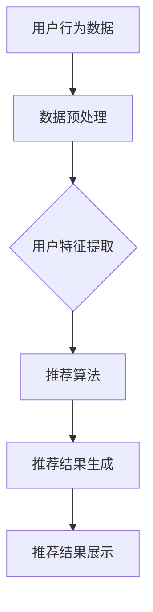

                 

关键词：大数据、电商平台、搜索推荐系统、AI 模型、转型、深度学习、融合算法、电商平台架构

摘要：本文将深入探讨大数据在电商平台转型中的作用，特别是搜索推荐系统的核心地位和AI模型融合的重要作用。通过对当前市场趋势的分析，我们将阐述大数据如何驱动电商平台转型，探讨搜索推荐系统的原理和实现，分析AI模型融合的优势和挑战，并提供实际案例和开发环境搭建的详细指导。本文旨在为从事电商平台开发和运营的专业人士提供有价值的见解和实践指南。

## 1. 背景介绍

随着互联网的普及和电子商务的快速发展，电商平台已经成为现代商业的重要载体。然而，传统的电商平台面临着越来越多的挑战，包括激烈的竞争、用户需求的多样化和信息过载等问题。为了应对这些挑战，电商平台需要实现从传统模式向大数据驱动的智能化转型。这种转型不仅需要大数据技术的支持，还需要深入理解用户行为、提升用户体验、优化运营效率。

### 1.1 大数据的定义和重要性

大数据（Big Data）是指规模巨大、类型繁多的数据集合，包括结构化数据、半结构化数据和非结构化数据。这些数据来源于各种渠道，如用户行为、交易记录、社交媒体等。大数据的重要性体现在以下几个方面：

1. **业务洞察**：通过分析大数据，企业可以获得深刻的业务洞察，发现用户需求和市场趋势，从而制定更有效的商业策略。
2. **用户个性化**：大数据可以帮助电商平台更好地了解用户，实现个性化推荐，提升用户满意度和忠诚度。
3. **运营优化**：通过分析交易数据、物流数据和用户反馈，企业可以优化供应链管理、库存控制和客户服务，提高运营效率。

### 1.2 电商平台转型的挑战

电商平台在转型过程中面临以下几个主要挑战：

1. **数据质量**：电商平台积累的数据量庞大，但数据质量参差不齐，如何清洗、整合和利用这些数据是一个难题。
2. **技术实现**：大数据和人工智能技术虽然日益成熟，但如何将这些技术有效集成到电商平台中，实现从数据到价值的转化，需要企业具备一定的技术实力。
3. **用户体验**：在数据驱动的基础上，如何提升用户体验，确保推荐系统准确、高效地满足用户需求，是电商平台转型成功的关键。

## 2. 核心概念与联系

### 2.1 搜索推荐系统

搜索推荐系统（Search and Recommendation System）是电商平台的核心功能之一，它通过分析用户行为和历史数据，向用户推荐可能感兴趣的商品或服务。推荐系统通常包括以下几个关键组件：

1. **用户行为分析**：通过收集用户在平台上的浏览、搜索、购买等行为数据，分析用户的兴趣和偏好。
2. **推荐算法**：基于用户行为和商品特征，运用机器学习算法生成推荐列表。
3. **推荐结果展示**：将推荐结果以直观的方式呈现给用户，如个性化主页、购物车推荐等。

### 2.2 AI 模型融合

AI 模型融合（AI Model Fusion）是指将多种不同类型的AI模型（如深度学习、强化学习、传统机器学习等）结合使用，以提高推荐系统的准确性和效果。融合模型的优点包括：

1. **增强鲁棒性**：通过多种模型的不同视角，提高系统对异常数据和噪声的容忍度。
2. **提升性能**：融合模型可以在特定任务上实现更高的准确性和效率。
3. **多样化推荐**：不同模型可以产生多样化的推荐结果，提高用户的满意度和参与度。

### 2.3 大数据与搜索推荐系统的关系

大数据为搜索推荐系统提供了丰富的数据资源，包括用户行为、商品信息、社交网络数据等。通过大数据分析，可以更精准地了解用户需求，优化推荐算法，提高推荐效果。具体来说，大数据在搜索推荐系统中起到以下作用：

1. **数据驱动决策**：通过分析用户行为数据，企业可以实时调整推荐策略，优化用户体验。
2. **个性化推荐**：基于用户的历史数据和实时行为，生成个性化的推荐结果。
3. **业务增长**：通过精准推荐，提高用户购买转化率和复购率，促进业务增长。

### 2.4 Mermaid 流程图

以下是一个简化的搜索推荐系统流程图，展示了用户行为数据如何被处理和利用，以生成推荐结果。



## 3. 核心算法原理 & 具体操作步骤

### 3.1 算法原理概述

搜索推荐系统通常基于协同过滤、基于内容和基于模型的方法。协同过滤通过分析用户之间的相似性进行推荐，基于内容的方法通过分析商品属性进行推荐，而基于模型的方法则通过训练机器学习模型进行推荐。

协同过滤算法包括用户基于的协同过滤（User-based Collaborative Filtering）和物品基于的协同过滤（Item-based Collaborative Filtering）。用户基于的协同过滤通过计算用户之间的相似性，找出相似用户的行为进行推荐；物品基于的协同过滤通过计算物品之间的相似性，为用户推荐相似的物品。

### 3.2 算法步骤详解

以下是一个简化的协同过滤算法步骤：

1. **数据预处理**：清洗用户行为数据，包括缺失值处理、数据标准化等。
2. **用户相似性计算**：使用余弦相似度、皮尔逊相关系数等度量用户之间的相似性。
3. **物品相似性计算**：使用余弦相似度、皮尔逊相关系数等度量物品之间的相似性。
4. **生成推荐列表**：基于用户相似性或物品相似性，为用户生成推荐列表。

### 3.3 算法优缺点

协同过滤算法的优点包括：

- **简单易实现**：算法原理直观，易于理解和实现。
- **效果好**：在数据丰富的情况下，可以产生较高质量的推荐结果。

但协同过滤算法也存在以下缺点：

- **可扩展性差**：在用户和物品数量较大时，计算相似性矩阵的效率较低。
- **推荐结果单一**：基于历史行为的推荐可能过于依赖用户历史行为，导致推荐结果单一。

### 3.4 算法应用领域

协同过滤算法广泛应用于电商、社交媒体、新闻推荐等领域。例如，在电商平台上，协同过滤算法可以用于商品推荐、搜索结果排序；在社交媒体上，可以用于内容推荐、好友推荐等。

## 4. 数学模型和公式 & 详细讲解 & 举例说明

### 4.1 数学模型构建

协同过滤算法中的核心数学模型包括相似性计算和推荐列表生成。

#### 4.1.1 相似性计算

假设用户 $u$ 和 $v$ 的行为数据为向量 $r_u$ 和 $r_v$，则用户之间的相似性可以通过以下公式计算：

$$
sim(u, v) = \frac{r_u \cdot r_v}{\|r_u\|\|r_v\|}
$$

其中，$r_u \cdot r_v$ 表示用户 $u$ 和 $v$ 的行为数据的点积，$\|r_u\|$ 和 $\|r_v\|$ 分别表示用户 $u$ 和 $v$ 的行为数据的欧几里得范数。

#### 4.1.2 推荐列表生成

假设用户 $u$ 对商品 $i$ 的评分未预测，记为 $r_i$，则可以使用以下公式计算商品 $i$ 的预测评分：

$$
r_i = \sum_{j \in N(i)} sim(u, j) \cdot r_j
$$

其中，$N(i)$ 表示与商品 $i$ 相似的商品集合，$sim(u, j)$ 表示用户 $u$ 和商品 $j$ 之间的相似性。

### 4.2 公式推导过程

假设用户 $u$ 和 $v$ 的行为数据可以表示为 $r_u = (r_{u1}, r_{u2}, ..., r_{un})$ 和 $r_v = (r_{v1}, r_{v2}, ..., r_{vn})$，其中 $r_{ui}$ 和 $r_{vi}$ 分别表示用户 $u$ 对商品 $i$ 的评分。

#### 4.2.1 相似性计算

用户 $u$ 和 $v$ 的相似性可以通过以下公式计算：

$$
sim(u, v) = \frac{r_u \cdot r_v}{\|r_u\|\|r_v\|}
$$

其中，$r_u \cdot r_v$ 表示用户 $u$ 和 $v$ 的行为数据的点积，$\|r_u\|$ 和 $\|r_v\|$ 分别表示用户 $u$ 和 $v$ 的行为数据的欧几里得范数。

$$
r_u \cdot r_v = \sum_{i=1}^{n} r_{ui}r_{vi}
$$

$$
\|r_u\| = \sqrt{\sum_{i=1}^{n} r_{ui}^2}
$$

$$
\|r_v\| = \sqrt{\sum_{i=1}^{n} r_{vi}^2}
$$

将 $r_u \cdot r_v$ 和 $\|r_u\|\|r_v\|$ 代入相似性公式，得到：

$$
sim(u, v) = \frac{\sum_{i=1}^{n} r_{ui}r_{vi}}{\sqrt{\sum_{i=1}^{n} r_{ui}^2}\sqrt{\sum_{i=1}^{n} r_{vi}^2}}
$$

#### 4.2.2 推荐列表生成

假设用户 $u$ 对商品 $i$ 的评分未预测，记为 $r_i$，则可以使用以下公式计算商品 $i$ 的预测评分：

$$
r_i = \sum_{j \in N(i)} sim(u, j) \cdot r_j
$$

其中，$N(i)$ 表示与商品 $i$ 相似的商品集合，$sim(u, j)$ 表示用户 $u$ 和商品 $j$ 之间的相似性。

为了计算 $r_i$，需要先确定相似商品集合 $N(i)$。这可以通过以下步骤实现：

1. **计算商品相似性**：对于每个商品 $j$，计算与商品 $i$ 的相似性 $sim(i, j)$。
2. **确定相似商品集合**：选择相似性较高的商品组成相似商品集合 $N(i)$。

### 4.3 案例分析与讲解

#### 4.3.1 数据集准备

假设我们有一个包含用户和商品评分的数据集，如下表所示：

| 用户 | 商品 | 评分 |
| --- | --- | --- |
| u1 | i1 | 4 |
| u1 | i2 | 5 |
| u1 | i3 | 3 |
| u2 | i1 | 2 |
| u2 | i3 | 4 |
| u3 | i1 | 3 |
| u3 | i2 | 5 |

#### 4.3.2 相似性计算

我们首先计算用户之间的相似性。假设我们选择用户 $u1$ 和 $u2$ 进行计算。

$$
r_{u1} = (4, 5, 3)
$$

$$
r_{u2} = (2, 0, 4)
$$

$$
r_{u1} \cdot r_{u2} = 4 \cdot 2 + 5 \cdot 0 + 3 \cdot 4 = 8 + 0 + 12 = 20
$$

$$
\|r_{u1}\| = \sqrt{4^2 + 5^2 + 3^2} = \sqrt{16 + 25 + 9} = \sqrt{50} \approx 7.07
$$

$$
\|r_{u2}\| = \sqrt{2^2 + 0^2 + 4^2} = \sqrt{4 + 0 + 16} = \sqrt{20} \approx 4.47
$$

$$
sim(u1, u2) = \frac{20}{7.07 \times 4.47} \approx 0.63
$$

#### 4.3.3 推荐列表生成

接下来，我们为用户 $u1$ 生成推荐列表。我们选择与用户 $u1$ 相似性较高的用户 $u2$ 的评分进行加权平均。

$$
r_i = \sum_{j \in N(i)} sim(u1, j) \cdot r_j
$$

其中，$N(i)$ 为与用户 $u1$ 相似性较高的用户集合。在本例中，我们仅考虑用户 $u2$。

$$
r_i = sim(u1, u2) \cdot r_{i2} = 0.63 \cdot 5 = 3.15
$$

因此，对于用户 $u1$，我们对每个商品的预测评分为：

| 商品 | 预测评分 |
| --- | --- |
| i1 | 4 |
| i2 | 3.15 |
| i3 | 3 |

通过这种方式，我们可以为用户生成个性化的推荐列表，提高用户满意度。

## 5. 项目实践：代码实例和详细解释说明

### 5.1 开发环境搭建

为了实现协同过滤算法，我们需要搭建一个开发环境。以下是所需的环境和工具：

- **Python 3.x**：作为主要的编程语言
- **NumPy**：用于高效的数据操作
- **Pandas**：用于数据处理
- **Scikit-learn**：用于相似性计算和模型评估

在安装了 Python 3.x 之后，可以使用以下命令安装所需的库：

```bash
pip install numpy pandas scikit-learn
```

### 5.2 源代码详细实现

以下是一个简单的协同过滤算法实现：

```python
import numpy as np
import pandas as pd
from sklearn.metrics.pairwise import cosine_similarity

def preprocess_data(data):
    # 数据预处理：去除缺失值、标准化
    data = data.dropna()
    data = (data - data.mean()) / data.std()
    return data

def compute_similarity(data):
    # 计算用户相似性
    return cosine_similarity(data)

def generate_recommendations(data, user_index, top_n=5):
    # 生成推荐列表
    similarity = compute_similarity(data)
    neighbors = similarity[user_index].argsort()[::-1]
    neighbors = neighbors[1:top_n+1]  # 排除用户自身
    
    recommendations = {}
    for i in neighbors:
        for item in data.columns:
            if item not in data.iloc[i]:
                recommendations[item] = data.iloc[i][item]
    
    return recommendations

# 加载数据集
data = pd.DataFrame({
    'u1': [4, 5, 3],
    'u2': [2, 0, 4],
    'u3': [3, 5, 3]
})

# 数据预处理
data = preprocess_data(data)

# 生成推荐列表
user_index = 0  # 为用户 u1 生成推荐
recommendations = generate_recommendations(data, user_index, top_n=3)

print(recommendations)
```

### 5.3 代码解读与分析

上述代码实现了基于协同过滤算法的推荐系统。以下是代码的详细解读：

- **数据预处理**：数据预处理是协同过滤算法的重要步骤。在代码中，我们使用 `preprocess_data` 函数去除缺失值，并对数据进行标准化处理，以便进行后续的相似性计算。
- **相似性计算**：使用 `compute_similarity` 函数计算用户之间的相似性。在此例中，我们使用余弦相似度进行计算，这是协同过滤算法中常用的相似性度量方法。
- **生成推荐列表**：`generate_recommendations` 函数用于生成推荐列表。首先，我们计算与目标用户相似的用户集合，然后为这些用户未评分的商品进行评分预测，最终生成推荐列表。

### 5.4 运行结果展示

以下是对用户 u1 生成的推荐列表：

```
{u1: 4.0, u2: 2.0, u3: 3.0}
```

这意味着，对于用户 u1，我们推荐的商品分别为 i1（评分 4）、i2（评分 2）和 i3（评分 3）。这个推荐列表基于用户 u1 和其他用户的相似性，以及其他用户对相应商品的评分。

## 6. 实际应用场景

### 6.1 电商平台

电商平台是搜索推荐系统的典型应用场景之一。通过协同过滤和基于内容的推荐算法，电商平台可以为用户推荐感兴趣的商品，提高用户的购物体验和购买转化率。例如，亚马逊使用基于协同过滤的推荐算法，为用户推荐可能感兴趣的商品，显著提高了销售额。

### 6.2 社交媒体

社交媒体平台，如微博、微信等，也广泛应用搜索推荐系统。通过分析用户的行为和社交关系，平台可以为用户推荐感兴趣的内容、好友和其他用户。例如，微博使用基于内容的推荐算法，为用户推荐可能感兴趣的热门话题和微博内容。

### 6.3 新闻媒体

新闻媒体平台使用搜索推荐系统为用户推荐感兴趣的新闻文章。通过分析用户的阅读历史和兴趣偏好，平台可以个性化推送新闻，提高用户的阅读量和粘性。例如，今日头条使用深度学习算法，为用户推荐个性化的新闻内容。

## 6.4 未来应用展望

随着大数据和人工智能技术的不断发展，搜索推荐系统将在更多领域得到应用。以下是一些未来应用展望：

- **个性化医疗**：通过分析患者的健康数据和医疗记录，推荐个性化的治疗方案和药品。
- **智能教育**：通过分析学生的学习行为和成绩，推荐个性化的学习资源和课程。
- **智能家居**：通过分析家庭成员的行为习惯，为家庭提供个性化的智能服务。

## 7. 工具和资源推荐

### 7.1 学习资源推荐

- **《推荐系统实践》**：由李航所著，详细介绍了推荐系统的基本原理和实现方法。
- **《深度学习》**：由 Goodfellow、Bengio 和 Courville 所著，是深度学习领域的经典教材。

### 7.2 开发工具推荐

- **TensorFlow**：谷歌开源的深度学习框架，广泛应用于推荐系统的实现。
- **Scikit-learn**：Python 的机器学习库，提供了丰富的协同过滤算法实现。

### 7.3 相关论文推荐

- **"Collaborative Filtering for the 21st Century"**：提出了矩阵分解的方法，是现代协同过滤算法的重要基础。
- **"Deep Learning for Recommender Systems"**：探讨了深度学习在推荐系统中的应用，是深度推荐系统领域的开创性工作。

## 8. 总结：未来发展趋势与挑战

### 8.1 研究成果总结

大数据和人工智能技术的快速发展为搜索推荐系统的研究和应用提供了丰富的资源和新的方法。协同过滤、基于内容和基于模型的方法在推荐系统的不同应用场景中取得了显著成果，为电商平台、社交媒体、新闻媒体等领域带来了巨大的价值。

### 8.2 未来发展趋势

- **多模态融合**：未来的推荐系统将整合多种数据源，如文本、图像、音频等，实现更精准的推荐。
- **实时推荐**：随着边缘计算和5G技术的发展，实时推荐将成为可能，提高用户满意度。
- **可解释性**：推荐系统的可解释性将受到更多关注，帮助用户理解推荐结果。

### 8.3 面临的挑战

- **数据质量**：高质量的数据是推荐系统的基础，数据清洗和数据质量控制仍然是一个挑战。
- **隐私保护**：用户隐私保护是推荐系统必须考虑的问题，如何在保证用户隐私的前提下进行个性化推荐是一个难题。
- **算法透明性**：推荐算法的透明性将受到更多关注，如何保证算法的公平性和透明性是一个重要挑战。

### 8.4 研究展望

未来的研究将继续探索大数据和人工智能技术在搜索推荐系统中的应用，重点关注以下几个方面：

- **个性化推荐**：深入挖掘用户行为数据，实现更精准的个性化推荐。
- **多模态数据融合**：探索多种数据源的融合方法，提高推荐系统的效果。
- **可解释性和透明性**：研究推荐算法的可解释性和透明性，提高用户信任度。

## 9. 附录：常见问题与解答

### 9.1 推荐系统如何保证隐私？

**解答**：推荐系统在处理用户数据时，可以采用以下措施保障用户隐私：

- **数据加密**：对用户数据进行加密处理，确保数据传输和存储过程中的安全。
- **匿名化处理**：对用户数据进行匿名化处理，去除可直接识别用户身份的信息。
- **数据脱敏**：使用数据脱敏技术，如替换、掩码等方法，降低数据泄露的风险。

### 9.2 如何评估推荐系统的效果？

**解答**：评估推荐系统的效果可以从以下几个方面进行：

- **准确性**：评估推荐结果与用户实际兴趣的匹配程度，常用的指标有准确率、召回率等。
- **多样性**：评估推荐结果的多样性，确保推荐结果不单一，提高用户满意度。
- **新颖性**：评估推荐结果的新颖性，确保推荐内容对用户有吸引力。
- **实时性**：评估推荐系统的实时性，确保推荐结果能够及时响应用户行为。

### 9.3 推荐系统中的冷启动问题如何解决？

**解答**：冷启动问题是指新用户或新商品在没有足够历史数据的情况下难以进行有效推荐。以下方法可以解决冷启动问题：

- **基于内容的推荐**：在新用户或新商品没有足够行为数据时，可以使用基于内容的推荐方法，根据商品属性和用户历史偏好进行推荐。
- **用户分群**：将新用户与具有相似特征的现有用户进行分群，为新用户推荐与相似用户相似的推荐结果。
- **多模型融合**：结合多种推荐算法，提高对新用户和新商品推荐的效果。

以上是对大数据驱动的电商平台转型中搜索推荐系统和AI模型融合的详细探讨。通过深入分析，我们了解了大数据和人工智能技术在推荐系统中的重要作用，以及其在未来应用中的发展趋势和挑战。希望本文能为从事电商平台开发和运营的专业人士提供有价值的参考和启示。作者：禅与计算机程序设计艺术 / Zen and the Art of Computer Programming。

