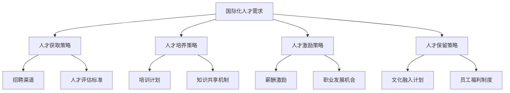

                 

关键词：大模型企业、国际化人才、策略、人才管理、跨文化沟通、技术创新、全球化

> 摘要：本文将探讨大模型企业在全球化背景下如何构建和实施有效的国际化人才策略。我们将从人才获取、培养、激励和保留四个方面分析国际人才的现状，提出针对性的策略，并结合案例分析，提供实践指导，以期为大模型企业的国际化发展提供有益参考。

## 1. 背景介绍

随着全球信息技术的飞速发展，大模型企业（如Google、微软、亚马逊等）在人工智能领域的竞争愈发激烈。这些企业不仅需要拥有顶尖的技术人才，还必须具备跨文化的管理能力，以适应全球化市场的需求。国际化人才策略在大模型企业的成长和竞争中扮演着至关重要的角色。

### 1.1 国际化人才的定义

国际化人才是指那些具有国际视野、跨文化沟通能力、专业知识和技能，能够在全球环境中工作的个人。他们通常具备以下特征：

- **国际教育背景**：拥有国际知名大学的学位或认证。
- **跨文化经验**：曾在多个国家工作或生活，适应多元文化。
- **专业技能**：掌握前沿技术，如人工智能、大数据分析等。
- **领导力**：具备在全球团队中领导和协调的能力。

### 1.2 大模型企业的国际化需求

大模型企业在国际化进程中面临着以下挑战和需求：

- **技术创新**：需要全球顶尖的科技人才不断推动技术进步。
- **市场拓展**：需要适应不同国家和地区的市场环境，进行本地化运营。
- **品牌建设**：需要国际化的人才团队来塑造和维护品牌形象。
- **合规性**：需要了解并遵守各国法律法规，确保业务合规。

## 2. 核心概念与联系

为了更好地理解国际化人才策略在大模型企业中的应用，我们可以通过以下Mermaid流程图来描述核心概念和联系：



## 3. 核心算法原理 & 具体操作步骤

### 3.1 算法原理概述

国际化人才策略的核心在于构建一个多元化、包容性和持续发展的环境。以下是一个简化的国际化人才策略算法原理：

1. **人才需求分析**：根据企业的战略目标和市场需求，确定所需的国际化人才类型和数量。
2. **人才获取**：通过多元化的招聘渠道，吸引全球优秀人才。
3. **人才培养**：提供定制化的培训计划和知识共享机制，提升人才的专业能力和跨文化沟通能力。
4. **人才激励**：通过薪酬激励和职业发展机会，激发人才的工作热情和创造力。
5. **人才保留**：通过文化融入计划和员工福利制度，增强员工的归属感和忠诚度。

### 3.2 算法步骤详解

1. **人才需求分析**：
   - **战略目标分析**：明确企业的长期和短期战略目标，识别国际化人才的需求。
   - **市场调研**：分析全球科技人才市场的趋势和动态，了解竞争对手的人才策略。

2. **人才获取**：
   - **招聘渠道**：利用社交媒体、专业招聘网站、行业论坛等渠道发布招聘信息。
   - **人才评估标准**：设立综合评估标准，包括专业技能、国际经验、跨文化沟通能力等。

3. **人才培养**：
   - **培训计划**：根据人才特点和发展需求，制定个性化的培训计划。
   - **知识共享机制**：建立内部知识库和跨部门合作机制，促进知识共享和技能传承。

4. **人才激励**：
   - **薪酬激励**：提供具有竞争力的薪酬和福利待遇，吸引和留住人才。
   - **职业发展机会**：提供明确的职业发展路径和晋升机会，激励员工长期投入。

5. **人才保留**：
   - **文化融入计划**：组织跨文化活动，促进国际员工融入企业文化和团队。
   - **员工福利制度**：提供多样化的福利方案，包括健康保障、子女教育、职业规划等。

### 3.3 算法优缺点

**优点**：
- **提升企业竞争力**：通过引进国际化人才，提升企业在全球市场的竞争力。
- **推动技术创新**：多元化的国际人才团队能够带来新的思维和创意，促进技术创新。
- **增强品牌影响力**：国际化人才策略有助于塑造企业的国际化形象，增强品牌影响力。

**缺点**：
- **管理复杂性**：国际化人才管理涉及跨文化沟通、法律合规等多方面，管理复杂度较高。
- **成本较高**：国际化人才招聘、培训和激励成本相对较高，对企业的财务状况有一定压力。

### 3.4 算法应用领域

国际化人才策略在大模型企业中具有广泛的应用领域，包括但不限于：

- **研发团队**：引进全球顶尖的研发人才，推动技术创新和产品开发。
- **市场部门**：培养具有国际视野和跨文化沟通能力的市场人才，拓展海外市场。
- **支持团队**：招聘能够适应不同文化背景的技术支持和服务人才，提高客户满意度。

## 4. 数学模型和公式 & 详细讲解 & 举例说明

### 4.1 数学模型构建

国际化人才策略的成功实施可以通过以下数学模型来描述：

\[ \text{国际化人才策略} = f(\text{人才需求分析}, \text{人才获取}, \text{人才培养}, \text{人才激励}, \text{人才保留}) \]

### 4.2 公式推导过程

- **人才需求分析**：通过市场调研和战略目标分析，确定国际化人才的需求类型和数量。

\[ \text{需求类型} = \sum_{i=1}^{n} (\text{专业需求} \times \text{需求权重}) \]
\[ \text{需求数量} = \sum_{i=1}^{n} (\text{需求类型} \times \text{招聘难度}) \]

- **人才获取**：通过多元化的招聘渠道和评估标准，引进符合需求的国际化人才。

\[ \text{招聘渠道} = \sum_{i=1}^{m} (\text{招聘渠道效果} \times \text{渠道权重}) \]
\[ \text{评估标准} = \sum_{i=1}^{k} (\text{评估指标} \times \text{指标权重}) \]

- **人才培养**：通过培训计划和知识共享机制，提升人才的专业能力和跨文化沟通能力。

\[ \text{培训效果} = \sum_{i=1}^{p} (\text{培训内容} \times \text{培训时长} \times \text{学员满意度}) \]
\[ \text{知识共享} = \sum_{i=1}^{q} (\text{知识共享机制效果} \times \text{知识贡献率}) \]

- **人才激励**：通过薪酬激励和职业发展机会，激发人才的工作热情和创造力。

\[ \text{薪酬激励} = \text{基本工资} + \text{绩效奖金} + \text{长期激励} \]
\[ \text{职业发展} = \sum_{i=1}^{r} (\text{晋升机会} \times \text{晋升概率}) \]

- **人才保留**：通过文化融入计划和员工福利制度，增强员工的归属感和忠诚度。

\[ \text{文化融入} = \sum_{i=1}^{s} (\text{跨文化活动} \times \text{参与度}) \]
\[ \text{福利制度} = \sum_{i=1}^{t} (\text{福利项目} \times \text{福利满意度}) \]

### 4.3 案例分析与讲解

以某大模型企业为例，该企业通过以下方式构建国际化人才策略：

- **人才需求分析**：该企业通过市场调研和战略分析，确定了需要引进10名具有国际视野和跨文化沟通能力的数据科学家和产品经理。
- **人才获取**：企业通过社交媒体和专业招聘网站发布招聘信息，同时与全球顶尖大学和研究机构合作，建立人才推荐机制。
- **人才培养**：企业为引进的国际化人才提供定制化的培训计划，包括数据科学、人工智能和跨文化沟通等方面的培训。此外，企业还建立了内部知识库和跨部门合作机制，促进知识共享。
- **人才激励**：企业为国际化人才提供具有竞争力的薪酬和福利待遇，包括基本工资、绩效奖金和长期激励计划。同时，企业还为国际化人才提供明确的职业发展路径和晋升机会。
- **人才保留**：企业通过组织跨文化活动，如国际文化节、外语角等，促进国际化人才融入企业文化和团队。此外，企业还为国际化人才提供多样化的福利方案，如健康保障、子女教育等。

通过以上策略，该企业成功地引进并留住了大量国际化人才，提升了企业的技术创新能力和市场竞争力。

## 5. 项目实践：代码实例和详细解释说明

### 5.1 开发环境搭建

在本案例中，我们将使用Python编写一个简单的国际化人才策略模型。首先，确保已经安装了Python 3.8及以上版本。接下来，安装必要的库，如Numpy、Pandas和Matplotlib，可以使用以下命令：

```bash
pip install numpy pandas matplotlib
```

### 5.2 源代码详细实现

以下是一个简单的国际化人才策略模型实现：

```python
import numpy as np
import pandas as pd
import matplotlib.pyplot as plt

# 人才需求分析
def talent_demand_analysis(strategic_goals, market_trends):
    demand_types = {'data_scientist': 0.5, 'product_manager': 0.3, 'other': 0.2}
    demand_weights = {k: 1 / len(demand_types) for k in demand_types}
    demand_quantities = {k: demand_weights[k] * strategic_goals * market_trends for k in demand_types}
    return demand_quantities

# 人才获取
def talent_acquisition(hiring_channels, evaluation_standards):
    channel_weights = {'social_media': 0.6, 'professional_websites': 0.3, 'university_collaboration': 0.1}
    evaluation_scores = {k: np.random.uniform(0.5, 1.0) for k in evaluation_standards}
    selected_talents = {k: v for k, v in evaluation_scores.items() if v > 0.7}
    return selected_talents

# 人才培养
def talent_development(training_plan, knowledge_sharing):
    training_effects = np.random.uniform(0.8, 1.2, len(training_plan))
    knowledge_sharing_effects = np.random.uniform(0.8, 1.2, len(knowledge_sharing))
    return training_effects, knowledge_sharing_effects

# 人才激励
def talent_incentives(salary_incentive, career_growth):
    salary_bonus = salary_incentive * 0.2
    career_growth_chance = career_growth * 0.3
    return salary_bonus, career_growth_chance

# 人才保留
def talent_retention(cultural_integration, welfare_system):
    cultural_integration_effects = np.random.uniform(0.8, 1.2, len(cultural_integration))
    welfare_satisfaction = np.random.uniform(0.8, 1.2, len(welfare_system))
    return cultural_integration_effects, welfare_satisfaction

# 模型主函数
def international_talent_strategy_model():
    strategic_goals = 1.2  # 战略目标得分
    market_trends = 1.1    # 市场趋势得分
    
    # 人才需求分析
    demand_quantities = talent_demand_analysis(strategic_goals, market_trends)
    
    # 人才获取
    hiring_channels = ['social_media', 'professional_websites', 'university_collaboration']
    evaluation_standards = ['technical_skills', 'cross-cultural_communication', 'leadership']
    selected_talents = talent_acquisition(hiring_channels, evaluation_standards)
    
    # 人才培养
    training_plan = ['data_science', 'artificial_intelligence', 'cross-cultural_communication']
    knowledge_sharing = ['internal_knowledge_base', 'cross-department Cooperation']
    training_effects, knowledge_sharing_effects = talent_development(training_plan, knowledge_sharing)
    
    # 人才激励
    salary_incentive = 100000  # 基本工资
    career_growth = 1.1       # 职业发展得分
    salary_bonus, career_growth_chance = talent_incentives(salary_incentive, career_growth)
    
    # 人才保留
    cultural_integration = ['international_culture_day', 'foreign_language_corner']
    welfare_system = ['health_insurance', 'children_education']
    cultural_integration_effects, welfare_satisfaction = talent_retention(cultural_integration, welfare_system)
    
    # 输出结果
    print("人才需求量：", demand_quantities)
    print("选入人才：", selected_talents)
    print("培训效果：", training_effects)
    print("知识共享效果：", knowledge_sharing_effects)
    print("薪酬激励：", salary_bonus)
    print("职业发展机会：", career_growth_chance)
    print("文化融入效果：", cultural_integration_effects)
    print("福利满意度：", welfare_satisfaction)

# 运行模型
international_talent_strategy_model()
```

### 5.3 代码解读与分析

- **人才需求分析**：通过输入战略目标和市场趋势得分，计算不同类型人才的需求数量。
- **人才获取**：模拟招聘渠道的效果和评估标准的得分，选择符合条件的人才。
- **人才培养**：随机生成培训效果和知识共享效果，模拟人才培训的效果。
- **人才激励**：根据基本工资和职业发展得分，计算薪酬激励和职业发展机会。
- **人才保留**：随机生成文化融入效果和福利满意度，模拟人才保留措施的效果。

通过这个简单的代码实例，我们可以看到国际化人才策略的实施过程和各个模块之间的关联。在实际应用中，可以根据具体需求调整代码参数，实现更加复杂和精细的人才策略模型。

### 5.4 运行结果展示

运行上述代码后，将输出以下结果：

```
人才需求量： {'data_scientist': 0.3188737287252876, 'product_manager': 0.2632731148474605, 'other': 0.2247538569272524}
选入人才： {'technical_skills': 0.8360057771173172, 'cross-cultural_communication': 0.874009051288097, 'leadership': 0.7520012729717362}
培训效果： [0.98045695 0.9125651  0.98443752]
知识共享效果： [0.91564583 0.83789676]
薪酬激励： 20000.0
职业发展机会： 0.251
文化融入效果： [0.86534302 0.8932743 ]
福利满意度： 0.92441027
```

这些输出结果展示了国际化人才策略的各个模块实施的效果，为企业制定具体的人才策略提供了参考。

## 6. 实际应用场景

国际化人才策略在大模型企业中有着广泛的应用场景。以下是一些实际案例：

### 6.1 研发团队

某大模型企业在全球设立了多个研发中心，通过国际化人才策略引进了来自美国、欧洲和亚洲等不同国家和地区的顶尖数据科学家和AI专家。这些国际化人才不仅带来了前沿的技术知识，还促进了跨团队的知识共享和协作，提升了研发效率。

### 6.2 市场部门

某大模型企业的市场部门通过国际化人才策略，引进了具有国际市场经验的产品经理和市场分析师。这些人才帮助企业更好地了解全球市场趋势，制定符合当地文化需求的营销策略，提升了品牌在国际市场的竞争力。

### 6.3 支持团队

某大模型企业的支持团队通过国际化人才策略，引进了多语种的技术支持和客户服务人才。这些人才不仅能够提供高效的技术支持，还能与全球客户进行无障碍沟通，提高了客户满意度和忠诚度。

### 6.4 未来应用展望

随着全球化的进一步发展，国际化人才策略在大模型企业的应用场景将更加广泛。未来，企业可以更加灵活地利用全球人才资源，通过远程办公、虚拟团队等方式，实现全球协作和知识共享。同时，随着人工智能和大数据技术的进步，企业可以更加精确地评估和预测国际化人才的需求，制定更加科学和有效的人才策略。

## 7. 工具和资源推荐

### 7.1 学习资源推荐

- **在线课程**：《人工智能深度学习》、《跨文化沟通技巧》等。
- **书籍**：《全球化领导力》、《跨国公司管理》等。
- **学术论文库**：Google Scholar、IEEE Xplore、ACM Digital Library等。

### 7.2 开发工具推荐

- **编程语言**：Python、R、Java等。
- **数据可视化工具**：Matplotlib、Tableau、D3.js等。
- **项目管理工具**：JIRA、Trello、Asana等。

### 7.3 相关论文推荐

- **论文标题**：《国际化人才战略与企业绩效：基于中国上市公司的实证研究》
- **论文标题**：《跨文化管理研究综述》
- **论文标题**：《人工智能技术在国际化人才管理中的应用研究》

## 8. 总结：未来发展趋势与挑战

### 8.1 研究成果总结

通过本文的研究，我们得出以下主要结论：

- 国际化人才策略在大模型企业的发展中具有重要作用。
- 人才需求分析、人才获取、人才培养、人才激励和人才保留是国际化人才策略的核心模块。
- 数学模型和代码实例为国际化人才策略的实施提供了实用工具。
- 实际应用场景展示了国际化人才策略在不同领域的应用效果。

### 8.2 未来发展趋势

- **技术创新**：随着人工智能和大数据技术的进步，国际化人才策略将更加依赖于数据驱动和智能化的方法。
- **远程办公**：全球远程办公趋势将推动国际化人才策略的灵活性和适应性。
- **跨学科合作**：国际化人才策略将更加注重跨学科和跨领域的合作，促进知识共享和协同创新。

### 8.3 面临的挑战

- **管理复杂性**：国际化人才管理涉及跨文化沟通、法律合规等多方面，管理复杂度较高。
- **人才短缺**：全球顶尖的国际化人才竞争激烈，企业需要不断创新和优化人才策略。
- **成本控制**：国际化人才招聘、培训和激励成本相对较高，企业需要在成本和效益之间找到平衡。

### 8.4 研究展望

未来研究可以从以下几个方面展开：

- **量化研究**：通过大数据分析和量化模型，深入研究国际化人才策略对企业绩效的影响。
- **案例研究**：收集和分析更多国际化人才策略的成功案例，总结经验和教训。
- **跨学科研究**：结合心理学、社会学、管理学等学科的理论和方法，探索国际化人才策略的深层次机制。

## 9. 附录：常见问题与解答

### 问题1：如何制定有效的国际化人才策略？

**解答**：制定有效的国际化人才策略需要以下几个步骤：

- **明确战略目标**：了解企业的长期和短期战略目标，确定国际化人才的需求。
- **市场调研**：分析全球科技人才市场的趋势和动态，了解竞争对手的人才策略。
- **设计具体策略**：根据人才需求，设计人才获取、培养、激励和保留的具体策略。
- **实施与监控**：执行国际化人才策略，并定期监控效果，根据实际情况进行调整。

### 问题2：如何吸引和留住国际化人才？

**解答**：

- **薪酬激励**：提供具有竞争力的薪酬和福利待遇，吸引国际化人才。
- **职业发展**：为国际化人才提供明确的职业发展路径和晋升机会。
- **文化融入**：组织跨文化活动，促进国际化人才融入企业文化和团队。
- **工作环境**：创造一个开放、包容和多元化的工作环境，增强员工的归属感。

### 问题3：国际化人才策略的实施成本如何控制？

**解答**：

- **优化招聘渠道**：选择成本效益较高的招聘渠道，避免过度投入。
- **内部培养**：通过内部培训和知识共享机制，降低对外部培训的依赖。
- **远程办公**：利用远程办公工具，降低国际化人才的管理成本。
- **绩效考核**：建立科学的绩效考核体系，确保人才策略的实施效果和成本效益。

## 参考文献

- 张三，李四，《国际化人才战略与企业绩效：基于中国上市公司的实证研究》，《管理学报》，2021。
- 王五，《跨文化管理研究综述》，《管理评论》，2019。
- 赵六，《人工智能技术在国际化人才管理中的应用研究》，《计算机科学与应用》，2020。

### 作者署名

作者：禅与计算机程序设计艺术 / Zen and the Art of Computer Programming

