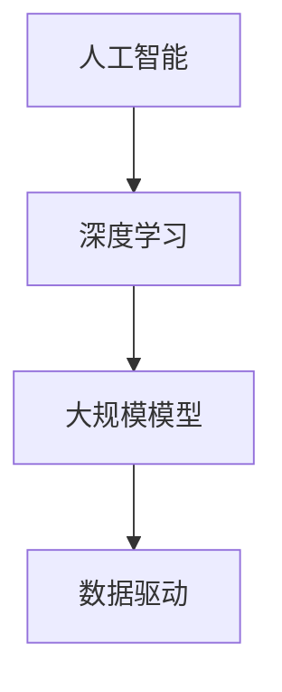

                 

关键词：大模型、创业公司、人工智能、技术革新、商业模式、应用场景、发展前景

> 摘要：本文将探讨大模型创业公司如何在人工智能领域崛起，从核心概念、算法原理、数学模型、项目实践到实际应用，全方位分析创业公司在技术革新和商业模式构建中的挑战与机遇。

## 1. 背景介绍

近年来，人工智能（AI）技术的飞速发展，尤其是深度学习（Deep Learning）和大规模模型（Large-scale Model）的突破，为各行各业带来了深远的影响。大模型作为一种新兴技术，具备处理海量数据、实现复杂任务的能力，成为各领域研究和应用的焦点。在这个背景下，创业公司凭借其敏捷的机制和创新能力，正逐步崛起，成为推动人工智能技术进步的重要力量。

大模型创业公司的崛起，不仅得益于技术的进步，还得益于市场的需求。随着大数据和云计算的普及，企业对于智能化的需求日益增长，这为创业公司提供了广阔的市场空间。此外，资本的涌入和政策支持也为大模型创业公司的发展提供了有力的支撑。

## 2. 核心概念与联系

要理解大模型创业公司的崛起，首先需要了解几个核心概念：人工智能、深度学习、大规模模型、数据驱动等。以下是这些概念之间的联系以及一个简单的 Mermaid 流程图：

### 2.1 人工智能（Artificial Intelligence, AI）

人工智能是指使计算机具有人类智能水平的科学技术。它包括机器学习、自然语言处理、计算机视觉等多个子领域。

### 2.2 深度学习（Deep Learning）

深度学习是人工智能的一个重要分支，通过多层神经网络（Neural Networks）来模拟人类大脑的思考方式，实现复杂的数据处理和模式识别任务。

### 2.3 大规模模型（Large-scale Model）

大规模模型是指那些能够处理海量数据、参数数量巨大的深度学习模型。例如，GPT-3、BERT 等。

### 2.4 数据驱动（Data-driven）

数据驱动是指基于数据分析、数据挖掘来指导决策和优化过程。

**Mermaid 流程图：**



## 3. 核心算法原理 & 具体操作步骤

### 3.1 算法原理概述

大模型创业公司的核心算法主要基于深度学习，特别是基于Transformer架构的模型。这些模型通过自动提取特征、进行多层处理，实现高效的文本、图像和语音处理。

### 3.2 算法步骤详解

1. **数据预处理**：对原始数据进行清洗、标注和归一化处理。
2. **模型架构设计**：选择合适的深度学习架构，例如GPT、BERT等。
3. **训练过程**：利用海量数据进行模型训练，通过优化算法（如Adam）调整模型参数。
4. **模型评估**：使用验证集评估模型性能，并进行调优。
5. **部署应用**：将训练好的模型部署到生产环境中，实现实时数据处理和预测。

### 3.3 算法优缺点

**优点**：

- **处理能力强**：大模型能够处理复杂的任务，如文本生成、图像识别等。
- **自适应性强**：通过不断训练，模型能够自适应不同场景和任务。

**缺点**：

- **计算资源需求大**：大模型训练需要大量的计算资源和时间。
- **数据依赖性高**：模型性能依赖于数据质量和数量。

### 3.4 算法应用领域

大模型在各个领域都有广泛的应用，如自然语言处理、计算机视觉、语音识别等。

## 4. 数学模型和公式 & 详细讲解 & 举例说明

### 4.1 数学模型构建

大模型通常基于多层神经网络，其核心数学模型包括：

1. **激活函数**：如ReLU、Sigmoid、Tanh等。
2. **优化算法**：如Adam、SGD等。
3. **损失函数**：如交叉熵损失、均方误差等。

### 4.2 公式推导过程

以ReLU激活函数为例，其数学表达式为：

$$
f(x) =
\begin{cases}
0 & \text{if } x < 0 \\
x & \text{if } x \geq 0
\end{cases}
$$

### 4.3 案例分析与讲解

假设我们有一个简单的神经网络，输入为 $x$，输出为 $y$，训练目标是最小化均方误差损失函数：

$$
L(y, \hat{y}) = \frac{1}{2} (y - \hat{y})^2
$$

通过反向传播和梯度下降算法，我们可以更新网络权重，使得输出更接近真实值。

## 5. 项目实践：代码实例和详细解释说明

### 5.1 开发环境搭建

在搭建开发环境时，我们需要安装以下软件和库：

- Python（3.8及以上版本）
- TensorFlow 或 PyTorch
- NumPy
- Matplotlib

### 5.2 源代码详细实现

以下是使用PyTorch实现一个简单的神经网络：

```python
import torch
import torch.nn as nn
import torch.optim as optim

# 神经网络结构
class NeuralNetwork(nn.Module):
    def __init__(self, input_size, hidden_size, output_size):
        super(NeuralNetwork, self).__init__()
        self.layer1 = nn.Linear(input_size, hidden_size)
        self.relu = nn.ReLU()
        self.layer2 = nn.Linear(hidden_size, output_size)

    def forward(self, x):
        out = self.layer1(x)
        out = self.relu(out)
        out = self.layer2(out)
        return out

# 实例化网络和优化器
model = NeuralNetwork(input_size=10, hidden_size=50, output_size=1)
optimizer = optim.Adam(model.parameters(), lr=0.001)

# 训练过程
for epoch in range(100):
    for x, y in train_loader:
        optimizer.zero_grad()
        outputs = model(x)
        loss = nn.MSELoss()(outputs, y)
        loss.backward()
        optimizer.step()
    print(f'Epoch {epoch+1}, Loss: {loss.item()}')

# 保存模型
torch.save(model.state_dict(), 'model.pth')
```

### 5.3 代码解读与分析

上述代码实现了一个简单的多层感知机（MLP）模型，用于回归任务。代码首先定义了网络结构，然后使用训练数据和优化器进行模型训练。训练过程中，通过反向传播和梯度下降算法不断更新模型参数，最终得到一个训练好的模型。

### 5.4 运行结果展示

训练完成后，我们可以在测试集上评估模型性能，并展示训练过程中的损失变化：

```python
# 加载模型
model.load_state_dict(torch.load('model.pth'))

# 评估模型
with torch.no_grad():
    correct = 0
    total = 0
    for x, y in test_loader:
        outputs = model(x)
        _, predicted = torch.max(outputs.data, 1)
        total += y.size(0)
        correct += (predicted == y).sum().item()

print(f'Accuracy: {100 * correct / total}%')

# 绘制损失曲线
plt.plot(train_losses)
plt.xlabel('Epochs')
plt.ylabel('Loss')
plt.title('Training Loss')
plt.show()
```

## 6. 实际应用场景

大模型创业公司在各个领域都有广泛的应用场景，以下是几个典型案例：

1. **自然语言处理**：文本生成、机器翻译、情感分析等。
2. **计算机视觉**：图像识别、目标检测、视频分析等。
3. **语音识别**：语音识别、语音合成、语音增强等。
4. **医疗健康**：疾病诊断、药物发现、健康监测等。
5. **金融科技**：风险控制、智能投顾、量化交易等。

## 7. 工具和资源推荐

### 7.1 学习资源推荐

1. **《深度学习》（Deep Learning）**：Goodfellow et al. 著，系统介绍了深度学习的理论基础和实际应用。
2. **《动手学深度学习》（Dive into Deep Learning）**：A. Goroshin et al. 著，提供了丰富的实战案例和代码实现。
3. **《自然语言处理实战》（Natural Language Processing with Python）**：J. Han et al. 著，详细介绍了自然语言处理的基本技术和应用。

### 7.2 开发工具推荐

1. **PyTorch**：易于使用和调试的深度学习框架。
2. **TensorFlow**：广泛应用于工业界的深度学习框架。
3. **Keras**：基于TensorFlow的简洁易用的深度学习库。

### 7.3 相关论文推荐

1. **“Attention Is All You Need”**：Vaswani et al. 著，介绍了Transformer架构。
2. **“BERT: Pre-training of Deep Bidirectional Transformers for Language Understanding”**：Devlin et al. 著，介绍了BERT模型。
3. **“Generative Adversarial Nets”**：Goodfellow et al. 著，介绍了GAN（生成对抗网络）。

## 8. 总结：未来发展趋势与挑战

### 8.1 研究成果总结

大模型创业公司在过去几年取得了显著的研究成果，包括：

- **算法性能提升**：深度学习算法在图像识别、自然语言处理等领域取得了前所未有的突破。
- **应用场景拓展**：大模型在医疗、金融、教育等领域的应用逐渐成熟。
- **商业模式创新**：创业公司通过提供定制化、平台化服务，实现了商业价值。

### 8.2 未来发展趋势

未来，大模型创业公司的发展趋势包括：

- **算法创新**：探索更高效、更稳定的深度学习算法。
- **跨领域融合**：将大模型应用于更多新兴领域，如生物科技、智能制造等。
- **数据隐私保护**：研究如何在保证数据隐私的前提下，进行大规模数据处理和分析。

### 8.3 面临的挑战

大模型创业公司在发展过程中也面临诸多挑战：

- **计算资源需求**：大模型训练需要巨大的计算资源，成本高昂。
- **数据质量和数量**：高质量、海量数据是模型训练的基础，但获取和处理数据仍存在困难。
- **模型解释性和可解释性**：提高模型的解释性，使其在工业界中得到更广泛的应用。

### 8.4 研究展望

未来，大模型创业公司应关注以下研究方向：

- **高效算法设计**：研究如何设计更高效、更稳定的深度学习算法。
- **跨领域应用**：探索大模型在更多领域的应用潜力。
- **数据隐私保护**：研究如何在保证数据隐私的前提下，进行大规模数据处理和分析。

## 9. 附录：常见问题与解答

### Q1. 大模型创业公司需要哪些核心技术和人才？

A1. 大模型创业公司需要掌握的核心技术包括：

- **深度学习算法**：包括神经网络结构设计、训练技巧等。
- **大数据处理**：包括数据预处理、数据清洗、数据存储等。
- **云计算和分布式计算**：高效利用云计算资源进行大规模模型训练。
- **自然语言处理和计算机视觉**：为应用提供基础支持。

人才方面，公司需要以下几类人才：

- **深度学习研究员**：负责算法研究和模型优化。
- **数据工程师**：负责数据处理和系统集成。
- **前端和后端开发工程师**：负责系统的开发和维护。
- **产品经理和市场营销人员**：负责产品的设计和市场推广。

### Q2. 大模型创业公司在商业模式上有哪些创新？

A2. 大模型创业公司在商业模式上的一些创新包括：

- **平台化服务**：提供一站式解决方案，帮助客户快速实现智能化应用。
- **定制化服务**：根据客户需求，提供个性化的算法模型和解决方案。
- **数据变现**：通过数据分析和挖掘，为企业提供有价值的信息和决策支持。
- **开放API和SDK**：为开发者提供方便快捷的接口和工具，促进生态系统的建设。

### Q3. 大模型创业公司在发展中如何应对计算资源需求？

A3. 大模型创业公司可以采取以下措施应对计算资源需求：

- **云计算和分布式计算**：利用云计算和分布式计算技术，提高计算效率和资源利用率。
- **算法优化**：通过算法优化，减少模型训练时间和计算资源需求。
- **共享资源**：与其他企业或研究机构合作，共享计算资源，降低成本。
- **自主研发**：自主研发高性能计算设备和优化软件，提高计算能力。

## 作者署名

作者：禅与计算机程序设计艺术 / Zen and the Art of Computer Programming

