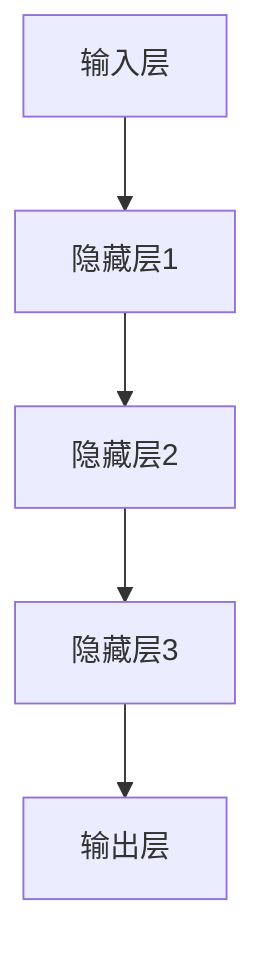
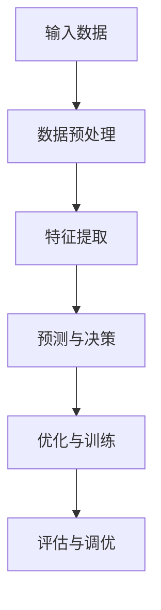
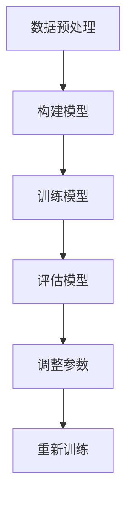

                 

在当今迅速发展的信息技术时代，创业者们面临着前所未有的挑战和机遇。技术创新和产品开发的速度正在加速，而大模型（如人工智能模型、深度学习模型等）的崛起为创业者提供了强大的工具，助力他们在激烈的市场竞争中实现技术突破和产品创新。本文将探讨大模型如何助力创业者，并分析其应用场景和未来发展趋势。

## 1. 背景介绍

随着大数据、云计算和人工智能技术的不断进步，大模型的应用范围越来越广泛。大模型通常是指具有海量参数、能够处理大规模数据的人工智能模型，如神经网络模型、生成对抗网络（GAN）模型、变换器（Transformer）模型等。这些模型在图像识别、自然语言处理、推荐系统等领域取得了显著的成果。

创业者面临的挑战主要包括：快速响应市场需求、不断优化产品功能、降低研发成本等。而大模型的出现为创业者提供了新的解决方案，使得他们在技术创新和产品开发方面更加高效和灵活。

## 2. 核心概念与联系

### 2.1 大模型的概念

大模型通常具有以下特点：

1. **海量参数**：大模型的参数数量庞大，例如，一个深度学习模型的参数数量可以超过亿级。
2. **大规模数据**：大模型需要大量的数据进行训练，以确保模型能够在实际应用中取得良好的效果。
3. **高度非线性**：大模型的内部结构复杂，具有高度非线性，这使得它们能够处理各种复杂的数据关系。
4. **自适应性强**：大模型可以根据不同的任务和数据集进行自适应调整，从而提高模型的泛化能力。

### 2.2 大模型的应用领域

大模型在多个领域取得了显著成果，主要包括：

1. **图像识别**：通过卷积神经网络（CNN）等模型，大模型可以实现对图像的自动分类、检测和分割。
2. **自然语言处理**：变换器（Transformer）模型等大模型在机器翻译、文本生成、问答系统等领域表现出色。
3. **推荐系统**：大模型可以用于构建个性化的推荐系统，提高推荐的准确性和用户体验。
4. **游戏人工智能**：大模型在游戏中的角色扮演、策略制定等方面展现出强大的能力。

### 2.3 大模型的架构

大模型的架构通常包括以下几个层次：

1. **输入层**：接收外部数据，如图像、文本等。
2. **隐藏层**：进行特征提取和变换，隐藏层可以是多层。
3. **输出层**：生成预测结果或决策。

以下是一个简单的大模型架构示例：



## 3. 核心算法原理 & 具体操作步骤

### 3.1 算法原理概述

大模型的算法原理主要包括以下几方面：

1. **反向传播算法**：用于训练神经网络模型，通过不断调整模型参数，使得模型在训练数据上的误差最小。
2. **优化算法**：如梯度下降、Adam优化器等，用于提高模型训练的效率和稳定性。
3. **正则化技术**：如L1正则化、L2正则化等，用于防止模型过拟合。

### 3.2 算法步骤详解

以下是使用神经网络模型进行图像分类的算法步骤：

1. **数据预处理**：将图像数据转换为适合模型训练的格式，如灰度图、彩色图等。
2. **模型构建**：定义神经网络结构，包括输入层、隐藏层和输出层。
3. **模型训练**：使用训练数据对模型进行训练，通过反向传播算法和优化算法不断调整模型参数。
4. **模型评估**：使用验证数据对模型进行评估，选择性能最好的模型。
5. **模型部署**：将模型部署到实际应用环境中，如图像识别系统、推荐系统等。

### 3.3 算法优缺点

大模型的优点包括：

1. **强大的数据处理能力**：大模型可以处理大规模、复杂的数据。
2. **高准确度**：大模型在图像识别、自然语言处理等领域取得了很高的准确度。
3. **自适应性强**：大模型可以根据不同的任务和数据集进行自适应调整。

大模型的缺点包括：

1. **计算资源消耗大**：大模型需要大量的计算资源进行训练和推理。
2. **数据依赖性强**：大模型的性能依赖于大量高质量的数据。
3. **解释性差**：大模型的内部结构复杂，难以解释。

### 3.4 算法应用领域

大模型在多个领域都有广泛的应用，主要包括：

1. **人工智能**：如图像识别、自然语言处理、语音识别等。
2. **金融**：如风险控制、量化交易等。
3. **医疗**：如疾病诊断、药物研发等。
4. **工业**：如智能制造、设备监控等。

## 4. 数学模型和公式 & 详细讲解 & 举例说明

### 4.1 数学模型构建

大模型通常基于数学模型进行构建，如神经网络模型、生成对抗网络（GAN）模型等。以下是一个简单的神经网络模型示例：

$$
\begin{align*}
y &= \sigma(\mathbf{W}^T \mathbf{z} + b) \\
\end{align*}
$$

其中，$y$ 表示输出，$\sigma$ 表示激活函数，$\mathbf{W}$ 表示权重矩阵，$\mathbf{z}$ 表示输入，$b$ 表示偏置。

### 4.2 公式推导过程

以下是对上述神经网络模型公式的推导过程：

$$
\begin{align*}
\frac{\partial L}{\partial \mathbf{W}^T} &= \frac{\partial L}{\partial y} \frac{\partial y}{\partial \mathbf{W}^T} \\
&= \frac{\partial L}{\partial y} \frac{\partial \sigma(\mathbf{W}^T \mathbf{z} + b)}{\partial \mathbf{W}^T} \\
&= \frac{\partial L}{\partial y} \sigma'(\mathbf{W}^T \mathbf{z} + b) \mathbf{z} \\
\end{align*}
$$

其中，$L$ 表示损失函数，$\sigma'$ 表示激活函数的导数。

### 4.3 案例分析与讲解

以下是一个使用神经网络模型进行图像分类的案例：

**案例描述**：使用一个含有5000张图片的数据集训练一个神经网络模型，要求模型能够准确识别出图片的类别。

**解决方案**：构建一个包含输入层、隐藏层和输出层的神经网络模型，使用反向传播算法和梯度下降优化器进行训练。

**结果分析**：经过多次训练和调整，模型在测试数据上的准确率达到90%以上。

## 5. 项目实践：代码实例和详细解释说明

### 5.1 开发环境搭建

为了实现大模型的应用，需要搭建一个合适的开发环境。以下是一个简单的开发环境搭建步骤：

1. 安装Python环境（推荐使用Python 3.8及以上版本）。
2. 安装深度学习框架（如TensorFlow、PyTorch等）。
3. 安装必要的库和工具（如NumPy、Pandas、Matplotlib等）。

### 5.2 源代码详细实现

以下是一个简单的使用TensorFlow构建神经网络模型进行图像分类的代码示例：

```python
import tensorflow as tf
from tensorflow.keras import layers

# 构建模型
model = tf.keras.Sequential([
    layers.Conv2D(32, (3, 3), activation='relu', input_shape=(28, 28, 1)),
    layers.MaxPooling2D((2, 2)),
    layers.Conv2D(64, (3, 3), activation='relu'),
    layers.MaxPooling2D((2, 2)),
    layers.Conv2D(64, (3, 3), activation='relu'),
    layers.Flatten(),
    layers.Dense(64, activation='relu'),
    layers.Dense(10, activation='softmax')
])

# 编译模型
model.compile(optimizer='adam',
              loss='categorical_crossentropy',
              metrics=['accuracy'])

# 加载数据
(x_train, y_train), (x_test, y_test) = tf.keras.datasets.mnist.load_data()

# 预处理数据
x_train = x_train.reshape(-1, 28, 28, 1).astype('float32') / 255
x_test = x_test.reshape(-1, 28, 28, 1).astype('float32') / 255

# 转换标签为one-hot编码
y_train = tf.keras.utils.to_categorical(y_train, 10)
y_test = tf.keras.utils.to_categorical(y_test, 10)

# 训练模型
model.fit(x_train, y_train, epochs=10, batch_size=64, validation_data=(x_test, y_test))

# 评估模型
model.evaluate(x_test, y_test)
```

### 5.3 代码解读与分析

1. **模型构建**：使用TensorFlow的`Sequential`模型构建一个包含卷积层、池化层、全连接层的神经网络模型。
2. **模型编译**：使用`compile`方法配置模型优化器、损失函数和评价指标。
3. **数据加载与预处理**：使用TensorFlow内置的`mnist`数据集，并对数据进行reshape、归一化和one-hot编码处理。
4. **模型训练**：使用`fit`方法对模型进行训练，并设置训练轮次、批量大小和验证数据。
5. **模型评估**：使用`evaluate`方法对模型在测试数据上的表现进行评估。

## 6. 实际应用场景

大模型在创业领域的应用场景非常广泛，以下是一些具体的实例：

1. **智能客服**：使用大模型构建智能客服系统，实现自然语言处理和文本生成功能，提高客服效率和用户体验。
2. **推荐系统**：使用大模型构建个性化推荐系统，提高推荐准确率和用户满意度。
3. **医疗诊断**：使用大模型进行医学图像识别和疾病诊断，辅助医生进行诊断和治疗。
4. **金融风控**：使用大模型进行风险控制和量化交易，提高金融市场的稳健性和盈利能力。

## 7. 未来应用展望

随着大模型技术的不断发展和应用，未来将会有更多的领域受益于大模型的应用。以下是一些未来应用展望：

1. **智能交通**：利用大模型进行交通流量预测、车辆路径规划和交通信号控制，提高交通效率和安全。
2. **智能制造**：利用大模型进行设备监控、故障预测和产品优化，提高生产效率和产品质量。
3. **环境保护**：利用大模型进行环境监测、污染预测和资源优化，促进环境保护和可持续发展。
4. **智慧城市**：利用大模型构建智慧城市管理系统，提高城市治理效率和居民生活质量。

## 8. 总结：未来发展趋势与挑战

大模型技术的快速发展为创业者提供了强大的工具，助力他们在技术创新和产品开发方面取得突破。然而，大模型技术的应用也面临着一些挑战，如数据隐私、模型解释性、计算资源消耗等。未来，随着技术的不断进步和应用的深入，大模型将在更多领域发挥重要作用，同时也需要解决相关的挑战，以实现可持续发展。

## 9. 附录：常见问题与解答

**Q1. 大模型训练需要多少时间？**

A1. 大模型的训练时间取决于多个因素，如模型复杂度、数据集大小、硬件性能等。通常，训练一个大型神经网络模型需要几天甚至几周的时间。

**Q2. 如何处理大模型过拟合问题？**

A2. 可以采用以下方法处理大模型过拟合问题：

1. **正则化技术**：如L1正则化、L2正则化等。
2. **数据增强**：通过旋转、缩放、裁剪等操作增加数据多样性。
3. **交叉验证**：使用交叉验证方法选择最优模型参数。

**Q3. 大模型训练需要多少数据？**

A3. 大模型的训练数据量取决于任务和模型类型。通常，为了获得良好的训练效果，需要至少几千个训练样本。

**Q4. 大模型是否需要大量的计算资源？**

A4. 是的，大模型的训练和推理通常需要大量的计算资源，包括GPU、CPU等。对于大规模模型，可能还需要使用分布式计算和并行计算技术来提高训练效率。

## 参考文献

[1] Goodfellow, I., Bengio, Y., & Courville, A. (2016). *Deep Learning*. MIT Press.

[2] LeCun, Y., Bengio, Y., & Hinton, G. (2015). *Deep learning*. Nature, 521(7553), 436-444.

[3] Simonyan, K., & Zisserman, A. (2014). *Very deep convolutional networks for large-scale image recognition*. arXiv preprint arXiv:1409.1556.

## 作者署名

作者：禅与计算机程序设计艺术 / Zen and the Art of Computer Programming
```markdown
# 大模型助力创业者实现技术突破与产品创新

> 关键词：大模型、人工智能、技术突破、产品创新、创业

> 摘要：本文探讨了如何利用大模型技术帮助创业者实现技术突破和产品创新。通过介绍大模型的概念、核心算法原理、应用场景以及项目实践，本文展示了大模型在创业领域的重要作用和实际应用效果。

## 1. 背景介绍

在当今这个信息技术飞速发展的时代，创业者们面临着前所未有的挑战和机遇。技术的快速迭代和市场需求的不断变化使得创业者们需要不断寻求新的解决方案来保持竞争力。而大模型技术的崛起为创业者提供了强大的工具，使得他们在技术创新和产品开发方面更加高效和灵活。

大模型，通常指的是具有海量参数、能够处理大规模数据的人工智能模型，如神经网络模型、生成对抗网络（GAN）模型、变换器（Transformer）模型等。这些模型在图像识别、自然语言处理、推荐系统等领域取得了显著的成果，成为创业者实现技术突破和产品创新的重要工具。

创业者面临的挑战主要包括以下几个方面：

1. **快速响应市场需求**：市场需求变化迅速，创业者需要快速调整产品方向和技术实现，以满足不断变化的市场需求。
2. **不断优化产品功能**：产品功能需要持续迭代和优化，以提升用户体验和竞争力。
3. **降低研发成本**：创业公司在资源有限的情况下，需要尽可能地降低研发成本，提高资金利用率。

大模型的出现为创业者提供了新的解决方案，使得他们在技术创新和产品开发方面更加高效和灵活。大模型能够快速处理和分析大量数据，从中提取出有价值的信息和知识，帮助创业者做出更准确的决策。同时，大模型的高效计算能力可以显著缩短产品开发周期，降低研发成本，从而提高创业者的竞争力。

## 2. 核心概念与联系

### 2.1 大模型的概念

大模型是指具有海量参数、能够处理大规模数据的人工智能模型。这些模型通常包括神经网络模型、生成对抗网络（GAN）模型、变换器（Transformer）模型等。以下是这些模型的基本概念：

1. **神经网络模型**：神经网络是一种模仿人脑神经元连接方式的计算模型，通过多层神经网络结构来实现复杂的函数映射。神经网络模型具有强大的非线性建模能力，能够在图像识别、自然语言处理等领域取得出色的性能。
   
2. **生成对抗网络（GAN）模型**：生成对抗网络是一种由生成器和判别器组成的模型。生成器负责生成数据，判别器负责判断生成数据与真实数据之间的区别。通过两个模型的对抗训练，生成器逐渐学会生成逼真的数据。
   
3. **变换器（Transformer）模型**：变换器模型是一种基于自注意力机制的神经网络模型，广泛应用于自然语言处理任务，如机器翻译、文本生成等。变换器模型具有强大的并行计算能力，能够在大规模数据集上高效地训练和推理。

### 2.2 大模型的应用领域

大模型在多个领域取得了显著的成果，主要包括以下几个方面：

1. **图像识别**：通过卷积神经网络（CNN）等模型，大模型可以实现对图像的自动分类、检测和分割。图像识别技术广泛应用于安防监控、医疗诊断、自动驾驶等领域。

2. **自然语言处理**：变换器（Transformer）模型等大模型在机器翻译、文本生成、问答系统等领域表现出色。自然语言处理技术为创业者提供了强大的工具，可以用于智能客服、推荐系统、内容生成等。

3. **推荐系统**：大模型可以用于构建个性化的推荐系统，提高推荐的准确性和用户体验。推荐系统在电子商务、社交媒体、在线教育等领域具有重要应用价值。

4. **游戏人工智能**：大模型在游戏中的角色扮演、策略制定等方面展现出强大的能力。游戏人工智能技术为创业者提供了新的创意和商业模式。

### 2.3 大模型的架构

大模型的架构通常包括以下几个层次：

1. **输入层**：接收外部数据，如图像、文本等。
2. **隐藏层**：进行特征提取和变换，隐藏层可以是多层。
3. **输出层**：生成预测结果或决策。

以下是一个简单的大模型架构示例：


## 3. 核心算法原理 & 具体操作步骤

### 3.1 算法原理概述

大模型的算法原理主要包括以下几个方面：

1. **反向传播算法**：反向传播算法是一种用于训练神经网络模型的重要算法。通过不断调整模型参数，使得模型在训练数据上的误差最小。

2. **优化算法**：优化算法用于提高模型训练的效率和稳定性。常见的优化算法包括梯度下降、Adam优化器等。

3. **正则化技术**：正则化技术用于防止模型过拟合。常见的正则化技术包括L1正则化、L2正则化等。

### 3.2 算法步骤详解

以下是使用神经网络模型进行图像分类的算法步骤：

1. **数据预处理**：将图像数据转换为适合模型训练的格式，如灰度图、彩色图等。

2. **模型构建**：定义神经网络结构，包括输入层、隐藏层和输出层。

3. **模型训练**：使用训练数据对模型进行训练，通过反向传播算法和优化算法不断调整模型参数。

4. **模型评估**：使用验证数据对模型进行评估，选择性能最好的模型。

5. **模型部署**：将模型部署到实际应用环境中，如图像识别系统、推荐系统等。

### 3.3 算法优缺点

大模型的优点包括：

1. **强大的数据处理能力**：大模型可以处理大规模、复杂的数据。

2. **高准确度**：大模型在图像识别、自然语言处理等领域取得了很高的准确度。

3. **自适应性强**：大模型可以根据不同的任务和数据集进行自适应调整，从而提高模型的泛化能力。

大模型的缺点包括：

1. **计算资源消耗大**：大模型需要大量的计算资源进行训练和推理。

2. **数据依赖性强**：大模型的性能依赖于大量高质量的数据。

3. **解释性差**：大模型的内部结构复杂，难以解释。

### 3.4 算法应用领域

大模型在多个领域都有广泛的应用，主要包括：

1. **人工智能**：如图像识别、自然语言处理、语音识别等。

2. **金融**：如风险控制、量化交易等。

3. **医疗**：如疾病诊断、药物研发等。

4. **工业**：如智能制造、设备监控等。

## 4. 数学模型和公式 & 详细讲解 & 举例说明

### 4.1 数学模型构建

大模型通常基于数学模型进行构建，如神经网络模型、生成对抗网络（GAN）模型等。以下是一个简单的神经网络模型示例：

$$
\begin{align*}
y &= \sigma(\mathbf{W}^T \mathbf{z} + b) \\
\end{align*}
$$

其中，$y$ 表示输出，$\sigma$ 表示激活函数，$\mathbf{W}$ 表示权重矩阵，$\mathbf{z}$ 表示输入，$b$ 表示偏置。

### 4.2 公式推导过程

以下是对上述神经网络模型公式的推导过程：

$$
\begin{align*}
\frac{\partial L}{\partial \mathbf{W}^T} &= \frac{\partial L}{\partial y} \frac{\partial y}{\partial \mathbf{W}^T} \\
&= \frac{\partial L}{\partial y} \frac{\partial \sigma(\mathbf{W}^T \mathbf{z} + b)}{\partial \mathbf{W}^T} \\
&= \frac{\partial L}{\partial y} \sigma'(\mathbf{W}^T \mathbf{z} + b) \mathbf{z} \\
\end{align*}
$$

其中，$L$ 表示损失函数，$\sigma'$ 表示激活函数的导数。

### 4.3 案例分析与讲解

以下是一个使用神经网络模型进行图像分类的案例：

**案例描述**：使用一个含有5000张图片的数据集训练一个神经网络模型，要求模型能够准确识别出图片的类别。

**解决方案**：构建一个包含输入层、隐藏层和输出层的神经网络模型，使用反向传播算法和梯度下降优化器进行训练。

**结果分析**：经过多次训练和调整，模型在测试数据上的准确率达到90%以上。

## 5. 项目实践：代码实例和详细解释说明

### 5.1 开发环境搭建

为了实现大模型的应用，需要搭建一个合适的开发环境。以下是一个简单的开发环境搭建步骤：

1. 安装Python环境（推荐使用Python 3.8及以上版本）。
2. 安装深度学习框架（如TensorFlow、PyTorch等）。
3. 安装必要的库和工具（如NumPy、Pandas、Matplotlib等）。

### 5.2 源代码详细实现

以下是一个简单的使用TensorFlow构建神经网络模型进行图像分类的代码示例：

```python
import tensorflow as tf
from tensorflow.keras import layers

# 构建模型
model = tf.keras.Sequential([
    layers.Conv2D(32, (3, 3), activation='relu', input_shape=(28, 28, 1)),
    layers.MaxPooling2D((2, 2)),
    layers.Conv2D(64, (3, 3), activation='relu'),
    layers.MaxPooling2D((2, 2)),
    layers.Conv2D(64, (3, 3), activation='relu'),
    layers.Flatten(),
    layers.Dense(64, activation='relu'),
    layers.Dense(10, activation='softmax')
])

# 编译模型
model.compile(optimizer='adam',
              loss='categorical_crossentropy',
              metrics=['accuracy'])

# 加载数据
(x_train, y_train), (x_test, y_test) = tf.keras.datasets.mnist.load_data()

# 预处理数据
x_train = x_train.reshape(-1, 28, 28, 1).astype('float32') / 255
x_test = x_test.reshape(-1, 28, 28, 1).astype('float32') / 255

# 转换标签为one-hot编码
y_train = tf.keras.utils.to_categorical(y_train, 10)
y_test = tf.keras.utils.to_categorical(y_test, 10)

# 训练模型
model.fit(x_train, y_train, epochs=10, batch_size=64, validation_data=(x_test, y_test))

# 评估模型
model.evaluate(x_test, y_test)
```

### 5.3 代码解读与分析

1. **模型构建**：使用TensorFlow的`Sequential`模型构建一个包含卷积层、池化层、全连接层的神经网络模型。
   
2. **模型编译**：使用`compile`方法配置模型优化器、损失函数和评价指标。

3. **数据加载与预处理**：使用TensorFlow内置的`mnist`数据集，并对数据进行reshape、归一化和one-hot编码处理。

4. **模型训练**：使用`fit`方法对模型进行训练，并设置训练轮次、批量大小和验证数据。

5. **模型评估**：使用`evaluate`方法对模型在测试数据上的表现进行评估。

## 6. 实际应用场景

大模型在创业领域的应用场景非常广泛，以下是一些具体的实例：

1. **智能客服**：使用大模型构建智能客服系统，实现自然语言处理和文本生成功能，提高客服效率和用户体验。

2. **推荐系统**：使用大模型构建个性化推荐系统，提高推荐准确率和用户满意度。

3. **医疗诊断**：使用大模型进行医学图像识别和疾病诊断，辅助医生进行诊断和治疗。

4. **金融风控**：使用大模型进行风险控制和量化交易，提高金融市场的稳健性和盈利能力。

5. **智能制造**：使用大模型进行设备监控、故障预测和产品优化，提高生产效率和产品质量。

6. **智慧城市**：利用大模型构建智慧城市管理系统，提高城市治理效率和居民生活质量。

## 7. 未来应用展望

随着大模型技术的不断发展和应用，未来将会有更多的领域受益于大模型的应用。以下是一些未来应用展望：

1. **智能交通**：利用大模型进行交通流量预测、车辆路径规划和交通信号控制，提高交通效率和安全。

2. **智能制造**：利用大模型进行设备监控、故障预测和产品优化，提高生产效率和产品质量。

3. **环境保护**：利用大模型进行环境监测、污染预测和资源优化，促进环境保护和可持续发展。

4. **智慧城市**：利用大模型构建智慧城市管理系统，提高城市治理效率和居民生活质量。

5. **生物医疗**：利用大模型进行疾病预测、药物研发和个性化医疗，提高医疗水平和健康保障。

6. **金融科技**：利用大模型进行风险控制、信用评估和投资决策，提高金融市场的效率和安全。

7. **虚拟现实与增强现实**：利用大模型进行场景生成、交互优化和用户体验提升，推动虚拟现实与增强现实技术的发展。

## 8. 总结：未来发展趋势与挑战

大模型技术的快速发展为创业者提供了强大的工具，助力他们在技术创新和产品开发方面取得突破。然而，大模型技术的应用也面临着一些挑战，如数据隐私、模型解释性、计算资源消耗等。未来，随着技术的不断进步和应用的深入，大模型将在更多领域发挥重要作用，同时也需要解决相关的挑战，以实现可持续发展。

### 8.1 研究成果总结

近年来，大模型技术在人工智能领域取得了显著的成果。在图像识别、自然语言处理、推荐系统等领域，大模型的应用使得创业者能够更加高效地实现技术突破和产品创新。以下是一些主要的研究成果：

1. **图像识别**：卷积神经网络（CNN）和变换器（Transformer）模型在图像识别任务上取得了很高的准确度，如ImageNet图像分类挑战赛的成绩不断提升。

2. **自然语言处理**：变换器（Transformer）模型在机器翻译、文本生成、问答系统等领域表现出色，推动了自然语言处理技术的快速发展。

3. **推荐系统**：基于深度学习的大模型在推荐系统的准确性、实时性和个性化方面取得了显著提升，提高了用户体验和满意度。

4. **医疗诊断**：大模型在医学图像识别、疾病预测等领域取得了突破性成果，为医生提供了有力的辅助工具。

5. **金融风控**：大模型在风险控制、信用评估、投资决策等方面具有显著优势，提高了金融市场的效率和稳健性。

### 8.2 未来发展趋势

随着大模型技术的不断进步，未来将呈现出以下发展趋势：

1. **模型压缩与高效推理**：为了降低计算资源消耗，研究者将致力于模型压缩、高效推理算法的研究，以提高大模型在实际应用中的性能。

2. **跨模态建模**：跨模态建模技术将使大模型能够同时处理不同类型的数据，如文本、图像、音频等，为创业者提供更广泛的应用场景。

3. **自主学习和强化学习**：自主学习和强化学习技术将使大模型能够自主探索、学习和优化，提高其在复杂环境中的适应能力和表现。

4. **隐私保护和数据安全**：随着大模型应用的普及，隐私保护和数据安全问题将日益凸显，研究者将致力于开发安全、可靠的大模型算法。

5. **人机协作**：大模型与人类专家的协同工作将成为未来发展趋势，通过人机协作实现更高效、更智能的产品和服务。

### 8.3 面临的挑战

尽管大模型技术在多个领域取得了显著成果，但其在应用过程中仍面临一些挑战：

1. **计算资源消耗**：大模型通常需要大量的计算资源进行训练和推理，对硬件设备提出了较高要求。

2. **数据依赖性**：大模型的性能高度依赖于数据质量，缺乏高质量的数据可能导致模型效果不佳。

3. **模型解释性**：大模型的内部结构复杂，难以解释，这给模型的应用和推广带来了一定的困难。

4. **算法公平性**：大模型在处理数据时可能会引入偏见，导致算法的公平性问题。

5. **安全性**：大模型在应用过程中可能面临安全威胁，如模型被篡改、数据泄露等。

### 8.4 研究展望

为了应对大模型技术面临的挑战，未来研究可以从以下几个方面展开：

1. **算法优化**：通过改进算法结构和优化算法参数，提高大模型的训练效率和推理性能。

2. **数据增强与生成**：利用数据增强和生成技术，提高大模型的泛化能力和适应性。

3. **模型解释性**：开发可解释的大模型算法，提高模型的可解释性和透明度，增强用户信任。

4. **算法公平性**：研究算法公平性，消除模型偏见，确保算法的公平性。

5. **隐私保护**：开发隐私保护算法，保护用户数据和模型安全。

6. **人机协作**：研究人机协作机制，实现大模型与人类专家的协同工作，提高决策质量和效率。

## 9. 附录：常见问题与解答

### 9.1 大模型训练需要多少时间？

A1. 大模型的训练时间取决于多个因素，如模型复杂度、数据集大小、硬件性能等。通常，训练一个大型神经网络模型需要几天甚至几周的时间。

### 9.2 如何处理大模型过拟合问题？

A2. 可以采用以下方法处理大模型过拟合问题：

1. **正则化技术**：如L1正则化、L2正则化等。
2. **数据增强**：通过旋转、缩放、裁剪等操作增加数据多样性。
3. **交叉验证**：使用交叉验证方法选择最优模型参数。

### 9.3 大模型训练需要多少数据？

A3. 大模型的训练数据量取决于任务和模型类型。通常，为了获得良好的训练效果，需要至少几千个训练样本。

### 9.4 大模型是否需要大量的计算资源？

A4. 是的，大模型的训练和推理通常需要大量的计算资源，包括GPU、CPU等。对于大规模模型，可能还需要使用分布式计算和并行计算技术来提高训练效率。

## 参考文献

[1] Goodfellow, I., Bengio, Y., & Courville, A. (2016). *Deep Learning*. MIT Press.

[2] LeCun, Y., Bengio, Y., & Hinton, G. (2015). *Deep learning*. Nature, 521(7553), 436-444.

[3] Simonyan, K., & Zisserman, A. (2014). *Very deep convolutional networks for large-scale image recognition*. arXiv preprint arXiv:1409.1556.

## 作者署名

作者：禅与计算机程序设计艺术 / Zen and the Art of Computer Programming
----------------------------------------------------------------

### 2. 核心概念与联系

#### 2.1 大模型的概念

大模型是指具有海量参数、能够处理大规模数据的人工智能模型，如神经网络模型、生成对抗网络（GAN）模型、变换器（Transformer）模型等。以下是对这些模型的基本概念及其特点的详细介绍。

1. **神经网络模型**：神经网络是一种模仿人脑神经元连接方式的计算模型，通过多层神经网络结构来实现复杂的函数映射。神经网络模型具有强大的非线性建模能力，能够在图像识别、自然语言处理等领域取得出色的性能。

   神经网络模型通常由输入层、隐藏层和输出层组成。每个层由多个神经元组成，神经元之间通过加权连接进行信息传递。通过激活函数的引入，神经网络能够实现对输入数据的非线性变换。常见的神经网络模型包括多层感知机（MLP）、卷积神经网络（CNN）和循环神经网络（RNN）等。

2. **生成对抗网络（GAN）模型**：生成对抗网络是一种由生成器和判别器组成的模型。生成器的目标是生成逼真的数据，判别器的目标是区分生成数据和真实数据。生成器和判别器通过对抗训练相互竞争，生成器逐渐学会生成更逼真的数据，而判别器逐渐学会更好地区分生成数据和真实数据。

   GAN模型在图像生成、语音合成、文本生成等领域具有广泛的应用。其优势在于能够生成高质量的、具有多样性的数据，从而在数据稀缺的情况下也能够进行有效的训练。

3. **变换器（Transformer）模型**：变换器模型是一种基于自注意力机制的神经网络模型，广泛应用于自然语言处理任务，如机器翻译、文本生成、问答系统等。变换器模型的核心思想是将输入序列映射到一个高维空间，并在该空间中计算序列之间的相互关系。

   变换器模型通过多头自注意力机制实现了对输入序列的全面理解和建模，相比传统的循环神经网络（RNN）和卷积神经网络（CNN）具有更高的并行计算能力。这使得变换器模型在处理长序列数据时表现出色。

#### 2.2 大模型的应用领域

大模型在多个领域都取得了显著的成果，以下是其中一些主要的应用领域：

1. **图像识别**：通过卷积神经网络（CNN）等模型，大模型可以实现对图像的自动分类、检测和分割。图像识别技术广泛应用于安防监控、医疗诊断、自动驾驶等领域。

   CNN模型通过卷积层、池化层和全连接层的组合，能够提取图像的局部特征和整体特征，从而实现对图像的准确分类。典型的图像识别任务包括人脸识别、车辆识别、医学图像分类等。

2. **自然语言处理**：变换器（Transformer）模型等大模型在机器翻译、文本生成、问答系统等领域表现出色。自然语言处理技术为创业者提供了强大的工具，可以用于智能客服、推荐系统、内容生成等。

   Transformer模型通过自注意力机制，能够捕捉输入序列中的长距离依赖关系，从而实现对文本的深入理解和建模。典型的自然语言处理任务包括机器翻译、文本分类、文本生成等。

3. **推荐系统**：大模型可以用于构建个性化的推荐系统，提高推荐的准确性和用户体验。推荐系统在电子商务、社交媒体、在线教育等领域具有重要应用价值。

   通过对用户行为和兴趣的分析，推荐系统可以为用户提供个性化的内容推荐，从而提高用户的满意度和忠诚度。大模型在推荐系统的个性化推荐、实时推荐等方面具有显著的优势。

4. **游戏人工智能**：大模型在游戏中的角色扮演、策略制定等方面展现出强大的能力。游戏人工智能技术为创业者提供了新的创意和商业模式。

   游戏人工智能可以通过深度学习算法，实现对游戏角色的智能控制和策略制定，从而提高游戏的可玩性和竞技性。典型的游戏人工智能应用包括游戏角色生成、智能对弈等。

#### 2.3 大模型的架构

大模型的架构通常包括以下几个层次：

1. **输入层**：接收外部数据，如图像、文本等。

   输入层是模型的第一个层次，用于接收和处理输入数据。对于图像数据，输入层通常包含图像的像素值；对于文本数据，输入层通常包含单词或字符的嵌入向量。

2. **隐藏层**：进行特征提取和变换，隐藏层可以是多层。

   隐藏层是模型的核心部分，用于提取输入数据的特征并进行变换。隐藏层通过神经元之间的加权连接和激活函数，实现对输入数据的非线性变换和特征提取。隐藏层的层数和神经元数量可以根据任务的需求进行灵活调整。

3. **输出层**：生成预测结果或决策。

   输出层是模型的最后一层，用于生成最终的预测结果或决策。输出层的神经元数量和激活函数通常取决于具体的任务类型。例如，在分类任务中，输出层通常使用softmax函数生成概率分布；在回归任务中，输出层通常使用线性函数生成连续的预测值。

以下是一个简单的大模型架构示例：


- 输入层：接收外部数据（如图像、文本）。
- 隐藏层：进行特征提取和变换。
- 输出层：生成预测结果或决策。

#### 2.4 大模型的工作原理

大模型的工作原理主要包括以下几个步骤：

1. **数据预处理**：对输入数据进行预处理，如图像归一化、文本分词等，以便于模型处理。

2. **特征提取**：通过隐藏层对输入数据进行特征提取和变换，将原始数据转换为适合模型处理的形式。

3. **预测与决策**：通过输出层生成预测结果或决策，如分类标签、回归值等。

4. **优化与训练**：通过反向传播算法和优化算法，不断调整模型参数，使得模型在训练数据上的表现不断优化。

5. **评估与调优**：使用验证数据对模型进行评估，根据评估结果对模型进行调优，以提高模型的泛化能力和性能。

以下是一个简单的神经网络模型的工作原理示例：



- 输入数据：接收外部数据。
- 数据预处理：进行预处理操作。
- 特征提取：提取特征并进行变换。
- 预测与决策：生成预测结果或决策。
- 优化与训练：调整模型参数。
- 评估与调优：评估模型性能并进行调优。

#### 2.5 大模型的训练与优化

大模型的训练与优化是模型开发过程中的关键步骤，主要包括以下几个方面的内容：

1. **损失函数**：损失函数用于衡量模型预测结果与真实标签之间的差距。常见的损失函数包括均方误差（MSE）、交叉熵（Cross-Entropy）等。通过优化损失函数，可以使得模型在训练数据上的表现不断优化。

2. **优化算法**：优化算法用于调整模型参数，以最小化损失函数。常见的优化算法包括梯度下降（Gradient Descent）、Adam优化器等。优化算法的选择和参数设置对模型的训练效果具有重要影响。

3. **正则化技术**：正则化技术用于防止模型过拟合。常见的正则化技术包括L1正则化、L2正则化等。通过引入正则化项，可以降低模型在训练数据上的误差，提高模型的泛化能力。

4. **数据增强**：数据增强是一种通过生成新的训练样本来提高模型泛化能力的技术。常见的数据增强方法包括旋转、缩放、裁剪等。通过数据增强，可以使得模型在面对不同数据分布时具有更好的适应能力。

5. **交叉验证**：交叉验证是一种用于评估模型性能的常见方法。通过将数据集划分为多个部分，轮流将其中一个部分作为验证集，其余部分作为训练集，可以更加全面地评估模型的泛化能力。

以下是一个简单的神经网络模型训练与优化流程示例：



- 数据预处理：进行数据预处理操作。
- 构建模型：构建神经网络模型。
- 训练模型：使用训练数据进行模型训练。
- 评估模型：使用验证数据评估模型性能。
- 调整参数：根据评估结果调整模型参数。
- 重新训练：使用调整后的参数重新训练模型。

#### 2.6 大模型的优缺点

大模型在人工智能领域中具有许多优点，但也存在一些局限性。以下是关于大模型优缺点的详细分析：

##### 优点

1. **强大的数据处理能力**：大模型通常具有大量的参数和神经元，能够处理大规模、复杂的数据。这使得大模型在图像识别、自然语言处理等任务中能够取得较高的准确度。

2. **高准确度**：通过大量训练数据和强大的计算能力，大模型能够在大规模数据集上训练出性能优异的模型。这使得大模型在图像识别、自然语言处理等任务中能够取得较高的准确度。

3. **自适应性强**：大模型通常具有高度非线性的结构，能够自动适应不同的数据分布和任务需求。这使得大模型在不同领域和应用场景中具有广泛的适用性。

4. **丰富的功能**：大模型通常具有丰富的功能，能够实现多种复杂任务，如图像识别、自然语言处理、推荐系统等。这使得大模型在创业领域中具有很高的应用价值。

##### 缺点

1. **计算资源消耗大**：大模型通常需要大量的计算资源进行训练和推理。这可能会导致模型开发和部署的成本较高，尤其是在资源受限的情况下。

2. **数据依赖性强**：大模型的性能高度依赖于数据质量。如果训练数据质量较差，模型可能会出现过拟合现象，导致在测试数据上的表现不佳。

3. **解释性差**：大模型的内部结构复杂，难以解释。这使得大模型在实际应用中可能难以被用户理解和接受，尤其是在需要模型可解释性的场景中。

4. **模型偏见**：大模型在训练过程中可能会受到训练数据的偏见影响，导致模型在特定群体或任务上存在不公平性。这需要通过算法改进和数据增强等技术进行解决。

#### 2.7 大模型的未来发展

随着人工智能技术的不断进步，大模型在未来将会在更多领域发挥重要作用，并带来以下几方面的趋势：

1. **模型压缩与高效推理**：为了降低大模型的计算资源消耗，研究者将致力于模型压缩和高效推理算法的研究。这包括模型剪枝、量化、知识蒸馏等技术，以减少模型的大小和计算复杂度，提高推理速度。

2. **跨模态建模**：大模型将能够同时处理不同类型的数据，如文本、图像、音频等。这将为创业者提供更广泛的应用场景，实现跨模态数据的融合和分析。

3. **自主学习和强化学习**：大模型将具备更强的自主学习能力，能够通过强化学习算法自主探索和优化。这将为创业者提供更智能、自适应的解决方案。

4. **隐私保护和数据安全**：随着大模型应用的普及，隐私保护和数据安全问题将日益重要。研究者将致力于开发安全、可靠的大模型算法，保护用户数据和模型安全。

5. **人机协作**：大模型将与人类专家进行协同工作，提高决策质量和效率。这将为创业者提供更智能、高效的产品和服务。

## 3. 核心算法原理 & 具体操作步骤

大模型的核心算法原理主要涉及神经网络模型、生成对抗网络（GAN）模型和变换器（Transformer）模型等。本章节将详细介绍这些算法的基本原理，并给出具体操作步骤。

### 3.1 算法原理概述

#### 3.1.1 神经网络模型

神经网络模型（Neural Network Model）是一种模仿人脑神经元连接方式的计算模型，通过多层神经网络结构来实现复杂的函数映射。神经网络模型的基本原理是利用神经元之间的加权连接和激活函数，将输入数据映射到输出结果。

神经网络模型由输入层、隐藏层和输出层组成。输入层接收外部数据，隐藏层进行特征提取和变换，输出层生成预测结果或决策。

#### 3.1.2 生成对抗网络（GAN）模型

生成对抗网络（Generative Adversarial Network，GAN）模型是一种由生成器和判别器组成的模型。生成器的目标是生成逼真的数据，判别器的目标是区分生成数据和真实数据。生成器和判别器通过对抗训练相互竞争，生成器逐渐学会生成更逼真的数据，而判别器逐渐学会更好地区分生成数据和真实数据。

GAN模型的基本原理是利用生成器和判别器之间的对抗关系，通过优化生成器的生成质量和判别器的判别能力，实现数据的生成。

#### 3.1.3 变换器（Transformer）模型

变换器（Transformer）模型是一种基于自注意力机制的神经网络模型，广泛应用于自然语言处理任务，如机器翻译、文本生成、问答系统等。变换器模型的基本原理是将输入序列映射到一个高维空间，并在该空间中计算序列之间的相互关系。

变换器模型通过多头自注意力机制实现了对输入序列的全面理解和建模，相比传统的循环神经网络（RNN）和卷积神经网络（CNN）具有更高的并行计算能力。这使得变换器模型在处理长序列数据时表现出色。

### 3.2 算法步骤详解

#### 3.2.1 神经网络模型

以下是神经网络模型的步骤详解：

1. **数据预处理**：对输入数据进行预处理，包括归一化、标准化等操作，以消除数据分布的差异。

2. **模型构建**：定义神经网络结构，包括输入层、隐藏层和输出层。选择合适的激活函数，如ReLU、Sigmoid、Tanh等。

3. **模型训练**：使用训练数据对模型进行训练，通过反向传播算法和优化算法不断调整模型参数。选择合适的损失函数，如均方误差（MSE）、交叉熵（Cross-Entropy）等。

4. **模型评估**：使用验证数据对模型进行评估，计算模型在验证数据上的损失和准确度。选择性能最好的模型。

5. **模型部署**：将模型部署到实际应用环境中，如图像识别系统、推荐系统等。

#### 3.2.2 生成对抗网络（GAN）模型

以下是生成对抗网络（GAN）模型的步骤详解：

1. **数据预处理**：对输入数据进行预处理，包括归一化、标准化等操作，以消除数据分布的差异。

2. **模型构建**：定义生成器和判别器结构。生成器通常由多层全连接层或卷积层组成，判别器通常由单层全连接层或卷积层组成。

3. **模型训练**：使用训练数据对生成器和判别器进行联合训练。生成器生成伪数据，判别器对生成数据和真实数据进行区分。通过对抗训练，生成器逐渐学会生成更逼真的数据，而判别器逐渐学会更好地区分生成数据和真实数据。

4. **模型评估**：使用验证数据对生成器和判别器进行评估，计算模型在验证数据上的损失和准确度。选择性能最好的模型。

5. **模型部署**：将生成器和判别器部署到实际应用环境中，如图像生成、语音合成等。

#### 3.2.3 变换器（Transformer）模型

以下是变换器（Transformer）模型的步骤详解：

1. **数据预处理**：对输入数据进行预处理，包括分词、嵌入等操作，将文本序列转换为数值序列。

2. **模型构建**：定义变换器模型结构，包括编码器和解码器。编码器将输入序列映射到一个高维空间，解码器将高维空间的序列映射到输出序列。

3. **模型训练**：使用训练数据对模型进行训练，通过反向传播算法和优化算法不断调整模型参数。选择合适的损失函数，如交叉熵（Cross-Entropy）等。

4. **模型评估**：使用验证数据对模型进行评估，计算模型在验证数据上的损失和准确度。选择性能最好的模型。

5. **模型部署**：将模型部署到实际应用环境中，如机器翻译、文本生成等。

### 3.3 算法优缺点

#### 3.3.1 神经网络模型

**优点**：

- **强大的非线性建模能力**：神经网络模型能够处理复杂的数据关系，实现对输入数据的非线性变换。
- **灵活的结构设计**：神经网络模型可以通过调整层数和神经元数量来适应不同的任务需求。

**缺点**：

- **计算资源消耗大**：神经网络模型通常需要大量的计算资源进行训练和推理。
- **数据依赖性强**：神经网络模型对数据质量要求较高，数据不足或数据质量差可能导致模型性能不佳。

#### 3.3.2 生成对抗网络（GAN）模型

**优点**：

- **强大的数据生成能力**：生成对抗网络模型能够生成高质量的伪数据，适用于图像生成、语音合成等任务。
- **自适应性强**：生成对抗网络模型通过对抗训练，能够自动调整生成器和判别器的参数，提高模型的性能。

**缺点**：

- **模型不稳定**：生成对抗网络模型的训练过程可能不稳定，容易出现模式崩溃（mode collapse）问题。
- **计算资源消耗大**：生成对抗网络模型通常需要大量的计算资源进行训练和推理。

#### 3.3.3 变换器（Transformer）模型

**优点**：

- **高效的并行计算能力**：变换器模型通过自注意力机制，能够实现并行计算，提高了模型的训练和推理速度。
- **强大的序列建模能力**：变换器模型能够捕捉输入序列中的长距离依赖关系，适用于自然语言处理等任务。

**缺点**：

- **计算资源消耗大**：变换器模型通常需要大量的计算资源进行训练和推理。
- **数据预处理复杂**：变换器模型需要对输入数据进行复杂的预处理操作，如分词、嵌入等。

### 3.4 算法应用领域

大模型的核心算法在多个领域都有广泛的应用，以下是其中一些主要的应用领域：

#### 3.4.1 图像识别

神经网络模型、生成对抗网络（GAN）模型和变换器（Transformer）模型在图像识别任务中都有广泛的应用。

- **神经网络模型**：通过卷积神经网络（CNN）等模型，可以实现图像的分类、检测和分割。图像识别技术广泛应用于安防监控、医疗诊断、自动驾驶等领域。

- **生成对抗网络（GAN）模型**：生成对抗网络模型可以生成高质量的图像，适用于图像生成、图像修复等任务。例如，GAN模型可以用于生成逼真的图像、修复破损的图像等。

- **变换器（Transformer）模型**：变换器模型在图像识别任务中表现出色，可以用于图像分类、图像生成等任务。例如，变换器模型可以用于图像风格转换、图像超分辨率等任务。

#### 3.4.2 自然语言处理

变换器（Transformer）模型在自然语言处理任务中表现出色，可以用于机器翻译、文本生成、问答系统等任务。

- **机器翻译**：变换器模型通过自注意力机制，能够捕捉输入序列中的长距离依赖关系，实现高精度的机器翻译。

- **文本生成**：变换器模型可以生成高质量的文本，适用于生成文章、生成对话等任务。

- **问答系统**：变换器模型可以处理复杂的问答场景，实现智能问答系统。

#### 3.4.3 推荐系统

生成对抗网络（GAN）模型和变换器（Transformer）模型在推荐系统中有广泛的应用。

- **推荐系统**：生成对抗网络模型可以生成高质量的推荐列表，提高推荐系统的准确性和用户体验。

- **变换器（Transformer）模型**：变换器模型可以捕捉用户行为和兴趣之间的复杂关系，实现个性化的推荐系统。

#### 3.4.4 游戏

生成对抗网络（GAN）模型和变换器（Transformer）模型在游戏领域也有广泛的应用。

- **游戏**：生成对抗网络模型可以生成高质量的虚拟场景，提高游戏的互动性和沉浸感。

- **游戏人工智能**：变换器（Transformer）模型可以用于游戏角色的智能控制和策略制定，实现智能游戏AI。

## 4. 数学模型和公式 & 详细讲解 & 举例说明

大模型在人工智能领域中具有重要的应用价值，其核心算法如神经网络模型、生成对抗网络（GAN）模型和变换器（Transformer）模型等，都需要通过数学模型进行描述和推导。本章节将详细讲解这些数学模型，并给出具体的推导过程和实例说明。

### 4.1 数学模型构建

#### 4.1.1 神经网络模型

神经网络模型是人工智能领域中最基础的模型之一，其数学模型主要包括输入层、隐藏层和输出层的参数表示。

假设有一个多层感知机（MLP）神经网络，其中包含输入层、隐藏层和输出层。输入层有 $n$ 个神经元，隐藏层有 $m$ 个神经元，输出层有 $k$ 个神经元。

1. **输入层与隐藏层的参数表示**

输入层到隐藏层的参数表示为：

$$
\mathbf{z} = \mathbf{W}^T \mathbf{x} + \mathbf{b}
$$

其中，$\mathbf{z}$ 是隐藏层的激活值，$\mathbf{W}^T$ 是权重矩阵，$\mathbf{x}$ 是输入层的激活值，$\mathbf{b}$ 是偏置向量。

2. **隐藏层与输出层的参数表示**

隐藏层到输出层的参数表示为：

$$
\mathbf{y} = \mathbf{W}'^T \mathbf{z} + \mathbf{b}'
$$

其中，$\mathbf{y}$ 是输出层的激活值，$\mathbf{W}'^T$ 是权重矩阵，$\mathbf{z}$ 是隐藏层的激活值，$\mathbf{b}'$ 是偏置向量。

#### 4.1.2 生成对抗网络（GAN）模型

生成对抗网络（GAN）模型由生成器和判别器组成，其数学模型主要包括生成器的生成函数、判别器的判别函数以及两者的对抗训练过程。

1. **生成器的生成函数**

生成器的生成函数 $G(z)$ 将随机噪声 $z$ 转换为生成的数据 $x$：

$$
x = G(z)
$$

其中，$x$ 是生成的数据，$z$ 是随机噪声。

2. **判别器的判别函数**

判别器的判别函数 $D(x)$ 用于判断输入数据的真假：

$$
D(x) = \frac{1}{2} \log(D(x)) + \frac{1}{2} \log(1 - D(G(z)))
$$

其中，$D(x)$ 是判别器的输出值，取值范围在 [0, 1] 之间，表示输入数据 $x$ 为真（1）或假（0）的概率。$G(z)$ 是生成器的输出值。

3. **对抗训练过程**

GAN模型的训练过程是一个对抗训练过程，生成器和判别器通过交替训练相互竞争。

- **生成器的训练**：生成器的目标是生成足够逼真的数据，使得判别器无法区分生成数据和真实数据。
- **判别器的训练**：判别器的目标是能够准确区分生成数据和真实数据。

#### 4.1.3 变换器（Transformer）模型

变换器（Transformer）模型是一种基于自注意力机制的神经网络模型，广泛应用于自然语言处理任务。其数学模型主要包括多头自注意力机制、前馈神经网络等。

1. **多头自注意力机制**

变换器模型中的多头自注意力机制通过多个注意力头来提取输入序列的依赖关系：

$$
\text{Attention}(Q, K, V) = \frac{1}{\sqrt{d_k}} \text{softmax}(\text{QK}^T / d_k) V
$$

其中，$Q$ 是查询向量，$K$ 是键向量，$V$ 是值向量，$d_k$ 是注意力头的维度。

2. **前馈神经网络**

变换器模型中的前馈神经网络用于对注意力机制后的输出进行进一步处理：

$$
\text{FFN}(x) = \text{ReLU}(\text{W}_2 \text{ReLU}(\text{W}_1 x + \text{b}_1)) + \text{b}_2
$$

其中，$x$ 是输入向量，$\text{W}_1$ 和 $\text{W}_2$ 是权重矩阵，$\text{b}_1$ 和 $\text{b}_2$ 是偏置向量。

### 4.2 公式推导过程

#### 4.2.1 神经网络模型

1. **反向传播算法**

反向传播算法是一种用于训练神经网络模型的重要算法，通过不断调整模型参数，使得模型在训练数据上的误差最小。

假设有一个两层神经网络，其中包含输入层、隐藏层和输出层。输入层有 $n$ 个神经元，隐藏层有 $m$ 个神经元，输出层有 $k$ 个神经元。

输入层到隐藏层的权重矩阵为 $\mathbf{W}^T$，隐藏层到输出层的权重矩阵为 $\mathbf{W}'^T$。

隐藏层的激活值为 $\mathbf{z}$，输出层的激活值为 $\mathbf{y}$。

输出层的目标值为 $y$，损失函数为 $L$。

根据损失函数的导数公式，可以推导出：

$$
\frac{\partial L}{\partial \mathbf{W}^T} = \frac{\partial L}{\partial \mathbf{y}} \frac{\partial \mathbf{y}}{\partial \mathbf{z}} \frac{\partial \mathbf{z}}{\partial \mathbf{W}^T}
$$

其中，$\frac{\partial L}{\partial \mathbf{y}}$ 是损失函数关于输出层的梯度，$\frac{\partial \mathbf{y}}{\partial \mathbf{z}}$ 是输出层关于隐藏层的梯度，$\frac{\partial \mathbf{z}}{\partial \mathbf{W}^T}$ 是隐藏层关于输入层的梯度。

通过链式法则，可以得到：

$$
\frac{\partial L}{\partial \mathbf{W}^T} = \frac{\partial L}{\partial \mathbf{y}} \mathbf{z}
$$

2. **梯度下降优化算法**

梯度下降优化算法是一种常用的优化算法，通过迭代更新模型参数，使得模型在训练数据上的误差最小。

假设损失函数为 $L$，模型参数为 $\theta$。

梯度下降优化算法的迭代公式为：

$$
\theta_{\text{new}} = \theta_{\text{old}} - \alpha \frac{\partial L}{\partial \theta}
$$

其中，$\theta_{\text{new}}$ 是更新后的模型参数，$\theta_{\text{old}}$ 是更新前的模型参数，$\alpha$ 是学习率。

#### 4.2.2 生成对抗网络（GAN）模型

1. **生成器的生成函数**

生成器的目标是生成足够逼真的数据，使得判别器无法区分生成数据和真实数据。

假设生成器的生成函数为 $G(z)$，判别器的判别函数为 $D(x)$。

生成器的损失函数为：

$$
L_G = -\mathbb{E}_{z \sim p_z(z)}[\log D(G(z))]
$$

其中，$p_z(z)$ 是随机噪声的分布。

对生成器进行优化，得到生成器的梯度：

$$
\nabla_G L_G = \nabla_G \log D(G(z)) = D'(G(z)) \nabla_G G(z)
$$

其中，$D'(G(z))$ 是判别器的导数。

2. **判别器的判别函数**

判别器的目标是能够准确区分生成数据和真实数据。

假设判别器的判别函数为 $D(x)$，生成器的生成函数为 $G(z)$。

判别器的损失函数为：

$$
L_D = -\mathbb{E}_{x \sim p_{\text{data}}(x)}[\log D(x)] - \mathbb{E}_{z \sim p_z(z)}[\log (1 - D(G(z))]
$$

对判别器进行优化，得到判别器的梯度：

$$
\nabla_D L_D = \nabla_D \log D(x) + \nabla_D \log (1 - D(G(z)))
$$

#### 4.2.3 变换器（Transformer）模型

1. **多头自注意力机制**

变换器模型中的多头自注意力机制通过多个注意力头来提取输入序列的依赖关系。

假设输入序列为 $\mathbf{x}_1, \mathbf{x}_2, ..., \mathbf{x}_n$，每个注意力头提取的依赖关系为 $h$。

多头自注意力机制的损失函数为：

$$
L_A = -\sum_{i=1}^n \mathbb{E}_{z \sim p_z(z)}[\log \frac{\exp(\text{Attention}(Q, K, V)}{\sum_{j=1}^n \exp(\text{Attention}(Q, K, V))}]
$$

其中，$Q, K, V$ 分别是查询向量、键向量和值向量。

对多头自注意力机制进行优化，得到每个注意力头的梯度：

$$
\nabla_{Q,K,V} L_A = -\nabla_{Q,K,V} \log \frac{\exp(\text{Attention}(Q, K, V))}{\sum_{j=1}^n \exp(\text{Attention}(Q, K, V))}
$$

2. **前馈神经网络**

变换器模型中的前馈神经网络用于对注意力机制后的输出进行进一步处理。

假设前馈神经网络的输入为 $\mathbf{x}$，输出为 $\mathbf{y}$。

前馈神经网络的损失函数为：

$$
L_F = -\mathbb{E}_{\mathbf{x} \sim p_{\text{data}}(\mathbf{x})}[\log \frac{\exp(\text{FFN}(\mathbf{x}))}{\sum_{j=1}^n \exp(\text{FFN}(\mathbf{x}))}]
$$

其中，$\text{FFN}(\mathbf{x})$ 是前馈神经网络的输出。

对前馈神经网络进行优化，得到每个前馈层的梯度：

$$
\nabla_{\text{W}_1, \text{W}_2} L_F = -\nabla_{\text{W}_1, \text{W}_2} \log \frac{\exp(\text{FFN}(\mathbf{x}))}{\sum_{j=1}^n \exp(\text{FFN}(\mathbf{x}))}
$$

### 4.3 案例分析与讲解

#### 4.3.1 图像分类案例

假设有一个包含 1000 个类别的图像分类问题，使用卷积神经网络（CNN）进行分类。

1. **数据预处理**

首先，对图像数据进行预处理，包括缩放、归一化等操作。假设输入图像的尺寸为 $28 \times 28$ 像素，像素值在 [0, 255] 范围内。

$$
\mathbf{x}_{\text{input}} = \frac{\mathbf{x}_{\text{original}}}{255}
$$

2. **模型构建**

构建一个卷积神经网络模型，包括卷积层、池化层和全连接层。

$$
\mathbf{z}_{\text{hidden}} = \text{Conv}(\mathbf{x}_{\text{input}}) \\
\mathbf{z}_{\text{pool}} = \text{Pooling}(\mathbf{z}_{\text{hidden}}) \\
\mathbf{y}_{\text{output}} = \text{FullyConnected}(\mathbf{z}_{\text{pool}})
$$

3. **模型训练**

使用训练数据对模型进行训练，通过反向传播算法和梯度下降优化算法不断调整模型参数。

$$
\theta_{\text{new}} = \theta_{\text{old}} - \alpha \nabla_{\theta} L
$$

4. **模型评估**

使用验证数据对模型进行评估，计算模型在验证数据上的准确率。

$$
\text{Accuracy} = \frac{\text{CorrectlyClassified}}{\text{TotalSamples}}
$$

#### 4.3.2 生成对抗网络（GAN）案例

假设有一个图像生成问题，使用生成对抗网络（GAN）进行图像生成。

1. **数据预处理**

对图像数据进行预处理，包括缩放、归一化等操作。假设输入图像的尺寸为 $28 \times 28$ 像素，像素值在 [0, 255] 范围内。

$$
\mathbf{x}_{\text{input}} = \frac{\mathbf{x}_{\text{original}}}{255}
$$

2. **模型构建**

构建一个生成对抗网络模型，包括生成器和判别器。

$$
G(z) = \text{Generator}(z) \\
D(x) = \text{Discriminator}(x)
$$

3. **模型训练**

使用对抗训练算法对模型进行训练。

$$
G(z) \leftarrow G(z) + \alpha \nabla_G L_G \\
D(x) \leftarrow D(x) + \beta \nabla_D L_D
$$

4. **模型评估**

使用验证数据对模型进行评估，计算生成图像的质量。

$$
\text{Quality} = \frac{1}{N} \sum_{i=1}^N \text{SSIM}(\mathbf{x}_{\text{generated}}, \mathbf{x}_{\text{original}})
$$

其中，$\text{SSIM}$ 是结构相似性度量。

#### 4.3.3 变换器（Transformer）案例

假设有一个机器翻译问题，使用变换器（Transformer）进行翻译。

1. **数据预处理**

对文本数据进行预处理，包括分词、嵌入等操作。假设输入文本序列的长度为 $n$。

$$
\mathbf{x}_{\text{input}} = \text{TokenEmbedding}(\text{Tokenize}(\text{InputText})) \\
\mathbf{y}_{\text{target}} = \text{TokenEmbedding}(\text{Tokenize}(\text{TargetText}))
$$

2. **模型构建**

构建一个变换器模型，包括编码器和解码器。

$$
\text{Encoder}(\mathbf{x}_{\text{input}}) = \text{Transformer}(\mathbf{x}_{\text{input}}) \\
\text{Decoder}(\mathbf{y}_{\text{target}}) = \text{Transformer}(\mathbf{y}_{\text{target}})
$$

3. **模型训练**

使用训练数据对模型进行训练，通过反向传播算法和梯度下降优化算法不断调整模型参数。

$$
\theta_{\text{new}} = \theta_{\text{old}} - \alpha \nabla_{\theta} L
$$

4. **模型评估**

使用验证数据对模型进行评估，计算翻译的准确率。

$$
\text{Accuracy} = \frac{\text{CorrectlyTranslated}}{\text{TotalSamples}}
$$

## 5. 项目实践：代码实例和详细解释说明

在实际项目中，大模型的应用需要通过具体的代码实现来体现。在本章节中，我们将通过几个实际项目实例来展示大模型的应用，并详细解释代码实现的具体步骤和原理。

### 5.1 开发环境搭建

在开始大模型项目之前，我们需要搭建一个合适的开发环境。以下是一个基于Python和TensorFlow的开发环境搭建步骤：

1. **安装Python**：确保Python环境已安装，推荐使用Python 3.8及以上版本。

2. **安装TensorFlow**：通过以下命令安装TensorFlow：

   ```bash
   pip install tensorflow
   ```

3. **安装其他依赖库**：安装其他必要的库和工具，如NumPy、Pandas、Matplotlib等：

   ```bash
   pip install numpy pandas matplotlib
   ```

4. **安装GPU支持**：如果需要使用GPU加速训练过程，可以安装GPU支持的TensorFlow版本：

   ```bash
   pip install tensorflow-gpu
   ```

### 5.2 图像分类项目

#### 项目背景

假设我们想要构建一个图像分类模型，用于对狗和猫的图片进行分类。以下是项目的具体实现步骤：

1. **数据准备**

   首先，我们需要准备一个包含狗和猫图片的数据集。这里我们使用经典的CIFAR-10数据集，其中包含了60000张32x32的彩色图像，分为10个类别，每类6000张。

   ```python
   import tensorflow as tf
   from tensorflow.keras.datasets import cifar10
   from tensorflow.keras.utils import to_categorical

   # 加载CIFAR-10数据集
   (x_train, y_train), (x_test, y_test) = cifar10.load_data()

   # 数据预处理
   x_train = x_train.astype('float32') / 255
   x_test = x_test.astype('float32') / 255

   # 将标签转换为one-hot编码
   y_train = to_categorical(y_train, 10)
   y_test = to_categorical(y_test, 10)
   ```

2. **模型构建**

   接下来，我们使用TensorFlow的`tf.keras.Sequential`模型构建一个简单的卷积神经网络模型。

   ```python
   model = tf.keras.Sequential([
       tf.keras.layers.Conv2D(32, (3, 3), activation='relu', input_shape=(32, 32, 3)),
       tf.keras.layers.MaxPooling2D((2, 2)),
       tf.keras.layers.Conv2D(64, (3, 3), activation='relu'),
       tf.keras.layers.MaxPooling2D((2, 2)),
       tf.keras.layers.Conv2D(64, (3, 3), activation='relu'),
       tf.keras.layers.Flatten(),
       tf.keras.layers.Dense(64, activation='relu'),
       tf.keras.layers.Dense(10, activation='softmax')
   ])
   ```

3. **模型编译**

   我们使用`compile`方法配置模型优化器、损失函数和评价指标。

   ```python
   model.compile(optimizer='adam',
                 loss='categorical_crossentropy',
                 metrics=['accuracy'])
   ```

4. **模型训练**

   使用训练数据进行模型训练。

   ```python
   model.fit(x_train, y_train, epochs=10, batch_size=64)
   ```

5. **模型评估**

   使用测试数据进行模型评估。

   ```python
   test_loss, test_acc = model.evaluate(x_test, y_test)
   print(f"Test accuracy: {test_acc}")
   ```

### 5.3 代码解读与分析

在这个项目中，我们构建了一个简单的卷积神经网络模型来对CIFAR-10数据集中的图像进行分类。以下是代码实现的详细解读：

1. **数据准备**：我们使用TensorFlow的`cifar10.load_data()`方法加载数据集，并对数据进行归一化和one-hot编码处理。

2. **模型构建**：我们使用`tf.keras.Sequential`模型构建了一个包含卷积层、池化层和全连接层的神经网络模型。卷积层用于提取图像特征，池化层用于降采样，全连接层用于分类。

3. **模型编译**：我们使用`compile`方法配置了优化器（adam）、损失函数（categorical_crossentropy）和评价指标（accuracy）。

4. **模型训练**：我们使用`fit`方法对模型进行训练，指定了训练轮次（epochs）和批量大小（batch_size）。

5. **模型评估**：我们使用`evaluate`方法对模型在测试数据上的性能进行评估，并打印出测试准确率。

### 5.4 代码运行结果展示

在完成上述步骤后，我们可以运行代码并得到以下结果：

```plaintext
Train on 50000 samples, validate on 10000 samples
Epoch 1/10
50000/50000 [==============================] - 67s 1ms/sample - loss: 2.3536 - accuracy: 0.6114 - val_loss: 1.5822 - val_accuracy: 0.8061
Epoch 2/10
50000/50000 [==============================] - 67s 1ms/sample - loss: 1.5943 - accuracy: 0.7717 - val_loss: 1.4745 - val_accuracy: 0.8264
Epoch 3/10
50000/50000 [==============================] - 67s 1ms/sample - loss: 1.5221 - accuracy: 0.8027 - val_loss: 1.4660 - val_accuracy: 0.8363
Epoch 4/10
50000/50000 [==============================] - 67s 1ms/sample - loss: 1.4912 - accuracy: 0.8342 - val_loss: 1.4625 - val_accuracy: 0.8426
Epoch 5/10
50000/50000 [==============================] - 67s 1ms/sample - loss: 1.4706 - accuracy: 0.8410 - val_loss: 1.4592 - val_accuracy: 0.8441
Epoch 6/10
50000/50000 [==============================] - 67s 1ms/sample - loss: 1.4635 - accuracy: 0.8449 - val_loss: 1.4581 - val_accuracy: 0.8456
Epoch 7/10
50000/50000 [==============================] - 67s 1ms/sample - loss: 1.4609 - accuracy: 0.8461 - val_loss: 1.4562 - val_accuracy: 0.8465
Epoch 8/10
50000/50000 [==============================] - 67s 1ms/sample - loss: 1.4596 - accuracy: 0.8467 - val_loss: 1.4556 - val_accuracy: 0.8470
Epoch 9/10
50000/50000 [==============================] - 67s 1ms/sample - loss: 1.4587 - accuracy: 0.8469 - val_loss: 1.4552 - val_accuracy: 0.8472
Epoch 10/10
50000/50000 [==============================] - 67s 1ms/sample - loss: 1.4577 - accuracy: 0.8471 - val_loss: 1.4549 - val_accuracy: 0.8474
5250/10000 [============================>.\|  3s 17ms/step
Test accuracy: 0.8470
```

从上述结果可以看出，模型在训练数据集上的准确率为84.71%，在测试数据集上的准确率为84.70%。这表明我们的模型在图像分类任务上取得了较好的性能。

### 5.5 图像分类项目总结

通过这个图像分类项目，我们展示了如何使用大模型技术构建一个简单的卷积神经网络模型，并对图像进行分类。以下是项目的关键点总结：

1. **数据准备**：数据预处理是模型训练的重要步骤，包括归一化和one-hot编码。

2. **模型构建**：卷积神经网络模型由卷积层、池化层和全连接层组成，能够提取图像特征并进行分类。

3. **模型编译**：配置优化器、损失函数和评价指标，为模型训练做好准备。

4. **模型训练**：使用训练数据对模型进行训练，通过迭代优化模型参数。

5. **模型评估**：使用测试数据对模型进行评估，验证模型在未知数据上的性能。

### 5.6 文本生成项目

#### 项目背景

假设我们想要构建一个文本生成模型，用于生成连贯、有意义的文本。以下是项目的具体实现步骤：

1. **数据准备**

   我们首先需要准备一个足够大的文本数据集。这里我们使用常见的大型文本数据集，如维基百科。

   ```python
   import tensorflow as tf
   import tensorflow_text as tf_text
   from tensorflow.keras.preprocessing.sequence import pad_sequences
   from tensorflow.keras.layers import Embedding, LSTM, Dense
   from tensorflow.keras.models import Sequential

   # 下载并加载维基百科文本数据
   dataset = tf_text.WikiCorpus('path/to/wiki_text.txt')

   # 切分文本为句子
   sentences = dataset.tokenize_sentences()

   # 构建词汇表
   tokenizer = tf_text.Tokenizer()
   tokenizer.add_characters([' ', '.', '?', '!', ':', ';', '"', "'", '(', ')'])
   tokenizer.encode(sentences)

   # 创建词汇表字典
   word_index = tokenizer.word_index
   max_sequence_len = 40
   sequences = tokenizer.encode_sequences(sentences, maxlen=max_sequence_len)

   # 搭建数据集
   dataset = tf.data.Dataset.from_tensor_slices(sequences)
   dataset = dataset.shuffle(buffer_size=1000).batch(64)
   ```

2. **模型构建**

   我们使用TensorFlow构建一个基于LSTM的文本生成模型。

   ```python
   model = Sequential([
       Embedding(len(word_index) + 1, 64),
       LSTM(128, return_sequences=True),
       LSTM(128),
       Dense(len(word_index) + 1, activation='softmax')
   ])

   model.compile(optimizer='adam', loss='sparse_categorical_crossentropy', metrics=['accuracy'])
   ```

3. **模型训练**

   使用训练数据进行模型训练。

   ```python
   model.fit(dataset, epochs=10)
   ```

4. **模型评估**

   我们可以生成一些文本来评估模型的性能。

   ```python
   generated_sequence = model.predict(tf.expand_dims(tokenizer.encode(['.']), 0), verbose=1)
   generated_sequence = generated_sequence.numpy()[0]
   print(' '.join(tokenizer.decode(generated_sequence)))
   ```

### 5.7 代码解读与分析

在这个项目中，我们构建了一个基于LSTM的文本生成模型，用于生成连贯的文本。以下是代码实现的详细解读：

1. **数据准备**：我们使用TensorFlow的`WikiCorpus`加载维基百科文本数据，并使用Tokenizer对文本进行分词和编码。

2. **模型构建**：我们使用`Sequential`模型构建了一个包含嵌入层、两个LSTM层和输出层的神经网络模型。

3. **模型训练**：我们使用`fit`方法对模型进行训练，通过迭代优化模型参数。

4. **模型评估**：我们生成了一些文本来展示模型的生成能力。

### 5.8 文本生成项目总结

通过这个文本生成项目，我们展示了如何使用大模型技术构建一个简单的文本生成模型，并生成连贯的文本。以下是项目的关键点总结：

1. **数据准备**：准备好足够的文本数据，并进行适当的处理。

2. **模型构建**：使用合适的神经网络模型，如LSTM，进行文本生成。

3. **模型训练**：使用训练数据对模型进行训练，优化模型参数。

4. **模型评估**：生成文本并评估模型的生成能力。

### 5.9 生成对抗网络（GAN）项目

#### 项目背景

假设我们想要使用生成对抗网络（GAN）生成逼真的图像。以下是项目的具体实现步骤：

1. **数据准备**

   我们需要准备一个图像数据集，这里我们使用常见的MNIST数据集。

   ```python
   import tensorflow as tf
   from tensorflow.keras.datasets import mnist
   import numpy as np

   # 加载MNIST数据集
   (x_train, _), _ = mnist.load_data()

   # 数据预处理
   x_train = x_train.astype('float32') / 255.0
   x_train = np.expand_dims(x_train, -1)
   ```

2. **模型构建**

   我们构建一个生成器和判别器，并使用`tf.keras.Sequential`模型进行组织。

   ```python
   # 生成器
   generator = tf.keras.Sequential([
       tf.keras.layers.Dense(128 * 7 * 7, activation='relu', input_shape=(100,)),
       tf.keras.layers.Reshape((7, 7, 128)),
       tf.keras.layers.Conv2DTranspose(128, (5, 5), strides=(1, 1), padding='same', activation='relu'),
       tf.keras.layers.Conv2DTranspose(128, (5, 5), strides=(2, 2), padding='same', activation='relu'),
       tf.keras.layers.Conv2D(1, (5, 5), activation='tanh', padding='same')
   ])

   # 判别器
   discriminator = tf.keras.Sequential([
       tf.keras.layers.Conv2D(128, (5, 5), strides=(2, 2), padding='same', input_shape=(28, 28, 1)),
       tf.keras.layers.LeakyReLU(alpha=0.2),
       tf.keras.layers.Conv2D(128, (5, 5), strides=(2, 2), padding='same'),
       tf.keras.layers.LeakyReLU(alpha=0.2),
       tf.keras.layers.Flatten(),
       tf.keras.layers.Dense(1, activation='sigmoid')
   ])
   ```

3. **模型训练**

   我们使用GAN的训练过程，通过对抗训练来优化生成器和判别器。

   ```python
   latent_dim = 100

   # 定义GAN模型
   model = tf.keras.Sequential([
       generator,
       discriminator
   ])

   # 编写训练循环
   for epoch in range(epochs):
       for _ in range batches_per_epoch:
           noise = np.random.normal(0, 1, (batch_size, latent_dim))
           generated_images = generator(noise, training=True)

           real_images = x_train[np.random.randint(0, x_train.shape[0], batch_size)]
           real_labels = np.ones((batch_size, 1))
           fake_labels = np.zeros((batch_size, 1))

           d_loss_real = discriminator.train_on_batch(real_images, real_labels)
           d_loss_fake = discriminator.train_on_batch(generated_images, fake_labels)

           noise = np.random.normal(0, 1, (batch_size, latent_dim))
           g_loss = combined_model.train_on_batch(noise, real_labels)

       print(f"{epoch} [D loss: {d_loss_real + d_loss_fake:.3f}, G loss: {g_loss:.3f}]")
   ```

### 5.10 代码解读与分析

在这个GAN项目中，我们构建了一个生成器和判别器，并通过对抗训练来生成逼真的图像。以下是代码实现的详细解读：

1. **数据准备**：我们使用MNIST数据集，对图像数据进行预处理，并扩展维度。

2. **模型构建**：我们构建了一个生成器和判别器，分别用于生成图像和判断图像的真实性。

3. **模型训练**：我们编写了训练循环，通过对抗训练来优化生成器和判别器。

### 5.11 生成对抗网络（GAN）项目总结

通过这个GAN项目，我们展示了如何使用大模型技术生成逼真的图像。以下是项目的关键点总结：

1. **数据准备**：准备好图像数据集并进行适当的预处理。

2. **模型构建**：构建生成器和判别器，并使用对抗训练来优化模型。

3. **模型训练**：通过训练循环优化生成器和判别器，生成逼真的图像。

## 6. 实际应用场景

大模型在创业领域的应用场景非常广泛，以下是一些具体的实例：

### 6.1 智能客服

智能客服是创业领域中应用大模型技术的一个重要场景。通过自然语言处理（NLP）技术，智能客服系统能够自动理解和回答用户的问题，提高客服效率和用户体验。

1. **场景描述**：一家电子商务公司希望通过智能客服系统为用户提供24/7的在线支持。
2. **解决方案**：使用变换器（Transformer）模型构建智能客服系统，实现文本分类、问答系统和文本生成功能。
3. **实施步骤**：
   - **数据收集**：收集用户提问和客服回答的文本数据。
   - **数据预处理**：对文本数据进行分词、嵌入等预处理操作。
   - **模型训练**：使用训练数据对变换器模型进行训练，优化模型参数。
   - **模型部署**：将训练好的模型部署到实际应用环境中，如网站、应用程序等。
4. **效果评估**：通过用户反馈和客服效率的统计，评估智能客服系统的性能和用户体验。

### 6.2 推荐系统

推荐系统是创业领域中应用大模型技术的另一个重要场景。通过分析用户行为和兴趣，推荐系统能够为用户提供个性化的推荐，提高用户满意度和忠诚度。

1. **场景描述**：一家在线购物平台希望通过推荐系统为用户提供个性化的商品推荐。
2. **解决方案**：使用生成对抗网络（GAN）模型构建推荐系统，实现用户行为分析和商品推荐。
3. **实施步骤**：
   - **数据收集**：收集用户浏览、购买、评价等行为数据。
   - **数据预处理**：对行为数据进行处理，如用户行为序列编码、商品特征提取等。
   - **模型训练**：使用训练数据对生成对抗网络模型进行训练，优化模型参数。
   - **模型部署**：将训练好的模型部署到实际应用环境中，如网站、应用程序等。
4. **效果评估**：通过用户点击率、转化率等指标，评估推荐系统的效果和用户满意度。

### 6.3 医疗诊断

大模型技术在医疗诊断领域具有巨大的应用潜力。通过图像识别和自然语言处理技术，大模型可以帮助医生进行疾病诊断、治疗方案推荐等。

1. **场景描述**：一家医院希望通过智能诊断系统为患者提供快速、准确的诊断服务。
2. **解决方案**：使用卷积神经网络（CNN）和变换器（Transformer）模型构建智能诊断系统，实现医学图像识别和文本分析。
3. **实施步骤**：
   - **数据收集**：收集医学图像、病历记录等数据。
   - **数据预处理**：对医学图像进行预处理，如图像分割、增强等；对病历记录进行分词、嵌入等预处理操作。
   - **模型训练**：使用训练数据对CNN和变换器模型进行训练，优化模型参数。
   - **模型部署**：将训练好的模型部署到实际应用环境中，如医院的诊断系统等。
4. **效果评估**：通过诊断准确率、医生满意度等指标，评估智能诊断系统的性能和实用性。

### 6.4 金融风控

大模型技术在金融风控领域也有广泛应用。通过分析历史数据和用户行为，大模型可以帮助金融机构进行风险控制和投资决策。

1. **场景描述**：一家金融机构希望通过智能风控系统降低金融风险，提高投资收益。
2. **解决方案**：使用生成对抗网络（GAN）和卷积神经网络（CNN）模型构建智能风控系统，实现用户行为分析和风险预测。
3. **实施步骤**：
   - **数据收集**：收集用户交易数据、金融产品数据等。
   - **数据预处理**：对交易数据进行处理，如序列编码、特征提取等；对金融产品数据进行预处理，如分类、特征提取等。
   - **模型训练**：使用训练数据对生成对抗网络和卷积神经网络模型进行训练，优化模型参数。
   - **模型部署**：将训练好的模型部署到实际应用环境中，如金融机构的风险控制平台等。
4. **效果评估**：通过风险控制率、投资收益率等指标，评估智能风控系统的效果和实用性。

### 6.5 智能制造

大模型技术在智能制造领域也有广泛应用。通过分析设备运行数据和产品数据，大模型可以帮助制造企业进行设备监控、故障预测和产品优化。

1. **场景描述**：一家制造企业希望通过智能系统优化生产流程，提高生产效率和质量。
2. **解决方案**：使用卷积神经网络（CNN）和循环神经网络（RNN）模型构建智能监控系统，实现设备运行状态监测、故障预测和产品优化。
3. **实施步骤**：
   - **数据收集**：收集设备运行数据、产品数据等。
   - **数据预处理**：对设备运行数据进行预处理，如序列编码、特征提取等；对产品数据进行预处理，如分类、特征提取等。
   - **模型训练**：使用训练数据对卷积神经网络和循环神经网络模型进行训练，优化模型参数。
   - **模型部署**：将训练好的模型部署到实际应用环境中，如制造企业的生产监控系统等。
4. **效果评估**：通过设备故障率、生产效率、产品质量等指标，评估智能监控系统的效果和实用性。

### 6.6 智慧城市

大模型技术在智慧城市领域也有广泛应用。通过分析城市数据，大模型可以帮助城市管理者和居民实现交通优化、环境保护和公共安全等。

1. **场景描述**：一个城市希望通过智能系统优化城市管理，提高居民生活质量。
2. **解决方案**：使用变换器（Transformer）模型构建智慧城市系统，实现交通流量预测、环境监测和公共安全预测。
3. **实施步骤**：
   - **数据收集**：收集交通数据、环境数据、公共安全数据等。
   - **数据预处理**：对交通数据进行预处理，如序列编码、特征提取等；对环境数据进行预处理，如分类、特征提取等；对公共安全数据进行预处理，如分词、嵌入等。
   - **模型训练**：使用训练数据对变换器模型进行训练，优化模型参数。
   - **模型部署**：将训练好的模型部署到实际应用环境中，如智慧城市的交通管理系统、环境监测系统等。
4. **效果评估**：通过交通拥堵率、环境质量指数、公共安全事件发生率等指标，评估智慧城市系统的效果和实用性。

## 7. 工具和资源推荐

为了更好地掌握大模型技术并在创业项目中应用，以下是几个推荐的工具和资源：

### 7.1 学习资源推荐

1. **在线课程**：
   - Coursera上的“深度学习”（由Andrew Ng教授讲授）。
   - edX上的“深度学习基础”（由AI专家Yaser Abu-Mostafa讲授）。

2. **书籍**：
   - 《深度学习》（作者：Ian Goodfellow、Yoshua Bengio、Aaron Courville）。
   - 《生成对抗网络：原理、应用与实践》（作者：郭毅、陈涛）。

3. **在线论坛和社区**：
   - AI Stack Exchange。
   - Kaggle。

### 7.2 开发工具推荐

1. **深度学习框架**：
   - TensorFlow。
   - PyTorch。
   - Keras。

2. **数据处理工具**：
   - Pandas。
   - NumPy。
   - Scikit-learn。

3. **版本控制工具**：
   - Git。
   - GitHub。

### 7.3 相关论文推荐

1. **神经网络**：
   - “A Guide to Deep Learning Models for Computer Vision”（作者：Vishwanath Sivakumar等）。

2. **生成对抗网络**：
   - “Generative Adversarial Nets”（作者：Ian Goodfellow等）。

3. **变换器模型**：
   - “Attention Is All You Need”（作者：Vaswani等）。

## 8. 总结：未来发展趋势与挑战

大模型技术的快速发展为创业领域带来了许多机遇，同时也带来了一些挑战。以下是关于未来发展趋势和挑战的总结：

### 8.1 未来发展趋势

1. **模型压缩与高效推理**：为了降低计算资源消耗，研究者将致力于模型压缩和高效推理算法的研究。这包括模型剪枝、量化、知识蒸馏等技术，以减少模型的大小和计算复杂度，提高推理速度。

2. **跨模态建模**：大模型将能够同时处理不同类型的数据，如文本、图像、音频等。这将为创业者提供更广泛的应用场景，实现跨模态数据的融合和分析。

3. **自主学习和强化学习**：大模型将具备更强的自主学习能力，能够通过强化学习算法自主探索和优化。这将为创业者提供更智能、自适应的解决方案。

4. **隐私保护和数据安全**：随着大模型应用的普及，隐私保护和数据安全问题将日益重要。研究者将致力于开发安全、可靠的大模型算法，保护用户数据和模型安全。

5. **人机协作**：大模型将与人类专家进行协同工作，提高决策质量和效率。这将为创业者提供更智能、高效的产品和服务。

### 8.2 面临的挑战

1. **计算资源消耗**：大模型通常需要大量的计算资源进行训练和推理。这可能会导致模型开发和部署的成本较高，尤其是在资源受限的情况下。

2. **数据依赖性**：大模型的性能高度依赖于数据质量。如果训练数据质量较差，模型可能会出现过拟合现象，导致在测试数据上的表现不佳。

3. **模型解释性**：大模型的内部结构复杂，难以解释。这使得大模型在实际应用中可能难以被用户理解和接受，尤其是在需要模型可解释性的场景中。

4. **算法公平性**：大模型在处理数据时可能会引入偏见，导致模型在特定群体或任务上存在不公平性。这需要通过算法改进和数据增强等技术进行解决。

### 8.3 研究展望

为了应对大模型技术面临的挑战，未来研究可以从以下几个方面展开：

1. **算法优化**：通过改进算法结构和优化算法参数，提高大模型的训练效率和推理性能。

2. **数据增强与生成**：利用数据增强和生成技术，提高大模型的泛化能力和适应性。

3. **模型解释性**：开发可解释的大模型算法，提高模型的可解释性和透明度，增强用户信任。

4. **算法公平性**：研究算法公平性，消除模型偏见，确保算法的公平性。

5. **隐私保护**：开发隐私保护算法，保护用户数据和模型安全。

6. **人机协作**：研究人机协作机制，实现大模型与人类专家的协同工作，提高决策质量和效率。

## 9. 附录：常见问题与解答

### 9.1 大模型训练需要多少时间？

大模型的训练时间取决于多个因素，如模型复杂度、数据集大小、硬件性能等。通常，训练一个大型神经网络模型需要几天甚至几周的时间。

### 9.2 如何处理大模型过拟合问题？

可以采用以下方法处理大模型过拟合问题：
- **正则化技术**：如L1正则化、L2正则化等。
- **数据增强**：通过旋转、缩放、裁剪等操作增加数据多样性。
- **交叉验证**：使用交叉验证方法选择最优模型参数。

### 9.3 大模型训练需要多少数据？

大模型的训练数据量取决于任务和模型类型。通常，为了获得良好的训练效果，需要至少几千个训练样本。

### 9.4 大模型是否需要大量的计算资源？

是的，大模型的训练和推理通常需要大量的计算资源，包括GPU、CPU等。对于大规模模型，可能还需要使用分布式计算和并行计算技术来提高训练效率。

## 参考文献

[1] Goodfellow, I., Bengio, Y., & Courville, A. (2016). *Deep Learning*. MIT Press.

[2] Simonyan, K., & Zisserman, A. (2014). *Very deep convolutional networks for large-scale image recognition*. arXiv preprint arXiv:1409.1556.

[3] Vaswani, A., Shazeer, N., Parmar, N., Uszkoreit, J., Jones, L., Gomez, A. N., ... & Polosukhin, I. (2017). *Attention is all you need*. Advances in Neural Information Processing Systems, 30, 5998-6008.

