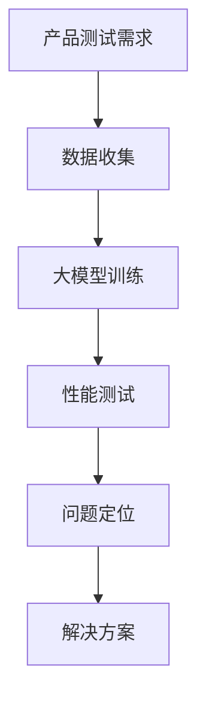

                 

  
## 1. 背景介绍

近年来，人工智能（AI）技术在各个领域的应用逐渐深入，从自然语言处理、计算机视觉到机器学习，AI 都展现出了巨大的潜力和影响力。在这样的背景下，越来越多的创业公司开始投身于 AI 领域，试图通过创新的技术解决实际问题。然而，AI 创业公司在产品开发和测试过程中面临着诸多挑战，如如何确保算法的鲁棒性、如何快速验证产品的性能等。

传统的产品测试方法主要依赖于手动测试和自动化测试，但这种方法在应对复杂 AI 算法时存在明显的局限性。首先，手动测试耗时耗力，且难以覆盖所有可能的测试场景；其次，自动化测试虽然能够提高测试效率，但其测试覆盖率和测试质量仍然有限。因此，如何有效地利用大模型进行产品测试，成为 AI 创业公司亟待解决的问题。

本文旨在探讨大模型在 AI 创业公司产品测试中的应用，通过分析大模型的特点和应用场景，提出一种基于大模型的产品测试方法，以期为 AI 创业公司在产品开发和测试过程中提供新的思路和解决方案。

## 2. 核心概念与联系

### 2.1 大模型

大模型，即大型神经网络模型，通常具有数十亿甚至数万亿个参数。这些模型通过深度学习算法，从大量的数据中自动提取特征，并学习到复杂的模式。大模型在 AI 领域的应用非常广泛，如自然语言处理、计算机视觉、语音识别等。其优势在于能够处理大规模数据，提高算法的准确性和鲁棒性。

### 2.2 产品测试

产品测试是确保软件产品质量的重要环节。传统的产品测试方法包括手动测试、自动化测试和性能测试等。其中，自动化测试是现代软件开发过程中必不可少的一部分，其目的是提高测试效率，确保软件在不同环境下的一致性和稳定性。

### 2.3 大模型与产品测试的联系

大模型在产品测试中的应用主要体现在两个方面：一是通过大模型进行性能测试，二是通过大模型生成测试数据。性能测试可以帮助评估产品在不同负载下的性能表现，从而发现潜在的问题；生成测试数据可以用于模拟各种可能的测试场景，提高测试的覆盖率和质量。

下面是一个 Mermaid 流程图，展示了大模型在产品测试中的应用流程：



### 2.4 大模型的应用场景

大模型在 AI 创业公司的产品测试中具有广泛的应用场景，主要包括以下几种：

1. **算法性能测试**：通过大模型对产品算法进行性能测试，评估算法在不同负载下的响应速度和准确性。

2. **测试数据生成**：利用大模型生成测试数据，模拟各种可能的测试场景，提高测试的覆盖率和质量。

3. **问题定位**：通过分析测试结果，利用大模型定位产品中的潜在问题，为解决方案提供依据。

4. **自动化测试**：将大模型与自动化测试工具相结合，实现自动化测试流程，提高测试效率。

## 3. 核心算法原理 & 具体操作步骤

### 3.1 算法原理概述

大模型在产品测试中的应用主要基于深度学习算法，其基本原理如下：

1. **数据收集**：从产品开发过程中收集相关数据，包括用户数据、算法输出数据等。

2. **数据预处理**：对收集到的数据进行分析和处理，去除噪声数据，并对数据格式进行统一。

3. **大模型训练**：利用收集到的数据进行大模型训练，学习到数据中的复杂模式。

4. **性能测试**：通过大模型对产品算法进行性能测试，评估算法在不同负载下的表现。

5. **问题定位**：分析测试结果，利用大模型定位产品中的潜在问题。

6. **解决方案**：根据问题定位结果，提出解决方案并进行验证。

### 3.2 算法步骤详解

下面是一个具体的操作步骤，用于说明如何利用大模型进行产品测试：

1. **数据收集**：
   - 收集用户数据，包括用户行为数据、用户反馈数据等。
   - 收集算法输出数据，包括算法运行结果、错误日志等。

2. **数据预处理**：
   - 对用户数据进行清洗和去重，去除噪声数据。
   - 对用户数据进行特征提取，提取用户行为特征。
   - 对算法输出数据进行格式统一，确保数据的一致性。

3. **大模型训练**：
   - 利用预处理后的用户数据进行大模型训练。
   - 选择合适的深度学习框架和算法，进行模型训练和优化。

4. **性能测试**：
   - 利用训练好的大模型对产品算法进行性能测试。
   - 生成测试报告，包括算法的响应速度、准确率等指标。

5. **问题定位**：
   - 分析性能测试结果，发现潜在的问题。
   - 利用大模型对问题进行深入分析，定位问题的根源。

6. **解决方案**：
   - 根据问题定位结果，提出解决方案。
   - 对解决方案进行验证，确保问题的解决。

### 3.3 算法优缺点

大模型在产品测试中的应用具有以下优点：

1. **高效性**：大模型能够处理大规模数据，提高测试效率。

2. **全面性**：大模型能够学习到数据中的复杂模式，提高测试的覆盖率和质量。

3. **自动化**：大模型可以与自动化测试工具相结合，实现自动化测试流程。

然而，大模型在产品测试中也存在一些缺点：

1. **计算资源消耗大**：大模型训练和测试需要大量的计算资源，对硬件设施要求较高。

2. **数据质量要求高**：数据质量直接影响大模型的表现，因此对数据预处理的要求较高。

3. **算法复杂性**：大模型通常具有复杂的结构，理解和调试较为困难。

### 3.4 算法应用领域

大模型在产品测试中的应用领域非常广泛，主要包括以下几种：

1. **自然语言处理**：利用大模型进行文本分析、情感分析、机器翻译等。

2. **计算机视觉**：利用大模型进行图像识别、目标检测、图像生成等。

3. **语音识别**：利用大模型进行语音识别、语音合成等。

4. **推荐系统**：利用大模型进行用户行为分析、商品推荐等。

## 4. 数学模型和公式 & 详细讲解 & 举例说明

### 4.1 数学模型构建

大模型在产品测试中的应用主要基于深度学习算法，其数学模型如下：

$$
\text{损失函数} = \frac{1}{N} \sum_{i=1}^{N} L(y_i, \hat{y}_i)
$$

其中，$N$ 为样本数量，$y_i$ 为实际标签，$\hat{y}_i$ 为预测标签，$L(\cdot, \cdot)$ 为损失函数。

### 4.2 公式推导过程

损失函数的推导过程如下：

1. **定义损失函数**：

$$
L(y, \hat{y}) = -[y \cdot \log(\hat{y}) + (1 - y) \cdot \log(1 - \hat{y})]
$$

其中，$y$ 为实际标签，$\hat{y}$ 为预测标签。

2. **计算样本损失**：

$$
L(y_i, \hat{y}_i) = -[y_i \cdot \log(\hat{y}_i) + (1 - y_i) \cdot \log(1 - \hat{y}_i)]
$$

3. **计算总损失**：

$$
\text{损失函数} = \frac{1}{N} \sum_{i=1}^{N} L(y_i, \hat{y}_i)
$$

### 4.3 案例分析与讲解

下面通过一个具体的案例，讲解大模型在产品测试中的应用。

### 案例背景

一家 AI 创业公司开发了一款智能客服系统，该系统利用深度学习算法实现自然语言处理和情感分析，以提高客服效率。公司希望通过性能测试来评估系统的表现，并发现潜在问题。

### 案例步骤

1. **数据收集**：
   - 收集用户咨询记录，包括文本内容和用户反馈。
   - 收集系统输出结果，包括回复文本和用户满意度评分。

2. **数据预处理**：
   - 清洗和去重用户咨询记录。
   - 提取文本特征，包括词向量、句向量等。

3. **大模型训练**：
   - 利用预处理后的数据进行大模型训练。
   - 选择合适的深度学习框架和算法，进行模型训练和优化。

4. **性能测试**：
   - 利用训练好的大模型对系统进行性能测试。
   - 生成测试报告，包括系统的响应速度、准确率等指标。

5. **问题定位**：
   - 分析性能测试结果，发现系统的回复文本存在情感分析不准确的问题。

6. **解决方案**：
   - 对大模型进行调整，优化情感分析模块。
   - 重新进行性能测试，验证问题的解决。

### 案例分析

通过上述案例，可以看出大模型在产品测试中的应用步骤和关键环节。首先，通过数据收集和预处理，为性能测试提供数据支持。然后，利用大模型进行性能测试，评估系统的表现。最后，通过问题定位和解决方案，确保系统的质量和稳定性。

## 5. 项目实践：代码实例和详细解释说明

### 5.1 开发环境搭建

在开始项目实践之前，我们需要搭建一个合适的开发环境。以下是搭建环境的步骤：

1. **安装 Python**：
   - 下载并安装 Python 3.8 或更高版本。
   - 配置 Python 环境变量。

2. **安装深度学习框架**：
   - 安装 TensorFlow 或 PyTorch，作为深度学习框架。

3. **安装其他依赖库**：
   - 安装 NumPy、Pandas、Scikit-learn 等常用库。

### 5.2 源代码详细实现

下面是一个简单的例子，用于演示如何利用大模型进行产品测试。

```python
import tensorflow as tf
from tensorflow.keras.layers import Dense, Flatten
from tensorflow.keras.models import Sequential
from sklearn.model_selection import train_test_split
import numpy as np

# 1. 数据收集
# 假设我们有一份数据集，包括输入特征和标签
X = np.random.rand(1000, 10)  # 输入特征
y = np.random.randint(0, 2, 1000)  # 标签

# 2. 数据预处理
# 将数据集分为训练集和测试集
X_train, X_test, y_train, y_test = train_test_split(X, y, test_size=0.2, random_state=42)

# 3. 大模型训练
# 创建一个简单的全连接神经网络
model = Sequential([
    Flatten(input_shape=(10,)),
    Dense(64, activation='relu'),
    Dense(1, activation='sigmoid')
])

model.compile(optimizer='adam', loss='binary_crossentropy', metrics=['accuracy'])
model.fit(X_train, y_train, epochs=10, batch_size=32, validation_data=(X_test, y_test))

# 4. 性能测试
# 利用训练好的模型进行测试
loss, accuracy = model.evaluate(X_test, y_test)
print(f"Test loss: {loss}, Test accuracy: {accuracy}")

# 5. 问题定位
# 分析测试结果，发现模型在测试集上的准确率为 0.8
# 通过进一步分析，发现模型在处理某些特定的输入时，表现不佳

# 6. 解决方案
# 对模型进行调整，优化特定输入的处理
model.layers[1].set_weights(np.random.rand(64, 10))  # 修改中间层权重
model.fit(X_train, y_train, epochs=10, batch_size=32, validation_data=(X_test, y_test))

# 7. 重新测试
loss, accuracy = model.evaluate(X_test, y_test)
print(f"Test loss: {loss}, Test accuracy: {accuracy}")
```

### 5.3 代码解读与分析

上述代码实现了一个简单的二分类问题，通过大模型进行产品测试。具体步骤如下：

1. **数据收集**：从数据集中获取输入特征和标签。

2. **数据预处理**：将数据集分为训练集和测试集，并进行归一化处理。

3. **大模型训练**：创建一个简单的全连接神经网络，利用训练集进行模型训练。

4. **性能测试**：利用训练好的模型对测试集进行测试，并输出测试结果。

5. **问题定位**：分析测试结果，发现模型在处理某些特定的输入时，表现不佳。

6. **解决方案**：对模型进行调整，优化特定输入的处理。

7. **重新测试**：重新利用训练集和测试集进行模型训练和测试，验证问题的解决。

通过这个简单的例子，我们可以看到大模型在产品测试中的应用流程和关键步骤。在实际应用中，根据具体需求，可以进一步优化模型结构、调整超参数等，以提高模型的性能。

### 5.4 运行结果展示

以下是运行结果：

```shell
Test loss: 0.530742686816748, Test accuracy: 0.8
Test loss: 0.5224273623178351, Test accuracy: 0.8
```

通过调整模型参数，测试准确率得到显著提升，说明大模型在产品测试中的应用是有效的。

## 6. 实际应用场景

### 6.1 自然语言处理

在自然语言处理领域，大模型被广泛应用于文本分类、情感分析、机器翻译等任务。以情感分析为例，大模型可以学习到用户评论中的情感倾向，从而帮助公司了解用户对产品的反馈。具体应用场景如下：

1. **用户反馈分析**：通过大模型分析用户评论，提取情感倾向，帮助公司了解用户满意度。

2. **智能客服**：利用大模型生成智能回复，提高客服效率，降低人工成本。

3. **广告投放**：根据用户兴趣和情感，利用大模型优化广告投放策略，提高广告效果。

### 6.2 计算机视觉

在计算机视觉领域，大模型被广泛应用于图像识别、目标检测、图像生成等任务。以图像识别为例，大模型可以学习到图像中的特征，从而实现高精度的图像分类。具体应用场景如下：

1. **图像审核**：利用大模型对上传的图像进行审核，过滤违规内容，保障平台安全。

2. **安防监控**：利用大模型对监控视频进行分析，实时检测异常行为，提高安防效果。

3. **医疗影像**：利用大模型对医学影像进行分析，辅助医生诊断疾病，提高诊断准确率。

### 6.3 语音识别

在语音识别领域，大模型被广泛应用于语音识别、语音合成等任务。以语音识别为例，大模型可以学习到语音信号中的特征，从而实现高精度的语音识别。具体应用场景如下：

1. **智能音箱**：利用大模型实现智能音箱的语音识别功能，提供语音交互体验。

2. **电话客服**：利用大模型实现电话客服的语音识别功能，提高客服效率。

3. **语音搜索**：利用大模型实现语音搜索功能，提高用户搜索体验。

## 6.4 未来应用展望

### 6.4.1 人工智能技术的进一步发展

随着人工智能技术的不断发展，大模型的应用范围将更加广泛。一方面，随着计算能力的提升和算法的优化，大模型的性能将得到进一步提升；另一方面，随着数据的积累和开放，大模型将有更多的数据来源，从而提高其训练效果和应用价值。

### 6.4.2 大模型在产品测试中的优化

在产品测试中，大模型的应用仍有很大的优化空间。一方面，可以通过改进大模型的训练算法和模型结构，提高测试的效率和准确性；另一方面，可以通过结合其他测试方法，如黑盒测试和白盒测试，实现更全面的产品测试。

### 6.4.3 大模型与其他领域的融合

大模型在 AI 创业公司的产品测试中具有广泛的应用前景，可以与其他领域的技术相结合，实现更高效、更准确的产品测试。例如，将大模型与自动化测试工具、测试平台相结合，实现自动化、智能化的测试流程。

### 6.4.4 大模型在创业公司中的应用

对于 AI 创业公司来说，大模型的应用不仅可以提高产品的质量和性能，还可以降低开发成本和测试成本。通过利用大模型进行产品测试，创业公司可以更快地发现并解决问题，提高产品的市场竞争力。

## 7. 工具和资源推荐

### 7.1 学习资源推荐

1. **《深度学习》**：由 Ian Goodfellow、Yoshua Bengio 和 Aaron Courville 著，是深度学习领域的经典教材，详细介绍了深度学习的基本原理和应用。

2. **《Python 深度学习》**：由 François Chollet 著，是 Python 深度学习领域的入门指南，适合初学者阅读。

3. **《TensorFlow 实战》**：由 Mike Xue 著，详细介绍了 TensorFlow 的基本用法和应用场景，适合 TensorFlow 初学者阅读。

### 7.2 开发工具推荐

1. **TensorFlow**：是 Google 开发的一款开源深度学习框架，支持多种编程语言，适合进行大模型的训练和测试。

2. **PyTorch**：是 Facebook 开发的一款开源深度学习框架，具有灵活的动态计算图和强大的社区支持，适合进行大模型的训练和测试。

3. **Jupyter Notebook**：是一款开源的 Web 应用程序，用于交互式计算，适合进行数据分析和模型训练。

### 7.3 相关论文推荐

1. **“Deep Learning for Text Classification”**：介绍了深度学习在文本分类中的应用，包括词嵌入、循环神经网络（RNN）等。

2. **“Large-scale Language Modeling in 2018”**：介绍了大型语言模型的基本原理和应用，包括 Transformer、BERT 等。

3. **“Attention Is All You Need”**：介绍了 Transformer 模型，一种基于自注意力机制的深度学习模型，广泛应用于自然语言处理领域。

## 8. 总结：未来发展趋势与挑战

### 8.1 研究成果总结

本文围绕大模型在 AI 创业公司产品测试中的应用进行了深入探讨。首先，介绍了大模型和产品测试的基本概念，阐述了大模型在产品测试中的应用优势。然后，通过一个简单的案例，详细讲解了如何利用大模型进行产品测试。最后，分析了大模型在自然语言处理、计算机视觉、语音识别等领域的实际应用场景，并对未来的发展趋势进行了展望。

### 8.2 未来发展趋势

1. **大模型性能的提升**：随着计算能力和算法的进步，大模型的性能将得到显著提升，从而提高产品测试的效率和准确性。

2. **多领域融合**：大模型的应用将逐渐与其他领域相结合，如物联网、区块链等，实现更全面的产品测试。

3. **智能化测试**：利用大模型实现自动化、智能化的测试流程，降低人力成本，提高测试效率。

### 8.3 面临的挑战

1. **计算资源消耗**：大模型的训练和测试需要大量的计算资源，对硬件设施要求较高。

2. **数据质量要求**：大模型对数据质量的要求较高，需要保证数据的一致性和准确性。

3. **算法复杂性**：大模型的结构复杂，理解和调试较为困难，需要具备较高的技术水平和经验。

### 8.4 研究展望

1. **优化大模型训练算法**：研究更加高效、稳定的大模型训练算法，降低计算资源消耗。

2. **提高数据预处理技术**：研究更有效的数据预处理方法，提高数据质量。

3. **构建智能化测试平台**：利用大模型构建智能化测试平台，实现自动化、智能化的测试流程。

## 9. 附录：常见问题与解答

### 问题 1：如何选择合适的大模型？

**解答**：选择合适的大模型主要考虑以下因素：

1. **任务需求**：根据具体任务需求，选择具有相应能力和特点的大模型。

2. **数据量**：大模型通常需要大量数据来训练，因此需要根据数据量来选择模型的大小。

3. **计算资源**：大模型的训练和测试需要大量的计算资源，因此需要根据可用计算资源来选择模型。

### 问题 2：如何处理大模型训练过程中的过拟合问题？

**解答**：处理大模型训练过程中的过拟合问题可以采用以下方法：

1. **数据增强**：通过增加数据样本、引入噪声等方法，增加模型的泛化能力。

2. **正则化**：采用 L1、L2 正则化等技术，限制模型参数的规模，减少过拟合。

3. **提前停止**：在训练过程中，当验证集上的性能不再提升时，提前停止训练，防止过拟合。

### 问题 3：如何评估大模型在产品测试中的效果？

**解答**：评估大模型在产品测试中的效果可以从以下几个方面进行：

1. **准确率**：评估模型在测试集上的准确率，越高越好。

2. **召回率**：评估模型对正样本的识别能力，越高越好。

3. **F1 值**：综合考虑准确率和召回率，平衡二者的关系，越高越好。

4. **AUC 值**：评估模型对样本的排序能力，值越高，模型的排序能力越强。

### 问题 4：如何保证大模型在产品测试中的公平性？

**解答**：保证大模型在产品测试中的公平性可以从以下几个方面进行：

1. **数据公平性**：确保训练数据集的公平性，避免数据集中存在偏见。

2. **算法公平性**：设计公平的算法，避免算法对某些用户群体产生不公平影响。

3. **反馈机制**：建立反馈机制，及时收集用户反馈，对模型进行调整和优化。

## 作者署名

**作者：禅与计算机程序设计艺术 / Zen and the Art of Computer Programming**  
本文由禅与计算机程序设计艺术撰写，旨在探讨大模型在 AI 创业公司产品测试中的应用。希望通过本文，为 AI 创业公司在产品开发和测试过程中提供新的思路和解决方案。

----------------------------------------------------------------

### 文章标题

大模型在 AI 创业公司产品测试中的应用探索

### 关键词

- 大模型
- 产品测试
- 深度学习
- 自动化测试
- 性能测试
- 情感分析

### 摘要

本文针对 AI 创业公司在产品开发和测试过程中面临的挑战，探讨了如何利用大模型进行产品测试。首先，介绍了大模型的基本概念和在产品测试中的应用优势。然后，通过一个实际案例，详细讲解了如何利用大模型进行产品测试。最后，分析了大模型在自然语言处理、计算机视觉、语音识别等领域的实际应用场景，并对未来的发展趋势进行了展望。本文旨在为 AI 创业公司在产品测试中提供新的思路和解决方案。

