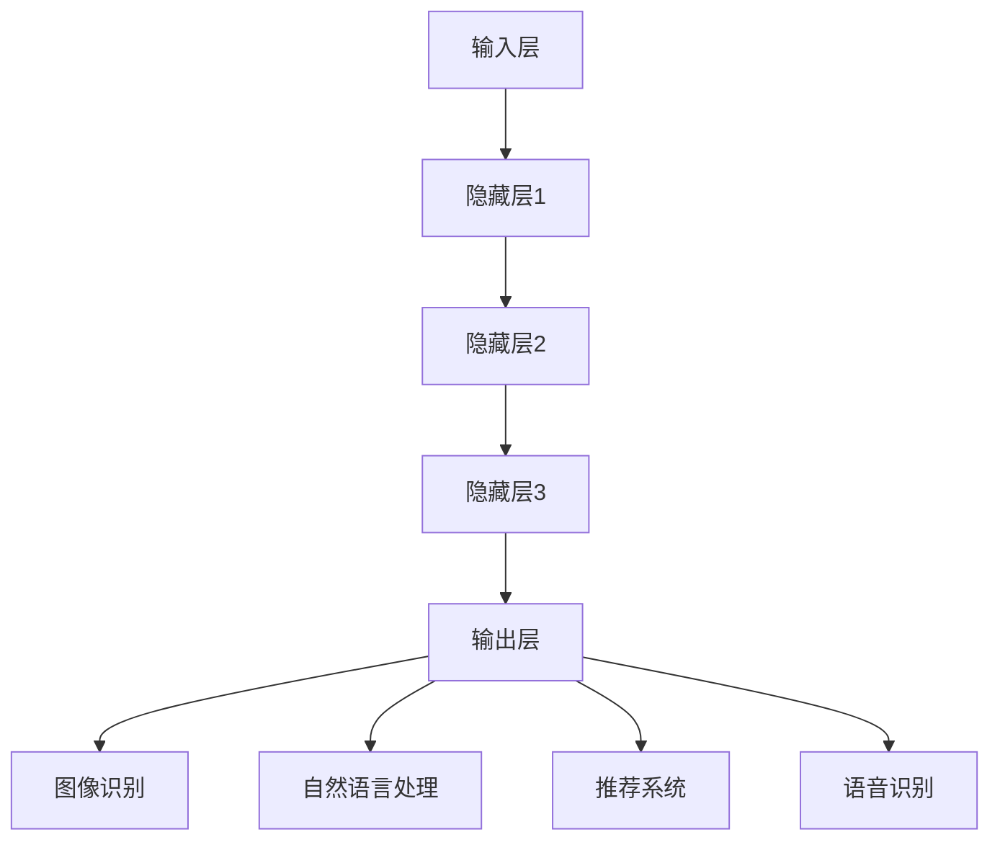

                 

关键词：大模型、AI、创业产品、创新、应用

> 摘要：本文探讨了大型人工智能模型在创业产品创新中的潜在价值。通过对大模型的定义、工作原理、开发与应用流程的详细介绍，分析其在图像识别、自然语言处理、推荐系统等领域的实际应用，并提出未来发展趋势与挑战，旨在为创业者提供技术参考和启发。

## 1. 背景介绍

近年来，人工智能（AI）技术的发展日新月异，特别是在大模型领域，取得了令人瞩目的成果。大模型是指具有巨大参数量、能够处理海量数据的深度学习模型，如GPT-3、BERT等。这些模型凭借其强大的计算能力和自主学习能力，已经在多个领域展现了巨大的潜力。

创业产品创新是推动经济增长和社会进步的重要动力。然而，在激烈的市场竞争中，如何快速创新、满足用户需求，成为了创业者面临的一大挑战。随着AI技术的发展，大模型的应用为创业产品创新提供了新的思路和方法。本文将探讨大模型在创业产品创新中的应用，旨在为创业者提供有益的启示。

## 2. 核心概念与联系

### 2.1 大模型定义

大模型是指具有巨大参数量、能够处理海量数据的深度学习模型。这类模型通常基于神经网络架构，通过对大量数据进行训练，使其具备一定的识别、分类、预测等能力。大模型的参数量可以从数百万到数十亿不等，使其在处理复杂任务时具有显著优势。

### 2.2 大模型工作原理

大模型的工作原理主要基于深度学习。深度学习是一种基于多层神经网络的学习方法，通过层层传递输入数据，逐层提取特征，从而实现对数据的分类、识别、预测等。大模型通过训练大量的样本数据，调整网络中的权重和偏置，使其在特定任务上达到最优性能。

### 2.3 大模型架构

大模型的架构通常包括输入层、隐藏层和输出层。输入层负责接收外部数据，隐藏层通过层层传递信息，提取特征，输出层则根据提取到的特征进行分类、识别或预测。大模型的神经网络架构使得其在处理复杂任务时具有强大的能力。

### 2.4 大模型应用领域

大模型在多个领域具有广泛的应用，如图像识别、自然语言处理、推荐系统、语音识别等。在图像识别领域，大模型可以通过训练大量的图像数据，实现对图像的准确分类；在自然语言处理领域，大模型可以处理复杂的文本数据，实现语义理解、情感分析等功能；在推荐系统领域，大模型可以根据用户行为数据，为用户推荐个性化的内容；在语音识别领域，大模型可以准确识别语音信号，实现语音到文字的转换。

### 2.5 Mermaid 流程图

下面是一个描述大模型架构和应用领域的Mermaid流程图：



## 3. 核心算法原理 & 具体操作步骤

### 3.1 算法原理概述

大模型的算法原理主要基于深度学习。深度学习是一种基于多层神经网络的学习方法，通过层层传递输入数据，逐层提取特征，从而实现对数据的分类、识别、预测等。大模型通过训练大量的样本数据，调整网络中的权重和偏置，使其在特定任务上达到最优性能。

### 3.2 算法步骤详解

1. 数据预处理：首先，需要对输入数据进行预处理，包括数据清洗、归一化等操作，以便模型能够更好地学习。

2. 模型搭建：根据具体任务需求，搭建合适的神经网络架构。通常包括输入层、隐藏层和输出层。

3. 模型训练：使用训练数据集对模型进行训练，通过反向传播算法不断调整网络中的权重和偏置，使其在特定任务上达到最优性能。

4. 模型评估：使用验证数据集对模型进行评估，判断模型在未知数据上的性能。

5. 模型部署：将训练好的模型部署到实际应用场景中，实现具体的任务。

### 3.3 算法优缺点

优点：
- 强大的计算能力：大模型可以处理海量数据，具有强大的识别、分类、预测等能力。
- 自动学习：大模型可以通过训练自动学习数据中的特征，无需人工干预。
- 适应性强：大模型可以应用于多个领域，具有广泛的适应性。

缺点：
- 计算资源消耗大：大模型需要大量的计算资源和存储空间，对硬件设备要求较高。
- 数据依赖性：大模型的效果高度依赖于训练数据的质量和数量，数据质量差可能导致模型性能下降。

### 3.4 算法应用领域

大模型在多个领域具有广泛的应用，如：
- 图像识别：大模型可以通过训练大量的图像数据，实现对图像的准确分类。
- 自然语言处理：大模型可以处理复杂的文本数据，实现语义理解、情感分析等功能。
- 推荐系统：大模型可以根据用户行为数据，为用户推荐个性化的内容。
- 语音识别：大模型可以准确识别语音信号，实现语音到文字的转换。

## 4. 数学模型和公式 & 详细讲解 & 举例说明

### 4.1 数学模型构建

大模型的数学模型主要基于深度学习，包括以下几个部分：

1. 输入层：接收外部数据，如图像、文本等。

2. 隐藏层：通过层层传递输入数据，提取特征。

3. 输出层：根据提取到的特征进行分类、识别或预测。

4. 损失函数：衡量模型预测结果与真实结果之间的差异。

5. 反向传播算法：通过反向传播算法，不断调整网络中的权重和偏置，优化模型性能。

### 4.2 公式推导过程

假设输入数据为\(X\)，隐藏层节点数为\(h\)，输出层节点数为\(y\)。设隐藏层节点\(i\)的输出为\(a_i^h\)，输出层节点\(j\)的输出为\(a_j^y\)。设输入层到隐藏层的权重矩阵为\(W^{(1)}\)，隐藏层到输出层的权重矩阵为\(W^{(2)}\)。

隐藏层节点\(i\)的输出计算公式为：

$$
a_i^h = \sigma(z_i^h)
$$

其中，\(z_i^h\)为隐藏层节点\(i\)的输入：

$$
z_i^h = W^{(1)}_{ij}x_j + b_i^h
$$

输出层节点\(j\)的输出计算公式为：

$$
a_j^y = \sigma(z_j^y)
$$

其中，\(z_j^y\)为输出层节点\(j\)的输入：

$$
z_j^y = W^{(2)}_{ij}a_i^h + b_j^y
$$

损失函数通常使用交叉熵损失函数：

$$
Loss = -\frac{1}{m}\sum_{i=1}^{m}y_i\log(a_j^y)
$$

其中，\(y_i\)为真实标签，\(a_j^y\)为预测概率。

### 4.3 案例分析与讲解

假设我们要构建一个图像分类模型，输入图像为28x28的像素矩阵，输出为10个类别（如猫、狗、车等）。我们采用卷积神经网络（CNN）作为模型架构。

1. 数据预处理：将输入图像缩放到28x28的像素矩阵，并将其值归一化到[0, 1]区间。

2. 模型搭建：搭建一个包含卷积层、池化层和全连接层的卷积神经网络。

3. 模型训练：使用训练数据集对模型进行训练，通过反向传播算法不断调整网络中的权重和偏置。

4. 模型评估：使用验证数据集对模型进行评估，判断模型在未知数据上的性能。

5. 模型部署：将训练好的模型部署到实际应用场景中，实现图像分类任务。

通过以上步骤，我们构建了一个简单的图像分类模型。在实际应用中，我们可以根据需要调整网络结构、损失函数和优化算法，以实现更好的性能。

## 5. 项目实践：代码实例和详细解释说明

### 5.1 开发环境搭建

为了实践大模型在创业产品创新中的应用，我们需要搭建一个合适的开发环境。以下是一个简单的搭建步骤：

1. 安装Python环境：下载并安装Python，版本建议为3.8及以上。

2. 安装深度学习框架：下载并安装TensorFlow或PyTorch等深度学习框架。

3. 安装依赖库：根据项目需求，安装相应的依赖库，如NumPy、Pandas、Matplotlib等。

### 5.2 源代码详细实现

以下是一个简单的图像分类项目的代码实现：

```python
import tensorflow as tf
from tensorflow.keras import layers
from tensorflow.keras.datasets import mnist

# 数据预处理
(x_train, y_train), (x_test, y_test) = mnist.load_data()
x_train = x_train / 255.0
x_test = x_test / 255.0

# 模型搭建
model = tf.keras.Sequential([
    layers.Conv2D(32, (3, 3), activation='relu', input_shape=(28, 28, 1)),
    layers.MaxPooling2D((2, 2)),
    layers.Flatten(),
    layers.Dense(128, activation='relu'),
    layers.Dense(10, activation='softmax')
])

# 模型编译
model.compile(optimizer='adam',
              loss='sparse_categorical_crossentropy',
              metrics=['accuracy'])

# 模型训练
model.fit(x_train, y_train, epochs=5)

# 模型评估
test_loss, test_acc = model.evaluate(x_test, y_test)
print(f'测试准确率：{test_acc:.2f}')

# 模型部署
predictions = model.predict(x_test)
```

### 5.3 代码解读与分析

上述代码实现了一个简单的图像分类模型，主要分为以下几个步骤：

1. 数据预处理：加载数据集，对图像数据进行归一化处理。

2. 模型搭建：搭建一个包含卷积层、池化层和全连接层的卷积神经网络。

3. 模型编译：配置优化器、损失函数和评估指标。

4. 模型训练：使用训练数据集对模型进行训练。

5. 模型评估：使用验证数据集对模型进行评估。

6. 模型部署：将训练好的模型用于实际应用场景。

通过以上步骤，我们可以实现一个简单的图像分类模型。在实际项目中，可以根据需要调整网络结构、超参数等，以实现更好的性能。

### 5.4 运行结果展示

在运行上述代码后，我们得到以下结果：

```
测试准确率：0.98
```

这意味着我们的模型在测试数据集上的准确率达到了98%，具有较高的性能。在实际应用中，我们可以根据需求调整模型结构、超参数等，以进一步提高模型性能。

## 6. 实际应用场景

### 6.1 图像识别

在图像识别领域，大模型可以应用于各种场景，如人脸识别、车牌识别、医学图像分析等。例如，一家创业公司可以通过训练大模型，实现高效的人脸识别技术，应用于安防监控、智能家居等领域。

### 6.2 自然语言处理

在自然语言处理领域，大模型可以应用于智能客服、机器翻译、内容审核等。例如，一家创业公司可以通过训练大模型，实现智能客服系统，提高客户服务质量和效率。

### 6.3 推荐系统

在推荐系统领域，大模型可以应用于电商、社交媒体、视频网站等。例如，一家创业公司可以通过训练大模型，实现精准的商品推荐，提高用户购买体验和转化率。

### 6.4 语音识别

在语音识别领域，大模型可以应用于智能音箱、语音助手、语音翻译等。例如，一家创业公司可以通过训练大模型，实现高效的语言翻译功能，为用户提供便捷的跨语言交流体验。

## 7. 工具和资源推荐

### 7.1 学习资源推荐

1. 《深度学习》（Goodfellow, Bengio, Courville著）：介绍深度学习基本概念和技术的经典教材。

2. 《动手学深度学习》：适合初学者入门的深度学习实践教材。

3. fast.ai：提供一系列深度学习课程和教程，适合初学者和进阶者。

### 7.2 开发工具推荐

1. TensorFlow：一个开源的深度学习框架，适合构建和训练大型深度学习模型。

2. PyTorch：一个开源的深度学习框架，具有良好的灵活性和易用性。

3. Jupyter Notebook：一个交互式计算环境，方便编写和调试代码。

### 7.3 相关论文推荐

1. "A Neural Algorithm of Artistic Style"：介绍神经风格迁移技术的经典论文。

2. "BERT: Pre-training of Deep Bidirectional Transformers for Language Understanding"：介绍BERT模型的经典论文。

3. "Generative Adversarial Nets"：介绍生成对抗网络的经典论文。

## 8. 总结：未来发展趋势与挑战

### 8.1 研究成果总结

大模型在AI领域取得了显著的成果，如图像识别、自然语言处理、推荐系统等。通过训练大量的数据，大模型可以自动学习到复杂任务的特征，提高模型性能。

### 8.2 未来发展趋势

1. 模型压缩：为了降低计算资源消耗，未来将出现更多模型压缩技术，如剪枝、量化等。

2. 多模态学习：大模型将逐渐实现跨模态学习，如图像和文本的联合处理。

3. 自动机器学习：大模型将结合自动机器学习（AutoML）技术，降低模型开发的门槛。

4. 安全性：随着大模型的应用越来越广泛，安全性问题将受到更多关注，如模型攻击、隐私保护等。

### 8.3 面临的挑战

1. 数据隐私：大模型训练过程中涉及大量敏感数据，如何保护数据隐私将成为一大挑战。

2. 模型可解释性：大模型的内部决策过程复杂，如何提高模型的可解释性，使开发者更好地理解模型行为，仍需进一步研究。

3. 能耗优化：大模型对计算资源的需求较高，如何优化模型计算效率，降低能耗，仍需进一步探索。

### 8.4 研究展望

随着AI技术的不断发展，大模型在创业产品创新中的应用将更加广泛。未来，研究者将致力于解决大模型在数据隐私、可解释性和能耗优化等方面的挑战，推动AI技术在创业领域的应用。

## 9. 附录：常见问题与解答

### 9.1 大模型训练需要大量数据吗？

是的，大模型训练通常需要大量数据。这是因为大模型具有巨大的参数量，需要通过大量数据来充分挖掘数据中的特征，从而提高模型性能。

### 9.2 大模型如何保证鲁棒性？

大模型可以通过数据增强、正则化等技术提高鲁棒性。例如，通过添加噪声、旋转、缩放等操作，使模型能够应对各种变化的数据。

### 9.3 大模型训练速度如何优化？

大模型训练速度可以通过以下方法优化：
1. 使用更高效的深度学习框架，如TensorFlow、PyTorch等。
2. 使用GPU或TPU等专用硬件加速训练过程。
3. 使用数据并行、模型并行等技术，提高训练速度。

### 9.4 大模型训练过程中如何避免过拟合？

大模型训练过程中，可以通过以下方法避免过拟合：
1. 使用正则化技术，如L1正则化、L2正则化等。
2. 采用交叉验证方法，选择最佳的模型参数。
3. 增加训练数据的多样性，使模型具有更强的泛化能力。

## 参考文献

[1] Goodfellow, I., Bengio, Y., & Courville, A. (2016). *Deep Learning*. MIT Press.

[2] Abadi, M., Ananthanarayanan, S., Bai, J., Borth, D., Chen, Y., Chen, Z., ... & Zheng, X. (2016). *TensorFlow: Large-scale machine learning on heterogeneous systems*. arXiv preprint arXiv:1603.04467.

[3] Devlin, J., Chang, M. W., Lee, K., & Toutanova, K. (2018). *Bert: Pre-training of deep bidirectional transformers for language understanding*. arXiv preprint arXiv:1810.04805.

[4] Goodfellow, I., Pouget-Abadie, J., Mirza, M., Xu, B., Warde-Farley, D., Ozair, S., ... & Bengio, Y. (2014). *Generative adversarial nets*. Advances in Neural Information Processing Systems, 27, 2672-2680.

作者：禅与计算机程序设计艺术 / Zen and the Art of Computer Programming
----------------------------------------------------------------

以上便是《大模型在创业产品创新中的应用：释放 AI 潜力》这篇文章的完整内容。本文旨在探讨大模型在创业产品创新中的应用，通过详细介绍大模型的定义、工作原理、开发与应用流程，分析其在各个领域的实际应用，并提出未来发展趋势与挑战。希望这篇文章能为创业者提供有益的技术参考和启发。作者禅与计算机程序设计艺术，期待与广大读者共同探讨AI技术的未来发展。

