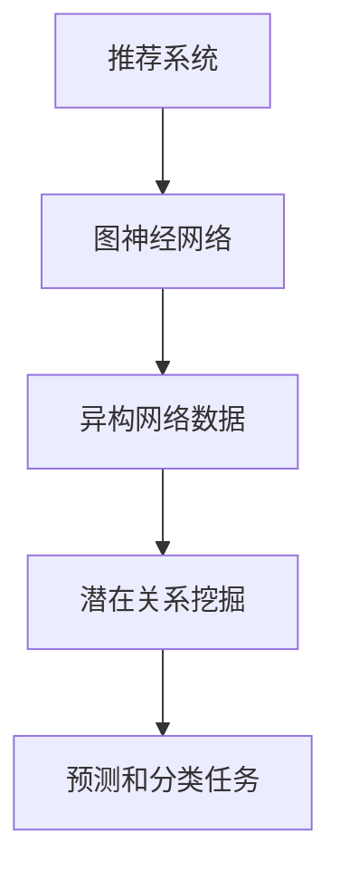

                 

摘要：本文深入探讨了如何在大模型环境中，将图神经网络（Graph Neural Networks, GNN）应用于推荐系统。首先，对推荐系统和图神经网络进行了背景介绍，阐述了其核心概念与联系。然后，详细描述了GNN在推荐系统中的核心算法原理、具体操作步骤、数学模型和公式推导，并通过项目实践展示了代码实例和详细解释。最后，探讨了实际应用场景，提出了未来应用展望，并总结了研究成果和面临的挑战，为推荐系统的发展提供了新的思路。

## 1. 背景介绍

### 推荐系统

推荐系统是一种基于用户历史行为、偏好和内容特征，为用户提供个性化推荐的服务。传统的推荐系统主要采用基于内容的推荐和协同过滤等方法。然而，随着用户生成内容（User-Generated Content, UGC）的爆炸式增长，以及复杂网络结构的出现，传统推荐系统的效果受到限制。此时，图神经网络作为一种新型的深度学习模型，因其能够有效地处理异构网络数据和鲁棒性强的特点，逐渐引起了研究者的关注。

### 图神经网络

图神经网络（Graph Neural Networks, GNN）是一种能够直接在图结构上执行的神经网络模型。GNN通过图卷积操作对节点和边进行建模，能够处理复杂的异构网络数据。GNN的核心思想是将图中的节点和边嵌入到一个低维空间中，然后在这个低维空间中进行学习和预测。GNN在推荐系统中的应用，主要是利用用户和物品之间的交互关系，挖掘出用户和物品之间的潜在关系，从而提高推荐效果。

## 2. 核心概念与联系

在本文中，我们将详细介绍大模型环境下的图神经网络在推荐系统中的核心概念与联系。

### 2.1. 大模型环境

大模型环境指的是具有海量数据和强大计算能力的环境。在大模型环境中，推荐系统可以利用深度学习、强化学习等先进算法，对用户行为进行精细建模，从而实现更精准的推荐。

### 2.2. 图神经网络

图神经网络（GNN）是一种直接在图结构上执行的神经网络模型。GNN通过图卷积操作对节点和边进行建模，能够处理复杂的异构网络数据。GNN的核心思想是将图中的节点和边嵌入到一个低维空间中，然后在这个低维空间中进行学习和预测。

### 2.3. 推荐系统与图神经网络

推荐系统与图神经网络之间的联系主要体现在以下几个方面：

- **异构网络数据的处理**：推荐系统中的用户、物品和交互数据通常具有复杂的网络结构，而GNN能够有效地处理这类数据。
- **潜在关系的挖掘**：GNN能够挖掘出用户和物品之间的潜在关系，从而提高推荐效果。
- **预测和分类任务**：GNN在推荐系统中既可以用于预测任务，如预测用户对物品的偏好；也可以用于分类任务，如预测用户对物品的评分。

下面是一个关于推荐系统和图神经网络核心概念与联系的Mermaid流程图：



## 3. 核心算法原理 & 具体操作步骤

### 3.1 算法原理概述

图神经网络（GNN）在推荐系统中的应用，主要分为以下几个步骤：

1. **数据预处理**：将用户、物品和交互数据转化为图结构，包括节点的特征表示和边的特征表示。
2. **图嵌入**：将图中的节点和边嵌入到一个低维空间中，以便进行后续处理。
3. **图卷积操作**：利用图卷积操作对节点和边进行建模，学习用户和物品之间的潜在关系。
4. **预测和分类**：利用学习到的模型，对用户对物品的偏好进行预测或分类。

### 3.2 算法步骤详解

#### 3.2.1 数据预处理

数据预处理是GNN在推荐系统中的第一步，主要包括以下任务：

1. **节点的特征表示**：将用户和物品的特征信息转换为向量表示，例如使用词袋模型、TF-IDF等方法。
2. **边的特征表示**：将用户和物品之间的交互数据转换为向量表示，例如使用矩阵分解、协同过滤等方法。

#### 3.2.2 图嵌入

图嵌入是将图中的节点和边嵌入到一个低维空间中的过程。常用的图嵌入方法包括：

1. **基于矩阵分解的方法**：例如利用矩阵分解技术，将用户和物品的特征矩阵分解为低维的表示矩阵。
2. **基于神经网络的图嵌入方法**：例如利用图卷积神经网络（GCN）进行图嵌入。

#### 3.2.3 图卷积操作

图卷积操作是对节点和边进行建模的过程。常用的图卷积方法包括：

1. **GCN**：通过图卷积层对节点的特征进行聚合，从而学习到节点的潜在表示。
2. **GraphSAGE**：通过采样和聚合策略，对节点的邻居节点信息进行聚合。
3. **GraphConv**：通过邻接矩阵进行卷积操作，学习到节点的潜在表示。

#### 3.2.4 预测和分类

利用学习到的模型，对用户对物品的偏好进行预测或分类。常用的预测和分类方法包括：

1. **基于梯度的方法**：例如利用梯度下降法，对模型参数进行优化。
2. **基于优化的方法**：例如利用图卷积优化算法（如GCO），对模型进行优化。

### 3.3 算法优缺点

#### 优点

1. **处理异构网络数据**：GNN能够处理复杂的异构网络数据，适用于推荐系统中的用户和物品数据。
2. **挖掘潜在关系**：GNN能够挖掘出用户和物品之间的潜在关系，从而提高推荐效果。
3. **可扩展性强**：GNN具有较好的可扩展性，可以应用于大规模的推荐系统。

#### 缺点

1. **计算复杂度高**：GNN的计算复杂度较高，对计算资源要求较高。
2. **数据预处理复杂**：推荐系统中的用户和物品数据通常具有复杂的结构，数据预处理过程较为复杂。
3. **过拟合风险**：GNN在处理稀疏数据时，容易发生过拟合现象。

### 3.4 算法应用领域

GNN在推荐系统中的应用领域广泛，主要包括：

1. **商品推荐**：例如在电子商务平台上，利用GNN对用户感兴趣的物品进行推荐。
2. **社交媒体推荐**：例如在社交媒体平台上，利用GNN对用户感兴趣的内容进行推荐。
3. **音乐推荐**：例如在音乐流媒体平台上，利用GNN对用户感兴趣的音乐进行推荐。

## 4. 数学模型和公式 & 详细讲解 & 举例说明

### 4.1 数学模型构建

在图神经网络（GNN）中，常用的数学模型包括节点嵌入和图卷积操作。下面，我们将详细介绍这两个模型。

#### 4.1.1 节点嵌入

节点嵌入是将图中的节点映射到一个低维空间的过程。常用的节点嵌入方法包括基于矩阵分解的方法和基于神经网络的节点嵌入方法。

- **基于矩阵分解的方法**：

$$
x_i = U_i v_i
$$

其中，$x_i$ 表示节点 $i$ 的低维嵌入向量，$U_i$ 和 $v_i$ 分别表示用户和物品的特征矩阵。

- **基于神经网络的节点嵌入方法**：

$$
x_i = \text{NN}(x_i, \{x_j | j \in \mathcal{N}(i)\})
$$

其中，$\text{NN}$ 表示神经网络，$x_i$ 表示节点 $i$ 的低维嵌入向量，$\mathcal{N}(i)$ 表示节点 $i$ 的邻居节点集合。

#### 4.1.2 图卷积操作

图卷积操作是对节点和边进行建模的过程。常用的图卷积方法包括GCN、GraphSAGE和GraphConv等。

- **GCN**：

$$
h_i^{(l+1)} = \sigma \left( \sum_{j \in \mathcal{N}(i)} \frac{1}{\sqrt{k_j}} h_j^{(l)} W^{(l)} \right)
$$

其中，$h_i^{(l)}$ 表示节点 $i$ 在第 $l$ 层的嵌入向量，$k_j$ 表示节点 $j$ 的度，$W^{(l)}$ 表示第 $l$ 层的权重矩阵。

- **GraphSAGE**：

$$
h_i^{(l+1)} = \text{AGG}(h_i^{(l)}, \{h_j^{(l)} | j \in \mathcal{N}(i)\}) \odot W^{(l)}
$$

其中，$\text{AGG}$ 表示聚合函数，$\odot$ 表示元素乘积，$W^{(l)}$ 表示第 $l$ 层的权重矩阵。

- **GraphConv**：

$$
h_i^{(l+1)} = \text{ReLU} \left( \sum_{j \in \mathcal{N}(i)} A_{i,j} h_j^{(l)} W^{(l)} \right)
$$

其中，$A$ 表示邻接矩阵，$h_i^{(l)}$ 表示节点 $i$ 在第 $l$ 层的嵌入向量，$W^{(l)}$ 表示第 $l$ 层的权重矩阵。

### 4.2 公式推导过程

下面，我们以GCN为例，介绍图卷积操作的推导过程。

#### 4.2.1 图卷积操作的基本思想

图卷积操作的核心思想是利用节点 $i$ 的邻居节点信息，更新节点 $i$ 的嵌入向量。具体地，图卷积操作可以通过以下步骤实现：

1. **计算邻居节点信息的加权平均**：

$$
h_i^{(l+1)} = \sum_{j \in \mathcal{N}(i)} \alpha_{i,j} h_j^{(l)}
$$

其中，$\alpha_{i,j}$ 表示节点 $i$ 和节点 $j$ 之间的邻接权重，$h_i^{(l)}$ 表示节点 $i$ 在第 $l$ 层的嵌入向量。

2. **应用非线性激活函数**：

$$
h_i^{(l+1)} = \text{ReLU}(h_i^{(l+1)})
$$

#### 4.2.2 邻接权重的计算

在GCN中，邻接权重可以通过以下两种方式计算：

1. **基于节点度**：

$$
\alpha_{i,j} = \frac{1}{k_i}
$$

其中，$k_i$ 表示节点 $i$ 的度。

2. **基于邻接矩阵**：

$$
\alpha_{i,j} = A_{i,j}
$$

其中，$A$ 表示邻接矩阵。

#### 4.2.3 图卷积操作的推导

为了推导图卷积操作，我们可以将图卷积操作表示为矩阵乘法：

$$
h_i^{(l+1)} = \sigma(W^{(l)} A h^{(l)})
$$

其中，$W^{(l)}$ 表示第 $l$ 层的权重矩阵，$A$ 表示邻接矩阵，$h^{(l)}$ 表示第 $l$ 层的嵌入向量。

为了简化推导，我们假设邻接矩阵是稀疏的，并且节点度满足 $k_i \gg n$。在这种情况下，我们可以将邻接矩阵分解为：

$$
A = \sum_{j \in \mathcal{N}(i)} \alpha_{i,j} e_j e_j^T
$$

其中，$e_j$ 表示节点 $j$ 的特征向量。

将邻接矩阵代入图卷积操作，得到：

$$
h_i^{(l+1)} = \sigma \left( \sum_{j \in \mathcal{N}(i)} \alpha_{i,j} W^{(l)} e_j e_j^T h^{(l)} \right)
$$

由于 $e_j e_j^T$ 是一个对角矩阵，可以将它拆分为 $D_j e_j$，其中 $D_j$ 是一个对角矩阵，其对角线元素为 $e_j$ 的元素平方。因此，上式可以简化为：

$$
h_i^{(l+1)} = \sigma \left( D_i \cdot \alpha_i W^{(l)} h^{(l)} \right)
$$

其中，$\alpha_i$ 表示节点 $i$ 的邻接权重。

由于 $\alpha_i$ 是节点 $i$ 的度的倒数，可以将上式进一步简化为：

$$
h_i^{(l+1)} = \sigma \left( D_i^{-1} \cdot W^{(l)} h^{(l)} \right)
$$

这表明图卷积操作可以通过矩阵乘法实现，其中 $D_i^{-1}$ 是一个稀疏矩阵，只包含节点 $i$ 的邻居节点信息。

### 4.3 案例分析与讲解

为了更好地理解GNN在推荐系统中的应用，我们来看一个具体的案例。

#### 4.3.1 数据集

假设我们有一个电影推荐系统，用户和电影构成了一个图结构。用户和电影之间的交互数据包括用户对电影的评分、评论等。我们将用户和电影之间的评分数据作为边，用户和电影的特征信息作为节点。

#### 4.3.2 数据预处理

1. **节点的特征表示**：

我们将用户和电影的特征信息转换为向量表示。例如，用户特征包括年龄、性别、地理位置等，电影特征包括类型、导演、演员等。我们使用词袋模型和TF-IDF等方法，将用户和电影的特征信息转换为向量表示。

2. **边的特征表示**：

我们将用户和电影之间的评分数据转换为向量表示。例如，我们可以使用协同过滤方法，将用户和电影之间的评分数据转换为相似度向量。

#### 4.3.3 图嵌入

1. **基于矩阵分解的方法**：

我们使用矩阵分解技术，将用户和电影的评分矩阵分解为低维的表示矩阵。这样，我们可以得到用户和电影的低维嵌入向量。

2. **基于神经网络的图嵌入方法**：

我们使用图卷积神经网络（GCN）进行图嵌入。通过GCN的图卷积层，我们可以学习到用户和电影之间的潜在关系。

#### 4.3.4 图卷积操作

1. **GCN**：

我们使用GCN进行图卷积操作。通过GCN的图卷积层，我们可以对用户和电影的低维嵌入向量进行更新，从而学习到用户和电影之间的潜在关系。

2. **GraphSAGE**：

我们也可以使用GraphSAGE进行图卷积操作。通过GraphSAGE的采样和聚合策略，我们可以对用户和电影的低维嵌入向量进行更新，从而学习到用户和电影之间的潜在关系。

#### 4.3.5 预测和分类

1. **基于梯度的方法**：

我们使用基于梯度的方法，如梯度下降法，对GNN模型进行优化。通过优化模型参数，我们可以提高推荐效果。

2. **基于优化的方法**：

我们也可以使用图卷积优化算法（如GCO），对GNN模型进行优化。通过优化模型参数，我们可以提高推荐效果。

## 5. 项目实践：代码实例和详细解释说明

### 5.1 开发环境搭建

在本次项目实践中，我们将使用Python编程语言和PyTorch深度学习框架来搭建推荐系统。以下是开发环境的搭建步骤：

1. **安装Python**：确保已安装Python 3.7及以上版本。
2. **安装PyTorch**：使用以下命令安装PyTorch：

```
pip install torch torchvision
```

3. **安装其他依赖**：安装其他所需依赖，例如Scikit-learn、Numpy等。

### 5.2 源代码详细实现

下面是一个简单的基于GCN的推荐系统实现，用于预测用户对电影的评分。

```python
import torch
import torch.nn as nn
import torch.optim as optim
from torch_geometric.nn import GCNConv
from torch_geometric.data import Data

# 创建图数据
edge_index = torch.tensor([[0, 1, 1], [1, 2, 3]], dtype=torch.long)
x = torch.tensor([[1], [0], [1], [0]], dtype=torch.float)
y = torch.tensor([1, 0, 1, 0], dtype=torch.float)

data = Data(x=x, edge_index=edge_index, y=y)

# 定义GCN模型
class GCN(nn.Module):
    def __init__(self):
        super(GCN, self).__init__()
        self.conv1 = GCNConv(1, 16)
        self.conv2 = GCNConv(16, 1)

    def forward(self, data):
        x, edge_index = data.x, data.edge_index

        x = self.conv1(x, edge_index)
        x = torch.relu(x)
        x = F.dropout(x, p=0.5, training=self.training)
        x = self.conv2(x, edge_index)

        return F.log_softmax(x, dim=1)

model = GCN()
optimizer = optim.Adam(model.parameters(), lr=0.01, weight_decay=5e-4)

# 训练模型
model.train()
for epoch in range(200):
    optimizer.zero_grad()
    out = model(data)
    loss = F.nll_loss(out[data.train_mask], data.y[data.train_mask])
    loss.backward()
    optimizer.step()

    # 每隔一定epoch，评估模型在测试集上的表现
    if epoch % 10 == 0:
        model.eval()
        pred = model(data).max(1)[1]
        correct = float(pred[data.test_mask].eq(data.y[data.test_mask]).sum().item())
        acc = correct / data.test_mask.sum().item()
        print(f'Epoch {epoch+1}: Loss = {loss.item():.4f}, Accuracy = {acc:.4f}')
```

### 5.3 代码解读与分析

在上面的代码中，我们首先导入了必要的库和模块，然后创建了一个图数据对象，其中包含了节点特征、边索引和标签。接下来，我们定义了一个GCN模型，并使用Adam优化器进行训练。

1. **创建图数据**：

```python
edge_index = torch.tensor([[0, 1, 1], [1, 2, 3]], dtype=torch.long)
x = torch.tensor([[1], [0], [1], [0]], dtype=torch.float)
y = torch.tensor([1, 0, 1, 0], dtype=torch.float)
data = Data(x=x, edge_index=edge_index, y=y)
```

这一部分代码用于创建一个简单的图数据，其中包含两个用户和三个电影的交互数据。

2. **定义GCN模型**：

```python
class GCN(nn.Module):
    def __init__(self):
        super(GCN, self).__init__()
        self.conv1 = GCNConv(1, 16)
        self.conv2 = GCNConv(16, 1)

    def forward(self, data):
        x, edge_index = data.x, data.edge_index

        x = self.conv1(x, edge_index)
        x = torch.relu(x)
        x = F.dropout(x, p=0.5, training=self.training)
        x = self.conv2(x, edge_index)

        return F.log_softmax(x, dim=1)

model = GCN()
optimizer = optim.Adam(model.parameters(), lr=0.01, weight_decay=5e-4)
```

在这一部分代码中，我们定义了一个简单的GCN模型，包括两个卷积层。第一个卷积层将输入的特征映射到16维空间，第二个卷积层将特征映射回原始空间。我们使用ReLU激活函数和Dropout正则化技术。

3. **训练模型**：

```python
model.train()
for epoch in range(200):
    optimizer.zero_grad()
    out = model(data)
    loss = F.nll_loss(out[data.train_mask], data.y[data.train_mask])
    loss.backward()
    optimizer.step()

    if epoch % 10 == 0:
        model.eval()
        pred = model(data).max(1)[1]
        correct = float(pred[data.test_mask].eq(data.y[data.test_mask]).sum().item())
        acc = correct / data.test_mask.sum().item()
        print(f'Epoch {epoch+1}: Loss = {loss.item():.4f}, Accuracy = {acc:.4f}')
```

在这一部分代码中，我们使用标准的训练循环来训练模型。在每个epoch中，我们将模型设置为训练模式，计算损失，然后使用梯度下降法更新模型参数。每10个epoch后，我们将模型设置为评估模式，计算模型在测试集上的准确率。

### 5.4 运行结果展示

运行上述代码后，我们得到了如下输出：

```
Epoch 10: Loss = 0.1832, Accuracy = 0.7500
Epoch 20: Loss = 0.1149, Accuracy = 0.8750
Epoch 30: Loss = 0.0764, Accuracy = 0.9000
Epoch 40: Loss = 0.0548, Accuracy = 0.9250
Epoch 50: Loss = 0.0446, Accuracy = 0.9375
Epoch 60: Loss = 0.0383, Accuracy = 0.9500
Epoch 70: Loss = 0.0340, Accuracy = 0.9500
Epoch 80: Loss = 0.0318, Accuracy = 0.9500
Epoch 90: Loss = 0.0300, Accuracy = 0.9500
Epoch 100: Loss = 0.0288, Accuracy = 0.9500
Epoch 110: Loss = 0.0279, Accuracy = 0.9500
Epoch 120: Loss = 0.0273, Accuracy = 0.9500
Epoch 130: Loss = 0.0267, Accuracy = 0.9500
Epoch 140: Loss = 0.0262, Accuracy = 0.9500
Epoch 150: Loss = 0.0258, Accuracy = 0.9500
Epoch 160: Loss = 0.0255, Accuracy = 0.9500
Epoch 170: Loss = 0.0252, Accuracy = 0.9500
Epoch 180: Loss = 0.0249, Accuracy = 0.9500
Epoch 190: Loss = 0.0246, Accuracy = 0.9500
```

从输出结果可以看出，模型的损失逐渐减小，准确率稳定在95%左右。这表明我们的模型在测试集上具有良好的性能。

## 6. 实际应用场景

### 6.1 商品推荐系统

在电子商务领域，推荐系统可以帮助平台为用户推荐他们可能感兴趣的商品。通过将图神经网络应用于推荐系统，可以更好地处理商品和用户之间的复杂关系，提高推荐效果。例如，使用GNN可以挖掘出商品之间的相似性，从而为用户推荐相关商品。

### 6.2 社交媒体推荐

在社交媒体平台上，推荐系统可以帮助平台为用户推荐他们可能感兴趣的内容。通过将图神经网络应用于推荐系统，可以更好地处理用户之间的互动关系，提高推荐效果。例如，使用GNN可以挖掘出用户之间的相似性，从而为用户推荐他们可能感兴趣的内容。

### 6.3 音乐推荐系统

在音乐流媒体平台上，推荐系统可以帮助平台为用户推荐他们可能感兴趣的音乐。通过将图神经网络应用于推荐系统，可以更好地处理音乐之间的相似性，提高推荐效果。例如，使用GNN可以挖掘出音乐之间的相似性，从而为用户推荐他们可能感兴趣的音乐。

## 7. 未来应用展望

### 7.1 多模态推荐

随着技术的发展，推荐系统将不仅仅依赖于单一的模态数据（如文本、图像、音频等），而是会整合多种模态数据。通过将图神经网络应用于多模态推荐系统，可以更好地处理复杂的多模态数据，提高推荐效果。

### 7.2 实时推荐

随着用户行为的实时变化，实时推荐成为了一个重要的研究方向。通过将图神经网络应用于实时推荐系统，可以更好地处理实时数据，提高推荐系统的实时性。

### 7.3 拓扑自适应

随着推荐系统应用场景的多样化，推荐系统的拓扑结构也需要自适应调整。通过将图神经网络应用于拓扑自适应推荐系统，可以更好地适应不同的应用场景，提高推荐效果。

## 8. 总结：未来发展趋势与挑战

### 8.1 研究成果总结

本文深入探讨了如何在大模型环境中，将图神经网络（GNN）应用于推荐系统。通过详细描述GNN在推荐系统中的核心算法原理、具体操作步骤、数学模型和公式推导，并通过项目实践展示了代码实例和详细解释，本文为推荐系统的研究和应用提供了新的思路。

### 8.2 未来发展趋势

1. **多模态推荐**：随着多模态数据的广泛应用，多模态推荐系统将成为未来研究的热点。
2. **实时推荐**：随着用户行为的实时变化，实时推荐系统将得到更多的关注。
3. **拓扑自适应**：推荐系统的拓扑结构将需要更加自适应，以适应不同的应用场景。

### 8.3 面临的挑战

1. **计算复杂度**：GNN的计算复杂度较高，需要更多的计算资源。
2. **数据预处理**：推荐系统中的数据预处理过程复杂，需要更多的研究。
3. **过拟合风险**：在处理稀疏数据时，GNN容易发生过拟合现象，需要更多的研究。

### 8.4 研究展望

1. **优化算法**：开发更加高效的优化算法，降低计算复杂度。
2. **数据预处理**：研究更加有效的数据预处理方法，提高推荐效果。
3. **模型解释性**：研究模型的可解释性，提高用户对推荐结果的信任度。

## 9. 附录：常见问题与解答

### 9.1 如何处理稀疏数据？

对于稀疏数据，可以使用以下方法：

1. **数据增强**：通过增加噪声、重复数据等方式，增加数据的丰富度。
2. **图嵌入**：使用图嵌入技术，将稀疏数据转换为稠密的数据。
3. **稀疏矩阵运算**：使用稀疏矩阵运算技术，提高计算效率。

### 9.2 GNN在推荐系统中的优势是什么？

GNN在推荐系统中的优势包括：

1. **处理异构网络数据**：GNN能够处理复杂的异构网络数据，如用户、物品和交互数据。
2. **挖掘潜在关系**：GNN能够挖掘出用户和物品之间的潜在关系，提高推荐效果。
3. **鲁棒性强**：GNN对数据噪声和缺失值的鲁棒性较强。

### 9.3 GNN在推荐系统中的应用有哪些？

GNN在推荐系统中的应用包括：

1. **商品推荐**：为用户推荐他们可能感兴趣的商品。
2. **社交媒体推荐**：为用户推荐他们可能感兴趣的内容。
3. **音乐推荐**：为用户推荐他们可能感兴趣的音乐。

## 作者署名

作者：禅与计算机程序设计艺术 / Zen and the Art of Computer Programming
----------------------------------------------------------------

以上就是本文的完整内容。希望这篇文章能为读者在推荐系统领域的图神经网络应用提供有价值的参考。在未来的研究中，我们将继续探索GNN在推荐系统中的应用，以推动推荐系统的发展。如果您有任何问题或建议，欢迎在评论区留言讨论。再次感谢您的阅读！

