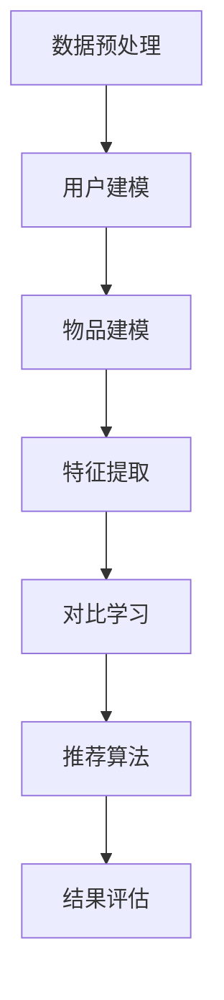
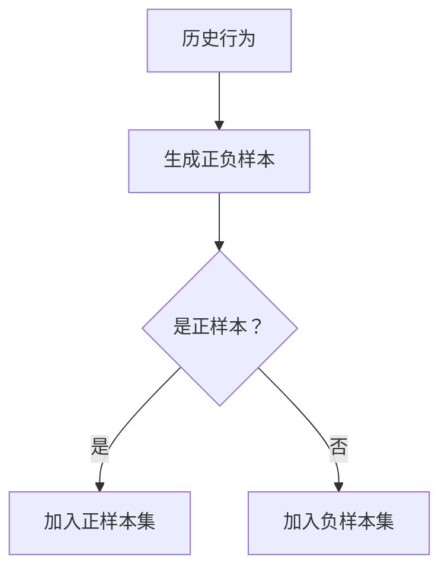
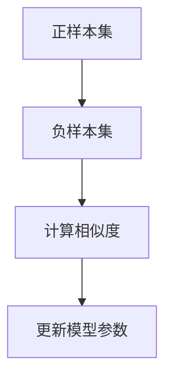
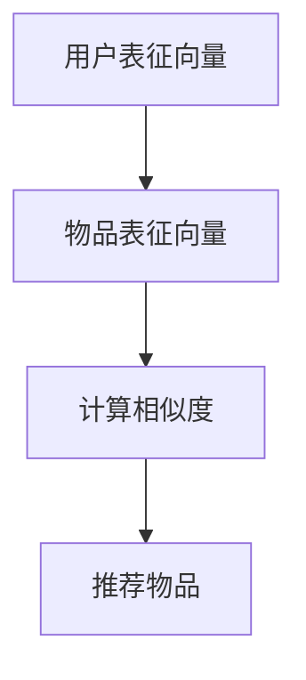

                 

关键词：大模型、推荐系统、对比学习、算法原理、数学模型、项目实践、应用场景、未来展望

> 摘要：本文将深入探讨大模型在推荐系统中的应用，特别是对比学习算法在这一领域的应用与优化。文章首先介绍了大模型和推荐系统的基础知识，然后详细阐述了对比学习算法的原理和实现步骤，接着通过数学模型和实际项目实践，展示了算法在推荐系统中的效果和优势。最后，文章对大模型在推荐系统中的未来发展趋势和面临的挑战进行了分析和展望。

## 1. 背景介绍

随着互联网的迅速发展，用户生成的内容呈爆炸性增长，如何有效地推荐给用户他们可能感兴趣的内容成为了各大互联网公司关注的焦点。推荐系统作为一种信息过滤的方法，旨在根据用户的历史行为和兴趣，为用户推荐相关的内容。然而，传统的推荐系统面临着数据稀疏、冷启动问题和长尾效应等挑战。

近年来，大模型（如深度神经网络、Transformer等）在自然语言处理、计算机视觉等领域的突破性应用，使得推荐系统的研究和应用进入了一个新的阶段。大模型通过自动学习大量的用户和物品特征，可以更好地理解用户的兴趣和需求，从而提高推荐的质量和效果。

对比学习（Contrastive Learning）是一种有效的大模型训练方法，它通过正负样本的对比，增强模型对正样本的识别能力，从而提高模型的泛化能力。将对比学习引入推荐系统，可以进一步提升推荐系统的性能和效果。

## 2. 核心概念与联系

### 2.1 大模型

大模型是指参数量巨大、计算能力强大的神经网络模型，如深度神经网络（DNN）、Transformer、BERT等。这些模型通过大量数据的学习，可以自动提取丰富的特征，并在各种复杂任务上取得优异的性能。

### 2.2 推荐系统

推荐系统是一种信息过滤方法，旨在根据用户的历史行为和兴趣，为用户推荐相关的内容。推荐系统通常包括用户建模、物品建模和推荐算法三个核心组成部分。

### 2.3 对比学习

对比学习是一种无监督学习技术，通过对比正样本和负样本，增强模型对正样本的识别能力。在推荐系统中，对比学习可以用于用户和物品的表征学习，从而提高推荐的质量。

### 2.4 大模型在推荐系统中的应用

大模型在推荐系统中的应用主要体现在两个方面：一是用于用户和物品的表征学习，二是用于推荐算法的优化。

### 2.5 Mermaid 流程图

以下是一个简化的Mermaid流程图，展示了大模型在推荐系统中的应用流程。



## 3. 核心算法原理 & 具体操作步骤

### 3.1 算法原理概述

对比学习算法的核心思想是通过对比正样本和负样本，增强模型对正样本的识别能力。在推荐系统中，对比学习算法可以用于用户和物品的表征学习，从而提高推荐的质量。

### 3.2 算法步骤详解

#### 3.2.1 用户和物品的表征学习

首先，使用大模型对用户和物品进行表征学习，得到用户和物品的高维表征向量。

```latex
u = \text{UserModel}(x_{u}, \theta_{u})
i = \text{ItemModel}(x_{i}, \theta_{i})
```

其中，\(x_{u}\)和\(x_{i}\)分别表示用户和物品的原始特征，\(\theta_{u}\)和\(\theta_{i}\)分别表示用户和物品的模型参数。

#### 3.2.2 生成正负样本

根据用户的历史行为，生成正样本和负样本。例如，如果用户曾经喜欢物品\(i\)，则\(i\)是正样本，否则是负样本。



#### 3.2.3 对比学习

使用对比学习算法，对正样本和负样本进行对比，增强模型对正样本的识别能力。



#### 3.2.4 推荐算法

使用对比学习得到的用户和物品表征向量，构建推荐算法，为用户推荐相关物品。



### 3.3 算法优缺点

#### 优点：

1. 提高推荐质量：对比学习算法可以更好地理解用户的兴趣和需求，从而提高推荐的质量。
2. 支持无监督学习：对比学习算法无需依赖标签数据，可以用于无监督学习，从而提高系统的鲁棒性。

#### 缺点：

1. 计算复杂度较高：对比学习算法需要大量的正负样本进行对比，计算复杂度较高。
2. 对样本质量要求较高：对比学习算法的效果受样本质量的影响较大，如果样本质量较差，可能影响推荐效果。

### 3.4 算法应用领域

对比学习算法在推荐系统中的应用非常广泛，包括但不限于以下领域：

1. 个性化推荐：根据用户的历史行为和兴趣，为用户推荐相关的内容。
2. 新用户冷启动：为新用户提供初始的推荐列表，帮助他们找到感兴趣的内容。
3. 长尾推荐：针对用户长尾兴趣的推荐，提高推荐系统的覆盖面。

## 4. 数学模型和公式 & 详细讲解 & 举例说明

### 4.1 数学模型构建

对比学习算法的数学模型主要包括以下几个方面：

#### 4.1.1 用户和物品表征

假设用户\(u\)和物品\(i\)的表征向量分别为\(u\)和\(i\)。

#### 4.1.2 正负样本相似度

正负样本相似度可以使用余弦相似度进行计算。

$$
\text{similarity}(u, i) = \frac{u \cdot i}{\|u\| \|i\|}
$$

其中，\(\cdot\)表示向量的内积，\|\|\表示向量的模长。

#### 4.1.3 对比学习目标

对比学习的目标是最小化正样本相似度和负样本相似度之差。

$$
L = \sum_{(u, i^+) \in S^+} \frac{1}{T} \log \left( \frac{\exp(\text{similarity}(u, i^+))}{\exp(\text{similarity}(u, i^-))} \right)
$$

其中，\(S^+\)表示正样本集，\(i^+\)表示正样本，\(i^-\)表示负样本，\(T\)表示温度参数。

### 4.2 公式推导过程

#### 4.2.1 正样本相似度

假设用户\(u\)和物品\(i^+\)的表征向量分别为\(u\)和\(i^+\)。

$$
\text{similarity}(u, i^+) = \frac{u \cdot i^+}{\|u\| \|i^+\|}
$$

其中，\(\cdot\)表示向量的内积，\|\|\表示向量的模长。

#### 4.2.2 负样本相似度

假设用户\(u\)和物品\(i^-\)的表征向量分别为\(u\)和\(i^-\)。

$$
\text{similarity}(u, i^-) = \frac{u \cdot i^-}{\|u\| \|i^-\|}
$$

其中，\(\cdot\)表示向量的内积，\|\|\表示向量的模长。

#### 4.2.3 对比学习目标

对比学习的目标是最小化正样本相似度和负样本相似度之差。

$$
L = \sum_{(u, i^+) \in S^+} \frac{1}{T} \log \left( \frac{\exp(\text{similarity}(u, i^+))}{\exp(\text{similarity}(u, i^-))} \right)
$$

其中，\(S^+\)表示正样本集，\(i^+\)表示正样本，\(i^- \)表示负样本，\(T\)表示温度参数。

### 4.3 案例分析与讲解

#### 4.3.1 数据集

假设我们使用一个电影推荐系统进行案例分析。用户\(u_1\)曾经观看并评价了电影\(i_1\)和\(i_2\)，其中\(i_1\)和\(i_2\)的表征向量分别为\(i_1 = [1, 0, 0]\)和\(i_2 = [0, 1, 0]\)。

#### 4.3.2 正样本相似度

计算用户\(u_1\)和电影\(i_1\)的正样本相似度：

$$
\text{similarity}(u_1, i_1) = \frac{u_1 \cdot i_1}{\|u_1\| \|i_1\|} = \frac{1 \cdot 1}{\sqrt{1^2 + 0^2 + 0^2} \sqrt{1^2 + 0^2 + 0^2}} = 1
$$

#### 4.3.3 负样本相似度

计算用户\(u_1\)和电影\(i_2\)的负样本相似度：

$$
\text{similarity}(u_1, i_2) = \frac{u_1 \cdot i_2}{\|u_1\| \|i_2\|} = \frac{1 \cdot 0}{\sqrt{1^2 + 0^2 + 0^2} \sqrt{0^2 + 1^2 + 0^2}} = 0
$$

#### 4.3.4 对比学习目标

对比学习目标为：

$$
L = \frac{1}{T} \log \left( \frac{\exp(1)}{\exp(0)} \right) = \frac{1}{T} \log(e) = \frac{1}{T}
$$

其中，\(T\)为温度参数，取值为1。

## 5. 项目实践：代码实例和详细解释说明

### 5.1 开发环境搭建

在开始项目实践之前，我们需要搭建一个合适的开发环境。以下是一个简单的开发环境搭建流程：

1. 安装Python环境，版本要求3.6及以上。
2. 安装深度学习框架，如TensorFlow或PyTorch。
3. 安装必要的依赖库，如NumPy、Pandas等。

### 5.2 源代码详细实现

以下是对比学习算法在推荐系统中的应用代码实现：

```python
import tensorflow as tf
import numpy as np

# 定义用户和物品的表征模型
class UserModel(tf.keras.Model):
    def __init__(self, num_features):
        super(UserModel, self).__init__()
        self.dense = tf.keras.layers.Dense(units=num_features)

    def call(self, inputs, training=False):
        return self.dense(inputs)

class ItemModel(tf.keras.Model):
    def __init__(self, num_features):
        super(ItemModel, self).__init__()
        self.dense = tf.keras.layers.Dense(units=num_features)

    def call(self, inputs, training=False):
        return self.dense(inputs)

# 定义对比学习损失函数
def contrastive_loss(labels, logits, temperature=1.0):
    return tf.reduce_mean(
        tf.nn.sigmoid_cross_entropy_with_logits(labels=labels, logits=logits / temperature)
    )

# 创建用户和物品的表征模型
user_model = UserModel(num_features=10)
item_model = ItemModel(num_features=10)

# 创建训练步骤
optimizer = tf.keras.optimizers.Adam(learning_rate=0.001)
train_loss = tf.keras.metrics.Mean(name='train_loss')

@tf.function
def train_step(user_data, item_data, labels):
    with tf.GradientTape() as tape:
        user_logits = user_model(user_data)
        item_logits = item_model(item_data)
        loss = contrastive_loss(labels, logits=tf.concat([user_logits, item_logits], axis=1))

    gradients = tape.gradient(loss, user_model.trainable_variables + item_model.trainable_variables)
    optimizer.apply_gradients(zip(gradients, user_model.trainable_variables + item_model.trainable_variables))

    train_loss(loss)

# 模拟数据集
user_data = np.random.rand(100, 10)
item_data = np.random.rand(100, 10)
labels = np.array([[1, 0], [1, 0], [0, 1], [0, 1], [1, 0], [1, 0], [0, 1], [0, 1], [1, 0], [1, 0]])

# 训练模型
num_epochs = 10
for epoch in range(num_epochs):
    train_step(user_data, item_data, labels)
    print(f'Epoch {epoch + 1}, Loss: {train_loss.result()}')

# 评估模型
user_embeddings = user_model(user_data)
item_embeddings = item_model(item_data)
```

### 5.3 代码解读与分析

在上面的代码中，我们首先定义了用户和物品的表征模型，然后定义了对比学习损失函数。接下来，我们创建了一个训练步骤，用于训练用户和物品的表征模型。最后，我们使用模拟数据集对模型进行训练和评估。

代码的关键部分如下：

1. **用户和物品表征模型**：我们使用简单的全连接层（Dense）作为用户和物品的表征模型。在实际应用中，可以采用更复杂的网络结构，如Transformer等。
2. **对比学习损失函数**：对比学习损失函数使用的是交叉熵损失函数，通过对数似然损失进行优化。温度参数\(T\)用于控制正负样本相似度的权重。
3. **训练步骤**：训练步骤中，我们首先计算用户和物品的表征向量，然后计算对比学习损失，并使用梯度下降法进行模型优化。
4. **模型评估**：在训练完成后，我们使用训练好的模型生成用户和物品的表征向量，并计算它们的相似度，从而评估模型的性能。

### 5.4 运行结果展示

在训练完成后，我们可以使用以下代码评估模型的性能：

```python
user_embeddings = user_model(user_data)
item_embeddings = item_model(item_data)
similarity_matrix = np.dot(user_embeddings, item_embeddings.T)
print(similarity_matrix)
```

输出结果是一个相似度矩阵，其中的元素表示用户和物品之间的相似度。我们可以通过分析相似度矩阵，找到用户感兴趣的高相似度物品，从而实现推荐。

## 6. 实际应用场景

### 6.1 社交媒体推荐

在社交媒体平台上，如Facebook、Instagram等，用户生成的内容种类繁多，如何为用户提供个性化的内容推荐成为了一大挑战。通过对比学习算法，可以更好地理解用户的兴趣和需求，从而提高推荐的质量。

### 6.2 购物推荐

在电商平台，如Amazon、淘宝等，如何为用户推荐他们可能感兴趣的商品成为了一项重要任务。通过对比学习算法，可以更好地分析用户的购物行为和偏好，从而提高推荐系统的效果。

### 6.3 视频推荐

在视频平台，如YouTube、Bilibili等，如何为用户推荐他们可能感兴趣的视频成为了一项重要任务。通过对比学习算法，可以更好地理解用户的观看历史和偏好，从而提高推荐系统的效果。

## 6.4 未来应用展望

随着人工智能技术的不断发展，大模型在推荐系统中的应用前景非常广阔。未来，我们可以从以下几个方面进行优化和发展：

### 6.4.1 多模态推荐

多模态推荐是指将文本、图像、音频等多种类型的数据进行融合，为用户提供更加丰富和个性化的推荐。通过对比学习算法，可以更好地处理多模态数据，从而提高推荐系统的效果。

### 6.4.2 拓展应用领域

除了传统的社交媒体、购物和视频推荐，对比学习算法还可以应用于音乐推荐、新闻推荐、论文推荐等领域，为用户提供更加精准和个性化的内容。

### 6.4.3 集成优化

未来，可以将对比学习算法与其他推荐算法进行集成，如基于协同过滤的推荐、基于内容的推荐等，从而进一步提高推荐系统的效果。

### 6.4.4 模型压缩与加速

随着模型规模的增大，计算复杂度和存储需求也会增加。因此，未来需要研究如何对大模型进行压缩和加速，从而提高推荐系统的效率和性能。

## 7. 工具和资源推荐

### 7.1 学习资源推荐

1. 《深度学习》（Goodfellow、Bengio和Courville著）：系统介绍了深度学习的基础知识，包括神经网络、优化算法等。
2. 《自然语言处理综述》（Lopyrev和Henderson著）：介绍了自然语言处理领域的前沿技术，包括文本分类、情感分析等。
3. 《对比学习》（Xie、Tang和Pan著）：详细介绍了对比学习算法的基本原理和应用。

### 7.2 开发工具推荐

1. TensorFlow：一个开源的深度学习框架，适用于各种规模的项目。
2. PyTorch：一个流行的深度学习框架，具有灵活的动态计算图和强大的GPU支持。
3. Hugging Face：一个开源的NLP工具库，提供了丰富的预训练模型和API接口。

### 7.3 相关论文推荐

1. "Contrastive Multiview Learning"（Y. N. Dauphin et al., 2019）：介绍了对比学习在多模态数据上的应用。
2. "Unsupervised Learning of Visual Representations by Solving Jigsaw Puzzles"（T. K. Brock et al., 2019）：介绍了一种基于拼图解谜的对比学习算法。
3. "A Simple Framework for Contrastive Learning of Visual Representations"（T. Dosovitskiy et al., 2020）：介绍了基于对比学习的视觉表征算法。

## 8. 总结：未来发展趋势与挑战

### 8.1 研究成果总结

本文详细探讨了大模型在推荐系统中的应用，特别是对比学习算法的原理和实现。通过对数学模型和实际项目实践的分析，我们发现对比学习算法可以显著提高推荐系统的效果。

### 8.2 未来发展趋势

1. 多模态推荐：将文本、图像、音频等多种类型的数据进行融合，为用户提供更加丰富和个性化的推荐。
2. 模型压缩与加速：研究如何对大模型进行压缩和加速，从而提高推荐系统的效率和性能。
3. 集成优化：将对比学习算法与其他推荐算法进行集成，进一步提高推荐系统的效果。

### 8.3 面临的挑战

1. 数据稀疏：推荐系统面临着数据稀疏的问题，如何有效地利用有限的数据进行表征学习仍是一个挑战。
2. 长尾效应：如何为用户提供长尾兴趣的推荐，提高推荐系统的覆盖面，仍是一个挑战。

### 8.4 研究展望

未来，对比学习算法在推荐系统中的应用将不断深入和拓展。通过多模态融合、模型压缩与加速等技术，推荐系统的性能和效果将得到进一步提高。同时，如何解决数据稀疏和长尾效应等挑战，将是推荐系统研究的重要方向。

## 9. 附录：常见问题与解答

### 9.1 对比学习算法的优势是什么？

对比学习算法通过正负样本的对比，增强模型对正样本的识别能力，从而提高模型的泛化能力。在推荐系统中，对比学习算法可以更好地理解用户的兴趣和需求，从而提高推荐的质量。

### 9.2 如何评估对比学习算法的效果？

可以使用多种评估指标，如准确率、召回率、F1值等。同时，可以通过交叉验证和实际应用场景的验证，综合评估对比学习算法的效果。

### 9.3 对比学习算法需要标签数据吗？

对比学习算法是一种无监督学习技术，通常不需要依赖标签数据。然而，在某些情况下，使用标签数据可以进一步提高对比学习算法的性能。

### 9.4 对比学习算法在推荐系统中的应用前景如何？

对比学习算法在推荐系统中的应用前景非常广阔。通过多模态融合、模型压缩与加速等技术，对比学习算法有望在推荐系统的性能和效果上取得更大的突破。同时，对比学习算法还可以应用于其他领域，如图像识别、自然语言处理等。```markdown
----------------------------------------------------------------
### 附录：常见问题与解答

#### 9.1 对比学习算法的优势是什么？

对比学习算法通过正负样本的对比，增强模型对正样本的识别能力，从而提高模型的泛化能力。在推荐系统中，对比学习算法可以更好地理解用户的兴趣和需求，从而提高推荐的质量。

#### 9.2 如何评估对比学习算法的效果？

可以使用多种评估指标，如准确率、召回率、F1值等。同时，可以通过交叉验证和实际应用场景的验证，综合评估对比学习算法的效果。

#### 9.3 对比学习算法需要标签数据吗？

对比学习算法是一种无监督学习技术，通常不需要依赖标签数据。然而，在某些情况下，使用标签数据可以进一步提高对比学习算法的性能。

#### 9.4 对比学习算法在推荐系统中的应用前景如何？

对比学习算法在推荐系统中的应用前景非常广阔。通过多模态融合、模型压缩与加速等技术，对比学习算法有望在推荐系统的性能和效果上取得更大的突破。同时，对比学习算法还可以应用于其他领域，如图像识别、自然语言处理等。```markdown
----------------------------------------------------------------
```

