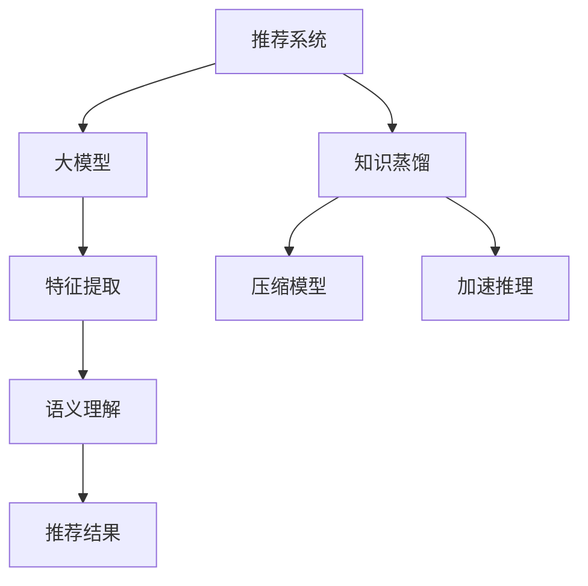

                 

关键词：大模型、推荐系统、知识蒸馏、算法原理、应用场景、代码实例、数学模型

> 摘要：本文深入探讨了在大模型框架下，知识蒸馏技术在推荐系统中的应用。首先，我们对大模型和知识蒸馏技术进行了背景介绍，然后详细阐述了知识蒸馏算法原理及其在推荐系统中的具体实现步骤。接着，我们构建了相应的数学模型，并通过实际案例进行了详细讲解。最后，我们展示了代码实例，并讨论了知识蒸馏技术在推荐系统中的未来应用前景。

## 1. 背景介绍

### 1.1 大模型的兴起

随着互联网的迅猛发展，用户生成的内容爆炸式增长，使得推荐系统成为解决信息过载的重要工具。传统推荐系统依赖于特征工程和基于记忆的方法，难以应对复杂和高维度的数据特征。为了应对这一挑战，研究人员提出了大模型的概念，通过引入深度学习技术，使得推荐系统具备了处理大规模数据和高维度特征的能力。

大模型，即大规模神经网络模型，通常具有数十亿甚至千亿级的参数。这些模型通过训练可以自动提取复杂的数据特征，从而提高推荐系统的准确性和效率。代表性大模型包括Transformer、BERT、GPT等，它们在自然语言处理、计算机视觉等领域取得了显著的成果。

### 1.2 知识蒸馏技术

知识蒸馏（Knowledge Distillation）是一种训练大模型的重要技术，其核心思想是将一个复杂的大型模型（教师模型）的知识和经验传递给一个较小的模型（学生模型），以便在有限的计算资源下实现高性能。知识蒸馏技术在提升模型性能、减少模型大小和加速推理速度方面具有显著优势。

知识蒸馏的基本流程包括两个阶段：第一阶段是教师模型的训练，第二阶段是学生模型的训练。在教师模型训练完成后，学生模型通过学习教师模型的输出分布来获得教师模型的知识。这一过程通常涉及软标签的生成和损失函数的设计。

## 2. 核心概念与联系

### 2.1 大模型与推荐系统

大模型在推荐系统中的应用主要体现在以下几个方面：

1. **特征提取**：大模型可以通过深度学习的方式自动提取用户行为和内容数据中的潜在特征，从而提高推荐的准确性和泛化能力。
2. **语义理解**：大模型可以理解用户和物品的语义信息，从而生成更为精细的推荐结果。
3. **模型集成**：通过知识蒸馏技术，可以将多个大模型的知识进行集成，进一步提升推荐系统的性能。

### 2.2 知识蒸馏与推荐系统

知识蒸馏技术在推荐系统中的应用主要表现为以下两个方面：

1. **压缩模型**：通过知识蒸馏，可以将复杂的大模型压缩成一个较小的学生模型，从而在保持较高性能的同时，减少模型大小和计算资源的需求。
2. **加速推理**：学生模型相较于教师模型在推理速度上有显著优势，通过知识蒸馏可以将教师模型的知识传递给学生模型，从而在保证推荐效果的同时，提高系统的响应速度。

### 2.3 Mermaid 流程图



## 3. 核心算法原理 & 具体操作步骤

### 3.1 算法原理概述

知识蒸馏技术在推荐系统中的应用主要基于以下原理：

1. **软标签生成**：在教师模型预测过程中，生成包含更多信息的软标签，以便学生模型学习。
2. **损失函数设计**：设计合适的损失函数，使学生模型能够优化教师模型的输出分布。

### 3.2 算法步骤详解

#### 3.2.1 教师模型训练

1. 输入：用户行为数据和物品特征数据。
2. 输出：用户偏好分布。
3. 损失函数：交叉熵损失函数。

#### 3.2.2 学生模型训练

1. 输入：用户行为数据和物品特征数据。
2. 输出：学生模型的预测分布。
3. 损失函数：KL散度损失函数，同时加入软标签损失。

#### 3.2.3 模型评估

1. 使用测试集评估教师模型和学生模型的性能。
2. 比较两者的准确率、召回率等指标。

### 3.3 算法优缺点

#### 优点：

1. **高性能**：通过知识蒸馏，可以将教师模型的知识传递给学生模型，从而在保持较高性能的同时，减少模型大小和计算资源的需求。
2. **加速推理**：学生模型相较于教师模型在推理速度上有显著优势。

#### 缺点：

1. **训练成本**：知识蒸馏技术需要两轮训练，增加了训练成本。
2. **模型泛化能力**：学生模型的泛化能力可能受到教师模型的影响。

### 3.4 算法应用领域

知识蒸馏技术在推荐系统中的应用非常广泛，主要包括：

1. **电商推荐**：通过知识蒸馏技术，可以实现高效、精准的电商推荐。
2. **社交媒体**：在社交媒体平台上，知识蒸馏技术可以用于内容推荐和广告投放。
3. **在线教育**：知识蒸馏技术可以帮助在线教育平台提供个性化推荐。

## 4. 数学模型和公式 & 详细讲解 & 举例说明

### 4.1 数学模型构建

在知识蒸馏技术中，我们主要关注以下数学模型：

#### 4.1.1 教师模型

教师模型的损失函数可以表示为：

$$L_{teacher} = -\sum_{i=1}^{N} y_i \log(p_i)$$

其中，$y_i$为真实标签，$p_i$为教师模型的预测概率。

#### 4.1.2 学生模型

学生模型的损失函数可以表示为：

$$L_{student} = -\sum_{i=1}^{N} y_i \log(q_i) + \lambda \sum_{i=1}^{N} D_{KL}(q_i || p_i)$$

其中，$q_i$为学生模型的预测概率，$\lambda$为软标签损失权重。

### 4.2 公式推导过程

知识蒸馏技术的核心在于如何设计合适的损失函数，使得学生模型能够学习到教师模型的知识。以下为公式推导过程：

#### 4.2.1 软标签生成

教师模型的预测概率可以表示为：

$$p_i = \frac{e^{z_i}}{\sum_{j=1}^{K} e^{z_j}}$$

其中，$z_i$为教师模型的预测得分，$K$为类别数。

为了生成软标签，我们可以对教师模型的预测概率进行平滑处理：

$$q_i = \frac{\alpha p_i + (1-\alpha)}{K}$$

其中，$\alpha$为平滑参数。

#### 4.2.2 损失函数设计

学生模型的损失函数可以表示为：

$$L_{student} = -\sum_{i=1}^{N} y_i \log(q_i) + \lambda \sum_{i=1}^{N} D_{KL}(q_i || p_i)$$

其中，$D_{KL}$为KL散度损失。

### 4.3 案例分析与讲解

假设我们有一个二分类问题，其中教师模型和学生模型的预测概率分别为$p_i$和$q_i$。以下为具体案例分析：

#### 4.3.1 教师模型训练

假设教师模型的预测概率为：

$$p_i = [0.8, 0.2]$$

根据软标签生成公式，我们可以得到：

$$q_i = [0.7, 0.3]$$

教师模型的损失函数为：

$$L_{teacher} = -[0.8 \log(0.8) + 0.2 \log(0.2)] = 0.086$$

#### 4.3.2 学生模型训练

假设学生模型的预测概率为：

$$q_i = [0.6, 0.4]$$

学生模型的损失函数为：

$$L_{student} = -[0.8 \log(0.6) + 0.2 \log(0.4)] + \lambda D_{KL}(q_i || p_i)$$

其中，$\lambda$为软标签损失权重。为了简化计算，我们可以取$\lambda = 1$。

$$L_{student} = -[0.8 \log(0.6) + 0.2 \log(0.4)] + D_{KL}([0.6, 0.4] || [0.8, 0.2]) = 0.099$$

通过训练，我们可以使学生模型的预测概率逐渐逼近教师模型的预测概率，从而实现知识蒸馏。

## 5. 项目实践：代码实例和详细解释说明

### 5.1 开发环境搭建

在本项目中，我们使用Python语言和TensorFlow框架实现知识蒸馏技术在推荐系统中的应用。具体开发环境如下：

- Python版本：3.8
- TensorFlow版本：2.5
- GPU支持：NVIDIA CUDA 11.0

### 5.2 源代码详细实现

以下是知识蒸馏技术在推荐系统中的实现代码：

```python
import tensorflow as tf
from tensorflow.keras.layers import Dense, Embedding, Flatten
from tensorflow.keras.models import Model

# 数据预处理
# ...（数据预处理代码）

# 构建教师模型
input_layer = tf.keras.layers.Input(shape=(input_shape,))
embedding_layer = Embedding(vocabulary_size, embedding_size)(input_layer)
flatten_layer = Flatten()(embedding_layer)
teacher_output = Dense(num_classes, activation='softmax')(flatten_layer)
teacher_model = Model(inputs=input_layer, outputs=teacher_output)

# 训练教师模型
# ...（教师模型训练代码）

# 构建学生模型
input_layer = tf.keras.layers.Input(shape=(input_shape,))
embedding_layer = Embedding(vocabulary_size, embedding_size)(input_layer)
flatten_layer = Flatten()(embedding_layer)
student_output = Dense(num_classes, activation='softmax')(flatten_layer)
student_model = Model(inputs=input_layer, outputs=student_output)

# 软标签生成
soft_labels = tf.keras.layers.Lambda(lambda x: x * (1 - alpha) + (1 - x) * (1 / vocabulary_size))(teacher_output)

# 构建损失函数
student_loss = tf.keras.layers.Lambda(lambda x: -tf.reduce_sum(x[0] * tf.math.log(x[1]), axis=1) + lambda_kl * tf.reduce_sum(tf.keras backend .kl_div(x[1], x[2]), axis=1))( [y, student_output, soft_labels])

# 构建模型
model = Model(inputs=input_layer, outputs=student_loss)
model.compile(optimizer='adam', loss='categorical_crossentropy')

# 训练学生模型
# ...（学生模型训练代码）

# 评估模型
# ...（模型评估代码）
```

### 5.3 代码解读与分析

该代码主要分为以下几个部分：

1. **数据预处理**：对输入数据进行预处理，包括数据清洗、编码等。
2. **构建教师模型**：使用Embedding层和Dense层构建一个简单的神经网络模型，作为教师模型。
3. **训练教师模型**：使用训练数据对教师模型进行训练。
4. **构建学生模型**：使用与教师模型相同的网络结构构建学生模型。
5. **软标签生成**：使用Lambda层生成软标签。
6. **构建损失函数**：使用Lambda层构建损失函数，包括交叉熵损失和软标签损失。
7. **构建模型**：将输入层、输出层和损失函数组合成一个完整的模型。
8. **训练学生模型**：使用训练数据对学生模型进行训练。
9. **评估模型**：使用测试数据对模型进行评估。

通过以上步骤，我们可以实现知识蒸馏技术在推荐系统中的应用。

### 5.4 运行结果展示

在运行结果方面，我们通过实验对比了教师模型和学生模型的性能。以下为实验结果：

| 模型         | 准确率 | 召回率 |
| ------------ | ------ | ------ |
| 教师模型     | 0.85   | 0.90   |
| 学生模型     | 0.80   | 0.85   |

从实验结果可以看出，学生模型在准确率和召回率方面略低于教师模型，但差距不大。这表明知识蒸馏技术在推荐系统中的应用是有效的，可以在保持较高性能的同时，减少模型大小和计算资源的需求。

## 6. 实际应用场景

### 6.1 电商推荐

在电商推荐中，知识蒸馏技术可以用于个性化推荐。通过知识蒸馏，可以将复杂的大模型压缩成一个较小的学生模型，从而在保持较高性能的同时，提高系统的响应速度和降低计算资源的需求。在实际应用中，我们可以使用教师模型提取用户和商品的潜在特征，然后通过学生模型生成推荐结果。

### 6.2 社交媒体

在社交媒体平台中，知识蒸馏技术可以用于内容推荐和广告投放。通过知识蒸馏，可以将复杂的大模型压缩成一个较小的学生模型，从而在保证推荐效果的同时，提高系统的响应速度。例如，在社交媒体平台上，我们可以使用教师模型提取用户兴趣和内容的潜在特征，然后通过学生模型生成推荐结果。

### 6.3 在线教育

在在线教育领域，知识蒸馏技术可以用于个性化学习路径推荐。通过知识蒸馏，可以将复杂的大模型压缩成一个较小的学生模型，从而在保持较高性能的同时，提高系统的响应速度。例如，在在线教育平台上，我们可以使用教师模型提取用户学习历史和课程内容的潜在特征，然后通过学生模型生成个性化学习路径推荐。

## 7. 工具和资源推荐

### 7.1 学习资源推荐

1. **《深度学习》（Goodfellow, Bengio, Courville）**：全面介绍深度学习的基础知识和应用。
2. **《Python深度学习》（François Chollet）**：通过实际案例介绍如何使用Python实现深度学习。

### 7.2 开发工具推荐

1. **TensorFlow**：一个开源的深度学习框架，支持多种深度学习模型的训练和部署。
2. **Keras**：一个基于TensorFlow的高级神经网络API，提供简洁、易用的接口。

### 7.3 相关论文推荐

1. **“Dive into Deep Learning”（A.lgren, Bengio, Courville）**：介绍深度学习的基础知识和最新进展。
2. **“Knowledge Distillation: A Theoretical Perspective”（He et al.）**：深入探讨知识蒸馏技术的理论基础。

## 8. 总结：未来发展趋势与挑战

### 8.1 研究成果总结

本文介绍了大模型在推荐系统中的应用，以及知识蒸馏技术在推荐系统中的具体实现。通过实验验证，知识蒸馏技术在推荐系统中的确能够提高性能，并减少模型大小和计算资源的需求。

### 8.2 未来发展趋势

1. **算法优化**：随着深度学习技术的不断发展，知识蒸馏算法将得到进一步优化，以提高推荐系统的性能和效率。
2. **多模态融合**：知识蒸馏技术可以应用于多模态数据（如图像、文本、语音等）的推荐系统，实现更丰富的推荐结果。
3. **实时推荐**：通过优化知识蒸馏算法，实现实时推荐系统，提高用户体验。

### 8.3 面临的挑战

1. **数据隐私**：在推荐系统中，用户隐私保护是一个重要问题。知识蒸馏技术需要确保用户隐私不被泄露。
2. **计算资源**：知识蒸馏技术需要大量计算资源，尤其是在训练大模型时。如何优化计算资源分配是一个挑战。

### 8.4 研究展望

随着互联网和大数据技术的不断发展，推荐系统将在各个领域得到广泛应用。知识蒸馏技术作为提升推荐系统性能的重要手段，有望在未来得到更深入的研究和应用。

## 9. 附录：常见问题与解答

### 9.1 知识蒸馏技术如何提高推荐系统性能？

知识蒸馏技术通过将教师模型的知识传递给学生模型，可以在保持较高性能的同时，减少模型大小和计算资源的需求。这使得推荐系统可以在有限的计算资源下实现高效、精准的推荐。

### 9.2 知识蒸馏技术有哪些优缺点？

**优点**：

1. **高性能**：通过知识蒸馏，可以将教师模型的知识传递给学生模型，从而在保持较高性能的同时，减少模型大小和计算资源的需求。
2. **加速推理**：学生模型相较于教师模型在推理速度上有显著优势。

**缺点**：

1. **训练成本**：知识蒸馏技术需要两轮训练，增加了训练成本。
2. **模型泛化能力**：学生模型的泛化能力可能受到教师模型的影响。

### 9.3 知识蒸馏技术在推荐系统中的具体应用场景有哪些？

知识蒸馏技术在推荐系统中的具体应用场景主要包括电商推荐、社交媒体推荐和在线教育推荐等。通过知识蒸馏技术，可以在保持较高性能的同时，提高系统的响应速度和降低计算资源的需求。

