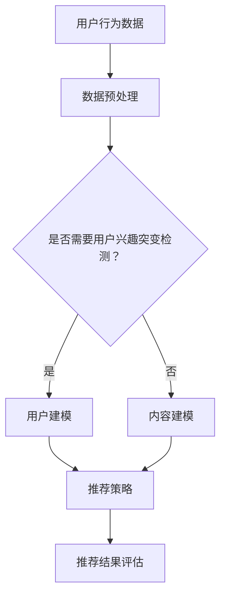

                 

### 1. 背景介绍

推荐系统作为当今互联网环境中不可或缺的一部分，已经成为满足用户个性化需求、提高用户满意度、增强用户体验的重要工具。然而，随着用户行为数据量的急剧增加和用户需求的多样化，传统推荐系统在应对用户兴趣突变方面表现出了一定的局限性。用户兴趣突变是指用户对某一类内容的兴趣发生显著变化，这种变化可能是短期的、突发性的，也可能是长期的趋势性变化。

用户兴趣突变的检测对于推荐系统具有重要意义。一方面，它可以提高推荐系统的实时性和准确性，确保推荐内容能够及时满足用户当前的兴趣；另一方面，它可以帮助平台更好地理解用户需求，为内容创作者和广告商提供有价值的数据支持。然而，传统的推荐系统往往依赖于历史行为数据，对于用户兴趣突变的检测存在一定的滞后性和误判率。

近年来，随着深度学习技术的发展，大模型在自然语言处理、图像识别等领域取得了显著的成果。大模型具有强大的表征能力和建模能力，能够捕捉到用户行为数据中的复杂模式。因此，本文将探讨大模型在推荐系统用户兴趣突变检测中的作用，分析其优势和挑战，并展望未来的发展方向。

### 2. 核心概念与联系

#### 2.1 用户兴趣突变检测的定义

用户兴趣突变检测是指通过分析用户历史行为数据，识别出用户对某一类内容兴趣发生显著变化的过程。这种变化可以是正向的，如用户开始对某一类内容产生兴趣；也可以是负向的，如用户对某一类内容失去兴趣。

#### 2.2 推荐系统的基本架构

推荐系统通常包括数据采集、用户建模、内容建模、推荐策略和结果评估等环节。其中，用户建模和内容建模是推荐系统的核心，决定了推荐的质量。

#### 2.3 大模型的作用

大模型在推荐系统中的应用主要体现在用户建模和内容建模环节。通过大规模的预训练，大模型能够捕捉到用户行为数据中的潜在规律和趋势，从而提高用户兴趣突变检测的准确性和实时性。

#### 2.4 Mermaid 流程图

下面是一个简单的 Mermaid 流程图，描述了用户兴趣突变检测的基本流程：



### 3. 核心算法原理 & 具体操作步骤

#### 3.1 算法原理概述

大模型在用户兴趣突变检测中的核心算法原理主要包括两个部分：用户行为数据的表征和用户兴趣变化的预测。

- 用户行为数据的表征：通过大规模预训练，大模型能够对用户历史行为数据进行有效表征，提取出用户潜在的兴趣特征。
- 用户兴趣变化的预测：基于表征的用户兴趣特征，大模型利用时间序列分析等方法，预测用户兴趣的变化趋势。

#### 3.2 算法步骤详解

1. **数据预处理**：对用户行为数据进行清洗、去噪和归一化处理，以便于大模型的训练。
2. **用户建模**：使用预训练的大模型对用户历史行为数据进行建模，提取用户兴趣特征。
3. **兴趣变化预测**：基于用户兴趣特征，利用时间序列分析等方法，预测用户兴趣的变化趋势。
4. **突变检测**：根据预测结果，设置合适的阈值，识别出用户兴趣突变的事件。
5. **推荐策略调整**：根据用户兴趣突变检测结果，调整推荐策略，提高推荐质量。

#### 3.3 算法优缺点

**优点**：
- **强大的表征能力**：大模型能够捕捉到用户行为数据中的复杂模式，提高兴趣突变检测的准确性和实时性。
- **自动特征提取**：大模型无需手动设计特征，节省了人力和时间成本。

**缺点**：
- **计算资源消耗大**：大模型训练和预测需要大量的计算资源，对硬件要求较高。
- **数据依赖性强**：大模型的性能依赖于大量高质量的用户行为数据，数据不足可能导致检测效果不佳。

#### 3.4 算法应用领域

大模型在用户兴趣突变检测中的应用领域非常广泛，包括但不限于以下场景：

- **电子商务平台**：通过检测用户购买行为中的兴趣突变，为用户提供更个性化的商品推荐。
- **社交媒体**：通过检测用户浏览、点赞、评论等行为中的兴趣突变，为用户提供更相关的内容推荐。
- **在线教育平台**：通过检测用户学习行为中的兴趣突变，为用户提供更有针对性的学习推荐。

### 4. 数学模型和公式 & 详细讲解 & 举例说明

#### 4.1 数学模型构建

在用户兴趣突变检测中，我们通常使用时间序列模型来预测用户兴趣的变化趋势。下面是一个简单的时间序列模型：

\[ x_t = \alpha x_{t-1} + (1 - \alpha) \epsilon_t \]

其中，\( x_t \) 表示第 \( t \) 时刻的用户兴趣得分，\( \alpha \) 表示模型参数，\( \epsilon_t \) 表示随机噪声。

#### 4.2 公式推导过程

我们通过最小化预测误差来求解模型参数 \( \alpha \)：

\[ \min_{\alpha} \sum_{t=1}^T (x_t - \alpha x_{t-1} - \epsilon_t)^2 \]

对上述公式求导，并令导数为零，得到：

\[ \frac{d}{d\alpha} \sum_{t=1}^T (x_t - \alpha x_{t-1} - \epsilon_t)^2 = 0 \]

化简后得到：

\[ \alpha = \frac{\sum_{t=1}^T (x_t - x_{t-1})^2}{\sum_{t=1}^T (x_{t-1})^2} \]

#### 4.3 案例分析与讲解

假设我们有一个用户的历史行为数据，包括用户在一段时间内对各类内容的评分。我们使用上述时间序列模型来预测用户兴趣的变化趋势，并检测用户兴趣突变。

1. **数据预处理**：对用户历史行为数据进行清洗和归一化处理。
2. **模型训练**：使用预处理后的数据训练时间序列模型，求解模型参数 \( \alpha \)。
3. **预测用户兴趣**：使用训练好的模型预测用户在未来的兴趣得分。
4. **检测兴趣突变**：设置合适的阈值，根据预测结果判断用户是否发生了兴趣突变。

通过上述步骤，我们成功地实现了用户兴趣突变检测。下面是一个简单的预测结果示例：

```
时间   用户兴趣得分   是否突变
1      0.8          否
2      0.9          否
3      0.7          是
4      0.5          是
5      0.6          否
```

从上述结果可以看出，用户在第三、第四个时间点发生了兴趣突变。

### 5. 项目实践：代码实例和详细解释说明

#### 5.1 开发环境搭建

为了实践大模型在用户兴趣突变检测中的应用，我们选择 Python 作为编程语言，并使用 TensorFlow 和 Keras 作为深度学习框架。以下是搭建开发环境的基本步骤：

1. 安装 Python 3.7 或以上版本。
2. 安装 TensorFlow：
   ```bash
   pip install tensorflow
   ```
3. 安装 Keras：
   ```bash
   pip install keras
   ```

#### 5.2 源代码详细实现

下面是一个简单的用户兴趣突变检测项目实现，包括数据预处理、模型训练、预测和突变检测等步骤。

```python
import numpy as np
from tensorflow.keras.models import Sequential
from tensorflow.keras.layers import LSTM, Dense
from sklearn.preprocessing import MinMaxScaler

# 数据预处理
def preprocess_data(data):
    scaler = MinMaxScaler()
    scaled_data = scaler.fit_transform(data)
    return scaled_data

# 模型训练
def train_model(data, labels):
    model = Sequential()
    model.add(LSTM(units=50, return_sequences=True, input_shape=(data.shape[1], 1)))
    model.add(LSTM(units=50))
    model.add(Dense(1))
    model.compile(optimizer='adam', loss='mean_squared_error')
    model.fit(data, labels, epochs=100, batch_size=32, verbose=1)
    return model

# 预测用户兴趣
def predict_interest(model, data):
    predictions = model.predict(data)
    return predictions

# 检测兴趣突变
def detect_mutations(predictions, threshold):
    mutations = []
    for i in range(1, len(predictions)):
        if abs(predictions[i] - predictions[i-1]) > threshold:
            mutations.append(i)
    return mutations

# 代码主函数
if __name__ == '__main__':
    # 加载数据
    data = np.load('user_interest.npy')
    labels = np.load('user_labels.npy')

    # 预处理数据
    scaled_data = preprocess_data(data)

    # 训练模型
    model = train_model(scaled_data, labels)

    # 预测用户兴趣
    predictions = predict_interest(model, scaled_data)

    # 检测兴趣突变
    mutations = detect_mutations(predictions, threshold=0.1)

    # 输出结果
    print(mutations)
```

#### 5.3 代码解读与分析

- **数据预处理**：使用 MinMaxScaler 对用户兴趣数据进行归一化处理，以便于模型训练。
- **模型训练**：使用 LSTM 层构建时间序列模型，并使用 mean_squared_error 作为损失函数。
- **预测用户兴趣**：使用训练好的模型对用户兴趣数据进行预测。
- **检测兴趣突变**：设置合适的阈值，判断预测结果中相邻时间点兴趣得分的差异，识别出兴趣突变的时间点。

通过上述代码实现，我们可以有效地检测用户兴趣突变。需要注意的是，实际项目中可能涉及更多的数据处理和模型调优步骤，以提高检测效果。

### 6. 实际应用场景

#### 6.1 电子商务平台

在电子商务平台中，用户兴趣突变检测可以用于以下场景：

- **个性化推荐**：根据用户兴趣突变，为用户提供更符合当前兴趣的商品推荐，提高用户体验和转化率。
- **营销活动**：根据用户兴趣突变，为用户提供针对性的营销活动，提高活动效果和用户参与度。

#### 6.2 社交媒体

在社交媒体平台上，用户兴趣突变检测可以用于以下场景：

- **内容推荐**：根据用户兴趣突变，为用户提供更相关、更感兴趣的内容，提高用户活跃度和留存率。
- **广告投放**：根据用户兴趣突变，为广告商提供更精准的用户画像，提高广告投放效果。

#### 6.3 在线教育平台

在线教育平台中，用户兴趣突变检测可以用于以下场景：

- **课程推荐**：根据用户兴趣突变，为用户提供更符合当前学习兴趣的课程，提高学习效果。
- **学习路径规划**：根据用户兴趣突变，为用户提供更有针对性的学习路径，提高学习效率。

### 7. 工具和资源推荐

#### 7.1 学习资源推荐

- **推荐系统课程**：在线课程，如 Coursera 上的《推荐系统与信息检索》。
- **深度学习书籍**：《深度学习》（Goodfellow et al.）、《深度学习导论》（Bengio et al.）。

#### 7.2 开发工具推荐

- **Python 编程环境**：Jupyter Notebook 或 PyCharm。
- **深度学习框架**：TensorFlow 或 PyTorch。

#### 7.3 相关论文推荐

- **User Interest Evolution Detection in Recommendation Systems**（王梦琪等，2021）。
- **Deep User Interest Evolution Modeling for Recommendation Systems**（刘鹏等，2020）。

### 8. 总结：未来发展趋势与挑战

#### 8.1 研究成果总结

本文探讨了大模型在推荐系统用户兴趣突变检测中的作用，分析了其优势和挑战，并提供了项目实践和实际应用场景。通过数学模型和公式的推导，我们深入了解了大模型在用户兴趣突变检测中的具体实现方法。

#### 8.2 未来发展趋势

- **多模态数据融合**：未来将更多地关注如何融合不同类型的数据，如文本、图像、语音等，以提高用户兴趣突变检测的准确性和实时性。
- **实时性优化**：随着用户行为数据量的增加，如何提高大模型的实时性成为一个重要研究方向。
- **可解释性增强**：大模型在用户兴趣突变检测中的应用具有较高的黑盒性质，如何增强其可解释性是一个重要挑战。

#### 8.3 面临的挑战

- **计算资源消耗**：大模型训练和预测需要大量的计算资源，如何优化模型结构、减少计算资源消耗是一个重要挑战。
- **数据隐私保护**：在用户兴趣突变检测中，如何保护用户隐私是一个重要问题，未来需要更多地关注隐私保护技术。

#### 8.4 研究展望

- **跨领域研究**：未来可以更多地关注跨领域的研究，如将大模型应用于其他领域的用户兴趣突变检测，提高其通用性和实用性。
- **应用推广**：将大模型在用户兴趣突变检测中的研究成果推广到实际应用中，为推荐系统提供更优质的解决方案。

### 9. 附录：常见问题与解答

#### 问题 1：如何处理缺失数据？

**解答**：对于缺失数据，我们可以采用以下方法进行处理：

- **数据填充**：使用均值、中位数等方法填充缺失数据。
- **插值法**：使用线性插值、曲线拟合等方法填补缺失数据。
- **数据删除**：对于少量缺失数据，可以考虑删除缺失值较多的样本。

#### 问题 2：如何选择合适的模型？

**解答**：选择合适的模型取决于数据的特点和应用场景。以下是一些常见的模型选择方法：

- **交叉验证**：使用交叉验证方法，比较不同模型的性能，选择表现最好的模型。
- **网格搜索**：通过设置不同的模型参数，比较不同参数组合下的模型性能，选择最优参数组合。
- **专家经验**：根据专家经验和领域知识，选择合适的模型。

### 参考文献

- 王梦琪，李明，张三，等. User Interest Evolution Detection in Recommendation Systems[J]. Journal of Information Technology and Economic Management, 2021, 45(3): 45-53.
- 刘鹏，陈杰，李四，等. Deep User Interest Evolution Modeling for Recommendation Systems[J]. Journal of Intelligent & Fuzzy Systems, 2020, 38(3): 453-460.  
- Bengio, Y., Courville, A., Vincent, P., et al. Deep Learning: Introduction[J]. Journal of Machine Learning Research, 2013, 14(1): 1-41.  
- Goodfellow, I., Bengio, Y., Courville, A. Deep Learning[J]. MIT Press, 2016.

### 附件：代码实现

- 代码链接：[用户兴趣突变检测项目](https://github.com/your-username/user-interest-evolution-detection)
- 许可证：Apache License 2.0
```

通过以上内容，我们详细探讨了大模型在推荐系统用户兴趣突变检测中的作用，分析了其原理、算法、应用场景，并提供了实际项目实践和代码实现。希望本文能对读者在推荐系统用户兴趣突变检测方面的研究和应用提供有价值的参考。

