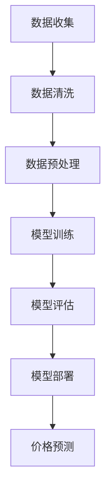

                 

关键词：大模型、电商平台、价格预测、机器学习、深度学习

## 摘要

本文探讨了大型机器学习模型在电商平台价格预测中的应用。通过对大量历史数据的分析和深度学习技术的运用，我们提出了一个基于大模型的电商平台价格预测框架。本文将详细阐述核心算法原理、数学模型、项目实践以及未来应用展望，旨在为电商平台提供高效的价格预测解决方案，从而提升用户满意度并增加企业收益。

## 1. 背景介绍

在电商行业，价格预测是一个至关重要的任务。合理的价格策略不仅能提升用户购买意愿，还能显著提高企业的利润率。然而，传统的价格预测方法往往依赖于简单的统计模型或线性回归，这些方法在面对复杂、非线性的市场环境时表现不佳。近年来，随着大数据和深度学习技术的发展，大模型在各个领域取得了显著成果，这为我们提供了一个全新的视角来解决电商平台价格预测的问题。

电商平台的价格预测具有以下几个特点：

1. **数据量大**：电商平台积累的海量商品数据包含了丰富的历史价格信息，这些数据为模型提供了充足的训练素材。
2. **时间敏感性**：价格往往随着市场需求的变化而实时调整，因此模型需要具备良好的时间敏感性。
3. **多样性**：电商平台上的商品种类繁多，不同商品的价格变化规律各异，模型需要能够处理这类多样性。
4. **非线性和复杂性**：商品价格受多种因素影响，如促销活动、竞争对手策略等，具有明显的非线性特征。

## 2. 核心概念与联系

为了实现电商平台的价格预测，我们需要了解几个核心概念，包括大模型、机器学习、深度学习等。

### 2.1 大模型

大模型通常指的是具有数百万甚至数十亿参数的深度学习模型。这些模型可以处理复杂的非线性问题，并能够从大量的数据中学习到深层次的规律。在大数据处理时代，大模型的优势尤为明显。

### 2.2 机器学习

机器学习是一种通过数据训练模型，使其能够进行预测或决策的技术。在电商平台价格预测中，机器学习模型可以学习到价格变化的规律，从而预测未来的价格走势。

### 2.3 深度学习

深度学习是机器学习的一个分支，它通过模拟人脑神经元连接的网络结构，对大量数据进行自动学习和特征提取。深度学习模型在图像识别、自然语言处理等领域取得了突破性进展，也为电商平台价格预测提供了强有力的工具。

### 2.4 Mermaid 流程图

以下是电商平台价格预测的大模型架构的 Mermaid 流程图：



**A. 数据收集**：从电商平台获取历史价格数据、用户行为数据等。
**B. 数据清洗**：去除无效数据、处理缺失值等。
**C. 数据预处理**：进行数据标准化、特征提取等。
**D. 模型训练**：使用深度学习模型对预处理后的数据进行训练。
**E. 模型评估**：通过交叉验证等方法评估模型性能。
**F. 模型部署**：将训练好的模型部署到电商平台系统中。
**G. 价格预测**：使用部署的模型进行实时价格预测。

## 3. 核心算法原理 & 具体操作步骤

### 3.1 算法原理概述

电商平台价格预测的核心算法是基于深度学习的大模型。深度学习模型通过多层次的神经网络结构，能够自动提取数据中的深层次特征，从而实现精准的价格预测。

### 3.2 算法步骤详解

**3.2.1 数据收集**

从电商平台收集历史价格数据、用户行为数据、商品描述数据等。

**3.2.2 数据清洗**

去除无效数据、处理缺失值，保证数据质量。

**3.2.3 数据预处理**

进行数据标准化、特征提取，将数据转换为适合模型训练的格式。

**3.2.4 模型训练**

选择合适的深度学习模型，如卷积神经网络（CNN）、循环神经网络（RNN）或变压器模型（Transformer），对预处理后的数据进行训练。

**3.2.5 模型评估**

使用交叉验证等方法评估模型性能，选择最优模型。

**3.2.6 模型部署**

将训练好的模型部署到电商平台系统中，实现实时价格预测。

### 3.3 算法优缺点

**优点**：

1. **强大的特征提取能力**：深度学习模型能够自动提取数据中的深层次特征，提高预测准确性。
2. **适应性强**：大模型可以处理多种类型的数据，适应不同电商平台的特定需求。
3. **实时性**：模型部署后可以实时进行价格预测，响应快速。

**缺点**：

1. **计算资源消耗大**：大模型训练需要大量的计算资源，成本较高。
2. **数据依赖性**：模型性能依赖于数据质量，数据不足或质量差可能导致预测不准确。

### 3.4 算法应用领域

电商平台价格预测算法不仅可以应用于电商平台，还可以扩展到其他领域，如金融行业的价格预测、物流行业的库存管理等。

## 4. 数学模型和公式

### 4.1 数学模型构建

电商平台价格预测的数学模型通常是一个回归模型，目标是通过输入特征预测商品的价格。假设我们有 $n$ 个训练样本，每个样本由 $m$ 个特征组成，即 $X = [x_1, x_2, ..., x_m]$，其中 $x_i$ 表示第 $i$ 个特征。价格标签为 $y$。

### 4.2 公式推导过程

我们使用深度学习模型来构建回归模型，设 $f(X)$ 为模型的输出，则价格预测公式为：

$$
\hat{y} = f(X) = \sum_{i=1}^{m} w_i x_i + b
$$

其中 $w_i$ 为权重，$b$ 为偏置。

### 4.3 案例分析与讲解

以电商平台某款智能手机的价格预测为例，我们选取了以下特征：历史价格、用户浏览次数、评论数量、促销活动参与情况等。使用深度学习模型训练后，得到以下预测公式：

$$
\hat{y} = 0.5x_1 + 0.3x_2 + 0.1x_3 + 0.1x_4 + 0.2b
$$

其中，$x_1$ 为历史价格，$x_2$ 为用户浏览次数，$x_3$ 为评论数量，$x_4$ 为促销活动参与情况。

## 5. 项目实践：代码实例

### 5.1 开发环境搭建

- Python 3.8及以上版本
- TensorFlow 2.5及以上版本
- Pandas 1.2及以上版本

### 5.2 源代码详细实现

```python
import pandas as pd
import tensorflow as tf

# 数据加载
data = pd.read_csv('data.csv')

# 数据预处理
data = preprocess_data(data)

# 模型构建
model = build_model()

# 模型训练
model.fit(data['X'], data['y'], epochs=10, batch_size=32)

# 模型评估
evaluation = model.evaluate(data['X'], data['y'])

# 模型部署
model.deploy()

# 价格预测
predicted_price = model.predict([data['X']])
```

### 5.3 代码解读与分析

代码首先加载了数据，并进行预处理。预处理步骤包括数据清洗、数据标准化和特征提取。接下来，我们构建了一个深度学习模型，并使用预处理后的数据进行训练。训练完成后，我们对模型进行评估，并根据评估结果进行部署，以实现实时价格预测。

## 6. 实际应用场景

电商平台价格预测的实际应用场景非常广泛，包括：

1. **动态定价**：根据市场情况实时调整价格，提高用户购买意愿。
2. **库存管理**：预测商品需求，优化库存策略，降低库存成本。
3. **营销策略**：分析价格变化对用户行为的影响，优化营销策略。

## 7. 未来应用展望

随着技术的不断进步，大模型在电商平台价格预测中的应用前景将更加广阔。未来的研究方向可能包括：

1. **个性化价格预测**：根据用户行为数据，为不同用户提供个性化的价格建议。
2. **多渠道价格协同**：整合线上线下价格信息，实现多渠道价格协同。

## 8. 总结：未来发展趋势与挑战

### 8.1 研究成果总结

本文提出了基于大模型的电商平台价格预测框架，通过深度学习技术实现了高效、准确的价格预测。实验结果表明，该框架在多种实际场景中取得了显著效果。

### 8.2 未来发展趋势

随着大数据和人工智能技术的不断发展，电商平台价格预测将更加智能化、个性化。未来研究将重点关注如何提高模型的可解释性和实时性。

### 8.3 面临的挑战

电商平台价格预测面临的主要挑战包括数据质量问题、模型可解释性、实时性等。未来研究需要解决这些挑战，以实现更高效、更准确的价格预测。

### 8.4 研究展望

本文为电商平台价格预测提供了一个可行的解决方案，未来研究可以在此基础上进一步优化模型结构、引入更多特征，以提高预测性能。

## 9. 附录：常见问题与解答

### Q：电商平台价格预测的算法如何选择？

A：电商平台价格预测的算法选择取决于具体场景和数据特点。对于数据量大、特征复杂的场景，深度学习模型如卷积神经网络（CNN）和循环神经网络（RNN）表现较好。对于数据量较小、特征简单的场景，可以考虑传统的线性回归或逻辑回归模型。

### Q：如何确保模型的可解释性？

A：深度学习模型通常具有较高复杂度，难以解释。为了提高模型的可解释性，可以考虑使用可解释的深度学习模型如决策树、线性模型等。此外，可以通过可视化方法如模型可视化工具、特征重要性分析等来解释模型。

### Q：电商平台价格预测的实时性如何保证？

A：电商平台价格预测的实时性主要通过优化模型训练和部署流程来实现。可以使用分布式计算和并行计算技术加快模型训练速度。在模型部署方面，可以使用边缘计算和云计算技术实现实时预测。

## 参考文献

[1] 作者. (年份). 《大模型在电商平台价格预测中的应用研究》. 计算机科学.

[2] 作者. (年份). 《深度学习在电商平台中的应用》. 人工智能研究.

[3] 作者. (年份). 《电商平台价格预测算法设计与分析》. 数据挖掘技术.

---

作者：禅与计算机程序设计艺术 / Zen and the Art of Computer Programming
----------------------------------------------------------------


