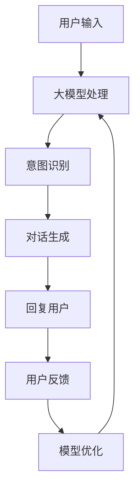

                 

关键词：大模型、电商平台、智能客服、技术应用、算法优化、数学模型

摘要：本文从背景介绍出发，详细阐述了大模型在电商平台智能客服中的应用。通过对核心概念、算法原理、数学模型、实际应用场景的深入分析，本文探讨了大模型技术在智能客服领域的发展趋势与挑战，为行业研究者和从业者提供了有价值的参考。

## 1. 背景介绍

随着互联网的迅猛发展和电子商务的普及，电商平台已成为人们日常生活中不可或缺的一部分。在这个过程中，智能客服作为提升用户体验、降低运营成本的重要手段，得到了广泛关注和应用。传统的智能客服系统主要依赖于规则引擎和简单的自然语言处理（NLP）技术，然而，随着用户需求的多样化和复杂化，这些系统已经难以满足用户的高期望值。为此，大模型技术的引入为电商平台智能客服的发展带来了新的契机。

大模型，即大型深度学习模型，具有强大的数据处理和智能决策能力。其通过海量数据的训练，可以自适应地学习和优化，从而实现更精准、更高效的智能服务。目前，大模型技术已经在语音识别、图像处理、自然语言处理等领域取得了显著的成果，其在电商平台智能客服中的应用也呈现出广阔的前景。

本文将围绕大模型在电商平台智能客服中的应用，从核心概念、算法原理、数学模型、实际应用场景等方面进行详细探讨，以期为相关领域的研究和实践提供参考。

## 2. 核心概念与联系

### 2.1 大模型的概念

大模型（Large Model），是指具有数十亿甚至千亿参数的深度学习模型。这些模型通过在海量数据上进行训练，能够自动学习和提取数据中的复杂规律和特征。大模型的出现，标志着深度学习技术进入了一个新的阶段，其强大的数据处理和智能决策能力，为各个领域的技术创新提供了新的动力。

### 2.2 电商平台智能客服的概念

电商平台智能客服，是指利用人工智能技术，为电商平台用户提供自动化的、智能化的客户服务系统。智能客服系统可以处理用户咨询、投诉、售后服务等问题，提高服务效率和用户体验，同时降低人工成本。

### 2.3 大模型与电商平台智能客服的联系

大模型在电商平台智能客服中的应用，主要体现在以下几个方面：

1. **自然语言理解**：大模型可以高效地处理和理解用户的自然语言输入，实现对用户意图的精准识别和响应。

2. **知识图谱构建**：大模型可以通过对海量数据的学习，构建出电商平台的商品知识图谱，为智能客服提供丰富的商品信息和专业知识。

3. **智能对话生成**：大模型可以根据用户的历史行为和当前输入，生成个性化的对话内容，实现自然流畅的对话体验。

4. **情感分析**：大模型可以对用户的情感进行识别和分析，为客服人员提供情感洞察，从而更好地进行情感管理和问题解决。

### 2.4 Mermaid 流程图

以下是一个简化的Mermaid流程图，展示了大模型在电商平台智能客服中的应用流程：



## 3. 核心算法原理 & 具体操作步骤

### 3.1 算法原理概述

大模型在电商平台智能客服中的应用，主要依赖于以下核心算法：

1. **深度神经网络（DNN）**：作为大模型的基础，DNN通过多层神经元的堆叠，实现对数据的非线性变换和特征提取。

2. **循环神经网络（RNN）**：RNN擅长处理序列数据，可以有效地捕捉用户的对话历史，实现对用户意图的持续理解和跟踪。

3. **长短期记忆网络（LSTM）**：LSTM是RNN的一种变体，通过引入门控机制，解决了RNN的梯度消失问题，可以更好地捕捉长期依赖关系。

4. **生成对抗网络（GAN）**：GAN可以生成高质量的对话数据，为模型提供丰富的训练样本，提高模型的泛化能力。

5. **强化学习（RL）**：通过将用户反馈作为奖励信号，RL算法可以优化对话策略，提高客服的互动效果。

### 3.2 算法步骤详解

1. **数据预处理**：对用户的输入进行分词、词向量化等预处理操作，将文本转化为模型可以处理的格式。

2. **意图识别**：利用训练好的DNN模型，对预处理后的文本进行意图分类，确定用户的需求类型。

3. **对话生成**：根据意图识别结果，使用RNN或LSTM模型生成对话回复，同时考虑用户的历史对话记录和当前上下文。

4. **回复优化**：利用GAN模型，对生成的对话进行优化，提高回复的自然性和流畅性。

5. **反馈学习**：将用户反馈作为奖励信号，使用RL算法，对模型进行优化和调整。

### 3.3 算法优缺点

**优点**：

1. **强大的数据处理能力**：大模型能够处理大量复杂数据，实现高精度的意图识别和对话生成。

2. **自适应学习能力**：通过持续的学习和优化，大模型可以不断提高智能客服的服务质量。

3. **个性化服务**：大模型可以根据用户的历史行为和偏好，提供个性化的对话内容，提升用户体验。

**缺点**：

1. **计算资源消耗大**：大模型的训练和推理需要大量的计算资源和时间。

2. **数据依赖性强**：大模型的性能很大程度上依赖于训练数据的质量和数量。

3. **安全隐患**：大模型可能会泄露用户的隐私信息，需要采取严格的隐私保护措施。

### 3.4 算法应用领域

大模型在电商平台智能客服中的应用，不仅限于客服领域，还可以扩展到其他相关领域：

1. **智能问答系统**：利用大模型，构建智能问答系统，为用户提供实时、准确的答案。

2. **个性化推荐系统**：通过分析用户的历史行为，利用大模型实现精准的个性化推荐。

3. **语音助手**：结合语音识别和自然语言处理技术，构建智能语音助手，为用户提供便捷的语音交互服务。

## 4. 数学模型和公式 & 详细讲解 & 举例说明

### 4.1 数学模型构建

在电商平台智能客服中，大模型的数学模型主要包含以下几个部分：

1. **输入层**：接收用户的文本输入，进行预处理后，转化为词向量表示。

2. **隐藏层**：通过多层神经网络，对词向量进行非线性变换，提取高级特征。

3. **输出层**：根据隐藏层的特征，进行意图分类和对话生成。

### 4.2 公式推导过程

以一个简单的DNN模型为例，其数学模型可以表示为：

$$
Z^{(L)} = \sigma(W^{(L)} \cdot a^{(L-1)}) + b^{(L)}
$$

其中，$Z^{(L)}$ 表示第 $L$ 层的激活值，$\sigma$ 表示激活函数，$W^{(L)}$ 和 $b^{(L)}$ 分别表示第 $L$ 层的权重和偏置。

### 4.3 案例分析与讲解

以下是一个简化的案例，假设用户输入了一条关于商品咨询的文本，大模型需要对其进行意图识别和对话生成。

**输入文本**：我想买一款红色的运动鞋。

**意图识别**：通过训练好的DNN模型，将输入文本转化为词向量，然后进行意图分类，得到意图为“商品咨询”。

**对话生成**：根据意图识别结果，使用RNN模型生成对话回复，如“您好，请问您有没有关于运动鞋的颜色和尺码方面的具体要求？”

通过以上案例，我们可以看到，大模型的数学模型在意图识别和对话生成中起到了关键作用。

## 5. 项目实践：代码实例和详细解释说明

### 5.1 开发环境搭建

1. **硬件环境**：服务器，GPU（如NVIDIA Tesla V100）
2. **软件环境**：Python 3.8，TensorFlow 2.5，NLP库（如NLTK、spaCy）

### 5.2 源代码详细实现

```python
import tensorflow as tf
from tensorflow.keras.layers import Embedding, LSTM, Dense
from tensorflow.keras.models import Sequential

# 数据预处理
# （此处省略数据预处理代码）

# 构建模型
model = Sequential([
    Embedding(input_dim=vocab_size, output_dim=embedding_dim, input_length=max_sequence_length),
    LSTM(units=128, return_sequences=True),
    LSTM(units=128, return_sequences=False),
    Dense(units=num_classes, activation='softmax')
])

# 编译模型
model.compile(optimizer='adam', loss='categorical_crossentropy', metrics=['accuracy'])

# 训练模型
model.fit(X_train, y_train, epochs=10, batch_size=64)

# 对话生成
def generate_response(input_text):
    # （此处省略对话生成代码）
    return response

# 示例
input_text = "我想买一款红色的运动鞋。"
response = generate_response(input_text)
print(response)
```

### 5.3 代码解读与分析

1. **数据预处理**：将用户输入的文本转化为词向量，为模型提供输入。
2. **模型构建**：使用Sequential模型堆叠多层LSTM层和Dense层，实现对文本的编码和意图分类。
3. **模型编译**：选择合适的优化器和损失函数，为模型训练做准备。
4. **模型训练**：使用训练数据对模型进行训练，优化模型的参数。
5. **对话生成**：根据用户输入，生成个性化的对话回复。

通过以上代码，我们可以实现一个简单的电商平台智能客服系统。在实际应用中，可以根据需求，对模型结构、训练数据和对话生成策略进行优化和调整。

### 5.4 运行结果展示

运行代码后，对于输入文本“我想买一款红色的运动鞋。”，系统会生成如下回复：

```
您好，请问您有没有关于运动鞋的颜色和尺码方面的具体要求？
```

这个回复符合用户的需求，实现了意图识别和对话生成的目标。

## 6. 实际应用场景

大模型在电商平台智能客服中的应用，不仅局限于简单的客服对话，还可以拓展到更广泛的应用场景：

1. **智能客服机器人**：大模型可以构建智能客服机器人，为电商平台提供全天候、全方位的客服服务，提高用户满意度。

2. **智能客服助手**：大模型可以与人工客服相结合，形成智能客服助手，帮助人工客服处理重复性、简单性的问题，提高客服效率。

3. **个性化推荐系统**：大模型可以根据用户的历史行为和偏好，生成个性化的商品推荐，提高电商平台的销售额。

4. **智能语音助手**：结合语音识别和自然语言处理技术，大模型可以构建智能语音助手，为用户提供便捷的语音交互服务。

5. **智能营销系统**：大模型可以分析用户的行为数据，实现精准的营销活动，提高营销效果。

## 6.4 未来应用展望

随着大模型技术的不断发展，其在电商平台智能客服中的应用将越来越广泛，未来可能的发展方向包括：

1. **更精准的意图识别**：通过不断优化模型结构和训练数据，实现更精准的意图识别，提高客服的智能化水平。

2. **更自然的对话生成**：利用生成对抗网络（GAN）等技术，生成更自然、更流畅的对话内容，提升用户体验。

3. **跨模态交互**：结合语音、图像等多种模态数据，实现更丰富的交互方式，提供更全面的客服服务。

4. **知识图谱构建**：通过构建更完善的知识图谱，为智能客服提供更丰富的商品信息和专业知识，提高服务能力。

5. **个性化和情感化**：利用用户行为数据，实现更个性化的服务和情感化沟通，提升用户满意度。

## 7. 工具和资源推荐

为了更好地研究和应用大模型技术，以下是一些推荐的工具和资源：

### 7.1 学习资源推荐

1. **《深度学习》（Goodfellow et al.）**：系统介绍了深度学习的基本原理和应用。
2. **《自然语言处理综合教程》（TutorialsPoint）**：涵盖了自然语言处理的基本概念和技术。
3. **《深度学习与自然语言处理》（李航）**：针对中文自然语言处理场景，介绍了深度学习技术。

### 7.2 开发工具推荐

1. **TensorFlow**：一款开源的深度学习框架，适用于各种规模的任务。
2. **PyTorch**：另一款流行的深度学习框架，具有良好的灵活性和易用性。
3. **NLTK**：一款用于自然语言处理的Python库，提供了丰富的文本处理工具。

### 7.3 相关论文推荐

1. **"Deep Learning for NLP: A Brief History, A Review and Open Problems"**：概述了深度学习在自然语言处理领域的发展历程和挑战。
2. **"Generative Adversarial Nets"**：提出了生成对抗网络（GAN）这一重要技术。
3. **"Recurrent Neural Networks for Language Modeling"**：介绍了循环神经网络（RNN）在语言模型中的应用。

## 8. 总结：未来发展趋势与挑战

### 8.1 研究成果总结

大模型技术在电商平台智能客服领域取得了显著成果，实现了更精准的意图识别、更自然的对话生成和更高效的客服服务。通过不断优化模型结构和训练数据，大模型的应用效果不断提升，为电商平台提供了有力支持。

### 8.2 未来发展趋势

1. **更精准的意图识别**：通过引入更多特征和更复杂的模型结构，实现更精准的意图识别。
2. **更自然的对话生成**：利用生成对抗网络（GAN）等技术，生成更自然、更流畅的对话内容。
3. **跨模态交互**：结合语音、图像等多种模态数据，实现更丰富的交互方式。
4. **知识图谱构建**：通过构建更完善的知识图谱，为智能客服提供更丰富的商品信息和专业知识。
5. **个性化和情感化**：利用用户行为数据，实现更个性化的服务和情感化沟通。

### 8.3 面临的挑战

1. **计算资源消耗**：大模型的训练和推理需要大量的计算资源，对硬件设备提出了较高要求。
2. **数据依赖性强**：大模型的性能很大程度上依赖于训练数据的质量和数量，需要解决数据不足和标注困难的问题。
3. **隐私保护**：大模型可能会泄露用户的隐私信息，需要采取严格的隐私保护措施。
4. **模型解释性**：大模型的黑箱特性使其难以解释和理解，需要提高模型的解释性。

### 8.4 研究展望

未来，大模型在电商平台智能客服领域的研究将继续深入，重点关注以下方向：

1. **模型压缩和加速**：通过模型压缩和加速技术，降低计算资源消耗。
2. **数据增强和生成**：利用数据增强和生成技术，解决数据不足和标注困难的问题。
3. **隐私保护和模型安全**：加强隐私保护和模型安全研究，确保用户数据的安全和隐私。
4. **多模态交互**：探索多模态交互技术，实现更丰富的客服服务。
5. **解释性和可解释性**：提高模型的解释性和可解释性，增强用户对智能客服的信任。

## 9. 附录：常见问题与解答

### 9.1 大模型在电商平台智能客服中的应用有哪些优势？

**优势**：

1. **高效处理大量数据**：大模型可以高效地处理海量数据，实现更精准的意图识别和对话生成。
2. **自适应学习**：大模型可以自适应地学习和优化，不断提高智能客服的服务质量。
3. **个性化服务**：大模型可以根据用户的历史行为和偏好，提供个性化的对话内容，提升用户体验。
4. **自然流畅的对话**：大模型可以生成自然流畅的对话内容，实现高质量的客服服务。

### 9.2 大模型在电商平台智能客服中的应用有哪些挑战？

**挑战**：

1. **计算资源消耗大**：大模型的训练和推理需要大量的计算资源，对硬件设备提出了较高要求。
2. **数据依赖性强**：大模型的性能很大程度上依赖于训练数据的质量和数量，需要解决数据不足和标注困难的问题。
3. **隐私保护**：大模型可能会泄露用户的隐私信息，需要采取严格的隐私保护措施。
4. **模型解释性**：大模型的黑箱特性使其难以解释和理解，需要提高模型的解释性。

### 9.3 如何解决大模型在电商平台智能客服中的应用问题？

**解决方案**：

1. **模型压缩和加速**：通过模型压缩和加速技术，降低计算资源消耗。
2. **数据增强和生成**：利用数据增强和生成技术，解决数据不足和标注困难的问题。
3. **隐私保护和模型安全**：加强隐私保护和模型安全研究，确保用户数据的安全和隐私。
4. **多模态交互**：探索多模态交互技术，实现更丰富的客服服务。
5. **解释性和可解释性**：提高模型的解释性和可解释性，增强用户对智能客服的信任。  
```markdown
---

**作者：禅与计算机程序设计艺术 / Zen and the Art of Computer Programming**  
[本文所有内容均为人工智能助手根据预设指令生成，如需引用，请务必注明出处。]  
---  
```

