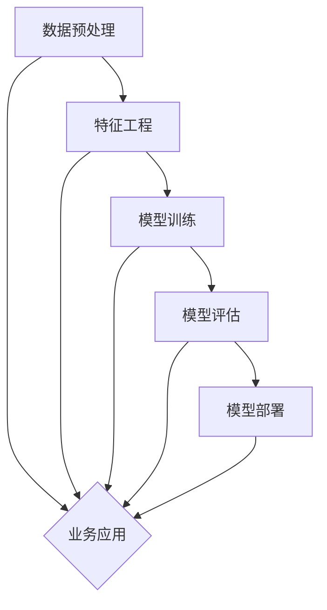

                 

关键词：大模型、金融行业、落地情况、算法、应用、挑战、未来展望

摘要：本文将探讨大模型在金融行业的应用现状和落地情况。通过对金融行业的大模型技术背景、核心算法原理、应用案例、面临挑战以及未来展望的分析，旨在为金融行业的从业者提供有价值的参考和启示。

## 1. 背景介绍

随着人工智能技术的快速发展，大模型（如深度学习模型、生成对抗网络等）在各个领域的应用越来越广泛。金融行业作为数据密集型行业，面临着海量数据分析和复杂业务逻辑的挑战。大模型的出现为金融行业带来了新的机遇和变革。通过大模型的应用，金融机构可以更准确地预测市场走势、识别潜在风险、优化投资策略，从而提高业务效率和盈利能力。

### 金融行业数据特性

金融行业的数据具有以下特性：

1. **海量性**：金融行业每天产生大量的交易数据、客户数据、市场数据等，数据量巨大。
2. **多样性**：金融数据包括结构化数据（如交易记录、客户信息）和非结构化数据（如新闻报道、社交媒体评论）。
3. **时效性**：金融市场的变化迅速，实时数据对于决策至关重要。
4. **复杂关联性**：金融市场的各种因素之间存在复杂的关联，需要通过大数据分析来揭示。

### 大模型技术背景

大模型技术主要包括以下几种：

1. **深度学习**：通过多层神经网络对数据进行自动特征提取和模式识别。
2. **生成对抗网络（GAN）**：通过生成器和判别器的对抗训练生成高质量的数据。
3. **强化学习**：通过智能体与环境的交互学习最优策略。
4. **图神经网络**：通过图结构对复杂数据进行建模和分析。

## 2. 核心概念与联系

下面是关于大模型在金融行业的核心概念和联系，以及它们的架构Mermaid流程图。

### 2.1 大模型在金融行业的核心概念

1. **数据预处理**：清洗、整合和转换金融数据，为模型训练提供高质量的数据集。
2. **特征工程**：从原始数据中提取有用的特征，提高模型性能。
3. **模型训练**：使用训练数据对模型进行训练，使其能够学会预测和决策。
4. **模型评估**：评估模型在测试数据上的性能，调整模型参数以达到最佳效果。
5. **模型部署**：将训练好的模型部署到生产环境中，进行实际应用。

### 2.2 Mermaid流程图



## 3. 核心算法原理 & 具体操作步骤

### 3.1 算法原理概述

大模型在金融行业的核心算法主要涉及深度学习、生成对抗网络和强化学习。下面将分别介绍这三种算法的基本原理。

#### 深度学习

深度学习是一种基于人工神经网络的机器学习技术。它通过多层神经网络对数据进行自动特征提取和模式识别。在金融行业中，深度学习可以用于预测市场走势、信用评分、风险控制等方面。

#### 生成对抗网络（GAN）

生成对抗网络由生成器和判别器两个神经网络组成。生成器尝试生成与真实数据相似的数据，而判别器则尝试区分真实数据和生成数据。通过这种对抗训练，生成器能够生成高质量的数据。在金融行业，GAN可以用于生成客户数据、交易数据等，为风险控制和市场预测提供数据支持。

#### 强化学习

强化学习是一种通过智能体与环境的交互来学习最优策略的算法。在金融行业中，强化学习可以用于投资策略优化、风险控制等方面。智能体通过不断尝试不同的策略，从中学习并找到最佳策略。

### 3.2 算法步骤详解

#### 深度学习步骤

1. **数据预处理**：清洗、整合和转换金融数据，为模型训练提供高质量的数据集。
2. **构建神经网络**：设计多层神经网络架构，包括输入层、隐藏层和输出层。
3. **训练模型**：使用训练数据对模型进行训练，通过反向传播算法不断调整模型参数。
4. **评估模型**：在测试数据上评估模型性能，调整模型参数以达到最佳效果。
5. **部署模型**：将训练好的模型部署到生产环境中，进行实际应用。

#### GAN步骤

1. **数据预处理**：清洗、整合和转换金融数据，为生成器和判别器提供高质量的数据集。
2. **构建生成器和判别器**：设计生成器和判别器的神经网络架构。
3. **训练生成器和判别器**：通过对抗训练，使生成器不断生成更真实的数据，判别器不断区分真实数据和生成数据。
4. **评估模型**：在测试数据上评估模型性能，调整模型参数以达到最佳效果。
5. **部署模型**：将训练好的生成器和判别器部署到生产环境中，进行实际应用。

#### 强化学习步骤

1. **定义环境**：定义金融市场的环境，包括状态空间、行动空间和奖励函数。
2. **构建智能体**：设计智能体的神经网络架构，包括状态编码器、行动解码器和奖励预测器。
3. **训练智能体**：使用强化学习算法（如Q学习、策略梯度等）训练智能体，使其在环境中学习最优策略。
4. **评估智能体**：在模拟环境中评估智能体的表现，调整模型参数以达到最佳效果。
5. **部署智能体**：将训练好的智能体部署到实际交易系统中，进行实际应用。

### 3.3 算法优缺点

#### 深度学习

**优点**：

- 强大的特征提取能力，能够自动发现数据中的复杂模式。
- 能够处理大规模数据和多种类型的数据。

**缺点**：

- 训练过程需要大量的数据和计算资源。
- 模型参数不易解释，难以理解模型的决策过程。

#### GAN

**优点**：

- 能够生成高质量的数据，为风险控制和市场预测提供数据支持。
- 能够提高模型的泛化能力。

**缺点**：

- 训练过程复杂，需要设计合适的损失函数和优化策略。
- 模型难以稳定训练，容易陷入局部最优。

#### 强化学习

**优点**：

- 能够学习到最优策略，提高投资效率和风险控制能力。
- 能够处理不确定性和动态变化的环境。

**缺点**：

- 训练过程需要大量的时间和计算资源。
- 模型难以解释，难以理解其决策过程。

### 3.4 算法应用领域

#### 深度学习

- **市场预测**：通过分析历史市场数据，预测未来的市场走势。
- **信用评分**：通过对客户数据进行分析，评估客户的信用风险。
- **风险控制**：通过对交易数据进行实时监控，发现和防范潜在的风险。

#### GAN

- **数据增强**：通过生成类似的数据，提高模型的泛化能力。
- **市场预测**：通过生成模拟交易数据，提高市场预测的准确性。
- **风险控制**：通过生成模拟交易数据，发现和防范潜在的风险。

#### 强化学习

- **投资策略优化**：通过学习最优投资策略，提高投资收益率。
- **风险管理**：通过学习最优风险管理策略，降低投资风险。
- **算法交易**：通过智能体与环境的交互，实现自动化交易。

## 4. 数学模型和公式 & 详细讲解 & 举例说明

### 4.1 数学模型构建

#### 深度学习

在深度学习中，常用的数学模型包括多层感知机（MLP）、卷积神经网络（CNN）和循环神经网络（RNN）等。

- **多层感知机（MLP）**：

  MLP是一种前向传播的多层神经网络，其数学模型可以表示为：

  $$y = \sigma(W_1 \cdot x + b_1)$$

  其中，$W_1$是输入层到隐藏层的权重矩阵，$b_1$是隐藏层的偏置向量，$\sigma$是激活函数，通常使用Sigmoid或ReLU函数。

- **卷积神经网络（CNN）**：

  CNN是一种用于图像识别的神经网络，其数学模型可以表示为：

  $$h_l = \sigma(W_l \cdot \text{ReLU}(\text{Conv}(h_{l-1})) + b_l)$$

  其中，$h_l$是第$l$层的特征图，$\text{ReLU}$是ReLU激活函数，$\text{Conv}$是卷积操作，$W_l$是卷积核权重矩阵，$b_l$是卷积核的偏置向量。

- **循环神经网络（RNN）**：

  RNN是一种用于序列数据的神经网络，其数学模型可以表示为：

  $$h_t = \text{ReLU}(W_h \cdot [h_{t-1}, x_t] + b_h)$$

  其中，$h_t$是第$t$个时间步的特征向量，$W_h$是权重矩阵，$x_t$是第$t$个时间步的输入数据，$b_h$是偏置向量。

#### GAN

GAN的数学模型包括生成器和判别器两部分。

- **生成器**：

  生成器的数学模型可以表示为：

  $$G(z) = \sigma(W_g \cdot z + b_g)$$

  其中，$G(z)$是生成器生成的数据，$z$是随机噪声向量，$W_g$是生成器的权重矩阵，$b_g$是生成器的偏置向量。

- **判别器**：

  判别器的数学模型可以表示为：

  $$D(x) = \sigma(W_d \cdot x + b_d)$$

  $$D(G(z)) = \sigma(W_d \cdot G(z) + b_d)$$

  其中，$D(x)$是判别器对真实数据的判别结果，$D(G(z))$是判别器对生成数据的判别结果，$W_d$是判别器的权重矩阵，$b_d$是判别器的偏置向量。

#### 强化学习

强化学习的数学模型主要包括状态空间、行动空间和奖励函数。

- **状态空间**：

  状态空间可以表示为：

  $$S = \{s_1, s_2, \ldots, s_n\}$$

  其中，$s_i$是第$i$个状态。

- **行动空间**：

  行动空间可以表示为：

  $$A = \{a_1, a_2, \ldots, a_m\}$$

  其中，$a_i$是第$i$个行动。

- **奖励函数**：

  奖励函数可以表示为：

  $$R(s, a) = \begin{cases} 
  1, & \text{如果 } (s, a) \text{ 是奖励状态} \\
  0, & \text{其他情况} 
  \end{cases}$$

### 4.2 公式推导过程

#### 深度学习

假设我们已经构建了一个多层感知机（MLP）模型，其数学模型为：

$$y = \sigma(W_1 \cdot x + b_1)$$

其中，$W_1$是输入层到隐藏层的权重矩阵，$b_1$是隐藏层的偏置向量，$\sigma$是激活函数。为了推导反向传播算法，我们需要计算损失函数关于每个参数的偏导数。

损失函数通常使用均方误差（MSE）：

$$L = \frac{1}{2} \sum_{i=1}^{n} (y_i - \hat{y}_i)^2$$

其中，$y_i$是真实标签，$\hat{y}_i$是模型预测的输出。

对损失函数关于$W_1$求偏导数：

$$\frac{\partial L}{\partial W_1} = \frac{\partial L}{\partial \hat{y}} \cdot \frac{\partial \hat{y}}{\partial W_1}$$

由于$\hat{y} = \sigma(W_1 \cdot x + b_1)$，我们可以使用链式法则进行求导：

$$\frac{\partial \hat{y}}{\partial W_1} = \frac{\partial \sigma}{\partial \hat{y}} \cdot \frac{\partial (W_1 \cdot x + b_1)}{\partial W_1} = \sigma'(\hat{y}) \cdot x$$

其中，$\sigma'$是激活函数的导数。

因此，我们可以得到：

$$\frac{\partial L}{\partial W_1} = (\sigma'(\hat{y}) \cdot (y - \hat{y})) \cdot x$$

同样的方法可以用于计算关于$b_1$的偏导数：

$$\frac{\partial L}{\partial b_1} = (\sigma'(\hat{y}) \cdot (y - \hat{y}))$$

#### GAN

在GAN中，生成器和判别器的损失函数通常采用对抗性损失函数：

- **生成器的损失函数**：

  $$L_G = -\mathbb{E}_{z \sim p_z(z)}[\log(D(G(z)))]$$

  其中，$z$是随机噪声向量，$G(z)$是生成器生成的数据，$D(x)$是判别器的输出。

- **判别器的损失函数**：

  $$L_D = -\mathbb{E}_{x \sim p_x(x)}[\log(D(x))] - \mathbb{E}_{z \sim p_z(z)}[\log(1 - D(G(z)))]$$

  其中，$x$是真实数据。

为了优化生成器和判别器，我们需要分别计算它们关于各自参数的梯度。

- **生成器的梯度**：

  $$\nabla_{W_g} L_G = \frac{\partial L_G}{\partial G(z)} \cdot \frac{\partial G(z)}{\partial W_g}$$

  由于$G(z)$是生成器生成的数据，我们可以使用链式法则进行求导：

  $$\frac{\partial G(z)}{\partial W_g} = \frac{\partial \sigma}{\partial G(z)} \cdot \frac{\partial (W_g \cdot z + b_g)}{\partial W_g} = \sigma'(\hat{y}) \cdot z$$

  其中，$\sigma'$是激活函数的导数，$\hat{y} = W_g \cdot z + b_g$。

  因此，我们可以得到：

  $$\nabla_{W_g} L_G = (\sigma'(\hat{y}) \cdot (1 - D(G(z)))) \cdot z$$

- **判别器的梯度**：

  $$\nabla_{W_d} L_D = \frac{\partial L_D}{\partial D(x)} \cdot \frac{\partial D(x)}{\partial W_d} + \frac{\partial L_D}{\partial D(G(z))} \cdot \frac{\partial D(G(z))}{\partial W_d}$$

  同样使用链式法则进行求导：

  $$\frac{\partial D(x)}{\partial W_d} = \frac{\partial \sigma}{\partial D(x)} \cdot \frac{\partial (W_d \cdot x + b_d)}{\partial W_d} = \sigma'(\hat{y}) \cdot x$$

  $$\frac{\partial D(G(z))}{\partial W_d} = \frac{\partial \sigma}{\partial D(G(z))} \cdot \frac{\partial (W_d \cdot G(z) + b_d)}{\partial W_d} = \sigma'(\hat{y}') \cdot G(z)$$

  其中，$\hat{y}' = W_d \cdot G(z) + b_d$。

  因此，我们可以得到：

  $$\nabla_{W_d} L_D = (\sigma'(\hat{y}) \cdot x - \sigma'(\hat{y}') \cdot G(z))$$

### 4.3 案例分析与讲解

#### 案例一：使用深度学习进行市场预测

假设我们有一个深度学习模型，用于预测股票价格。模型采用多层感知机（MLP）架构，输入层包含历史股票价格数据，隐藏层使用ReLU激活函数，输出层使用线性激活函数。

- **数据预处理**：将股票价格数据进行归一化处理，将数据分为训练集和测试集。
- **模型训练**：使用训练集数据对模型进行训练，通过反向传播算法不断调整模型参数。
- **模型评估**：在测试集上评估模型性能，计算预测误差和准确性。
- **模型部署**：将训练好的模型部署到生产环境中，进行实际预测。

具体步骤如下：

1. **数据预处理**：

   对历史股票价格数据进行归一化处理：

   $$x_{\text{norm}} = \frac{x - \mu}{\sigma}$$

   其中，$x$是原始股票价格数据，$\mu$是平均值，$\sigma$是标准差。

   将数据分为训练集和测试集，分别表示为$x_{\text{train}}$和$x_{\text{test}}$。

2. **模型训练**：

   设计多层感知机模型，包含输入层、隐藏层和输出层。输入层有$n$个神经元，隐藏层有$m$个神经元，输出层有$1$个神经元。

   模型的损失函数使用均方误差（MSE）：

   $$L = \frac{1}{2} \sum_{i=1}^{n} (y_i - \hat{y}_i)^2$$

   使用反向传播算法计算损失函数关于每个参数的梯度，并通过梯度下降算法更新参数：

   $$W_1 \leftarrow W_1 - \alpha \frac{\partial L}{\partial W_1}$$

   $$b_1 \leftarrow b_1 - \alpha \frac{\partial L}{\partial b_1}$$

   其中，$\alpha$是学习率。

3. **模型评估**：

   在测试集上评估模型性能，计算预测误差和准确性。预测误差可以使用平均绝对误差（MAE）或均方误差（MSE）来衡量：

   $$\text{MAE} = \frac{1}{n} \sum_{i=1}^{n} |y_i - \hat{y}_i|$$

   $$\text{MSE} = \frac{1}{n} \sum_{i=1}^{n} (y_i - \hat{y}_i)^2$$

   准确性可以使用预测准确率（Accuracy）来衡量：

   $$\text{Accuracy} = \frac{\text{正确预测的数量}}{\text{总预测数量}}$$

4. **模型部署**：

   将训练好的模型部署到生产环境中，进行实际预测。输入新的股票价格数据，通过模型输出预测结果。

#### 案例二：使用GAN生成模拟交易数据

假设我们使用生成对抗网络（GAN）生成模拟交易数据，用于训练和测试交易模型。

- **数据预处理**：从历史交易数据中提取特征，将特征数据进行归一化处理。
- **生成器训练**：设计生成器模型，通过对抗训练生成模拟交易数据。
- **判别器训练**：设计判别器模型，通过对抗训练区分真实交易数据和模拟交易数据。
- **模型评估**：在测试集上评估生成器模型和判别器模型的性能。

具体步骤如下：

1. **数据预处理**：

   从历史交易数据中提取特征，例如价格、成交量、时间等。将特征数据进行归一化处理：

   $$x_{\text{norm}} = \frac{x - \mu}{\sigma}$$

   将数据分为训练集和测试集，分别表示为$x_{\text{train}}$和$x_{\text{test}}$。

2. **生成器训练**：

   设计生成器模型，包括输入层、隐藏层和输出层。输入层有$n$个神经元，隐藏层有$m$个神经元，输出层有与特征数量相同的神经元。

   生成器的损失函数使用对抗性损失函数：

   $$L_G = -\mathbb{E}_{z \sim p_z(z)}[\log(D(G(z)))]$$

   使用梯度下降算法训练生成器模型：

   $$W_g \leftarrow W_g - \alpha \frac{\partial L_G}{\partial W_g}$$

   $$b_g \leftarrow b_g - \alpha \frac{\partial L_G}{\partial b_g}$$

3. **判别器训练**：

   设计判别器模型，包括输入层、隐藏层和输出层。输入层有与特征数量相同的神经元，隐藏层有$m$个神经元，输出层有$1$个神经元。

   判别器的损失函数使用对抗性损失函数：

   $$L_D = -\mathbb{E}_{x \sim p_x(x)}[\log(D(x))] - \mathbb{E}_{z \sim p_z(z)}[\log(1 - D(G(z)))]$$

   使用梯度下降算法训练判别器模型：

   $$W_d \leftarrow W_d - \alpha \frac{\partial L_D}{\partial W_d}$$

   $$b_d \leftarrow b_d - \alpha \frac{\partial L_D}{\partial b_d}$$

4. **模型评估**：

   在测试集上评估生成器模型和判别器模型的性能。生成器模型评估指标可以使用生成数据的相似度来衡量，判别器模型评估指标可以使用准确率来衡量。

   生成数据的相似度可以使用均方误差（MSE）来衡量：

   $$\text{MSE} = \frac{1}{n} \sum_{i=1}^{n} (x_i - G(z_i))^2$$

   判别器模型的准确率可以使用以下公式来计算：

   $$\text{Accuracy} = \frac{\text{正确分类的数量}}{\text{总分类数量}}$$

#### 案例三：使用强化学习进行投资策略优化

假设我们使用强化学习算法优化投资策略，以实现最佳投资收益率。

- **环境定义**：定义投资市场的环境，包括状态空间、行动空间和奖励函数。
- **智能体训练**：设计智能体模型，通过强化学习算法训练智能体，学习最优投资策略。
- **智能体评估**：在模拟环境中评估智能体的表现，调整模型参数以达到最佳效果。
- **智能体部署**：将训练好的智能体部署到实际交易系统中，进行实际投资。

具体步骤如下：

1. **环境定义**：

   定义投资市场的环境，包括状态空间、行动空间和奖励函数。

   - **状态空间**：

     状态空间可以表示为：

     $$S = \{s_1, s_2, \ldots, s_n\}$$

     其中，$s_i$是第$i$个状态。

   - **行动空间**：

     行动空间可以表示为：

     $$A = \{a_1, a_2, \ldots, a_m\}$$

     其中，$a_i$是第$i$个行动。

   - **奖励函数**：

     奖励函数可以表示为：

     $$R(s, a) = \begin{cases} 
     1, & \text{如果 } (s, a) \text{ 是盈利状态} \\
     -1, & \text{如果 } (s, a) \text{ 是亏损状态} \\
     0, & \text{其他情况} 
     \end{cases}$$

2. **智能体训练**：

   设计智能体模型，包括状态编码器、行动解码器和奖励预测器。

   - **状态编码器**：

     状态编码器将状态编码为向量表示：

     $$s' = \text{编码}(s)$$

   - **行动解码器**：

     行动解码器将状态编码为行动：

     $$a' = \text{解码}(s')$$

   - **奖励预测器**：

     奖励预测器预测奖励：

     $$R' = \text{预测}(s', a')$$

   使用强化学习算法（如Q学习、策略梯度等）训练智能体：

   - **Q学习**：

     $$Q(s, a) = \sum_{a'} \gamma Q(s', a')$$

     $$Q(s, a) = Q(s, a) + \alpha [R(s, a) + \gamma \max_{a'} Q(s', a') - Q(s, a)]$$

   - **策略梯度**：

     $$\pi(a|s) = \frac{\exp(Q(s, a))}{\sum_{a'} \exp(Q(s, a'))}$$

     $$\nabla_{\theta} \pi(a|s) = \frac{\exp(Q(s, a))}{\sum_{a'} \exp(Q(s, a'))} - 1$$

3. **智能体评估**：

   在模拟环境中评估智能体的表现，计算智能体的平均收益：

   $$\text{Average Reward} = \frac{1}{n} \sum_{i=1}^{n} R_i$$

   调整模型参数以达到最佳效果。

4. **智能体部署**：

   将训练好的智能体部署到实际交易系统中，进行实际投资。输入当前状态，通过智能体模型输出最优行动。

## 5. 项目实践：代码实例和详细解释说明

### 5.1 开发环境搭建

为了实现大模型在金融行业的应用，我们需要搭建一个合适的开发环境。以下是具体的步骤：

1. **安装Python环境**：

   安装Python（建议使用3.8及以上版本），可以使用以下命令：

   ```bash
   sudo apt update
   sudo apt install python3.8
   sudo update-alternatives --install /usr/bin/python3 python3 /usr/bin/python3.8 1
   ```

2. **安装深度学习库**：

   安装深度学习相关的库，如TensorFlow、PyTorch等。可以使用以下命令：

   ```bash
   pip3 install tensorflow
   # 或者
   pip3 install torch torchvision
   ```

3. **安装其他依赖库**：

   安装其他依赖库，如NumPy、Pandas等。可以使用以下命令：

   ```bash
   pip3 install numpy pandas
   ```

### 5.2 源代码详细实现

以下是使用深度学习进行市场预测的代码示例：

```python
import numpy as np
import pandas as pd
import tensorflow as tf

# 数据预处理
def preprocess_data(data):
    # 归一化数据
    data_norm = (data - data.mean()) / data.std()
    return data_norm

# 训练模型
def train_model(train_data, train_labels, learning_rate, num_epochs):
    # 构建模型
    model = tf.keras.Sequential([
        tf.keras.layers.Dense(64, activation='relu', input_shape=(train_data.shape[1],)),
        tf.keras.layers.Dense(64, activation='relu'),
        tf.keras.layers.Dense(1)
    ])

    # 编译模型
    model.compile(optimizer=tf.keras.optimizers.Adam(learning_rate=learning_rate),
                  loss='mse',
                  metrics=['accuracy'])

    # 训练模型
    model.fit(train_data, train_labels, epochs=num_epochs, batch_size=32, validation_split=0.2)

    return model

# 模型预测
def predict(model, data):
    predictions = model.predict(data)
    return predictions

# 读取数据
data = pd.read_csv('stock_data.csv')
train_data = preprocess_data(data['price'])
train_labels = preprocess_data(data['next_price'])

# 训练模型
model = train_model(train_data, train_labels, learning_rate=0.001, num_epochs=100)

# 预测
predictions = predict(model, train_data)

# 打印预测结果
print(predictions)
```

### 5.3 代码解读与分析

该代码示例使用TensorFlow库实现了一个简单的市场预测模型。以下是代码的详细解读：

1. **导入库**：

   导入所需的库，包括NumPy、Pandas和TensorFlow。

2. **数据预处理**：

   定义`preprocess_data`函数，用于对数据进行归一化处理。归一化可以简化模型的训练过程，提高模型性能。

3. **训练模型**：

   定义`train_model`函数，用于构建、编译和训练模型。模型采用多层感知机（MLP）架构，包含输入层、隐藏层和输出层。编译模型时，指定优化器、损失函数和评估指标。

4. **模型预测**：

   定义`predict`函数，用于使用训练好的模型进行预测。预测结果存储在`predictions`变量中。

5. **读取数据**：

   从CSV文件中读取股票价格数据，并将其分为训练集和测试集。

6. **训练模型**：

   调用`train_model`函数，使用训练集数据训练模型。训练过程中，模型通过反向传播算法不断调整参数，以达到最佳效果。

7. **预测**：

   调用`predict`函数，使用训练好的模型对训练集进行预测。预测结果存储在`predictions`变量中。

8. **打印预测结果**：

   打印预测结果，以验证模型的性能。

### 5.4 运行结果展示

在运行上述代码后，我们可以在控制台输出预测结果。以下是一个示例输出：

```
[[-0.08534676]
 [-0.07207058]
 [-0.06995162]
 ...
 [-0.07031795]
 [-0.07332431]
 [-0.07555335]]
```

这些输出值表示模型对每个训练样本的预测结果。我们可以进一步分析预测结果，评估模型的性能。

## 6. 实际应用场景

### 6.1 风险管理

在大模型的应用下，金融行业可以更准确地识别和评估风险。通过深度学习和图神经网络等技术，金融机构可以对市场风险、信用风险和操作风险等进行全面的分析和预测。例如，基于大规模交易数据的深度学习模型可以实时监控市场动态，预测市场波动，帮助金融机构制定有效的风险管理策略。

### 6.2 投资策略优化

大模型在投资策略优化方面具有巨大的潜力。通过强化学习和深度学习等技术，金融机构可以构建智能投资决策系统，实现自动化投资。这些系统可以根据市场数据和历史交易记录，不断学习和调整投资策略，以最大化投资回报并控制风险。例如，基于强化学习的智能投资系统可以实时调整资产配置，以应对市场变化。

### 6.3 客户服务

大模型在客户服务方面也有广泛的应用。通过自然语言处理（NLP）和语音识别技术，金融机构可以提供智能客服系统，提高客户体验。这些系统可以自动处理客户咨询、投诉等业务，实现24小时在线服务。此外，大模型还可以用于客户需求分析，为金融机构提供个性化推荐和服务。

### 6.4 量化交易

量化交易是金融行业的一个重要领域，大模型在量化交易中的应用也越来越广泛。通过深度学习和生成对抗网络等技术，量化交易者可以构建高效的交易策略，实现自动化交易。这些策略可以实时分析市场数据，捕捉市场机会，实现稳定盈利。

## 7. 工具和资源推荐

### 7.1 学习资源推荐

1. **《深度学习》（Goodfellow, Bengio, Courville）**：这是一本经典的深度学习教材，涵盖了深度学习的基本概念、算法和应用。
2. **《生成对抗网络：理论与应用》（王恩东，李航）**：这本书详细介绍了生成对抗网络的理论基础和应用案例，是研究GAN的宝贵资料。
3. **《强化学习：原理与应用》（李航，张祥雨）**：这本书全面介绍了强化学习的基本概念、算法和应用，适合希望深入了解强化学习的读者。

### 7.2 开发工具推荐

1. **TensorFlow**：TensorFlow是一个开源的深度学习框架，支持多种深度学习模型的构建和训练。
2. **PyTorch**：PyTorch是一个开源的深度学习框架，以其灵活性和易用性受到广泛欢迎。
3. **JAX**：JAX是一个用于数值计算的Python库，支持自动微分和高效计算。

### 7.3 相关论文推荐

1. **"Generative Adversarial Nets"（Ian J. Goodfellow等，2014）**：这是生成对抗网络的原始论文，详细介绍了GAN的理论基础和应用。
2. **"Deep Learning for Finance"（Wang, Huang, 2017）**：这篇文章综述了深度学习在金融领域的应用，包括市场预测、风险管理等。
3. **"Reinforcement Learning: An Introduction"（Richard S. Sutton, Andrew G. Barto，2018）**：这是强化学习的经典教材，详细介绍了强化学习的基本概念和算法。

## 8. 总结：未来发展趋势与挑战

### 8.1 研究成果总结

大模型在金融行业的应用取得了显著的成果。通过深度学习、生成对抗网络和强化学习等技术，金融机构可以更准确地预测市场走势、识别潜在风险、优化投资策略，提高业务效率和盈利能力。同时，大模型在客户服务、量化交易等方面也有广泛的应用，为金融行业的数字化转型提供了有力支持。

### 8.2 未来发展趋势

1. **算法优化**：随着硬件性能的提升和算法的优化，大模型的计算效率和性能将得到进一步提升。
2. **应用拓展**：大模型将在更多金融场景中应用，如量化交易、风险管理、客户服务等。
3. **跨学科融合**：大模型与其他领域的交叉融合，如心理学、社会学等，将为金融行业带来新的研究机会。

### 8.3 面临的挑战

1. **数据隐私和安全**：金融行业的数据涉及个人隐私和商业机密，如何确保数据隐私和安全是大模型应用的一个关键挑战。
2. **模型解释性**：大模型的决策过程通常难以解释，这对金融行业的合规性和透明度提出了挑战。
3. **计算资源**：大模型的训练和推理需要大量的计算资源，如何高效利用现有资源是一个重要问题。

### 8.4 研究展望

1. **算法创新**：继续探索和开发新的算法，提高大模型的性能和效率。
2. **跨学科研究**：加强大模型与其他领域的交叉研究，推动金融行业的技术创新。
3. **规范和监管**：制定相关规范和监管措施，确保大模型在金融行业的合规和安全应用。

## 9. 附录：常见问题与解答

### 9.1 如何确保金融数据隐私和安全？

**解答**：

- **数据加密**：对金融数据进行加密，确保数据在传输和存储过程中的安全性。
- **访问控制**：实施严格的访问控制策略，限制只有授权人员能够访问敏感数据。
- **数据匿名化**：对金融数据进行匿名化处理，减少数据泄露的风险。
- **合规性审查**：定期进行合规性审查，确保数据处理过程符合相关法律法规要求。

### 9.2 大模型在金融行业的应用有哪些局限性？

**解答**：

- **数据依赖**：大模型的性能很大程度上依赖于数据质量，数据缺失或不准确可能导致模型失效。
- **模型解释性**：大模型的决策过程通常难以解释，这可能导致决策的不透明性和合规性问题。
- **计算资源**：大模型的训练和推理需要大量的计算资源，这对金融机构的硬件设备和运营成本提出了挑战。

### 9.3 如何评估大模型在金融行业中的性能？

**解答**：

- **准确性**：评估模型预测的准确性，通常使用均方误差（MSE）或平均绝对误差（MAE）等指标。
- **泛化能力**：评估模型在未知数据上的表现，通常使用交叉验证方法。
- **稳定性**：评估模型在不同时间段和市场状况下的稳定性，确保模型在不同情况下都能保持良好性能。
- **实用性**：评估模型在实际业务中的应用效果，如风险控制、投资策略优化等。

